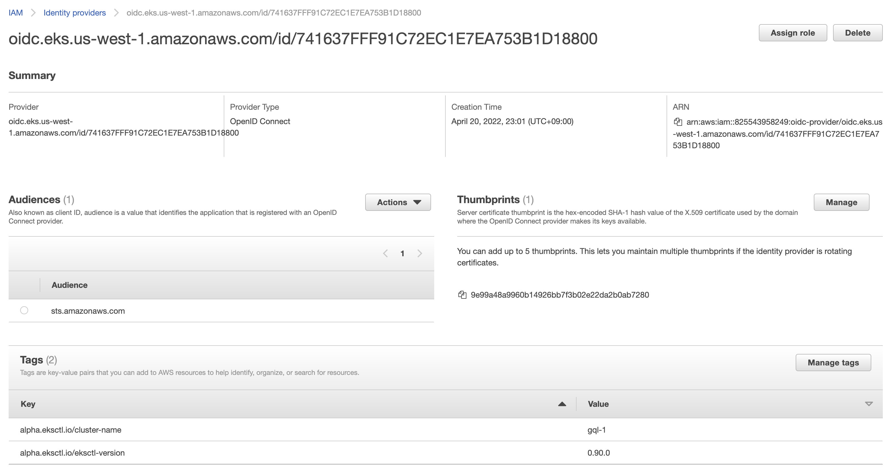
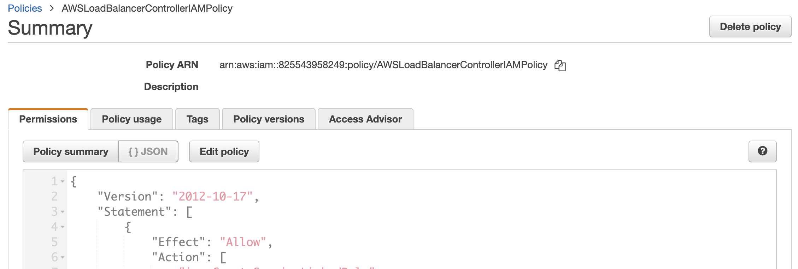
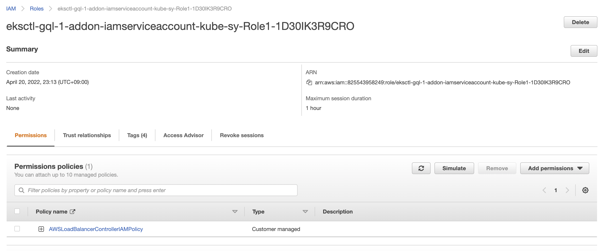

# Deployment Guide on AWS

This document explains how to deploy ScalarDB GraphQL servers on the Amazon EKS environment.

We will deploy multiple GraphQL servers to an EKS cluster with an [AWS Load Balancer Controller](https://docs.aws.amazon.com/eks/latest/userguide/aws-load-balancer-controller.html), which manages an internal AWS Application Load Balancer. The AWS Application Load Balancer handles HTTP cookie-based session affinity. When we deploy multiple GraphQL servers, session affinity is required to handle transactions properly. This is because GraphQL servers keep the transactions in memory, so GraphQL queries that use continued transactions must be routed to the same server that started the transaction.

## What we create

In this guide, we will create the following components.

* A VPC with NAT gateway
* An EKS cluster with a Kubernetes node group
* A managed database service
* A bastion instance with a public IP
* An internal ALB for load balancing HTTP requests using the [AWS Load Balancer Controller](https://docs.aws.amazon.com/eks/latest/userguide/aws-load-balancer-controller.html).

## Step 1. Configure an EKS cluster

Please follow steps **1** to **3** in the [Deploy Scalar DL on AWS](https://github.com/scalar-labs/scalar-kubernetes/blob/master/docs/ManualDeploymentGuideScalarDLOnAWS.md) guide to set up a VPC, subnets, a bastion host, a database, an EKS cluster, and a node group.

**Note:** That guide instructs to add a label to the node group with a key `agentpool` and a value `scalardlpool`. However, since we will deploy GraphQL servers, not Scalar DL, we should change the label. For example, the node group can be labeled with a key `agentpool` and a value `scalardbgraphqlpool`. The label can be used to select nodes when deploying ScalarDB GraphQL servers.

In this document, a placeholder cluster name `<your-cluster-name>` will be used in command examples. Please change it to your cluster name.

## Step 2. Load Database Schema

We need to load a database schema to the database before starting ScalarDB GraphQL.

Here is an example for DynamoDB. For other databases and more detailed instructions, please refer to the [ScalarDB Schema Loader](https://github.com/scalar-labs/scalardb/blob/master/docs/schema-loader.md).

1. Create a `database.properties` configuration file for DynamoDB

    ```properties
    scalar.db.contact_points=<AWS region>
    scalar.db.username=<AWS access key ID>
    scalar.db.password=<AWS secret access Key>
    scalar.db.storage=dynamo
    ```

2. Create a `schema.json` file. Please refer to the sample in the [ScalarDB Schema Loader](https://github.com/scalar-labs/scalardb/blob/master/schema-loader) document.

3. Load the schema to the database with ScalarDB Schema Loader

    ```console
    docker run --rm -v $PWD/schema.json:/schema.json \
      -v $PWD/database.properties:/database.properties \
      ghcr.io/scalar-labs/scalardb-schema-loader:3.5.2 \
      -c /database.properties -f /schema.json --coordinator
    ```

## Step 3. Install eksctl

Log in to the bastion host and install the `eksctl` command by following the official documents.

* [Introduction - eksctl](https://eksctl.io/introduction/#installation)
* [Installing eksctl - Amazon EKS](https://docs.aws.amazon.com/eks/latest/userguide/eksctl.html)

We also need to install AWS CLI and configure AWS API credentials.

* [AWS Command Line Interface](https://aws.amazon.com/cli/)

## Step 4. Install the AWS Load Balancer Controller add-on to EKS

The AWS Load Balancer Controller is a controller to manage AWS Elastic Load Balancers for a Kubernetes cluster.

We use it to create an AWS Application Load Balancer (ALB) in front of multiple GraphQL servers in the cluster. When we create a Kubernetes **Ingress** resource in the cluster, the controller provisions an ALB according to it.

In this section, we will install the controller according to the official installation documents below.

* [Installing the AWS Load Balancer Controller add-on - Amazon EKS](https://docs.aws.amazon.com/eks/latest/userguide/aws-load-balancer-controller.html)
* [Installation Guide - AWS Load Balancer Controller](https://kubernetes-sigs.github.io/aws-load-balancer-controller/v2.4/deploy/installation/)

### Set up IAM Permissions

We need to set up IAM permissions before installing the AWS Load Balancer Controller so that the controller running on the worker nodes can manage ALBs on AWS.

1. Create IAM OpenID Connect (OIDC) provider

    ```console
    eksctl utils associate-iam-oidc-provider --cluster <your-cluster-name> --approve
    ```

    In the AWS Management Console, we can see an IAM Identity provider has been created.

    

2. Download the IAM policy document for the AWS Load Balancer Controller

    ```console
    curl -o iam-policy.json https://raw.githubusercontent.com/kubernetes-sigs/aws-load-balancer-controller/v2.4.1/docs/install/iam_policy.json
    ```

3. Create an IAM policy named `AWSLoadBalancerControllerIAMPolicy`

    ```console
    aws iam create-policy \
      --policy-name AWSLoadBalancerControllerIAMPolicy \
      --policy-document file://iam-policy.json
    ```

    Please take note of the policy ARN created with the command, as we will specify it in the next step.

    In the AWS Management Console, we can see an IAM Policy has been created.

    

4. Create an IAM role and ServiceAccount for the AWS Load Balancer controller

    ```console
    eksctl create iamserviceaccount \
      --cluster=<your-cluster-name> \
      --namespace=kube-system \
      --name=aws-load-balancer-controller \
      --attach-policy-arn=arn:aws:iam::<AWS account ID>:policy/AWSLoadBalancerControllerIAMPolicy \
      --override-existing-serviceaccounts \
      --approve
    ```

    Please specify the policy ARN from the previous step as the `--attach-policy-arn` option.

    To check if the IAM service account has been created, run:

    ```console
    $ eksctl get iamserviceaccount --cluster=<your-cluster-name>
    NAMESPACE       NAME                            ROLE ARN
    kube-system     aws-load-balancer-controller    arn:aws:iam::***:role/******
    ```

    In the AWS Management Console, we can see an IAM Role has been created and the policy is attached to it.

    

### Add AWS Load Balancer Controller to Cluster

Now we can install the AWS Load Balancer Controller with Helm.

1. Add the EKS chart repo to helm

    ```console
    helm repo add eks https://aws.github.io/eks-charts
    ```

2. Install the helm chart

    We need to specify both of the chart values `serviceAccount.create=false` and `serviceAccount.name=aws-load-balancer-controller` since we have already created a service account named `aws-load-balancer-controller` in the previous section.

    ```console
    helm install aws-load-balancer-controller \
      eks/aws-load-balancer-controller -n kube-system \
      --set clusterName=<your-cluster-name> \
      --set serviceAccount.create=false \
      --set serviceAccount.name=aws-load-balancer-controller
    ```

    **Note:** If upgrading the chart using `helm upgrade` instead of `helm install`, the TargetGroupBinding CRDs must be installed manually before running the previous command.

    ```console
    kubectl apply -k "github.com/aws/eks-charts/stable/aws-load-balancer-controller//crds?ref=master"
    ```

3. Verify that the controller is installed

    ```console
    $ kubectl get deployment -n kube-system aws-load-balancer-controller
    NAME                           READY   UP-TO-DATE   AVAILABLE   AGE
    aws-load-balancer-controller   2/2     2            2           11s
    ```

## Step 5. Install ScalarDB GraphQL

1. Create a secret to get the image from ghcr.io.

    ```console
    kubectl create secret docker-registry reg-docker-secrets \
      --docker-server=ghcr.io \
      --docker-username=<github-username> \
      --docker-password=<github-personal-access-token>
    ```

    The GitHub Personal Access Token (PAT) specified here must have access with the `read:packages` scope.

2. Create a custom values file.

    Download the `scalardb-graphql-custom-values.yaml` from the [scalar-kubernetes](https://github.com/scalar-labs/scalar-kubernetes/tree/master/conf) repository. Note that the file is going to be versioned in the future, so you might want to change the branch to use a proper version.

    Please update the database configuration in the `scalarDbGraphQlConfiguration` key according to your needs. The `namespaces` should be the namespace you have loaded to the database.

    Under the `ingress` key, the `className` must be `alb` so that the Ingress object can control the ALB. The `annotations` specifies the behavior of the Ingress object. Especially, `alb.ingress.kubernetes.io/target-group-attributes` specifies the attributes of the [Target Groups](https://docs.aws.amazon.com/elasticloadbalancing/latest/application/load-balancer-target-groups.html). `stickiness.enabled=true` is required here because we need cookie-based sticky sessions. (This setting requires `alb.ingress.kubernetes.io/target-type` to be set to `ip`). For more details about annotations, please refer to [Ingress annotations](https://kubernetes-sigs.github.io/aws-load-balancer-controller/v2.4/guide/ingress/annotations/).

    The `affinity` key specifies node affinity. With this example settings, the pods are scheduled based on node labels. The pods will be deployed to the nodes labeled with the key `agentpool` and the value `scalardbgraphqlpool`.

    The `tolerations` key is applied to the pods. With this example, you should add taints `kubernetes.io/app=scalardbgraphqlpool:NoSchedule` to each worker node where you do not want to deploy other pods than the ScalarDB GraphQL pod (e.g. application pods). In other words, the tainted nodes will be dedicated nodes for ScalarDB GraphQL.

3. Add a tag to the subnets

    As shown in the custom values file above, we are creating an internal ALB by setting the annotation `alb.ingress.kubernetes.io/scheme` to `internal` (default). The internal ALB will discover subnets by the tag `kubernetes.io/role/internal-elb`. For more information on the Subnet Discovery, please refer to the documentation of the AWS Load Balancer Controller: [Subnet Discovery - AWS Load Balancer Controller](https://kubernetes-sigs.github.io/aws-load-balancer-controller/v2.4/deploy/subnet_discovery/)

    Add the tag to the private subnets using the AWS Management Console or by running the following `aws` commmand.

    ```console
    aws ec2 create-tags --resources <Subnet ID> <Subnet ID> ... --tags "Key=kubernetes.io/role/internal-elb,Value=1"
    ```

4. Install the Helm chart

    ```console
    # Add Helm charts
    helm repo add scalar-labs https://scalar-labs.github.io/helm-charts

    # Install ScalarDB GraphQL with a release name `my-release-scalardb-graphql`
    helm upgrade --install my-release-scalardb-graphql \
      scalar-labs/scalardb-graphql --namespace default \
      -f scalardb-graphql-custom-values.yaml
    ```

5. Verify that an internal ALB has been created

    ```console
    $ kubectl get ingress
    NAME                          CLASS   HOSTS   ADDRESS                                                                           PORTS   AGE
    my-release-scalardb-graphql   alb     *       internal-k8s-default-myreleas-551ab46922-2136573255.us-west-1.elb.amazonaws.com   80      9m36s
    ```

    The ALB DNS name is output in the ADDRESS column.

6. Test the ALB is working

    The following `curl` command sends a simple GraphQL request to the ALB. The ALB should return a `200` response.

    ```console
    $ curl 'http://<ALB DNS name>/graphql -v -H 'Content-Type: application/graphql' --data '{__typename}'
    ...
    > POST /graphql HTTP/1.1
    ...
    < HTTP/1.1 200 OK
    ...
    < Set-Cookie: AWSALB=...; Expires=Tue, 24 May 2022 07:24:06 GMT; Path=/
    < Set-Cookie: AWSALBCORS=...; Expires=Tue, 24 May 2022 07:24:06 GMT; Path=/; SameSite=None
    ...
    {"data":{"__typename":"Query"}}
    ```

    **Note on cookies**: In this example, the ALB returns `Set-Cookie` response headers since the sticky sessions attributes are specified for the ALB Target Groups in the custom values file. By handling cookies, you can route the subsequent requests to the same target behind the ALB.

## Clean up the resources

When you need to remove the resources you have created, uninstall/delete the resources in the following order.

* ScalarDB GraphQL
* IAM service account
* Load Balancer IAM Policy
* IAM OpenID Connect (OIDC) provider
* Other resources

### Uninstall ScalarDB GraphQL

The following command uninstalls ScalarDB GraphQL with a release name `my-release-scalardb-graphql`. This command will also remove the ALB since the Ingress resource manages it.

```console
helm uninstall my-release-scalardb-graphql --namespace default
```

### Delete IAM Service Account

Delete the IAM policy that was created by the `eksctl create iamserviceaccount` command.

```console
eksctl delete iamserviceaccount --cluster=<your-cluster-name> --namespace=kube-system --name=aws-load-balancer-controller
```

### Delete Load Balancer IAM Policy

Delete the IAM policy created by the `aws iam create-policy` command.

```console
aws iam delete-policy --policy-arn arn:aws:iam::<AWS account ID>:policy/AWSLoadBalancerControllerIAMPolicy
```

### Delete IAM OpenID Connect (OIDC) provider

Delete the IAM OpenID Connect (OIDC) provider created by the `eksctl utils associate-iam-oidc-provider`.

If you delete the cluster with an `eksctl delete cluster` command, the provider will be deleted automatically. But if you are deleting the cluster in a different way, or if you need to delete the provider without deleting the cluster, use the following commands:

```console
# List the providers
aws iam list-open-id-connect-providers

# Get the provider URL associated with the cluster
aws eks describe-cluster --name <your-cluster-name> --output json | jq -r .cluster.identity.oidc.issuer

# Find the ARN matching the URL from the list, and delete it
aws iam delete-open-id-connect-provider --open-id-connect-provider-arn <Provider ARN (beginning with arn:aws:iam::)>
```

### Delete other resources

Other resources created for deployment, such as node groups, EKS clusters, databases, VPCs, should be deleted as needed.
