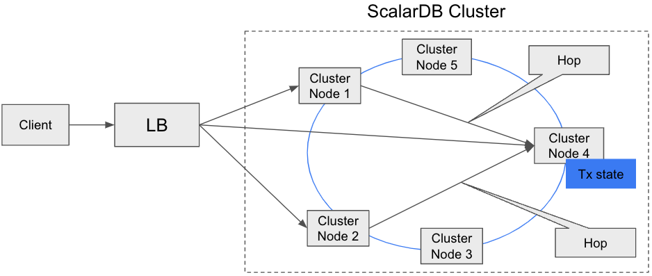

# Developer Guide for ScalarDB Cluster with the Java API

ScalarDB Cluster provides a Java API for developing applications.
This document explains how to use the Java API.

## Add ScalarDB Cluster Client to your build

The client libraries are available in the [packages for ScalarDB Cluster](https://github.com/orgs/scalar-labs/packages?repo_name=scalardb-cluster).
Since the packages are available under a commercial license, you need to get a commercial license and permission to access the packages.
For more details, please [contact us](https://www.scalar-labs.com/contact/).

Before you add the dependency, you need to add the Maven repository by using your build tool, such as Gradle and Maven.

To add the Maven repository by using Gradle, add the following repository to your `build.gradle` file:

```gradle
repositories {
    ...

    maven {
        url = uri("https://maven.pkg.github.com/scalar-labs/scalardb-cluster")
        credentials {
            username = project.findProperty("gpr.user") ?: System.getenv("USERNAME")
            password = project.findProperty("gpr.key") ?: System.getenv("TOKEN")
        }
    }
}
```

If you use ScalarDB Cluster SQL, you will need to add the following dependency to your `build.gradle` file as well:

```gradle
repositories {
    ...

    maven {
        url = uri("https://maven.pkg.github.com/scalar-labs/scalardb-sql")
        credentials {
            username = project.findProperty("gpr.user") ?: System.getenv("USERNAME")
            password = project.findProperty("gpr.key") ?: System.getenv("TOKEN")
        }
    }
}
```

In this case, you need to set the `gpr.user` property to your GitHub username and the `gpr.key` property to your personal access token.
To do so, you must either set the properties in `~/.gradle/gradle.properties` or specify the properties with the `-P` option when running the `./gradlew` command as follows:

```shell
$ ./gradlew build -Pgpr.user=<YOUR_GITHUB_USERNAME> -Pgpr.key=<YOUR_PERSONAL_ACCESS_TOKEN>
```

Or you can use environment variables, such as `USERNAME` for your GitHub username and `TOKEN` for your personal access token.

```shell
$ export USERNAME=<YOUR_GITHUB_USERNAME>
$ export TOKEN=<YOUR_PERSONAL_ACCESS_TOKEN>
```

To add the Maven repository by using Maven, edit your `~/.m2/settings.xml` file as follows:

```xml
<settings xmlns="http://maven.apache.org/SETTINGS/1.0.0"
  xmlns:xsi="http://www.w3.org/2001/XMLSchema-instance"
  xsi:schemaLocation="http://maven.apache.org/SETTINGS/1.0.0
                      http://maven.apache.org/xsd/settings-1.0.0.xsd">

  <activeProfiles>
    <activeProfile>github</activeProfile>
  </activeProfiles>

  <profiles>
    <profile>
      <id>github</id>
      <repositories>
        <repository>
          <id>central</id>
          <url>https://repo1.maven.org/maven2</url>
        </repository>
        <repository>
          <id>github</id>
          <url>https://maven.pkg.github.com/scalar-labs/scalardb-cluster</url>
          <snapshots>
            <enabled>true</enabled>
          </snapshots>
        </repository>
      </repositories>
    </profile>
  </profiles>

  <servers>
    <server>
      <id>github</id>
      <username>USERNAME</username>
      <password>TOKEN</password>
    </server>
  </servers>
</settings>
```

In the `servers` tag, add a child `server` tag with an `id` tag that contains `github`, replacing *USERNAME* with your GitHub username, and *TOKEN* with your personal access token.

For details about working with Gradle and Maven, see the following:

- [Working with the Gradle registry](https://docs.github.com/en/packages/working-with-a-github-packages-registry/working-with-the-gradle-registry)
- [Working with the Apache Maven registry](https://docs.github.com/en/packages/working-with-a-github-packages-registry/working-with-the-apache-maven-registry)

After adding the repository, you can install the library in your application by using your build tool.

To add a dependency on ScalarDB Cluster Client by using Gradle, use the following:

```gradle
dependencies {
    implementation 'com.scalar-labs:scalardb-cluster-client:3.9.2'
}
```

To add a dependency by using Maven, use the following:

```xml
<dependency>
  <groupId>com.scalar-labs</groupId>
  <artifactId>scalardb-cluster-client</artifactId>
  <version>3.9.2</version>
</dependency>
```

## Client modes

ScalarDB Cluster Client supports two client modes: `indirect` and `direct-kubernetes`.
The following describes the client modes.

### `indirect` client mode

This mode simply sends a request to any cluster node (typically via a load balancer, such as Envoy), and the cluster node receiving the request routes the request to the appropriate cluster node that has the transaction state.



The advantage of this mode is that we can keep the client thin.
The disadvantage is that we need an additional hop to reach the correct cluster node, which may affect performance.

You can use this connection mode even if your application is running on a different Kubernetes cluster and your application can't access the Kubernetes API and each cluster node.
If your application is running on the same Kubernetes cluster as your ScalarDB Cluster nodes, you can use the `direct-kubernetes` client mode.

### `direct-kubernetes` client mode

In this mode, the client uses the membership logic (using the Kubernetes API) and the distribution logic (consistent hashing algorithm) to find the right cluster node that has the transaction state.
The client then sends a request to the cluster node directly.


The advantage of this mode is that we can reduce the hop count to reach the proper cluster node, which will improve the performance.
The disadvantage of this mode is that we need to make the client fat because the client needs to have membership logic and request-routing logic.

Since this connection mode needs to access the Kubernetes API and each cluster node, you can use this connection mode only if your application is running on the same Kubernetes cluster as your ScalarDB Cluster nodes.
If your application is running on a different Kubernetes cluster, use the `indirect` client mode.

For details about how to deploy your application on Kubernetes with `direct-kubernetes` client mode, see [Deploy your client application on Kubernetes with `direct-kubernetes` mode](https://github.com/scalar-labs/helm-charts/blob/main/docs/how-to-deploy-scalardb-cluster.md#deploy-your-client-application-on-kubernetes-with-direct-kubernetes-mode).

## ScalarDB Cluster Java API

ScalarDB Cluster provides a Java API for applications to access ScalarDB Cluster.
The following diagram shows the architecture of the ScalarDB Cluster Java API.

```
  +------------------+
  | User/Application |
  +------------------+
           ↓ Java API
    +--------------+
    | ScalarDB API |
    +--------------+
           ↓ gRPC
  +------------------+
  | ScalarDB Cluster |
  +------------------+
           ↓ DB vendor–specific protocol
         +----+
         | DB |
         +----+
```

Using the ScalarDB Cluster Java API is almost the same as using the ScalarDB Java API except the client configurations and Schema Loader are different.
For details, see [ScalarDB Java API Guide](https://github.com/scalar-labs/scalardb/blob/master/docs/api-guide.md).

The following section describes the client configurations for the ScalarDB Cluster Java API and Schema Loader for Cluster.

### Client configurations

The following table shows the client configurations for the ScalarDB Cluster Java API.

| Name                                               | Description                                                                                                                                                                                                                                                                                                                                                                                                                                                                                                                                                                                                                                                            | Default                |
|----------------------------------------------------|------------------------------------------------------------------------------------------------------------------------------------------------------------------------------------------------------------------------------------------------------------------------------------------------------------------------------------------------------------------------------------------------------------------------------------------------------------------------------------------------------------------------------------------------------------------------------------------------------------------------------------------------------------------------|------------------------|
| `scalar.db.transaction_manager`                    | `cluster` should be specified.                                                                                                                                                                                                                                                                                                                                                                                                                                                                                                                                                                                                                                         | -                      |
| `scalar.db.contact_points`                         | Contact point of the cluster. If you use the `indirect` client mode, specify the IP address of the load balancer in front of your cluster nodes by using the format `indirect:<the load balancer IP address>`. If you use the `direct-kubernetes` client mode, specify the namespace name (optional) and the name of the [endpoint resource](https://kubernetes.io/docs/concepts/services-networking/service/#endpoints) to get the membership information by using the format `direct-kubernetes:<namespace name>/<endpoint name>` or just `direct-kubernetes:<endpoint name>`. If you don't specify the namespace name, the client will use the `default` namespace. |                        |
| `scalar.db.cluster.grpc.deadline_duration_millis`  | Deadline duration for gRPC in millis.                                                                                                                                                                                                                                                                                                                                                                                                                                                                                                                                                                                                                                  | `60000` (60 seconds)   |
| `scalar.db.cluster.grpc.max_inbound_message_size`  | Maximum message size allowed for a single gRPC frame.                                                                                                                                                                                                                                                                                                                                                                                                                                                                                                                                                                                                                  | The gRPC default value |
| `scalar.db.cluster.grpc.max_inbound_metadata_size` | Maximum size of metadata allowed to be received.                                                                                                                                                                                                                                                                                                                                                                                                                                                                                                                                                                                                                       | The gRPC default value |

For example, if you use the `indirect` client mode and the load balancer IP address is `192.168.10.1`, you can configure the client as follows:

```properties
scalar.db.transaction_manager=cluster
scalar.db.contact_points=indirect:192.168.10.1
```

Or if you use the `direct-kubernetes` client mode, with the namespace of the endpoint as `ns` and the endpoint name as `scalardb-cluster`, you can configure the client as follows:

```properties
scalar.db.transaction_manager=cluster
scalar.db.contact_points=direct-kubernetes:ns/scalardb-cluster
```

### Schema Loader for Cluster

To load a schema via ScalarDB Cluster, you need to use the dedicated Schema Loader for ScalarDB Cluster (Schema Loader for Cluster).
Using the Schema Loader for Cluster is basically the same as using the [ScalarDB Schema Loader](https://github.com/scalar-labs/scalardb/blob/master/docs/schema-loader.md) except the name of the JAR file is different.
You can download the Schema Loader for Cluster at [Releases](https://github.com/scalar-labs/scalardb-cluster/releases/tag/v3.9.2).
After downloading the JAR file, you can run Schema Loader for Cluster with the following command:

```shell
java -jar scalardb-cluster-schema-loader-3.9.2-all.jar --config <PATH_TO_CONFIG_FILE> -f <PATH_TO_SCHEMA_FILE> --coordinator
```

## ScalarDB Cluster SQL

ScalarDB Cluster SQL can be accessed via JDBC and Spring Data JDBC for ScalarDB in Java as follows:

```
  +-----------------------------------------+
  |            User/Application             |
  +-----------------------------------------+
         ↓                    ↓ Java API
Java API ↓     +-------------------------------+
 (JDBC)  ↓     | Spring Data JDBC for ScalarDB |
         ↓     +-------------------------------+
+----------------------------------------------+
|         ScalarDB JDBC (ScalarDB SQL)         |
+----------------------------------------------+
                    ↓ gRPC
         +----------------------+
         | ScalarDB Cluster SQL |
         +----------------------+
                    ↓ DB vendor–specific protocol
                  +----+
                  | DB |
                  +----+
```

This section describes how to use ScalarDB Cluster SQL though JDBC and Spring Data JDBC for ScalarDB.

### ScalarDB Cluster SQL via JDBC

Using ScalarDB Cluster SQL via JDBC is almost the same using [ScalarDB JDBC](https://github.com/scalar-labs/scalardb-sql/blob/main/docs/jdbc-guide.md) except for how to add the JDBC driver to your project.

In addition to adding ScalarDB Cluster Client as described in [Add ScalarDB Cluster Client to your build](#add-scalardb-cluster-client-to-your-build), you need to add the following dependencies to your project:

To add the dependencies on the ScalarDB Cluster JDBC driver by using Gradle, use the following:

```gradle
dependencies {
    implementation 'com.scalar-labs:scalardb-sql-jdbc:3.9.2'
    implementation 'com.scalar-labs:scalardb-cluster-client:3.9.2'
}
```

To add the dependencies by using Maven, use the following:

```xml
<dependencies>
    <dependency>
        <groupId>com.scalar-labs</groupId>
        <artifactId>scalardb-sql-jdbc</artifactId>
        <version>3.9.2</version>
    </dependency>
    <dependency>
        <groupId>com.scalar-labs</groupId>
        <artifactId>scalardb-cluster-client</artifactId>
        <version>3.9.2</version>
    </dependency>
</dependencies>
```

Other than that, using ScalarDB Cluster SQL via JDBC is the same as using ScalarDB JDBC.
For details about ScalarDB JDBC, see [ScalarDB JDBC Guide](https://github.com/scalar-labs/scalardb-sql/blob/main/docs/jdbc-guide.md).

### ScalarDB Cluster SQL via Spring Data JDBC for ScalarDB

Similar to ScalarDB Cluster SQL via JDBC, using ScalarDB Cluster SQL via Spring Data JDBC for ScalarDB is almost the same as using [Spring Data JDBC for ScalarDB](https://github.com/scalar-labs/scalardb-sql/blob/main/docs/spring-data-guide.md) except for how to add it to your project.

In addition to adding ScalarDB Cluster Client as described in [Add ScalarDB Cluster Client to your build](#add-scalardb-cluster-client-to-your-build), you need to add the following dependencies to your project:

To add the dependencies by using Gradle, use the following:

```gradle
dependencies {
    implementation 'com.scalar-labs:scalardb-sql-spring-data:3.9.2'
    implementation 'com.scalar-labs:scalardb-cluster-client:3.9.2'
}
```

To add the dependencies by using Maven, use the following:

```xml
<dependencies>
    <dependency>
        <groupId>com.scalar-labs</groupId>
        <artifactId>scalardb-sql-spring-data</artifactId>
        <version>3.9.2</version>
    </dependency>
    <dependency>
        <groupId>com.scalar-labs</groupId>
        <artifactId>scalardb-cluster-client</artifactId>
        <version>3.9.2</version>
    </dependency>
</dependencies>
```

Other than that, using ScalarDB Cluster SQL via Spring Data JDBC for ScalarDB is the same as using Spring Data JDBC for ScalarDB.
For details about Spring Data JDBC for ScalarDB, see [Guide of Spring Data JDBC for ScalarDB](https://github.com/scalar-labs/scalardb-sql/blob/main/docs/spring-data-guide.md).

### Client configurations

The following table shows the configurations for ScalarDB Cluster SQL Client.

| Name                                               | Description                                                                                                                                                                                                                                                                                                                                                                                                                                                                                                                                                                                                                                                            | Default                |
|----------------------------------------------------|------------------------------------------------------------------------------------------------------------------------------------------------------------------------------------------------------------------------------------------------------------------------------------------------------------------------------------------------------------------------------------------------------------------------------------------------------------------------------------------------------------------------------------------------------------------------------------------------------------------------------------------------------------------------|------------------------|
| `scalar.db.sql.connection_mode`                    | `cluster` should be specified.                                                                                                                                                                                                                                                                                                                                                                                                                                                                                                                                                                                                                                         | -                      |
| `scalar.db.sql.cluster_mode.contact_points`        | Contact point of the cluster. If you use the `indirect` client mode, specify the IP address of the load balancer in front of your cluster nodes by using the format `indirect:<the load balancer IP address>`. If you use the `direct-kubernetes` client mode, specify the namespace name (optional) and the name of the [endpoint resource](https://kubernetes.io/docs/concepts/services-networking/service/#endpoints) to get the membership information by using the format `direct-kubernetes:<namespace name>/<endpoint name>` or just `direct-kubernetes:<endpoint name>`. If you don't specify the namespace name, the client will use the `default` namespace. |                        |
| `scalar.db.cluster.grpc.deadline_duration_millis`  | Deadline duration for gRPC in millis.                                                                                                                                                                                                                                                                                                                                                                                                                                                                                                                                                                                                                                  | `60000` (60 seconds)   |
| `scalar.db.cluster.grpc.max_inbound_message_size`  | Maximum message size allowed for a single gRPC frame.                                                                                                                                                                                                                                                                                                                                                                                                                                                                                                                                                                                                                  | The gRPC default value |
| `scalar.db.cluster.grpc.max_inbound_metadata_size` | Maximum size of metadata allowed to be received.                                                                                                                                                                                                                                                                                                                                                                                                                                                                                                                                                                                                                       | The gRPC default value |

For example, if you use the `indirect` client mode and the load balancer IP address is `192.168.10.1`, you can configure the client as follows:

```properties
scalar.db.sql.connection_mode=cluster
scalar.db.sql.cluster_mode.contact_points=indirect:192.168.10.1
```

Or if you use the `direct-kubernetes` client mode, with the namespace of the endpoint as `ns` and the endpoint name as `scalardb-cluster`, you can configure the client as follows:

```properties
scalar.db.sql.connection_mode=cluster
scalar.db.sql.cluster_mode.contact_points=direct-kubernetes:ns/scalardb-cluster
```

For details about how to configure ScalarDB JDBC, see [JDBC connection URL](https://github.com/scalar-labs/scalardb-sql/blob/main/docs/jdbc-guide.md#jdbc-connection-url).

For details about how to configure Spring Data JDBC for ScalarDB, see [Configurations](https://github.com/scalar-labs/scalardb-sql/blob/main/docs/spring-data-guide.md#configurations).


### SQL CLI for Cluster

You need to use the dedicated SQL CLI for ScalarDB Cluster (SQL CLI for Cluster).

Using the SQL CLI for Cluster is basically the same as using the [ScalarDB SQL Command Line Interface](https://github.com/scalar-labs/scalardb-sql/blob/main/docs/command-line-interface.md) except the name of the JAR file is different.
You can download the SQL CLI for Cluster from [Releases](https://github.com/scalar-labs/scalardb-cluster/releases/tag/v3.9.2).
After downloading the JAR file, you can run SQL CLI for Cluster with the following command:

```shell
java -jar scalardb-cluster-sql-cli-3.9.2-all.jar --config <PATH_TO_CONFIG_FILE>
```

## Further reading

If you want to use ScalarDB Cluster in programming languages other than Java, you can use the ScalarDB Cluster gRPC API.
For details about the ScalarDB Cluster gRPC API, refer to the following:

* [ScalarDB Cluster gRPC API Guide](scalardb-cluster-grpc-api-guide.md)
* [ScalarDB Cluster SQL gRPC API Guide](scalardb-cluster-sql-grpc-api-guide.md)
