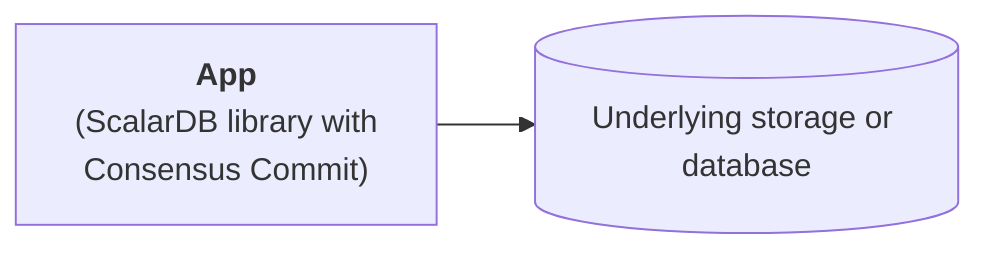

---
tags:
  - Community
  - Enterprise Standard
  - Enterprise Premium
displayed_sidebar: docsEnglish
---

# ScalarDB Core Configurations

import Tabs from '@theme/Tabs';
import TabItem from '@theme/TabItem';

This page describes the available configurations for ScalarDB Core.

:::tip

If you are using ScalarDB Cluster, please refer to [ScalarDB Cluster Configurations](./scalardb-cluster/scalardb-cluster-configurations.mdx) instead.

:::

## General configurations

The following configurations are available for the Consensus Commit transaction manager.

### `transaction_manager`

- **Field:** `scalar.db.transaction_manager`
- **Description:** Transaction manager of ScalarDB. Specify `consensus-commit` to use [Consensus Commit](./consensus-commit.mdx) or `single-crud-operation` to [run non-transactional storage operations](./run-non-transactional-storage-operations-through-library.mdx). Note that the configurations under the `scalar.db.consensus_commit` prefix are ignored if you use `single-crud-operation`.
- **Default value:** `consensus-commit`

### `isolation_level`

- **Field:** `scalar.db.consensus_commit.isolation_level`
- **Description:** Isolation level used for Consensus Commit. Either `SNAPSHOT`, `SERIALIZABLE`, or `READ_COMMITTED` can be specified.
- **Default value:** `SNAPSHOT`

### `coordinator.namespace`

- **Field:** `scalar.db.consensus_commit.coordinator.namespace`
- **Description:** Namespace name of Coordinator tables used for Consensus Commit.
- **Default value:** `coordinator`

## Performance-related configurations

The following performance-related configurations are available for the Consensus Commit transaction manager.

### `parallel_executor_count`

- **Field:** `scalar.db.consensus_commit.parallel_executor_count`
- **Description:** Number of executors (threads) for parallel execution. This number refers to the total number of threads across transactions in a ScalarDB Cluster node or a ScalarDB Core process.
- **Default value:** `128`

### `parallel_preparation.enabled`

- **Field:** `scalar.db.consensus_commit.parallel_preparation.enabled`
- **Description:** Whether or not the preparation phase is executed in parallel.
- **Default value:** `true`

### `parallel_validation.enabled`

- **Field:** `scalar.db.consensus_commit.parallel_validation.enabled`
- **Description:** Whether or not the validation phase (in `EXTRA_READ`) is executed in parallel.
- **Default value:** The value of `scalar.db.consensus_commit.parallel_commit.enabled`

### `parallel_commit.enabled`

- **Field:** `scalar.db.consensus_commit.parallel_commit.enabled`
- **Description:** Whether or not the commit phase is executed in parallel.
- **Default value:** `true`

### `parallel_rollback.enabled`

- **Field:** `scalar.db.consensus_commit.parallel_rollback.enabled`
- **Description:** Whether or not the rollback phase is executed in parallel.
- **Default value:** The value of `scalar.db.consensus_commit.parallel_commit.enabled`

### `async_commit.enabled`

- **Field:** `scalar.db.consensus_commit.async_commit.enabled`
- **Description:** Whether or not the commit phase is executed asynchronously.
- **Default value:** `false`

### `async_rollback.enabled`

- **Field:** `scalar.db.consensus_commit.async_rollback.enabled`
- **Description:** Whether or not the rollback phase is executed asynchronously.
- **Default value:** The value of `scalar.db.consensus_commit.async_commit.enabled`

### `parallel_implicit_pre_read.enabled`

- **Field:** `scalar.db.consensus_commit.parallel_implicit_pre_read.enabled`
- **Description:** Whether or not implicit pre-read is executed in parallel.
- **Default value:** `true`

### `one_phase_commit.enabled`

- **Field:** `scalar.db.consensus_commit.one_phase_commit.enabled`
- **Description:** Whether or not the one-phase commit optimization is enabled.
- **Default value:** `false`

### `coordinator.write_omission_on_read_only.enabled`

- **Field:** `scalar.db.consensus_commit.coordinator.write_omission_on_read_only.enabled`
- **Description:** Whether or not the Coordinator write omission optimization is enabled for read-only transactions. This optimization is useful for read-only transactions that do not modify any data, as it avoids unnecessary writes to the Coordinator tables.
- **Default value:** `true`

### `coordinator.group_commit.enabled`

- **Field:** `scalar.db.consensus_commit.coordinator.group_commit.enabled`
- **Description:** Whether or not committing the transaction state is executed in batch mode. This feature can't be used with a two-phase commit interface.
- **Default value:** `false`

### `coordinator.group_commit.slot_capacity`

- **Field:** `scalar.db.consensus_commit.coordinator.group_commit.slot_capacity`
- **Description:** Maximum number of slots in a group for the group commit feature. A large value improves the efficiency of group commit, but may also increase latency and the likelihood of transaction conflicts.[^1]
- **Default value:** `20`

### `coordinator.group_commit.group_size_fix_timeout_millis`

- **Field:** `scalar.db.consensus_commit.coordinator.group_commit.group_size_fix_timeout_millis`
- **Description:** Timeout to fix the size of slots in a group. A large value improves the efficiency of group commit, but may also increase latency and the likelihood of transaction conflicts.[^1]
- **Default value:** `40`

### `coordinator.group_commit.delayed_slot_move_timeout_millis`

- **Field:** `scalar.db.consensus_commit.coordinator.group_commit.delayed_slot_move_timeout_millis`
- **Description:** Timeout to move delayed slots from a group to another isolated group to prevent the original group from being affected by delayed transactions. A large value improves the efficiency of group commit, but may also increase the latency and the likelihood of transaction conflicts.[^1]
- **Default value:** `1200`

### `coordinator.group_commit.old_group_abort_timeout_millis`

- **Field:** `scalar.db.consensus_commit.coordinator.group_commit.old_group_abort_timeout_millis`
- **Description:** Timeout to abort an old ongoing group. A small value reduces resource consumption through aggressive aborts, but may also increase the likelihood of unnecessary aborts for long-running transactions.
- **Default value:** `60000`

### `coordinator.group_commit.timeout_check_interval_millis`

- **Field:** `scalar.db.consensus_commit.coordinator.group_commit.timeout_check_interval_millis`
- **Description:** Interval for checking the group commit–related timeouts.
- **Default value:** `20`

### `coordinator.group_commit.metrics_monitor_log_enabled`

- **Field:** `scalar.db.consensus_commit.coordinator.group_commit.metrics_monitor_log_enabled`
- **Description:** Whether or not the metrics of the group commit are logged periodically.
- **Default value:** `false`

## Storage-related configurations

ScalarDB has a storage (database) abstraction layer that supports multiple storage implementations. You can specify the storage implementation by using the `scalar.db.storage` property.

Select a database to see the configurations available for each storage.

<Tabs groupId="databases" queryString>
  <TabItem value="JDBC_databases" label="JDBC databases" default>
    The following configurations are available for JDBC databases.

    <h4>`storage`</h4>

    - **Field:** `scalar.db.storage`
    - **Description:** `jdbc` must be specified.
    - **Default value:** empty

    <h4>`contact_points`</h4>

    - **Field:** `scalar.db.contact_points`
    - **Description:** JDBC connection URL.
    - **Default value:** empty

    <h4>`username`</h4>

    - **Field:** `scalar.db.username`
    - **Description:** Username to access the database.
    - **Default value:** empty

    <h4>`password`</h4>

    - **Field:** `scalar.db.password`
    - **Description:** Password to access the database.
    - **Default value:** empty

    <h4>`jdbc.connection_pool.min_idle`</h4>

    - **Field:** `scalar.db.jdbc.connection_pool.min_idle`
    - **Description:** Minimum number of idle connections in the connection pool.
    - **Default value:** `20`

    <h4>`jdbc.connection_pool.max_idle`</h4>

    - **Field:** `scalar.db.jdbc.connection_pool.max_idle`
    - **Description:** Maximum number of connections that can remain idle in the connection pool.
    - **Default value:** `50`

    <h4>`jdbc.connection_pool.max_total`</h4>

    - **Field:** `scalar.db.jdbc.connection_pool.max_total`
    - **Description:** Maximum total number of idle and borrowed connections that can be active at the same time for the connection pool. Use a negative value for no limit.
    - **Default value:** `200`

    <h4>`jdbc.prepared_statements_pool.enabled`</h4>

    - **Field:** `scalar.db.jdbc.prepared_statements_pool.enabled`
    - **Description:** Setting this property to `true` enables prepared-statement pooling.
    - **Default value:** `false`

    <h4>`jdbc.prepared_statements_pool.max_open`</h4>

    - **Field:** `scalar.db.jdbc.prepared_statements_pool.max_open`
    - **Description:** Maximum number of open statements that can be allocated from the statement pool at the same time. Use a negative value for no limit.
    - **Default value:** `-1`

    <h4>`jdbc.isolation_level`</h4>

    - **Field:** `scalar.db.jdbc.isolation_level`
    - **Description:** Isolation level for JDBC. `READ_COMMITTED`, `REPEATABLE_READ`, or `SERIALIZABLE` can be specified.
    - **Default value:** Underlying-database specific

    <h4>`jdbc.table_metadata.connection_pool.min_idle`</h4>

    - **Field:** `scalar.db.jdbc.table_metadata.connection_pool.min_idle`
    - **Description:** Minimum number of idle connections in the connection pool for the table metadata.
    - **Default value:** `5`

    <h4>`jdbc.table_metadata.connection_pool.max_idle`</h4>

    - **Field:** `scalar.db.jdbc.table_metadata.connection_pool.max_idle`
    - **Description:** Maximum number of connections that can remain idle in the connection pool for the table metadata.
    - **Default value:** `10`

    <h4>`jdbc.table_metadata.connection_pool.max_total`</h4>

    - **Field:** `scalar.db.jdbc.table_metadata.connection_pool.max_total`
    - **Description:** Maximum total number of idle and borrowed connections that can be active at the same time for the connection pool for the table metadata. Use a negative value for no limit.
    - **Default value:** `25`

    <h4>`jdbc.admin.connection_pool.min_idle`</h4>

    - **Field:** `scalar.db.jdbc.admin.connection_pool.min_idle`
    - **Description:** Minimum number of idle connections in the connection pool for admin.
    - **Default value:** `5`

    <h4>`jdbc.admin.connection_pool.max_idle`</h4>

    - **Field:** `scalar.db.jdbc.admin.connection_pool.max_idle`
    - **Description:** Maximum number of connections that can remain idle in the connection pool for admin.
    - **Default value:** `10`

    <h4>`jdbc.admin.connection_pool.max_total`</h4>

    - **Field:** `scalar.db.jdbc.admin.connection_pool.max_total`
    - **Description:** Maximum total number of idle and borrowed connections that can be active at the same time for the connection pool for admin. Use a negative value for no limit.
    - **Default value:** `25`

    <h4>`jdbc.mysql.variable_key_column_size`</h4>

    - **Field:** `scalar.db.jdbc.mysql.variable_key_column_size`
    - **Description:** Column size for TEXT and BLOB columns in MySQL when they are used as a primary key or secondary key. Minimum 64 bytes.
    - **Default value:** `128`

    <h4>`jdbc.oracle.variable_key_column_size`</h4>

    - **Field:** `scalar.db.jdbc.oracle.variable_key_column_size`
    - **Description:** Column size for TEXT and BLOB columns in Oracle when they are used as a primary key or secondary key. Minimum 64 bytes.
    - **Default value:** `128`

    <h4>`jdbc.oracle.time_column.default_date_component`</h4>

    - **Field:** `scalar.db.jdbc.oracle.time_column.default_date_component`
    - **Description:** Value of the date component used for storing `TIME` data in Oracle. Since Oracle has no data type to only store a time without a date component, ScalarDB stores `TIME` data with the same date component value for ease of comparison and sorting.
    - **Default value:** `1970-01-01`

    <h4>`jdbc.db2.variable_key_column_size`</h4>

    - **Field:** `scalar.db.jdbc.db2.variable_key_column_size`
    - **Description:** Column size for TEXT and BLOB columns in IBM Db2 when they are used as a primary key or secondary key. Minimum 64 bytes.
    - **Default value:** `128`

    <h4>`jdbc.db2.time_column.default_date_component`</h4>

    - **Field:** `scalar.db.jdbc.db2.time_column.default_date_component`
    - **Description:** Value of the date component used for storing `TIME` data in IBM Db2. Since the IBM Db2 TIMESTAMP type is used to store ScalarDB `TIME` type data because it provides fractional-second precision, ScalarDB stores `TIME` data with the same date component value for ease of comparison and sorting.
    - **Default value:** `1970-01-01`

:::note

**SQLite3**

If you're using SQLite3 as a JDBC database, you must set `scalar.db.contact_points` as follows:

```properties
scalar.db.contact_points=jdbc:sqlite:<SQLITE_DB_FILE_PATH>?busy_timeout=10000
```

Unlike other JDBC databases, [SQLite3 doesn't fully support concurrent access](https://www.sqlite.org/lang_transaction.html). To avoid frequent errors caused internally by [`SQLITE_BUSY`](https://www.sqlite.org/rescode.html#busy), setting a [`busy_timeout`](https://www.sqlite.org/c3ref/busy_timeout.html) parameter is recommended.

**YugabyteDB**

If you're using YugabyteDB as a JDBC database, you can specify multiple endpoints in `scalar.db.contact_points` as follows:

```properties
scalar.db.contact_points=jdbc:yugabytedb://127.0.0.1:5433\\,127.0.0.2:5433\\,127.0.0.3:5433/?load-balance=true
```

Multiple endpoints should be separated by escaped commas.

For information on YugabyteDB's smart driver and load balancing, see [YugabyteDB smart drivers for YSQL](https://docs.yugabyte.com/preview/drivers-orms/smart-drivers/).

:::

  </TabItem>
  <TabItem value="DynamoDB" label="DynamoDB">
    The following configurations are available for DynamoDB.

    <h4>`storage`</h4>

    - **Field:** `scalar.db.storage`
    - **Description:** `dynamo` must be specified.
    - **Default value:** empty

    <h4>`contact_points`</h4>

    - **Field:** `scalar.db.contact_points`
    - **Description:** AWS region with which ScalarDB should communicate (for example, `us-east-1`).
    - **Default value:** empty

    <h4>`username`</h4>

    - **Field:** `scalar.db.username`
    - **Description:** AWS access key used to identify the user interacting with AWS.
    - **Default value:** empty

    <h4>`password`</h4>

    - **Field:** `scalar.db.password`
    - **Description:** AWS secret access key used to authenticate the user interacting with AWS.
    - **Default value:** empty

    <h4>`dynamo.endpoint_override`</h4>

    - **Field:** `scalar.db.dynamo.endpoint_override`
    - **Description:** Amazon DynamoDB endpoint with which ScalarDB should communicate. This is primarily used for testing with a local instance instead of an AWS service.
    - **Default value:** empty

    <h4>`dynamo.namespace.prefix`</h4>

    - **Field:** `scalar.db.dynamo.namespace.prefix`
    - **Description:** Prefix for the user namespaces and metadata namespace names. Since AWS requires having unique tables names in a single AWS region, this is useful if you want to use multiple ScalarDB environments (development, production, etc.) in a single AWS region.
    - **Default value:** empty
  </TabItem>
  <TabItem value="Cosmos_DB_for_NoSQL" label="Cosmos DB for NoSQL">
    The following configurations are available for CosmosDB for NoSQL.

    <h4>`storage`</h4>

    - **Field:** `scalar.db.storage`
    - **Description:** `cosmos` must be specified.
    - **Default value:** empty

    <h4>`contact_points`</h4>

    - **Field:** `scalar.db.contact_points`
    - **Description:** Azure Cosmos DB for NoSQL endpoint with which ScalarDB should communicate.
    - **Default value:** empty

    <h4>`password`</h4>

    - **Field:** `scalar.db.password`
    - **Description:** Either a master or read-only key used to perform authentication for accessing Azure Cosmos DB for NoSQL.
    - **Default value:** empty

    <h4>`cosmos.consistency_level`</h4>

    - **Field:** `scalar.db.cosmos.consistency_level`
    - **Description:** Consistency level used for Cosmos DB operations. `STRONG` or `BOUNDED_STALENESS` can be specified.
    - **Default value:** `STRONG`
  </TabItem>
  <TabItem value="Cassandra" label="Cassandra">
    The following configurations are available for Cassandra.

    <h4>`storage`</h4>

    - **Field:** `scalar.db.storage`
    - **Description:** `cassandra` must be specified.
    - **Default value:** empty

    <h4>`contact_points`</h4>

    - **Field:** `scalar.db.contact_points`
    - **Description:** Comma-separated contact points.
    - **Default value:** empty

    <h4>`contact_port`</h4>

    - **Field:** `scalar.db.contact_port`
    - **Description:** Port number for all the contact points.
    - **Default value:** empty

    <h4>`username`</h4>

    - **Field:** `scalar.db.username`
    - **Description:** Username to access the database.
    - **Default value:** empty

    <h4>`password`</h4>

    - **Field:** `scalar.db.password`
    - **Description:** Password to access the database.
    - **Default value:** empty
  </TabItem>
</Tabs>

### Multi-storage support

ScalarDB supports using multiple storage implementations simultaneously. You can use multiple storages by specifying `multi-storage` as the value for the `scalar.db.storage` property.

For details about using multiple storages, see [Multi-Storage Transactions](multi-storage-transactions.mdx).

### Cross-partition scan configurations

By enabling the cross-partition scan option as described below, the `Scan` operation can retrieve all records across partitions. In addition, you can specify arbitrary conditions and orderings in the cross-partition `Scan` operation by enabling `cross_partition_scan.filtering` and `cross_partition_scan.ordering`, respectively. Currently, the cross-partition scan with ordering option is available only for JDBC databases. To enable filtering and ordering, `scalar.db.cross_partition_scan.enabled` must be set to `true`.

For details on how to use cross-partition scan, see [Scan operation](./api-guide.mdx#scan-operation).

:::warning

For non-JDBC databases, transactions could be executed at read-committed snapshot isolation (`SNAPSHOT`), which is a lower isolation level, even if you enable cross-partition scan with the `SERIALIZABLE` isolation level. When using non-JDBC databases, use cross-partition scan only if consistency does not matter for your transactions.

:::

#### `cross_partition_scan.enabled`

- **Field:** `scalar.db.cross_partition_scan.enabled`
- **Description:** Enable cross-partition scan.
- **Default value:** `false`

#### `cross_partition_scan.filtering.enabled`

- **Field:** `scalar.db.cross_partition_scan.filtering.enabled`
- **Description:** Enable filtering in cross-partition scan.
- **Default value:** `false`

#### `cross_partition_scan.ordering.enabled`

- **Field:** `scalar.db.cross_partition_scan.ordering.enabled`
- **Description:** Enable ordering in cross-partition scan.
- **Default value:** `false`

### Scan fetch size

You can configure the fetch size for storage scan operations by using the following property.

#### `scan_fetch_size`

- **Field:** `scalar.db.scan_fetch_size`
- **Description:** Specifies the number of records to fetch in a single batch during a storage scan operation. A larger value can improve performance for a large result set by reducing round trips to the storage, but it also increases memory usage. A smaller value uses less memory but may increase latency.
- **Default value:** `10`

## Other ScalarDB configurations

The following are additional configurations available for ScalarDB.

### `metadata.cache_expiration_time_secs`

- **Field:** `scalar.db.metadata.cache_expiration_time_secs`
- **Description:** ScalarDB has a metadata cache to reduce the number of requests to the database. This setting specifies the expiration time of the cache in seconds. If you specify `-1`, the cache will never expire.
- **Default value:** `60`

### `active_transaction_management.expiration_time_millis`

- **Field:** `scalar.db.active_transaction_management.expiration_time_millis`
- **Description:** ScalarDB maintains in-progress transactions, which can be resumed by using a transaction ID. This process expires transactions that have been idle for an extended period to prevent resource leaks. This setting specifies the expiration time of this transaction management feature in milliseconds.
- **Default value:** `-1` (no expiration)

### `consensus_commit.include_metadata.enabled`

- **Field:** `scalar.db.consensus_commit.include_metadata.enabled`
- **Description:** When using Consensus Commit, if this is set to `true`, `Get` and `Scan` operations results will contain transaction metadata. To see the transaction metadata columns details for a given table, you can use the `DistributedTransactionAdmin.getTableMetadata()` method, which will return the table metadata augmented with the transaction metadata columns. Using this configuration can be useful to investigate transaction-related issues.
- **Default value:** `false`

### `default_namespace_name`

- **Field:** `scalar.db.default_namespace_name`
- **Description:** The given namespace name will be used by operations that do not already specify a namespace.
- **Default value:** empty

## Placeholder usage

You can use placeholders in the values, and they are replaced with environment variables (`${env:<ENVIRONMENT_VARIABLE_NAME>}`) or system properties (`${sys:<SYSTEM_PROPERTY_NAME>}`). You can also specify default values in placeholders like `${sys:<SYSTEM_PROPERTY_NAME>:-<DEFAULT_VALUE>}`.

The following is an example of a configuration that uses placeholders:

```properties
scalar.db.username=${env:SCALAR_DB_USERNAME:-admin}
scalar.db.password=${env:SCALAR_DB_PASSWORD}
```

In this example configuration, ScalarDB reads the username and password from environment variables. If the environment variable `SCALAR_DB_USERNAME` does not exist, ScalarDB uses the default value `admin`.

## Configuration example - App and database



In this example configuration, the app (ScalarDB library with Consensus Commit) connects to an underlying storage or database (in this case, Cassandra) directly.

:::warning

This configuration exists only for development purposes and isn't suitable for a production environment. This is because the app needs to implement the [Scalar Admin](https://github.com/scalar-labs/scalar-admin) interface to take transactionally consistent backups for ScalarDB, which requires additional configurations.

:::

The following is an example of the configuration for connecting the app to the underlying database through ScalarDB:

```properties
# Transaction manager implementation.
scalar.db.transaction_manager=consensus-commit

# Storage implementation.
scalar.db.storage=cassandra

# Comma-separated contact points.
scalar.db.contact_points=<CASSANDRA_HOST>

# Credential information to access the database.
scalar.db.username=<USERNAME>
scalar.db.password=<PASSWORD>
```
