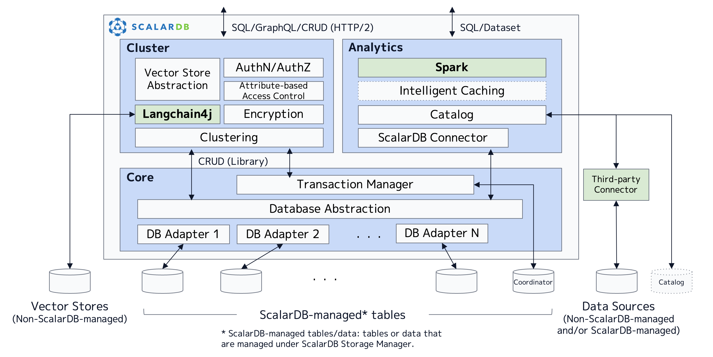

---
tags:
  - Community
  - Enterprise Standard
  - Enterprise Premium
displayed_sidebar: docsEnglish
---

# ScalarDB Design

This document briefly explains the design and implementation of ScalarDB. For what ScalarDB is and its use cases, see [ScalarDB Overview](./overview.mdx).

## Overall architecture

ScalarDB is hybrid transaction/analytical processing (HTAP) middleware that sits in between applications and databases. As shown in the following figure, ScalarDB consists of three components: Core, Cluster, and Analytics. ScalarDB basically employs a layered architecture, so the Cluster and Analytics components use the Core component to interact with underlying databases but sometimes bypass the Core component for performance optimization without sacrificing correctness. Likewise, each component also consists of several layers. 

## Components

The following subsections explain each component one by one.

### Core

ScalarDB Core, which is provided as open-source software under the Apache 2 License, is an integral part of ScalarDB. Core provides a database manager that has an abstraction layer that abstracts underlying databases and adapters (or shims) that implement the abstraction for each database. In addition, it provides a transaction manager on top of the database abstraction that achieves database-agnostic transaction management based on Scalar's novel distributed transaction protocol called Consensus Commit. Core is provided as a library that offers a simple CRUD interface.

### Cluster

ScalarDB Cluster, which is licensed under a commercial license, is a component that provides a clustering solution for the Core component to work as a clustered server. Cluster is mainly designed for OLTP workloads, which have many small, transactional and non-transactional reads and writes. In addition, it provides several enterprise features such as authentication, authorization, encryption at rest, and fine-grained access control (attribute-based access control). Not only does Cluster offer the same CRUD interface as the Core component, but it also offers SQL and GraphQL interfaces. Furthermore, it offers a vector store interface to interact with several vector stores. Since Cluster is provided as a container in a Kubernetes Pod, you can increase performance and availability by having more containers.

### Analytics

ScalarDB Analytics, which is licensed under a commercial license, is a component that provides scalable analytical processing for the data managed by the Core component or managed by applications that don’t use ScalarDB. Analytics is mainly designed for OLAP workloads, which have a small number of large, analytical read queries. In addition, it offers a SQL and DataSet API through Spark. Since the Analytics component is provided as a Java package that can be installed on Apache Spark engines, you can increase performance by having more Spark worker nodes.

## Further reading

For more details about the design and implementation of ScalarDB, see the following documents:

- **Speaker Deck presentation:** [ScalarDB: Universal Transaction Manager](https://speakerdeck.com/scalar/scalar-db-universal-transaction-manager)

In addition, the following materials were presented at the VLDB 2023 conference:

- **Speaker Deck presentation:** [ScalarDB: Universal Transaction Manager for Polystores](https://speakerdeck.com/scalar/scalardb-universal-transaction-manager-for-polystores-vldb23)
- **Detailed paper:** [ScalarDB: Universal Transaction Manager for Polystores](https://www.vldb.org/pvldb/vol16/p3768-yamada.pdf)
