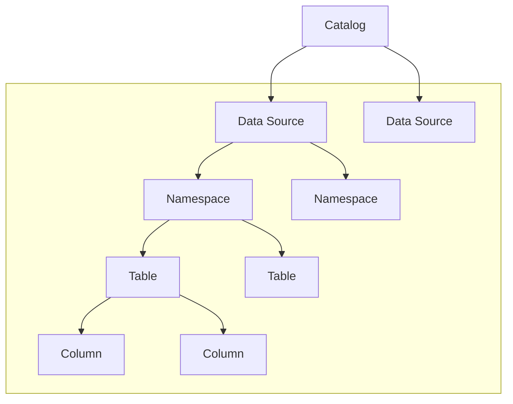

---
tags:
  - Enterprise Option
displayed_sidebar: docsEnglish
---

# ScalarDB Analytics Design and Implementation

ScalarDB Analytics is the analytical component of ScalarDB. Similar to ScalarDB, it unifies diverse data sources—ranging from RDBMSs like PostgreSQL and MySQL to NoSQL databases like Cassandra and DynamoDB—into a single logical database. This enables you to perform analytical queries across multiple databases seamlessly.

## Design

ScalarDB Analytics consists of two main components: a universal data catalog and a query engine:

- **Universal data catalog.** The universal data catalog is a flexible metadata management system that handles multiple catalog spaces. Each catalog space provides an independent logical grouping of data sources, enabling organized management of diverse data environments.
- **Query engine.** The query engine executes queries against the universal data catalog. ScalarDB Analytics provides appropriate data connectors to interface with the underlying data sources.

ScalarDB Analytics employs a decoupled architecture where the data catalog and query engine are separate components. This design allows for integration with various existing query engines through an extensible architecture. As a result, you can select different query engines to execute queries against the same data catalog based on your specific requirements.

### Universal data catalog

The universal data catalog is composed of several levels and is structured as follows:

The following are definitions for those levels:

- **Catalog** is a folder that contains all your data source information. For example, you might have one catalog called `analytics_catalog` for your analytics data and another called `operational_catalog` for your day-to-day operations.
- **Data source** represents each data source you connect to. For each data source, ScalarDB Analytics stores important information like:
  - What kind of data source it is (PostgreSQL, Cassandra, etc.)
  - How to connect to it (connection details and passwords)
  - Special features the data source supports (like transactions)
- **Namespace** is like a subfolder within your data source that groups related tables together. In PostgreSQL these are called schemas, in Cassandra they're called keyspaces. You can have multiple levels of namespaces, similar to having folders within folders.
- **Table** is where your actual data lives. For each table, ScalarDB Analytics keeps track of:
  - What columns it has
  - What type of data each column can store
  - Whether columns can be empty (null)

#### Data source integration

When registering a data source to ScalarDB Analytics, two types of mappings occur:

1. **Catalog structure mapping:** The data source's catalog information (namespaces, tables, and columns) is resolved and mapped to the universal data catalog structure.
2. **Data type mapping:** Native data types from each data source are mapped to the [supported data types](#supported-data-types).

These mappings ensure compatibility and consistency across different database systems. For detailed information about how specific databases are mapped, see [Catalog structure mappings by data source](./reference-data-source.mdx#catalog-structure-mappings-by-data-source).

### Query engine

A query engine is an independent component along with the universal data catalog, which is responsible for executing queries against the data sources registered in the universal data catalog and returning the results to the user. ScalarDB Analytics does not currently provide a built-in query engine. Instead, it is designed to be integrated with existing query engines, normally provided as a plugin of the query engine.

When you run a query, the ScalarDB Analytics query engine plugin works as follows:

1. Fetches the catalog metadata by calling the universal data catalog API, like the data source location, the table object identifier, and the table schema.
2. Sets up the data source connectors to the data sources by using the catalog metadata.
3. Provides the query optimization information to the query engine based on the catalog metadata.
4. Reads the data from the data sources by using the data source connectors.

ScalarDB Analytics manages these processes internally. You can simply run a query against the universal data catalog by using the query engine API in the same way that you would normally run a query.

ScalarDB Analytics currently supports Apache Spark as its query engine. For details on how to use ScalarDB Analytics with Spark, see [Run Analytical Queries Through ScalarDB Analytics](./run-analytical-queries.mdx).

## Implementation

ScalarDB Analytics provides the following components to implement the design described above.

### ScalarDB Analytics server

The ScalarDB Analytics server is a server-side component that manages the universal data catalog. It stores and manages catalog metadata, including data source configurations, namespace structures, and table schemas.

The server exposes APIs that query engines and CLI tools use to interact with the universal data catalog. For details on how to set up the server and create a catalog, see [Create a ScalarDB Analytics Catalog](./create-scalardb-analytics-catalog.mdx).

#### Supported data types

ScalarDB Analytics supports a wide range of data types across different data sources. The universal data catalog maps these data types to a common set of types to ensure compatibility and consistency across sources. The following list shows the supported data types in ScalarDB Analytics:

- `BYTE`
- `SMALLINT`
- `INT`
- `BIGINT`
- `FLOAT`
- `DOUBLE`
- `DECIMAL`
- `TEXT`
- `BLOB`
- `BOOLEAN`
- `DATE`
- `TIME`
- `TIMESTAMP`
- `TIMESTAMPTZ`
- `DURATION`
- `INTERVAL`

These data types are used across all data sources and provide a unified type system for querying heterogeneous databases.

### ScalarDB Analytics CLI

The ScalarDB Analytics CLI is a command-line tool for managing the universal data catalog. You can use it to create catalogs, register data sources, and explore the structure of your registered databases.

The CLI communicates with the ScalarDB Analytics server through its catalog API. You configure the server connection by specifying the server host and port in a properties file. For details on CLI configuration and available commands, see [CLI client configuration](./configurations.mdx#cli-client-configuration) and [ScalarDB Analytics CLI Command Reference](./reference-cli-command.mdx).

### Query engine integrations

ScalarDB Analytics integrates with existing query engines to execute queries against the universal data catalog.

#### Apache Spark plugin

ScalarDB Analytics currently supports Apache Spark as its query engine. The integration is provided through the ScalarDB Analytics query engine plugin for Apache Spark, which implements a custom Spark catalog (`ScalarDbAnalyticsCatalog`) that connects to the ScalarDB Analytics server. This plugin exposes data sources registered in the universal data catalog as Spark tables, enabling you to query them by using Spark SQL.

With this integration, you can execute arbitrary Spark SQL queries across multiple heterogeneous data sources seamlessly. For details on how to configure and use ScalarDB Analytics with Spark, see [Run Analytical Queries Through ScalarDB Analytics](./run-analytical-queries.mdx).
