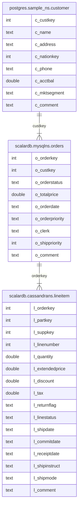

---
tags:
  - Enterprise Option
displayed_sidebar: docsEnglish
---

# Getting Started with ScalarDB Analytics

import WarningLicenseKeyContact from "/src/components/en-us/_warning-license-key-contact.mdx";

This getting-started tutorial guide explains how to set up ScalarDB Analytics and run federated queries across different databases, including PostgreSQL, MySQL, and Cassandra. For an overview of ScalarDB Analytics and its key benefits, refer to the [ScalarDB Overview](../overview.mdx) and [ScalarDB Design](../design.mdx) pages.

## What you'll build

In this tutorial, you'll set up a sample e-commerce analytics environment where:

- Customer data resides in PostgreSQL
- Order data is managed by ScalarDB in MySQL
- Line item details are stored in Cassandra, which are updated through ScalarDB transactions

You'll run analytical queries that join data across all three databases to gain business insights. The source code is available at [https://github.com/scalar-labs/scalardb-samples/tree/main/scalardb-analytics-sample](https://github.com/scalar-labs/scalardb-samples/tree/main/scalardb-analytics-sample).

## Prerequisites

- [Docker](https://www.docker.com/get-started/) 20.10 or later with [Docker Compose](https://docs.docker.com/compose/install/) V2 or later

<WarningLicenseKeyContact product="ScalarDB Analytics" />

## Step 1: Set up the environment

This section describes how to set up a ScalarDB Analytics environment.

### Clone the repository

Open **Terminal**, and clone the ScalarDB samples repository:

```console
git clone https://github.com/scalar-labs/scalardb-samples
cd scalardb-samples/scalardb-analytics-sample
```

### Configure your license

To add your ScalarDB Analytics license, open `config/scalardb-analytics-server.properties`. Then, uncomment and update the license configuration lines, replacing `<YOUR_LICENSE_KEY>` and `<YOUR_LICENSE_CERT_PEM>` with your actual license information:

```properties
# License configuration (required for production)
scalar.db.analytics.server.licensing.license_key=<YOUR_LICENSE_KEY>
scalar.db.analytics.server.licensing.license_check_cert_pem=<YOUR_LICENSE_CERT_PEM>
```

## Step 2: Set up the sample databases

To set up the sample databases, run the following command:

```console
docker compose up -d --wait
```

This command starts the following services locally:

- **ScalarDB Analytics components:**
  - **ScalarDB Analytics server:** Manages metadata about all data sources and provides a unified interface for querying.
- **Sample databases:**
  - **PostgreSQL:** Used as a non-ScalarDB-managed database (accessed directly)
  - **Cassandra and MySQL:** Used as ScalarDB-managed databases (accessed through ScalarDB's transaction layer)

In this guide, PostgreSQL is referred to as a **non-ScalarDB-managed database**, which is not managed by ScalarDB transactions, while Cassandra and MySQL are referred to as **ScalarDB-managed databases**, which are managed by ScalarDB transactions.

The sample data is automatically loaded into all databases during the initial setup. After completing the setup, the following tables should be available:

- In PostgreSQL:
  - `sample_ns.customer`
- In ScalarDB (backed by Cassandra):
  - `cassandrans.lineitem`
- In ScalarDB (backed by MySQL):
  - `mysqlns.orders`

According to the above, within ScalarDB, `cassandrans` and `mysqlns` are mapped to Cassandra and MySQL, respectively.

For details about the table schema, including column definitions and data types, refer to [Schema details](#schema-details). Ensure that the sample data has been successfully loaded into these tables.

## Step 3: Register data sources by using the ScalarDB Analytics CLI

Before running analytical queries, you need to register the data sources with the ScalarDB Analytics server. You can do this by using the ScalarDB Analytics CLI.

### Create a catalog

First, create a new catalog to organize your data sources:

```console
docker compose run --rm scalardb-analytics-cli catalog create --catalog sample_catalog
```

### Register ScalarDB as a data source

Register the ScalarDB-managed databases:

```console
docker compose run --rm scalardb-analytics-cli data-source register \
  --catalog=sample_catalog --data-source=scalardb --provider-file=/config/data-sources/scalardb.json
```

This registers tables from both Cassandra and MySQL, which are managed by ScalarDB.

### Register PostgreSQL as a data source

Register the PostgreSQL database:

```console
docker compose run --rm scalardb-analytics-cli data-source register \
  --catalog=sample_catalog --data-source=postgres --provider-file=/config/data-sources/postgres.json
```

## Step 4: Launch the Spark SQL console

To launch the Spark SQL console, run the following command:

```console
docker compose run --rm spark-sql
```

While launching the Spark SQL console, the ScalarDB Analytics catalog is initialized with the configuration in **spark-defaults.conf** and is registered as a Spark catalog named `sample_catalog`.

### Namespace mapping

The following tables in the configured data sources are mapped to Spark SQL tables, allowing seamless querying across different data sources:

- For PostgreSQL:
  - `sample_catalog.postgres.sample_ns.customer`
- For ScalarDB (backed by Cassandra):
  - `sample_catalog.scalardb.cassandrans.lineitem`
- For ScalarDB (backed by MySQL):
  - `sample_catalog.scalardb.mysqlns.orders`

## Step 5: Run analytical queries

Now that you've set up your ScalarDB Analytics environment, you can run analytical queries on the sample data by using the Spark SQL console.

### Query 1: Analyze shipping performance and returns

The SQL query below demonstrates basic analytical capabilities by examining line item data from Cassandra. The query helps answer business questions like:

- What percentage of items are returned versus shipped successfully?
- What's the financial impact of returns?
- How does pricing vary between different order statuses?

The query calculates key metrics grouped by return status and line status:

```sql
SELECT
        l_returnflag,
        l_linestatus,
        sum(l_quantity) AS sum_qty,
        sum(l_extendedprice) AS sum_base_price,
        sum(l_extendedprice * (1 - l_discount)) AS sum_disc_price,
        sum(l_extendedprice * (1 - l_discount) * (1 + l_tax)) AS sum_charge,
        avg(l_quantity) AS avg_qty,
        avg(l_extendedprice) AS avg_price,
        avg(l_discount) AS avg_disc,
        count(*) AS count_order
FROM
        sample_catalog.scalardb.cassandrans.lineitem
WHERE
        to_date(l_shipdate, 'yyyy-MM-dd') <= date '1998-12-01' - 3
GROUP BY
        l_returnflag,
        l_linestatus
ORDER BY
        l_returnflag,
        l_linestatus;
```

You should see the following output:

```console
A       F       1519    2374824.6560278563      1387364.2207725341      1962763.4654265852      26.649122807017545      41663.590456629056      0.41501802923479575    57
N       F       98      146371.2295412012       85593.96776336085       121041.55837332775      32.666666666666664      48790.409847067065      0.40984706454007996    3
N       O       5374    8007373.247086477       4685647.785126835       6624210.945739046       24.427272727272726      36397.15112312035       0.4147594809559689     220
R       F       1461    2190869.9676265526      1284178.4378283697      1814151.2807494882      25.189655172413794      37773.62013149229       0.41323493790730753    58
```

### Query 2: Cross-database analysis for revenue optimization

The following SQL query showcases the key capability of ScalarDB Analytics: joining data across different databases without data movement. Specifically, this query joins the customer table in PostgreSQL, the order table in MySQL, and the line items in Cassandra without requiring data movements by, for example, ETL pipelines. The query helps answer business questions like:

- To prioritize fulfillment, what are the high-value orders from specific customer segments that haven't shipped yet?

The query finds AUTOMOBILE segment customers with unshipped orders, ranked by revenue:

```sql
SELECT
    l_orderkey,
    sum(l_extendedprice * (1 - l_discount)) AS revenue,
    o_orderdate,
    o_shippriority
FROM
    sample_catalog.postgres.sample_ns.customer,
    sample_catalog.scalardb.mysqlns.orders,
    sample_catalog.scalardb.cassandrans.lineitem
WHERE
    c_mktsegment = 'AUTOMOBILE'
    AND c_custkey = o_custkey
    AND l_orderkey = o_orderkey
    AND o_orderdate < '1995-03-15'
    AND l_shipdate > '1995-03-15'
GROUP BY
    l_orderkey,
    o_orderdate,
    o_shippriority
ORDER BY
    revenue DESC,
    o_orderdate,
    l_orderkey
LIMIT 10;
```

You should see the following output:

```console
1071617 128186.99915996166      1995-03-10      0
1959075 33104.51278645416       1994-12-23      0
430243  19476.115819260962      1994-12-24      0
```

The result indicates that the shipment of the order with the order key `1071617` should be prioritized.

:::note

You can also run any arbitrary query that Apache Spark and Spark SQL support on the imported tables in this sample tutorial. Since ScalarDB Analytics supports all queries that Spark SQL supports, you can do not only selections (filtering), joins, aggregations, and ordering, as shown in the example, but also window functions, lateral joins, and other various operations.

To see which types of queries Spark SQL supports, see the [Spark SQL documentation](https://spark.apache.org/docs/latest/sql-ref.html).

:::

## Step 6: Stop the sample application

To stop the sample application and remove all associated volumes, run the following command. This action shuts down all services and deletes any persisted data stored in the volumes, resetting the application state:

```console
docker compose down -v
```

## Reference

### Schema details

The following entity relationship diagram illustrates the relationships between the tables across PostgreSQL, MySQL, and Cassandra, with foreign keys linking customers, orders, and line items.



- `postgres.sample_ns.customer` comes from PostgreSQL, which is not managed by ScalarDB.
- `scalardb.mysqlns.orders` and `scalardb.cassandrans.lineitem` come from ScalarDB, which are backed by MySQL and Cassandra, respectively.

The following are brief descriptions of the tables:

- **`postgres.sample_ns.customer`.** A table that represents information about customers. This table includes attributes like customer key, name, address, phone number, and account balance.
- **`scalardb.mysqlns.orders`.** A table that contains information about orders that customers have placed. This table includes attributes like order key, customer key, order status, order date, and order priority.
- **`scalardb.cassandrans.lineitem`.** A table that represents line items associated with orders. This table includes attributes such as order key, part key, supplier key, quantity, price, and shipping date.
