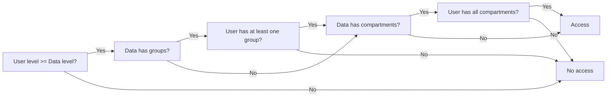
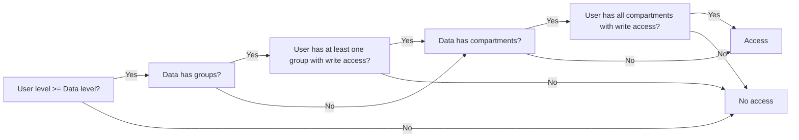

---
tags:
  - Enterprise Premium Option
  - Private Preview
displayed_sidebar: docsEnglish
---

# Control User Access in a Fine-Grained Manner

import WarningLicenseKeyContact from '/src/components/en-us/_warning-license-key-contact.mdx';

ScalarDB Cluster can authorize users in a fine-grained manner with a mechanism called attributed-based access control (ABAC). This page explains how to use ABAC in ScalarDB Cluster.

## What is ABAC?

ABAC is a fine-grained access control mechanism in ScalarDB Cluster, allowing for record-level access control instead of just table-level access control, done through [simple authorization](./scalardb-auth-with-sql.mdx). With ABAC, a user can access a particular record only if the user's attributes and the record's attributes match. For example, you can restrict access to some highly confidential records to only users with the required privileges. This mechanism is also useful when multiple applications share the same table but need to access different segments based on their respective privileges.

## Why use ABAC?

Enterprise databases often provide row-level security or similar alternatives to allow for controlling access to rows in a database table. However, if a system comprises several databases, you need to configure each database one by one in the same way. If different kinds of databases are used, you have to configure each database by understanding the differences in the capabilities of each database. Such configuration causes too much burden and is error-prone. With ABAC, you can just configure it once, even though you manage several databases under ScalarDB.

Row-level security features in most databases often require you to implement matching logic through functions like stored procedures. This can sometimes lead to writing lots of code to achieve the desired logic, which can become burdensome. In contrast, ABAC allows you to configure matching logic by using attributes known as tags. With ABAC, you only need to define these tags and assign them to users and records, eliminating the need for coding. Tags consist of several components that enable you to specify matching logic in a flexible and straightforward manner.

## Components

ABAC has several components, such as tags and policies.

### Tags

A tag is a single attribute composed of three components: levels, compartments, and groups, which can be assigned to users and data. The tags assigned to users are called user tags, while the tags assigned to data are called data tags.

#### Levels

The level component indicates the sensitivity of the data. Every user tag and data tag must have a level. For example, users might define levels such as Confidential, Sensitive, and Highly Sensitive.

For each level, the superuser defines the following attributes:

| Attribute    | Description                                                                  |
|--------------|------------------------------------------------------------------------------|
| Short name   | A short identifier for the level. This name can contain up to 30 characters. |
| Long name    | A longer, descriptive name for the level.                                    |
| Level number | A numeric value representing the level’s rank.                               | 
g
:::note

Although the superuser defines both long and short names for each level (as well as for each of the other tag components), only the short name is displayed when retrieving rows under ABAC. When users work with tags, they only need to use the short names of the components.

:::

#### Compartments

The compartment component is optional, and compartments are independent of each other. Typically, one or more compartments are defined to classify data into distinct categories. Compartments might represent specific data types, knowledge areas, geographic regions, or projects that require special approval, such as `HR`, `Finance`, or `Accounting`.

For each compartment, the superuser defines the following attributes:

| Attribute    | Description                                                                        | 
|--------------|------------------------------------------------------------------------------------|
| Short name   | A short identifier for the compartment. This name can contain up to 30 characters. |
| Long name    | A longer, descriptive name for the compartment.                                    |

#### Groups

The group component is also optional and is similar to compartments, with one key difference — groups can have parent-child relationships. Typically, one or more groups are defined to organize data. Groups are most often used to segment data by organizational structure or region, such as `EU` with child groups `France` and `Italy`, or `North America` with child groups `US` and `Canada`.

For each group, the superuser defines the following attributes:

| Attribute    | Description                                                                  |
|--------------|------------------------------------------------------------------------------|
| Short name   | A short identifier for the group. This name can contain up to 30 characters. |
| Long name    | A longer, descriptive name for the group.                                    |

#### Tag syntax

A tag is represented as a string that consists of a level, compartments, and groups. The syntax for a tag is as follows:

```plaintext
LEVEL:COMPARTMENT1,...,COMPARTMENTn:GROUP1,...,GROUPn
```

A colon (`:`) is used as the delimiter between components. Trailing delimiters are optional.

For example, a tag with the level `SENSITIVE`, compartments `HR` and `FINANCIAL`, and groups `EU` and `NA` would look like this:

```plaintext
SENSITIVE:HR,FINANCIAL:EU,NA
```

If a tag has no compartments or groups, the tag would look like this:

```plaintext
SENSITIVE
```

If a tag has compartments but no groups, the tag would look like this:

```plaintext
SENSITIVE:HR,FINANCIAL
```

If a tag has groups but no compartments, the tag would look like this:

```plaintext
SENSITIVE::EU,NA
```

### Policies

An ABAC policy is a container that stores metadata defining how access control should behave. This container specifies the policy name and the name of the column that ABAC will add to protected tables, known as the data tag column. This column stores the data tags assigned to each row in the table.

A superuser can create multiple policies, each with a unique name. Each policy can have only one data tag column, and the data tag column name must be unique across all policies.

The data tag column is a hidden column, meaning it is not displayed by default. To manipulate the data tag column, you must explicitly include it in your query.

#### Namespace and table policies

A namespace policy is an ABAC policy that is applied to a namespace. If there is a namespace policy for a namespace, all the tables under the namespace use the applied policy. Similarly, a table policy is an ABAC policy that is applied to a table.

When a namespace or table policy is created, the data tag column is automatically added to all tables in the namespace or to the specified table. Additionally, if a table is later added to a namespace that already has a namespace policy, the data tag column is automatically added to that table as well.

## Control user access by using user and data tags

ABAC controls user access by defining tags for user and data and checking if they match.

There are two key components that an ABAC policy uses to control access to data:

- **User tags:** A user tag defines a user's sensitivity level, along with compartments and groups that constrain their access to tagged data.
- **Data tags:** Assigned to each row, a data tag indicates the row's sensitivity level and includes compartments and groups that a user must be authorized for to access the row.

To access ABAC-protected data, a user must have the appropriate authorizations based on the tags defined in the policy.

### User tags

Each ABAC user has authorizations that include the following components:

- A maximum level
- A set of authorized compartments
- A set of authorized groups
- For each compartment and group, a specification for read-only access or read/write access

#### Read and write tags

The read tag is the particular combination of levels, compartments, and groups that the user is authorized to read and is used when the user reads data. The write tag is the particular combination of levels, compartments, and groups that the user is authorized to write and is used when the user writes data.

Users can specify the read and write tags for each operation to further restrict access to data, while default read and write tags are used by default. For more information, see [Adjust the user tags for each operation](#adjust-the-user-tags-for-each-operation).

#### Row tag

The row tag is the particular combination of levels, compartments, and groups that the user is authorized to write and is used as the data tag for newly inserted data.

Users can specify the row tag for `INSERT` and `UPSERT` operations, while the default row tag is used by default. For more information, see [Adjust the user tags for each operation](#adjust-the-user-tags-for-each-operation).

#### User tag information

The superuser explicitly sets authorizations for levels, compartments, and groups for users, which is called user tag information.

- Levels
  - Level
    - The maximum sensitivity level the user can access during read and write operations.
  - Default level
    - The level used in the user's default tag.
  - Row level
    - The level used in the user's default row tag.
- Compartment
  - Access mode: `READ_ONLY` or `READ_WRITE`
    - Determines whether the user is allowed to write to data that includes the compartment in its tag.
  - Default
    - Determines whether the compartment should be added to the user's default tag.
  - Row
    - Determines whether the compartment should be added to the user's default row tag.
- Group
  - Access mode: `READ_ONLY` or `READ_WRITE`
    - Determines whether the user is allowed to write to data that includes the group in its tag.
  - Default
    - Determines whether the group should be added to the user's default tag.
  - Row
    - Determines whether the group should be added to the user's default row tag.

##### Computed user tags

ABAC automatically computes several user tags based on the user tag information.

| Computed User Tag     | Description                                                                                                                     |
|-----------------------|---------------------------------------------------------------------------------------------------------------------------------|
| **Maximum read tag**  | The user's level combined with all authorized combinations of compartments and groups the user has access to.                   |
| **Maximum write tag** | The user's level combined with all compartments and groups for which the user has been granted write access.                    |
| **Default read tag**  | The user's default level combined with compartments and groups that have been designated as defaults for the user.              |
| **Default write tag** | A subset of the default read tag, containing only the compartments and groups for which the user has been granted write access. |
| **Default row tag**   | The combination of components from the user's write tag, which is used as the data tag for newly inserted data by default.      |

### Data tags

The data tag is assigned to each row and indicates the row’s sensitivity level, along with any compartments and groups a user must be authorized for to access that row. When new data is inserted, the row tag is used as the data tag. You can also update the data tag for existing rows. For more information, see [Update data tags](#update-data-tags).

### Matching algorithms

This section describes the matching algorithms for reads and writes.

#### Matching algorithm for reads

This flowchart shows the matching algorithm for reads. This algorithm is used in `SELECT`, `UPSERT`, `UPDATE`, and `DELETE` statements.



1. Check if the user's level is equal to, or greater than, the level of the data.
2. If yes and the data has groups, check if the user has access to at least one of the groups present in the data tag.
3. If yes and the data has compartments, check if the user has access to all the compartments present in the data tag.
4. If all conditions are met, the user can access the data. If any condition fails, ScalarDB will deny access to the data.

#### Matching algorithm for writes

This flowchart shows the matching algorithm for writes, which is similar to the algorithm for reads. The difference is the algorithm for writes additionally checks if the compartments and groups have write access. This algorithm is used in `UPSERT`, `UPDATE`, and `DELETE` statements.



1. Check if the user's level is equal to, or greater than, the level of the data.
2. If yes and the data has groups, check if the user has access to at least one of the groups present in the data tag with write access.
3. If yes and the data has compartments, check if the user has access to all the compartments present in the data tag with write access.
4. If all conditions are met, the user can access the data. If any condition fails, ScalarDB will deny access to the data.

#### Propagation of read/write authorizations on groups

If a user has read/write access to a parent group, they automatically inherit read/write access to its child groups. Additionally, a superuser can grant write access to a child group independently, without affecting the access granted to its parent group.

#### How user tags and data tags work together

A user can access data only within the range of their own tag authorizations.

For example, suppose you have the following levels, compartments, and groups defined in a policy:

Levels:

- `HS` (`HIGHLY_SENSITIVE`), with a level number of 4000
- `S` (`SENSITIVE`), with a level number of 3000
- `C` (`CONFIDENTIAL`), with a level number of 2000
- `P` (`PUBLIC`), with a level number of 1000

Compartments:

- `HR`
- `FIN`
- `LEG`

Groups:

- `EU`
- `FRA` (child of `EU`)
- `ITA` (child of `EU`)
- `NA`
- `US` (child of `NA`)

Then, you have the following table:

| Row | Data Tag       |
|-----|----------------|
| 1   | `S:HR:EU`      |
| 2   | `C:HR,FIN:FRA` |
| 3   | `HS:HR,FIN:EU` |
| 4   | `C:HR:NA`      |
| 5   | `P:LEG:EU`     |
| 6   | `P:FIN:ITA`    |
| 7   | `P:HR:US`      |

When you perform a read operation on the table with the read tag `S:HR,FIN:EU`, you can access rows `1`, `2`, and `6`. The following explains why:

- Since your read tag includes the `S` level, you can access rows with levels `S`, `C`, and `P`. You cannot access data with the `HS` level because it is higher than your authorized level. Therefore, you cannot read the row `3` which has the level `HS`.
- Since your read tag includes the `HR` and `FIN` compartments, you can access rows that have either or both of these compartments. Therefore, you cannot read the row `5` which has the compartment `LEG`.
- Since your read tag includes the `EU` group, you can access rows that belong to the `EU` group or any of its child groups `FRA` and `ITA`. Therefore, you cannot read the rows `4` and `7` which have the group `NA` and `US`.

When you perform a write operation on the table with the write tag `C:HR:NA`, you can write rows `4` and `7`. The following explains why:

- Since your write tag includes the `C` level, you can write data with the levels `C` and `P`. You cannot write data with the levels `S` and `HS` because they are lower than your authorized level. Therefore, you cannot write the rows `1`, and `3`.
- Since your write tag includes the `HR` compartment, you can write data that has the compartment. Therefore, you cannot write the rows `2`, `3`, `5`, and `6` which have the compartments `FIN` and `LEG`.
- Since your write tag includes the `NA` group, you can write data that belongs to the `NA` group or its child group `US`. Therefore, you cannot write the rows `1`, `2`, `3`, `5`, and `6` which have the groups `EU`, `FRA`, and `ITA`.

### Adjust the user tags for each operation

By default, ABAC uses the default computed user tags for each operation. However, users can adjust the tags for each operation to further restrict access to data.

#### Adjust the read tag

When a user reads data, the default read tag from the user tag information is used by default. Reading data occurs when doing `SELECT`, `UPSERT`, `UPDATE` and `DELETE` operations.

However, the user can specify the read tag for the operations within certain restrictions of their user tag information. The level of this tag can be set to any level up to the level of the user tag information. And, the compartments and groups can be set to any compartments and groups contained in the user tag information.

The syntax for reading data with a specified read tag is as follows:

For `SELECT`:

```sql
SELECT * FROM table_name WHERE ... WITH ABAC_READ_TAG '<READ_TAG>' FOR POLICY '<POLICY_NAME>';
```

For `UPSERT`:

```sql
UPSERT INTO table_name (column1, column2, column3, ...) VALUES (value1, value2, value3, ...) WITH ABAC_READ_TAG '<READ_TAG>' FOR POLICY '<POLICY_NAME>;
```

For `UPDATE`

```sql
UPDATE table_name SET column1 = value1, column2 = value2, column3 = value3, ... WHERE ... WITH ABAC_READ_TAG '<READ_TAG>' FOR POLICY '<POLICY_NAME>;
```

For `DELETE`

```sql
DELETE FROM table_name WHERE ... WITH ABAC_READ_TAG '<READ_TAG>' FOR POLICY '<POLICY_NAME>;
```

#### Adjust write tag

When a user writes data, the default write tag from the user tag information is used by default. This applies when doing `UPSERT`, `UPDATE`, and `DELETE` operations, which come with some form of write operations.

However, the user can set the write tag for the operation within certain restrictions of their user tag information. The level of this tag can be set to any level up to the level of the user tag information. However, the compartments and groups for this tag are more restricted. The tag can include only those compartments and groups contained in the user tag information and, among those, only the ones for which the user has write access.

The syntax for writing data with a write tag is as follows:

For `UPSERT`:

```sql
UPSERT INTO table_name (column1, column2, column3, ...) VALUES (value1, value2, value3, ...) WITH ABAC_WRITE_TAG '<WRITE_TAG>' FOR POLICY '<POLICY_NAME>;
```

For `UPDATE`:

```sql
UPDATE table_name SET column1 = value1, column2 = value2, column3 = value3, ... WHERE ... WITH ABAC_WRITE_TAG '<WRITE_TAG>' FOR POLICY '<POLICY_NAME>;
```

For `DELETE`:

```sql
DELETE FROM table_name WHERE ... WITH ABAC_WRITE_TAG '<WRITE_TAG>' FOR POLICY '<POLICY_NAME>;
```

#### Adjust row tag

When a user inserts data without specifying its data tag, the default row tag from the user tag information is assigned automatically.

However, the user can set the data tag for the written row within certain restrictions of their user tag information. The level of this tag can be set to any level up to the level of the user tag information. However, the compartments and groups for this row's new tag are more restricted. The new tag can include only those compartments and groups contained in the user tag information and, among those, only the ones for which the user has write access.

The syntax for inserting data with a data tag is as follows:

For `INSERT`:

```sql
INSERT INTO table_name (column1, column2, column3, ..., <DATA_TAG_COLUMN>) VALUES (value1, value2, value3, ..., '<DATA_TAG>');
```

For `UPSERT`:

```sql
UPSERT INTO table_name (column1, column2, column3, ..., <DATA_TAG_COLUMN>) VALUES (value1, value2, value3, ..., '<DATA_TAG>');
```

You can specify the data tag by including the data tag column in the column list and providing the data tag value in the value list when inserting data.

:::note

The data tag column is essentially a hidden column, so if you want to set or adjust the data tag, you need to explicitly include the data tag column in the column list.

:::

### View data tags

When a user reads data, the data tag can be displayed along with the data if it is explicitly specified in the `SELECT` statement:

```sql
SELECT column1, column2, column3, ..., <DATA_TAG_COLUMN> FROM table_name;
```

### Update data tags

When a user updates existing data, the data tag can be updated by specifying the data tag column. The user can update the data tag within certain restrictions of their user tag information. The level of this tag can be set to any level up to the level of the user tag information. However, the compartments and groups for this data tag are more restricted. The data tag can include only those compartments and groups contained in the user tag information and, among those, only the ones for which the user has write access.

The syntax for updating data tags is as follows:

For `UPDATE`:

```sql
UPDATE table_name SET column1 = value1, column2 = value2, column3 = value3, ..., <DATA_TAG_COLUMN> = '<DATA_TAG>' WHERE ...;
```

For `UPSERT`:

```sql
UPSERT INTO table_name (column1, column2, column3, ..., <DATA_TAG_COLUMN>) VALUES (value1, value2, value3, ..., '<DATA_TAG>');
```

### Configurations

To enable the ABAC feature, you need to configure `scalar.db.cluster.abac.enabled` to `true` in the ScalarDB Cluster node configuration file.

| Name                             | Description                          | Default |
|----------------------------------|--------------------------------------|---------|
| `scalar.db.cluster.abac.enabled` | Whether the ABAC feature is enabled. | `false` |

:::important

If you enable the ABAC feature, you will also need to do the following:

- Enable authentication and authorization. For more information, see [Authenticate and Authorize Users](./scalardb-auth-with-sql.mdx).
- Set `scalar.db.cross_partition_scan.enabled` to `true` for the system namespace (`scalardb` by default). This is because the ABAC feature performs cross-partition scans internally.

:::

You can also configure the following properties:

| Name                                                  | Description                                                                                                                                                                                                                                                                                                                                                           | Default            |
|-------------------------------------------------------|-----------------------------------------------------------------------------------------------------------------------------------------------------------------------------------------------------------------------------------------------------------------------------------------------------------------------------------------------------------------------|--------------------|
| `scalar.db.cluster.abac.cache_expiration_time_millis` | The cache expiration time of the ABAC metadata cache in milliseconds. If you update the ABAC metadata, for example, the policy configuration, you might need to wait until this expiration time is reached for the changes to be applied. Setting this property to a low number may increase the number of accesses to the backend database and decrease performance. | `60000` (1 minute) |

### Limitations

- The single CRUD operation transaction manager does not support ABAC.
- The data tag column cannot be used in the `WHERE` clause or the `ORDER BY` clause.

## Tutorial: How to use ABAC

This tutorial explains how to use the ABAC feature.

### Prerequisites

- OpenJDK LTS version (8, 11, 17, or 21) from [Eclipse Temurin](https://adoptium.net/temurin/releases/)
- [Docker](https://www.docker.com/get-started/) 20.10 or later with [Docker Compose](https://docs.docker.com/compose/install/) V2 or later

:::note

This tutorial has been tested with OpenJDK from Eclipse Temurin. ScalarDB itself, however, has been tested with JDK distributions from various vendors. For details about the requirements for ScalarDB, including compatible JDK distributions, please see [Requirements](../requirements.mdx).

:::

<WarningLicenseKeyContact product="ScalarDB Cluster" />

### 1. Create the ScalarDB Cluster configuration file

Create the following configuration file as `scalardb-cluster-node.properties`, replacing `<YOUR_LICENSE_KEY>` and `<LICENSE_CHECK_CERT_PEM>` with your ScalarDB license key and license check certificate values. For more information about the license key and certificate, see [How to Configure a Product License Key](../scalar-licensing/README.mdx).

```properties
scalar.db.storage=jdbc
scalar.db.contact_points=jdbc:postgresql://postgresql:5432/postgres
scalar.db.username=postgres
scalar.db.password=postgres
scalar.db.cluster.node.standalone_mode.enabled=true
scalar.db.cross_partition_scan.enabled=true
scalar.db.cross_partition_scan.filtering.enabled=true
scalar.db.sql.enabled=true

# Enable authentication and authorization
scalar.db.cluster.auth.enabled=true

# Enable ABAC
scalar.db.cluster.abac.enabled=true

# License key configurations
scalar.db.cluster.node.licensing.license_key=<YOUR_LICENSE_KEY>
scalar.db.cluster.node.licensing.license_check_cert_pem=<LICENSE_CHECK_CERT_PEM>
```

### 2. Create the Docker Compose file

Create the following configuration file as `docker-compose.yaml`.

```yaml
services:
  postgresql:
    container_name: "postgresql"
    image: "postgres:15"
    ports:
      - 5432:5432
    environment:
      - POSTGRES_PASSWORD=postgres
    healthcheck:
      test: ["CMD-SHELL", "pg_isready || exit 1"]
      interval: 1s
      timeout: 10s
      retries: 60
      start_period: 30s

  scalardb-cluster-standalone:
    container_name: "scalardb-cluster-node"
    image: "ghcr.io/scalar-labs/scalardb-cluster-node-with-abac-byol-premium:3.15.2"
    ports:
      - 60053:60053
      - 9080:9080
    volumes:
      - ./scalardb-cluster-node.properties:/scalardb-cluster/node/scalardb-cluster-node.properties
    depends_on:
      postgresql:
        condition: service_healthy
```

:::note

The `ghcr.io/scalar-labs/scalardb-cluster-node-with-abac-byol-premium` image is a ScalarDB Cluster node image with the ABAC feature enabled, which is not publicly available. Please [contact us](https://www.scalar-labs.com/contact) to get access to this image.

:::

### 3. Start PostgreSQL and ScalarDB Cluster

Run the following command to start PostgreSQL and ScalarDB Cluster in standalone mode.

```console
docker compose up -d
```

It may take a few minutes for ScalarDB Cluster to fully start.

### 4. Connect to ScalarDB Cluster as a superuser

To connect to ScalarDB Cluster, this tutorial uses the SQL CLI, a tool for connecting to ScalarDB Cluster and executing SQL queries. You can download the SQL CLI from the [ScalarDB releases page](https://github.com/scalar-labs/scalardb/releases).

Create a configuration file named `scalardb-cluster-sql-cli.properties`. This file will be used to connect to ScalarDB Cluster by using the SQL CLI.

```properties
scalar.db.sql.connection_mode=cluster
scalar.db.sql.cluster_mode.contact_points=indirect:localhost

# Enable authentication and authorization
scalar.db.cluster.auth.enabled=true
```

Then, start the SQL CLI by running the following command.

```console
java -jar scalardb-cluster-sql-cli-3.15.2-all.jar --config scalardb-cluster-sql-cli.properties
```

Enter the username and password as `admin` and `admin`, respectively.

Now you're ready to use the database with the ABAC feature enabled in ScalarDB Cluster.

### 5. Create a namespace and a table

Create a namespace.

```sql
CREATE NAMESPACE n;
```

Next, create a table in the `n` namespaces.

```sql
CREATE TABLE n.t (
  id INT PRIMARY KEY,
  col INT);
```

### 6. Create users and grant access to the table

Create users.

```sql
CREATE USER user1 WITH PASSWORD 'user1';
CREATE USER user2 WITH PASSWORD 'user2';
CREATE USER user3 WITH PASSWORD 'user3';
```

Then, grant the users access to the table.

```sql
GRANT ALL ON n.t TO user1;
GRANT ALL ON n.t TO user2;
GRANT ALL ON n.t TO user3;
```

### 7. Create a policy

You need to create an ABAC policy, which is a container that stores metadata describing how the policy behaves.

In this example, you can create a policy named `p` with a data tag column named `data_tag` by running the following command:

```sql
CREATE ABAC_POLICY p WITH DATA_TAG_COLUMN data_tag;
```

:::note

If you omit the data tag column, the default column name `<POLICY_NAME>_data_tag` will be used.

:::

You can check the created policy by running the following command:

```sql
SHOW ABAC_POLICIES;
```

You will see the created policy `p` in the output.

### 8. Create levels in the policy

Then, you can create levels in the policy.

In this example, you can create two levels: `HS` (`HIGHLY_SENSITIVE`) and `S` (`SENSITIVE`) by running the following command:

```sql
CREATE ABAC_LEVEL HS WITH LONG_NAME HIGHLY_SENSITIVE AND LEVEL_NUMBER 20 IN POLICY p;
CREATE ABAC_LEVEL S WITH LONG_NAME SENSITIVE AND LEVEL_NUMBER 10 IN POLICY p;
```

You can check the created levels by running the following command:

```sql
SHOW ABAC_LEVELS IN POLICY p;
```

You will see the created levels `HS` and `S` in the output.

### 9. Create compartments in the policy

Next, you create compartments in the policy.

In this example, you can create two compartments: `HR` and `LEG` by running the following command:

```sql
CREATE ABAC_COMPARTMENT HR WITH LONG_NAME HR IN POLICY p;
CREATE ABAC_COMPARTMENT LEG WITH LONG_NAME LEGAL IN POLICY p;
```

You can check the created compartments by running the following command:

```sql
SHOW ABAC_COMPARTMENTS IN POLICY p;
```

You will see the created compartments `HR` and `LEG` in the output.

### 10. Create a table policy to apply the policy to the table

Then, you can create a table policy to apply the policy `p` to the table `n.t`.

In this example, you can create a table policy named `tp` by running the following command:

```sql
CREATE ABAC_TABLE_POLICY tp USING POLICY p AND TABLE n.t;
```

At this point, the data tag column `data_tag` is added to the table `n.t`. You can check that by running the following command:

```sql
DESC n.t;
```

You can also check the created table policy by running the following command:

```sql
SHOW ABAC_TABLE_POLICIES;
```

You will see the created table policy `tp` in the output.

### 11. Assign the levels and compartments to the users

Next, you can assign the levels and compartments to the users.

For `user1`, you can assign the level `S` and the compartment `HR` by running the following command:

```sql
SET ABAC_LEVEL S FOR USER user1 IN POLICY p;
ADD ABAC_COMPARTMENT HR TO USER user1 IN POLICY p;
```

For `user2`, you can assign the level `HS` and the compartments `HR` and `LEG` by running the following command:

```sql
SET ABAC_LEVEL HS FOR USER user2 IN POLICY p;
ADD ABAC_COMPARTMENT HR TO USER user2 IN POLICY p;
ADD ABAC_COMPARTMENT LEG TO USER user2 IN POLICY p;
```

For `user3`, you can assign the level `HS` and the compartment `LEG` with read/write access by running the following command:

```sql
SET ABAC_LEVEL HS FOR USER user3 IN POLICY p;
ADD ABAC_COMPARTMENT LEG TO USER user3 WITH READ_WRITE_ACCESS IN POLICY p;
```

You can check the assigned levels and compartments by running the following commands:

```sql
SHOW ABAC_USER_TAG_INFO FOR USER user1 IN POLICY p;
SHOW ABAC_USER_TAG_INFO FOR USER user2 IN POLICY p;
SHOW ABAC_USER_TAG_INFO FOR USER user3 IN POLICY p;
```

You will see the assigned levels and compartments for each user in the output.

### 12. Insert data into the table

Insert data into the table by running the following command as a superuser:

```sql
INSERT INTO n.t (id, col, data_tag) values (1, 1, 'S:HR'), (2, 2, 'HS:HR,LEG'), (3, 3, 'HS:LEG');
```

:::note

In this tutorial, you used a superuser to insert the initial data. However, in a production environment, please assign appropriate row tags to users and make them insert the data.

:::

Then, select the data from the table by running the following command:

```sql
SELECT id, col, data_tag FROM n.t;
```

You will see all the inserted rows in the output.

### 13. Read data as `user1`

Now, read the data as `user1`.

Exit the SQL CLI. Then, restart the SQL CLI by running the following command:

```console
java -jar scalardb-cluster-sql-cli-3.15.2-all.jar --config scalardb-cluster-sql-cli.properties
```

Enter the username and password as `user1` and `user1`, respectively.

Then, read the data by running the following command:

```sql
SELECT id, col, data_tag FROM n.t;
```

You will only see the row with the data tag `S:HR` in the output. This is because `user1` has the level `S`, which means that user can't access the data with the `HS` level.

### 14. Read data as `user2`

Next, read the data as `user2`.

Exit the SQL CLI. Then, restart the SQL CLI by running the following command:

```console
java -jar scalardb-cluster-sql-cli-3.15.2-all.jar --config scalardb-cluster-sql-cli.properties
```

Enter the username and password as `user2` and `user2`, respectively.

Then, read the data by running the following command:

```sql
SELECT id, col, data_tag FROM n.t;
```

You will see all the inserted rows in the output. This is because `user2` has the level `HS` and the compartments `HR` and `LEG`, so that user can access all the data.

### 15. Read data as `user3`

Then, read the data as `user3`.

Exit the SQL CLI. Then, restart the SQL CLI by running the following command:

```console
java -jar scalardb-cluster-sql-cli-3.15.2-all.jar --config scalardb-cluster-sql-cli.properties
```

Enter the username and password as `user3` and `user3`, respectively.

Then, read the data by running the following command:

```sql
SELECT id, col, data_tag FROM n.t;
```

You will only see the row with the data tag `HS:LEG` in the output. This is because `user3` has the level `HS` and the compartment `LEG`, so that user can't access the data with the `HR` compartment.

### 16. Write data as `user2`

Next, write data as `user2`.

Exit the SQL CLI. Then, restart the SQL CLI by running the following command:

```console
java -jar scalardb-cluster-sql-cli-3.15.2-all.jar --config scalardb-cluster-sql-cli.properties
```

Enter the username and password as `user2` and `user2`, respectively.

Then, write data by running the following command:

```sql
UPDATE n.t SET col = 10 WHERE id = 3;
```

However, you will see an error message because `user2` doesn't have write access to the `LEG` compartment.

### 17. Write data as `user3`

Then, write data as `user3`.

Exit the SQL CLI. Then, restart the SQL CLI by running the following command:

```console
java -jar scalardb-cluster-sql-cli-3.15.2-all.jar --config scalardb-cluster-sql-cli.properties
```

Enter the username and password as `user3` and `user3`, respectively.

Then, write data by running the following command:

```sql
UPDATE n.t SET col = 10 WHERE id = 3;
```

The command will be executed successfully because `user3` has write access to the `LEG` compartment.

And then, read the data by running the following command:

```sql
SELECT id, col, data_tag FROM n.t;
```

You will see the updated row in the output.

## Additional details

The ABAC feature is currently in Private Preview. For more details, please [contact us](https://www.scalar-labs.com/contact) or wait for this feature to become publicly available in a future version.
