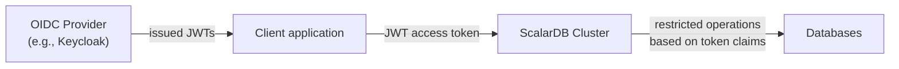

---
tags:
  - Enterprise Premium
displayed_sidebar: docsEnglish
---

# Control User Access via OIDC-Based JWT Access Tokens

import WarningLicenseKeyContact from '../components/_warning-license-key-contact.mdx';
import JDKVersions from '../components/_prerequisites-jdk-versions.mdx';

ScalarDB Cluster can control user access based on JWT access tokens issued by an OpenID Connect (OIDC) provider (for example, Keycloak), as an alternative to password-based authentication, allowing client applications to authenticate requests without directly managing ScalarDB passwords.

## How OIDC-based access control works

The following sections describe the use case, authentication flow, and validation rules for OIDC-based access control.

### Use case

OIDC-based access control is designed for scenarios where one or more OIDC users map to a single ScalarDB service user. The OIDC client application authenticates users through the OIDC Provider, obtains a JWT access token containing the ScalarDB username and access scope, and sends the token with each request to ScalarDB Cluster.

The OIDC Provider issues JWT access tokens to the client application. The client sends the token with each request to ScalarDB Cluster, which validates the token, maps it to a ScalarDB user, and restricts access based on the token claims.

### Authentication flow

When a client sends a request with a JWT access token, ScalarDB Cluster performs the following steps:

1. **Fetches the OIDC Provider configuration.** ScalarDB Cluster retrieves the OpenID Provider configuration from `{issuer_url}/.well-known/openid-configuration` and caches the result.
2. **Fetches the JWKS.** ScalarDB Cluster extracts the JSON Web Key Set (JWKS) URL from the provider configuration, fetches the keys, and caches them.
3. **Validates the JWT.** ScalarDB Cluster verifies the token signature and standard claims per [RFC 9068](https://datatracker.ietf.org/doc/html/rfc9068#name-validating-jwt-access-token).
4. **Maps the token to a ScalarDB user.** ScalarDB Cluster extracts the ScalarDB username from the configured claim and looks up the user record.
5. **Validates the authentication method.** ScalarDB Cluster confirms that the user is permitted to use OIDC authentication and that the issuer is trusted. OIDC authentication is enabled for a user when the user is created with the `AUTH_METHOD OIDC` option.
6. **Executes the request.** ScalarDB Cluster executes the request as the mapped ScalarDB user with the applicable restrictions.

### JWT access token validation

ScalarDB Cluster validates JWT access tokens following [RFC 9068](https://datatracker.ietf.org/doc/html/rfc9068). Specifically, it performs the following checks:

- **`typ` header:** By default, the `typ` header must be `at+jwt` or `application/at+jwt`. You can disable this check by setting `require_at_jwt_typ` to `false`.
- **Signature:** The token signature is verified by using the keys from the OIDC Provider's JWKS endpoint. Only the following algorithms are accepted: RSASSA-PKCS-v1_5, RSASSA-PSS, and ECDSA.
- **`iss` claim:** The issuer must match the value configured in `trusted_issuers`.
- **`aud` claim:** The audience must contain the value configured in `audience.name`.
- **`exp` claim:** The token must not be expired. A configurable clock skew tolerance is applied.

### User mapping

ScalarDB Cluster identifies the ScalarDB user by extracting the value of the claim specified in `username.claim_name` from the validated JWT. ScalarDB uses this value to look up the corresponding user record in the `users` metadata table.

:::warning

Choose the username claim carefully. Unintentionally or incorrectly sharing a ScalarDB user across OIDC users may cause a security issue.

:::

## Configurations

This section describes the configurations for OIDC-based access control. For general authentication and authorization configurations, see [Authenticate and Authorize Users](./scalardb-auth-with-sql.mdx).

### Server-side configurations

The following are the minimum required server-side configurations for OIDC-based access control. You must also set `scalar.db.cluster.auth.enabled` to `true`.

| Property                                                | Description                                                                                          | Default value |
|---------------------------------------------------------|------------------------------------------------------------------------------------------------------|---------------|
| `scalar.db.cluster.auth.oidc.trusted_issuers`          | The trusted OIDC issuer URL. Tokens whose `iss` claim does not match this value are rejected. This property must be specified when using OIDC-based access control. | empty |
| `scalar.db.cluster.auth.oidc.username.claim_name`      | The JWT claim name used to extract the ScalarDB username. This property must be specified when using OIDC-based access control. | empty |
| `scalar.db.cluster.auth.oidc.audience.name`             | The expected value in the JWT `aud` claim.                                                           | `scalardb`    |

For additional server-side configurations (cache TTL, clock skew, etc.), see [OIDC configurations](./scalardb-cluster-configurations.mdx#oidc-configurations) in the ScalarDB Cluster configurations.

### Client-side configurations

The following are the client-side configurations for OIDC-based access control. When you use `oidc_jwt`, the `scalar.db.username` and `scalar.db.password` properties are not required.

| Property                                                      | Description                                                                                                  | Default value |
|---------------------------------------------------------------|--------------------------------------------------------------------------------------------------------------|---------------|
| `scalar.db.cluster.client.auth.type`                          | The authentication type for the primitive interface. Set to `oidc_jwt` for OIDC.                             | empty (treated as `userpass`) |
| `scalar.db.sql.cluster_mode.auth.type`                        | The authentication type for the SQL interface. Set to `oidc_jwt` for OIDC.                                   | empty (treated as `userpass`) |

:::note

You can pass the JWT access token programmatically by using `OidcJwtAccessTokenHolder`, which is the recommended option when handling many OIDC users. Alternatively, you can supply the token via the access token property (`scalar.db.cluster.client.auth.oidc_jwt.access_token` for the primitive interface or `scalar.db.sql.cluster_mode.auth.oidc_jwt.access_token` for the SQL interface), which is easy to start with, especially for testing with tools like the SQL CLI. However, since the token is set at initialization time, it cannot be refreshed.

:::

For additional client-side configurations, see the configurations for the [primitive interface](./scalardb-cluster-configurations.mdx#configurations-for-the-primitive-interface) and the [SQL interface](./scalardb-cluster-configurations.mdx#configurations-for-the-sql-interface) in the ScalarDB Cluster configurations.

## Troubleshooting

Detailed error messages are shown in the ScalarDB Cluster node log. Check the log for the root cause when a request fails.

| Error | Possible cause | Resolution |
|-------|---------------|------------|
| JWT validation error | The `trusted_issuers` configuration does not match the Keycloak issuer URL. | Check the Keycloak realm settings and verify the issuer URL by visiting `{keycloak_url}/realms/{realm}/.well-known/openid-configuration`. |
| User not found | The claim specified in `username.claim_name` is missing from the JWT, or the ScalarDB user does not exist. | Decode the JWT to verify the claim, and run `SHOW USERS` in the SQL CLI to confirm the user exists. |
| Audience mismatch | The `audience.name` configuration does not match the `aud` claim in the JWT. | Verify that the Keycloak audience mapper and the `audience.name` property use the same value. |
| `typ` header error | The JWT `typ` header is not `at+jwt`. | Verify that the Keycloak client is configured to use `at+jwt` as the access token header type, or set `require_at_jwt_typ` to `false` for development purposes. |
| Authentication method error | The ScalarDB user is not permitted to use OIDC, or the user is a superuser. | Verify that the user was created with `AUTH_METHOD OIDC` and that the user is not a superuser. |

## See also

- [Authenticate and Authorize Users](./scalardb-auth-with-sql.mdx)
- [ScalarDB Cluster Configurations](./scalardb-cluster-configurations.mdx)
