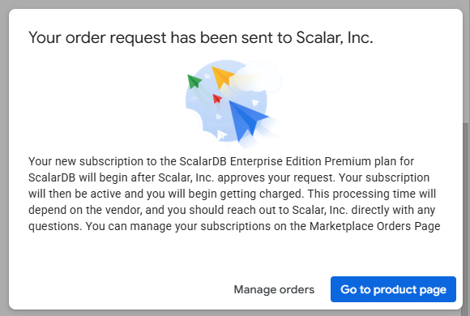
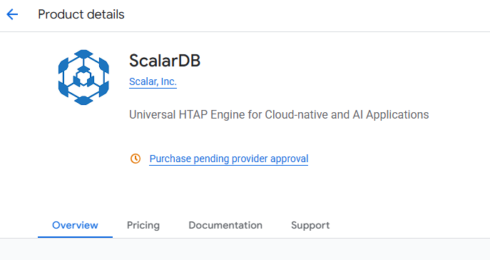
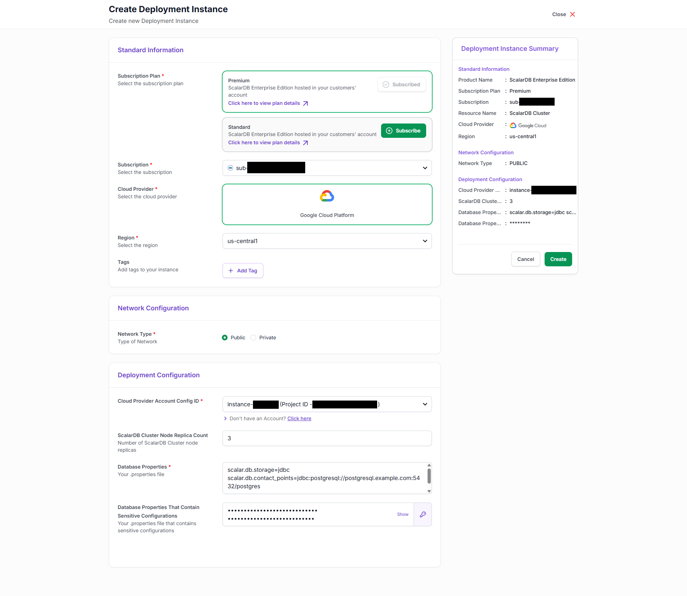
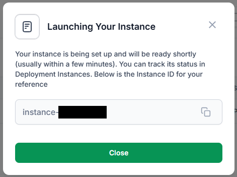
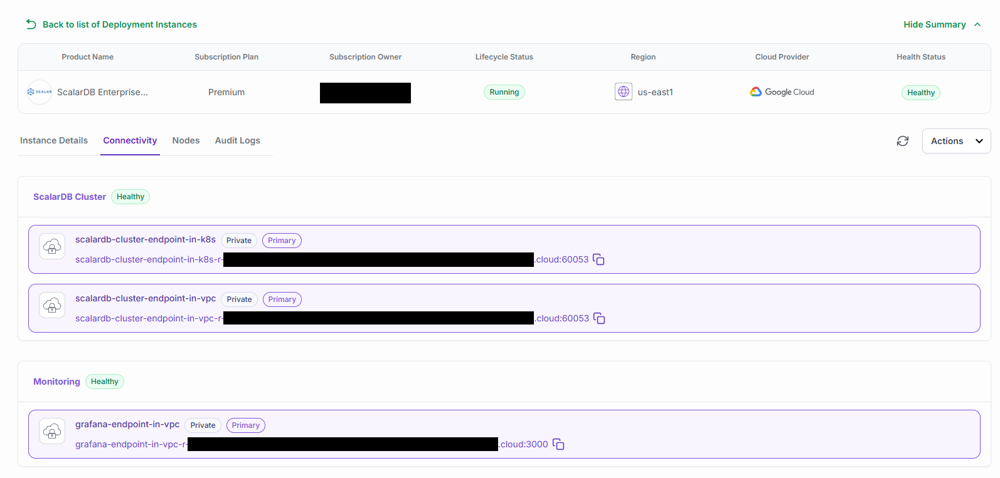

---
tags:
  - Enterprise Standard
  - Enterprise Premium
displayed_sidebar: docsEnglish
---

# Deploy ScalarDB Cluster through Google Marketplace

This document explains how to deploy ScalarDB Cluster in your Google Cloud environment through Google Marketplace.

## Prerequisites

- You must create a Google Cloud project to deploy ScalarDB Cluster.
- You must prepare the backend databases that you want to use under ScalarDB Cluster.

## Deploy ScalarDB Cluster

1. Decide which edition of ScalarDB Cluster you want to use, based on the [features](../features.mdx) of each edition.
1. Go to the [ScalarDB page on Google Marketplace](https://console.cloud.google.com/marketplace/product/scalarlabs-public/scalardb).

1. Subscribe to `ScalarDB Enterprise Edition Standard` or `ScalarDB Enterprise Edition Premium`.

   

1. On the **New ScalarDB subscription** page, read the content under **Additional terms** and select the checkbox. Then, select the **Subscribe** button.

   

1. When the **Your order request has been sent to Scalar, Inc.** pop-up window is displayed, select the **Go to product page** button.

   

   The **Purchase pending provider approval** message will be displayed at the top of the product page. Please wait for the team at Scalar to approve your request.

   

1. After your request has been approved, the **Manage on provider** button will be displayed at the top of the product page. Select the **Manage on provider** button.

   

1. When the pop-up window asking you to confirm leaving Google Marketplace is displayed, select the **OK** button.

   

1. When the Scalar portal login page is displayed, enter your email address and select the **Next** button.

   

1. Select the **Sign up with a password** button.

   

1. On the **Get Started Today** page, enter your account information.

   

1. When the **Verify Your Email to Activate Your Account** page is displayed, check your email and select the link in the message that you received to activate your account.

   

1. After you verify your account, you will see the log in page again. Please log in to the Scalar portal.

   

   After you log in, the **Deployment Instances** page will be displayed.

   

1. In the sidebar navigation, select **Cloud Accounts**. Then, select the **Create** button on the **Cloud Accounts** screen.

   

1. On the **Cloud Accounts** page, select the **Subscribe** button.

   :::important

   Please make sure that you select the same edition that you selected on the Google Marketplace page.

   :::

   

1. After you select the **Subscribe** button, the button will show the message **Pending Approval**. Please wait for the team at Scalar to approve your request.

   

   After your request has been approved, you will get an email with the title **Your ScalarDB Enterprise Edition - [EDITION_NAME] subscription request approved** from the following email address: marketplace-notifications@scalar-labs.com. Also, after your request has been approved, the **Subscribe** button on the **Cloud Accounts** page of the Scalar portal will be grayed out.

   

1. On the **Cloud Accounts** page, enter the **Project ID** and **Project number** of your Google Cloud project that you want to use for the ScalarDB Cluster deployment. You can use the default values for the other configurations like **Subscription**, **Cloud Provider**, and **Account Configuration Method**. After you enter the **Project ID** and **Project number**, select the **Create** button.

   

1. When the **Account Configuration Instructions** pop-up window is displayed, copy the bash command and select the link **Google Cloud Shell** to open the Google Cloud Shell.

   

1. In the Google Cloud Shell, paste the bash command that you copied in the **Account Configuration Instructions** pop-up window and execute the command. You will be asked **Do you want to proceed?**, like in the example output below. Enter **yes**.

   ```console
   =============================================
         Google Cloud Setup Script
   =============================================
   This script will configure your GCP project.
   ✔ Enable required GCP APIs
   ✔ Create & configure service accounts
   ✔ Assign IAM roles
   ✔ Setup Workload Identity Pool and OIDC Provider
   -----------------------------------------------
   Do you want to proceed? (yes/no): 
   ```

   If the bash command is successful, a message like the following will be displayed.

   ```console
   YYYY-MM-DD HH:MM:SS - [INFO] - Script completed successfully.
   ```

1. On the **Cloud Accounts** page in the Scalar portal, the status will be **Ready**.

   

1. In the sidebar navigation, select **Instances**. Then, select the **Create** button on the **Deployment Instances** screen.  


   

1. On the **Create Deployment Instance** page, enter the configurations as follows:

   - **Subscription Plan:** Select the edition you subscribed.
   - **Subscription:** Use the default value. (You don't need to update this value.)
   - **Cloud Provider:** Use the default value. (You don't need to update this value.)
   - **Region:** Select the region that you want to deploy ScalarDB Cluster in.
   - **Tags:** Set any arbitrary tags.
   - **Network Type:** Select **Public**.
   - **Cloud Provider Account Config ID:** Select your cloud account that you previously registered on the **Cloud Accounts** page.
   - **ScalarDB Cluster Node Replica Count:** Enter the number of ScalarDB Cluster node replicas.
   - **Database Properties:** Enter the ScalarDB Cluster properties. For details, please see [ScalarDB Cluster Configurations](./scalardb-cluster-configurations.mdx).
   - **Database Properties (Sensitive Information):** Enter the ScalarDB Cluster properties, like `scalar.db.username` and `scalar.db.password`. These values are invisible in the Scalar portal after you deploy ScalarDB Cluster.

     :::note

     In this text box, you can enter (copy and paste) the properties in the same format as normal database properties. For example:

     ```properties
     scalar.db.username=<USERNAME>
     scalar.db.password=<PASSWORD>
     ```

     These values are automatically masked when you enter them into this text box.

     :::

   Example:

   

1. After you enter the configurations for your deployment, select the **Create** button. The **Launching Your Instance** pop-up window will be displayed.

   

1. After your instance has been launched, your deployed instance will be displayed with **Lifecycle Status** as **Running**.

   

   :::note

   Deploying a new instance will take time. In particular, if this is the first time that your ScalarDB Cluster instance is deployed to the region that you selected, a GKE cluster will be created first, which will take a significant amount of time.

   :::

1. To see the endpoint information to access the ScalarDB Cluster endpoint and the Grafana dashboard, select an instance under **Instance ID** and go to the **Connectivity** tab.

   
