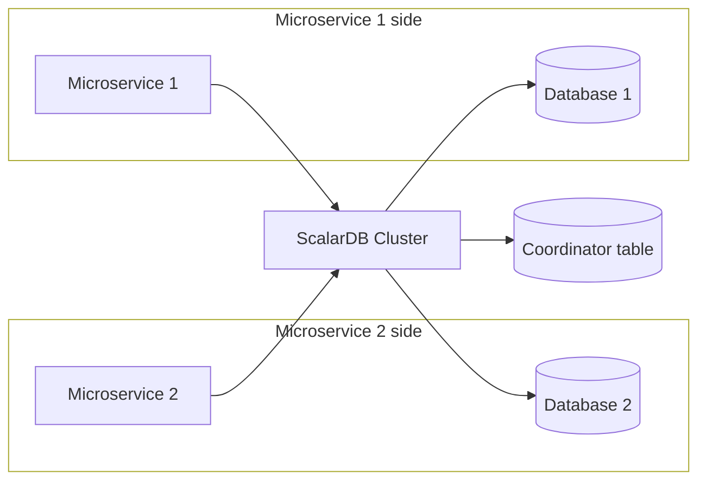
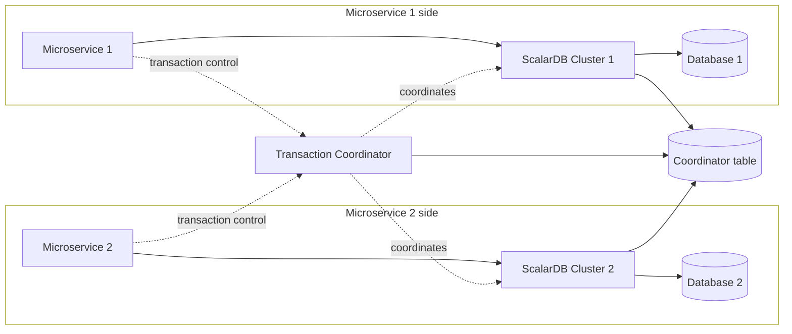

---
tags:
  - Enterprise Standard
  - Enterprise Premium
displayed_sidebar: docsEnglish
---

# ScalarDB Cluster Deployment Patterns for Microservices

When building microservice applications that use ScalarDB Cluster, there are two patterns you can choose for how to deploy ScalarDB Cluster: shared-cluster pattern and separated-cluster pattern.
This document first explains those patterns, how they differ, and the basic guidelines on which one to choose in which cases.

Also, this document assumes that your microservice applications are created based on the database-per-service pattern, where each microservice manages its database, and a microservice needs to access another microservice's database via APIs between the microservices.

## ScalarDB Cluster deployment patterns

In the shared-cluster pattern, microservices share one ScalarDB Cluster instance, which is a cluster of ScalarDB Cluster nodes, in a system, so they access the same ScalarDB Cluster instance to interact with their databases. On the other hand, in the separated-cluster pattern, microservices use several ScalarDB Cluster instances. Typically, one microservice accesses one ScalarDB Cluster instance to interact with its database, and a separate component called the Transaction Coordinator drives each transaction across those instances.

The following diagram shows the shared-cluster pattern, where the microservices reach all the databases through the same ScalarDB Cluster instance.

The following diagram shows the separated-cluster pattern, where each microservice owns a ScalarDB Cluster instance in addition to its database. What remains outside the microservices is shared: the Transaction Coordinator that drives the transaction, and the Coordinator table that the Transaction Coordinator and both ScalarDB Cluster instances read from and write to.

:::note

In either pattern, you need to manage the Coordinator table in addition to the databases that your microservices require. In the separated-cluster pattern, the Transaction Coordinator and every ScalarDB Cluster instance must be able to reach the database that holds the Coordinator table.

:::

## How the patterns affect your application code

To run a transaction that spans microservices, you use the Microservice Transaction API in both patterns. For details about the API, see [ScalarDB Cluster Java API Guide](./api-guide.mdx#microservice-transaction-api).

Your application code does not change between the patterns. Your microservices do not coordinate the commit protocol among themselves: in the shared-cluster pattern, the single ScalarDB Cluster instance does that on their behalf, and in the separated-cluster pattern, the Transaction Coordinator does. Either way, the code that begins a transaction, reads and writes records, and commits is the same in both patterns. The difference between the patterns is in configuration only.

Because of that, choosing a pattern is a deployment decision instead of a programming-model decision, and you can move from one pattern to the other later without rewriting your microservices. The rest of this document describes what to weigh when you make that decision.

For a working example, see [Create an Application That Supports Microservice Transactions by Using the Microservice Transaction API](../scalardb-samples/microservice-transaction-sample-with-cluster/README.mdx), which runs one copy of the application code against both patterns.

## Pros and cons

One obvious difference is the amount of resources for ScalarDB Cluster instances. With the separated-cluster pattern, you need more resources to manage your applications. This also incurs more maintenance burden and costs.

In addition, the separated-cluster pattern requires an additional component. The Transaction Coordinator drives each transaction across the ScalarDB Cluster instances, so you need to deploy and operate it alongside them. Every ScalarDB Cluster instance needs to reach the Coordinator table because an instance that finds a record left by an unfinished transaction looks up the state of that transaction to recover the record.

Moreover, the level of resource isolation is different. Microservices should be well-isolated for better maintainability and development efficiency, but the shared-cluster pattern brings weaker resource isolation. Weak resource isolation might also bring weak security. However, security risks can be mitigated by using the security features of ScalarDB Cluster, like authentication and authorization.

Similarly, there is a difference in how systems are administrated. Specifically, in the shared-cluster pattern, a team must be tasked with managing a ScalarDB Cluster instance on behalf of the other teams. Typically, the central data team can manage it, but issues may arise if no such team exists. With the separated-cluster pattern, administration is more balanced but has a similar issue for the Coordinator table. The issue can be addressed by having a microservice for coordination and making a team manage the microservice.

The following is a summary of the pros and cons of the patterns.

### Shared-cluster pattern

- **Pros:**
  - Simple deployment and operations because it requires neither several ScalarDB Cluster instances nor the Transaction Coordinator. (Backup operations for databases can also be simple.)
  - Less resource usage because it uses one ScalarDB Cluster instance.
- **Cons:**
  - Weak resource isolation between microservices.
  - Unbalanced administration. (One team needs to manage a ScalarDB Cluster instance on behalf of the others.)

### Separated-cluster pattern

- **Pros:**
  - Better resource isolation.
  - More balanced administration. (A team manages one microservice and one ScalarDB Cluster instance. Also, a team must be tasked with managing the Coordinator table.)
- **Cons:**
  - More components to deploy and operate because it requires the Transaction Coordinator in addition to several ScalarDB Cluster instances. (Backup operations for databases can also be complex.)
  - The database that holds the Coordinator table must be reachable from the Transaction Coordinator and from every ScalarDB Cluster instance.
  - More resource usage because of several ScalarDB Cluster instances.

## Which pattern to choose

Choose a pattern by weighing the pros and cons above against your requirements, since neither pattern is the right default for every system. If you choose the separated-cluster pattern, make sure that your team can operate the Transaction Coordinator and can keep the database that holds the Coordinator table reachable from every ScalarDB Cluster instance. For details about how to configure the Transaction Coordinator and the ScalarDB Cluster instances that participate in its transactions, see [Transaction Coordinator configurations](./scalardb-cluster-configurations.mdx#transaction-coordinator-configurations).

You might wonder whether sharing a ScalarDB Cluster instance between microservices violates the database-per-service pattern. Since ScalarDB Cluster stores all critical states in their underlying databases and does not hold any critical states in its memory, it can be seen as just a path to the databases. Therefore, a system with the shared-cluster pattern still complies with the database-per-service pattern and still largely aligns with the microservice philosophy.

You can also mix the patterns instead of applying one to your whole system. For example, several microservices can share one ScalarDB Cluster instance while another microservice owns one. In such a system, whether a microservice needs the Transaction Coordinator depends on how far its transactions reach. A microservice that runs transactions only within a single ScalarDB Cluster instance does not need the Transaction Coordinator, whereas a microservice that runs transactions spanning ScalarDB Cluster instances does.

Since your application code is the same in every pattern, you can also change your choice later without rewriting your microservices.

## Limitations

ScalarDB provides several APIs, such as CRUD, SQL, and Spring Data JDBC. Currently, the Microservice Transaction API is supported only in the CRUD interface. The SQL interface and the Spring Data JDBC interface do not support the Microservice Transaction API yet.

## See also

- [ScalarDB Cluster Java API Guide](./api-guide.mdx)
- [Transaction Coordinator configurations](./scalardb-cluster-configurations.mdx#transaction-coordinator-configurations)
- [Create an Application That Supports Microservice Transactions by Using the Microservice Transaction API](../scalardb-samples/microservice-transaction-sample-with-cluster/README.mdx)
