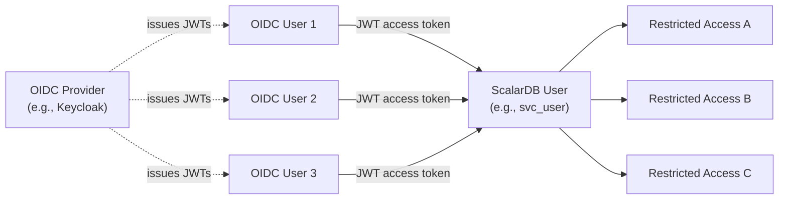

---
tags:
  - Enterprise Premium
displayed_sidebar: docsEnglish
---

# Integrate OIDC for Access Control

import WarningLicenseKeyContact from '/src/components/en-us/_warning-license-key-contact.mdx';

ScalarDB Cluster supports OpenID Connect (OIDC) access control based on JWT access tokens as an alternative to password-based authentication. By using JWT access tokens from an OIDC provider (for example, Keycloak), client applications can authenticate requests without managing ScalarDB passwords directly. When combined with [ABAC](./authorize-with-abac.mdx), claims in the JWT access token can dynamically restrict per-request access based on attributes embedded in the token.

## How the OIDC integration works

This section describes the key concepts behind the OIDC integration in ScalarDB Cluster.

### Use case

The OIDC integration is designed for scenarios where one or more OIDC users map to a single ScalarDB service user. The OIDC client application authenticates users through the OIDC provider, obtains a JWT access token containing the ScalarDB username and access scope, and sends the token with each request to ScalarDB Cluster.



ScalarDB Cluster processes requests within the permissions of the mapped ScalarDB user, further restricted by the JWT claims.

### Authentication flow

When a client sends a request with a JWT access token, ScalarDB Cluster performs the following steps:

1. **Fetches the OIDC provider configuration.** ScalarDB Cluster retrieves the OpenID Provider Configuration from `{issuer_url}/.well-known/openid-configuration` and caches the result.
2. **Fetches the JWKS.** ScalarDB Cluster extracts the JWKS (JSON Web Key Set) URL from the provider configuration, fetches the keys, and caches them.
3. **Validates the JWT.** ScalarDB Cluster verifies the token signature and standard claims per [RFC 9068](https://datatracker.ietf.org/doc/html/rfc9068#name-validating-jwt-access-token).
4. **Maps the token to a ScalarDB user.** ScalarDB Cluster extracts the ScalarDB username from the configured claim and looks up the user record.
5. **Validates the authentication method.** ScalarDB Cluster confirms that the user is permitted to use OIDC authentication and that the issuer is trusted.
6. **Applies ABAC restrictions when enabled.** If the OIDC ABAC integration is enabled, the JWT must contain an ABAC claim. ScalarDB Cluster calculates the ABAC user tag for the session and applies it. Tokens without the ABAC claim are rejected.
7. **Executes the request.** ScalarDB Cluster executes the request as the mapped ScalarDB user with the applicable restrictions.

### JWT access token validation

ScalarDB Cluster validates JWT access tokens following [RFC 9068](https://datatracker.ietf.org/doc/html/rfc9068). Specifically, the following checks are performed:

- **`typ` header:** By default, the `typ` header must be `at+jwt` or `application/at+jwt`. You can disable this check by setting `require_at_jwt_typ` to `false`.
- **Signature:** The token signature is verified by using the keys from the OIDC provider's JWKS endpoint. Only the following algorithms are accepted: RSASSA-PKCS-v1\_5, RSASSA-PSS, and ECDSA.
- **`iss` claim:** The issuer must match the value configured in `trusted_issuers`.
- **`aud` claim:** The audience must contain the value configured in `audience.name`.
- **`exp` claim:** The token must not be expired. A configurable clock skew tolerance is applied.

### User mapping

ScalarDB Cluster identifies the ScalarDB user by extracting the value of the claim specified in `username.claim_name` from the validated JWT. ScalarDB uses this value to look up the corresponding user record in the `users` metadata table.

:::warning

Choose the username claim carefully. Unintentionally or incorrectly sharing a ScalarDB user across OIDC users may cause a security issue.

:::

### Per-user authentication method

Each ScalarDB user has an `authentication_methods` attribute that specifies which authentication methods are permitted for that user. When a user is created with the `AUTH_METHOD OIDC` option, OIDC authentication is enabled for that user.

The following restrictions apply to OIDC users:

- **Superusers cannot use OIDC.** If the mapped ScalarDB user is a superuser, the OIDC authentication request is rejected for security reasons.
- **The issuer must be trusted.** The `iss` claim in the JWT must match the value in the `trusted_issuers` configuration.

### Dynamic ABAC restriction

When the OIDC ABAC integration is enabled, ScalarDB Cluster reads the ABAC claim (default name: `scalardb_abac`) from the JWT and uses it to dynamically restrict the user's access for the current request. The ABAC claim can only restrict (never expand) the permissions of the mapped ScalarDB user.

If the ABAC claim is present but exceeds the ScalarDB user's permissions, the request is rejected. If the OIDC ABAC integration is enabled and the ABAC claim is absent from the JWT, the request is also rejected.

For details about the claim structure and validation rules, see [JWT ABAC claim reference](#jwt-abac-claim-reference).

## Configurations

This section describes the configurations for the OIDC integration. For general authentication and authorization configurations, see [Authenticate and Authorize Users](./scalardb-auth-with-sql.mdx).

### Server-side configurations

For server-side OIDC configurations, see [OIDC configurations](./scalardb-cluster-configurations.mdx#oidc-configurations) in the ScalarDB Cluster configurations.

:::note

In addition to the OIDC-specific properties, you must also enable authentication and authorization by setting `scalar.db.cluster.auth.enabled` to `true`. If you use ABAC, you must also set `scalar.db.cluster.abac.enabled` to `true`.

:::

### Client-side configurations

For client-side OIDC configurations, see the [Java Client SDK configurations](./scalardb-cluster-configurations.mdx#java-client-sdk-configurations) in the ScalarDB Cluster configurations for both the [primitive interface](./scalardb-cluster-configurations.mdx#configurations-for-the-primitive-interface) and the [SQL interface](./scalardb-cluster-configurations.mdx#configurations-for-the-sql-interface).

:::note

When you use `oidc_jwt`, the `scalar.db.username` and `scalar.db.password` properties are not required. You can pass the JWT access token programmatically by using `OidcJwtAccessTokenHolder`, which is the recommended option when handling many OIDC users. Alternatively, you can supply the token via a property (for example, `scalar.db.sql.cluster_mode.auth.oidc_jwt.access_token`), which is easy to start with, especially for testing with tools like the SQL CLI. However, since the token is set at initialization time, it cannot be refreshed.

:::


## Tutorial - Integrate OIDC with ABAC for dynamic access control

This tutorial demonstrates how to set up OIDC authentication with ABAC dynamic access control by using Keycloak as the OIDC provider. You will set up ScalarDB Cluster, configure ABAC policies, set up Keycloak, and verify the integration by using both `curl` and the Java client.

### Prerequisites

- OpenJDK LTS version (8, 11, 17, or 21) from [Eclipse Temurin](https://adoptium.net/temurin/releases/)
- [Docker](https://www.docker.com/get-started/) 20.10 or later with [Docker Compose](https://docs.docker.com/compose/install/) V2 or later
- [`jq`](https://jqlang.github.io/jq/download/) for JSON processing

:::note

This tutorial has been tested with OpenJDK from Eclipse Temurin. ScalarDB itself, however, has been tested with JDK distributions from various vendors. For details about the requirements for ScalarDB, including compatible JDK distributions, please see [Requirements](../requirements.mdx).

:::

:::note

This tutorial uses `auth.localhost` as the hostname for Keycloak. On macOS and Linux, `*.localhost` subdomains automatically resolve to `127.0.0.1` per [RFC 6761](https://www.rfc-editor.org/rfc/rfc6761). If name resolution does not work in your environment (some Windows configurations or certain browsers like Firefox), add the following entry to your hosts file (`/etc/hosts` on macOS/Linux or `C:\Windows\System32\drivers\etc\hosts` on Windows):

```plaintext
127.0.0.1 auth.localhost
```

:::

<WarningLicenseKeyContact product="ScalarDB Cluster" />

### 1. Create the ScalarDB Cluster configuration file

Create the following configuration file as `scalardb-cluster-node.properties`, replacing `<YOUR_LICENSE_KEY>` and `<LICENSE_CHECK_CERT_PEM>` with your ScalarDB license key and license check certificate values. For more information about the license key and certificate, see [How to Configure a Product License Key](../scalar-licensing/index.mdx).

```properties
scalar.db.storage=jdbc
scalar.db.contact_points=jdbc:postgresql://postgresql:5432/postgres
scalar.db.username=postgres
scalar.db.password=postgres
scalar.db.cluster.node.standalone_mode.enabled=true
scalar.db.sql.enabled=true

# Enable cross-partition scan to perform a full scan by using the SELECT statements in this tutorial.
# This is not required for OIDC or ABAC itself.
scalar.db.cross_partition_scan.enabled=true
scalar.db.cross_partition_scan.filtering.enabled=true

# Enable authentication and authorization
scalar.db.cluster.auth.enabled=true

# OIDC configurations
# auth.localhost resolves via RFC 6761 on the host and via the Docker network alias inside containers.
scalar.db.cluster.auth.oidc.trusted_issuers=http://auth.localhost:8080/realms/scalardb-demo
scalar.db.cluster.auth.oidc.audience.name=scalardb
scalar.db.cluster.auth.oidc.username.claim_name=scalardb_username
scalar.db.cluster.auth.oidc.jwt.access_token.require_at_jwt_typ=true

# ABAC configurations
scalar.db.cluster.abac.enabled=true
scalar.db.cluster.auth.oidc.abac.enabled=true

# License key configurations
scalar.db.cluster.node.licensing.license_key=<YOUR_LICENSE_KEY>
scalar.db.cluster.node.licensing.license_check_cert_pem=<LICENSE_CHECK_CERT_PEM>
```


### 2. Create the Docker Compose file

Create the following configuration file as `docker-compose.yaml`.

```yaml
services:
  postgresql:
    container_name: "postgresql"
    image: "postgres:15"
    ports:
      - 5432:5432
    environment:
      - POSTGRES_PASSWORD=postgres
    healthcheck:
      test: ["CMD-SHELL", "pg_isready || exit 1"]
      interval: 1s
      timeout: 10s
      retries: 60
      start_period: 30s

  keycloak:
    container_name: "keycloak"
    image: "quay.io/keycloak/keycloak:26.2"
    ports:
      - 8080:8080
    environment:
      - KEYCLOAK_ADMIN=admin
      - KEYCLOAK_ADMIN_PASSWORD=admin
      - KC_HOSTNAME=http://auth.localhost:8080
    command: start-dev
    networks:
      default:
        aliases:
          - auth.localhost

  scalardb-cluster-standalone:
    container_name: "scalardb-cluster-node"
    image: "ghcr.io/scalar-labs/scalardb-cluster-node-with-abac-byol-premium:3.18.0"
    ports:
      - 60053:60053
      - 9080:9080
    volumes:
      - ./scalardb-cluster-node.properties:/scalardb-cluster/node/scalardb-cluster-node.properties
    depends_on:
      postgresql:
        condition: service_healthy
```

:::note

The `ghcr.io/scalar-labs/scalardb-cluster-node-with-abac-byol-premium` image is a ScalarDB Cluster node image with the ABAC feature enabled, which is not publicly available. Please [contact us](https://www.scalar-labs.com/contact) to get access to this image.

:::

### 3. Start the services

Run the following command to start PostgreSQL, Keycloak, and ScalarDB Cluster in standalone mode.

```console
docker compose up -d
```

Wait until all services are healthy. You can verify by running `docker compose ps`.

### 4. Set up ABAC policies and create an OIDC user

To connect to ScalarDB Cluster, this tutorial uses the SQL CLI, a tool for connecting to ScalarDB Cluster and executing SQL queries. You can download the SQL CLI from the [ScalarDB releases page](https://github.com/scalar-labs/scalardb/releases).

Create a configuration file named `scalardb-cluster-sql-cli.properties`.

```properties
scalar.db.sql.connection_mode=cluster
scalar.db.sql.cluster_mode.contact_points=indirect:localhost

# Enable authentication and authorization
scalar.db.cluster.auth.enabled=true
```

Start the SQL CLI by running the following command. When prompted, enter the username and password as `admin` and `admin`, respectively.

```console
java -jar scalardb-cluster-sql-cli-3.18.0-all.jar --config scalardb-cluster-sql-cli.properties
```

Then, run the following SQL statements to set up ABAC policies and create an OIDC user.

#### Create a policy with levels and compartments

```sql
-- Create a policy
CREATE ABAC_POLICY demo_policy WITH DATA_TAG_COLUMN demo_policy_tag;

-- Create levels (higher level number = higher sensitivity)
CREATE ABAC_LEVEL HS WITH LONG_NAME HIGHLY_SENSITIVE AND LEVEL_NUMBER 3000 IN POLICY demo_policy;
CREATE ABAC_LEVEL S  WITH LONG_NAME SENSITIVE        AND LEVEL_NUMBER 2000 IN POLICY demo_policy;
CREATE ABAC_LEVEL C  WITH LONG_NAME CONFIDENTIAL     AND LEVEL_NUMBER 1000 IN POLICY demo_policy;

-- Create compartments
CREATE ABAC_COMPARTMENT HR  WITH LONG_NAME HUMAN_RESOURCES IN POLICY demo_policy;
CREATE ABAC_COMPARTMENT FIN WITH LONG_NAME FINANCE         IN POLICY demo_policy;

-- Create groups (with parent-child hierarchy)
CREATE ABAC_GROUP EU WITH LONG_NAME EUROPE        IN POLICY demo_policy;
CREATE ABAC_GROUP NA WITH LONG_NAME NORTH_AMERICA IN POLICY demo_policy;
CREATE ABAC_GROUP CS WITH LONG_NAME CUSTOMER_SUCCESS AND PARENT_GROUP EU IN POLICY demo_policy;
```

#### Apply the policy to a namespace

```sql
-- Create a namespace and apply the policy
CREATE NAMESPACE IF NOT EXISTS my_namespace;
CREATE ABAC_NAMESPACE_POLICY ns_policy_demo USING POLICY demo_policy AND NAMESPACE my_namespace;

-- Enable the policy
ENABLE ABAC_POLICY demo_policy;
ENABLE ABAC_NAMESPACE_POLICY ns_policy_demo;
```

#### Create a ScalarDB user for OIDC and set ABAC user tags

```sql
-- Create a user with OIDC authentication enabled
CREATE USER svc_user AUTH_METHOD OIDC;

-- Set the ABAC level for the user: max=HS, default=S, row=C
SET ABAC_LEVEL HS AND DEFAULT_LEVEL S AND ROW_LEVEL C FOR USER svc_user IN POLICY demo_policy;

-- Set compartments
ADD ABAC_COMPARTMENT HR  TO USER svc_user WITH READ_WRITE_ACCESS AND DEFAULT AND ROW IN POLICY demo_policy;
ADD ABAC_COMPARTMENT FIN TO USER svc_user WITH READ_ONLY_ACCESS AND DEFAULT=FALSE IN POLICY demo_policy;

-- Set groups
ADD ABAC_GROUP EU TO USER svc_user WITH READ_WRITE_ACCESS AND DEFAULT AND ROW IN POLICY demo_policy;
ADD ABAC_GROUP CS TO USER svc_user WITH READ_WRITE_ACCESS AND DEFAULT AND ROW IN POLICY demo_policy;
```

#### Create a table and insert test data

```sql
-- Create a table
CREATE TABLE my_namespace.employees (
  id INT PRIMARY KEY,
  name TEXT,
  department TEXT
);

-- Grant privileges
GRANT ALL ON my_namespace.employees TO svc_user;

-- Insert test data with various data tags
INSERT INTO my_namespace.employees (id, name, department, demo_policy_tag) VALUES (1, 'Alice',   'HR',      'C:HR:EU');
INSERT INTO my_namespace.employees (id, name, department, demo_policy_tag) VALUES (2, 'Bob',     'HR',      'S:HR:CS');
INSERT INTO my_namespace.employees (id, name, department, demo_policy_tag) VALUES (3, 'Charlie', 'Finance', 'S:FIN:EU');
INSERT INTO my_namespace.employees (id, name, department, demo_policy_tag) VALUES (4, 'Diana',   'HR',      'HS:HR:EU');
INSERT INTO my_namespace.employees (id, name, department, demo_policy_tag) VALUES (5, 'Eve',     'Finance', 'C:FIN:NA');
INSERT INTO my_namespace.employees (id, name, department, demo_policy_tag) VALUES (6, 'Frank',   'HR',      'S:HR:NA');
```

:::note

In this tutorial, test data is inserted as a superuser. In a production environment, assign appropriate row tags to users and have them insert data.

:::

Exit the SQL CLI after completing the setup.

### 5. Configure Keycloak

Set up Keycloak to issue JWT access tokens with the required claims. You can use either the Keycloak Admin REST API or the admin console.

#### Using the REST API

First, set the following variables:

```console
KEYCLOAK_URL="http://auth.localhost:8080"
REALM="scalardb-demo"
CLIENT_ID="scalardb-client"
```

Wait until Keycloak is fully started, then get an admin access token:

```console
ADMIN_TOKEN=$(curl -s "$KEYCLOAK_URL/realms/master/protocol/openid-connect/token" \
  -d "client_id=admin-cli" \
  -d "username=admin" \
  -d "password=admin" \
  -d "grant_type=password" | jq -r '.access_token')
```

Create a realm:

```console
curl -s -X POST "$KEYCLOAK_URL/admin/realms" \
  -H "Authorization: Bearer $ADMIN_TOKEN" \
  -H "Content-Type: application/json" \
  -d '{"realm": "'"$REALM"'", "enabled": true}'
```

Create a public client with the Resource Owner Password Credentials flow enabled and the `at+jwt` token type:

```console
curl -s -X POST "$KEYCLOAK_URL/admin/realms/$REALM/clients" \
  -H "Authorization: Bearer $ADMIN_TOKEN" \
  -H "Content-Type: application/json" \
  -d '{
    "clientId": "'"$CLIENT_ID"'",
    "publicClient": true,
    "directAccessGrantsEnabled": true,
    "attributes": {
      "access.token.header.type.rfc9068": "true"
    }
  }'
```

Get the internal UUID of the client:

```console
CLIENT_UUID=$(curl -s "$KEYCLOAK_URL/admin/realms/$REALM/clients?clientId=$CLIENT_ID" \
  -H "Authorization: Bearer $ADMIN_TOKEN" | jq -r '.[0].id')
```

Add the audience mapper so that the JWT `aud` claim contains `scalardb`:

```console
curl -s -X POST "$KEYCLOAK_URL/admin/realms/$REALM/clients/$CLIENT_UUID/protocol-mappers/models" \
  -H "Authorization: Bearer $ADMIN_TOKEN" \
  -H "Content-Type: application/json" \
  -d '{
    "name": "audience-mapper",
    "protocol": "openid-connect",
    "protocolMapper": "oidc-audience-mapper",
    "config": {
      "included.custom.audience": "scalardb",
      "id.token.claim": "false",
      "access.token.claim": "true"
    }
  }'
```

Add a mapper that embeds the ScalarDB username in the JWT:

```console
curl -s -X POST "$KEYCLOAK_URL/admin/realms/$REALM/clients/$CLIENT_UUID/protocol-mappers/models" \
  -H "Authorization: Bearer $ADMIN_TOKEN" \
  -H "Content-Type: application/json" \
  -d '{
    "name": "scalardb-username-claim",
    "protocol": "openid-connect",
    "protocolMapper": "oidc-hardcoded-claim-mapper",
    "config": {
      "claim.name": "scalardb_username",
      "claim.value": "svc_user",
      "jsonType.label": "String",
      "id.token.claim": "false",
      "access.token.claim": "true"
    }
  }'
```

Add a mapper that embeds the ABAC restrictions in the JWT. This example restricts access to level `S` or below, the `HR` compartment, and the `EU` and `CS` groups:

```console
curl -s -X POST "$KEYCLOAK_URL/admin/realms/$REALM/clients/$CLIENT_UUID/protocol-mappers/models" \
  -H "Authorization: Bearer $ADMIN_TOKEN" \
  -H "Content-Type: application/json" \
  -d '{
    "name": "scalardb-abac-claim",
    "protocol": "openid-connect",
    "protocolMapper": "oidc-hardcoded-claim-mapper",
    "config": {
      "claim.name": "scalardb_abac",
      "claim.value": "{\"policies\":{\"demo_policy\":{\"level\":{\"max\":\"S\"},\"compartments\":{\"read\":[\"HR\"]},\"groups\":{\"read\":[\"EU\",\"CS\"]}}}}",
      "jsonType.label": "JSON",
      "id.token.claim": "false",
      "access.token.claim": "true"
    }
  }'
```

Create a Keycloak user with a password:

```console
curl -s -X POST "$KEYCLOAK_URL/admin/realms/$REALM/users" \
  -H "Authorization: Bearer $ADMIN_TOKEN" \
  -H "Content-Type: application/json" \
  -d '{
    "username": "demo-user",
    "email": "demo-user@example.com",
    "emailVerified": true,
    "firstName": "Demo",
    "lastName": "User",
    "enabled": true,
    "credentials": [{"type": "password", "value": "demo-password", "temporary": false}]
  }'
```

:::note

Keycloak 26 enables the `VERIFY_PROFILE` required action by default. If the user profile is incomplete (missing email, first name, or last name), the Resource Owner Password Credentials flow returns an `Account is not fully set up` error.

:::

#### Using the admin console

If you prefer to use the Keycloak admin console, open `http://auth.localhost:8080` and log in with username `admin` and password `admin`. Then, follow these steps.

**Create a realm:**

1. In the top-left dropdown, select **Create Realm**.
2. Set **Realm name** to `scalardb-demo`, then click **Create**.

**Create a client:**

1. Navigate to **Clients** > **Create client**.
2. In **General Settings**, set:
   - **Client type:** `OpenID Connect`
   - **Client ID:** `scalardb-client`
3. In **Capability config**, set:
   - **Client authentication:** OFF (public client)
   - **Authentication flow > Direct access grants:** ON
4. Click **Save**.
5. Open the **Advanced** tab, then under **Fine grain OpenID Connect configuration**, set:
   - **Use "at+jwt" as access token header type:** ON
6. Click **Save**.

**Add an audience mapper:**

1. Navigate to the client's **Client scopes** tab, then click `scalardb-client-dedicated`.
2. Click **Mappers** > **Configure a new mapper**.
3. Select **Audience** and set:

   | Setting | Value |
   |---|---|
   | **Name** | `audience-mapper` |
   | **Included Custom Audience** | `scalardb` |
   | **Add to ID token** | OFF |
   | **Add to access token** | ON |

4. Click **Save**.

**Add a ScalarDB username mapper:**

1. In the same **Mappers** tab, click **Add mapper** > **By configuration**.
2. Select **Hardcoded claim** and set:

   | Setting | Value |
   |---|---|
   | **Name** | `scalardb-username-claim` |
   | **Token Claim Name** | `scalardb_username` |
   | **Claim value** | `svc_user` |
   | **Claim JSON Type** | `String` |
   | **Add to ID token** | OFF |
   | **Add to access token** | ON |

3. Click **Save**.

**Add an ABAC claim mapper:**

1. In the same **Mappers** tab, click **Add mapper** > **By configuration**.
2. Select **Hardcoded claim** and set:

   | Setting | Value |
   |---|---|
   | **Name** | `scalardb-abac-claim` |
   | **Token Claim Name** | `scalardb_abac` |
   | **Claim value** | `{"policies":{"demo_policy":{"level":{"max":"S"},"compartments":{"read":["HR"]},"groups":{"read":["EU","CS"]}}}}` |
   | **Claim JSON Type** | `JSON` |
   | **Add to ID token** | OFF |
   | **Add to access token** | ON |

3. Click **Save**.

**Create a user:**

1. Navigate to **Users** > **Add user**.
2. Set the following fields:
   - **Username:** `demo-user`
   - **Email:** `demo-user@example.com`
   - **Email verified:** ON
   - **First name:** `Demo`
   - **Last name:** `User`
3. Click **Create**.
4. Open the **Credentials** tab, then click **Set password**.
5. Set **Password** to `demo-password` and **Temporary** to OFF, then click **Save**.

:::note

Keycloak 26 enables the `VERIFY_PROFILE` required action by default. If the user profile is incomplete (missing email, first name, or last name), the Resource Owner Password Credentials flow returns an `Account is not fully set up` error.

:::

### 6. Get an access token and verify the JWT

Request an access token from Keycloak:

```console
TOKEN=$(curl -s "$KEYCLOAK_URL/realms/$REALM/protocol/openid-connect/token" \
  -d "client_id=$CLIENT_ID" \
  -d "username=demo-user" \
  -d "password=demo-password" \
  -d "grant_type=password" \
  -d "scope=openid" | jq -r '.access_token')
```

Decode the JWT payload and verify that the `scalardb_username` and `scalardb_abac` claims are present:

```console
echo "$TOKEN" | cut -d. -f2 | tr -- '-_' '+/' | base64 --decode 2>/dev/null | jq '{ scalardb_username, scalardb_abac, aud, iss }'
```

:::note

JWT access tokens use base64url encoding, which replaces `+` with `-` and `/` with `_` compared to standard base64. The `tr -- '-_' '+/'` command converts the encoding before decoding. If the output appears truncated, the base64 padding may be incomplete. In that case, try appending `==` before the `base64 --decode` step.

:::

You should see output similar to the following:

```json
{
  "scalardb_username": "svc_user",
  "scalardb_abac": {
    "policies": {
      "demo_policy": {
        "level": { "max": "S" },
        "compartments": { "read": ["HR"] },
        "groups": { "read": ["EU", "CS"] }
      }
    }
  },
  "aud": ["scalardb"],
  "iss": "http://auth.localhost:8080/realms/scalardb-demo"
}
```

With this ABAC claim, the following access behavior is expected when querying the `employees` table:

| Row | Name    | Data tag     | Visible? | Reason                                      |
|-----|---------|--------------|----------|---------------------------------------------|
| 1   | Alice   | `C:HR:EU`    | Yes      | Level C ≤ S, `HR` matches, `EU` matches    |
| 2   | Bob     | `S:HR:CS`    | Yes      | Level S ≤ S, `HR` matches, `CS` (child of `EU`) matches |
| 3   | Charlie | `S:FIN:EU`   | No       | `FIN` is not in the authorized compartments |
| 4   | Diana   | `HS:HR:EU`   | No       | Level `HS` > S                              |
| 5   | Eve     | `C:FIN:NA`   | No       | `FIN` and `NA` are not authorized           |
| 6   | Frank   | `S:HR:NA`    | No       | `NA` is not in the authorized groups        |

### 7. Use OIDC with the Java client

This section shows how to use OIDC with the ScalarDB Java Client SDK. You will use `OidcJwtAccessTokenHolder.executeWithToken()` to pass the JWT access token for each request.

:::note

When obtaining the JWT access token from the OIDC provider in your Java code, use `localhost` instead of `auth.localhost` for the Keycloak URL. Unlike shell commands on macOS/Linux, Java's DNS resolver does not always resolve `*.localhost` subdomains per RFC 6761.

:::

#### Build configuration

Add the ScalarDB Cluster Java Client SDK to your project dependencies. For example, in Gradle:

```groovy
dependencies {
    implementation 'com.scalar-labs:scalardb-cluster-java-client-sdk:3.18.0'
    implementation 'com.scalar-labs:scalardb-sql-jdbc:3.18.0'
}
```

#### Transaction API

Create the client configuration file as `scalardb-client.properties`:

```properties
scalar.db.contact_points=indirect:localhost
scalar.db.transaction_manager=cluster
scalar.db.cluster.auth.enabled=true
scalar.db.cluster.client.auth.type=oidc_jwt
```

Use `OidcJwtAccessTokenHolder.executeWithToken()` to set the JWT access token and execute a transaction:

```java
import com.scalar.db.api.DistributedTransaction;
import com.scalar.db.api.DistributedTransactionManager;
import com.scalar.db.api.Result;
import com.scalar.db.api.Scan;
import com.scalar.db.cluster.client.OidcJwtAccessTokenHolder;
import com.scalar.db.service.TransactionFactory;

import java.util.List;

TransactionFactory factory = TransactionFactory.create("scalardb-client.properties");

try (DistributedTransactionManager manager = factory.getTransactionManager()) {
    // Get the JWT access token from the OIDC provider (implementation depends on your setup)
    String jwtToken = getAccessTokenFromOidcProvider();

    List<Result> results = OidcJwtAccessTokenHolder.executeWithToken(jwtToken, () -> {
        DistributedTransaction tx = manager.begin();
        try {
            Scan scan = Scan.newBuilder()
                .namespace("my_namespace")
                .table("employees")
                .all()
                .build();
            List<Result> scanResults = tx.scan(scan);
            tx.commit();
            return scanResults;
        } catch (Exception e) {
            tx.abort();
            throw e;
        }
    });

    for (Result result : results) {
        System.out.printf("id=%d, name=%s, department=%s%n",
            result.getInt("id"), result.getText("name"), result.getText("department"));
    }
}
```

With the ABAC claim from this tutorial, only Alice (row 1) and Bob (row 2) should be returned.

#### JDBC

Create the client configuration file as `scalardb-jdbc.properties`:

```properties
scalar.db.sql.connection_mode=cluster
scalar.db.sql.cluster_mode.contact_points=indirect:localhost
scalar.db.cluster.auth.enabled=true
scalar.db.sql.cluster_mode.auth.type=oidc_jwt
```

Use `OidcJwtAccessTokenHolder.executeWithToken()` with standard JDBC:

```java
import com.scalar.db.cluster.client.OidcJwtAccessTokenHolder;

import java.sql.Connection;
import java.sql.DriverManager;
import java.sql.ResultSet;
import java.sql.Statement;

try (Connection connection = DriverManager.getConnection("jdbc:scalardb:scalardb-jdbc.properties")) {
    String jwtToken = getAccessTokenFromOidcProvider();

    OidcJwtAccessTokenHolder.executeWithToken(jwtToken, () -> {
        try (Statement stmt = connection.createStatement()) {
            stmt.execute("BEGIN");
            try (ResultSet rs = stmt.executeQuery("SELECT * FROM my_namespace.employees")) {
                while (rs.next()) {
                    System.out.printf("id=%d, name=%s, department=%s%n",
                        rs.getInt("id"), rs.getString("name"), rs.getString("department"));
                }
            }
            connection.commit();
        } catch (Exception e) {
            connection.rollback();
            throw e;
        }
    });
}
```


## Troubleshooting

Detailed error messages are shown in the ScalarDB Cluster node log. Check the log for the root cause when a request fails.

| Error | Possible cause | Resolution |
|-------|---------------|------------|
| JWT validation error | The `trusted_issuers` configuration does not match the Keycloak issuer URL. | Check the Keycloak realm settings and verify the issuer URL by visiting `{keycloak_url}/realms/{realm}/.well-known/openid-configuration`. |
| User not found | The claim specified in `username.claim_name` is missing from the JWT, or the ScalarDB user does not exist. | Decode the JWT to verify the claim, and run `SHOW USERS` in the SQL CLI to confirm the user exists. |
| ABAC claim validation error | The claim values exceed the ScalarDB user's permissions, or the claim violates internal consistency rules. | See [Validation rules](#validation-rules) and ensure the claim values are within the user's authorized range. |
| Audience mismatch | The `audience.name` configuration does not match the `aud` claim in the JWT. | Verify that the Keycloak audience mapper and the `audience.name` property use the same value. |
| `typ` header error | The JWT `typ` header is not `at+jwt`. | Verify that the Keycloak client is configured to use `at+jwt` as the access token header type, or set `require_at_jwt_typ` to `false` for development purposes. |
| Authentication method error | The ScalarDB user is not permitted to use OIDC, or the user is a superuser. | Verify that the user was created with `AUTH_METHOD OIDC` and that the user is not a superuser. |

## JWT ABAC claim reference

This section describes the structure and validation rules for the `scalardb_abac` JWT claim that is used for dynamic ABAC access control.

### Claim structure

The claim is a JSON object that contains per-policy ABAC restrictions. Each policy specifies restrictions for levels, compartments, and groups:

```json
{
  "policies": {
    "<POLICY_NAME>": {
      "level": {
        "max": "<LEVEL_SHORT_NAME>",
        "default": "<LEVEL_SHORT_NAME>",
        "row": "<LEVEL_SHORT_NAME>"
      },
      "compartments": {
        "read": ["<COMPARTMENT_SHORT_NAME>", "..."],
        "write": ["<COMPARTMENT_SHORT_NAME>", "..."],
        "default_read": ["<COMPARTMENT_SHORT_NAME>", "..."],
        "default_write": ["<COMPARTMENT_SHORT_NAME>", "..."],
        "row": ["<COMPARTMENT_SHORT_NAME>", "..."]
      },
      "groups": {
        "read": ["<GROUP_SHORT_NAME>", "..."],
        "write": ["<GROUP_SHORT_NAME>", "..."],
        "default_read": ["<GROUP_SHORT_NAME>", "..."],
        "default_write": ["<GROUP_SHORT_NAME>", "..."],
        "row": ["<GROUP_SHORT_NAME>", "..."]
      }
    }
  }
}
```

### Field reference

The claim is specified per policy. The following fields are available for each policy:

| Field                    | Description                                                  | Required |
|--------------------------|--------------------------------------------------------------|----------|
| `level.max`              | The maximum read and write level.                            | Yes      |
| `level.default`          | The operation level used when no explicit tag is specified.   | No       |
| `level.row`              | The level assigned to newly inserted rows.                   | No       |
| `compartments.read`      | Compartments the user can read.                              | No       |
| `compartments.write`     | Compartments the user can write.                             | No       |
| `compartments.default_read`  | Default read compartments.                               | No       |
| `compartments.default_write` | Default write compartments.                              | No       |
| `compartments.row`       | Compartments assigned to newly inserted rows.                | No       |
| `groups.read`            | Groups the user can read.                                    | No       |
| `groups.write`           | Groups the user can write.                                   | No       |
| `groups.default_read`    | Default read groups.                                         | No       |
| `groups.default_write`   | Default write groups.                                        | No       |
| `groups.row`             | Groups assigned to newly inserted rows.                      | No       |

### Default value rules

When optional fields are omitted, the following defaults are applied:

**Level defaults (cascade):**

| Field     | Default when omitted       |
|-----------|---------------------------|
| `default` | Same as `max`             |
| `row`     | Same as `default`         |

**Compartment and group defaults (least privilege):**

| Field           | Default when omitted  |
|-----------------|-----------------------|
| `read`          | Empty list (no access) |
| `write`         | Empty list (no access) |
| `default_read`  | Same as `read`        |
| `default_write` | Same as `write`       |
| `row`           | Same as `write`       |

:::warning

Omitting compartments or groups results in an empty list, meaning no access to rows tagged with those compartments or groups. You must explicitly specify the compartments and groups that the user should have access to.

:::

### Validation rules

ScalarDB Cluster rejects ABAC claims that violate the following rules.

**Internal consistency (between fields within the claim):**

- `level.default` must be less than or equal to `level.max`.
- `level.row` must be less than or equal to `level.max`.
- `compartments.write` must be a subset of `compartments.read`.
- `compartments.default_read` must be a subset of `compartments.read`.
- `compartments.default_write` must be a subset of `compartments.write`.
- `compartments.row` must be a subset of `compartments.write`.
- `groups.write` must be a subset of `groups.read`.
- `groups.default_read` must be a subset of `groups.read`.
- `groups.default_write` must be a subset of `groups.write`.
- `groups.row` must be a subset of `groups.write`.

**Consistency with the ScalarDB user's permissions (the claim can only restrict, never expand):**

- `level.max` must be less than or equal to the ScalarDB user's maximum level.
- `compartments.read` must be a subset of the ScalarDB user's read compartments.
- `compartments.write` must be a subset of the ScalarDB user's write compartments.
- `groups.read` must be a subset of the ScalarDB user's read groups (including hierarchy).
- `groups.write` must be a subset of the ScalarDB user's write groups (including hierarchy).

## See also

- [Authenticate and Authorize Users](./scalardb-auth-with-sql.mdx)
- [Control User Access in a Fine-Grained Manner](./authorize-with-abac.mdx)
- [ScalarDB Cluster Configurations](./scalardb-cluster-configurations.mdx)
