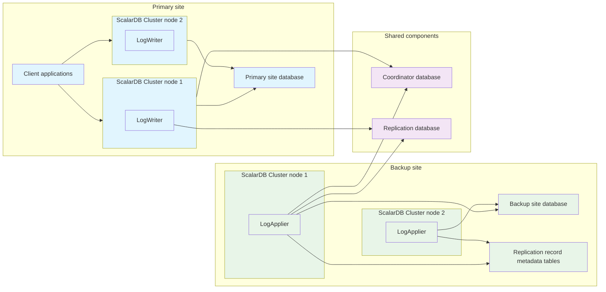

---
tags:
  - Enterprise Premium
  - Private Preview
displayed_sidebar: docsEnglish
---

# Replicate Data for High Availability

ScalarDB Cluster can replicate its managed data to remote sites for high availability and workload distribution. The remote replication feature provides near-real-time replication of write operations from a primary site to one or more backup sites.

This feature ensures business continuity by enabling failover to a backup site in the event of disasters or critical failures affecting the primary site. Additionally, the backup sites can function as read replicas, helping to offload analytical queries, reporting, and business intelligence workloads.

## What is remote replication in ScalarDB?

Remote replication in ScalarDB uses a hybrid approach, combining synchronous and asynchronous replication. This ensures zero data loss (a recovery point objective, or RPO, of zero) while minimizing performance impact at the primary site. The recovery time objective (RTO) can be flexibly adjusted by controlling the amount of computing resources. This feature is built on top of ScalarDB Cluster, making it cloud-agnostic and database-agnostic. This allows replication from one database in one cloud vendor to another, possibly different kind of database in a different cloud vendor.

## Key benefits

Remote replication provides several key advantages:

- Guarantees zero data loss (RPO of 0) for all committed transactions.
- Minimizes performance impact through the combination of synchronous and asynchronous processing.
- Enables backup site deployment in different regions, availability zones, or data centers from the primary site.
- Supports replication between different cloud service providers and database types.
- Provides built-in crash tolerance and automatic recovery mechanisms.

## Architecture overview

The following diagram illustrates the remote replication architecture:



Remote replication consists of the components and tools listed in this section.

### Primary site components

The primary site comprises three components: primary site database, client applications, and ScalarDB Cluster nodes. Each runs as follows:

- A primary site database contains the application tables used by client applications via ScalarDB Cluster.
- Client applications perform database operations.
- ScalarDB Cluster nodes manage transaction states in the Coordinator database and use a module called LogWriter to capture transaction operations and write them to the replication database.

### Shared components (between primary and backup sites)

Two components span the primary and backup sites: the Coordinator database and the replication database. These databases can be hosted in single database instances. However, because they maintain transaction information, it is required to replicate them across several sites as follows:

- A Coordinator database manages transaction states across the sites in a highly available way.
- A replication database stores transaction groups containing write operations from the primary site in a highly available way.

### Backup site components

The backup site comprises two components: backup site database and ScalarDB Cluster nodes. Each runs as follows:
- A backup site database contains the same application tables as the primary site. It also contains replication record metadata tables, which are internal tables that track replication metadata and unapplied operations. These tables are located in the same namespaces as the application tables (with the suffix `__records` by default).
- ScalarDB Cluster nodes use a module called LogApplier to apply replicated data. Specifically, LogApplier checks the Coordinator database for transaction states, reads and removes write operations from the replication database, calculates dependencies by using the replication record metadata tables, and applies operations to the backup site tables.

### Administrative tools

Remote replication uses the following administrative tools: Schema Loader and Replication CLI. Each runs as follows:
- Schema Loader creates the replication tables in the replication database by using the `--replication-tables` option via ScalarDB Cluster endpoints.
- Replication CLI monitors and administers ScalarDB Cluster nodes that replicate data through remote replication.

## How remote replication works

Remote replication employs a hybrid approach that combines synchronous and asynchronous replication to ensure zero data loss (RPO = 0) with minimal impact on performance at the primary site. It comprises two phases, the synchronous phase and the asynchronous phase, as follows:

- In the synchronous phase, write operations are copied from the primary site to the replication database during transaction commit.
- In the asynchronous phase, these operations are processed from the replication database and applied to the backup site tables.

The replication process follows these steps:

1. When a transaction commits on the primary site, the LogWriter captures all write operations and stores them in the replication database.
2. The LogApplier on the backup site continuously scans the replication database for new transaction data.
3. The LogApplier checks the Coordinator database to verify transaction completion.
4. The LogApplier orders and applies write operations based on transaction dependencies at the record level by using the replication record metadata tables.
5. The LogApplier applies the processed operations to the backup site tables, with the replication record metadata tables updated to track progress.

## Limitations and characteristics

This section describes the limitations and characteristics of remote replication.

### Private preview limitations

The current private preview version has the following limitations, but they are going to be relaxed when it becomes public preview or general availability (GA):

- The specification may be changed in future releases.
- Multiple backup sites are not supported.
- Starting remote replication with restored data is not supported. Both primary and backup sites need to start from the beginning.
- This feature does not work with the one-phase commit optimization. This optimization must be disabled for replication to function properly.
- Creating the replication tables via ScalarDB SQL is not supported.
- The combination of the [encryption feature](./encrypt-data-at-rest.mdx) and remote replication is not officially supported because it has not been verified.

### Architectural limitations

Remote replication has the following architectural limitations, which are inherently challenging to relax due to the architecture:

- Only [transactions in read-only mode](../api-guide.mdx#begin-or-start-a-transaction-in-read-only-mode) with the [read-committed isolation level](../consensus-commit.mdx#isolation-levels) are permitted on backup sites until failover.
- DDL operations are not replicated. Schema changes must be applied manually to both primary and backup sites.
- You cannot use the two-phase commit interface if this feature is enabled.
- There may be a slight performance impact on the primary site, depending on replication database specifications and configurations.

## Failure handling

Remote replication is designed to handle various failure scenarios gracefully, ensuring data consistency and system availability where possible.

### Primary site failure

When the primary site becomes unavailable, all committed transactions are safely stored in the replication database or the backup site databases, ensuring zero data loss. The backup site can be promoted to serve application traffic once the LogApplier has processed all pending write operations from the replication database.

### Backup site failure

If the backup site fails, the primary site continues operating normally without any disruption to application traffic. However, write operations will accumulate in the replication database since LogApplier cannot process them. During extended backup site downtime, there is a risk that the replication database may reach capacity limits, so monitoring is important. Once the backup site is restored and LogApplier resumes, replication will catch up with the accumulated operations.

### Coordinator database failure

The impact of Coordinator database failure depends on its scope. In non-critical failures (such as a single region failure in a multi-region setup), remote replication continues operating normally. However, if the Coordinator database becomes completely unavailable, both ScalarDB Cluster in the primary site and LogApplier are affected: ScalarDB Cluster in the primary site cannot commit new transactions, and LogApplier cannot verify transaction states to proceed with replication.

### Replication database failure

Similar to Coordinator database failures, the impact depends on the scope of the failure. Non-critical failures (like single region failures in multi-region deployments) don't affect the remote replication operation. However, complete replication database unavailability prevents ScalarDB Cluster in the primary site from committing new transactions and blocks LogApplier from reading write operations, effectively halting both primary operations and replication processing.

## Configuration

This section describes the configuration options for remote replication in ScalarDB Cluster.

### Base replication configurations

These configurations apply to the overall replication setup:

#### `partition_count`

- **Field:** `scalar.db.replication.partition_count`
- **Description:** Number of partitions for the `transaction_groups` table. The tables in the replication database are partitioned for performance and scalability, and write operations are distributed evenly across partitions. This field must be identical between primary and backup sites. Changing the partition count requires restarting the ScalarDB Clusters in both sites.
- **Default value:** `256`

#### `repl_db.namespace`

- **Field:** `scalar.db.replication.repl_db.namespace`
- **Description:** Namespace name of replication tables. This field must be identical between primary and backup sites.
- **Default value:** `replication`

#### `record_table_suffix`

- **Field:** `scalar.db.replication.record_table_suffix`
- **Description:** Suffix for replication record metadata tables.
- **Default value:** `__records`

### LogWriter configurations (primary site)

LogWriter configurations control how write operations are captured and stored in the replication database during transaction commits.

#### `log_writer.enabled`

- **Field:** `scalar.db.replication.log_writer.enabled`
- **Description:** Enable or disable LogWriter functionality.
- **Default value:** `false`

#### `log_writer.compression_type`

- **Field:** `scalar.db.replication.log_writer.compression_type`
- **Description:** Compression type for stored write operations in the replication database. Available values: `NONE`, `GZIP`.
- **Default value:** `GZIP`

#### `log_writer.group_commit.retention.time_millis`

- **Field:** `scalar.db.replication.log_writer.group_commit.retention.time_millis`
- **Description:** Maximum time to wait before committing a transaction group for the replication database.
- **Default value:** `100`

#### `log_writer.group_commit.retention.values`

- **Field:** `scalar.db.replication.log_writer.group_commit.retention.values`
- **Description:** Maximum number of transactions to batch together for the replication database.
- **Default value:** `32`

#### `log_writer.group_commit.timeout_check_interval_millis`

- **Field:** `scalar.db.replication.log_writer.group_commit.timeout_check_interval_millis`
- **Description:** Interval for checking group commit timeouts for the replication database.
- **Default value:** `20`

#### `log_writer.group_commit.max_thread_pool_size`

- **Field:** `scalar.db.replication.log_writer.group_commit.max_thread_pool_size`
- **Description:** Maximum thread pool size for group commit processing for the replication database.
- **Default value:** `4096`

### LogApplier configurations (backup site)

LogApplier configurations control how replication data is processed and applied to the backup site tables.

#### `log_applier.enabled`

- **Field:** `scalar.db.replication.log_applier.enabled`
- **Description:** Enable or disable LogApplier functionality.
- **Default value:** `false`

#### `log_applier.transaction.expiration_millis`

- **Field:** `scalar.db.replication.log_applier.transaction.expiration_millis`
- **Description:** Transaction expiration time for cleanup.
- **Default value:** `30000`

#### `log_applier.transaction_group_scanner.threads`

- **Field:** `scalar.db.replication.log_applier.transaction_group_scanner.threads`
- **Description:** Number of scanner threads for transaction groups in the replication database.
- **Default value:** `16`

#### `log_applier.transaction_group_scanner.fetch_size`

- **Field:** `scalar.db.replication.log_applier.transaction_group_scanner.fetch_size`
- **Description:** Number of transaction group records to fetch in each scan operation from the replication database.
- **Default value:** `32`

#### `log_applier.transaction_group_scanner.wait_millis`

- **Field:** `scalar.db.replication.log_applier.transaction_group_scanner.wait_millis`
- **Description:** Wait time in milliseconds between scans of transaction groups in the replication database. Increasing this value reduces scan frequency but may increase replication latency.
- **Default value:** `1000`

#### `log_applier.transaction_group_scanner.dedup.expiration_millis`

- **Field:** `scalar.db.replication.log_applier.transaction_group_scanner.dedup.expiration_millis`
- **Description:** Expiration time for transaction group deduplication cache. LogApplier uses this cache to avoid reprocessing the same transaction groups from the replication database.
- **Default value:** `10000`

#### `log_applier.transaction_handler.threads`

- **Field:** `scalar.db.replication.log_applier.transaction_handler.threads`
- **Description:** Number of threads for LogApplier transaction handling. Increasing this value may improve replication performance but increases resource consumption.
- **Default value:** `128`

#### `log_applier.max_record_version`

- **Field:** `scalar.db.replication.log_applier.max_record_version`
- **Description:** Maximum record version to prevent integer overflow (for development use).
- **Default value:** `Integer.MAX_VALUE - 1000`

#### `log_applier.write_operation.expiration_millis`

- **Field:** `scalar.db.replication.log_applier.write_operation.expiration_millis`
- **Description:** Write operation expiration time for garbage collection.
- **Default value:** `86400000` (1 day)

#### `log_applier.replication_status_service.threads`

- **Field:** `scalar.db.replication.log_applier.replication_status_service.threads`
- **Description:** Number of threads for replication status service.
- **Default value:** `16`

#### `log_applier.coordinator_state_cache.expiration_millis`

- **Field:** `scalar.db.replication.log_applier.coordinator_state_cache.expiration_millis`
- **Description:** Expiration time for coordinator state cache.
- **Default value:** `30000`

#### `log_applier.coordinator_state_cache.size`

- **Field:** `scalar.db.replication.log_applier.coordinator_state_cache.size`
- **Description:** Maximum size of the coordinator state cache.
- **Default value:** `1000`

## Important configuration notes

This section describes capacity planning and failure resilience, database selection, and performance tuning.

### Partition count planning for capacity planning and failure resilience

When planning the partition count ([`scalar.db.replication.partition_count`](#partition_count)), consider that partitions may have capacity limits depending on the underlying database. For example, [Cosmos DB partitions can contain a maximum of 20 GB of data](https://learn.microsoft.com/en-us/azure/cosmos-db/concepts-limits). If the backup site is down for extended periods, many write operations accumulate in the replication database, potentially reaching partition limits. Plan the partition count based on estimated write operations from the primary site and potential backup site downtime duration. Increasing partition count may mitigate capacity risks, but could require more LogApplier resources.

### Database selection

If Coordinator and replication databases (shared components) are unavailable, the primary site cannot commit transactions, and LogApplier cannot process replication data. Therefore, select databases ([`scalar.db.multi_storage.storages.coordinator.*`](../configurations.mdx#multi-storage-support) and [`scalar.db.multi_storage.storages.replication.*`](../configurations.mdx#multi-storage-support)) that are highly available to meet your disaster tolerance requirements and that must be replicated synchronously (for example, Cosmos DB with Strong consistency) across multiple AZs or regions, depending on where you replicate your data.

### Performance tuning

When using remote replication, you may need to tune performance based on your workload characteristics and infrastructure setup. This section describes key configuration parameters for optimizing replication performance.

#### LogWriter performance tuning

For the primary site, tune group commit settings ([`scalar.db.replication.log_writer.group_commit.retention.time_millis`](#log_writergroup_commitretentiontime_millis) and [`scalar.db.replication.log_writer.group_commit.retention.values`](#log_writergroup_commitretentionvalues)) to balance latency and throughput based on your workload characteristics.

#### LogApplier performance tuning

For the backup site, tune thread counts ([`scalar.db.replication.log_applier.transaction_group_scanner.threads`](#log_appliertransaction_group_scannerthreads) and [`scalar.db.replication.log_applier.transaction_handler.threads`](#log_appliertransaction_handlerthreads)) to balance parallel processing performance and resource consumption.

#### High-latency database environments

Multi-region databases may have higher latency. Consider using [group commit configurations](../api-guide.mdx#group-commit-for-the-coordinator-table) to improve throughput on high-latency Coordinator databases. The Coordinator group commit feature batches multiple transactions together, reducing the impact of network latency on overall throughput. For replication database tuning, see the [LogWriter performance tuning](#logwriter-performance-tuning) section above.

## Tutorial

This section walks you through setting up remote replication for ScalarDB Cluster.

:::tip

If you're new to ScalarDB Cluster, you may want to familiarize yourself with these topics first:

- [Getting Started with ScalarDB Cluster](getting-started-with-scalardb-cluster.mdx)
- [How to Deploy ScalarDB Cluster Locally](setup-scalardb-cluster-on-kubernetes-by-using-helm-chart.mdx)
- [ScalarDB Cluster Configurations](scalardb-cluster-configurations.mdx)
- [Run Transactions Through ScalarDB Cluster](run-transactions-through-scalardb-cluster.mdx)

:::

### Prerequisites

Before setting up remote replication, ensure you have set up the following in your environment:

- Kubernetes environment (for example, Minikube)
- `helm` command for Kubernetes package management
- `kubectl` command for Kubernetes cluster management

### Deployment topology

This guide demonstrates a two-site setup, which can be deployed within a single Kubernetes cluster:

- The primary site is where your application is running.
- The backup site is where replicated data is stored for disaster recovery.

:::note Kubernetes contexts

If your primary and backup sites are deployed in different Kubernetes clusters, you'll need to switch kubectl contexts between sites. Use `kubectl config get-contexts` to list available contexts and `kubectl config use-context <CONTEXT_NAME>` to switch between them.

:::

### Step 1: Set up the required databases

Create the primary site, backup site, Coordinator, and Replication databases that are needed for the remote replication deployment.

#### Primary and backup site databases

Set up your primary and backup site databases by using any [ScalarDB-supported database](../requirements.mdx#databases).

#### Coordinator and Replication databases (shared components)

Set up these databases by using any ScalarDB-supported database based on your disaster tolerance requirements. Use a highly available database if needed.

##### Example database setups

For this tutorial, you can use any ScalarDB-supported database such as PostgreSQL or MySQL. For production deployments, consider highly available databases (for example, Cosmos DB with multi-region configuration).

### Step 2: Configure the primary site

In this step, you'll update the ScalarDB Cluster configuration, deploy a primary site cluster, and create primary site tables.

#### 2.1 Update primary site ScalarDB Cluster configuration

Add the remote replication configurations to your primary site ScalarDB Cluster that uses a multi-storage setup. The following is an example configuration:

```properties
# Multi-storage configuration
scalar.db.storage=multi-storage
scalar.db.multi_storage.storages=default,coord,repl
scalar.db.multi_storage.default_storage=default
scalar.db.multi_storage.namespace_mapping=coordinator:coord,replication:repl

# Primary site database
scalar.db.multi_storage.storages.default.storage=jdbc
scalar.db.multi_storage.storages.default.contact_points=jdbc:postgresql://primary-db:5432/
scalar.db.multi_storage.storages.default.username=postgres
scalar.db.multi_storage.storages.default.password=postgres

# Coordinator database (shared component)
scalar.db.multi_storage.storages.coord.storage=jdbc
scalar.db.multi_storage.storages.coord.contact_points=jdbc:postgresql://coordinator-db:5432/
scalar.db.multi_storage.storages.coord.username=postgres
scalar.db.multi_storage.storages.coord.password=postgres

# Replication database (shared component)
scalar.db.multi_storage.storages.repl.storage=jdbc
scalar.db.multi_storage.storages.repl.contact_points=jdbc:postgresql://replication-db:5432/
scalar.db.multi_storage.storages.repl.username=postgres
scalar.db.multi_storage.storages.repl.password=postgres

# Enable LogWriter
scalar.db.replication.log_writer.enabled=true

# Enable SQL interface (if you want to test with SQL CLI)
scalar.db.sql.enabled=true
```

#### 2.2 Deploy a primary site cluster

Deploy a primary site ScalarDB Cluster with the remote replication configuration:

```bash
helm install <HELM_RELEASE_NAME> scalar-labs/scalardb-cluster \
  -f <VALUES_FILE> \
  -n <NAMESPACE>
```

Replace:

- `<HELM_RELEASE_NAME>`: A name for your primary site Helm release.
- `<VALUES_FILE>`: Your Helm values file with the primary site configuration.
- `<NAMESPACE>`: Your Kubernetes namespace.

Verify the primary site deployment:

```bash
# Check primary site logs
kubectl logs <PRIMARY_POD_NAME> -n <NAMESPACE>
```

Replace `<PRIMARY_POD_NAME>` with your actual Pod name. If there are no errors, you should see a message indicating that LogWriter is properly initialized:

```console
2025-07-03 08:56:10,162 [INFO  com.scalar.db.cluster.replication.logwriter.LogWriterSnapshotHook] LogWriter is initialized
```


#### 2.3 Create primary site tables

Create a Kubernetes Job to run Schema Loader for the primary site:

```yaml
# schema-loader-primary.yaml
apiVersion: v1
kind: ConfigMap
metadata:
  name: schema-config-primary
data:
  application-schema.json: |
    {
      "test_namespace.test_table": {
        "transaction": true,
        "partition-key": [
          "id"
        ],
        "columns": {
          "id": "INT",
          "name": "TEXT",
          "value": "INT"
        }
      }
    }
---
apiVersion: v1
kind: ConfigMap
metadata:
  name: schema-loader-config-primary
data:
  primary-schema-loader.properties: |
    scalar.db.transaction_manager=cluster
    scalar.db.contact_points=<PRIMARY_CLUSTER_CONTACT_POINTS>
---
apiVersion: batch/v1
kind: Job
metadata:
  name: schema-loader-primary
spec:
  template:
    spec:
      restartPolicy: Never
      containers:
      - name: schema-loader
        image: ghcr.io/scalar-labs/scalardb-cluster-schema-loader:<VERSION>
        args:
          - "--config"
          - "/config/primary-schema-loader.properties"
          - "--schema-file"
          - "/schema/application-schema.json"
          - "--coordinator"
        volumeMounts:
        - name: config
          mountPath: /config
        - name: schema
          mountPath: /schema
      volumes:
      - name: config
        configMap:
          name: schema-loader-config-primary
      - name: schema
        configMap:
          name: schema-config-primary
```

Replace `<PRIMARY_CLUSTER_CONTACT_POINTS>` with your primary site cluster contact points (same format as [ScalarDB Cluster client configurations](scalardb-cluster-configurations.mdx#client-configurations)) and `<VERSION>` with the ScalarDB Cluster version that you're using.

Apply and run the Schema Loader job:

```bash
# Apply the job
kubectl apply -f schema-loader-primary.yaml -n <NAMESPACE>

# Check job status
kubectl get jobs -n <NAMESPACE>

# Check logs if needed
kubectl logs job/schema-loader-primary -n <NAMESPACE>

# Clean up after successful completion
kubectl delete -f schema-loader-primary.yaml -n <NAMESPACE>
```

### Step 3: Configure the backup site

In this step, you'll update the ScalarDB Cluster configuration for table schema migration, deploy a backup site cluster, and create backup site tables.

#### 3.1 Update backup site ScalarDB Cluster configuration for table schema migration

Add the remote replication configurations to your backup site ScalarDB Cluster that uses a multi-storage setup. For the initial deployment, enable only the replication admin feature but disable LogApplier to prevent it from trying to scan non-existent replication tables before Schema Loader creates them. The following is an example configuration:

```properties
# Multi-storage configuration
scalar.db.storage=multi-storage
scalar.db.multi_storage.storages=default,coord,repl
scalar.db.multi_storage.default_storage=default
scalar.db.multi_storage.namespace_mapping=coordinator:coord,replication:repl

# Backup site database
scalar.db.multi_storage.storages.default.storage=jdbc
scalar.db.multi_storage.storages.default.contact_points=jdbc:postgresql://backup-db:5432/
scalar.db.multi_storage.storages.default.username=postgres
scalar.db.multi_storage.storages.default.password=postgres

# Coordinator database (shared component - same configuration as primary site)
scalar.db.multi_storage.storages.coord.storage=jdbc
scalar.db.multi_storage.storages.coord.contact_points=jdbc:postgresql://coordinator-db:5432/
scalar.db.multi_storage.storages.coord.username=postgres
scalar.db.multi_storage.storages.coord.password=postgres

# Replication database (shared component - same configuration as primary site)
scalar.db.multi_storage.storages.repl.storage=jdbc
scalar.db.multi_storage.storages.repl.contact_points=jdbc:postgresql://replication-db:5432/
scalar.db.multi_storage.storages.repl.username=postgres
scalar.db.multi_storage.storages.repl.password=postgres

# Enable replication admin (required for Schema Loader to create replication tables)
scalar.db.replication.admin.enabled=true

# Enable SQL interface (if you want to test with SQL CLI)
scalar.db.sql.enabled=true
```

#### 3.2 Deploy a backup site cluster

Deploy a backup site ScalarDB Cluster with the remote replication configuration:

```bash
helm install <HELM_RELEASE_NAME> scalar-labs/scalardb-cluster \
  -f <VALUES_FILE> \
  -n <NAMESPACE>
```

Replace:

- `<HELM_RELEASE_NAME>`: A name for your backup site Helm release.
- `<VALUES_FILE>`: Your Helm values file with the backup site configuration.
- `<NAMESPACE>`: Your Kubernetes namespace.

#### 3.3 Create backup site tables

Create a Kubernetes Job to run Schema Loader for the backup site:

```yaml
# schema-loader-backup.yaml
apiVersion: v1
kind: ConfigMap
metadata:
  name: schema-config-backup
data:
  application-schema.json: |
    {
      "test_namespace.test_table": {
        "transaction": true,
        "partition-key": [
          "id"
        ],
        "columns": {
          "id": "INT",
          "name": "TEXT",
          "value": "INT"
        }
      }
    }
---
apiVersion: v1
kind: ConfigMap
metadata:
  name: schema-loader-config-backup
data:
  backup-schema-loader.properties: |
    scalar.db.transaction_manager=cluster
    scalar.db.contact_points=<BACKUP_CLUSTER_CONTACT_POINTS>
---
apiVersion: batch/v1
kind: Job
metadata:
  name: schema-loader-backup
spec:
  template:
    spec:
      restartPolicy: Never
      containers:
      - name: schema-loader
        image: ghcr.io/scalar-labs/scalardb-cluster-schema-loader:<VERSION>
        args:
          - "--config"
          - "/config/backup-schema-loader.properties"
          - "--schema-file"
          - "/schema/application-schema.json"
          - "--replication-tables"
        volumeMounts:
        - name: config
          mountPath: /config
        - name: schema
          mountPath: /schema
      volumes:
      - name: config
        configMap:
          name: schema-loader-config-backup
      - name: schema
        configMap:
          name: schema-config-backup
```

Replace `<BACKUP_CLUSTER_CONTACT_POINTS>` with your backup site cluster contact points (same format as [ScalarDB Cluster client configurations](scalardb-cluster-configurations.mdx#client-configurations)) and `<VERSION>` with the ScalarDB Cluster version that you're using.

Apply and run the Schema Loader job:

```bash
# Apply the job
kubectl apply -f schema-loader-backup.yaml -n <NAMESPACE>

# Check job status
kubectl get jobs -n <NAMESPACE>

# Check logs if needed
kubectl logs job/schema-loader-backup -n <NAMESPACE>

# Clean up after successful completion
kubectl delete -f schema-loader-backup.yaml -n <NAMESPACE>
```

The `--replication-tables` option creates all necessary tables in one operation, including the application tables and the replication tables. The replication record metadata tables corresponding to the application tables are automatically created when `scalar.db.replication.admin.enabled` or `scalar.db.replication.log_applier.enabled` is set to `true`.

#### 3.4 Update backup site ScalarDB Cluster configuration for LogApplier deployment

After the Schema Loader job completes successfully, update the backup site ScalarDB Cluster configuration to enable LogApplier and disable replication admin. This is the second deployment phase that activates the actual replication processing:

```properties
# Multi-storage configuration
scalar.db.storage=multi-storage
scalar.db.multi_storage.storages=default,coord,repl
scalar.db.multi_storage.default_storage=default
scalar.db.multi_storage.namespace_mapping=coordinator:coord,replication:repl

# Backup site database
scalar.db.multi_storage.storages.default.storage=jdbc
scalar.db.multi_storage.storages.default.contact_points=jdbc:postgresql://backup-db:5432/
scalar.db.multi_storage.storages.default.username=postgres
scalar.db.multi_storage.storages.default.password=postgres

# Coordinator database (shared component - same configuration as primary site)
scalar.db.multi_storage.storages.coord.storage=jdbc
scalar.db.multi_storage.storages.coord.contact_points=jdbc:postgresql://coordinator-db:5432/
scalar.db.multi_storage.storages.coord.username=postgres
scalar.db.multi_storage.storages.coord.password=postgres

# Replication database (shared component - same configuration as primary site)
scalar.db.multi_storage.storages.repl.storage=jdbc
scalar.db.multi_storage.storages.repl.contact_points=jdbc:postgresql://replication-db:5432/
scalar.db.multi_storage.storages.repl.username=postgres
scalar.db.multi_storage.storages.repl.password=postgres

# Enable LogApplier (now that replication tables exist)
scalar.db.replication.log_applier.enabled=true

# Enable SQL interface (if you want to test with SQL CLI)
scalar.db.sql.enabled=true
```

Upgrade the backup site cluster with the updated configuration:

```bash
helm upgrade <HELM_RELEASE_NAME> scalar-labs/scalardb-cluster \
  -f <UPDATED_VALUES_FILE> \
  -n <NAMESPACE>
```

Replace:

- `<HELM_RELEASE_NAME>`: Your backup site Helm release name.
- `<UPDATED_VALUES_FILE>`: Your updated Helm values file with LogApplier enabled.
- `<NAMESPACE>`: Your Kubernetes namespace.

Verify the backup site deployment with LogApplier:

```bash
# Check backup site logs
kubectl logs <BACKUP_POD_NAME> -n <NAMESPACE>
```

Replace `<BACKUP_POD_NAME>` with your actual Pod name. Ensure there are no errors. You should see a message indicating that LogApplier is properly initialized:

```console
2025-07-03 03:28:27,725 [INFO  com.scalar.db.cluster.replication.logapplier.LogApplier] Starting LogApplier processing. Partition range: Range{startInclusive=0, endExclusive=256}
```

### Step 4: Test replication

#### 4.1 Set up the SQL CLI for the primary site and test replication

To test replication between sites, you should use the ScalarDB SQL CLI. Create a Kubernetes Pod to run the SQL CLI for the primary site:

```yaml
# sql-cli-primary.yaml
apiVersion: v1
kind: ConfigMap
metadata:
  name: sql-cli-config-primary
data:
  primary-sql-cli.properties: |
    scalar.db.sql.connection_mode=cluster
    scalar.db.sql.cluster_mode.contact_points=<PRIMARY_CLUSTER_CONTACT_POINTS>
---
apiVersion: v1
kind: Pod
metadata:
  name: sql-cli-primary
spec:
  restartPolicy: Never
  containers:
  - name: sql-cli
    image: ghcr.io/scalar-labs/scalardb-cluster-sql-cli:<VERSION>
    args:
      - "--config"
      - "/config/primary-sql-cli.properties"
    stdin: true
    tty: true
    volumeMounts:
    - name: config
      mountPath: /config
  volumes:
  - name: config
    configMap:
      name: sql-cli-config-primary
```

Replace `<PRIMARY_CLUSTER_CONTACT_POINTS>` with your primary site cluster contact points and `<VERSION>` with the ScalarDB Cluster version that you're using.

Create and connect to the SQL CLI Pod by running the following commands:

```bash
# Create the SQL CLI Pod
kubectl apply -f sql-cli-primary.yaml -n <NAMESPACE>

# Attach to the running SQL CLI
kubectl attach -it sql-cli-primary -n <NAMESPACE>
```

##### Test data replication

Insert test data into the primary site by running the following commands: 

```sql
INSERT INTO test_namespace.test_table (id, name, value) VALUES (1, 'test_record', 100);
SELECT * FROM test_namespace.test_table WHERE id = 1;
```

Detach from the session by pressing `Ctrl + P`, then `Ctrl + Q`. Then, create a similar Pod for the backup site:

```yaml
# sql-cli-backup.yaml
apiVersion: v1
kind: ConfigMap
metadata:
  name: sql-cli-config-backup
data:
  backup-sql-cli.properties: |
    scalar.db.sql.connection_mode=cluster
    scalar.db.sql.cluster_mode.contact_points=<BACKUP_CLUSTER_CONTACT_POINTS>
---
apiVersion: v1
kind: Pod
metadata:
  name: sql-cli-backup
spec:
  restartPolicy: Never
  containers:
  - name: sql-cli
    image: ghcr.io/scalar-labs/scalardb-cluster-sql-cli:<VERSION>
    args:
      - "--config"
      - "/config/backup-sql-cli.properties"
    stdin: true
    tty: true
    volumeMounts:
    - name: config
      mountPath: /config
  volumes:
  - name: config
    configMap:
      name: sql-cli-config-backup
```

Replace `<BACKUP_CLUSTER_CONTACT_POINTS>` with your backup site cluster contact points and `<VERSION>` with the ScalarDB Cluster version that you're using.

Create and connect to the SQL CLI Pod by running the following commands:

```bash
# Create the SQL CLI Pod
kubectl apply -f sql-cli-backup.yaml -n <NAMESPACE>

# Attach to the running SQL CLI
kubectl attach -it sql-cli-backup -n <NAMESPACE>
```

Check the record is replicated by running the following command:

```sql
SELECT * FROM test_namespace.test_table WHERE id = 1;
```

You should see the same data on both sites, confirming that replication is working correctly. You can insert additional records in the primary site and verify they appear in the backup site as well. To detach from the session, press `Ctrl + P`, then `Ctrl + Q`.

Clean up the SQL CLI Pods when done:

```bash
kubectl delete -f sql-cli-primary.yaml -n <NAMESPACE>
kubectl delete -f sql-cli-backup.yaml -n <NAMESPACE>
```

### Step 5: Monitor the replication state

In this step, you'll monitor the replication status by using Replication CLI and Prometheus metrics.

#### Replication CLI

Replication CLI can get the status of LogApplier. This includes the number of partitions that contain remaining unapplied write operations in the replication database. This information is important because, if there are zero partitions, it means that all write operations have been successfully replicated and applied to the backup site database. In this case, you can use the synchronized backup site database as a new primary site database.

Create a Kubernetes Pod to run Replication CLI for the backup site:

```yaml
# repl-cli-backup.yaml
apiVersion: v1
kind: Pod
metadata:
  name: repl-cli-backup
spec:
  restartPolicy: Never
  containers:
  - name: repl-cli-backup
    image: ghcr.io/scalar-labs/scalardb-cluster-replication-cli:<VERSION>
    args:
      - "--contact-points"
      - "<BACKUP_CLUSTER_CONTACT_POINTS>"
      - "status"
```

Replace `<BACKUP_CLUSTER_CONTACT_POINTS>` with your backup site cluster contact points (in the same format as [ScalarDB Cluster client configurations](scalardb-cluster-configurations.mdx#client-configurations)) and `<VERSION>` with the ScalarDB Cluster version that you're using.

Ensure no new writes are being made to the primary site database to get an accurate synchronization point. Then, apply and run Replication CLI, and check the output:

```bash
# Apply the Pod
kubectl apply -f repl-cli-backup.yaml -n <NAMESPACE>

# Check the status
kubectl get pod repl-cli-backup -n <NAMESPACE>

# Check the output from the Pod
kubectl logs repl-cli-backup -n <NAMESPACE>
```

If there are no errors, you should see a JSON output that includes the number of partitions containing the remaining unapplied write operations in the replication database:

```json
{"remainingTransactionGroupPartitions":0}
```

If `remainingTransactionGroupPartitions` is more than 0, it indicates unapplied write operations still remain and you need to wait until it becomes 0 before using the backup site database as a new primary database.

Clean up the Replication CLI Pod when done:

```bash
kubectl delete -f repl-cli-backup.yaml -n <NAMESPACE>
```

#### Prometheus metrics

You can monitor LogApplier by using metrics. ScalarDB Cluster exposes many Prometheus format metrics, including LogApplier metrics, which can be monitored by using any tool that supports the format. For example, one option is using [Prometheus Operator (kube-prometheus-stack)](helm-charts/getting-started-monitoring.mdx).

While LogApplier provides many metrics, the following metric is the most important for monitoring overall replication health:

- **scalardb_cluster_stats_transaction_group_repo_oldest_record_age_millis:** The age (milliseconds) of the oldest transaction data in the replication database scanned by LogApplier. If this metric increases continuously, it indicates one of the following issues, which requires immediate investigation:
  - LogApplier is failing to process stored write operations (for example, the backup site database is down).
  - LogApplier cannot keep up with the primary site's throughput.

## Additional details

Remote replication is currently in Private Preview. This feature and documentation are subject to change. For more details, please [contact us](https://www.scalar-labs.com/contact) or wait for this feature to become public preview or GA.
