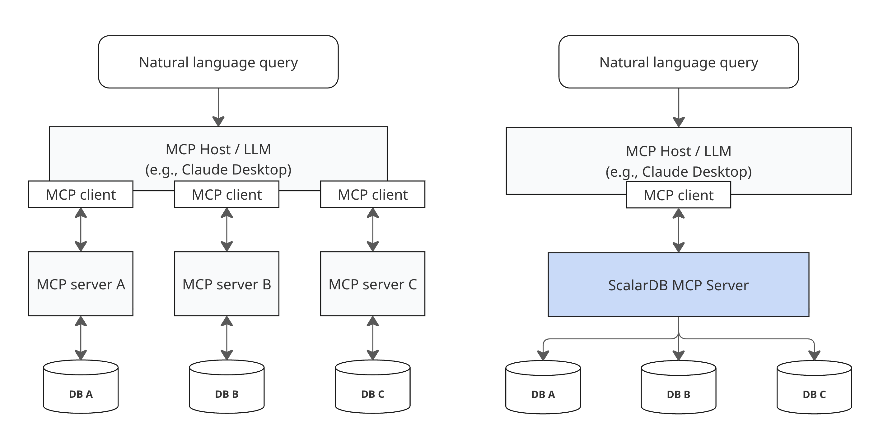

---
tags:
  - Community
  - Enterprise Standard
  - Enterprise Premium
displayed_sidebar: docsEnglish
---

# Getting Started with ScalarDB MCP Server

import Tabs from '@theme/Tabs';
import TabItem from '@theme/TabItem';

ScalarDB MCP Server is a [Model Context Protocol (MCP)](https://modelcontextprotocol.io/) implementation that enables LLMs to access and manage your data through ScalarDB. By leveraging LLMs, you can use natural language to search and update across multiple, potentially siloed, databases.

ScalarDB MCP Server works with both single and multiple storage configurations. Unlike traditional approaches that require separate MCP servers for each database, ScalarDB MCP Server takes advantage of the [multi-storage capabilities of ScalarDB](../multi-storage-transactions.mdx) to provide unified access to heterogeneous databases (PostgreSQL, MySQL, Cosmos DB, DynamoDB, etc.) through a single MCP server. By simply submitting queries in natural language, the server automatically executes the appropriate operations across your databases, improving and accelerating decision-making processes.

## Architecture and key features

The following diagram shows how ScalarDB MCP Server differs from traditional approaches. Instead of requiring separate MCP servers for each database, you connect once to ScalarDB MCP Server to access all your databases through ScalarDB.



At its core, ScalarDB MCP Server provides the following capabilities.

### ScalarDB connectivity

The MCP server internally uses the ScalarDB Core library or connects to your ScalarDB Cluster through the client library, depending on settings. This means users don't need to know how to use the libraries to interact with ScalarDB.

### Transactional operations

ScalarDB MCP Server supports ACID-compliant transactions, allowing an LLM to execute multiple operations safely. When the LLM determines that operations should be grouped together, the MCP server ensures the operations either all succeed or all fail together, maintaining data integrity across your databases.

### Operational mode

ScalarDB MCP Server supports two operational modes that match your ScalarDB component: SQL mode and CRUD mode.

#### SQL mode

SQL mode with ScalarDB Cluster provides a SQL interface for database operations. When you make natural language requests, the LLM automatically generates and executes SQL commands through the supported SQL operations in ScalarDB and handles transactions by using standard SQL syntax (`BEGIN`, `COMMIT`, `ROLLBACK`). This mode could be more efficient because the LLM only needs to use one tool to perform all operations. SQL mode is available only with ScalarDB Cluster.

#### CRUD mode

CRUD mode is used when you want programmatic control over your operations. Since ScalarDB Core doesn't include the SQL interface, this mode uses the native SDK operations in ScalarDB instead. The LLM converts your natural language requests into appropriate SDK calls by using individual tools for schema management, CRUD operations, and explicit transaction control. This mode could be less efficient because the LLM has to work with multiple tools to complete operations.

### Deployment limitations

:::note

The ScalarDB MCP Server currently runs in STDIO mode for local deployment only. Remote server deployment via Server-Sent Events (SSE) is not yet supported but is planned for future releases.

**What this means:**

- ✅ The MCP server runs locally alongside your AI client (Claude Desktop, Visual Studio Code, etc.).
- ✅ Perfect for development, testing, and single-user scenarios.
- ❌ Cannot deploy the MCP server on remote servers for multi-user access.
- ❌ No web-based or cloud deployment options yet.

:::

## Example workflow

Here's how you interact with ScalarDB MCP Server through natural language:

**Querying data (SQL mode):**

```markdown
You: "Show me all users from the customer table"
🤖 LLM automatically uses: scalardb_execute_sql tool
SQL generated: SELECT * FROM customer
Result: Customer data displayed with columns and values
```

**Querying data (CRUD mode):**

```markdown
You: "Show me all users from the customer table"
🤖 LLM automatically uses: scalardb_scan tool
Result: Customer data displayed with columns and values
```

**Creating database structures (CRUD mode):**

```markdown
You: "Create a new table called products with columns id, name, and price"
🤖 LLM automatically uses: scalardb_create_table tool
Result: ✅ Table 'products' created successfully
```

**Cross-database operations (multi-storage):**

```markdown
You: "Get user profile and order history for user ID 123"
🤖 LLM automatically uses: scalardb_get tool (queries across multiple databases)
Result: Combined user profile (from PostgreSQL) and order history (from DynamoDB)
```

The LLM automatically selects the appropriate tools based on your request—you don't need to know which specific tools exist or how to use them.

## Tutorial

The following configuration samples use the same Cassandra and MySQL multi-storage configuration as the [Multi-Storage Transaction Sample](../scalardb-samples/multi-storage-transaction-sample/README.mdx). You can follow that hands-on tutorial to set up your databases, then use the same setup to test the MCP server with this tutorial.

Configurations may vary depending on your specific MCP client and database environment. Refer to your MCP client's documentation for detailed setup instructions on how to add a connection to an MCP server.

### Setup

Follow these steps to set up ScalarDB MCP Server.

#### Prerequisites

Ensure you have the following:

- (For JAR distribution) Java Runtime Environment:
  - Oracle JDK: 17 or 21
  - OpenJDK (Eclipse Temurin, Amazon Corretto, or Microsoft Build of OpenJDK): 17 or 21
- (For Docker distribution) Docker 20.10 or later
- (For this tutorial's examples) Cassandra and MySQL databases must be running
- (For SQL mode) ScalarDB Cluster must also be running
- MCP-compatible client (Claude Desktop, Visual Studio Code with Cline, etc.)

#### Step 1: Choose your MCP client type

Select the configuration method that matches your MCP client. If you're using the Claude Code CLI or similar tools that support command-line MCP server management, choose **CLI tools**. If you're using Claude Desktop or other clients that require manual JSON configuration files, choose **Manual configuration files**.

<Tabs groupId="client-type" queryString>
  <TabItem value="cli-tools" label="CLI tools (Claude Code, etc.)" default>
    For MCP clients with command-line server management (for example, the Claude Code CLI).

    #### Step 2: Choose your distribution method

    <Tabs groupId="distribution" queryString>
      <TabItem value="docker" label="Docker (recommended)" default>
        Docker images are available from the [ScalarDB MCP Server container registry](https://github.com/scalar-labs/scalardb-mcp-server/pkgs/container/scalardb-mcp-server).

        You can pull the Docker image from the container registry by running the following command. Be sure to replace `<VERSION>` with the version that you want to use.

        ```bash
        docker pull ghcr.io/scalar-labs/scalardb-mcp-server:<VERSION>
        ```

        #### Step 3: Choose your ScalarDB deployment type

        <Tabs groupId="scalardb-mode" queryString>
          <TabItem value="cluster" label="ScalarDB Cluster" default>
            Run the following command to add the MCP server:

            ```bash
            claude mcp add scalardb -- docker run --rm -i \
              --name scalardb-mcp-server \
              ghcr.io/scalar-labs/scalardb-mcp-server:<VERSION> \
              --scalar.mcp.db.server.tool.mode=SQL \
              --scalar.db.transaction_manager=cluster \
              --scalar.db.contact_points=indirect:host.docker.internal \
              --scalar.db.contact_port=60053
            ```

            This configuration uses SQL mode, which is recommended for ScalarDB Cluster as it provides a more efficient single-tool approach.

:::note

**ScalarDB Cluster configuration**

The configuration above shows how the MCP server connects to ScalarDB Cluster as a client. The ScalarDB Cluster itself must be separately configured.

For example, your ScalarDB Cluster configuration with multi-storage support would include:

```properties
scalar.db.transaction_manager=consensus-commit
scalar.db.storage=multi-storage
scalar.db.multi_storage.storages=cassandra,mysql
scalar.db.multi_storage.storages.cassandra.storage=cassandra
scalar.db.multi_storage.storages.cassandra.contact_points=localhost
scalar.db.multi_storage.storages.cassandra.username=cassandra
scalar.db.multi_storage.storages.cassandra.password=cassandra
scalar.db.multi_storage.storages.mysql.storage=jdbc
scalar.db.multi_storage.storages.mysql.contact_points=jdbc:mysql://localhost:3306/
scalar.db.multi_storage.storages.mysql.username=root
scalar.db.multi_storage.storages.mysql.password=mysql
scalar.db.multi_storage.namespace_mapping=customer:mysql,order:cassandra,coordinator:cassandra
scalar.db.multi_storage.default_storage=cassandra

scalar.db.sql.enabled=true

# License key configurations
scalar.db.cluster.node.licensing.license_key=
scalar.db.cluster.node.licensing.license_check_cert_pem=
```

For complete ScalarDB Cluster deployment and configuration instructions, see [ScalarDB Cluster Configurations](../scalardb-cluster/scalardb-cluster-configurations.mdx). For a hands-on setup guide with multi-storage, see the [Multi-Storage Transaction Sample](../scalardb-samples/multi-storage-transaction-sample/README.mdx).

:::

:::important

Docker flags:

- `--rm`: Required to automatically remove the container after the MCP client disconnects
- `--name`: Required to prevent dangling container instances from accumulating

:::
          </TabItem>
          <TabItem value="core" label="ScalarDB Core">
            Run the following command to add the MCP server:

            ```bash
            claude mcp add scalardb -- docker run --rm -i \
              --name scalardb-mcp-server \
              ghcr.io/scalar-labs/scalardb-mcp-server:<VERSION> \
              --scalar.mcp.db.server.tool.mode=CRUD \
              --scalar.db.transaction_manager=consensus-commit \
              --scalar.db.storage=multi-storage \
              --scalar.db.multi_storage.storages=cassandra,mysql \
              --scalar.db.multi_storage.storages.cassandra.storage=cassandra \
              --scalar.db.multi_storage.storages.cassandra.contact_points=host.docker.internal \
              --scalar.db.multi_storage.storages.cassandra.username=cassandra \
              --scalar.db.multi_storage.storages.cassandra.password=cassandra \
              --scalar.db.multi_storage.storages.mysql.storage=jdbc \
              --scalar.db.multi_storage.storages.mysql.contact_points=jdbc:mysql://host.docker.internal:3306/ \
              --scalar.db.multi_storage.storages.mysql.username=root \
              --scalar.db.multi_storage.storages.mysql.password=mysql \
              --scalar.db.multi_storage.namespace_mapping=customer:mysql,order:cassandra,coordinator:cassandra \
              --scalar.db.multi_storage.default_storage=cassandra
            ```

            This configuration uses CRUD mode, which is required for ScalarDB Core as it doesn't include the SQL interface.

:::note

The example above demonstrates a multi-storage configuration. For other ScalarDB Core configuration options, see [ScalarDB Configurations](../configurations.mdx).

:::

:::important

Docker flags:

- `--rm`: Required to automatically remove the container after the MCP client disconnects
- `--name`: Required to prevent dangling container instances from accumulating

:::
          </TabItem>
        </Tabs>
      </TabItem>
      <TabItem value="jar" label="JAR">
        Download the latest JAR file from the [ScalarDB MCP Server releases page](https://github.com/scalar-labs/scalardb-mcp-server/releases/latest).

        #### Step 3: Choose your ScalarDB deployment type

        <Tabs groupId="scalardb-mode" queryString>
          <TabItem value="cluster" label="ScalarDB Cluster" default>
            Run the following command to add the MCP server:

            ```bash
            claude mcp add scalardb \
              -- java -jar /path/to/scalardb-mcp-server-<VERSION>.jar \
              --scalar.mcp.db.server.tool.mode=SQL \
              --scalar.db.transaction_manager=cluster \
              --scalar.db.contact_points=indirect:localhost \
              --scalar.db.contact_port=60053
            ```

            This configuration uses SQL mode, which is recommended for ScalarDB Cluster as it provides a more efficient single-tool approach.

:::note

**ScalarDB Cluster configuration**

The configuration above shows how the MCP server connects to ScalarDB Cluster as a client. The ScalarDB Cluster itself must be separately configured.

For example, your ScalarDB Cluster configuration with multi-storage support would include:

```properties
scalar.db.transaction_manager=consensus-commit
scalar.db.storage=multi-storage
scalar.db.multi_storage.storages=cassandra,mysql
scalar.db.multi_storage.storages.cassandra.storage=cassandra
scalar.db.multi_storage.storages.cassandra.contact_points=localhost
scalar.db.multi_storage.storages.cassandra.username=cassandra
scalar.db.multi_storage.storages.cassandra.password=cassandra
scalar.db.multi_storage.storages.mysql.storage=jdbc
scalar.db.multi_storage.storages.mysql.contact_points=jdbc:mysql://localhost:3306/
scalar.db.multi_storage.storages.mysql.username=root
scalar.db.multi_storage.storages.mysql.password=mysql
scalar.db.multi_storage.namespace_mapping=customer:mysql,order:cassandra,coordinator:cassandra
scalar.db.multi_storage.default_storage=cassandra

scalar.db.sql.enabled=true

# License key configurations
scalar.db.cluster.node.licensing.license_key=
scalar.db.cluster.node.licensing.license_check_cert_pem=
```

For complete ScalarDB Cluster deployment and configuration instructions, see [ScalarDB Cluster Configurations](../scalardb-cluster/scalardb-cluster-configurations.mdx). For a hands-on setup guide with multi-storage, see the [Multi-Storage Transaction Sample](../scalardb-samples/multi-storage-transaction-sample/README.mdx).

:::
          </TabItem>
          <TabItem value="core" label="ScalarDB Core">
            Run the following command to add the MCP server:

            ```bash
            claude mcp add scalardb \
              -- java -jar /path/to/scalardb-mcp-server-<VERSION>.jar \
              --scalar.mcp.db.server.tool.mode=CRUD \
              --scalar.db.transaction_manager=consensus-commit \
              --scalar.db.storage=multi-storage \
              --scalar.db.multi_storage.storages=cassandra,mysql \
              --scalar.db.multi_storage.storages.cassandra.storage=cassandra \
              --scalar.db.multi_storage.storages.cassandra.contact_points=localhost \
              --scalar.db.multi_storage.storages.cassandra.username=cassandra \
              --scalar.db.multi_storage.storages.cassandra.password=cassandra \
              --scalar.db.multi_storage.storages.mysql.storage=jdbc \
              --scalar.db.multi_storage.storages.mysql.contact_points=jdbc:mysql://localhost:3306/ \
              --scalar.db.multi_storage.storages.mysql.username=root \
              --scalar.db.multi_storage.storages.mysql.password=mysql \
              --scalar.db.multi_storage.namespace_mapping=customer:mysql,order:cassandra,coordinator:cassandra \
              --scalar.db.multi_storage.default_storage=cassandra
            ```

            This configuration uses CRUD mode, which is required for ScalarDB Core as it doesn't include the SQL interface.

:::note

The example above demonstrates a multi-storage configuration. For other ScalarDB Core configuration options, see [ScalarDB Configurations](../configurations.mdx).

:::
          </TabItem>
        </Tabs>
      </TabItem>
    </Tabs>
  </TabItem>
  <TabItem value="manual-config" label="Manual configuration files (Claude Desktop, etc.)">
    The examples below use the configuration format for Claude Desktop, but most MCP clients use the same JSON structure. Refer to your specific client's documentation for the exact configuration file location.

    #### Step 2: Choose your distribution method

    <Tabs groupId="distribution" queryString>
      <TabItem value="docker" label="Docker (recommended)" default>
        Docker images are available from the [ScalarDB MCP Server container registry](https://github.com/scalar-labs/scalardb-mcp-server/pkgs/container/scalardb-mcp-server).

        You can pull the Docker image from the container registry by running the following command. Be sure to replace `<VERSION>` with the version that you want to use.

        ```bash
        docker pull ghcr.io/scalar-labs/scalardb-mcp-server:<VERSION>
        ```

        #### Step 3: Choose your ScalarDB deployment type

        <Tabs groupId="scalardb-mode" queryString>
          <TabItem value="cluster" label="ScalarDB Cluster" default>
            Add the following to your MCP client configuration file:

            ```json
            {
              "mcpServers": {
                "scalardb": {
                  "command": "docker",
                  "args": [
                    "run",
                    "-i",
                    "--rm",
                    "--name", "scalardb-mcp-server",
                    "ghcr.io/scalar-labs/scalardb-mcp-server:<VERSION>",
                    "--scalar.db.transaction_manager=cluster",
                    "--scalar.db.contact_points=indirect:host.docker.internal",
                    "--scalar.db.contact_port=60053",
                    "--scalar.mcp.db.server.tool.mode=SQL"
                  ]
                }
              }
            }
            ```

            This configuration uses SQL mode, which is recommended for ScalarDB Cluster as it provides a more efficient single-tool approach.

:::note

**ScalarDB Cluster configuration**

The configuration above shows how the MCP server connects to ScalarDB Cluster as a client. The ScalarDB Cluster itself must be separately configured.

For example, your ScalarDB Cluster configuration with multi-storage support would include:

```properties
scalar.db.transaction_manager=consensus-commit
scalar.db.storage=multi-storage
scalar.db.multi_storage.storages=cassandra,mysql
scalar.db.multi_storage.storages.cassandra.storage=cassandra
scalar.db.multi_storage.storages.cassandra.contact_points=localhost
scalar.db.multi_storage.storages.cassandra.username=cassandra
scalar.db.multi_storage.storages.cassandra.password=cassandra
scalar.db.multi_storage.storages.mysql.storage=jdbc
scalar.db.multi_storage.storages.mysql.contact_points=jdbc:mysql://localhost:3306/
scalar.db.multi_storage.storages.mysql.username=root
scalar.db.multi_storage.storages.mysql.password=mysql
scalar.db.multi_storage.namespace_mapping=customer:mysql,order:cassandra,coordinator:cassandra
scalar.db.multi_storage.default_storage=cassandra

scalar.db.sql.enabled=true

# License key configurations
scalar.db.cluster.node.licensing.license_key=
scalar.db.cluster.node.licensing.license_check_cert_pem=
```

For complete ScalarDB Cluster deployment and configuration instructions, see [ScalarDB Cluster Configurations](../scalardb-cluster/scalardb-cluster-configurations.mdx). For a hands-on setup guide with multi-storage, see the [Multi-Storage Transaction Sample](../scalardb-samples/multi-storage-transaction-sample/README.mdx).

:::

:::important

**Docker flags**

- `--rm`: Required to automatically remove the container after the MCP client disconnects
- `--name`: Required to prevent dangling container instances from accumulating

:::
          </TabItem>
          <TabItem value="core" label="ScalarDB Core">
            Add the following to your MCP client configuration file:

            ```json
            {
              "mcpServers": {
                "scalardb": {
                  "command": "docker",
                  "args": [
                    "run",
                    "-i",
                    "--rm",
                    "--name", "scalardb-mcp-server",
                    "ghcr.io/scalar-labs/scalardb-mcp-server:<VERSION>",
                    "--scalar.mcp.db.server.tool.mode=CRUD",
                    "--scalar.db.transaction_manager=consensus-commit",
                    "--scalar.db.storage=multi-storage",
                    "--scalar.db.multi_storage.storages=cassandra,mysql",
                    "--scalar.db.multi_storage.storages.cassandra.storage=cassandra",
                    "--scalar.db.multi_storage.storages.cassandra.contact_points=host.docker.internal",
                    "--scalar.db.multi_storage.storages.cassandra.username=cassandra",
                    "--scalar.db.multi_storage.storages.cassandra.password=cassandra",
                    "--scalar.db.multi_storage.storages.mysql.storage=jdbc",
                    "--scalar.db.multi_storage.storages.mysql.contact_points=jdbc:mysql://host.docker.internal:3306/",
                    "--scalar.db.multi_storage.storages.mysql.username=root",
                    "--scalar.db.multi_storage.storages.mysql.password=mysql",
                    "--scalar.db.multi_storage.namespace_mapping=customer:mysql,order:cassandra,coordinator:cassandra",
                    "--scalar.db.multi_storage.default_storage=cassandra"
                  ]
                }
              }
            }
            ```

            This configuration uses CRUD mode, which is required for ScalarDB Core as it doesn't include the SQL interface.

:::note

The example above demonstrates a multi-storage configuration. For other ScalarDB Core configuration options, see [ScalarDB Configurations](../configurations.mdx).

:::

:::important

**Docker flags**

- `--rm`: Required to automatically remove the container after the MCP client disconnects
- `--name`: Required to prevent dangling container instances from accumulating

:::
          </TabItem>
        </Tabs>
      </TabItem>
      <TabItem value="jar" label="JAR">
        Download the latest JAR file from the [ScalarDB MCP Server releases page](https://github.com/scalar-labs/scalardb-mcp-server/releases/latest).

        #### Step 3: Choose your ScalarDB deployment type

        <Tabs groupId="scalardb-mode" queryString>
          <TabItem value="cluster" label="ScalarDB Cluster" default>
            Add the following to your MCP client configuration file:

            ```json
            {
              "mcpServers": {
                "scalardb": {
                  "command": "java",
                  "args": [
                    "-jar",
                    "/path/to/scalardb-mcp-server-<VERSION>.jar",
                    "--scalar.mcp.db.server.tool.mode=SQL",
                    "--scalar.db.transaction_manager=cluster",
                    "--scalar.db.contact_points=indirect:localhost",
                    "--scalar.db.contact_port=60053"
                  ],
                }
              }
            }
            ```

            This configuration uses SQL mode, which is recommended for ScalarDB Cluster as it provides a more efficient single-tool approach.

:::note

**ScalarDB Cluster configuration**

The configuration above shows how the MCP server connects to ScalarDB Cluster as a client. The ScalarDB Cluster itself must be separately configured.

For example, your ScalarDB Cluster configuration with multi-storage support would include:

```properties
scalar.db.transaction_manager=consensus-commit
scalar.db.storage=multi-storage
scalar.db.multi_storage.storages=cassandra,mysql
scalar.db.multi_storage.storages.cassandra.storage=cassandra
scalar.db.multi_storage.storages.cassandra.contact_points=localhost
scalar.db.multi_storage.storages.cassandra.username=cassandra
scalar.db.multi_storage.storages.cassandra.password=cassandra
scalar.db.multi_storage.storages.mysql.storage=jdbc
scalar.db.multi_storage.storages.mysql.contact_points=jdbc:mysql://localhost:3306/
scalar.db.multi_storage.storages.mysql.username=root
scalar.db.multi_storage.storages.mysql.password=mysql
scalar.db.multi_storage.namespace_mapping=customer:mysql,order:cassandra,coordinator:cassandra
scalar.db.multi_storage.default_storage=cassandra

scalar.db.sql.enabled=true

# License key configurations
scalar.db.cluster.node.licensing.license_key=
scalar.db.cluster.node.licensing.license_check_cert_pem=
```

For complete ScalarDB Cluster deployment and configuration instructions, see [ScalarDB Cluster Configurations](../scalardb-cluster/scalardb-cluster-configurations.mdx). For a hands-on setup guide with multi-storage, see the [Multi-Storage Transaction Sample](../scalardb-samples/multi-storage-transaction-sample/README.mdx).

:::
          </TabItem>
          <TabItem value="core" label="ScalarDB Core">
            Add the following to your MCP client configuration file:

            ```json
            {
              "mcpServers": {
                "scalardb": {
                  "command": "java",
                  "args": [
                    "-jar",
                    "/path/to/scalardb-mcp-server-<VERSION>.jar",
                    "--scalar.mcp.db.server.tool.mode=CRUD",
                    "--scalar.db.transaction_manager=consensus-commit",
                    "--scalar.db.storage=multi-storage",
                    "--scalar.db.multi_storage.storages=cassandra,mysql",
                    "--scalar.db.multi_storage.storages.cassandra.storage=cassandra",
                    "--scalar.db.multi_storage.storages.cassandra.contact_points=localhost",
                    "--scalar.db.multi_storage.storages.cassandra.username=cassandra",
                    "--scalar.db.multi_storage.storages.cassandra.password=cassandra",
                    "--scalar.db.multi_storage.storages.mysql.storage=jdbc",
                    "--scalar.db.multi_storage.storages.mysql.contact_points=jdbc:mysql://localhost:3306/",
                    "--scalar.db.multi_storage.storages.mysql.username=root",
                    "--scalar.db.multi_storage.storages.mysql.password=mysql",
                    "--scalar.db.multi_storage.namespace_mapping=customer:mysql,order:cassandra,coordinator:cassandra",
                    "--scalar.db.multi_storage.default_storage=cassandra"
                  ]
                }
              }
            }
            ```

            This configuration uses CRUD mode, which is required for ScalarDB Core as it doesn't include the SQL interface.

:::note

The example above demonstrates a multi-storage configuration. For other ScalarDB Core configuration options, see [ScalarDB Configurations](../configurations.mdx).

:::
          </TabItem>
        </Tabs>
      </TabItem>
    </Tabs>
  </TabItem>
</Tabs>

### ScalarDB MCP Server configuration

Configure the MCP server by providing command-line arguments with lowercase dot notations when starting the server.

#### ScalarDB MCP Server–specific configuration

These properties control how the ScalarDB MCP server operates:

##### `scalar.mcp.db.server.tool.mode`

- **Property:** `scalar.mcp.db.server.tool.mode`
- **Description:** Tool availability mode.
- **Default value:** `CRUD`
- **Options:** `SQL`, `CRUD`

##### `scalar.mcp.db.server.connection.health_check_interval_seconds`

- **Property:** `scalar.mcp.db.server.connection.health_check_interval_seconds`
- **Description:** Health check interval in seconds.
- **Default value:** `30`
- **Options:** Any positive integer value

##### `scalar.mcp.db.server.logging.file.name`

- **Property:** `scalar.mcp.db.server.logging.file.name`
- **Description:** Enable file logging by specifying a log file path.
- **Default value:** No file logging
- **Example:** `scalardb-mcp-server.log`

##### `scalar.mcp.db.server.logging.level`

- **Property:** `scalar.mcp.db.server.logging.level`
- **Description:** Set the logger level for the MCP server.
- **Default value:** `INFO`
- **Options:** `TRACE`, `DEBUG`, `INFO`, `WARN`, `ERROR`

#### ScalarDB connection configuration

The MCP server uses ScalarDB client configuration properties to connect to your ScalarDB deployment (either ScalarDB Cluster or ScalarDB Core). These properties are passed as command-line arguments with lowercase dot notations. See the setup examples above for complete configuration examples for both connection types.

## Available tools

The ScalarDB MCP Server provides comprehensive database operations through specialized MCP tools. The LLM automatically selects and uses the appropriate tools based on your natural language requests.

For complete tool documentation including all available operations, parameters, and examples, see the [ScalarDB MCP Server Tools Reference](./tools-reference.mdx).

## ScalarDB version compatibility

| ScalarDB MCP Server | ScalarDB Core | ScalarDB Cluster | Java Version | Notes |
|-------------------|-------------------|------------------|--------------|--------|
| 0.9.x | 3.16+ | 3.16+ | 17+ | Initial release |
