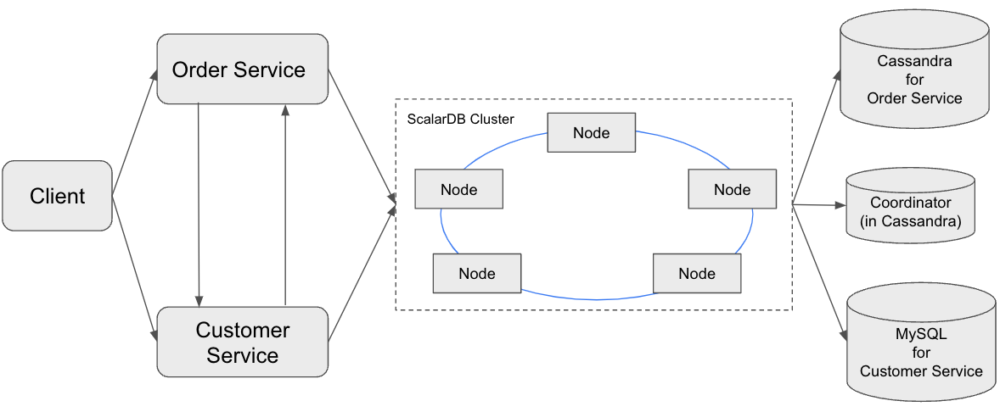

---
tags:
  - Enterprise Premium
displayed_sidebar: docsEnglish
---

# Create an Application That Supports Microservice Transactions in a Shared ScalarDB Cluster Environment by Using LINQ

import WarningLicenseKeyContact from '/src/components/en-us/_warning-license-key-contact.mdx';

This tutorial describes how to create a sample e-commerce application that supports microservice transactions and follows the shared-cluster pattern for the ScalarDB Cluster .NET Client SDK and LINQ.

For details about the shared-cluster pattern, see [ScalarDB Cluster Deployment Patterns for Microservices](../../scalardb-cluster/deployment-patterns-for-microservices.mdx#shared-cluster-pattern).

This section describes how to create a sample e-commerce application that follows the shared-cluster pattern by using the ScalarDB Cluster .NET Client SDK and LINQ.

## Overview of the sample microservice application

The sample e-commerce application shows how users can order and pay for items by using a line of credit.

The sample application has two microservices called the *Customer Service* and the *Order Service* based on the [database-per-service pattern](https://microservices.io/patterns/data/database-per-service.html):

- The **Customer Service** manages customer information, including line-of-credit information, credit limit, and credit total.
- The **Order Service** is responsible for order operations like placing an order and getting order histories.

Each service has gRPC endpoints. Clients call the endpoints, and the services call each endpoint as well.

The databases that you will be using in the sample application are Cassandra and MySQL. The Customer Service and the Order Service use Cassandra and MySQL, respectively, through ScalarDB Cluster.



As shown in the diagram, ScalarDB Cluster has a small Coordinator database used for the Consensus Commit protocol. The database is service independent and exists for managing transaction metadata for Consensus Commit in a highly available manner.

In the sample application, for ease of setup and explanation, you co-locate the Coordinator database in the same Cassandra instance of the Order Service. Alternatively, you can manage the Coordinator database as a separate database.

:::note

Since the focus of the sample application is to demonstrate using ScalarDB Cluster, application-specific error handling, authentication processing, and similar functions are not included in the sample application.

:::

### Service endpoints

The endpoints defined in the services are as follows:

- Customer Service
    - `GetCustomerInfo`
    - `Payment`
    - `Repayment`
- Order Service
    - `PlaceOrder`
    - `GetOrder`
    - `GetOrders`

### What you can do in this sample application

The sample application supports the following types of transactions:

- Get customer information through the `GetCustomerInfo` endpoint of the Customer Service.
- Place an order by using a line of credit through the `PlaceOrder` endpoint of the Order Service and the `Payment` endpoint of the Customer Service.
    - Checks if the cost of the order is below the customer's credit limit.
    - If the check passes, records the order history and updates the amount the customer has spent.
- Get order information by order ID through the `GetOrder` endpoint of the Order Service and the `GetCustomerInfo` endpoint of the Customer Service.
- Get order information by customer ID through the `GetOrders` endpoint of the Order Service and the `GetCustomerInfo` endpoint of the Customer Service.
- Make a payment through the `Repayment` endpoint of the Customer Service.
    - Reduces the amount the customer has spent.

:::note

The `GetCustomerInfo` endpoint works as a participant service endpoint when receiving a transaction ID from the coordinator.

:::

## Prerequisites

- [.NET SDK 8.0](https://dotnet.microsoft.com/en-us/download/dotnet/8.0)
- [Docker](https://www.docker.com/get-started/) 20.10 or later with [Docker Compose](https://docs.docker.com/compose/install/) V2 or later

:::note

.NET SDK 8.0 is the version used to create the sample application. For information about all supported versions, see [Requirements](../../requirements.mdx#net)

:::

<WarningLicenseKeyContact product="ScalarDB Cluster" />

## Set up ScalarDB Cluster

The following sections describe how to set up the sample application that supports microservice transactions with ScalarDB Cluster.

### Clone the ScalarDB samples repository

Open **Terminal**, then clone the ScalarDB samples repository by running the following command:

```console
git clone https://github.com/scalar-labs/scalardb-samples
```

Then, go to the directory that contains the sample application by running the following command:

```console
cd scalardb-samples/dotnet/microservice-transactions-sample-with-shared-cluster-with-linq/
```

### Set the license key

Set the license key (trial license or commercial license) for the ScalarDB Cluster deployment to the configuration file [`scalardb-cluster-node.properties`](https://github.com/scalar-labs/scalardb-samples/tree/main/dotnet/microservice-transactions-sample-with-shared-cluster-with-linq/scalardb-cluster-node.properties). For details, see [How to Configure a Product License Key](../../scalar-licensing/index.mdx).

### Start containers

The configuration file for ScalarDB Cluster is [`scalardb-cluster-node.properties`](https://github.com/scalar-labs/scalardb-samples/tree/main/dotnet/microservice-transactions-sample-with-shared-cluster-with-linq/scalardb-cluster-node.properties). The Customer Service and the Order Service use a standard `appsettings.json` file for their configurations.

Cassandra and MySQL are already configured with the multi-storage setting, as shown in the configuration. For details about configuring the multi-storage transactions feature in ScalarDB, see [How to configure ScalarDB to support multi-storage transactions](../../multi-storage-transactions.mdx#how-to-configure-scalardb-to-support-multi-storage-transactions).

For the sake of quickly setting up this sample application, you'll run ScalarDB Cluster in standalone mode. For details about running ScalarDB Cluster in standalone mode, see [ScalarDB Cluster Standalone Mode](../../scalardb-cluster/standalone-mode.mdx).

Also, authentication is enabled to implement access control for each microservice. For details about authentication in ScalarDB, see [Authenticate Users](../../scalardb-cluster/scalardb-auth-with-sql.mdx).

:::note

For the sake of quickly setting up this sample application, wire encryption is not enabled. However, we recommend enabling wire encryption in a production environment to secure the communication between the client and the ScalarDB Cluster nodes, and amongst the ScalarDB Cluster nodes themselves. For details about wire encryption, see [Wire encryption](../../scalardb-cluster/encrypt-wire-communications.mdx).

:::

To start the containers for the sample application, run the following command:

```console
docker compose up -d --build
```

:::note

Starting the Docker container may take more than one minute depending on your development environment.

:::

### Apply the schema, create users, grant privileges, and load the initial data

The database schema (the method in which the data will be organized) for the sample application is defined as C# objects in [Common project](https://github.com/scalar-labs/scalardb-samples/tree/main/dotnet/microservice-transactions-sample-with-shared-cluster-with-linq/).

To apply the schema, create users, grant privileges, and load the initial data, run the following command:

```console
dotnet run --project DataLoader/DataLoader.csproj --config scalardb-options.json
```

#### Schema details

All the tables for the Customer Service are created in the `customer_service` namespace.

- `customer_service.customers`: a table that manages customers' information
    - `credit_limit`: the maximum amount of money a lender will allow each customer to spend when using a line of credit
    - `credit_total`: the amount of money that each customer has already spent by using their line of credit

Also, all the tables for the Order Service are created in the `order_service` namespace.

- `order_service.orders`: a table that manages order information
- `order_service.statements`: a table that manages order statement information
- `order_service.items`: a table that manages information of items to be ordered

The Entity Relationship Diagram for the schema is as follows:


### Initial data

The following records should be stored in the `customer_service.customers` table:

| customer_id | name          | credit_limit | credit_total |
|-------------|---------------|--------------|--------------|
| 1           | Yamada Taro   | 10000        | 0            |
| 2           | Yamada Hanako | 10000        | 0            |
| 3           | Suzuki Ichiro | 10000        | 0            |

And the following records should be stored in the `order_service.items` table:

| item_id | name   | price |
|---------|--------|-------|
| 1       | Apple  | 1000  |
| 2       | Orange | 2000  |
| 3       | Grape  | 2500  |
| 4       | Mango  | 5000  |
| 5       | Melon  | 3000  |

### Users and privileges

A `customer-service` user with `READ`, `CREATE`, `WRITE`, and `DELETE` privileges for the `customer_service` namespace, and an `order-service` user with `READ`, `CREATE`, `WRITE`, and `DELETE` privileges for the `order_service` namespace are created.

## Run the sample application

The following sections describe how to execute transactions and retrieve data in the sample e-commerce application.

### Get customer information

Start with getting information about the customer whose ID is `1` by running the following command:

```console
dotnet run --project Client/Client.csproj GetCustomerInfo 1
```

You should see the following output:

```console
{ "id": 1, "name": "Yamada Taro", "creditLimit": 10000 }
```

At this time, `creditTotal` isn't shown, which means the current value of `creditTotal` is `0`.

### Place an order

Then, have customer ID `1` place an order for three apples and two oranges by running the following command:

:::note

The order format in this command is `PlaceOrder <CUSTOMER_ID> <ITEM_ID>:<COUNT>,<ITEM_ID>:<COUNT>,...`.

:::

```console
dotnet run --project Client/Client.csproj PlaceOrder 1 1:3,2:2
```

You should see a similar output as below, with a different UUID for `orderId`, which confirms that the order was successful:

```console
{ "orderId": "4b076074-797f-4fdb-b357-59531f0aec12" }
```

### Check the order details

Check details about the order by running the following command, replacing `<ORDER_ID_UUID>` with the UUID for the `orderId` that was shown after running the previous command:

```console
dotnet run --project Client/Client.csproj GetOrder <ORDER_ID_UUID>
```

You should see a similar output as below, with different UUIDs for `orderId` and `timestamp`:

```console
{ "order": { "orderId": "4b076074-797f-4fdb-b357-59531f0aec12", "timestamp": "63825948620680", "customerId": 1, "customerName": "Yamada Taro", "statement": [ { "itemId": 1, "itemName": "Apple", "price": 1000, "count": 3, "total": 3000 }, { "itemId": 2, "itemName": "Orange", "price": 2000, "count": 2, "total": 4000 } ], "total": 7000 } }
```

### Place another order

Place an order for one melon that uses the remaining amount in `creditTotal` for customer ID `1` by running the following command:

```console
dotnet run --project Client/Client.csproj PlaceOrder 1 5:1
```

You should see a similar output as below, with a different UUID for `orderId`, which confirms that the order was successful:

```console
{ "orderId": "6c7750c8-10ad-4f02-aa3c-e30621d95151" }
```

### Check the order history

Get the history of all orders for customer ID `1` by running the following command:

```console
dotnet run --project Client/Client.csproj GetOrders 1
```

You should see a similar output as below, with different UUIDs for `orderId` and `timestamp`, which shows the history of all orders for customer ID `1` in descending order by timestamp:

```console
{ "order": [ { "orderId": "4b076074-797f-4fdb-b357-59531f0aec12", "timestamp": "63825948620680", "customerId": 1, "customerName": "Yamada Taro", "statement": [ { "itemId": 1, "itemName": "Apple", "price": 1000, "count": 3, "total": 3000 }, { "itemId": 2, "itemName": "Orange", "price": 2000, "count": 2, "total": 4000 } ], "total": 7000 }, { "orderId": "6c7750c8-10ad-4f02-aa3c-e30621d95151", "timestamp": "63825948672045", "customerId": 1, "customerName": "Yamada Taro", "statement": [ { "itemId": 5, "itemName": "Melon", "price": 3000, "count": 1, "total": 3000 } ], "total": 3000 } ] }
```

### Check the credit total

Get the credit total for customer ID `1` by running the following command:

```console
dotnet run --project Client/Client.csproj GetCustomerInfo 1
```

You should see the following output, which shows that customer ID `1` has reached their `creditLimit` amount in `creditTotal` and cannot place anymore orders:

```console
{ "id": 1, "name": "Yamada Taro", "creditLimit": 10000, "creditTotal": 10000 }
```

Try to place an order for one grape and one mango by running the following command:

```console
dotnet run --project Client/Client.csproj PlaceOrder 1 3:1,4:1
```

You should see the following output, which shows that the order failed because the `creditTotal` amount would exceed the `creditLimit` amount:

```console
Unhandled exception: Grpc.Core.RpcException: Status(StatusCode="FailedPrecondition", Detail="Credit limit exceeded (17500 > 10000)")
   at MicroserviceTransactionsSample.Client.Commands.PlaceOrderCommand.placeOrder(Int32 customerId, Dictionary`2 orders, OrderServiceClient client)
...
```

### Make a payment

To continue making orders, customer ID `1` must make a payment to reduce the `creditTotal` amount.

Make a payment by running the following command:

```console
dotnet run --project Client/Client.csproj Repayment 1 8000
```

Then, check the `creditTotal` amount for customer ID `1` by running the following command:

```console
dotnet run --project Client/Client.csproj GetCustomerInfo 1
```

You should see the following output, which shows that a payment was applied to customer ID `1`, reducing the `creditTotal` amount:

```console
{ "id": 1, "name": "Yamada Taro", "creditLimit": 10000, "creditTotal": 2000 }
```

Now that customer ID `1` has made a payment, place an order for one grape and one mango by running the following command:

```console
dotnet run --project Client/Client.csproj PlaceOrder 1 3:1,4:1
```

You should see a similar output as below, with a different UUID for `orderId`, which confirms that the order was successful:

```console
{ "orderId": "5e26a530-0b54-4205-bb74-a06675570934" }
```

## Stop the sample application

To stop the sample application, you need to stop the Docker containers that are running Cassandra, MySQL, ScalarDB Cluster, and the microservices. To stop the Docker containers, run the following command:

```console
docker compose down -v
```
