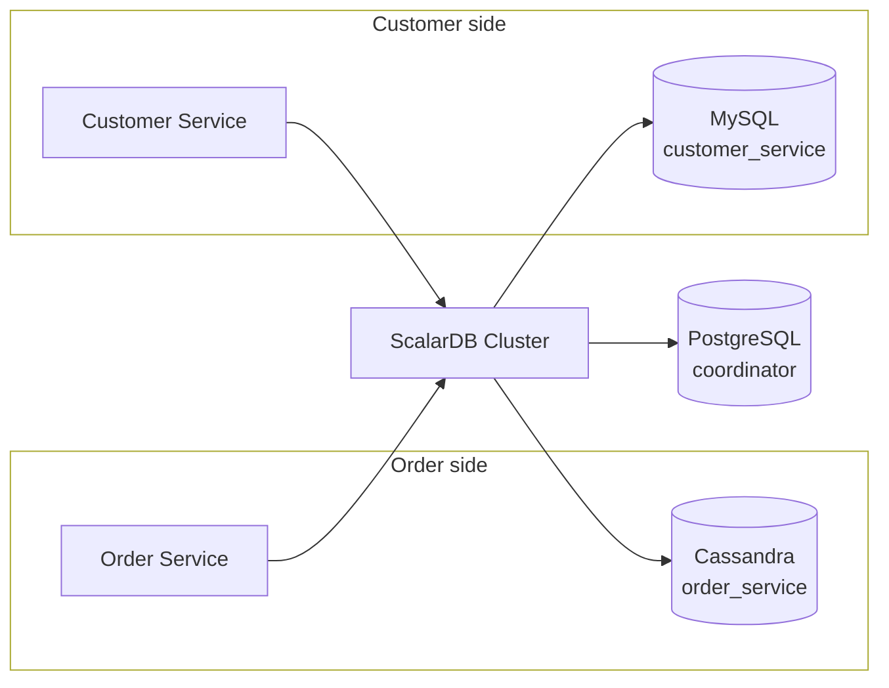
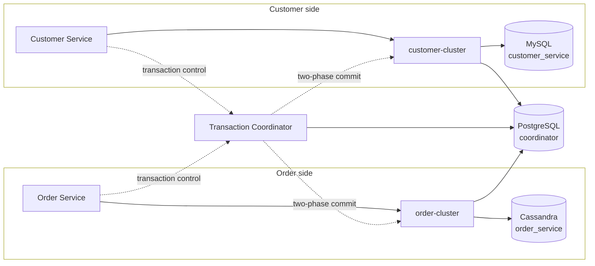
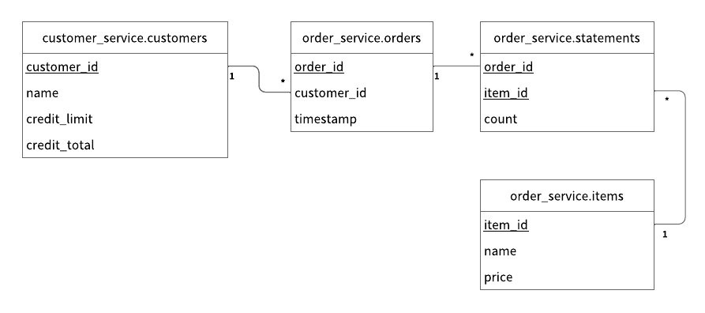

---
tags:
  - Enterprise Premium
displayed_sidebar: docsEnglish
---

# Create an Application That Supports Microservice Transactions by Using the Microservice Transaction API

import Tabs from '@theme/Tabs';
import TabItem from '@theme/TabItem';
import WarningLicenseKeyContact from '../../components/_warning-license-key-contact.mdx';
import JDKVersions from '../../components/_prerequisites-jdk-versions.mdx';

This tutorial describes how to create a sample e-commerce application that supports microservice transactions by using the Microservice Transaction API.

The Microservice Transaction API lets you run a single transaction across several processes without implementing the two-phase commit protocol yourself. Your services never call `prepare`, `validate`, or `commit`; ScalarDB Cluster does that on their behalf.

Because of that, the same application code runs against either [ScalarDB Cluster deployment pattern](../../scalardb-cluster/deployment-patterns-for-microservices.mdx)—the shared-cluster pattern or the separated-cluster pattern. This sample is arranged to make that concrete: it contains one copy of the application code and two sets of configuration files. Use the tabs throughout this page to choose a pattern; your choice carries through every step.

:::note

Both deployment patterns run ScalarDB Cluster nodes, so a license key is required whichever one you choose.

:::

## Overview of the sample microservice application

The sample e-commerce application shows how users can order and pay for items by using a line of credit.

The sample application has two microservices called the *Customer Service* and the *Order Service* based on the [database-per-service pattern](https://microservices.io/patterns/data/database-per-service.html):

- The **Customer Service** manages customer information, including line-of-credit information, credit limit, and credit total.
- The **Order Service** is responsible for order operations like placing an order and getting order histories.

Each service has gRPC endpoints. Clients call the endpoints, and the services call each endpoint as well.

The databases that you will be using in the sample application are MySQL, Cassandra, and PostgreSQL. The Customer Service and the Order Service use MySQL and Cassandra respectively, through ScalarDB Cluster, and PostgreSQL holds the Coordinator tables. Both deployment patterns use the same three databases and put each namespace in the same one, so the ScalarDB topology is the only thing that changes between them.

The two deployment patterns differ in how ScalarDB Cluster sits between the services and those databases.

In the shared-cluster pattern, both services connect to one cluster node, which reaches all three databases:



In the separated-cluster pattern, each service owns a cluster, a Transaction Coordinator drives the transaction across them, and the Coordinator tables move to a store of their own that every component reaches:



The two sides are symmetric: each owns a service, a cluster, and a database. What sits outside them is shared: the Transaction Coordinator, which drives the transaction, and the Coordinator tables, which the Transaction Coordinator and both clusters read from and write to.

The application code is the same in both. Only the configuration differs.

:::note

Since the focus of the sample application is to demonstrate using the Microservice Transaction API, application-specific error handling, authentication processing, and similar functions are not included in the sample application.

ScalarDB Auth is also not enabled, to keep the difference between the two deployment patterns easy to read. Before adapting this topology for a real system, add per-service users and namespace privileges. For details, see [Authenticate and Authorize Users](../../scalardb-cluster/scalardb-auth-with-sql.mdx). For a microservice sample that has ScalarDB Auth enabled, see [Create an Application That Supports Microservice Transactions in a Shared ScalarDB Cluster Environment by Using ScalarDB JDBC](../microservice-transactions-sample-with-shared-cluster-with-jdbc/README.mdx).

:::

### Service endpoints

The endpoints defined in the services are as follows:

- Customer Service
    - `getCustomerInfo`
    - `payment`
    - `repayment`

- Order Service
    - `placeOrder`
    - `getOrder`
    - `getOrders`

:::note

The Customer Service exposes no `prepare`, `validate`, `commit`, or `rollback` endpoints. Not needing them is the point of the Microservice Transaction API.

:::

### What you can do in this sample application

The sample application supports the following types of transactions:

- Get customer information through the `getCustomerInfo` endpoint of the Customer Service.
- Place an order by using a line of credit through the `placeOrder` endpoint of the Order Service and the `payment` endpoint of the Customer Service.
    - Checks if the cost of the order is below the customer's credit limit.
    - If the check passes, records the order history and updates the amount the customer has spent.
- Get order information by order ID through the `getOrder` endpoint of the Order Service and the `getCustomerInfo` endpoint of the Customer Service.
- Get order information by customer ID through the `getOrders` endpoint of the Order Service and the `getCustomerInfo` endpoint of the Customer Service.
- Make a payment through the `repayment` endpoint of the Customer Service.
    - Reduces the amount the customer has spent.

`placeOrder`, `getOrder`, and `getOrders` each run as one transaction across both services, and therefore across MySQL and Cassandra. `getCustomerInfo` and `repayment` run within the Customer Service alone when called directly, so they use the ordinary Transaction API instead.

## How the Microservice Transaction API works

This section explains the API itself. It applies to both deployment patterns. For the full API reference, see [ScalarDB Cluster Java API Guide](../../scalardb-cluster/api-guide.mdx#microservice-transaction-api).

Use this API only for transactions that span services. A transaction that stays within one service has nothing to coordinate across processes, so it uses the ordinary Transaction API (`DistributedTransactionManager`) instead. Both managers come from the same `TransactionFactory` and the same configuration file:

```java
TransactionFactory factory = TransactionFactory.create("<CONFIGURATION_FILE_PATH>");
DistributedTransactionManager transactionManager = factory.getTransactionManager();
GlobalTransactionManager globalTransactionManager = factory.getGlobalTransactionManager();
```

A transaction that spans services has two kinds of handles:

- A `GlobalTransaction`, obtained from `begin()` or `beginReadOnly()`. It drives the outcome of the transaction as a whole and holds no data.
- A `BranchTransaction` per service, obtained from `beginBranch(transactionId)`. It is the CRUD handle for that service's part of the work.

### The initiator

One service begins the transaction, shares its ID with the others, and decides the outcome. In this sample, the Order Service is the initiator:

```java
GlobalTransaction global = globalTransactionManager.begin();
BranchTransaction branch = null;
try {
  branch = globalTransactionManager.beginBranch(global.getId());
  // ... this service's own CRUD ...
  branch.end(BranchTransaction.Status.SUCCESS);
  branch = null;

  callCustomerService(global.getId());  // pass the transaction ID over gRPC

  global.commit();
} catch (UnknownTransactionStatusException e) {
  // ... end the branch with FAILURE; do not roll back ...
} catch (Exception e) {
  // ... end the branch with FAILURE, then roll back ...
}
```

:::note

Notice the order: this service finishes its own work and ends its branch *before* calling the other service. Keeping the branch open across the remote call would also be correct, but ending it as soon as the service is done is the idiom the API is designed around.

:::

### The participant

A service that receives a transaction ID joins the same transaction with its own branch, does its work, and ends the branch. It does **not** commit or roll back—that is the initiator's responsibility:

```java
BranchTransaction branch = globalTransactionManager.beginBranch(transactionId);
// ... this service's own CRUD ...
branch.end(BranchTransaction.Status.SUCCESS);
```

In this sample, the Customer Service runs as a participant when the request carries a transaction ID. Otherwise its work stays within the service, so it runs as an ordinary transaction through the Transaction API rather than the Microservice Transaction API. The `payment` endpoint is always a participant; `repayment` never is; `getCustomerInfo` is either, depending on the caller.

### Ending a branch is mandatory

Every branch must be ended exactly once, whatever the outcome. That obligation belongs to the process running the branch, and no other process can discharge it. On a failure path, end the branch with `Status.FAILURE`:

```java
branch.end(BranchTransaction.Status.FAILURE);
```

`end(FAILURE)` is lenient so that it can be called from a `catch` block: ending a branch that has already been ended is a no-op, and it does not mask the original failure.

:::note

`end(Status)`, `commit()`, and `rollback()` each declare checked exceptions, so a `catch` block that calls them needs its own handling.

:::

### Error handling

Only the initiator can restart a transaction, so only the initiator retries. In this sample, the Order Service carries a retry loop, as does the Customer Service for the transactions it runs on its own; the participant path does not.

Not every failure is worth retrying. The sample treats the gRPC `NOT_FOUND` and `FAILED_PRECONDITION` statuses as deterministic business failures—an unknown item, or an exceeded credit limit—and does not retry them.

`UnknownTransactionStatusException` is handled separately and is never retried. It means the transaction may or may not have been committed; retrying could duplicate a committed transaction. Determining the actual status is the application's responsibility.

## Prerequisites

- One of the following Java Development Kits (JDKs):
  <JDKVersions versionNumbers="8, 11, 17, or 21" />
- [Docker](https://www.docker.com/get-started/) 20.10 or later with [Docker Compose](https://docs.docker.com/compose/install/) V2 or later

<WarningLicenseKeyContact product="ScalarDB Cluster" />

## Set up ScalarDB Cluster

The following sections describe how to set up the sample application that supports microservice transactions by using the Microservice Transaction API in ScalarDB Cluster.

### Clone the ScalarDB samples repository

Open **Terminal**, then clone the ScalarDB samples repository by running the following command:

```console
git clone https://github.com/scalar-labs/scalardb-samples
```

Then, go to the directory that contains the sample application by running the following command:

```console
cd scalardb-samples/microservice-transaction-sample-with-cluster/
```

### Choose a deployment pattern

The sample contains one copy of the application code and two directories of configuration:

- **`shared-cluster/`:** Both services connect to one ScalarDB Cluster node, which holds both namespaces and the Coordinator tables.
- **`separated-clusters/`:** Each service owns a ScalarDB Cluster node, and a Transaction Coordinator drives two-phase commit across them. The Coordinator tables live in a store of their own, which every ScalarDB component in the pattern can reach.

For guidance on choosing between the patterns, see [ScalarDB Cluster Deployment Patterns for Microservices](../../scalardb-cluster/deployment-patterns-for-microservices.mdx).

Select a pattern below. Your selection applies to every step on this page.

<Tabs groupId="deployment_pattern" queryString>
  <TabItem value="shared_cluster" label="Shared cluster" default>
    Every command in this tutorial is run from the `shared-cluster` directory:

    ```console
    cd shared-cluster/
    ```
  </TabItem>
  <TabItem value="separated_clusters" label="Separated clusters">
    Every command in this tutorial is run from the `separated-clusters` directory:

    ```console
    cd separated-clusters/
    ```
  </TabItem>
</Tabs>

### Set the license key

Each ScalarDB Cluster node checks a license key at startup, so you need to set yours in the properties file for every node that the pattern you selected runs.

<Tabs groupId="deployment_pattern" queryString>
  <TabItem value="shared_cluster" label="Shared cluster" default>
    Set the license key and certificate for ScalarDB Cluster in `scalardb-cluster-node.properties`:

    ```properties
    scalar.db.cluster.node.licensing.license_key=<YOUR_LICENSE_KEY>
    scalar.db.cluster.node.licensing.license_check_cert_pem=<YOUR_LICENSE_CHECK_CERT_PEM>
    ```
  </TabItem>
  <TabItem value="separated_clusters" label="Separated clusters">
    Set the license key and certificate for ScalarDB Cluster in **both** `customer-cluster.properties` and `order-cluster.properties`:

    ```properties
    scalar.db.cluster.node.licensing.license_key=<YOUR_LICENSE_KEY>
    scalar.db.cluster.node.licensing.license_check_cert_pem=<YOUR_LICENSE_CHECK_CERT_PEM>
    ```

    The Transaction Coordinator is not a licensed component and needs no license key.
  </TabItem>
</Tabs>

For details, see [How to Configure a Product License Key](../../scalar-licensing/index.mdx).

:::note

For the sake of quickly setting up this sample application, ScalarDB Cluster runs in standalone mode and wire encryption is not enabled. For a production environment, we recommend enabling wire encryption. For details, see [ScalarDB Cluster Standalone Mode](../../scalardb-cluster/standalone-mode.mdx) and [Wire encryption](../../scalardb-cluster/encrypt-wire-communications.mdx).

:::

### ScalarDB Cluster configuration

The properties files for both patterns are already configured for the sample application, so there is nothing to change in this section or the next beyond the license key you set above. Both sections explain what the settings do.

The cluster-side configuration is where the two patterns are structurally different. The microservice configuration that follows mostly reflects the settings here.

<Tabs groupId="deployment_pattern" queryString>
  <TabItem value="shared_cluster" label="Shared cluster" default>
    One node serves both services, so it needs access to both namespaces and to the Coordinator tables. It uses multi-storage to reach MySQL, Cassandra, and PostgreSQL, in `scalardb-cluster-node.properties`:

    ```properties
    scalar.db.storage=multi-storage
    scalar.db.multi_storage.storages=mysql,cassandra,coordinatordb

    scalar.db.multi_storage.storages.mysql.storage=jdbc
    scalar.db.multi_storage.storages.mysql.contact_points=jdbc:mysql://mysql:3306/?sslMode=REQUIRED
    scalar.db.multi_storage.storages.mysql.username=root
    scalar.db.multi_storage.storages.mysql.password=mysql

    scalar.db.multi_storage.storages.cassandra.storage=cassandra
    scalar.db.multi_storage.storages.cassandra.contact_points=cassandra
    scalar.db.multi_storage.storages.cassandra.username=cassandra
    scalar.db.multi_storage.storages.cassandra.password=cassandra

    scalar.db.multi_storage.storages.coordinatordb.storage=jdbc
    scalar.db.multi_storage.storages.coordinatordb.contact_points=jdbc:postgresql://postgres:5432/postgres
    scalar.db.multi_storage.storages.coordinatordb.username=postgres
    scalar.db.multi_storage.storages.coordinatordb.password=postgres

    scalar.db.multi_storage.namespace_mapping=customer_service:mysql,coordinator:coordinatordb
    scalar.db.multi_storage.default_storage=cassandra

    scalar.db.cluster.node.standalone_mode.enabled=true
    ```

    `namespace_mapping` sends each namespace to a storage, and `default_storage` catches any namespace not listed, which is why `order_service` needs no entry. The Coordinator tables get a database of their own here as well as in the other pattern, so that each namespace lives in the same database in both and the topology is the only difference.

    `standalone_mode.enabled=true` runs the node as a single instance with static membership. Without it, the node tries to discover peers through Kubernetes.

    For details about multi-storage, see [How to configure ScalarDB to support multi-storage transactions](../../multi-storage-transactions.mdx#how-to-configure-scalardb-to-support-multi-storage-transactions). For details about standalone mode, see [ScalarDB Cluster Standalone Mode](../../scalardb-cluster/standalone-mode.mdx).
  </TabItem>
  <TabItem value="separated_clusters" label="Separated clusters">
    This pattern has two kinds of nodes to configure: participant clusters and the Transaction Coordinator.

    <h4>Participant clusters</h4>

    Each participant cluster owns one application namespace, but it also has to reach the Coordinator tables, so it uses multi-storage as well. The two files have the same shape and differ in the database they own and the ID they carry.

    `customer-cluster.properties`:

    ```properties
    scalar.db.storage=multi-storage
    scalar.db.multi_storage.storages=mysql,coordinatordb

    scalar.db.multi_storage.storages.mysql.storage=jdbc
    scalar.db.multi_storage.storages.mysql.contact_points=jdbc:mysql://mysql:3306/?sslMode=REQUIRED
    scalar.db.multi_storage.storages.mysql.username=root
    scalar.db.multi_storage.storages.mysql.password=mysql

    scalar.db.multi_storage.storages.coordinatordb.storage=jdbc
    scalar.db.multi_storage.storages.coordinatordb.contact_points=jdbc:postgresql://postgres:5432/postgres
    scalar.db.multi_storage.storages.coordinatordb.username=postgres
    scalar.db.multi_storage.storages.coordinatordb.password=postgres
    scalar.db.multi_storage.storages.coordinatordb.jdbc.connection_pool.max_total=25
    scalar.db.multi_storage.storages.coordinatordb.jdbc.table_metadata.connection_pool.max_total=5

    scalar.db.multi_storage.namespace_mapping=coordinator:coordinatordb
    scalar.db.multi_storage.default_storage=mysql

    scalar.db.cluster.node.standalone_mode.enabled=true
    scalar.db.cluster.node.transaction_participant.enabled=true
    scalar.db.cluster.id=customer-cluster
    ```

    `order-cluster.properties`:

    ```properties
    scalar.db.storage=multi-storage
    scalar.db.multi_storage.storages=cassandra,coordinatordb

    scalar.db.multi_storage.storages.cassandra.storage=cassandra
    scalar.db.multi_storage.storages.cassandra.contact_points=cassandra
    scalar.db.multi_storage.storages.cassandra.username=cassandra
    scalar.db.multi_storage.storages.cassandra.password=cassandra

    scalar.db.multi_storage.storages.coordinatordb.storage=jdbc
    scalar.db.multi_storage.storages.coordinatordb.contact_points=jdbc:postgresql://postgres:5432/postgres
    scalar.db.multi_storage.storages.coordinatordb.username=postgres
    scalar.db.multi_storage.storages.coordinatordb.password=postgres
    scalar.db.multi_storage.storages.coordinatordb.jdbc.connection_pool.max_total=25
    scalar.db.multi_storage.storages.coordinatordb.jdbc.table_metadata.connection_pool.max_total=5

    scalar.db.multi_storage.namespace_mapping=coordinator:coordinatordb
    scalar.db.multi_storage.default_storage=cassandra

    scalar.db.cluster.node.standalone_mode.enabled=true
    scalar.db.cluster.node.transaction_participant.enabled=true
    scalar.db.cluster.id=order-cluster
    ```

  :::note

  Both files map only `coordinator` and point `default_storage` at their own database, so the same two lines carry a different meaning in each.

  :::

    - **`namespace_mapping` and `default_storage`:** Only `coordinator` needs an explicit mapping. The application namespace falls through to `default_storage`, which is this cluster's own database.
    - **`...coordinatordb.jdbc.connection_pool.max_total`:** Three ScalarDB components connect to the Coordinator database in this pattern, and the default pool sizes are meant for one. Left at their defaults, the pools exhaust a default PostgreSQL `max_connections` and a node fails to start with `FATAL: sorry, too many clients already`.
    - **`scalar.db.cluster.node.transaction_participant.enabled`:** Serves the `TransactionParticipant` service, so the Transaction Coordinator can drive two-phase commit against this cluster, in addition to the ordinary transactions the cluster already serves. This is what makes a cluster a participant.
    - **`scalar.db.cluster.id`:** The participant ID. It is required when the participant service is enabled, and must match the value in the corresponding service's properties and in the Transaction Coordinator's cluster list.

    <h4>Transaction Coordinator</h4>

    The Transaction Coordinator needs to know which clusters it coordinates and where to keep the Coordinator tables in `transaction-coordinator.properties`:

    ```properties
    scalar.db.cluster.transaction_coordinator.standalone_mode.enabled=true

    scalar.db.cluster.transaction_coordinator.clusters=customer-cluster,order-cluster
    scalar.db.cluster.transaction_coordinator.clusters.customer-cluster.contact_points=indirect:customer-cluster
    scalar.db.cluster.transaction_coordinator.clusters.customer-cluster.contact_port=60053
    scalar.db.cluster.transaction_coordinator.clusters.order-cluster.contact_points=indirect:order-cluster
    scalar.db.cluster.transaction_coordinator.clusters.order-cluster.contact_port=60053

    scalar.db.storage=jdbc
    scalar.db.contact_points=jdbc:postgresql://postgres:5432/postgres
    scalar.db.username=postgres
    scalar.db.password=postgres
    scalar.db.jdbc.connection_pool.max_total=25
    scalar.db.jdbc.table_metadata.connection_pool.max_total=5
    ```

    - **`scalar.db.cluster.transaction_coordinator.clusters`:** The participant clusters this coordinator drives, named by the IDs they set in `scalar.db.cluster.id`. Each one needs its own `contact_points`, and `contact_port` if it is not the default `60053`.
    - **`scalar.db.storage` and `scalar.db.contact_points`:** The storage holding the Coordinator tables, configured with the standard storage settings rather than a coordinator-specific key. The Transaction Coordinator opens this connection when it starts and exits if it fails.

    This sample sets only what it needs. For the full set of Transaction Coordinator settings, including ports, membership, and wire encryption, see [Transaction Coordinator configurations](../../scalardb-cluster/scalardb-cluster-configurations.mdx#transaction-coordinator-configurations).

  :::note

  The Transaction Coordinator settings live under `scalar.db.cluster.transaction_coordinator.`, which is a different prefix from a cluster node's `scalar.db.cluster.node.`. In particular, `standalone_mode.enabled` exists under both prefixes and they are not interchangeable. The Transaction Coordinator image defaults its membership type to Kubernetes, so a coordinator that does not see its own `standalone_mode` key will try to reach the Kubernetes API instead of starting.

  :::

    The Transaction Coordinator is not a licensed component and needs no license key.
  </TabItem>
</Tabs>

### Microservice configuration

This is where the two patterns actually differ. The application code is identical; only these properties change.

<Tabs groupId="deployment_pattern" queryString>
  <TabItem value="shared_cluster" label="Shared cluster" default>
    Both services connect to the same cluster node, and that node holds the transaction. No Transaction Coordinator is involved, so `customer-service.properties` and `order-service.properties` are identical:

    ```properties
    scalar.db.transaction_manager=cluster
    scalar.db.contact_points=indirect:scalardb-cluster-node
    scalar.db.cluster.client.transaction_coordinator.enabled=false
    ```

    `transaction_coordinator.enabled=false` is the default and could be omitted. It is written out so that the difference from the other pattern is visible in the file rather than only in its absence.
  </TabItem>
  <TabItem value="separated_clusters" label="Separated clusters">
    Each service connects to the cluster it owns, and both send transaction control to the same Transaction Coordinator. The two files therefore differ in two places—the cluster they contact and the ID they identify themselves by—and agree on everything else.

    `customer-service.properties`:

    ```properties
    scalar.db.transaction_manager=cluster
    scalar.db.contact_points=indirect:customer-cluster
    scalar.db.cluster.id=customer-cluster
    scalar.db.cluster.client.transaction_coordinator.enabled=true
    scalar.db.cluster.client.transaction_coordinator.contact_points=indirect:transaction-coordinator
    scalar.db.cluster.client.transaction_coordinator.contact_port=60055
    ```

    `order-service.properties`:

    ```properties
    scalar.db.transaction_manager=cluster
    scalar.db.contact_points=indirect:order-cluster
    scalar.db.cluster.id=order-cluster
    scalar.db.cluster.client.transaction_coordinator.enabled=true
    scalar.db.cluster.client.transaction_coordinator.contact_points=indirect:transaction-coordinator
    scalar.db.cluster.client.transaction_coordinator.contact_port=60055
    ```

    The settings that this pattern adds are as follows.

    - **`scalar.db.cluster.id`:** The identifier of the cluster that this service belongs to. The Transaction Coordinator uses it to tell which participant a branch belongs to. The value must match the one set on the corresponding cluster node and must appear in the Transaction Coordinator's `scalar.db.cluster.transaction_coordinator.clusters`. Those three places name the same participant.
    - **`scalar.db.cluster.client.transaction_coordinator.enabled`:** Which backing `getGlobalTransactionManager()` returns. When `false`, the transaction lives inside the single cluster the service is connected to. When `true`, transaction control is routed to the Transaction Coordinator, which drives two-phase commit across the participant clusters. This one setting is what selects the deployment pattern. It has no effect on `getTransactionManager()`, which always connects directly to the cluster the service is connected to, so the transactions that stay within one service run the same way in both patterns.
    - **`scalar.db.cluster.client.transaction_coordinator.contact_points`:** Which Transaction Coordinator to send transaction control to. This uses the same format as `scalar.db.contact_points`: `indirect:<HOST>` to reach it through a single endpoint, or `direct-kubernetes:<NAMESPACE>/<ENDPOINT>` to discover its nodes through the Kubernetes endpoint API.
    - **`scalar.db.cluster.client.transaction_coordinator.contact_port`:** The port of the Transaction Coordinator. Its default is `60055`, which is not the same as a cluster node's `60053`.

  :::note

  `scalar.db.cluster.id` is required on the client as well as on the cluster node whenever the Transaction Coordinator is enabled and the service also connects to a cluster, as both services here do. Without it, the service fails at startup with [`DB-CLUSTER-10080`](../../scalardb-cluster/scalardb-cluster-status-codes.mdx#db-cluster-10080).

  :::
  </TabItem>
</Tabs>

### Start the databases and ScalarDB Cluster

Start the infrastructure before the microservices, since each service connects to ScalarDB Cluster when it starts. The number of containers differs between the patterns.

<Tabs groupId="deployment_pattern" queryString>
  <TabItem value="shared_cluster" label="Shared cluster" default>
    Start MySQL, Cassandra, PostgreSQL, and one ScalarDB Cluster node:

    ```console
    docker compose up -d mysql cassandra postgres scalardb-cluster-node
    ```

    The cluster node uses the multi-storage setting: MySQL holds the `customer_service` namespace, Cassandra holds `order_service`, and PostgreSQL holds the Coordinator tables. For details, see [How to configure ScalarDB to support multi-storage transactions](../../multi-storage-transactions.mdx#how-to-configure-scalardb-to-support-multi-storage-transactions).
  </TabItem>
  <TabItem value="separated_clusters" label="Separated clusters">
    Start MySQL, Cassandra, PostgreSQL, both cluster nodes, and the Transaction Coordinator:

    ```console
    docker compose up -d mysql cassandra postgres customer-cluster order-cluster transaction-coordinator
    ```

    PostgreSQL holds the Coordinator tables. The Transaction Coordinator opens that connection at startup and exits if it fails, so it waits for PostgreSQL to become healthy before starting.

    Both cluster nodes connect to it as well, not just the Transaction Coordinator. When a read finds a record left behind by a transaction that did not finish, the cluster looks up that transaction's state in the Coordinator tables to decide whether to roll it forward or back. A participant that cannot reach those tables cannot recover such records. That is why each cluster node in this pattern uses multi-storage: its own database for its own namespace, and PostgreSQL for the `coordinator` namespace.
  </TabItem>
</Tabs>

:::note

Starting the Docker containers may take more than one minute depending on your development environment.

:::

### Load the schema

The schema is defined in JSON files in the directory you selected. To apply it, go to the [Releases](https://github.com/scalar-labs/scalardb/releases) of ScalarDB and download the ScalarDB Cluster Schema Loader (`scalardb-cluster-schema-loader-<X.Y.Z>-all.jar`) for the version of ScalarDB Cluster that you want to use.

Then run the following commands, replacing `<X.Y.Z>` with the version that you downloaded.

<Tabs groupId="deployment_pattern" queryString>
  <TabItem value="shared_cluster" label="Shared cluster" default>
    One cluster holds everything, so one run applies both services' tables and the Coordinator tables:

    ```console
    java -jar scalardb-cluster-schema-loader-<X.Y.Z>-all.jar \
      --config scalardb-cluster-node-client.properties \
      --schema-file schema.json --coordinator
    ```

    The `--coordinator` option is required. The Coordinator tables cannot be declared in a JSON schema file.
  </TabItem>
  <TabItem value="separated_clusters" label="Separated clusters">
    Each cluster owns its own namespace, and the Transaction Coordinator owns the Coordinator tables in a separate database, so the schema is applied in three places:

    ```console
    java -jar scalardb-cluster-schema-loader-<X.Y.Z>-all.jar \
      --config customer-cluster-client.properties \
      --schema-file schema-for-customer-service.json

    java -jar scalardb-cluster-schema-loader-<X.Y.Z>-all.jar \
      --config order-cluster-client.properties \
      --schema-file schema-for-order-service.json

    java -jar scalardb-cluster-schema-loader-<X.Y.Z>-all.jar \
      --config tc-coordinator-storage.properties --coordinator
    ```

    The third command talks to PostgreSQL directly rather than through a cluster, because the Transaction Coordinator serves transaction control, not schema administration.

  :::note

  Schema loading is one of the things that genuinely differs between the two patterns. The claim that only configuration changes is about the application code, not about the deployment as a whole.

  :::
  </TabItem>
</Tabs>

#### Schema details

All the tables for the Customer Service are created in the `customer_service` namespace:

- `customer_service.customers`: a table that manages customers' information
  - `credit_limit`: the maximum amount of money a lender will allow each customer to spend when using a line of credit
  - `credit_total`: the amount of money that each customer has already spent by using their line of credit

All the tables for the Order Service are created in the `order_service` namespace:

- `order_service.orders`: a table that manages order information
- `order_service.statements`: a table that manages order statement information
- `order_service.items`: a table that manages information of items to be ordered

The Entity Relationship Diagram for the schema is as follows:



## Start the microservices

Build the Docker images for the two services and start them. The Gradle build is defined at the root of the sample, so `-p ..` points Gradle there while you stay in the directory for your pattern:

```console
../gradlew -p .. :customer-service:docker :order-service:docker
docker compose up -d customer-service order-service
```

The images carry no configuration. Each pattern's `docker-compose.yml` mounts the properties file it needs, which is why the same image tag runs against both patterns. You can confirm that the images are the same across patterns:

```console
docker image inspect --format '{{.Id}}' sample-mstx-order-service:1.0
```

Each service loads its own initial data when it starts, so there is no separate data-loading step. The Customer Service seeds three customers, and the Order Service seeds the five items that can be ordered.

## Execute transactions and retrieve data in the sample application

The following sections describe how to execute transactions and retrieve data in the sample e-commerce application. The commands and their results are the same in both deployment patterns.

Run these commands from the sample's root directory:

```console
cd ..
```

### Get customer information

Start with getting information about the customer whose ID is `1` by running the following command:

```console
./gradlew :client:run --args="GetCustomerInfo 1" -q
```

You should see the following output:

```console
{
  "id": 1,
  "name": "Yamada Taro",
  "creditLimit": 10000
}
```

At this time, `creditTotal` isn't shown, which means the current value of `creditTotal` is `0`.

### Place an order

Then, have customer ID `1` place an order for two apples and one orange by running the following command:

:::note

The order format in this command is `./gradlew :client:run --args="PlaceOrder <CUSTOMER_ID> <ITEM_ID>:<COUNT>,<ITEM_ID>:<COUNT>,..."`.

:::

```console
./gradlew :client:run --args="PlaceOrder 1 1:2,2:1" -q
```

You should see a similar output as below, with a different UUID for `orderId`, which confirms that the order was successful:

```console
{
  "orderId": "bcb15594-9a0a-449e-ba20-e1dfed9e6e1e"
}
```

This single command ran a transaction across both services: the Order Service wrote the order and its statements, and the Customer Service charged the customer's line of credit. Either both happened or neither did.

### Check the order details

Check details about the order by running the following command, replacing `<ORDER_ID_UUID>` with the UUID for the `orderId` that was shown after running the previous command:

```console
./gradlew :client:run --args="GetOrder <ORDER_ID_UUID>" -q
```

You should see a similar output as below, with a different UUID for `orderId` and a different value for `timestamp`:

```console
{
  "order": {
    "orderId": "bcb15594-9a0a-449e-ba20-e1dfed9e6e1e",
    "timestamp": "1788401092031",
    "customerId": 1,
    "customerName": "Yamada Taro",
    "statement": [{
      "itemId": 1,
      "itemName": "Apple",
      "price": 1000,
      "count": 2,
      "total": 2000
    }, {
      "itemId": 2,
      "itemName": "Orange",
      "price": 2000,
      "count": 1,
      "total": 2000
    }],
    "total": 4000
  }
}
```

`customerName` comes from the Customer Service. This is a read-only transaction—the Order Service began it with `beginReadOnly()`—that still spans both services.

### Check the credit total

Check the customer's credit total by running the following command:

```console
./gradlew :client:run --args="GetCustomerInfo 1" -q
```

You should see the following output, which shows that customer ID `1` has used `4000` of their credit:

```console
{
  "id": 1,
  "name": "Yamada Taro",
  "creditLimit": 10000,
  "creditTotal": 4000
}
```

### See a transaction roll back

Now try an order that exceeds the customer's remaining credit. With `4000` already spent against a limit of `10000`, three melons at `3000` each would come to `9000`:

```console
./gradlew :client:run --args="PlaceOrder 1 5:3" -q
```

The command fails with `FAILED_PRECONDITION: Credit limit exceeded`. Check both services afterwards:

```console
./gradlew :client:run --args="GetCustomerInfo 1" -q
./gradlew :client:run --args="GetOrders 1" -q
```

`creditTotal` is still `4000` and no new order appears. The Customer Service rejected the payment, and the Order Service's write of the order was rolled back with it, even though that write had already succeeded on its own branch. Neither service implemented any of that.

### Make a payment

Make a payment by running the following command:

```console
./gradlew :client:run --args="Repayment 1 1000" -q
```

Then check the credit total again:

```console
./gradlew :client:run --args="GetCustomerInfo 1" -q
```

You should see that `creditTotal` has been reduced to `3000`. This transaction involves only the Customer Service, so it runs as an ordinary transaction through the Transaction API rather than as a microservice transaction.

## Stop the sample application

To stop the sample application, go back to the directory for the pattern you selected and stop the containers:

<Tabs groupId="deployment_pattern" queryString>
  <TabItem value="shared_cluster" label="Shared cluster" default>
    ```console
    cd shared-cluster/
    docker compose down -v
    ```
  </TabItem>
  <TabItem value="separated_clusters" label="Separated clusters">
    ```console
    cd separated-clusters/
    docker compose down -v
    ```
  </TabItem>
</Tabs>

:::note

If you want to try the other deployment pattern, stop the current one as shown above before starting the other one. The two patterns use the same container names and host ports, and Docker Compose treats the two directories as separate projects, so it will not stop the other pattern's containers for you.

:::

## See also

- [ScalarDB Cluster Java API Guide](../../scalardb-cluster/api-guide.mdx#microservice-transaction-api)
- [ScalarDB Cluster Deployment Patterns for Microservices](../../scalardb-cluster/deployment-patterns-for-microservices.mdx)
- [ScalarDB Cluster Standalone Mode](../../scalardb-cluster/standalone-mode.mdx)
