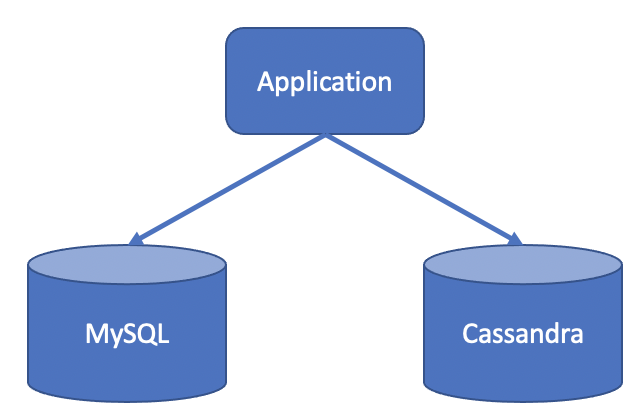
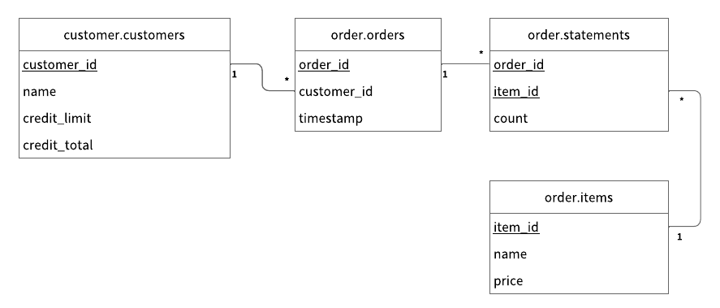

# Create a Sample Application That Supports Multi-Storage Transactions

This tutorial describes how to create a sample application that supports the multi-storage transactions feature in ScalarDB.

## Overview

The sample e-commerce application shows how users can order and pay for items by using a line of credit. The use case described in this tutorial is the same as the basic [ScalarDB sample](../scalardb-sample/README.md) but takes advantage of the [multi-storage transactions](https://github.com/scalar-labs/scalardb/blob/master/docs/multi-storage-transactions.md) feature in ScalarDB.

In this tutorial, you will build an application that uses both Cassandra and MySQL. By using the multi-storage transactions feature in ScalarDB, you can execute a transaction that spans both Cassandra and MySQL.



:::note

Since the focus of the sample application is to demonstrate using ScalarDB, application-specific error handling, authentication processing, and similar functions are not included in the sample application. For details about exception handling in ScalarDB, see [How to handle exceptions](https://github.com/scalar-labs/scalardb/blob/master/docs/api-guide.md#how-to-handle-exceptions).

:::

### What you can do in this sample application

The sample application supports the following types of transactions:

- Get customer information.
- Place an order by using a line of credit.
  - Checks if the cost of the order is below the customer's credit limit.
  - If the check passes, records the order history and updates the amount the customer has spent.
- Get order information by order ID.
- Get order information by customer ID.
- Make a payment.
  - Reduces the amount the customer has spent.

## Prerequisites

- One of the following Java Development Kits (JDKs):
  - [Oracle JDK](https://www.oracle.com/java/technologies/downloads/) LTS version (8, 11, or 17)
  - [OpenJDK](https://openjdk.org/install/) LTS version (8, 11, or 17)
- [Docker](https://www.docker.com/get-started/) 20.10 or later with [Docker Compose](https://docs.docker.com/compose/install/) V2 or later

:::note

We recommend using the LTS versions mentioned above, but other non-LTS versions may work.

In addition, other JDKs should work with ScalarDB, but we haven't tested them.

:::

## Set up ScalarDB

The following sections describe how to set up the sample application that supports the multi-storage transactions feature in ScalarDB.

### Clone the ScalarDB samples repository

Open **Terminal**, then clone the ScalarDB samples repository by running the following command:

```console
$ git clone https://github.com/scalar-labs/scalardb-samples
```

Then, go to the directory that contains the sample application by running the following command:

```console
$ cd scalardb-samples/multi-storage-transaction-sample
```

### Start Cassandra and MySQL

Cassandra and MySQL are already configured for the sample application, as shown in [`database.properties`](database.properties). For details about configuring the multi-storage transactions feature in ScalarDB, see [How to configure ScalarDB to support multi-storage transactions](https://github.com/scalar-labs/scalardb/blob/master/docs/multi-storage-transactions.md#how-to-configure-scalardb-to-support-multi-storage-transactions).

To start Cassandra and MySQL, which are included in the Docker container for the sample application, make sure Docker is running and then run the following command:

```console
$ docker-compose up -d
```

:::note

Starting the Docker container may take more than one minute depending on your development environment.

:::

### Load the schema

The database schema (the method in which the data will be organized) for the sample application has already been defined in [`schema.json`](schema.json).

To apply the schema, go to the [ScalarDB Releases](https://github.com/scalar-labs/scalardb/releases) page and download the ScalarDB Schema Loader that matches the version of ScalarDB that you want to use to the `scalardb-samples/multi-storage-transaction-sample` folder.

Then, run the following command, replacing `<VERSION>` with the version of the ScalarDB Schema Loader that you downloaded:

```console
$ java -jar scalardb-schema-loader-<VERSION>.jar --config database.properties --schema-file schema.json --coordinator
```

#### Schema details

As shown in [`schema.json`](schema.json) for the sample application, all the tables are created in the `customer` and `order` namespaces.

- `customer.customers`: a table that manages customers' information
  - `credit_limit`: the maximum amount of money a lender will allow each customer to spend when using a line of credit
  - `credit_total`: the amount of money that each customer has already spent by using their line of credit
- `order.orders`: a table that manages order information
- `order.statements`: a table that manages order statement information
- `order.items`: a table that manages information of items to be ordered

The Entity Relationship Diagram for the schema is as follows:



### Load the initial data

After the Docker container has started, load the initial data by running the following command:

```console
$ ./gradlew run --args="LoadInitialData"
```

After the initial data has loaded, the following records should be stored in the tables.

**`customer.customers` table**

| customer_id | name          | credit_limit | credit_total |
|-------------|---------------|--------------|--------------|
| 1           | Yamada Taro   | 10000        | 0            |
| 2           | Yamada Hanako | 10000        | 0            |
| 3           | Suzuki Ichiro | 10000        | 0            |

**`order.items` table**

| item_id | name   | price |
|---------|--------|-------|
| 1       | Apple  | 1000  |
| 2       | Orange | 2000  |
| 3       | Grape  | 2500  |
| 4       | Mango  | 5000  |
| 5       | Melon  | 3000  |

## Execute transactions and retrieve data in the sample application

The following sections describe how to execute transactions and retrieve data in the sample e-commerce application.

### Get customer information

Start with getting information about the customer whose ID is `1` by running the following command:

```console
$ ./gradlew run --args="GetCustomerInfo 1"
```

You should see the following output:

```console
...
{"id": 1, "name": "Yamada Taro", "credit_limit": 10000, "credit_total": 0}
...
```

### Place an order

Then, have customer ID `1` place an order for three apples and two oranges by running the following command:

:::note

The order format in this command is `./gradlew run --args="PlaceOrder <CUSTOMER_ID> <ITEM_ID>:<COUNT>,<ITEM_ID>:<COUNT>,..."`.

:::

```console
$ ./gradlew run --args="PlaceOrder 1 1:3,2:2"
```

You should see a similar output as below, with a different UUID for `order_id`, which confirms that the order was successful:

```console
...
{"order_id": "dea4964a-ff50-4ecf-9201-027981a1566e"}
...
```

### Check order details

Check details about the order by running the following command, replacing `<ORDER_ID_UUID>` with the UUID for the `order_id` that was shown after running the previous command:

```console
$ ./gradlew run --args="GetOrder <ORDER_ID_UUID>"
```

You should see a similar output as below, with different UUIDs for `order_id` and `timestamp`:

```console
...
{"order": {"order_id": "dea4964a-ff50-4ecf-9201-027981a1566e","timestamp": 1650948340914,"customer_id": 1,"customer_name": "Yamada Taro","statement": [{"item_id": 1,"item_name": "Apple","price": 1000,"count": 3,"total": 3000},{"item_id": 2,"item_name": "Orange","price": 2000,"count": 2,"total": 4000}],"total": 7000}}
...
```

### Place another order

Place an order for one melon that uses the remaining amount in `credit_total` for customer ID `1` by running the following command:

```console
$ ./gradlew run --args="PlaceOrder 1 5:1"
```

You should see a similar output as below, with a different UUID for `order_id`, which confirms that the order was successful:

```console
...
{"order_id": "bcc34150-91fa-4bea-83db-d2dbe6f0f30d"}
...
```

### Check order history

Get the history of all orders for customer ID `1` by running the following command:

```console
$ ./gradlew run --args="GetOrders 1"
```

You should see a similar output as below, with different UUIDs for `order_id` and `timestamp`, which shows the history of all orders for customer ID `1` in descending order by timestamp:

```console
...
{"order": [{"order_id": "dea4964a-ff50-4ecf-9201-027981a1566e","timestamp": 1650948340914,"customer_id": 1,"customer_name": "Yamada Taro","statement": [{"item_id": 1,"item_name": "Apple","price": 1000,"count": 3,"total": 3000},{"item_id": 2,"item_name": "Orange","price": 2000,"count": 2,"total": 4000}],"total": 7000},{"order_id": "bcc34150-91fa-4bea-83db-d2dbe6f0f30d","timestamp": 1650948412766,"customer_id": 1,"customer_name": "Yamada Taro","statement": [{"item_id": 5,"item_name": "Melon","price": 3000,"count": 1,"total": 3000}],"total": 3000}]}
...
```

### Check credit total

Get the credit total for customer ID `1` by running the following command:

```console
$ ./gradlew run --args="GetCustomerInfo 1"
```

You should see the following output, which shows that customer ID `1` has reached their `credit_limit` in `credit_total` and cannot place anymore orders:

```console
...
{"id": 1, "name": "Yamada Taro", "credit_limit": 10000, "credit_total": 10000}
...
```

Try to place an order for one grape and one mango by running the following command:

```console
$ ./gradlew run --args="PlaceOrder 1 3:1,4:1"
```

You should see the following output, which shows that the order failed because the `credit_total` amount would exceed the `credit_limit` amount:

```console
...
java.lang.RuntimeException: Credit limit exceeded
        at sample.Sample.placeOrder(Sample.java:205)
        at sample.command.PlaceOrderCommand.call(PlaceOrderCommand.java:33)
        at sample.command.PlaceOrderCommand.call(PlaceOrderCommand.java:8)
        at picocli.CommandLine.executeUserObject(CommandLine.java:1783)
        at picocli.CommandLine.access$900(CommandLine.java:145)
        at picocli.CommandLine$RunLast.handle(CommandLine.java:2141)
        at picocli.CommandLine$RunLast.handle(CommandLine.java:2108)
        at picocli.CommandLine$AbstractParseResultHandler.execute(CommandLine.java:1975)
        at picocli.CommandLine.execute(CommandLine.java:1904)
        at sample.command.SampleCommand.main(SampleCommand.java:35)
...
```

### Make a payment

To continue making orders, customer ID `1` must make a payment to reduce the `credit_total` amount.

Make a payment by running the following command:

```console
$ ./gradlew run --args="Repayment 1 8000"
```

Then, check the `credit_total` amount for customer ID `1` by running the following command:

```console
$ ./gradlew run --args="GetCustomerInfo 1"
```

You should see the following output, which shows that a payment was applied to customer ID `1`, reducing the `credit_total` amount:

```console
...
{"id": 1, "name": "Yamada Taro", "credit_limit": 10000, "credit_total": 2000}
...
```

Now that customer ID `1` has made a payment, place an order for one grape and one melon by running the following command:

```console
$ ./gradlew run --args="PlaceOrder 1 3:1,4:1"
```

You should see a similar output as below, with a different UUID for `order_id`, which confirms that the order was successful:

```console
...
{"order_id": "8911cab3-1c2b-4322-9386-adb1c024e078"}
...
```

## Stop the sample application

To stop the sample application, stop the Docker container by running the following command:

```console
$ docker-compose down
```
