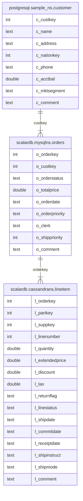

---
tags:
  - Enterprise Option
displayed_sidebar: docsEnglish
---

# Getting Started with ScalarDB Analytics

import WarningLicenseKeyContact from '/src/components/en-us/_warning-license-key-contact.mdx';

This tutorial describes how to run analytical queries on sample data by using ScalarDB Analytics. The source code is available at [https://github.com/scalar-labs/scalardb-samples/tree/main/scalardb-analytics-spark-sample](https://github.com/scalar-labs/scalardb-samples/tree/main/scalardb-analytics-spark-sample).

ScalarDB Analytics in its current version leverages Apache Spark as its execution engine. It provides a unified view of ScalarDB-managed and non-ScalarDB-managed data sources by using a Spark custom catalog. By using ScalarDB Analytics, you can treat tables from these data sources as native Spark tables. This allows you to execute arbitrary Spark SQL queries seamlessly. For example, you can join a table stored in Cassandra with a table in PostgreSQL to perform cross-database analysis with ease.

## Overview of the sample application

This sample tutorial demonstrates how to configure Spark to enable ScalarDB Analytics and perform interactive analyses using `spark-sql` on tables provided by ScalarDB Analytics.

## Prerequisites for this sample application

- [Docker](https://www.docker.com/get-started/) 20.10 or later with [Docker Compose](https://docs.docker.com/compose/install/) V2 or later

<WarningLicenseKeyContact product="ScalarDB Analytics" />

## Step 1: Set up ScalarDB Analytics

### Clone the ScalarDB samples repository

Open **Terminal**, and clone the ScalarDB samples repository by running the following command:

```console
git clone https://github.com/scalar-labs/scalardb-samples
```

Then, go to the directory that contains the sample application by running the following command:

```console
cd scalardb-samples/scalardb-analytics-spark-sample
```

### Set your license information

ScalarDB Analytics requires valid license information to be specified in the Spark configuration. You can provide your license details in the **spark-defaults.conf** file.


Open the **spark-defaults.conf** file located in the **conf** directory of your Spark installation. Then, replace `<REPLACE_THIS_WITH_YOUR_LICENSE>` with your license key and `<REPLACE_THIS_WITH_YOUR_LICENSE_CERTIFICATE_PEM_CONTENTS>` with the PEM-encoded contents of your license certificate.

```console
spark.sql.catalog.test_catalog.license.key <REPLACE_THIS_WITH_YOUR_LICENSE>
spark.sql.catalog.test_catalog.license.cert_pem <REPLACE_THIS_WITH_YOUR_LICENSE_CERTIFICATE_PEM_CONTENTS>
```

For additional configuration details required in the **spark-defaults.conf** file for setting up ScalarDB Analytics, refer to [ScalarDB Analytics configuration](#scalardb-analytics-configuration).

## Step 2: Set up the sample databases

To set up the sample databases, run the following command:

```console
docker compose up -d --wait
```

This command starts three services locally: PostgreSQL, Cassandra, and MySQL.

- **PostgreSQL:** Used independently (non-ScalarDB-managed).
- **Cassandra and MySQL:** Used as backend databases for ScalarDB (ScalarDB-managed).

In this guide, PostgreSQL is referred to as a **non-ScalarDB-managed database**, which is not managed by ScalarDB transactions, while Cassandra and DynamoDB are referred to as **ScalarDB-managed databases**, which are managed by ScalarDB transactions.

For non-ScalarDB-managed databases, sample data is automatically loaded when the Docker container is initialized, so no additional steps are required. For ScalarDB-managed databases, run the following command to load the sample data after starting the containers:

```console
docker compose run --rm sample-data-loader
```

After completing the setup, the following tables should be available:

- In PostgreSQL:
    - `sample_ns.customer`
- In ScalarDB (backed by Cassandra):
    - `cassandrans.lineitem`
- In ScalarDB (backed by MySQL):
    - `mysqlns.order`

According to the above, within ScalarDB, `cassandrans` and `mysqlns` are mapped to Cassandra and MySQL, respectively.

For details about the table schema, including column definitions and data types, refer to [Schema details](#schema-details). Ensure that the sample data has been successfully loaded into these tables.

## Step 3: Launch the Spark SQL console

To launch the Spark SQL console, run the following command:

```console
docker compose run --rm spark-sql
```

While launching the Spark SQL console, the ScalarDB Analytics catalog is initialized with the configuration in **spark-defaults.conf** and is registered as a Spark catalog named `test_catalog`.

### Namespace mapping

The following tables in the configured data sources are mapped to Spark SQL tables, allowing seamless querying across different data sources:

- For PostgreSQL:
    - `test_catalog.postgresql.sample_ns.customer`
- For ScalarDB (backed by Cassandra):
    - `test_catalog.scalardb.cassandrans.lineitem`
- For ScalarDB (backed by MySQL):
    - `test_catalog.scalardb.mysqlns.orders`

For more details about how tables are mapped to Spark SQL tables, refer to [Namespace-mapping details](#namespace-mapping-details).

Additionally, ScalarDB Analytics offers WAL-interpreted views for ScalarDB tables, simplifying common use cases. In this sample application, you have the following WAL-interpreted views available:

- For ScalarDB (backed by Cassandra):
    - `test_catalog.view.scalardb.cassandrans.lineitem`
- For ScalarDB (backed by MySQL):
    - `test_catalog.view.scalardb.mysqlns.orders`

In most cases, WAL-interpreted views are preferred over raw tables. In this tutorial, we will use the WAL-interpreted views for the ScalarDB tables. For detailed information on WAL-interpreted views, including their use cases and benefits, see [WAL-interpreted views for ScalarDB tables](#wal-interpreted-views-for-scalardb-tables).

## Step 4: Run analytical queries

Now, everything is set up, and you can run analytical queries on the sample data using the Spark SQL console.

### Read data and calculate summaries

You can run the following query to retrieve data from `test_catalog.scalardb.cassandrans.lineitem` in Cassandra and calculate aggregated metrics, including total quantity, average price, and total revenue for line items grouped by their return flag and line status.

```sql
SELECT
        l_returnflag,
        l_linestatus,
        sum(l_quantity) AS sum_qty,
        sum(l_extendedprice) AS sum_base_price,
        sum(l_extendedprice * (1 - l_discount)) AS sum_disc_price,
        sum(l_extendedprice * (1 - l_discount) * (1 + l_tax)) AS sum_charge,
        avg(l_quantity) AS avg_qty,
        avg(l_extendedprice) AS avg_price,
        avg(l_discount) AS avg_disc,
        count(*) AS count_order
FROM
        test_catalog.view.scalardb.cassandrans.lineitem
WHERE
        to_date(l_shipdate, 'yyyy-MM-dd') <= date '1998-12-01' - 3
GROUP BY
        l_returnflag,
        l_linestatus
ORDER BY
        l_returnflag,
        l_linestatus;
```

You should see the following output:

```console
A       F       1519    2374824.6560278563      1387364.2207725341      1962763.4654265852      26.649122807017545      41663.590456629056      0.41501802923479575    57
N       F       98      146371.2295412012       85593.96776336085       121041.55837332775      32.666666666666664      48790.409847067065      0.40984706454007996    3
N       O       5374    8007373.247086477       4685647.785126835       6624210.945739046       24.427272727272726      36397.15112312035       0.4147594809559689     220
R       F       1461    2190869.9676265526      1284178.4378283697      1814151.2807494882      25.189655172413794      37773.62013149229       0.41323493790730753    58
```

### Join tables that span multiple data sources

You can also run the following query to join tables from multiple data sources, including both ScalarDB-managed and non-ScalarDB-managed tables. This query joins customer, order, and line item data from PostgreSQL, MySQL, and Cassandra, identifying the top unshipped orders with the highest revenue on a specific date. This analysis helps prioritize shipments for maximum financial impact.

```sql
SELECT
    l_orderkey,
    sum(l_extendedprice * (1 - l_discount)) AS revenue,
    o_orderdate,
    o_shippriority
FROM
    test_catalog.postgresql.sample_ns.customer,
    test_catalog.scalardb.mysqlns.orders,
    test_catalog.scalardb.cassandrans.lineitem
WHERE
    c_mktsegment = 'AUTOMOBILE'
    AND c_custkey = o_custkey
    AND l_orderkey = o_orderkey
    AND o_orderdate < '1995-03-15'
    AND l_shipdate > '1995-03-15'
GROUP BY
    l_orderkey,
    o_orderdate,
    o_shippriority
ORDER BY
    revenue DESC,
    o_orderdate,
    l_orderkey
LIMIT 10;
```

You should see the following output:

```console
1071617 128186.99915996166      1995-03-10      0
1959075 33104.51278645416       1994-12-23      0
430243  19476.115819260962      1994-12-24      0
```

:::note

You can also run any arbitrary query that Apache Spark and Spark SQL support on the imported tables in this sample tutorial. Since ScalarDB Analytics supports all queries that Spark SQL supports, you can do not only selections (filtering), joins, aggregations, and ordering, as shown in the example, but also window functions, lateral joins, and other various operations.

To see which types of queries Spark SQL supports, see the [Spark SQL documentation](https://spark.apache.org/docs/latest/sql-ref.html).

:::

## Step 5: Stop the sample application

To stop the sample application and remove all associated volumes, run the following command. This action shuts down all services and deletes any persisted data stored in the volumes, resetting the application state:

```console
docker compose down -v
```

## Reference

This section contains other details related to ScalarDB Analytics, like configurations and schema details.

### ScalarDB Analytics configuration

You can configure ScalarDB Analytics in the Spark configuration, such as in the `spark-defaults.conf` file. This section contains brief explanations of the configurations for ScalarDB Analytics in this sample application.

#### Common configurations

The following are common configurations for ScalarDB Analytics:

```console
spark.sql.catalog.test_catalog com.scalar.db.analytics.spark.ScalarDbAnalyticsCatalog
spark.sql.extensions com.scalar.db.analytics.spark.extension.ScalarDbAnalyticsExtensions
```

The first line specifies the Spark catalog plugin implementation class. You must always set this to `com.scalar.db.analytics.spark.ScalarDbAnalyticsCatalog` to enable the ScalarDB Analytics catalog in Spark SQL.

:::note

You can set an arbitrary string as the catalog name, which is `test_catalog` in this example. The configured catalog name will be used as a part of the table identifier in the Spark SQL query.

:::

The second line specifies the Spark SQL extension implementation class. You must always set this to `com.scalar.db.analytics.spark.extension.ScalarDbAnalyticsExtensions`, along with the `spark.sql.catalog.test_catalog` configuration, mentioned above.

#### License information

The following are the license configurations for ScalarDB Analytics:

```apacheconf
spark.sql.catalog.test_catalog.license.key <REPLACE_THIS_WITH_YOUR_LICENSE>
spark.sql.catalog.test_catalog.license.cert_pem <REPLACE_THIS_WITH_YOUR_LICENSE_CERTIFICATE_PEM_CONTENTS>
```

These lines provide the license information for ScalarDB Analytics. As explained above, you must replace the placeholders with your license information before launching the Spark SQL console.

#### Data source configurations for ScalarDB-managed databases

The following are the data source configurations for ScalarDB-managed databases for ScalarDB Analytics:

```apacheconf
spark.sql.catalog.test_catalog.data_source.scalardb.type scalardb
spark.sql.catalog.test_catalog.data_source.scalardb.config_path /etc/scalardb.properties
```

The first line specifies the data source type. You must always set this to `scalardb` to configure the data source for ScalarDB-managed databases. The second line specifies the path to the configuration file for the ScalarDB data source, which is the only required configuration for the ScalarDB data source.

:::note

You can set an arbitrary string as the data source name, which is `scalardb` in this example. The configured data source names will be used as a part of the table identifier in the Spark SQL query.

:::

#### Data source configurations for non-ScalarDB-managed databases

The following are the data source configurations for non-ScalarDB-managed databases for ScalarDB Analytics:

```apacheconf
spark.sql.catalog.test_catalog.data_source.postgresql.type postgresql
spark.sql.catalog.test_catalog.data_source.postgresql.host postgres
spark.sql.catalog.test_catalog.data_source.postgresql.port 5432
spark.sql.catalog.test_catalog.data_source.postgresql.username postgres
spark.sql.catalog.test_catalog.data_source.postgresql.password postgres
spark.sql.catalog.test_catalog.data_source.postgresql.database sampledb
```

These lines configure the data source PostgreSQL as a non-ScalarDB-managed database. The first line specifies the data source type, and the rest of the lines specify the data source-specific configurations, which is the connection information for the PostgreSQL data source. The data source–specific configurations may vary depending on the data source type.

:::note

You can set an arbitrary string as the data source name, which is `postgresql` in this example, in the same way as the ScalarDB data source.

:::

### Schema details

The following entity relationship diagram illustrates the relationships between the tables across PostgreSQL, MySQL, and Cassandra, with foreign keys linking customers, orders, and line items.



- `postgresql.sample_ns.customer` comes from PostgreSQL, which is not managed by ScalarDB.
- `scalardb.mysqlns.orders` and `scalardb.cassandrans.lineitem` come from ScalarDB, which are backed by MySQL and Cassandra, respectively.

The following are brief descriptions of the tables:

- **`postgresql.sample_ns.customer`.** A table that represents information about customers. This table includes attributes like customer key, name, address, phone number, and account balance.
- **`scalardb.mysqlns.orders`.** A table that contains information about orders that customers have placed. This table includes attributes like order key, customer key, order status, order date, and order priority.
- **`scalardb.cassandrans.lineitem`.** A table that represents line items associated with orders. This table includes attributes such as order key, part key, supplier key, quantity, price, and shipping date.

### Namespace-mapping details

The tables of each configured data source are mapped to the Spark SQL identifier by using the following format:

```console
<CATALOG_NAME>.<DATA_SOURCE_NAME>.<NAMESPACE_NAME>.<TABLE_NAME>`.
```

The following explains each part of the table identifier:

- **`<CATALOG_NAME>`.** The catalog name configured in spark-defaults.conf. This identifies the ScalarDB Analytics catalog in Spark SQL.
- **`<DATA_SOURCE_NAME>`.** The data source name configured in spark-defaults.conf, representing the specific type of data source, such as postgresql or scalardb.
- **`<NAMESPACE_NAME>`.** The namespace name in the data source. For example:
    - In an RDBMS like PostgreSQL or MySQL, this corresponds to the schema.
    - In NoSQL databases like Cassandra, this may refer to a keyspace.
- **`<TABLE_NAME>`.** The name of the table in the namespace.

In this example, the following tables are available:

- For PostgreSQL:
    - test_catalog.postgresql.sample_ns.customer
- For ScalarDB (backed by Cassandra):
    - test_catalog.scalardb.cassandrans.lineitem
- For ScalarDB (backed by MySQL):
    - test_catalog.scalardb.mysqlns.orders

This mapping allows you to access and query tables from different data sources seamlessly by using Spark SQL.

### WAL-interpreted views for ScalarDB tables

ScalarDB tables that are transaction-enabled include transaction metadata columns in the raw tables stored in the underlying data sources. Since ScalarDB Analytics maps these raw tables directly to Spark SQL tables, you will see transaction metadata columns when describing these tables in Spark SQL. You can see these columns by running the following command:

```sql
DESCRIBE test_catalog.scalardb.mysqlns.orders;
```

You should see the following output:

```console
o_orderkey              int
o_custkey               int
o_orderstatus           string
o_totalprice            double
o_orderdate             string
o_orderpriority         string
o_clerk                 string
o_shippriority          int
o_comment               string
tx_id                   string
tx_state                int
tx_version              int
tx_prepared_at          bigint
tx_committed_at         bigint
before_tx_id            string
before_tx_state         int
before_tx_version       int
before_tx_prepared_at   bigint
before_tx_committed_at  bigint
before_o_orderstatus    string
before_o_clerk          string
before_o_orderdate      string
before_o_shippriority   int
before_o_custkey        int
before_o_totalprice     double
before_o_comment        string
before_o_orderpriority  string
```

In many cases, you may not need the transaction metadata columns in your queries. To simplify this, ScalarDB Analytics provides WAL-interpreted views. WAL-interpreted views hide transaction metadata columns and expose only user-defined columns, simplifying queries. For example, use WAL-interpreted views when performing read-only analytics or when transaction metadata is not needed for analysis. Additionally, WAL-interpreted views guarantee read-committed consistency by interpreting the transaction metadata columns internally.

#### WAL-interpreted view naming convention in Spark SQL

WAL-interpreted views are prefixed with `view.` before the data source part of the table identifier. For example, the following WAL-interpreted views are available for ScalarDB tables:

- For ScalarDB (backed by Cassandra):
    - test_catalog.view.scalardb.cassandrans.lineitem
- For ScalarDB (backed by MySQL):
    - test_catalog.view.scalardb.mysqlns.orders

For example, to see the WAL-interpreted view for the ScalarDB table backed by Cassandra, run the following command:

```sql
DESCRIBE test_catalog.view.scalardb.cassandrans.lineitem;
```

You should see the following output:

```console
l_orderkey              int
l_linenumber            int
l_comment               string
l_commitdate            string
l_discount              double
l_extendedprice         double
l_linestatus            string
l_partkey               int
l_quantity              int
l_receiptdate           string
l_returnflag            string
l_shipdate              string
l_shipinstruct          string
l_shipmode              string
l_suppkey               int
l_tax                   double
```
