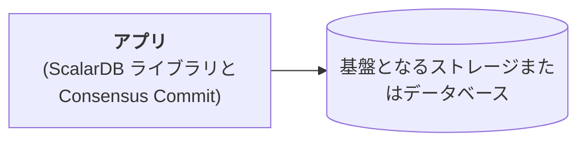

---
tags:
  - Community
  - Enterprise Standard
  - Enterprise Premium
displayed_sidebar: docsJapanese
---

# ScalarDB Core の設定

import Tabs from '@theme/Tabs';
import TabItem from '@theme/TabItem';
import TranslationBanner from '/src/components/_translation-ja-jp.mdx';

<TranslationBanner />

このページでは、ScalarDB Core で使用可能な設定について説明します。

:::tip

ScalarDB Cluster を使用している場合は、代わりに [ScalarDB Cluster の設定](./scalardb-cluster/scalardb-cluster-configurations.mdx)を参照してください。

:::

## 一般的な設定

ScalarDB トランザクションマネージャーでは、次の一般的な設定が利用可能です。

### `transaction_manager`

- **フィールド:** `scalar.db.transaction_manager`
- **説明:** ScalarDB のトランザクションマネージャー。[Consensus Commit](./consensus-commit.mdx) を使用するには `consensus-commit` を指定し、[非トランザクションストレージ操作を実行する](./run-non-transactional-storage-operations-through-library.mdx) には `single-crud-operation` を指定します。`single-crud-operation` を使用する場合、`scalar.db.consensus_commit` プレフィックスの下の設定は無視されることに注意してください。
- **デフォルト値:** `consensus-commit`

### `isolation_level`

- **フィールド:** `scalar.db.consensus_commit.isolation_level`
- **説明:** Consensus Commit に使用される分離レベル。`SNAPSHOT`、`SERIALIZABLE` または `READ_COMMITTED` のいずれかを指定できます。
- **デフォルト値:** `SNAPSHOT`

### `coordinator.namespace`

- **フィールド:** `scalar.db.consensus_commit.coordinator.namespace`
- **説明:** Consensus Commit に使用される Coordinator テーブルの名前空間名。
- **デフォルト値:** `coordinator`

## パフォーマンス関連の設定

Consensus Commit トランザクションマネージャーでは、次のパフォーマンス関連の設定が利用できます。

### `parallel_executor_count`

- **フィールド:** `scalar.db.consensus_commit.parallel_executor_count`
- **説明:** 並列実行のためのエグゼキュータ (スレッド) の数。この数値は、ScalarDB Cluster ノード内または ScalarDB Core プロセス内のトランザクション全体のスレッド数の合計を示します。
- **デフォルト値:** `128`

### `parallel_preparation.enabled`

- **フィールド:** `scalar.db.consensus_commit.parallel_preparation.enabled`
- **説明:** 準備フェーズが並行して実行されるかどうか。
- **デフォルト値:** `true`

### `parallel_validation.enabled`

- **フィールド:** `scalar.db.consensus_commit.parallel_validation.enabled`
- **説明:** 検証フェーズ (`EXTRA_READ` 内) が並列で実行されるかどうか。
- **デフォルト値:** `scalar.db.consensus_commit.parallel_commit.enabled` の値

### `parallel_commit.enabled`

- **フィールド:** `scalar.db.consensus_commit.parallel_commit.enabled`
- **説明:** コミットフェーズが並列で実行されるかどうか。
- **デフォルト値:** `true`

### `parallel_rollback.enabled`

- **フィールド:** `scalar.db.consensus_commit.parallel_rollback.enabled`
- **説明:** ロールバックフェーズが並列で実行されるかどうか。
- **デフォルト値:** `scalar.db.consensus_commit.parallel_commit.enabled` の値

### `async_commit.enabled`

- **フィールド:** `scalar.db.consensus_commit.async_commit.enabled`
- **説明:** コミットフェーズが非同期で実行されるかどうか。
- **デフォルト値:** `false`

### `async_rollback.enabled`

- **フィールド:** `scalar.db.consensus_commit.async_rollback.enabled`
- **説明:** ロールバックフェーズが非同期に実行されるかどうか。
- **デフォルト値:** `scalar.db.consensus_commit.async_commit.enabled` の値

### `parallel_implicit_pre_read.enabled`

- **フィールド:** `scalar.db.consensus_commit.parallel_implicit_pre_read.enabled`
- **説明:** 暗黙的な事前読み取りが並列で実行されるかどうか。
- **デフォルト値:** `true`

### `one_phase_commit.enabled`

- **フィールド:** `scalar.db.consensus_commit.one_phase_commit.enabled`
- **説明:** 1フェーズコミット最適化が有効かどうか。
- **デフォルト値:** `false`

### `coordinator.write_omission_on_read_only.enabled`

- **フィールド:** `scalar.db.consensus_commit.coordinator.write_omission_on_read_only.enabled`
- **説明:** 読み取り専用トランザクションに対して Coordinator テーブルへの書き込み省略最適化を有効にするかどうか。この最適化は、データを変更しない読み取り専用トランザクションに有効であり、Coordinator テーブルへの不要な書き込みを回避します。
- **デフォルト値:** `true`

### `coordinator.group_commit.enabled`

- **フィールド:** `scalar.db.consensus_commit.coordinator.group_commit.enabled`
- **説明:** トランザクション状態のコミットがバッチモードで実行されるかどうか。この機能は、2フェーズコミットインターフェースでは使用できません。
- **デフォルト値:** `false`

### `coordinator.group_commit.slot_capacity`

- **フィールド:** `scalar.db.consensus_commit.coordinator.group_commit.slot_capacity`
- **説明:** グループコミット機能のグループ内のスロットの最大数。値が大きいとグループコミットの効率は向上しますが、待ち時間が増加し、トランザクションの競合が発生する可能性も高くなります。[^1]
- **デフォルト値:** `20`

### `coordinator.group_commit.group_size_fix_timeout_millis`

- **フィールド:** `scalar.db.consensus_commit.coordinator.group_commit.group_size_fix_timeout_millis`
- **説明:** グループ内のスロットのサイズを固定するためのタイムアウト。値が大きいとグループコミットの効率が向上しますが、待ち時間が増加し、トランザクションの競合が発生する可能性も高くなります。[^1]
- **デフォルト値:** `40`

### `coordinator.group_commit.delayed_slot_move_timeout_millis`

- **フィールド:** `scalar.db.consensus_commit.coordinator.group_commit.delayed_slot_move_timeout_millis`
- **説明:** 遅延スロットをグループから別の分離グループに移動して、元のグループが遅延トランザクションの影響を受けないようにするためのタイムアウト。値が大きいとグループコミットの効率が向上しますが、待ち時間が増加し、トランザクションの競合が発生する可能性も高くなります。[^1]
- **デフォルト値:** `1200`

### `coordinator.group_commit.old_group_abort_timeout_millis`

- **フィールド:** `scalar.db.consensus_commit.coordinator.group_commit.old_group_abort_timeout_millis`
- **説明:** 進行中の古いグループをアボートするためのタイムアウト。値が小さいと、積極的なアボートによってリソースの消費量が減りますが、長時間実行されるトランザクションで不要なアボートが発生する可能性も高くなります。
- **デフォルト値:** `60000`

### `coordinator.group_commit.timeout_check_interval_millis`

- **フィールド:** `scalar.db.consensus_commit.coordinator.group_commit.timeout_check_interval_millis`
- **説明:** グループコミット関連のタイムアウトをチェックする間隔。
- **デフォルト値:** `20`

### `coordinator.group_commit.metrics_monitor_log_enabled`

- **フィールド:** `scalar.db.consensus_commit.coordinator.group_commit.metrics_monitor_log_enabled`
- **説明:** グループコミットのメトリックが定期的にログに記録されるかどうか。
- **デフォルト値:** `false`

## ストレージ関連の設定

ScalarDB には、複数のストレージ実装をサポートするストレージ (データベース) 抽象化レイヤーがあります。`scalar.db.storage` プロパティを使用してストレージ実装を指定できます。

:::note

複数のストレージの使用の詳細については、[マルチストレージ設定](#マルチストレージ設定)を参照してください。

:::

データベースを選択して、各ストレージで使用可能な設定を確認します。

<Tabs groupId="databases" queryString>
  <TabItem value="JDBC_databases" label="JDBC データベース" default>
    JDBC データベースでは次の設定を使用できます。

    <h4>`storage`</h4>

    - **フィールド:** `scalar.db.storage`
    - **説明:** `jdbc` を指定する必要があります。
    - **デフォルト値:** empty

    <h4>`contact_points`</h4>

    - **フィールド:** `scalar.db.contact_points`
    - **説明:** JDBC 接続 URL。
    - **デフォルト値:** empty

    <h4>`username`</h4>

    - **フィールド:** `scalar.db.username`
    - **説明:** データベースにアクセスするためのユーザー名。
    - **デフォルト値:** empty

    <h4>`password`</h4>

    - **フィールド:** `scalar.db.password`
    - **説明:** データベースにアクセスするためのパスワード。
    - **デフォルト値:** empty

    <h4>`jdbc.connection_pool.min_idle`</h4>

    - **フィールド:** `scalar.db.jdbc.connection_pool.min_idle`
    - **説明:** コネクションプール内のアイドルコネクションの最小数。
    - **デフォルト値:** `20`

    <h4>`jdbc.connection_pool.max_idle`</h4>

    - **フィールド:** `scalar.db.jdbc.connection_pool.max_idle`
    - **説明:** コネクションプール内でアイドル状態のままにできるコネクションの最大数。
    - **デフォルト値:** `50`

    <h4>`jdbc.connection_pool.max_total`</h4>

    - **フィールド:** `scalar.db.jdbc.connection_pool.max_total`
    - **説明:** コネクションプールで同時にアクティブにできるアイドルコネクションと利用中接続の最大合計数。制限がない場合は負の値を使用します。
    - **デフォルト値:** `200`

    <h4>`jdbc.prepared_statements_pool.enabled`</h4>

    - **フィールド:** `scalar.db.jdbc.prepared_statements_pool.enabled`
    - **説明:** このプロパティを `true` に設定すると、準備済みステートメントプーリングが有効になります。
    - **デフォルト値:** `false`

    <h4>`jdbc.prepared_statements_pool.max_open`</h4>

    - **フィールド:** `scalar.db.jdbc.prepared_statements_pool.max_open`
    - **説明:** ステートメントプールから同時に割り当てることができるオープンステートメントの最大数。制限がない場合は負の値を使用します。
    - **デフォルト値:** `-1`

    <h4>`jdbc.isolation_level`</h4>

    - **フィールド:** `scalar.db.jdbc.isolation_level`
    - **説明:** JDBC の分離レベル。`READ_COMMITTED`、`REPEATABLE_READ`、または `SERIALIZABLE` を指定できます。
    - **デフォルト値:** 基盤データベース固有

    <h4>`jdbc.table_metadata.connection_pool.min_idle`</h4>

    - **フィールド:** `scalar.db.jdbc.table_metadata.connection_pool.min_idle`
    - **説明:** テーブルメタデータのコネクションプール内のアイドルコネクションの最小数。
    - **デフォルト値:** `5`

    <h4>`jdbc.table_metadata.connection_pool.max_idle`</h4>

    - **フィールド:** `scalar.db.jdbc.table_metadata.connection_pool.max_idle`
    - **説明:** テーブルメタデータのコネクションプール内でアイドル状態のままにできるコネクションの最大数。
    - **デフォルト値:** `10`

    <h4>`jdbc.table_metadata.connection_pool.max_total`</h4>

    - **フィールド:** `scalar.db.jdbc.table_metadata.connection_pool.max_total`
    - **説明:** テーブルメタデータのコネクションプールで同時にアクティブにできるアイドルコネクションと利用中接続の最大合計数。制限がない場合は負の値を使用します。
    - **デフォルト値:** `25`

    <h4>`jdbc.admin.connection_pool.min_idle`</h4>

    - **フィールド:** `scalar.db.jdbc.admin.connection_pool.min_idle`
    - **説明:** 管理者のコネクションプール内のアイドルコネクションの最小数。
    - **デフォルト値:** `5`

    <h4>`jdbc.admin.connection_pool.max_idle`</h4>

    - **フィールド:** `scalar.db.jdbc.admin.connection_pool.max_idle`
    - **説明:** 管理者のコネクションプール内でアイドル状態のままにできるコネクションの最大数。
    - **デフォルト値:** `10`

    <h4>`jdbc.admin.connection_pool.max_total`</h4>

    - **フィールド:** `scalar.db.jdbc.admin.connection_pool.max_total`
    - **説明:** 管理者のコネクションプールで同時にアクティブにできるアイドルコネクションと利用中接続の最大合計数。制限がない場合は負の値を使用します。
    - **デフォルト値:** `25`

    <h4>`jdbc.mysql.variable_key_column_size`</h4>

    - **フィールド:** `scalar.db.jdbc.mysql.variable_key_column_size`
    - **説明:** MySQL で主キーまたはセカンダリキーとして使用される場合の TEXT 列と BLOB 列の列サイズ。最小 64 バイト。
    - **デフォルト値:** `128`

    <h4>`jdbc.oracle.variable_key_column_size`</h4>

    - **フィールド:** `scalar.db.jdbc.oracle.variable_key_column_size`
    - **説明:** Oracle で主キーまたはセカンダリキーとして使用される場合の TEXT 列と BLOB 列の列サイズ。最小 64 バイト。
    - **デフォルト値:** `128`

    <h4>`jdbc.oracle.time_column.default_date_component`</h4>

    - **フィールド:** `scalar.db.jdbc.oracle.time_column.default_date_component`
    - **説明:** Oracle で `TIME` データを格納するために使用される日付コンポーネントの値。Oracle には日付コンポーネントなしで時間のみを格納するデータ型がないため、ScalarDB は比較と並べ替えを容易にするために、同じ日付コンポーネント値を持つ `TIME` データを保存します。
    - **デフォルト値:** `1970-01-01`

    <h4>`jdbc.db2.variable_key_column_size`</h4>

    - **フィールド:** `scalar.db.jdbc.db2.variable_key_column_size`
    - **説明:** IBM Db2 で主キーまたはセカンダリキーとして使用される場合の TEXT 列と BLOB 列の列サイズ。最小 64 バイト。
    - **デフォルト値:** `128`

    <h4>`jdbc.db2.time_column.default_date_component`</h4>

    - **フィールド:** `scalar.db.jdbc.db2.time_column.default_date_component`
    - **説明:** IBM Db2 で `TIME` データを格納するために使用される日付コンポーネントの値。ScalarDB の `TIME` 型データを格納するために IBM Db2 の TIMESTAMP 型が使用されるため (小数秒の精度を提供するため)、ScalarDB は比較と並べ替えを容易にするために、同じ日付コンポーネント値を持つ `TIME` データを保存します。
    - **デフォルト値:** `1970-01-01`

:::note

#### SQLite3

SQLite3 を JDBC データベースとして使用している場合は、`scalar.db.contact_points` を次のように設定する必要があります。

```properties
scalar.db.contact_points=jdbc:sqlite:<SQLITE_DB_FILE_PATH>?busy_timeout=10000
```

他の JDBC データベースとは異なり、[SQLite3 doesn't fully support concurrent access](https://www.sqlite.org/lang_transaction.html)。[`SQLITE_BUSY`](https://www.sqlite.org/rescode.html#busy) によって内部的に頻繁に発生するエラーを回避するには、[`busy_timeout`](https://www.sqlite.org/c3ref/busy_timeout.html) パラメータを設定することをお勧めします。

#### YugabyteDB

YugabyteDB を JDBC データベースとして使用している場合は、次のように `scalar.db.contact_points` で複数のエンドポイントを指定できます。

```properties
scalar.db.contact_points=jdbc:yugabytedb://127.0.0.1:5433\\,127.0.0.2:5433\\,127.0.0.3:5433/?load-balance=true
```

複数のエンドポイントはエスケープされたコンマで区切る必要があります。

YugabyteDB のスマートドライバーと負荷分散の詳細については、[YugabyteDB smart drivers for YSQL](https://docs.yugabyte.com/preview/drivers-orms/smart-drivers/) を参照してください。

**AlloyDB**

Google Cloud 上の AlloyDB を JDBC データベースとして使用し、[Java コネクタ](https://docs.cloud.google.com/alloydb/docs/connect-language-connectors#configure-connectors)で接続したい場合は、次のように `scalar.db.contact_points` で追加のプロパティを追加する必要があります：

```properties
scalar.db.contact_points=jdbc:postgresql:///<DATABASE_NAME>?socketFactory=com.google.cloud.alloydb.SocketFactory&alloydbInstanceName=<INSTANCE_NAME>&alloydbIpType=PUBLIC
```

:::

  </TabItem>
  <TabItem value="DynamoDB" label="DynamoDB">
    DynamoDB では次の設定が利用可能です。

    <h4>`storage`</h4>

    - **フィールド:** `scalar.db.storage`
    - **説明:** `dynamo` を指定する必要があります。
    - **デフォルト値:** empty

    <h4>`contact_points`</h4>

    - **フィールド:** `scalar.db.contact_points`
    - **説明:** ScalarDB が通信する AWS リージョン (例: `us-east-1`)。
    - **デフォルト値:** empty

    <h4>`username`</h4>

    - **フィールド:** `scalar.db.username`
    - **説明:** AWS とやり取りするユーザーを識別するために使用される AWS アクセスキー。
    - **デフォルト値:** empty

    <h4>`password`</h4>

    - **フィールド:** `scalar.db.password`
    - **説明:** AWS と対話するユーザーを認証するために使用される AWS シークレットアクセスキー。
    - **デフォルト値:** empty

    <h4>`dynamo.endpoint_override`</h4>

    - **フィールド:** `scalar.db.dynamo.endpoint_override`
    - **説明:** ScalarDB が通信する Amazon DynamoDB エンドポイント。これは主に、AWS サービスではなくローカルインスタンスでのテストに使用されます。
    - **デフォルト値:** empty

    <h4>`dynamo.namespace.prefix`</h4>

    - **フィールド:** `scalar.db.dynamo.namespace.prefix`
    - **説明:** ユーザー名前空間とメタデータ名前空間名のプレフィックス。AWS では単一の AWS リージョン内で一意のテーブル名を持つ必要があるため、単一の AWS リージョン内で複数の ScalarDB 環境 (開発、本番など) を使用する場合に便利です。
    - **デフォルト値:** empty
  </TabItem>
  <TabItem value="Cosmos_DB_for_NoSQL" label="Cosmos DB for NoSQL">
    Cosmos DB for NoSQL では次の設定が利用可能です。

    <h4>`storage`</h4>

    - **フィールド:** `scalar.db.storage`
    - **説明:** `cosmos` を指定する必要があります。
    - **デフォルト値:** empty

    <h4>`contact_points`</h4>

    - **フィールド:** `scalar.db.contact_points`
    - **説明:** ScalarDB が通信する NoSQL エンドポイント用の Azure Cosmos DB。
    - **デフォルト値:** empty

    <h4>`password`</h4>

    - **フィールド:** `scalar.db.password`
    - **説明:** Azure Cosmos DB for NoSQL にアクセスするための認証を実行するために使用されるマスターキーまたは読み取り専用キーのいずれか。
    - **デフォルト値:** empty

    <h4>`cosmos.consistency_level`</h4>

    - **フィールド:** `scalar.db.cosmos.consistency_level`
    - **説明:** Cosmos DB 操作に使用される一貫性レベル。`STRONG` または `BOUNDED_STALENESS` を指定できます。
    - **デフォルト値:** `STRONG`
  </TabItem>
  <TabItem value="Cassandra" label="Cassandra">
    Cassandra では次の設定が利用可能です。

    <h4>`storage`</h4>

    - **フィールド:** `scalar.db.storage`
    - **説明:** `cassandra` を指定する必要があります。
    - **デフォルト値:** empty

    <h4>`contact_points`</h4>

    - **フィールド:** `scalar.db.contact_points`
    - **説明:** カンマで区切られた連絡先。
    - **デフォルト値:** empty

    <h4>`contact_port`</h4>

    - **フィールド:** `scalar.db.contact_port`
    - **説明:** すべての連絡先ポイントのポート番号。
    - **デフォルト値:** empty

    <h4>`username`</h4>

    - **フィールド:** `scalar.db.username`
    - **説明:** データベースにアクセスするためのユーザー名。
    - **デフォルト値:** empty

    <h4>`password`</h4>

    - **フィールド:** `scalar.db.password`
    - **説明:** データベースにアクセスするためのパスワード。
    - **デフォルト値:** empty
  </TabItem>
  <TabItem value="S3" label="S3">
    S3 では次の設定が利用可能です。

    <h4>`storage`</h4>

    - **フィールド:** `scalar.db.storage`
    - **説明:** `s3` を指定する必要があります。

    <h4>`contact_points`</h4>

    - **フィールド:** `scalar.db.contact_points`
    - **説明:** '/' で区切られたリージョンと S3 バケット名 (例: `us-east-1/my-bucket`)。
    - **デフォルト値:** empty

    <h4>`username`</h4>

    - **フィールド:** `scalar.db.username`
    - **説明:** AWS アクセスキー。
    - **デフォルト値:** empty

    <h4>`password`</h4>

    - **フィールド:** `scalar.db.password`
    - **説明:** AWS シークレットアクセスキー。
    - **デフォルト値:** empty

    <h4>`s3.multipart_upload_part_size_bytes`</h4>

    - **フィールド:** `scalar.db.s3.multipart_upload_part_size_bytes`
    - **説明:** マルチパートアップロードのパートサイズ (バイト単位)。
    - **デフォルト値:** AWS SDK の [`minimumPartSizeInBytes`](https://sdk.amazonaws.com/java/api/latest/software/amazon/awssdk/services/s3/multipart/MultipartConfiguration.html#minimumPartSizeInBytes()) のデフォルト値。

    <h4>`s3.multipart_upload_max_concurrency`</h4>

    - **フィールド:** `scalar.db.s3.multipart_upload_max_concurrency`
    - **説明:** マルチパートアップロードで許可される最大同時リクエスト数。
    - **デフォルト値:** AWS SDK の [`maxConcurrency`](https://sdk.amazonaws.com/java/api/latest/software/amazon/awssdk/http/crt/AwsCrtAsyncHttpClient.Builder.html#maxConcurrency(java.lang.Integer)) のデフォルト値。

    <h4>`s3.multipart_upload_threshold_size_bytes`</h4>

    - **フィールド:** `scalar.db.s3.multipart_upload_threshold_size_bytes`
    - **説明:** マルチパートアップロードを有効にするための閾値サイズ (バイト単位)。オブジェクトのサイズがこの値以上の場合、マルチパートアップロードが使用されます。
    - **デフォルト値:** AWS SDK の [`thresholdInBytes`](https://sdk.amazonaws.com/java/api/latest/software/amazon/awssdk/services/s3/multipart/MultipartConfiguration.html#thresholdInBytes()) のデフォルト値。

    <h4>`s3.request_timeout_secs`</h4>

    - **フィールド:** `scalar.db.s3.request_timeout_secs`
    - **説明:** AWS SDK の [`apiCallTimeout`](https://sdk.amazonaws.com/java/api/latest/software/amazon/awssdk/core/client/config/ClientOverrideConfiguration.Builder.html#apiCallTimeout(java.time.Duration)) に設定される S3 操作のリクエストタイムアウト (秒単位)。
    - **デフォルト値:** empty (タイムアウトなし)
  </TabItem>
  <TabItem value="Blob_Storage" label="Blob Storage">
    Blob Storage では次の設定が利用可能です。

    <h4>`storage`</h4>

    - **フィールド:** `scalar.db.storage`
    - **説明:** `blob-storage` を指定する必要があります。

    <h4>`contact_points`</h4>

    - **フィールド:** `scalar.db.contact_points`
    - **説明:** コンテナ名を含む Blob Storage エンドポイント URL (例: `https://<ACCOUNT_NAME>.blob.core.windows.net/my-container`)。
    - **デフォルト値:** empty

    <h4>`username`</h4>

    - **フィールド:** `scalar.db.username`
    - **説明:** Azure Storage アカウント名。
    - **デフォルト値:** empty

    <h4>`password`</h4>

    - **フィールド:** `scalar.db.password`
    - **説明:** Azure Storage アカウントキー。
    - **デフォルト値:** empty

    <h4>`blob_storage.parallel_upload_block_size_bytes`</h4>

    - **フィールド:** `scalar.db.blob_storage.parallel_upload_block_size_bytes`
    - **説明:** 並列アップロードのブロックサイズ (バイト単位)。
    - **デフォルト値:** Azure SDK の [`setBlockSizeLong`](https://learn.microsoft.com/en-us/java/api/com.azure.storage.blob.models.paralleltransferoptions?view=azure-java-stable#com-azure-storage-blob-models-paralleltransferoptions-setblocksizelong(java-lang-long)) のデフォルト値。

    <h4>`blob_storage.parallel_upload_max_concurrency`</h4>

    - **フィールド:** `scalar.db.blob_storage.parallel_upload_max_concurrency`
    - **説明:** 並列アップロードで許可される最大同時リクエスト数。
    - **デフォルト値:** Azure SDK の [`setMaxConcurrency`](https://learn.microsoft.com/en-us/java/api/com.azure.storage.blob.models.paralleltransferoptions?view=azure-java-stable#com-azure-storage-blob-models-paralleltransferoptions-setmaxconcurrency(java-lang-integer)) のデフォルト値。

    <h4>`blob_storage.parallel_upload_threshold_size_bytes`</h4>

    - **フィールド:** `scalar.db.blob_storage.parallel_upload_threshold_size_bytes`
    - **説明:** 並列アップロードを有効にするための閾値サイズ (バイト単位)。オブジェクトのサイズがこの値より大きい場合、並列アップロードが使用されます。
    - **デフォルト値:** Azure SDK の [`setMaxSingleUploadSizeLong`](https://learn.microsoft.com/en-us/java/api/com.azure.storage.blob.models.paralleltransferoptions?view=azure-java-stable#com-azure-storage-blob-models-paralleltransferoptions-setmaxsingleuploadsizelong(java-lang-long)) のデフォルト値。

    <h4>`blob_storage.request_timeout_secs`</h4>

    - **フィールド:** `scalar.db.blob_storage.request_timeout_secs`
    - **説明:** Blob Storage 操作のリクエストタイムアウト (秒単位)。
    - **デフォルト値:** empty (タイムアウトなし)
  </TabItem>
  <TabItem value="Cloud_Storage" label="Cloud Storage">
    Cloud Storage では次の設定が利用可能です。

    <h4>`storage`</h4>

    - **フィールド:** `scalar.db.storage`
    - **説明:** `cloud-storage` を指定する必要があります。

    <h4>`contact_points`</h4>

    - **フィールド:** `scalar.db.contact_points`
    - **説明:** Cloud Storage バケット名。
    - **デフォルト値:** empty

    <h4>`username`</h4>

    - **フィールド:** `scalar.db.username`
    - **説明:** Google Cloud プロジェクト ID。
    - **デフォルト値:** empty

    <h4>`password`</h4>

    - **フィールド:** `scalar.db.password`
    - **説明:** JSON 形式の Google Cloud サービスアカウントキー。
    - **デフォルト値:** empty

    <h4>`cloud_storage.upload_chunk_size_bytes`</h4>

    - **フィールド:** `scalar.db.cloud_storage.upload_chunk_size_bytes`
    - **説明:** アップロードのチャンクサイズ (バイト単位)。
    - **デフォルト値:** Google Cloud SDK の [`setChunkSize`](https://docs.cloud.google.com/java/docs/reference/google-cloud-core/latest/com.google.cloud.WriteChannel#com_google_cloud_WriteChannel_setChunkSize_int_) のデフォルト値。
  </TabItem>
</Tabs>

### マルチストレージ設定

ScalarDB は複数のストレージ実装の同時使用をサポートしています。複数のストレージの使用の詳細については、[マルチストレージトランザクション](./multi-storage-transactions.mdx)を参照してください。

#### `storage`

- **フィールド:** `scalar.db.storage`
- **説明:** `multi-storage` を指定する必要があります。

#### `multi_storage.storages`

- **フィールド:** `scalar.db.multi_storage.storages`
- **説明:** カンマ区切りのストレージ名 (例: `cassandra,mysql`)。これらのストレージ名は、名前空間をストレージにマップするために `scalar.db.multi_storage.namespace_mapping` プロパティで使用されます。
- **デフォルト値:** empty

#### `multi_storage.default_storage`

- **フィールド:** `scalar.db.multi_storage.default_storage`
- **説明:** デフォルトのストレージ名。このストレージは、`scalar.db.multi_storage.namespace_mapping` プロパティでマッピングが定義されていない名前空間に使用されます。
- **デフォルト値:** empty

#### `multi_storage.namespace_mapping`

- **フィールド:** `scalar.db.multi_storage.namespace_mapping`
- **説明:** 名前空間からストレージへのマッピング (例: `user:my_cassandra,coordinator:my_mysql`)。
- **デフォルト値:** empty

:::tip

ストレージ名 (`<STORAGE_NAME_FOR_NAMESPACE>`) は、定義する必要がある任意の値です。マルチストレージ設定全体で一貫している限り、好きな名前を使用できます。

:::

#### `multi_storage.storages.<STORAGE_NAME_FOR_NAMESPACE>.<PROPERTY_NAME>`

特定のストレージを設定するには、`scalar.db.multi_storage.storages.<STORAGE_NAME_FOR_NAMESPACE>.<PROPERTY_NAME>` を使用します。ここで、`<STORAGE_NAME_FOR_NAMESPACE>` は `scalar.db.multi_storage.storages` プロパティで指定されたストレージ名の1つであり、`<PROPERTY_NAME>` は特定のストレージのプロパティ名です。

例えば、[名前空間マッピング](#multi_storagenamespace_mapping)を `scalar.db.multi_storage.namespace_mapping=user:my_cassandra,coordinator:my_mysql` として定義した場合、`my_cassandra` と `my_mysql` がそれぞれ `user` と `coordinator` 名前空間のストレージ名になります:

- `scalar.db.multi_storage.storages.my_cassandra.contact_points` を使用して Cassandra のコンタクトポイントを指定できます。
- `scalar.db.multi_storage.storages.my_mysql.jdbc.connection_pool.max_idle` を使用して MySQL のコネクションプール設定の最大アイドル時間を指定できます。

各ストレージで使用可能なプロパティの詳細については、[ストレージ関連の設定](#ストレージ関連の設定)を参照してください。

### クロスパーティションスキャン設定

以下で説明するようにクロスパーティションスキャンオプションを有効にすると、`Scan` 操作でパーティション全体のすべてのレコードを取得できます。さらに、`cross_partition_scan.filtering` と `cross_partition_scan.ordering` をそれぞれ有効にすることで、クロスパーティション `Scan` 操作で任意の条件と順序を指定できます。現在、順序付けオプション付きのクロスパーティションスキャンは、JDBC データベースでのみ使用できます。フィルタリングと順序付けを有効にするには、`scalar.db.cross_partition_scan.enabled` を `true` に設定する必要があります。

クロスパーティションスキャンの使用方法の詳細については、[`Scan` 操作](./api-guide.mdx#scan-操作)を参照してください。

:::warning

非 JDBC データベースの場合、`SERIALIZABLE` 分離レベルでクロスパーティションスキャンを有効にした場合でも、トランザクションは読み取りコミットスナップショット分離 (`SNAPSHOT`) で実行される可能性があります。これは、より低い分離レベルです。非 JDBC データベースを使用する場合は、トランザクションの一貫性が重要でない場合にのみ、クロスパーティションスキャンを使用してください。

:::

#### `cross_partition_scan.enabled`

- **フィールド:** `scalar.db.cross_partition_scan.enabled`
- **説明:** パーティション間スキャンを有効にします。
- **デフォルト値:** `false`

#### `cross_partition_scan.filtering.enabled`

- **フィールド:** `scalar.db.cross_partition_scan.filtering.enabled`
- **説明:** クロスパーティションスキャンでフィルタリングを有効にします。
- **デフォルト値:** `false`

#### `cross_partition_scan.ordering.enabled`

- **フィールド:** `scalar.db.cross_partition_scan.ordering.enabled`
- **説明:** パーティション間スキャンでの順序付けを有効にします。
- **デフォルト値:** `false`

### スキャンフェッチサイズ

ストレージのスキャン操作でフェッチサイズを次のプロパティで設定できます。

#### `scan_fetch_size`

- **フィールド:** `scalar.db.scan_fetch_size`
- **説明:** ストレージのスキャン操作時に一度に取得するレコード数を指定します。値を大きくすると、大きな結果セットの場合にストレージへのアクセスの往復回数が減りパフォーマンスが向上しますが、メモリ使用量も増加します。値を小さくするとメモリ使用量は減りますが、レイテンシが増加する場合があります。
- **デフォルト値:** `10`

## その他の ScalarDB 設定

ScalarDB で使用できる追加の設定は次のとおりです。

### `metadata.cache_expiration_time_secs`

- **フィールド:** `scalar.db.metadata.cache_expiration_time_secs`
- **説明:** ScalarDB には、データベースへのリクエスト数を減らすためのメタデータキャッシュがあります。この設定では、キャッシュの有効期限を秒単位で指定します。`-1`を指定した場合は、キャッシュは期限切れになりません。
- **デフォルト値:** `60`

### `active_transaction_management.expiration_time_millis`

- **フィールド:** `scalar.db.active_transaction_management.expiration_time_millis`
- **説明:** ScalarDB は進行中のトランザクションを管理しており、トランザクション ID を使用して再開できます。この設定は、このトランザクション管理機能の有効期限をミリ秒単位で指定します。
- **デフォルト値:** `-1` (有効期限なし)

### `consensus_commit.include_metadata.enabled`

- **フィールド:** `scalar.db.consensus_commit.include_metadata.enabled`
- **説明:** Consensus Commit を使用している場合に、`true` に設定すると、`Get` および `Scan` 操作の結果にトランザクションメタデータが含まれます。特定のテーブルのトランザクションメタデータ列の詳細を表示するには、`DistributedTransactionAdmin.getTableMetadata()` メソッドを使用します。このメソッドは、トランザクションメタデータ列が追加されたテーブルメタデータを返します。この設定を使用すると、トランザクション関連の問題を調査するのに役立ちます。
- **デフォルト値:** `false`

### `default_namespace_name`

- **フィールド:** `scalar.db.default_namespace_name`
- **説明:** 指定された名前空間名は、名前空間を指定していない操作によって使用されます。
- **デフォルト値:** empty

## プレースホルダーの使用

値にプレースホルダーを使用できます。プレースホルダーは環境変数 (`${env:<ENVIRONMENT_VARIABLE_NAME>}`) またはシステムプロパティ (`${sys:<SYSTEM_PROPERTY_NAME>}`) に置き換えられます。また、`${sys:<SYSTEM_PROPERTY_NAME>:-<DEFAULT_VALUE>}` のようにプレースホルダーにデフォルト値を指定することもできます。

以下は、プレースホルダーを使用する設定の例です。

```properties
scalar.db.username=${env:SCALAR_DB_USERNAME:-admin}
scalar.db.password=${env:SCALAR_DB_PASSWORD}
```

この設定例では、ScalarDB は環境変数からユーザー名とパスワードを読み取ります。環境変数 `SCALAR_DB_USERNAME` が存在しない場合、ScalarDB はデフォルト値 `admin` を使用します。

## 設定例 - アプリとデータベース



この設定例では、アプリ (Consensus Commit を備えた ScalarDB ライブラリ) が、基盤となるストレージまたはデータベース (この場合は Cassandra) に直接接続します。

:::warning

この設定は開発目的のみに存在し、実稼働環境には適していません。これは、ScalarDB のトランザクション的に一貫性のあるバックアップを取得するために、アプリが [Scalar Admin](https://github.com/scalar-labs/scalar-admin) インターフェースを実装する必要があり、追加の設定が必要になるためです。

:::

以下は、ScalarDB を介してアプリを基盤となるデータベースに接続するための設定の例です。

```properties
# Transaction manager implementation.
scalar.db.transaction_manager=consensus-commit

# Storage implementation.
scalar.db.storage=cassandra

# Comma-separated contact points.
scalar.db.contact_points=<CASSANDRA_HOST>

# Credential information to access the database.
scalar.db.username=<USERNAME>
scalar.db.password=<PASSWORD>
```
