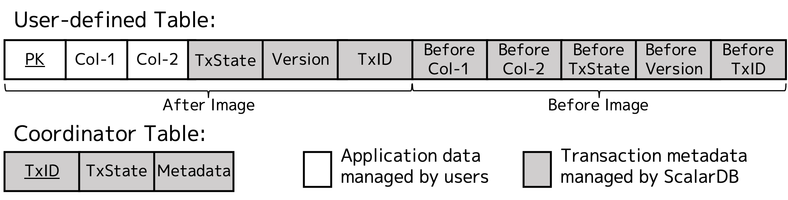

---
tags:
  - Community
  - Enterprise Standard
  - Enterprise Premium
displayed_sidebar: docsJapanese
---

# Consensus Commit プロトコル

import JavadocLink from '/src/theme/JavadocLink.js';
import TranslationBanner from '/src/components/_translation-ja-jp.mdx';

Consensus Commit は ScalarDB で使用されるトランザクションプロトコルであり、複数の異なるデータベースにまたがるトランザクションを実行するために設計されています。このプロトコルの特徴は、X/Open XA ベースのソリューションとは異なり、下位のデータベースのトランザクション機能に依存せずに ACID トランザクションを実現することです。このドキュメントでは、プロトコルの詳細、その動作方法、保証される分離レベル、インターフェース、採用されているパフォーマンス最適化、および制限事項について説明します。

## プロトコル

このセクションでは、Consensus Commit プロトコルの仕組みについて説明します。Consensus Commit プロトコルは、分離を保証するための並行性制御プロトコルと、原子性と永続性を保証するためのアトミックコミットメントプロトコルを使用します。

### 並行性制御プロトコル

Consensus Commit プロトコルは、並行性制御プロトコルとして楽観的並行性制御 (OCC) を採用しています。OCC は競合が少ないという前提で動作し、ロックを必要とせずにトランザクションを進め、競合が実際に発生した場合にのみ解決します。そのため、OCC は競合の少ない環境で優れたパフォーマンスを発揮します。また、ロック管理が難しい分散環境において特に有益です。

:::note

一方、悲観的並行性制御 (PCC) は、競合が多いという前提で動作し、干渉を避けるために使用されるリソースにロックをかけます。そのため、PCC は競合の多い環境で優れたパフォーマンスを発揮します。

:::

ScalarDB の OCC プロトコルは、一般的に使用される OCC プロトコルと同様に、次の3つのフェーズで構成されています:

- 読み取りフェーズ：
  - ScalarDB はトランザクションの読み取りセットと書き込みセットを追跡します。ScalarDB はトランザクションがアクセスするすべてのレコードをデータベースからローカルワークスペースにコピーし、書き込みをローカルワークスペースに保存します。
- 検証フェーズ：
  - ScalarDB はコミット中のトランザクションが他のトランザクションと競合していないか確認します。ScalarDB は後方検証を使用し、他のトランザクションがトランザクションが読み書きする内容を書き込んでいない場合にのみ、書き込みフェーズに進みます。これらはそれぞれ、読み取り検証と書き込み検証と呼ばれます。
- 書き込みフェーズ：
  - ScalarDB はトランザクションの書き込みセットの変更をデータベースに伝播し、それらを他のトランザクションから見えるようにします。

次に説明するように、ScalarDB は検証フェーズでの読み取り検証をスキップする分離モード (分離レベル) を提供し、正確性のために読み取り検証を必要としない一部のワークロードでより良いパフォーマンスを可能にします。

:::note

読み取り検証なしの ScalarDB の OCC は、スナップショット分離と同様に動作します。ただし、単一バージョンで動作し、グローバルスナップショットを作成しないため、読み取りスキュー異常を引き起こします。

:::

### アトミックコミットメントプロトコル

Consensus Commit プロトコルは、アトミックコミットメントプロトコル (ACP) として2フェーズコミットプロトコルの変種を採用しています。ScalarDB の ACP は2つのフェーズで構成され、各フェーズには2つのサブフェーズがあり、簡単に説明すると以下のように動作します:

- 準備フェーズ（レコード準備フェーズ + レコード検証フェーズ）：
  - レコード準備フェーズでは、ScalarDB はトランザクションによって書き込まれたすべてのレコードについて、OCC プロトコルの書き込み検証を実行し、レコードの状態を PREPARED に更新し、すべてのレコードが正常に検証された場合は次のフェーズに進みます。
  - レコード検証フェーズでは、ScalarDB はトランザクションによって読み取られたすべてのレコードについて、OCC プロトコルの読み取り検証を実行し、すべてのレコードが正常に検証された場合は次のフェーズに進みます。
- コミットフェーズ（状態コミットフェーズ + レコードコミットフェーズ）：
  - 状態コミットフェーズでは、ScalarDB は Coordinator テーブルと呼ばれる特別なテーブルに COMMITTED の状態を書き込むことでトランザクションをコミットします。
  - レコードコミットフェーズでは、ScalarDB はトランザクションによって書き込まれたすべてのレコードについて、OCC プロトコルの書き込みフェーズを実行し、レコードの状態を COMMITTED に更新します。

:::note

レコードを削除する場合、レコードの状態は最初に準備フェーズで DELETED に変更され、その後コミットフェーズで物理的に削除されます。

:::

#### より詳細な動作方法

プロトコルが各フェーズでどのように機能するかをより詳しく見ていきましょう。

##### 準備フェーズの前

まず、クライアントが ScalarDB (または ScalarDB Cluster ノード) にアクセスして `begin` コマンドを発行すると、トランザクションが開始します。トランザクションが開始すると、ScalarDB は下位のデータベースにアクセスするトランザクションコーディネーターとして動作し、最初に UUID version 4 でトランザクション ID (TxID) を生成します。その後、クライアントがレコードの読み取りや書き込みなどの操作を実行した後にトランザクションをコミットする準備ができると、`commit` コマンドを呼び出して ScalarDB にトランザクションのコミットを要求し、準備フェーズに入ります。前述のように、ScalarDB はコミット時にトランザクションの読み取りセット (readSet) と書き込みセット (writeSet) をローカルワークスペースに保持します。

##### 準備フェーズ

ScalarDB はまず、レコード準備フェーズとして、後述する TxID などのトランザクションログを含むレコードを PREPARED 状態で下位のデータベースに伝播することにより、書き込みセットのレコードを準備します。ここでは、書き込みセットが元のレコードと更新された列で構成される更新されたレコードを維持すると仮定します。準備処理が失敗した場合、すべてのトランザクションの最終状態が決定され管理される Coordinator テーブルに ABORTED 状態のレコードを書き込むことでトランザクションをアボートします。Coordinator テーブルの詳細は、このセクションの後半で説明します。

:::note

ScalarDB は線形化可能な条件付き書き込みを使用して、競合する準備処理をチェックします。トランザクションは、レコードの TxID が変更されていないかをチェックすることで、そのレコードがトランザクションの読み取り後に別のトランザクションによって更新されていない場合にのみ、レコードを更新します。

:::

必要に応じて、ScalarDB はレコード検証フェーズに進みます。レコード検証フェーズは、分離レベルが SERIALIZABLE に設定されている場合にのみ必要です。このフェーズでは、ScalarDB は読み取りセット内のすべてのレコードを再読み取りして、他のトランザクションがトランザクションが以前に読み取ったレコードを書き込んでいるかどうかを確認します。読み取りセットが変更されていなければ、反依存関係がないためトランザクションは状態コミットフェーズに進むことができます。そうでない場合は、トランザクションをアボートします。

##### コミットフェーズ

準備フェーズでのすべての検証が正常に完了した場合、ScalarDB は状態コミットフェーズとして Coordinator テーブルに COMMITTED 状態のレコードを書き込むことでトランザクションをコミットします。

:::note

* ScalarDB は、Coordinator テーブルへの同時書き込みを調整するために線形化可能な条件付き書き込みを使用し、その TxID のレコードがない場合に TxID を持つ状態レコードを作成します。COMMITTED 状態が Coordinator テーブルに正しく書き込まれると、トランザクションはコミットされたとみなされます。
* デフォルトでは、トランザクションが読み取り操作のみを含む場合、ScalarDB は状態コミットフェーズをスキップします。ただし、以下のパラメータを `false` に設定することで、読み取り専用トランザクションでも Coordinator テーブルに COMMITTED 状態のレコードを書き込むように ScalarDB を設定できます。
  * `scalar.db.consensus_commit.coordinator.write_omission_on_read_only.enabled`

:::

その後、ScalarDB はレコードコミットフェーズとして、検証された (準備された) すべてのレコードの状態を COMMITTED に変更することでコミットします。

#### 分散 WAL

ScalarDB はトランザクションログ (ログ先行書き込み／WAL) を、管理する下位のデータベースのレコードに保存します。具体的には、次の図に示すように、ScalarDB はアプリケーションが管理する列に加えて、レコード内にログ情報用の特別な列を管理します。ログ情報は、例えば、対応するレコードを最近更新したトランザクションID (TxID)、レコードのバージョン番号 (Version)、レコードの状態 (TxState) (例えば、COMMITTED または PREPARED)、タイムスタンプ（図には表示されていません）、および前のバージョンのアプリケーションデータとそのメタデータで構成される前イメージなどで構成されます。

ScalarDB はまた、アプリケーションレコードとは別に Coordinator テーブルでトランザクション状態を管理します。Coordinator テーブルは、信頼できる唯一の情報源としてトランザクション状態を決定し管理します。Coordinator テーブルは、アプリケーション管理テーブルと同じ場所に配置するか、別の専用データベースに配置することができます。

:::note

Coordinator テーブルは、下位のデータベースのレプリケーションおよびコンセンサス機能を使用して、高可用性のためにレプリケートすることができます。例えば、レプリケーション係数3の Cassandra を使用して Coordinator テーブルを管理する場合、ScalarDB のトランザクション調整を1つのレプリカのクラッシュに耐えるようにすることができます。したがって、ScalarDB のアトミックコミットメントプロトコルを Paxos Commit プロトコルのように機能させることができます。つまり、安全性を犠牲にすることなく、活性の問題（例えば、ブロッキング問題）を軽減することができます。

:::

#### 遅延リカバリ

トランザクションはいつでもクラッシュし、レコードをコミットされていない状態で残す可能性があります。ScalarDBは、Coordinator テーブルのトランザクション状態に応じて、レコードを読み取るときにコミットされていないレコードを遅延回復します。具体的には、レコードが PREPARED 状態にあるが、レコードを更新したトランザクションが期限切れまたはアボートされた場合、レコードはロールバックされます。レコードが PREPARED 状態にあり、レコードを更新したトランザクションがコミットされている場合、レコードはロールフォワードされます。

トランザクションは一定時間 (現在は15秒) 後に期限切れになります。ScalarDB が期限切れのトランザクションによって準備されたレコードを観察すると、ScalarDB は Coordinator テーブルにそのトランザクションの ABORTED 状態を書き込みます (再試行あり)。ScalarDB が Coordinator テーブルに ABORTED 状態を正常に書き込むと、トランザクションはアボートされます。それ以外の場合、トランザクションは何らかの理由で遅いが依然としてアクティブな元のプロセスによってコミットされるか、アボートまたはコミットされるまで UNKNOWN 状態のままになります。

## 分離レベル

Consensus Commit プロトコルは、リードコミッテッドスナップショット分離 (スナップショット分離の弱いバリアント)、シリアライザブル、リードコミッテッドの3つの分離レベルをサポートしており、それぞれ次のような特徴があります。

- リードコミッテッドスナップショット分離 (SNAPSHOT - デフォルト)
  - 発生しうる異常：読み取りスキュー、書き込みスキュー、読み取り専用
  - シリアライザブルより高速ですが、弱い正確性を保証します。
- シリアライザブル (SERIALIZABLE)
  - 発生しうる異常：なし
  - リードコミッテッドスナップショット分離より遅いですが、より強い（最強の）正確性を保証します。
- リードコミッテッド (READ_COMMITTED)
  - 発生しうる異常：読み取りスキュー、書き込みスキュー、読み取り専用
  - リードコミッテッドスナップショット分離よりも高速ですが、最新のコミット済みレコードではないものを返す場合があります。

上述のように、シリアライザブルは正確性の観点からは望ましいですが、リードコミッテッドスナップショット分離よりも遅くなります。アプリケーションの要件とワークロードに基づいて、適切なものを選択してください。リードコミッテッドスナップショット分離とシリアライザブルの設定方法の詳細については、[ScalarDB の設定](configurations.mdx#基本設定)を参照してください。

:::note

ScalarDB の Consensus Commit プロトコルは、[ScalarDB の下位のデータベースの設定](database-configurations.mdx#トランザクション)で説明されているように、下位のデータベースが線形化可能な操作を提供する必要があります。それにより、厳密なシリアライザビリティを保証します。

:::

:::warning

非 JDBC データベースに対して、パーティションキーを指定せずにレコードをスキャンする (例えば、<JavadocLink packageName="scalardb" path="com/scalar/db/api" className="ScanAll" /> または `SELECT * FROM table`) 場合、`SERIALIZABLE`が指定されていても、常にシリアライザビリティを保証するわけではありません。したがって、自己判断で行い、可能であればスキーマの更新を検討してください。詳細については、[クロスパーティションスキャン設定](configurations.mdx#クロスパーティションスキャン設定)を参照してください。

:::

## インターフェース

Consensus Commit プロトコルは、[1フェーズコミットインターフェースと2フェーズコミットインターフェース](scalardb-cluster/run-transactions-through-scalardb-cluster.mdx#トランザクションを実行する)の2つのインターフェースを提供します。

1フェーズコミットインターフェースは、単一の `commit` メソッドのみを提供するシンプルなインターフェースで、アトミックコミットメントプロトコルのすべてのフェーズがこのメソッドで実行されます。一方、2フェーズコミットインターフェースは、`prepare`、`validate`、`commit` メソッドでプロトコルの各フェーズを公開します。

:::note

`prepare` メソッドはレコード準備フェーズ用で、`validate` メソッドはレコード検証フェーズ用です。

:::

ほとんどの場合、使いやすくエラー処理も容易であるため、1フェーズコミットインターフェースの使用をお勧めします。しかし、2フェーズコミットインターフェースは、ScalarDB からデータベースに直接アクセスせずに、複数のアプリケーションやサービス間でトランザクションを実行する場合に役立ちます。例えば、マイクロサービスのデータベースの一貫性を維持する場合などです。

## パフォーマンスの最適化

Consensus Commit プロトコルは、いくつかのパフォーマンス最適化を採用しています。

### 並列実行

Consensus Commit は、正確性を犠牲にすることなく、トランザクション内並列処理を使用してアトミックコミットメントプロトコルの各フェーズを並列に実行します。具体的には、PREPARED 状態でレコードを書き込むことにより、レコード準備フェーズを並列に実行しようとします。同様に、レコード検証フェーズ、レコードコミットフェーズ、およびロールバックプロセスにも同様の並列実行を使用します。

以下のパラメータを使用して、それぞれの並列実行を有効にできます：

- レコード準備フェーズ
  - `scalar.db.consensus_commit.parallel_preparation.enabled`
- レコード検証フェーズ
  - `scalar.db.consensus_commit.parallel_validation.enabled`
- レコードコミットフェーズ
  - `scalar.db.consensus_commit.parallel_commit.enabled`
- ロールバック処理
  - `scalar.db.consensus_commit.parallel_rollback.enabled`

また、以下のパラメータを使用して実行の並列性を設定できます：

- `scalar.db.consensus_commit.parallel_executor_count`

設定の詳細については、[パフォーマンス関連の設定](configurations.mdx#パフォーマンス関連の設定)を参照してください。

### 非同期実行

トランザクションは状態コミットフェーズが正常に完了すると「コミット済み」とみなされるため、レコードコミットフェーズの完了を待たずにクライアントに戻り、フェーズを非同期に実行することもできます。同様に、トランザクションが何らかの理由で失敗してロールバックを行う場合、ロールバックプロセスもその完了を待たずに非同期に実行できます。

以下のパラメータを使用して、それぞれの非同期実行を有効にできます：

- レコードコミットフェーズ
  - `scalar.db.consensus_commit.async_commit.enabled`
- ロールバック処理
  - `scalar.db.consensus_commit.async_rollback.enabled`

### 1フェーズコミット最適化

1フェーズコミット最適化を使用すると、トランザクションが下位データベースでアトミックに更新できるレコードのみを更新する場合に限り、ScalarDB は 正確性を損なうことなくレコード準備フェーズと状態コミットフェーズを省略します。

以下のパラメータを使用して、1フェーズコミット最適化を有効にできます:

* `scalar.db.consensus_commit.one_phase_commit.enabled`

### グループコミット

Consensus Commit は、複数のトランザクションの状態コミットフェーズをバッチで実行し、状態コミットフェーズの書き込み回数を減らすグループコミット機能を提供します。これは特に、Coordinator テーブルへの書き込みが遅い場合、たとえば高可用性のためにマルチリージョン環境に Coordinator テーブルがデプロイされている場合に役立ちます。

以下のパラメータを使用してグループコミットを有効にできます：

- `scalar.db.consensus_commit.coordinator.group_commit.enabled`

グループコミットにはいくつかの他のパラメータがあります。詳細については、[パフォーマンス関連の設定](configurations.mdx#パフォーマンス関連の設定)を参照してください。

## 制限事項

ScalarDB には、データベースに依存しないトランザクションを実現するうえでいくつかの制限があります。

### アプリケーションは下位のデータベースにアクセスするために ScalarDB にアクセスする必要がある

Consensus Commit プロトコルを使用する ScalarDB は、下位のデータベースのトランザクション機能に依存することなく、そのレイヤーでトランザクションを処理するため、アプリケーションは ScalarDB をバイパスすることはできません。バイパスすると、予期しない動作が発生し、ほとんどの場合、いくつかのデータベース異常に直面することになります。読み取り操作であっても、ScalarDB の下位のデータベースに直接アクセスすると、トランザクションメタデータを含む一貫性のないデータが得られるため、許可されていません。

ただし、ScalarDB のトランザクションによって管理または触れられていないテーブルについては、テーブルから読み取りや書き込みを行うことができます。たとえば、ScalarDB を経由せずに直接テーブルにアクセスして、情報スキーマなどのテーブルのメタデータ情報を確認することは問題ありません。また、ScalarDB を経由せずに直接データベースにアクセスできる他のケースもいくつかあります。基本的な基準は、下位のデータベースにデータを書き込むかどうかです。データベースに書き込まないことが確実であれば、データベースに直接アクセスできます。たとえば、データベースネイティブツールを使用してデータベースのバックアップを取ることは問題ありません。

:::note

複数のデータベースやトランザクションをサポートしないデータベースからバックアップを取る場合は、アプリケーションや ScalarDB Cluster を一時停止する必要があります。詳細については、[ScalarDB で使用されるデータベースのバックアップと復元方法](backup-restore.mdx)を参照してください。

:::

### 正確性のために特定の操作を特定の順序で実行することは禁止されている

現在の実装では、ScalarDB は以下の場合に例外をスローします:

- トランザクション内で同じレコードに対して書き込み (Put、Insert、Update、Upsert、Delete) 操作の後にスキャン操作を実行する場合。
- トランザクション内で同じレコードに対して削除操作の後に書き込み (Put、Insert、Update、Upsert) 操作を実行する場合。

## 関連情報

以下のプレゼンテーションと YouTube ビデオを見ることで、Consensus Commit プロトコルについてさらに学ぶことができます。これらはプロトコルの動作を視覚的に要約しています：

- **Speaker Deck プレゼンテーション (英語):** [ScalarDB: Universal Transaction Manager](https://speakerdeck.com/scalar/scalar-db-universal-transaction-manager)
- **YouTube:** [ScalarDB におけるトランザクションの挙動 (DBSJ 講義の一部)](https://www.youtube.com/watch?v=s6Q7QQccDTc)

さらに、プロトコルの詳細については、背景、課題、新規性を含めて、以下の研究論文とそのプレゼンテーションで議論されています：

- **研究論文 (英語):** [ScalarDB: Universal Transaction Manager for Polystores](https://www.vldb.org/pvldb/vol16/p3768-yamada.pdf)
- **Speaker Deck プレゼンテーション (英語):** [ScalarDB: Universal Transaction Manager for Polystores](https://speakerdeck.com/scalar/scalardb-universal-transaction-manager-for-polystores-vldb23)
