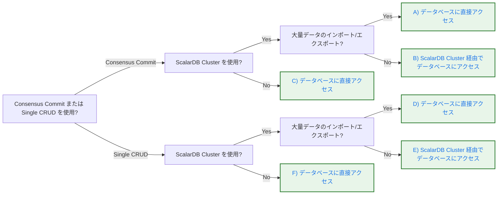

---
tags:
  - Community
  - Enterprise Standard
  - Enterprise Premium
displayed_sidebar: docsJapanese
---

# ScalarDB Data Loader

import TranslationBanner from '/src/components/_translation-ja-jp.mdx';

<TranslationBanner />

import Tabs from '@theme/Tabs';
import TabItem from '@theme/TabItem';

ScalarDB Data Loader は、ScalarDB に対してデータのインポートとエクスポートを簡単に行うことができるユーティリティツールです。

Data Loader は、検証、エラーハンドリング、詳細なログ記録を備えた構造化されたインポートおよびエクスポートプロセスを提供し、ScalarDB との間で安全にデータを移動できるように支援します。

## 使用ケースに基づいた適切な設定の選択

以下の判断ツリーを使用して、あなたの使用ケースに適した設定パターンを決定してください:



:::note

Consensus Commit を使用している場合、SERIALIZABLE 分離が必要ならクラスターを停止してください。READ COMMITTED 分離で問題なければ、クラスターを停止する必要はありません。

:::


### 設定パターン {#設定パターン}

判断ツリーに基づいて、設定パターンを選択してください:

<Tabs groupId="config-pattern" queryString>
  <TabItem value="pattern-ac" label="A/C: データベースに直接アクセス" default>

Consensus Commit トランザクションが必要で、データベースに直接アクセスする場合 (ScalarDB Cluster がない、または大量のデータをインポート/エクスポートする場合) に、このパターンを使用してください。行はトランザクション操作を使用してインポートされ、ACID プロパティが確保されます。デフォルトでは、最大100個の put 操作が単一のトランザクションにグループ化されます。これは `--transaction-size` オプションを使用して調整できます。

**クライアント設定** (Data Loader 用の scalardb.properties):

```properties
# Consensus Commit によるデータベース直接アクセス用トランザクションマネージャー
scalar.db.transaction_manager=consensus-commit

# ストレージ設定 (PostgreSQL の例)
scalar.db.storage=jdbc
scalar.db.contact_points=jdbc:postgresql://<DATABASE_HOST>:5432/<DATABASE_NAME>
scalar.db.username=<USERNAME>
scalar.db.password=<PASSWORD>
```

その他のデータベース設定については、[ScalarDB Core の設定](./configurations.mdx)を参照してください。

インポートコマンドを実行する際は、`--mode TRANSACTION` を使用してください。エクスポートコマンドでは `--mode` 引数は必要ありません。

:::note

Consensus Commit トランザクションマネージャーを使用する場合、各トランザクショングループ (デフォルトでは 100 レコード) は ACID 保証を満たしますが、インポートまたはエクスポート操作全体はアトミックではありません。中断された場合、一部のグループがコミットされ、他のグループがコミットされない可能性があります。ログファイルを使用して失敗したレコードを特定し、再試行してください。

:::

:::warning

データの整合性を確保するため:
- **ScalarDB Cluster がある場合 (パターン A):** インポートまたはエクスポート操作中にクラスターを停止してください。
- **ScalarDB Cluster がない場合 (パターン C):** 操作中にデータベースを更新する他のプロセスを停止してください。

:::

  </TabItem>
  <TabItem value="pattern-b" label="B: ScalarDB Cluster 経由でデータベースにアクセス">

Consensus Commit トランザクション用に設定された ScalarDB Cluster があり、大量のデータをインポートまたはエクスポートしていない場合に、このパターンを使用してください。

**クライアント設定** (Data Loader 用の scalardb.properties):

```properties
# ScalarDB Cluster に接続するためのトランザクションマネージャー
scalar.db.transaction_manager=cluster

# クラスターの接続ポイント (ロードバランサーのアドレスを使用)
scalar.db.contact_points=indirect:<SCALARDB_CLUSTER_HOST>

# オプション: ポート番号 (デフォルトは 60053)
scalar.db.contact_port=60053
```

`<SCALARDB_CLUSTER_HOST>` を ScalarDB Cluster エンドポイント (例: `localhost` または `192.168.10.1`) に置き換えてください。

**クラスター設定** (scalardb-cluster-node.properties):

```properties
# クラスター側のトランザクションマネージャー
scalar.db.transaction_manager=consensus-commit

# 分離レベル (SNAPSHOT、SERIALIZABLE、または READ_COMMITTED)
scalar.db.consensus_commit.isolation_level=SNAPSHOT

# ストレージ設定 (PostgreSQL の例)
scalar.db.storage=jdbc
scalar.db.contact_points=jdbc:postgresql://<DATABASE_HOST>:5432/<DATABASE_NAME>
scalar.db.username=<USERNAME>
scalar.db.password=<PASSWORD>
```

その他のデータベース設定については、[ScalarDB Cluster の設定](./scalardb-cluster/scalardb-cluster-configurations.mdx)を参照してください。

インポートコマンドを実行する際は、`--mode TRANSACTION` を使用してください。エクスポートコマンドでは `--mode` 引数は必要ありません。

:::warning

データの整合性を確保するため、インポートまたはエクスポート操作中に ScalarDB Cluster を通じてデータベースを更新する他のプロセスを停止してください。

:::

  </TabItem>
  <TabItem value="pattern-df" label="D/F: データベースに直接アクセス">

非トランザクション Storage 操作が必要で、データベースに直接アクセスする場合 (ScalarDB Cluster がない、または大量のデータをインポート/エクスポートする場合) に、このパターンを使用してください。

**クライアント設定** (Data Loader 用の scalardb.properties):

```properties
# データベース直接アクセス用トランザクションマネージャー (非トランザクション)
scalar.db.transaction_manager=single-crud-operation

# ストレージ設定 (PostgreSQL の例)
scalar.db.storage=jdbc
scalar.db.contact_points=jdbc:postgresql://<DATABASE_HOST>:5432/<DATABASE_NAME>
scalar.db.username=<USERNAME>
scalar.db.password=<PASSWORD>
```

その他のデータベース設定については、[ScalarDB Core の設定](./configurations.mdx)を参照してください。

インポートコマンドを実行する際は、`--mode STORAGE` を使用してください。エクスポートコマンドでは `--mode` 引数は必要ありません。

  </TabItem>
  <TabItem value="pattern-e" label="E: ScalarDB Cluster 経由でデータベースにアクセス">

非トランザクション Storage 操作用に設定された ScalarDB Cluster があり、大量のデータをインポートまたはエクスポートしていない場合に、このパターンを使用してください。

**クライアント設定** (Data Loader 用の scalardb.properties):

```properties
# ScalarDB Cluster に接続するためのトランザクションマネージャー
scalar.db.transaction_manager=cluster

# クラスターの接続ポイント (ロードバランサーのアドレスを使用)
scalar.db.contact_points=indirect:<SCALARDB_CLUSTER_HOST>

# オプション: ポート番号 (デフォルトは 60053)
scalar.db.contact_port=60053
```

`<SCALARDB_CLUSTER_HOST>` を ScalarDB Cluster エンドポイント (例: `localhost` または `192.168.10.1`) に置き換えてください。

**クラスター設定** (scalardb-cluster-node.properties):

```properties
# クラスター側のトランザクションマネージャー (非トランザクション)
scalar.db.transaction_manager=single-crud-operation

# ストレージ設定 (PostgreSQL の例)
scalar.db.storage=jdbc
scalar.db.contact_points=jdbc:postgresql://<DATABASE_HOST>:5432/<DATABASE_NAME>
scalar.db.username=<USERNAME>
scalar.db.password=<PASSWORD>
```

その他のデータベース設定については、[ScalarDB Cluster の設定](./scalardb-cluster/scalardb-cluster-configurations.mdx)を参照してください。

インポートコマンドを実行する際は、`--mode STORAGE` を使用してください。エクスポートコマンドでは `--mode` 引数は必要ありません。

  </TabItem>
</Tabs>

## 前提条件

<Tabs groupId="access-mode" queryString>
  <TabItem value="cluster" label="ScalarDB Cluster" default>

ScalarDB Cluster と Data Loader を使用する前に、以下が必要です:

- 以下のいずれかの Java Development Kit (JDK):
  - Oracle JDK: 8、11、17、または 21 (LTS バージョン)
  - OpenJDK (Eclipse Temurin、Amazon Corretto、または Microsoft Build of OpenJDK): 8、11、17、または 21 (LTS バージョン)
- ScalarDB Cluster の接続設定 (クラスターエンドポイントとポート) で設定された有効な **`scalardb.properties`** ファイル
- 実行中の ScalarDB Cluster インスタンスとクラスターエンドポイントへのネットワークアクセス

</TabItem>
<TabItem value="direct" label="データベース直接アクセス">

データベースへの直接アクセスと Data Loader を使用する前に、以下が必要です:

- 以下のいずれかの Java Development Kit (JDK):
  - Oracle JDK: 8、11、17、または 21 (LTS バージョン)
  - OpenJDK (Eclipse Temurin、Amazon Corretto、または Microsoft Build of OpenJDK): 8、11、17、または 21 (LTS バージョン)
- データベース直接の接続設定で設定された有効な **`scalardb.properties`** ファイル
- 読み取りおよび書き込み操作に対するデータベース権限 ([データベース権限要件](./requirements.mdx#データベース権限要件)を参照)

</TabItem>
</Tabs>

## Data Loader のセットアップ

<Tabs groupId="access-mode" queryString>
  <TabItem value="cluster" label="ScalarDB Cluster" default>

希望の方法を選択して Data Loader をセットアップし、コマンドに従ってください。

<Tabs groupId="data_loader_setup" queryString>
  <TabItem value="Fat_JAR" label="Fat JAR" default>

[ScalarDB Releases](https://github.com/scalar-labs/scalardb/releases) ページから **`scalardb-cluster-data-loader-<VERSION>-all.jar`** をダウンロードしてください。

以下のコマンドを実行して、`<VERSION>` をバージョン番号に置き換えてインストールを確認します:

```console
java -jar scalardb-cluster-data-loader-<VERSION>-all.jar --help
```

成功すると、利用可能なコマンドとオプションのリストが表示されます。

  </TabItem>
  <TabItem value="Docker_container" label="Docker コンテナ">

以下のコマンドを実行して、[Scalar コンテナレジストリ](https://github.com/orgs/scalar-labs/packages/container/package/scalardb-cluster-data-loader-cli)から Docker イメージを取得できます。角括弧内の内容を説明どおりに置き換えてください:

```console
docker pull ghcr.io/scalar-labs/scalardb-cluster-data-loader-cli:<VERSION>
```

コンテナを使用して Data Loader コマンドを実行できます。以下の例では、インストールを確認する方法を示しています:

```console
docker run --rm ghcr.io/scalar-labs/scalardb-cluster-data-loader-cli:<VERSION> --help
```

成功すると、利用可能なコマンドとオプションのリストが表示されます。

:::note

このドキュメントのすべてのコマンド例は JAR ファイルの構文を使用しています。`java -jar scalardb-cluster-data-loader-<VERSION>-all.jar` を Docker 等価コマンドに置き換え、ローカルファイルをボリュームとしてマウントすることで、コンテナで同じコマンドを実行できます。例:

```console
# JAR 構文
java -jar scalardb-cluster-data-loader-<VERSION>-all.jar import \
  --config scalardb.properties --file data.json ...

# Docker 等価コマンド
docker run --rm \
  -v ./scalardb.properties:/scalardb.properties \
  -v ./data.json:/data.json \
  ghcr.io/scalar-labs/scalardb-cluster-data-loader-cli:<VERSION> \
  import --config /scalardb.properties --file /data.json ...
```

:::

  </TabItem>
</Tabs>

</TabItem>
<TabItem value="direct" label="データベース直接アクセス">

希望の方法を選択して Data Loader をセットアップし、コマンドに従ってください。

<Tabs groupId="data_loader_setup" queryString>
  <TabItem value="Fat_JAR" label="Fat JAR" default>

[ScalarDB Releases](https://github.com/scalar-labs/scalardb/releases) ページから **`scalardb-data-loader-<VERSION>.jar`** をダウンロードしてください。

以下のコマンドを実行して、`<VERSION>` をバージョン番号に置き換えてインストールを確認します:

```console
java -jar scalardb-data-loader-<VERSION>.jar --help
```

成功すると、利用可能なコマンドとオプションのリストが表示されます。

  </TabItem>
  <TabItem value="Docker_container" label="Docker コンテナ">

以下のコマンドを実行して、[Scalar コンテナレジストリ](https://github.com/orgs/scalar-labs/packages/container/package/scalardb-data-loader-cli)から Docker イメージを取得できます。角括弧内の内容を説明どおりに置き換えてください:

```console
docker pull ghcr.io/scalar-labs/scalardb-data-loader-cli:<VERSION>
```

コンテナを使用して Data Loader コマンドを実行できます。以下の例では、インストールを確認する方法を示しています:

```console
docker run --rm ghcr.io/scalar-labs/scalardb-data-loader-cli:<VERSION> --help
```

成功すると、利用可能なコマンドとオプションのリストが表示されます。

:::note

このドキュメントのすべてのコマンド例は JAR ファイルの構文を使用しています。`java -jar scalardb-data-loader-<VERSION>.jar` を Docker 等価コマンドに置き換え、ローカルファイルをボリュームとしてマウントすることで、コンテナで同じコマンドを実行できます。例:

```console
# JAR 構文
java -jar scalardb-data-loader-<VERSION>.jar import \
  --config scalardb.properties --file data.json ...

# Docker 等価コマンド
docker run --rm \
  -v ./scalardb.properties:/scalardb.properties \
  -v ./data.json:/data.json \
  ghcr.io/scalar-labs/scalardb-data-loader-cli:<VERSION> \
  import --config /scalardb.properties --file /data.json ...
```

:::

  </TabItem>
</Tabs>

</TabItem>
</Tabs>

## データのインポート

このセクションでは、Data Loader のインポート機能の使用方法について説明します。

### 基本的なインポートの例

データをインポートする最も簡単な方法は、自動フィールドマッピングを使用することです。これにより、Data Loader がソースファイルのフィールドを名前でテーブルカラムにマッチングします。

Data Loader は3つのファイル形式をサポートしています: JSON、JSONL (JSON Lines)、CSV。以下の例では、各形式をインポートする方法を示します。

<Tabs groupId="file-format" queryString>
  <TabItem value="json" label="JSON" default>
    **自動マッピングでの JSON ファイルのインポート**

    JSON ファイルをテーブルにインポートするには、以下のコマンドを実行し、角括弧内の内容を説明どおりに置き換えます:

<Tabs groupId="access-mode" queryString>
  <TabItem value="cluster" label="ScalarDB Cluster" default>

```console
java -jar scalardb-cluster-data-loader-<VERSION>-all.jar import \
  --config scalardb.properties \
  --mode TRANSACTION \
  --namespace <NAMESPACE_NAME> \
  --table <TABLE_NAME> \
  --file <FILE_PATH>.json \
  --format JSON
```

  </TabItem>
  <TabItem value="direct" label="データベース直接アクセス">

```console
java -jar scalardb-data-loader-<VERSION>.jar import \
  --config scalardb.properties \
  --mode TRANSACTION \
  --namespace <NAMESPACE_NAME> \
  --table <TABLE_NAME> \
  --file <FILE_PATH>.json \
  --format JSON
```

  </TabItem>
</Tabs>

    このコマンドは、デフォルト設定 (INSERT モード、自動フィールドマッピング) を使用して、JSON ファイルを指定されたテーブルにインポートします。

    **JSON ファイル形式の例:**

    ```json
    [
      {
        "id": 1,
        "name": "Product A",
        "price": 100
      },
      {
        "id": 2,
        "name": "Product B",
        "price": 200
      }
    ]
    ```
  </TabItem>
  <TabItem value="jsonl" label="JSONL">
    **自動マッピングでの JSONL (JSON Lines) ファイルのインポート**

    JSONL ファイルをテーブルにインポートするには、以下のコマンドを実行し、角括弧内の内容を説明どおりに置き換えます:

<Tabs groupId="access-mode" queryString>
  <TabItem value="cluster" label="ScalarDB Cluster" default>

```console
java -jar scalardb-cluster-data-loader-<VERSION>-all.jar import \
  --config scalardb.properties \
  --mode TRANSACTION \
  --namespace <NAMESPACE_NAME> \
  --table <TABLE_NAME> \
  --file <FILE_PATH>.jsonl \
  --format JSONL
```

  </TabItem>
  <TabItem value="direct" label="データベース直接アクセス">

```console
java -jar scalardb-data-loader-<VERSION>.jar import \
  --config scalardb.properties \
  --mode TRANSACTION \
  --namespace <NAMESPACE_NAME> \
  --table <TABLE_NAME> \
  --file <FILE_PATH>.jsonl \
  --format JSONL
```

  </TabItem>
</Tabs>

    このコマンドは、デフォルト設定 (INSERT モード、自動フィールドマッピング) を使用して、JSONL ファイルを指定されたテーブルにインポートします。

    **JSONL ファイル形式の例:**

    ```json
    {"id": 1, "name": "Product A", "price": 100}
    {"id": 2, "name": "Product B", "price": 200}
    ```
  </TabItem>
  <TabItem value="csv" label="CSV">
    **自動マッピングでの CSV ファイルのインポート**

    CSV ファイルをテーブルにインポートするには、以下のコマンドを実行し、角括弧内の内容を説明どおりに置き換えます:

<Tabs groupId="access-mode" queryString>
  <TabItem value="cluster" label="ScalarDB Cluster" default>

```console
java -jar scalardb-cluster-data-loader-<VERSION>-all.jar import \
  --config scalardb.properties \
  --mode TRANSACTION \
  --namespace <NAMESPACE_NAME> \
  --table <TABLE_NAME> \
  --file <FILE_PATH>.csv \
  --format CSV
```

  </TabItem>
  <TabItem value="direct" label="データベース直接アクセス">

```console
java -jar scalardb-data-loader-<VERSION>.jar import \
  --config scalardb.properties \
  --mode TRANSACTION \
  --namespace <NAMESPACE_NAME> \
  --table <TABLE_NAME> \
  --file <FILE_PATH>.csv \
  --format CSV
```

  </TabItem>
</Tabs>

    このコマンドは、デフォルト設定 (INSERT モード、自動フィールドマッピング) を使用して、CSV ファイルを指定されたテーブルにインポートします。

    **CSV ファイル形式の例:**

    ```csv
    id,name,price
    1,Product A,100
    2,Product B,200
    ```

:::note

CSV ファイルには、テーブルカラムに一致するカラム名を持つヘッダー行が含まれている必要があります。CSV ファイルにヘッダー行がない場合は、`--header` オプションを使用してカラム名を指定してください。

:::
  </TabItem>
</Tabs>

:::warning

データベース直接アクセスでデータをインポートする場合は、データの整合性を確保するために以下に注意してください:

- **環境に ScalarDB Cluster がある場合:** 操作中にクラスターを停止してください。
- **ScalarDB Cluster がない場合:** 操作中にデータベースを更新する他のプロセスを停止してください。

:::

### 一般的なインポートシナリオ

このセクションでは、一般的なインポートシナリオについて説明します。

#### 新しいレコードを挿入する代わりに既存のレコードを更新する

新しいレコードを挿入する代わりに既存のレコードを更新するには、以下のコマンドを実行し、角括弧内の内容を説明どおりに置き換えます:

<Tabs groupId="access-mode" queryString>
  <TabItem value="cluster" label="ScalarDB Cluster" default>

```console
java -jar scalardb-cluster-data-loader-<VERSION>-all.jar import \
  --config scalardb.properties \
  --mode TRANSACTION \
  --namespace <NAMESPACE_NAME> \
  --table <TABLE_NAME> \
  --file <FILE_PATH>.json \
  --format JSON \
  --import-mode UPDATE
```

  </TabItem>
  <TabItem value="direct" label="データベース直接アクセス">

```console
java -jar scalardb-data-loader-<VERSION>.jar import \
  --config scalardb.properties \
  --mode TRANSACTION \
  --namespace <NAMESPACE_NAME> \
  --table <TABLE_NAME> \
  --file <FILE_PATH>.json \
  --format JSON \
  --import-mode UPDATE
```

  </TabItem>
</Tabs>

#### 制御ファイルを使用したカスタムフィールドマッピングでのインポート

ソースファイルのフィールドがテーブルのカラム名と一致しない場合、制御ファイルを使用してカスタムマッピングルールを定義できます。制御ファイルの作成とマッピング設定の詳細については、[カスタムデータマッピング](#カスタムデータマッピング)を参照してください。

制御ファイルを使用してカスタムフィールドマッピングでインポートするには、以下のコマンドを実行し、角括弧内の内容を説明どおりに置き換えます:

<Tabs groupId="access-mode" queryString>
  <TabItem value="cluster" label="ScalarDB Cluster" default>

```console
java -jar scalardb-cluster-data-loader-<VERSION>-all.jar import \
  --config scalardb.properties \
  --mode TRANSACTION \
  --file <FILE_PATH>.json \
  --format JSON \
  --control-file <CONTROL_FILE>.json
```

  </TabItem>
  <TabItem value="direct" label="データベース直接アクセス">

```console
java -jar scalardb-data-loader-<VERSION>.jar import \
  --config scalardb.properties \
  --mode TRANSACTION \
  --file <FILE_PATH>.json \
  --format JSON \
  --control-file <CONTROL_FILE>.json
```

  </TabItem>
</Tabs>

#### カスタム区切り文字での CSV データのインポート

カスタム区切り文字で CSV データをインポートするには、以下のコマンドを実行し、角括弧内の内容を説明どおりに置き換えます:

<Tabs groupId="access-mode" queryString>
  <TabItem value="cluster" label="ScalarDB Cluster" default>

```console
java -jar scalardb-cluster-data-loader-<VERSION>-all.jar import \
  --config scalardb.properties \
  --mode TRANSACTION \
  --namespace <NAMESPACE_NAME> \
  --table <TABLE_NAME> \
  --file <FILE_PATH>.csv \
  --format CSV \
  --delimiter ";"
```

  </TabItem>
  <TabItem value="direct" label="データベース直接アクセス">

```console
java -jar scalardb-data-loader-<VERSION>.jar import \
  --config scalardb.properties \
  --mode TRANSACTION \
  --namespace <NAMESPACE_NAME> \
  --table <TABLE_NAME> \
  --file <FILE_PATH>.csv \
  --format CSV \
  --delimiter ";"
```

  </TabItem>
</Tabs>

### インポートの設定

インポートプロセスをより詳細に制御するために、さまざまなオプションを設定できます:

#### インポートモード

使用ケースに基づいて適切なインポートモードを選択します:

- **INSERT** (デフォルト): 新しいレコードのみを挿入します。パーティションキーとクラスタリングキーに基づいてデータが既に存在する場合は失敗します。
- **UPDATE**: 既存のレコードのみを更新します。データが存在しない場合は失敗します。
- **UPSERT**: パーティションキーとクラスタリングキーに基づいて、新しいレコードを挿入するか既存のレコードを更新します。

:::note

INSERT モードを使用する場合、各ターゲットカラムに対してソースファイル内に一致するフィールドが必要です (自動またはカスタムデータマッピング経由)。この要件は、UPSERT 操作が INSERT 操作になる場合にも適用されます。

:::

### コマンドラインオプション

以下は、Data Loader のインポート機能で使用できるオプションのリストです:

| オプション                         | 説明                                                  | 使用法                                                       |
| ---------------------------- | ------------------------------------------------------------ | ----------------------------------------------------------- |
| `--mode`                       | Data Loader のアクセスモード。必須。サポートされるモードは `STORAGE` (単一 CRUD) と `TRANSACTION` (Consensus Commit) です。ScalarDB Cluster を使用する場合、モードはクラスター設定の `scalar.db.transaction_manager` 設定と一致する必要があります。データベースに直接アクセスする場合、モードは `scalar.db.transaction_manager` 設定と一致する必要があります。 | `scalardb-data-loader --mode TRANSACTION`                   |
| `--config`                     | ScalarDB 用の `.properties` ファイルへのパス。このファイルには、選択したアクセスパターンに応じて、クラスターの接続設定またはデータベース直接の接続設定のいずれかが含まれている必要があります。省略した場合、ツールは現在のフォルダで `scalardb.properties` という名前のファイルを探します。 | `scalardb-data-loader --config scalardb.properties`         |
| `--namespace`                  | データをインポートするテーブルのネームスペース。制御ファイルが提供されていない場合は必須です。 | `scalardb-data-loader --namespace namespace`                |
| `--table`                      | データをインポートするテーブルの名前。制御ファイルが提供されていない場合は必須です。 | `scalardb-data-loader --table tableName`                    |
| `--import-mode`                | ScalarDB テーブルにデータをインポートするモード。サポートされるモードは `INSERT`、`UPDATE`、`UPSERT` です。オプション。デフォルト値は `INSERT` です。 | `scalardb-data-loader --import-mode UPDATE`                 |
| `--require-all-columns`        | 設定した場合、カラムが不足している場合はデータ行をインポートできません。オプション。デフォルト値は `false` です。 | `scalardb-data-loader --require-all-columns`                |
| `--file`                       | インポートされるファイルへのパス。必須。 | `scalardb-data-loader --file <PATH_TO_FILE>`                |
| `--log-dir`                    | ログファイルを保存するディレクトリ。オプション。デフォルト値は `logs` です。 | `scalardb-data-loader --log-dir <PATH_TO_DIR>`              |
| `--log-success`                | 正常に処理されたレコードのログ記録を有効にします。オプション。デフォルト値は `false` です。 | `scalardb-data-loader --log-success`                        |
| `--log-raw-record`             | ログファイル出力に元のソースレコードを含めます。オプション。デフォルト値は `false` です。 | `scalardb-data-loader --log-raw-record`                     |
| `--max-threads`                | 並列処理に使用する最大スレッド数。デフォルト値は利用可能なプロセッサ数です。 | `scalardb-data-loader --max-threads 10`                     |
| `--format`                     | インポートファイルの形式。サポートされる形式は `JSON`、`JSONL`、`CSV` です。オプション。デフォルト値は `JSON` です。 | `scalardb-data-loader --format CSV`                         |
| `--ignore-nulls`               | インポート時にソースファイル内の null 値を無視します。これは、既存のデータが null 値で上書きされないことを意味します。オプション。デフォルト値は `false` です。 | `scalardb-data-loader --ignore-nulls`                       |
| `--pretty-print`               | **(JSON/JSONL のみ)** ログファイル内の JSON 出力でプリティプリントを有効にします。オプション。デフォルト値は `false` です。 | `scalardb-data-loader --pretty-print`                       |
| `--control-file`               | カスタムデータマッピングおよび/またはマルチテーブルインポートのルールを指定する JSON 制御ファイルへのパス。 | `scalardb-data-loader --control-file control.json`          |
| `--control-file-validation`    | 制御ファイルの検証レベル。サポートされるレベルは `MAPPED`、`KEYS`、`FULL` です。オプション。デフォルトレベルは `MAPPED` です。 | `scalardb-data-loader --control-file-validation FULL`       |
| `--delimiter`                  | **(CSV のみ)** CSV インポートファイルで使用される区切り文字。デフォルトの区切り文字はカンマです。 | `scalardb-data-loader --delimiter ";"`                      |
| `--header`                     | **(CSV のみ)** インポートファイルに CSV データが含まれ、ヘッダー行がない場合にヘッダー行を指定します。カラム名を単一の区切り文字で区切ったリストとして提供します。`--delimiter` を変更した場合は、ヘッダー値で同じ区切り文字を使用してください。 | `scalardb-data-loader --header id,name,price`               |
| `--data-chunk-size`            | 次のバッチに移る前に処理のためにメモリにロードするレコード数。これはメモリ使用量を制御し、トランザクション境界ではありません。オプション。デフォルト値は `500` です。 | `scalardb-data-loader --data-chunk-size 1000`               |
| `--data-chunk-queue-size`      | 処理を待っているロードされたレコードの最大キューサイズ。オプション。デフォルト値は `256` です。 | `scalardb-data-loader --data-chunk-queue-size 100`          |
| `--split-log-mode`             | データチャンクに基づいてログファイルを複数のファイルに分割します。オプション。デフォルト値は `false` です。 | `scalardb-data-loader --split-log-mode`                     |
| `--transaction-size`           | トランザクションコミットあたりの put 操作のグループサイズ。単一のトランザクションで一緒にコミットされるレコード数を指定します。Consensus Commit を使用している場合にのみサポートされます。オプション。デフォルト値は `100` です。 | `scalardb-data-loader --transaction-size 200`               |

### データマッピング

このセクションでは、2つのデータマッピングタイプ (自動データマッピングとカスタムデータマッピング) について説明します。

#### 自動データマッピング

制御ファイルが提供されていない場合、Data Loader はソースデータ内のフィールドを ScalarDB テーブル内の利用可能なカラムに自動的にマッピングします。名前が一致せず、すべてのカラムが必要な場合、検証エラーが発生します。この場合、レコードのインポートが失敗し、結果が失敗出力ログに追加されます。

#### カスタムデータマッピング

ソースフィールドがターゲットカラム名と一致しない場合、制御ファイルを使用する必要があります。制御ファイルでは、フィールド名のカスタムマッピングルールを指定する必要があります。

たとえば、以下の制御ファイルは、ソースファイル内のフィールド `source_field_name` をターゲットテーブル内の `target_column_name` にマッピングします:

```json
{
	"tables": [{
			"namespace": "<NAMESPACE>",
			"table_name": "<TABLE>",
			"mappings": [{
				"source_field": "<SOURCE_FIELD_NAME>",
				"target_column": "<TARGET_COLUMN_NAME>"
			}]
		}
	]
}
```

### 制御ファイル

カスタムデータマッピングまたはマルチテーブルインポートを可能にするために、Data Loader は JSON 制御ファイルによる設定をサポートしています。このファイルは、Data Loader を開始するときに `--control-file` 引数で渡す必要があります。

#### 制御ファイル検証レベル

制御ファイルに対する検証を強制するため、Data Loader では検証レベルを指定できます。設定されたレベルに基づいて、Data Loader は事前チェックを実行し、レベルルールに基づいて制御ファイルを検証します。

以下のレベルがサポートされています:

| レベル | 検証内容 | 使用タイミング |
| ----- | ----------------- | ----------- |
| FULL | すべてのテーブルカラムにマッピングがある | 制御ファイルがすべてのカラムをカバーしていることを確認する場合 |
| KEYS | パーティションキーとクラスタリングキーのみにマッピングがある | キーカラムのみを考慮する部分更新の場合 |
| MAPPED (デフォルト) | 指定したマッピングのみが有効 | 制御ファイルを信頼し、最小限の検証を行う場合 |

検証レベルはオプションであり、Data Loader を開始するときに `--control-file-validation` 引数で設定できます。

:::note

この検証は事前チェックとして実行され、インポートプロセスが自動的に成功することを意味するものではありません。

たとえば、レベルが MAPPED に設定され、制御ファイルに INSERT 操作の各カラムのマッピングが含まれていない場合、INSERT 操作ではすべてのカラムのマッピングが必要であるため、インポートプロセスは依然として失敗します。

:::

### マルチテーブルインポート

Data Loader はマルチテーブルターゲットインポートをサポートしており、制御ファイルでテーブルマッピングルールを指定することにより、JSON、JSON Lines、または CSV ファイルの単一行を複数のテーブルにインポートできます。

:::note

マルチテーブルインポートには制御ファイルが必要です。この機能は制御ファイルなしではサポートされていません。

:::

ScalarDB `TRANSACTION` モードでマルチテーブルインポートを使用する場合、ソース行がインポートされる各テーブルに対して個別のトランザクションが作成されます。たとえば、ソース行が制御ファイル内の2つのテーブルにマッピングされている場合、2つの個別のトランザクションが作成されます。

**例: 1つのソース行を複数のテーブルにインポート**

複数のフィールドを持つ JSON ソースレコード:

```json
[{
	"field1": "value1",
	"field2": "value2",
	"field3": "value3"
}]
```

異なるフィールドを異なるテーブルにマッピングする制御ファイルを使用して複数のテーブルにインポートできます:

```json
{
	"tables": [{
			"namespace": "<NAMESPACE>",
			"table_name": "<TABLE1>",
			"mappings": [{
				"source_field": "field1",
				"target_column": "<COLUMN1>"
			}, {
				"source_field": "field2",
				"target_column": "<COLUMN2>"
			}]
		},
		{
			"namespace": "<NAMESPACE>",
			"table_name": "<TABLE2>",
			"mappings": [{
				"source_field": "field1",
				"target_column": "<COLUMN1>"
			}, {
				"source_field": "field3",
				"target_column": "<COLUMN3>"
			}]
		}
	]
}
```

この設定では、`field1` と `field2` を `<TABLE1>` に、`field1` と `field3` を `<TABLE2>` にインポートします。

### 出力ログ

Data Loader は、すべてのインポート操作について、成功したレコードと失敗したレコードの両方を追跡する詳細なログファイルを作成します。

#### ログファイルの場所

デフォルトでは、Data Loader は `logs/` ディレクトリに2つのログファイルを生成します:

- **成功ログ:** 正常にインポートされたすべてのレコードが含まれます。
- **失敗ログ:** インポートに失敗したレコードとエラーの詳細が含まれます。

`--log-dir` オプションを使用してログディレクトリを変更できます。

#### ログの理解

両方のログファイルには、各レコードに追加された `data_loader_import_status` フィールドが含まれます:

**成功ログ内:**

- 各レコードが挿入 (新規) されたか更新 (既存) されたかを示します。
- `TRANSACTION` モードで実行時にトランザクションの詳細を含みます。

**失敗ログ内:**

- 各レコードがインポートに失敗した理由を説明します。
- 特定の検証エラーまたは制約違反をリストします。

#### 失敗したインポートの再試行

失敗ログは簡単に復旧できるように設計されています:

1. **失敗したレコードを編集** 失敗ログ内で問題を修正します (たとえば、不足しているカラムの追加や無効な値の修正)。
2. **編集されたファイルを直接使用** 新しいインポート操作の入力として使用します。
3. **クリーンアップ不要** `data_loader_import_status` フィールドは再インポート時に自動的に無視されるためです。

:::tip

正常にインポートされたレコードをログに記録するには `--log-success` を有効にし、ログ出力に元のソースデータを含めるには `--log-raw-record` を使用してください。

:::

#### ログ形式

| フィールド          | 説明                                                  |
| -------------- | ------------------------------------------------------------ |
| `action`         | データレコードのインポートプロセスの結果: UPDATE、INSERT、または FAILED_DURING_VALIDATION。 |
| `namespace`      | データがインポートされるテーブルのネームスペースの名前。 |
| `tableName`      | データがインポートされるテーブルの名前。           |
| `is_data_mapped` | 利用可能な制御ファイルに基づいてカスタムデータマッピングが適用されたかどうか。 |
| `tx_id`          | トランザクション ID。Data Loader が `TRANSACTION` モードで実行されている場合のみ利用可能。 |
| `value`          | オプションのデータマッピング後に、Data Loader が `PUT` 操作で使用する最終値。 |
| `row_number`     | ソースデータの行番号またはレコード番号。         |
| `errors`         | インポートプロセス中に失敗した操作の検証またはその他のエラーのリスト。 |

以下は、成功したインポートを示す JSON 形式のログファイルの例です:

```json
[{
	"column_1": 1,
	"column_2": 2,
	"column_n": 3,
	"data_loader_import_status": {
		"results": [{
		  "action": "UPDATE",
			"namespace": "namespace1",
			"tableName": "table1",
			"is_data_mapped": true,
			"tx_id": "value",
			"value": "value",
			"row_number": "value"
		}]
	}
}]
```
以下は、失敗したインポートの JSON 形式のログファイルの例です:

```json
[{
	"column_1": 1,
	"column_2": 2,
	"column_n": 3,
	"data_loader_import_status": {
		"results": [{
		  "action": "FAILED_DURING_VALIDATION",
			"namespace": "namespace1",
			"tableName": "table1",
			"is_data_mapped": false,
			"value": "value",
			"row_number": "value",
			"errors": [
			   "missing columns found during validation"
			]
		}]
	}
}]
```

### 重複データ

:::warning

インポートファイルに同じパーティションキーおよび/またはクラスタリングキーを持つ重複レコードが含まれていないことを確認してください。Data Loader はソースファイル内の重複を検出または防止しません。

:::

ScalarDB `TRANSACTION` モードでは、同じターゲットデータを短時間で更新しようとすると `No Mutation` エラーが発生します。Data Loader はこれらのエラーを自動的に処理しません。失敗したデータ行は失敗インポート結果出力ファイルにログ記録され、必要に応じて後で確認および再インポートできます。

## データのエクスポート

このセクションでは、Data Loader のエクスポート機能の使用方法について説明します。

:::note

エクスポート操作は、インポートと同じアクセスパターンと設定を使用します。ScalarDB Cluster アクセスまたはデータベース直接アクセス用の Data Loader の設定の詳細については、[設定パターン](#設定パターン)セクションを参照してください。

:::

### 基本的なエクスポートの例

データをエクスポートする最も簡単な方法は、テーブル全体をエクスポートすることです。Data Loader は ScalarDB スキャン操作を実行し、結果をファイルにエクスポートします。

Data Loader は3つのエクスポート形式をサポートしています: JSON、JSONL (JSON Lines)、CSV。以下の例では、各形式へのエクスポート方法を示します。

<Tabs groupId="file-format" queryString>
  <TabItem value="json" label="JSON" default>
    **テーブル全体を JSON にエクスポート**

    テーブルを JSON 形式にエクスポートするには、以下のコマンドを実行し、角括弧内の内容を説明どおりに置き換えます:

<Tabs groupId="access-mode" queryString>
  <TabItem value="cluster" label="ScalarDB Cluster" default>

```console
java -jar scalardb-cluster-data-loader-<VERSION>-all.jar export \
  --config scalardb.properties \
  --namespace <NAMESPACE_NAME> \
  --table <TABLE_NAME> \
  --format JSON
```

  </TabItem>
  <TabItem value="direct" label="データベース直接アクセス">

```console
java -jar scalardb-data-loader-<VERSION>.jar export \
  --config scalardb.properties \
  --namespace <NAMESPACE_NAME> \
  --table <TABLE_NAME> \
  --format JSON
```

  </TabItem>
</Tabs>

    このコマンドは、指定されたテーブルのすべてのデータを現在のディレクトリの JSON ファイルにエクスポートします。出力ファイルは `export.<namespace>.<table>.<timestamp>.json` という形式で自動的に名前が付けられます。

    **JSON 出力形式の例:**

    ```json
    [
      {
        "id": 1,
        "name": "Product A",
        "price": 100
      },
      {
        "id": 2,
        "name": "Product B",
        "price": 200
      }
    ]
    ```
  </TabItem>
  <TabItem value="jsonl" label="JSONL">
    **テーブル全体を JSONL にエクスポート**

    テーブルを JSONL (JSON Lines) 形式にエクスポートするには、以下のコマンドを実行し、角括弧内の内容を説明どおりに置き換えます:

<Tabs groupId="access-mode" queryString>
  <TabItem value="cluster" label="ScalarDB Cluster" default>

```console
java -jar scalardb-cluster-data-loader-<VERSION>-all.jar export \
  --config scalardb.properties \
  --namespace <NAMESPACE_NAME> \
  --table <TABLE_NAME> \
  --format JSONL
```

  </TabItem>
  <TabItem value="direct" label="データベース直接アクセス">

```console
java -jar scalardb-data-loader-<VERSION>.jar export \
  --config scalardb.properties \
  --namespace <NAMESPACE_NAME> \
  --table <TABLE_NAME> \
  --format JSONL
```

  </TabItem>
</Tabs>

    このコマンドは、指定されたテーブルのすべてのデータを現在のディレクトリの JSONL ファイルにエクスポートします。出力ファイルは `export.<namespace>.<table>.<timestamp>.jsonl` という形式で自動的に名前が付けられます。

    **JSONL 出力形式の例:**

    ```json
    {"id": 1, "name": "Product A", "price": 100}
    {"id": 2, "name": "Product B", "price": 200}
    ```
  </TabItem>
  <TabItem value="csv" label="CSV">
    **テーブル全体を CSV にエクスポート**

    テーブルを CSV 形式にエクスポートするには、以下のコマンドを実行し、角括弧内の内容を説明どおりに置き換えます:

<Tabs groupId="access-mode" queryString>
  <TabItem value="cluster" label="ScalarDB Cluster" default>

```console
java -jar scalardb-cluster-data-loader-<VERSION>-all.jar export \
  --config scalardb.properties \
  --namespace <NAMESPACE_NAME> \
  --table <TABLE_NAME> \
  --format CSV
```

  </TabItem>
  <TabItem value="direct" label="データベース直接アクセス">

```console
java -jar scalardb-data-loader-<VERSION>.jar export \
  --config scalardb.properties \
  --namespace <NAMESPACE_NAME> \
  --table <TABLE_NAME> \
  --format CSV
```

  </TabItem>
</Tabs>

    このコマンドは、指定されたテーブルのすべてのデータを現在のディレクトリの CSV ファイルにエクスポートします。出力ファイルは `export.<namespace>.<table>.<timestamp>.csv` という形式で自動的に名前が付けられます。

    **CSV 出力形式の例:**

    ```csv
    id,name,price
    1,Product A,100
    2,Product B,200
    ```

:::note

デフォルトでは、CSV エクスポートにはカラム名を持つヘッダー行が含まれます。必要に応じて `--no-header` オプションを使用してヘッダー行を除外してください。

:::
  </TabItem>
</Tabs>

:::warning

データベース直接アクセスでデータをエクスポートする場合は、データの整合性を確保するために以下に注意してください:

- **環境に ScalarDB Cluster がある場合:** 操作中にクラスターを停止してください。
- **ScalarDB Cluster がない場合:** 操作中にデータベースを更新する他のプロセスを停止してください。

:::

:::warning[フルテーブルエクスポートのみ]

パーティションキーを指定せずにテーブル全体をエクスポートする (フルテーブルスキャン) には、クロスパーティションスキャンを有効にする必要があります:

- **ScalarDB Cluster の場合:** ScalarDB Cluster 設定でクロスパーティションスキャンを有効にしてください。
- **ScalarDB Cluster がない場合 (データベース直接アクセス):** `scalardb.properties` ファイルでクロスパーティションスキャンを有効にしてください:

```properties
scalar.db.cross_partition_scan.enabled=true
```

この設定が有効でない場合、フルテーブルエクスポートは失敗します。この設定の詳細については、[クロスパーティションスキャン設定](./configurations.mdx#クロスパーティションスキャン設定)を参照してください。

`--partition-key` を使用して特定のパーティションをエクスポートする場合は、クロスパーティションスキャンは不要です。

:::

### 一般的なエクスポートシナリオ

以下は、一般的なデータエクスポートシナリオです。

#### 特定のファイルと形式にデータをエクスポート

特定のファイルと形式にデータをエクスポートするには、以下のコマンドを実行し、角括弧内の内容を説明どおりに置き換えます:

<Tabs groupId="access-mode" queryString>
  <TabItem value="cluster" label="ScalarDB Cluster" default>

```console
java -jar scalardb-cluster-data-loader-<VERSION>-all.jar export \
  --config scalardb.properties \
  --namespace <NAMESPACE_NAME> \
  --table <TABLE_NAME> \
  --output-file <OUTPUT_FILE_PATH>.csv \
  --format CSV
```

  </TabItem>
  <TabItem value="direct" label="データベース直接アクセス">

```console
java -jar scalardb-data-loader-<VERSION>.jar export \
  --config scalardb.properties \
  --namespace <NAMESPACE_NAME> \
  --table <TABLE_NAME> \
  --output-file <OUTPUT_FILE_PATH>.csv \
  --format CSV
```

  </TabItem>
</Tabs>

#### 特定のカラムのみをエクスポート

特定のカラムのみをエクスポートするには、以下のコマンドを実行し、角括弧内の内容を説明どおりに置き換えます:

<Tabs groupId="access-mode" queryString>
  <TabItem value="cluster" label="ScalarDB Cluster" default>

```console
java -jar scalardb-cluster-data-loader-<VERSION>-all.jar export \
  --config scalardb.properties \
  --namespace <NAMESPACE_NAME> \
  --table <TABLE_NAME> \
  --projection <COLUMN1>,<COLUMN2>,<COLUMN3>
```

  </TabItem>
  <TabItem value="direct" label="データベース直接アクセス">

```console
java -jar scalardb-data-loader-<VERSION>.jar export \
  --config scalardb.properties \
  --namespace <NAMESPACE_NAME> \
  --table <TABLE_NAME> \
  --projection <COLUMN1>,<COLUMN2>,<COLUMN3>
```

  </TabItem>
</Tabs>

#### 特定のパーティションキーのデータをエクスポート

特定のパーティションキーのデータをエクスポートするには、以下のコマンドを実行し、角括弧内の内容を説明どおりに置き換えます:

<Tabs groupId="access-mode" queryString>
  <TabItem value="cluster" label="ScalarDB Cluster" default>

```console
java -jar scalardb-cluster-data-loader-<VERSION>-all.jar export \
  --config scalardb.properties \
  --namespace <NAMESPACE_NAME> \
  --table <TABLE_NAME> \
  --partition-key <KEY_NAME>=<VALUE>
```

  </TabItem>
  <TabItem value="direct" label="データベース直接アクセス">

```console
java -jar scalardb-data-loader-<VERSION>.jar export \
  --config scalardb.properties \
  --namespace <NAMESPACE_NAME> \
  --table <TABLE_NAME> \
  --partition-key <KEY_NAME>=<VALUE>
```

  </TabItem>
</Tabs>

#### 行数制限でエクスポート

行数制限でエクスポートするには、以下のコマンドを実行し、角括弧内の内容を説明どおりに置き換えます:

<Tabs groupId="access-mode" queryString>
  <TabItem value="cluster" label="ScalarDB Cluster" default>

```console
java -jar scalardb-cluster-data-loader-<VERSION>-all.jar export \
  --config scalardb.properties \
  --namespace <NAMESPACE_NAME> \
  --table <TABLE_NAME> \
  --limit 1000
```

  </TabItem>
  <TabItem value="direct" label="データベース直接アクセス">

```console
java -jar scalardb-data-loader-<VERSION>.jar export \
  --config scalardb.properties \
  --namespace <NAMESPACE_NAME> \
  --table <TABLE_NAME> \
  --limit 1000
```

  </TabItem>
</Tabs>

### コマンドラインオプション

以下は、Data Loader のエクスポート機能で使用できるオプションのリストです:

| オプション                     | 説明                                                  | 使用法                                                  |
| ------------------------ | ------------------------------------------------------------ | ------------------------------------------------------ |
| `--config`                 | ScalarDB 用の `.properties` ファイルへのパス。このファイルには、選択したアクセスパターンに応じて、クラスターの接続設定またはデータベース直接の接続設定のいずれかが含まれている必要があります。省略した場合、ツールは現在のフォルダで `scalardb.properties` という名前のファイルを探します。 | `scalardb-data-loader --config scalardb.properties`    |
| `--namespace`              | テーブルデータをエクスポートするネームスペース。必須。               | `scalardb-data-loader --namespace namespace`           |
| `--table`                  | データをエクスポートするテーブルの名前。必須。                 | `scalardb-data-loader --table tableName`               |
| `--partition-key`          | データをエクスポートする特定のパーティションキー。`key=value` 形式で指定します。デフォルトでは、このオプションは指定されたテーブルのすべてのデータをエクスポートします。 | `scalardb-data-loader --partition-key id=100`          |
| `--sort-by`                | クラスタリングキーのソート順。サポートされる値は `asc` と `desc` です。このオプションは `--partition-key` を使用する場合にのみ適用されます。 | `scalardb-data-loader --sort-by asc`                   |
| `--projection`             | エクスポートに含めるカラム。カンマ区切りのリストとして提供します。引数を繰り返して複数のプロジェクションを提供することもできます。 | `scalardb-data-loader --projection column1,column2`    |
| `--start-key`              | スキャンの開始を示すクラスタリングキーと値。`key=value` 形式で指定します。このオプションは `--partition-key` を使用する場合にのみ適用されます。 | `scalardb-data-loader --start-key timestamp=1000`      |
| `--start-inclusive`        | 開始キーを包括的にします。デフォルト値は `true` です。このオプションは `--partition-key` を使用する場合にのみ適用されます。 | `scalardb-data-loader --start-inclusive false`         |
| `--end-key`                | スキャンの終了を示すクラスタリングキーと値。`key=value` 形式で指定します。このオプションは `--partition-key` を使用する場合にのみ適用されます。 | `scalardb-data-loader --end-key timestamp=9999`        |
| `--end-inclusive`          | 終了キーを包括的にします。デフォルト値は `true` です。このオプションは `--partition-key` を使用する場合にのみ適用されます。 | `scalardb-data-loader --end-inclusive false`           |
| `--limit`                  | エクスポートする最大行数。省略した場合、制限はありません。 | `scalardb-data-loader --limit 1000`                    |
| `--output-dir`             | エクスポートされたファイルを保存するディレクトリ。デフォルトは現在のディレクトリです。<br /><br />注意: Data Loader は出力ディレクトリを作成しないため、ディレクトリが既に存在している必要があります。 | `scalardb-data-loader --output-dir ./exports`          |
| `--output-file`            | エクスポートされたデータの出力ファイル名。省略した場合、ツールは以下の名前形式でファイルを保存します:<br />`export.<namespace>.<table>.<timestamp>.<format>` | `scalardb-data-loader --output-file output.json`       |
| `--format`                 | エクスポートされたデータファイルの形式。サポートされる形式は `JSON`、`JSONL`、`CSV` です。デフォルト値は `JSON` です。 | `scalardb-data-loader --format CSV`                    |
| `--delimiter`              | **(CSV のみ)** CSV ファイルの区切り文字。デフォルトの区切り文字はカンマです。 | `scalardb-data-loader --delimiter ";"`                 |
| `--no-header`              | **(CSV のみ)** CSV ファイルでヘッダー行を除外します。デフォルト値は `false` です。 | `scalardb-data-loader --no-header`                     |
| `--pretty-print`           | **(JSON/JSONL のみ)** JSON 出力をプリティプリントします。デフォルト値は `false` です。 | `scalardb-data-loader --pretty-print`                  |
| `--data-chunk-size`        | 次のバッチに移る前に処理のためにメモリにロードするレコード数。これはメモリ使用量を制御します。デフォルト値は `200` です。 | `scalardb-data-loader --data-chunk-size 500`           |
| `--max-threads`            | 並列処理に使用する最大スレッド数。デフォルト値は利用可能なプロセッサ数です。 | `scalardb-data-loader --max-threads 10`                |