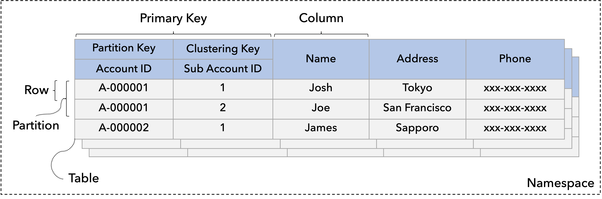

---
tags:
  - Community
  - Enterprise Standard
  - Enterprise Premium
displayed_sidebar: docsJapanese
---

# データをモデル化する

import TranslationBanner from '/src/components/_translation-ja-jp.mdx';

<TranslationBanner />

データモデリング (つまり、データベーススキーマの設計) とは、データへのアクセスに使用されるパターンと、ビジネスオペレーション内で実行されるクエリの種類を特定することで、データの保存方法と使用方法を概念化して視覚化するプロセスです。

このページでは、まず ScalarDB データモデルについて説明し、次にデータモデルに基づいてデータベーススキーマを設計する方法について説明します。

## ScalarDB データモデル

ScalarDB のデータモデルは、Bigtable データモデルにヒントを得た拡張キー値モデルです。リレーショナルモデルに似ていますが、以下に示すようにいくつかの点で異なります。データモデルは、リレーショナルデータベース、NoSQL データベース、NewSQL データベースなど、さまざまなデータベースを抽象化するために選択されます。

次の図は、それぞれがレコードのコレクションである ScalarDB テーブルの例を示しています。このセクションでは、まず、テーブルやレコードなどの ScalarDB が定義するオブジェクトについて説明し、次にレコードの検索方法について説明します。

### ScalarDB のオブジェクト

ScalarDB データモデルには、いくつかのオブジェクトがあります。

#### 名前空間

名前空間は、SQL 名前空間またはデータベースに類似したテーブルのコレクションです。

#### テーブル

テーブルはパーティションのコレクションです。名前空間には、通常、それぞれが名前で識別される 1 つ以上のテーブルが含まれます。

#### パーティション

パーティションはレコードのコレクションであり、論理ノードまたは物理ノードへの分散単位です。したがって、同じパーティション内のレコードは同じノードに配置されます。ScalarDB では、複数のパーティションがハッシュによって分散されていると想定しています。

#### レコード / 行

レコードまたは行は、他のすべてのレコード間で一意に識別できる列のセットです。

#### 列

列は基本的なデータ要素であり、これ以上細分化する必要はありません。各レコードは、1 つ以上の列で設定されます。各列にはデータ型があります。データ型の詳細については、[ScalarDB と他のデータベース間のデータ型マッピング](schema-loader.mdx#scalardb-と他のデータベース間のデータ型マッピング)を参照してください。

#### セカンダリインデックス

セカンダリインデックスは、単一の基本テーブル内の列のソートされたコピーです。各インデックスエントリは、対応するテーブルパーティションにリンクされています。ScalarDB は現在、複数列のインデックスをサポートしていないため、1 つの列のみでインデックスを作成できます。

### レコードの検索方法

このセクションでは、テーブルからレコードを検索する方法について説明します。

#### プライマリーキー

プライマリーキーは各レコードを一意に識別します。2 つのレコードが同じプライマリーキーを持つことはできません。したがって、プライマリーキーを指定してレコードを検索できます。プライマリーキーは、パーティションキーと、オプションでクラスタリングキーで設定されます。

#### パーティションキー

パーティションキーは、パーティションを一意に識別します。パーティションキーは、パーティションキー列と呼ばれる列のセットで設定されます。パーティションキーのみを指定すると、パーティションに属するレコードのセットを取得できます。

#### クラスタリングキー

クラスタリングキーは、パーティション内のレコードを一意に識別します。クラスタリングキー列と呼ばれる列のセットで設定されます。クラスタリングキーを指定する場合は、効率的な検索のためにパーティションキーを指定する必要があります。パーティションキーなしでクラスタリングキーを指定すると、すべてのパーティションをスキャンすることになります。すべてのパーティションをスキャンすると、特にデータ量が多い場合は時間がかかるため、自己判断でのみ実行してください。

パーティション内のレコードは、クラスタリング順序として指定されたクラスタリングキー列でソートされていると想定されます。したがって、定義された順序でクラスタリングキー列の一部を指定して、返される結果を絞り込むことができます。

#### インデックスキー

インデックスキーは、インデックス内のキーを検索してレコードを識別します。インデックスキーの検索はすべてのパーティションにまたがるため、特に検索の選択性が低くない場合は、必ずしも効率的であるとは限りません。

## データベーススキーマの設計方法

データベーススキーマはリレーショナルモデルと同様に設計できますが、基本的な原則があり、従うべきベストプラクティスがいくつかあります。

### クエリ駆動型データモデリング

リレーショナルデータベースでは、データは正規化されたテーブルに整理され、外部キーを使用して他のテーブル内の関連データを参照します。アプリケーションが実行するクエリはテーブルによって構造化され、関連データはテーブル結合としてクエリされます。

ScalarDB は ScalarDB SQL での結合操作をサポートしていますが、データモデリングは NoSQL データベースのように、よりクエリ駆動型である必要があります。データアクセスパターンとアプリケーションクエリによって、テーブルの構造と設定が決定されます。

### ベストプラクティス

このセクションでは、データベーススキーマを設計するためのベストプラクティスについて説明します。

#### データ分散を考慮する

パーティションキーとクラスタリングキーを適切に選択して、パーティションへの負荷を分散させることをお勧めします。

たとえば、銀行アプリケーションでアカウント ID をパーティションキーとして選択すると、アカウントが属するパーティション内で特定のアカウントに対するすべてのアカウント操作を実行できます。したがって、異なるアカウント ID を操作すると、異なるパーティションにアクセスすることになります。

一方、ブランチ ID をパーティションキーとして選択し、アカウント ID をクラスタリングキーとして選択すると、ブランチのアカウント ID へのアクセスはすべて同じパーティションに送られるため、負荷とデータサイズの不均衡が生じます。さらに、少数の大きなパーティションを作成すると負荷とデータサイズの不均衡が生じるため、パーティションキーにはカーディナリティの高い列を選択する必要があります。

#### 単一のパーティションの読み取りを試みる

データモデルの特性により、単一パーティション検索が最も効率的です。スキャンを発行したり、複数パーティションの検索やスキャンを必要とするリクエストを選択したりする必要がある場合は、[クロスパーティションスキャンで有効にする](configurations.mdx#クロスパーティションスキャン設定)ことができますが、独自の判断で実行し、可能であればスキーマの更新を検討してください。

たとえば、銀行アプリケーションで、パーティションキーとして電子メールを選択し、クラスタリングキーとしてアカウント ID を選択し、アカウント ID を指定するクエリを発行すると、対応するパーティションを効率的に識別できないため、クエリはすべてのパーティションにまたがって実行されます。このような場合は、常にアカウント ID を使用してテーブルを検索する必要があります。

:::note

適切なインデックスを持つリレーショナルデータベース上の複数のパーティションを読み取る場合、クエリがデータベースにプッシュダウンされるため、クエリが効率的になる可能性があります。

:::

#### セカンダリインデックスの使用を避ける

上記と同様に、セカンダリインデックスを使用するスキャンまたは選択リクエストを発行する必要がある場合、そのリクエストはテーブルのすべてのパーティションにまたがります。したがって、セカンダリインデックスの使用を避けるようにしてください。セカンダリインデックスを使用する必要がある場合は、小さな部分を検索する低選択性クエリを介して使用します。

セカンダリインデックスの代わりに、ベーステーブルのクラスター化インデックスとして機能する別のテーブルを作成できます。

たとえば、プライマリーキーが `A` である `table1(A, B, C)` という 3 つの列を持つテーブルがあるとします。次に、`C` をプライマリーキーとして `index-table1(C, A, B)` のようなテーブルを作成し、`C` の値を指定して単一のパーティションを検索できるようにします。このアプローチにより、読み取りクエリは高速化されますが、ScalarDB トランザクションを使用して 2 つのテーブルに書き込む必要があるため、書き込みクエリの負荷が増加する可能性があります。

:::note

将来的には、ScalarDB にテーブルベースのセカンダリインデックス機能が追加される予定です。

:::

#### データはハッシュによって分散されていると想定されていることを考慮する

現在の ScalarDB データモデルでは、データはハッシュによって分散されていると想定されています。したがって、パーティションキーがないと範囲クエリを効率的に実行できません。

範囲クエリを効率的に発行するには、パーティション内で実行する必要があります。ただし、このアプローチに従う場合は、パーティションキーを指定する必要があります。範囲クエリは常に同じパーティションに送信されるので、パーティションが過負荷になる可能性があり、スケーラビリティの問題が発生する可能性があります。この制限は ScalarDB に固有のものではなく、スケーラビリティのためにハッシュによってデータが分散されているデータベースに固有のものです。

:::note

適切なインデックスを持つリレーショナルデータベースで ScalarDB を実行すると、クエリがデータベースにプッシュダウンされるため、範囲クエリが効率的になる可能性があります。

:::
