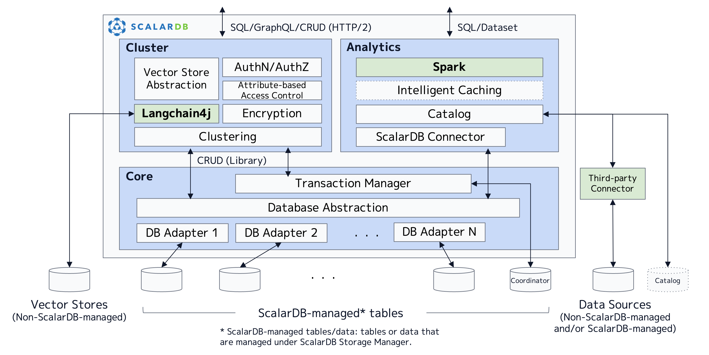

---
tags:
  - Community
  - Enterprise Standard
  - Enterprise Premium
displayed_sidebar: docsJapanese
---

# ScalarDB デザイン

import TranslationBanner from '/src/components/_translation-ja-jp.mdx';

<TranslationBanner />

このドキュメントでは、ScalarDB の設計と実装について簡単に説明します。ScalarDB の概要とその使用例については、[ScalarDB の概要](./overview.mdx)を参照してください。

## 全体的なアーキテクチャ

ScalarDB は、アプリケーションとデータベースの間に配置されるハイブリッドトランザクション/分析処理 (HTAP) ミドルウェアです。次の図に示すように、ScalarDB は、Core、Cluster、Analytics の3つのコンポーネントで構成されています。ScalarDB は基本的に階層型アーキテクチャを採用しているため、Cluster コンポーネントと Analytics コンポーネントは、Core コンポーネントを使用して基盤となるデータベースとやり取りしますが、正確さを犠牲にすることなくパフォーマンスを最適化するために Core コンポーネントをバイパスすることもあります。同様に、各コンポーネントも複数のレイヤーで構成されています。

## コンポーネント

次のサブセクションでは、各コンポーネントについて1つずつ説明します。

### Core

Apache 2 ライセンスの下でオープンソースソフトウェアとして提供される ScalarDB Core は、ScalarDB の不可欠な部分です。Core は、基礎となるデータベースを抽象化する抽象化レイヤーと、各データベースの抽象化を実装するアダプター (またはシム) を備えたデータベースマネージャーを提供します。さらに、データベース抽象化の上にトランザクションマネージャーを提供し、Scalar の新しい分散トランザクションプロトコルである Consensus Commit に基づいて、データベースに依存しないトランザクション管理を実現します。Core は、シンプルな CRUD インターフェースを提供するライブラリとして提供されます。

### Cluster

商用ライセンスでライセンスされている ScalarDB Cluster は、Core コンポーネントがクラスター化されたサーバーとして機能するためのクラスタリングソリューションを提供するコンポーネントです。Cluster は主に、多数の小規模なトランザクションおよび非トランザクションの読み取りと書き込みがある OLTP ワークロード向けに設計されています。さらに、認証、承認、保存時の暗号化、きめ細かなアクセス制御 (属性ベースのアクセス制御) などのエンタープライズ機能もいくつか提供しています。Cluster は Core コンポーネントと同じ CRUD インターフェースを提供するだけでなく、SQL および GraphQL インターフェースも提供しています。さらに、複数のベクターストアと対話するためのベクターストアインターフェースも提供します。Cluster は Kubernetes Pod 内のコンテナーとして提供されるため、コンテナーを増やすことでパフォーマンスと可用性を高めることができます。

### Analytics

商用ライセンスでライセンスされている ScalarDB Analytics は、Core コンポーネントによって管理されるデータ、または ScalarDB を使用しないアプリケーションによって管理されるデータに対してスケーラブルな分析処理を提供するコンポーネントです。Analytics は主に、少数の大規模な分析読み取りクエリがある OLAP ワークロード向けに設計されています。さらに、Spark を通じて SQL および DataSet API も提供されます。Analytics コンポーネントは Apache Spark エンジンにインストールできる Java パッケージとして提供されるため、Spark ワーカーノードを増やすことでパフォーマンスを向上させることができます。

## 詳細

ScalarDB の設計と実装の詳細については、次のドキュメントを参照してください。

- **Speaker Deck プレゼンテーション:** [ScalarDB: Universal Transaction Manager](https://speakerdeck.com/scalar/scalar-db-universal-transaction-manager)
- **Speaker Deck プレゼンテーション:** [ScalarDB を用いたマイクロサービスにおけるデータ管理](https://speakerdeck.com/scalar/scalardbwoyong-itamaikurosabisuniokerudetaguan-li-database-engineering-meetup-number-2)

さらに、VLDB 2023 カンファレンスでは以下の資料が発表されました。

- **Speaker Deck プレゼンテーション:** [ScalarDB: Universal Transaction Manager for Polystores](https://speakerdeck.com/scalar/scalardb-universal-transaction-manager-for-polystores-vldb23)
- **詳細な論文:** [ScalarDB: Universal Transaction Manager for Polystores](https://www.vldb.org/pvldb/vol16/p3768-yamada.pdf)
