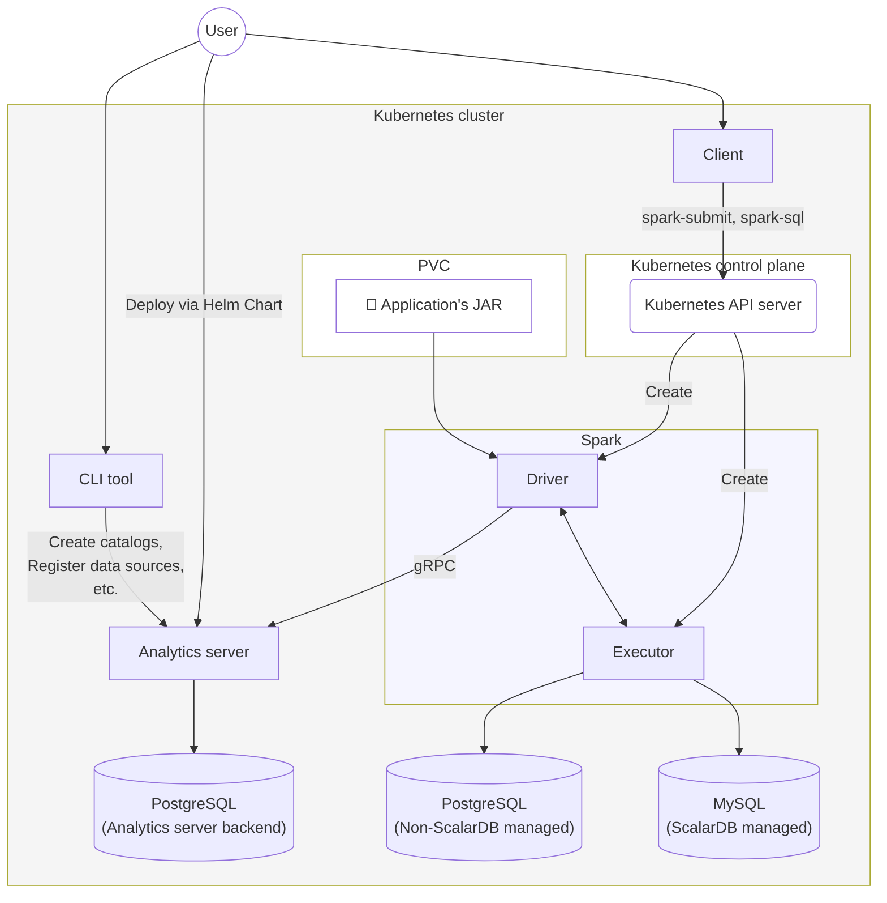

---
tags:
  - Enterprise Option
displayed_sidebar: docsJapanese
---

# ScalarDB Analytics をローカルにデプロイする

import TranslationBanner from '/src/components/_translation-ja-jp.mdx';

<TranslationBanner />

import Tabs from '@theme/Tabs';
import TabItem from '@theme/TabItem';
import WarningLicenseKeyContact from '/src/components/ja-jp/_warning-license-key-contact.mdx';

このガイドでは、Helm Chart を使用して、テスト用に特別に設計されたローカル Kubernetes クラスターに ScalarDB Analytics をデプロイする方法について説明します。

## 前提条件

ScalarDB Analytics をローカル環境にデプロイする前に、以下のツールがインストールされていることを確認してください。

- Kubernetes クラスター (このガイドでは [minikube](https://minikube.sigs.k8s.io/docs/start/) を使用していることを前提としています)
- [kubectl](https://kubernetes.io/docs/tasks/tools/#kubectl)
- [Helm](https://helm.sh/docs/intro/install/)

<WarningLicenseKeyContact product="ScalarDB Analytics" />

## アーキテクチャ例

以下は、このガイドで説明するアーキテクチャ例です。



このガイドでは、minikube 上で実行される Kubernetes クラスターを前提としています。この構成では、PostgreSQL は ScalarDB トランザクションによって管理されない外部データソースとして扱われ、MySQL は ScalarDB トランザクションによって管理されるデータソース (ScalarDB 管理データソース) として扱われます。これらのデータソースは両方ともユーザーデータを格納します。ScalarDB Analytics サーバーは Helm Chart を使用して Pod としてデプロイされます。ScalarDB Analytics サーバーは、カタログデータを格納するために専用のバックエンドデータベースを使用します。Spark コマンドを実行するためのクライアントとして機能する個別の Pod も作成されます。さらに、ScalarDB Analytics サーバーを操作するために使用される CLI ツールは、コンテナイメージとして提供され、個別の Pod 上で実行されます。

:::note

[ScalarDB Cluster をローカルにデプロイする方法](../scalardb-cluster/setup-scalardb-cluster-on-kubernetes-by-using-helm-chart.mdx) などのリソースを参照して、各データソースを自分で設定してください。

:::

## ステップ 1: Kubernetes 環境をセットアップする

最初に、すべてのコンポーネントがデプロイされる Kubernetes 環境をセットアップする必要があります。

### ServiceAccount と RoleBinding を作成する

サービスアカウント (`ServiceAccount`) とロールバインディング (`RoleBinding`) を作成して、Spark ジョブが Kubernetes クラスター内のリソースを管理できるようにします。

```shell
NAMESPACE=default
SERVICE_ACCOUNT_NAME=spark

cat <<EOF | kubectl apply -f -
apiVersion: v1
kind: ServiceAccount
metadata:
  name: ${SERVICE_ACCOUNT_NAME}
  namespace: ${NAMESPACE}
---
apiVersion: rbac.authorization.k8s.io/v1
kind: RoleBinding
metadata:
  name: spark-role
  namespace: ${NAMESPACE}
roleRef:
  kind: ClusterRole
  name: cluster-admin
  apiGroup: rbac.authorization.k8s.io
subjects:
  - kind: ServiceAccount
    name: ${SERVICE_ACCOUNT_NAME}
    namespace: ${NAMESPACE}
EOF
```

必要に応じて `NAMESPACE` および `SERVICE_ACCOUNT_NAME` 環境変数を変更できます。

## ステップ 2: ScalarDB Analytics サーバーをデプロイする

このステップでは、Scalar が提供する Helm Chart を使用して、ScalarDB Analytics サーバーを Kubernetes 環境にデプロイします。

### ScalarDB Analytics サーバーのバックエンドデータベースをデプロイする

ScalarDB Analytics サーバーは、カタログ情報を管理するために専用のバックエンドデータベースを使用します。このガイドでは、バックエンドデータベースとして専用の PostgreSQL インスタンスを使用します。

Bitnami Helm Chart を使用して、Kubernetes クラスター上に PostgreSQL をデプロイできます。以下のコマンドを実行して、Bitnami Helm Charts リポジトリを追加します。

```shell
helm repo add bitnami https://charts.bitnami.com/bitnami
```

以下のコマンドを実行して PostgreSQL をデプロイします。

```shell
helm install postgresql-scalardb-analytics bitnami/postgresql \
  --set auth.postgresPassword=postgres \
  --set primary.persistence.enabled=false
```

以下のコマンドを実行して PostgreSQL の Pod が動作しているかどうかを確認します。

```shell
kubectl get pod
```

以下のような出力が表示され、PostgreSQL の Pod が `Running` 状態になっている必要があります。

```console
NAME                             READY   STATUS    RESTARTS   AGE
postgresql-scalardb-analytics-0  1/1     Running   0          10s
```

### Scalar Helm Charts リポジトリを追加する

以下のコマンドを実行して Scalar Helm Charts リポジトリを追加します。

```shell
helm repo add scalar-labs https://scalar-labs.github.io/helm-charts
```

### ScalarDB Analytics サーバー用のカスタム値ファイルを作成する

ScalarDB Analytics サーバー Helm Chart 用のカスタム値ファイル (`analytics-server-custom-values.yaml`) を作成します。

以下は、シンプルな設定の例です。

```shell
cat <<EOF > analytics-server-custom-values.yaml
scalarDbAnalyticsServer:
  properties: |
    scalar.db.analytics.server.catalog.port=11051
    scalar.db.analytics.server.metering.port=11052

    scalar.db.analytics.server.db.contact_points=<CATALOG_SERVER_BACKEND_DB_URL>
    scalar.db.analytics.server.db.username=<USERNAME_FOR_BACKEND_DB>
    scalar.db.analytics.server.db.password=<PASSWORD_FOR_BACKEND_DB>

    scalar.db.analytics.server.metering.storage.provider=filesystem
    scalar.db.analytics.server.metering.storage.container_name=metering
    scalar.db.analytics.server.metering.storage.path=/tmp

    scalar.db.analytics.server.licensing.license_key=<YOUR_LICENSE_KEY>
    scalar.db.analytics.server.licensing.license_check_cert_pem=<YOUR_LICENSE_CERT_PEM>
EOF
```

角括弧内の内容は以下のように変更してください:

- `<CATALOG_SERVER_BACKEND_DB_URL>`: ScalarDB Analytics サーバーのバックエンドデータベースの JDBC 接続文字列。
- `<USERNAME_FOR_BACKEND_DB>`: バックエンドデータベースのユーザー名。
- `<PASSWORD_FOR_BACKEND_DB>`: バックエンドデータベースのパスワード。
- `<YOUR_LICENSE_KEY>`: ScalarDB Analytics サーバーのライセンスキー。
- `<YOUR_LICENSE_CERT_PEM>`: ScalarDB Analytics サーバーの PEM エンコードされたライセンス証明書。

:::note

メータリング関連のプロパティ値 (`scalar.db.analytics.server.metering.storage.*`) は、例に示されているように使用できます。メータリング設定の詳細については、[設定リファレンス](./configurations.mdx)を参照してください。

:::

### Analytics サーバーをデプロイする

以下のコマンドを実行して Analytics サーバーをデプロイします。

```shell
helm install scalardb-analytics-server scalar-labs/scalardb-analytics-server -f analytics-server-custom-values.yaml
```

ScalarDB Analytics サーバーのデプロイの詳細については、[ScalarDB Analytics サーバーのデプロイ](./deploy-scalardb-analytics-server.mdx)を参照してください。

## ステップ 3: CLI ツールを使用してカタログとデータソースを設定する

ScalarDB Analytics サーバーでカタログを作成し、データソースを登録するには、コンテナイメージとして提供される CLI ツールを使用します。この例では、CLI ツール用の Pod をセットアップし、そこからコマンドを実行する方法を示します。

### CLI ツール用の Pod をセットアップする

CLI ツール Pod のマニフェストファイルを作成します。

```shell
cat <<EOF > analytics-server-cli.yaml
apiVersion: v1
kind: Pod
metadata:
  name: analytics-server-cli
spec:
  containers:
    - name: analytics-server-cli
      image: ghcr.io/scalar-labs/scalardb-analytics-cli:3.17.1
      command: ['sleep']
      args: ['inf']
  restartPolicy: Never
EOF
```

`metadata.name` と `spec.containers[*].name` は、好きな値に変更できます。

次に、以下のコマンドを実行して CLI ツール用の Pod を作成します。

```shell
kubectl apply -f analytics-server-cli.yaml
```

Pod がデプロイされたら、以下のコマンドを実行してシェル経由でアクセスします。このセクションの以下のすべてのステップは、この Pod 内で実行する必要があります。

```shell
kubectl exec -it analytics-server-cli -- bash
```

以下のコマンドを実行して、コマンド実行を簡素化するために CLI ツールのエイリアスをセットアップします。

```shell
alias scalardb-analytics-cli="java -jar /scalardb-analytics-cli/scalardb-analytics-cli.jar"
```

### ScalarDB データソース用の設定ファイルを準備する

ScalarDB トランザクション管理下のデータソースを使用する場合、ScalarDB のプロパティ値を設定する必要があります。このガイドでは、ScalarDB プロパティファイルを ScalarDB Analytics サーバーに登録する方法について説明します。

この例では MySQL のみを使用していますが、後で他のデータベースを追加しやすくするため、意図的にマルチストレージ設定として構成されています。設定では、ストレージ名 `mysql` が MySQL データソースに割り当てられ、名前空間 `nsmy` がそれにマップされています。

```shell
cat <<EOF > scalardb.properties
# Storage
scalar.db.storage=multi-storage

# Multi-storage settings
scalar.db.multi_storage.storages=mysql

# Namespace mapping
scalar.db.multi_storage.namespace_mapping=nsmy:mysql

# Default storage
scalar.db.multi_storage.default_storage=mysql

# Multi-storage: Define MySQL
scalar.db.multi_storage.storages.mysql.storage=jdbc
scalar.db.multi_storage.storages.mysql.contact_points=<MYSQL_URL>
scalar.db.multi_storage.storages.mysql.username=<MYSQL_USERNAME>
scalar.db.multi_storage.storages.mysql.password=<MYSQL_PASSWORD>
EOF
```

:::note

マルチストレージ設定の詳細については、[マルチストレージトランザクション](../multi-storage-transactions.mdx#how-to-configure-scalardb-to-support-multi-storage-transactions)を参照してください。

:::

### データソース定義ファイルを準備する

ScalarDB Analytics がアクセスするデータソースを JSON 形式で定義する必要があります。以下は、ScalarDB によって管理されるデータソースを定義する例です。ScalarDB 管理データソースを使用する場合、`type` 項目を `scalardb` に設定し、`${file:<PATH>}` 構文を使用してプロパティファイルへのパスを指定する必要があります。`<PATH>` を実際の ScalarDB プロパティファイルのパスに置き換えてください（以下のように）:

```shell
cat <<"EOF" > data_source_scalardb.json
{
  "type": "scalardb",
  "configs": "${file:./scalardb.properties}"
}
EOF
```

:::note

`<PATH>` は絶対パスまたは相対パスのいずれかを指定できます。

:::

以下は、ScalarDB によって管理されない PostgreSQL データソースを定義する例です。PostgreSQL をデータソースとして使用する場合、`type` 項目の値として `postgresql` を指定する必要があります。次に、以下のコマンドの角括弧で囲まれたプレースホルダーの値を PostgreSQL データソースの適切な値に置き換えてコマンドを実行します。

```shell
cat <<EOF > data_source_postgres.json
{
  "type": "postgresql",
  "host": <POSTGRES_HOST>,
  "port": "5432",
  "username": <POSTGRES_USER_NAME>,
  "password": <POSTGRES_PASSWORD>,
  "database": <POSTGRES_DATABASE>
}
EOF
```

### CLI ツール用の設定ファイルを作成する

ScalarDB Analytics CLI ツール用の設定ファイル (`client.properties`) を作成します。

CLI ツールから ScalarDB Analytics サーバーに接続するには、サーバーのホスト名または IP アドレスが必要です。以下のコマンドを実行して、ScalarDB Analytics サーバー用の Service の `CLUSTER-IP` を確認することで IP アドレスを取得できます。

```shell
$ kubectl get svc scalardb-analytics-server
NAME                        TYPE        CLUSTER-IP    EXTERNAL-IP   PORT(S)               AGE
scalardb-analytics-server   ClusterIP   10.97.81.28   <none>        11051/TCP,11052/TCP   40s
```

次に、以下のコマンドを実行して設定ファイルを作成し、`<ANALYTICS_SERVER_HOST>` を取得した `CLUSTER-IP` の値に置き換えます。

```shell
cat <<EOF > client.properties
scalar.db.analytics.client.server.host=<ANALYTICS_SERVER_HOST>
scalar.db.analytics.client.server.catalog.port=11051
EOF
```

### カタログとデータソースを登録する

このセクションでは、CLI ツールを使用してカタログとデータソースを登録する方法について説明します。

#### カタログを作成する

まず、以下のコマンドを使用してカタログを作成します。`<CATALOG_NAME>` を希望するカタログ名に置き換えてください。

```shell
scalardb-analytics-cli -c client.properties catalog create --catalog <CATALOG_NAME>
```

#### データソースを登録する

次に、ScalarDB 管理と非 ScalarDB 管理の両方のデータソースを登録します。

ScalarDB 管理データソースを登録するには、以下のコマンドを使用します。`<CATALOG_NAME>` と `<DATA_SOURCE_NAME>` を希望するカタログとデータソース名に置き換えてください。

```shell
scalardb-analytics-cli -c client.properties data-source register \
  --catalog=<CATALOG_NAME> --data-source=<DATA_SOURCE_NAME> --provider-file=./data_source_scalardb.json
```

非 ScalarDB 管理データソースを登録するには、以下のコマンドを使用します。`<CATALOG_NAME>` と `<DATA_SOURCE_NAME>` を希望するカタログとデータソース名に置き換えてください。

```shell
scalardb-analytics-cli -c client.properties data-source register \
  --catalog=<CATALOG_NAME> --data-source=<DATA_SOURCE_NAME> --provider-file=./data_source_postgres.json
```

#### 追加の CLI コマンド

CLI ツールは、カタログとデータソースを管理するための追加のコマンドを提供します。詳細な手順については、[ScalarDB Analytics CLI ツールドキュメント](./reference-cli-command.mdx)を参照してください。

## ステップ 4: Spark クライアント Pod をデプロイする

このステップでは、Spark クライアント Pod をデプロイし、Spark ジョブを実行するようにセットアップします。

### Spark クライアント Pod を作成する

Spark クライアント Pod のマニフェストファイルを作成します。

次の例では、サービスアカウント名が `spark` に設定されています。以下のコマンドを実行して Spark クライアント Pod を設定します。

```shell
cat <<'EOF' > spark-client.yaml
apiVersion: v1
kind: Pod
metadata:
  name: "spark-client"
spec:
  serviceAccountName: spark
  containers:
    - name: spark-client
      image: eclipse-temurin:21
      command: ['sleep']
      args: ['inf']
  restartPolicy: Never
  terminationGracePeriodSeconds: 0
EOF
```

以下のコマンドを実行して Spark クライアント Pod を作成します。

```shell
kubectl apply -f spark-client.yaml
```

### Spark クライアント Pod をセットアップする

以下のコマンドを実行して、シェルセッション経由で Spark クライアント Pod にアクセスします。

```shell
kubectl exec -it spark-client -- bash
```

以下のコマンドを実行して、Spark バイナリファイルをインストールし、そのディレクトリに移動します。

```shell
VERSION=3.5.7

curl -O https://dlcdn.apache.org/spark/spark-${VERSION}/spark-${VERSION}-bin-hadoop3.tgz
tar xzf spark-${VERSION}-bin-hadoop3.tgz
cd spark-${VERSION}-bin-hadoop3
```

角括弧内のコンテンツを変更してから、以下のコマンドを実行して `spark-defaults.conf` ファイルを作成します。

```shell
cat <<EOF > ./conf/spark-defaults.conf
spark.jars.packages com.scalar-labs:scalardb-analytics-spark-all-<SPARK_VERSION>_<SCALA_VERSION>:<SCALARDB_ANALYTICS_VERSION>

spark.sql.catalog.<CATALOG_NAME> com.scalar.db.analytics.spark.ScalarDbAnalyticsCatalog
spark.sql.catalog.<CATALOG_NAME>.server.host <ANALYTICS_SERVER_HOST>
spark.sql.catalog.<CATALOG_NAME>.server.catalog.port 11051
spark.sql.catalog.<CATALOG_NAME>.server.metering.port 11052

spark.extraListeners com.scalar.db.analytics.spark.metering.ScalarDbAnalyticsListener
EOF
```

以下は、角括弧内のコンテンツを変更すべき内容について説明しています。

- `<SPARK_VERSION>`: Spark のバージョン。
- `<SCALA_VERSION>`: Spark をビルドするために使用される Scala のバージョン。
- `<SCALARDB_ANALYTICS_VERSION>`: ScalarDB Analytics のバージョン。
- `<CATALOG_NAME>`: カタログの名前。
- `<ANALYTICS_SERVER_HOST>`: ScalarDB Analytics サーバー用の Service の `CLUSTER-IP`。

詳細については、[ScalarDB Analytics のセットアップのための Spark 設定](./run-analytical-queries.mdx#set-up-scalardb-analytics-in-the-spark-configuration)を参照してください。

## ステップ 5: クライアント Pod から Spark ジョブを実行する

この時点で、Spark クライアント Pod がセットアップされ、Spark ジョブを実行する準備が整いました。このステップでは、以下の2つの方法を使用して分析クエリを Spark ジョブとして実行する例を示します。

- Spark SQL を使用する
- `spark-submit` コマンドを使用してジョブを送信する

:::note

ScalarDB Analytics は現在、クエリエンジンとして Apache Spark を使用しています。Spark のネイティブ Kubernetes デプロイメントモードを活用でき、実行時に Spark ドライバーとエグゼキューター Pod の動的プロビジョニングが可能です。Kubernetes デプロイメントモードを使用するには、spark コマンドの `--master` オプションで Kubernetes API サーバー (`k8s://...`) を指定する必要があります。

:::

<Tabs groupId="spark-command" queryString>
  <TabItem value="spark-sql" label="Spark SQL">
<h3>`spark-sql` コマンドを使用して Spark SQL を実行する</h3>

以下のようなコマンドを実行して Spark SQL を実行できます。

```shell
./bin/spark-sql \
--master k8s://https://kubernetes.default.svc \
--conf spark.kubernetes.container.image=apache/spark:3.5.7-scala2.12-java11-python3-r-ubuntu \
--conf spark.driver.host=$(hostname -i)
```
  </TabItem>

  <TabItem value="spark-submit" label="Spark ジョブを送信する">
<h3>`spark-submit` コマンドを使用して Spark ジョブを実行する</h3>

このセクションでは、アプリケーション JAR の登録、一時 Pod の作成、Pod テンプレートの作成、および `spark-submit` の実行について説明します。

<h4>アプリケーション JAR を PVC に登録する</h4>

アプリケーションを Spark ジョブとして実行するには、以下のコマンドを実行してアプリケーションの JAR ファイルを準備し、`spark-submit` コマンドを実行する必要があります。JAR ファイルは、Spark ドライバーからアクセス可能なパスに配置する必要があります。これを実現するには複数の方法があり、このガイドでは永続ボリューム要求 (PVC) の使用方法を説明します。

```shell
PVC_NAME=spark-app-pvc
cat <<EOF | kubectl apply -f -
apiVersion: v1
kind: PersistentVolumeClaim
metadata:
  name: ${PVC_NAME}
spec:
  accessModes:
    - ReadWriteOnce
  resources:
    requests:
      storage: 4Gi
EOF
```

<h4>一時 Pod を作成してファイルをコピーする</h4>

以下のコマンドを実行して、アプリケーション JAR を PVC に保存するための一時 Pod を作成します。

```shell
cat <<EOF | kubectl apply -f -
apiVersion: v1
kind: Pod
metadata:
  name: spark-pvc-loader
spec:
  containers:
    - name: loader
      image: busybox
      command: ["sleep", "3600"]
      volumeMounts:
        - mountPath: /mnt
          name: spark-vol
  volumes:
    - name: spark-vol
      persistentVolumeClaim:
        claimName: ${PVC_NAME}
  restartPolicy: Never
EOF
```

以下のコマンドを実行して一時 Pod が作成されるまで待機します。

```shell
kubectl wait --for=condition=Ready pod/spark-pvc-loader --timeout=60s
```

以下のコマンドを実行してアプリケーション JAR を PVC にコピーします。

```shell
export JAR_PATH=/path/to/your/app.jar
kubectl cp ${JAR_PATH} spark-pvc-loader:/mnt/app.jar
```

以下のコマンドを実行して一時 Pod を削除します。

```shell
kubectl delete pod spark-pvc-loader
```

<h4>Pod テンプレートを作成する</h4>

動的に生成される Spark ドライバーおよびエグゼキューター Pod の Pod テンプレートを作成するには、Spark クライアント Pod にログインして以下のコマンドを実行します。

```shell
PVC_NAME=spark-app-pvc
cat <<EOF > spark-pod-template.yaml
apiVersion: v1
kind: Pod
metadata:
  name: spark-pod-template
spec:
  volumes:
    - name: spark-jar-volume
      persistentVolumeClaim:
        claimName: ${PVC_NAME}
  containers:
    - name: spark-kubernetes-container
      volumeMounts:
        - mountPath: /opt/spark-jars
          name: spark-jar-volume
EOF
```


<h4>`spark-submit` を実行する</h4>

以下のようなコマンドを使用してアプリケーションを Spark ジョブとして実行します。

```shell
./bin/spark-submit \
--master k8s://https://kubernetes.default.svc \
--deploy-mode cluster \
--name analytics-sample-job \
--class com.example.TestApp \
--conf spark.kubernetes.container.image=apache/spark:3.5.7-scala2.12-java11-python3-r-ubuntu \
--conf spark.kubernetes.namespace=default \
--conf spark.kubernetes.authenticate.driver.serviceAccountName=spark \
--conf spark.kubernetes.driver.podTemplateFile=./spark-pod-template.yaml \
--conf spark.kubernetes.executor.podTemplateFile=./spark-pod-template.yaml \
--conf spark.jars.ivy=/tmp/.ivy2 \
--conf spark.jars.repositories=https://repo1.maven.org/maven2,https://packages.confluent.io/maven/ \
--properties-file ./conf/spark-defaults.conf \
local:///opt/spark-jars/app.jar
```
  </TabItem>
</Tabs>

## デプロイしたリソースをクリーンアップする

このセクションでは、Kubernetes 環境にデプロイしたリソースをクリーンアップする方法を示します。

以下のコマンドを実行して ScalarDB Analytics サーバーを削除します。

```shell
helm uninstall scalardb-analytics-server postgresql-scalardb-analytics
```

さらに、以下のコマンドを実行してデプロイした Pod を削除できます。

```shell
kubectl delete pod spark-client analytics-server-cli
```

また、以下のコマンドを実行して作成した他の Kubernetes リソースを削除できます。

```shell
# `spark` サービスアカウントを削除
kubectl delete serviceaccount spark

# `spark-app-pvc` PVC を削除
kubectl delete pvc spark-app-pvc
```
