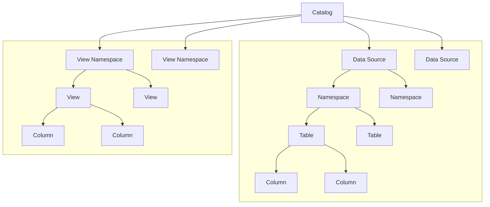

---
tags:
  - Enterprise Option
displayed_sidebar: docsJapanese
---

# ScalarDB Analytics の設計

import Tabs from "@theme/Tabs";
import TabItem from "@theme/TabItem";
import TranslationBanner from '/src/components/_translation-ja-jp.mdx';

<TranslationBanner />

ScalarDB Analytics は ScalarDB の分析コンポーネントです。ScalarDB と同様に、PostgreSQL や MySQL などの RDBMS から Cassandra や DynamoDB などの NoSQL データベースまで、多様なデータソースを単一の論理データベースに統合します。これにより、複数のデータベースにわたってシームレスに分析クエリを実行することができます。

ScalarDB Analytics は主にユニバーサルデータカタログとクエリエンジンの2つのコンポーネントから構成されています。

- **ユニバーサルデータカタログ**は、複数のカタログを処理する柔軟なメタデータ管理システムです。カタログはデータソースとビューの独立した論理的なグループ化を提供し、多様なデータ環境の体系的な管理を可能にします。
- **クエリエンジン**はユニバーサルデータカタログに対してクエリを実行します。ScalarDB Analyticsは基盤となるデータソースとのインターフェースを行うための適切なデータコネクタを提供します。

ScalarDB Analyticsはデータカタログとクエリエンジンが分離されたデカップルドアーキテクチャを採用しています。この設計により、拡張可能なアーキテクチャを通じて様々な既存のクエリエンジンとの統合が可能になります。その結果、特定の要件に基づいて異なるクエリエンジンを選択し、同じデータカタログに対してクエリを実行することができます。

## ユニバーサルデータカタログ

ユニバーサルデータカタログはいくつかのレベルで設定され、以下のように構造化されています：



これらのレベルの定義は以下の通りです：

- **Catalog**（カタログ）はすべてのデータソース情報を含むフォルダです。例えば、分析データ用の `analytics_catalog` と日常業務用の `operational_catalog` という2つのカタログを持つことができます。
- **Data source**（データソース）は接続する各データソースを表します。各データソースについて、以下のような重要な情報を保存します：
  - データソースの種類（PostgreSQL、Cassandra など）
  - 接続方法（接続詳細とパスワード）
  - データソースがサポートする特別な機能（トランザクションなど）
- **Namespace**（名前空間）はデータソース内の関連するテーブルをグループ化するサブフォルダのようなものです。PostgreSQL ではスキーマ、Cassandra ではキースペースと呼ばれます。フォルダ内のフォルダのように、複数レベルの名前空間を持つことができます。
- **Table**（テーブル）は実際のデータが存在する場所です。各テーブルについて、以下を追跡します：
  - どのような列があるか
  - 各列がどのタイプのデータを格納できるか
  - 列が空（null）になれるかどうか
- **View namespace**（ビュー名前空間）はビュー用の特別なフォルダです。1つのデータソースに紐づく通常の名前空間とは異なり、ビュー名前空間は複数のデータソースと同時に連携できます。
- **View**（ビュー）は以下のことができる仮想テーブルのようなものです：
  - データをよりシンプルな方法で表示する（ScalarDB テーブルの技術的な列を隠すなど）
  - SQLクエリを使用して異なるソースからデータを結合する
  - 各ビューはテーブルと同様に、特定のタイプと空の値に関するルールを持つ独自の列を持っています。

### サポートされているデータ型

ScalarDB Analytics は様々なデータソースにわたって幅広いデータ型をサポートしています。ユニバーサルデータカタログはこれらのデータ型を共通のタイプセットにマッピングし、ソース間の互換性と一貫性を確保します。以下のリストは ScalarDB Analytics でサポートされているデータ型を示しています：

- `BYTE`
- `SMALLINT`
- `INT`
- `BIGINT`
- `FLOAT`
- `DOUBLE`
- `DECIMAL`
- `TEXT`
- `BLOB`
- `BOOLEAN`
- `DATE`
- `TIME`
- `TIMESTAMP`
- `TIMESTAMPTZ`
- `DURATION`
- `INTERVAL`

### データソース別のカタログ情報マッピング

データソースを ScalarDB Analytics に登録する際、データソースのカタログ情報（名前空間、テーブル、列など）が解決され、ユニバーサルデータカタログに登録されます。データソースのカタログ情報を解決するために、データソース側の特定のオブジェクトがユニバーサルデータカタログオブジェクトにマッピングされます。このマッピングはカタログレベルのマッピングとデータ型マッピングの2つの部分で構成されています。以下のセクションでは、ScalarDB Analytics が各データソースからカタログレベルとデータ型をユニバーサルデータカタログにどのようにマッピングするかを説明します。

#### カタログレベルのマッピング

カタログレベルのマッピングは、データソースから名前空間名、テーブル名、および列名をユニバーサルデータカタログへのマッピングです。各データソースでのカタログレベルのマッピングを確認するには、データソースを選択してください。

<Tabs groupId="data-source" queryString>
  <TabItem value="scalardb" label="ScalarDB" default>
    ScalarDB のカタログ情報は ScalarDB Analytics によって自動的に解決されます。カタログレベルのオブジェクトは以下のようにマッピングされます：

    - ScalarDB 名前空間は名前空間にマッピングされます。したがって、ScalarDB データソースの名前空間は常に単一レベルで、名前空間名のみで設定されます。
    - ScalarDB テーブルはテーブルにマッピングされます。
    - ScalarDB 列は列にマッピングされます。

  </TabItem>

  <TabItem value="postgresql" label="PostgreSQL" default>
    PostgreSQL のカタログ情報は ScalarDB Analytics によって自動的に解決されます。カタログレベルのオブジェクトは以下のようにマッピングされます：

    - PostgreSQL スキーマは名前空間にマッピングされます。したがって、PostgreSQL データソースの名前空間は常に単一レベルで、スキーマ名のみで設定されます。
        - ユーザー定義スキーマのみが名前空間にマッピングされます。以下のシステムスキーマは無視されます：
          - `information_schema`
          - `pg_catalog`
    - PostgreSQL テーブルはテーブルにマッピングされます。
    - PostgreSQL 列は列にマッピングされます。

  </TabItem>
  <TabItem value="mysql" label="MySQL">
    MySQL のカタログ情報は ScalarDB Analytics によって自動的に解決されます。カタログレベルのオブジェクトは以下のようにマッピングされます：

    - MySQL データベースは名前空間にマッピングされます。したがって、MySQL データソースの名前空間は常に単一レベルで、データベース名のみで設定されます。
        - ユーザー定義データベースのみが名前空間にマッピングされます。以下のシステムデータベースは無視されます：
            - `mysql`
            - `sys`
            - `information_schema`
            - `performance_schema`
    - MySQL テーブルはテーブルにマッピングされます。
    - MySQL 列は列にマッピングされます。

  </TabItem>
  <TabItem value="oracle" label="Oracle">
    Oracle のカタログ情報は ScalarDB Analytics によって自動的に解決されます。カタログレベルのオブジェクトは以下のようにマッピングされます：

    - Oracle スキーマは名前空間にマッピングされます。したがって、Oracle データソースの名前空間は常に単一レベルで、スキーマ名のみで設定されます。
        - ユーザー定義スキーマのみが名前空間にマッピングされます。以下のシステムスキーマは無視されます：
            - `ANONYMOUS`
            - `APPQOSSYS`
            - `AUDSYS`
            - `CTXSYS`
            - `DBSNMP`
            - `DGPDB_INT`
            - `DBSFWUSER`
            - `DVF`
            - `DVSYS`
            - `GGSYS`
            - `GSMADMIN_INTERNAL`
            - `GSMCATUSER`
            - `GSMROOTUSER`
            - `GSMUSER`
            - `LBACSYS`
            - `MDSYS`
            - `OJVMSYS`
            - `ORDDATA`
            - `ORDPLUGINS`
            - `ORDSYS`
            - `OUTLN`
            - `REMOTE_SCHEDULER_AGENT`
            - `SI_INFORMTN_SCHEMA`
            - `SYS`
            - `SYS$UMF`
            - `SYSBACKUP`
            - `SYSDG`
            - `SYSKM`
            - `SYSRAC`
            - `SYSTEM`
            - `WMSYS`
            - `XDB`
            - `DIP`
            - `MDDATA`
            - `ORACLE_OCM`
            - `XS$NULL`

  </TabItem>
  <TabItem value="sql-server" label="SQL Server">
    SQL Server のカタログ情報は ScalarDB Analytics によって自動的に解決されます。カタログレベルのオブジェクトは以下のようにマッピングされます：

    - SQL Server データベースとスキーマは共に名前空間にマッピングされます。したがって、SQL Server データソースの名前空間は常に二段階で、データベース名とスキーマ名で構成されます。
        - ユーザー定義データベースのみが名前空間にマッピングされます。以下のシステムデータベースは無視されます：
            - `sys`
            - `guest`
            - `INFORMATION_SCHEMA`
            - `db_accessadmin`
            - `db_backupoperator`
            - `db_datareader`
            - `db_datawriter`
            - `db_ddladmin`
            - `db_denydatareader`
            - `db_denydatawriter`
            - `db_owner`
            - `db_securityadmin`
        - ユーザー定義スキーマのみが名前空間にマッピングされます。以下のシステムスキーマは無視されます：
            - `master`
            - `model`
            - `msdb`
            - `tempdb`
    - SQL Server テーブルはテーブルにマッピングされます。
    - SQL Server 列は列にマッピングされます。

  </TabItem>
  <TabItem value="dynamodb" label="DynamoDB">
    DynamoDB はスキーマレスであるため、DynamoDB データソースを登録する際に以下のような形式のJSONを使用してカタログ情報を明示的に指定する必要があります：

    ```json
    {
        "namespaces": [
            {
                "name": "<NAMESPACE_NAME>",
                "tables": [
                    {
                        "name": "<TABLE_NAME>",
                        "columns": [
                            {
                                "name": "<COLUMN_NAME>",
                                "type": "<COLUMN_TYPE>"
                            },
                            ...
                        ]
                    },
                    ...
                ]
            },
            ...
        ]
    }
    ```

    指定した JSON では、任意の名前空間名を使用できますが、テーブル名は DynamoDB のテーブル名と一致する必要があり、列名と型は DynamoDB のフィールド名と型と一致する必要があります。

  </TabItem>
</Tabs>

#### データ型マッピング

基盤となるデータソースのネイティブデータ型は ScalarDB Analytics のデータ型にマッピングされます。各データソースでのデータ型マッピングを確認するには、データソースを選択してください。

<Tabs groupId="data-source" queryString>
  <TabItem value="scalardb" label="ScalarDB" default>
    | **ScalarDB データ型**      | **ScalarDB Analytics データ型** |
    |:------------------------------|:---------------------------------|
    | `BOOLEAN`                     | `BOOLEAN`                        |
    | `INT`                         | `INT`                            |
    | `BIGINT`                      | `BIGINT`                         |
    | `FLOAT`                       | `FLOAT`                          |
    | `DOUBLE`                      | `DOUBLE`                         |
    | `TEXT`                        | `TEXT`                           |
    | `BLOB`                        | `BLOB`                           |
    | `DATE`                        | `DATE`                           |
    | `TIME`                        | `TIME`                           |
    | `TIMESTAMP`                   | `TIMESTAMP`                      |
    | `TIMESTAMPTZ`                 | `TIMESTAMPTZ`                    |
  </TabItem>
  <TabItem value="postgresql" label="PostgreSQL" default>
    | **PostgreSQL データ型**      | **ScalarDB Analytics データ型** |
    |:------------------------------|:---------------------------------|
    | `integer`                     | `INT`                            |
    | `bigint`                      | `BIGINT`                         |
    | `real`                        | `FLOAT`                          |
    | `double precision`            | `DOUBLE`                         |
    | `smallserial`                 | `SMALLINT`                       |
    | `serial`                      | `INT`                            |
    | `bigserial`                   | `BIGINT`                         |
    | `char`                        | `TEXT`                           |
    | `varchar`                     | `TEXT`                           |
    | `text`                        | `TEXT`                           |
    | `bpchar`                      | `TEXT`                           |
    | `boolean`                     | `BOOLEAN`                        |
    | `bytea`                       | `BLOB`                           |
    | `date`                        | `DATE`                           |
    | `time`                        | `TIME`                           |
    | `time with time zone`         | `TIME`                           |
    | `time without time zone`      | `TIME`                           |
    | `timestamp`                   | `TIMESTAMP`                      |
    | `timestamp with time zone`    | `TIMESTAMPTZ`                      |
    | `timestamp without time zone` | `TIMESTAMP`                      |
  </TabItem>
  <TabItem value="mysql" label="MySQL">
    | **MySQL データ型**    | **ScalarDB Analytics データ型** |
    |:-----------------------|:---------------------------------|
    | `bit`                  | `BOOLEAN`                        |
    | `bit(1)`               | `BOOLEAN`                        |
    | `bit(x)` if *x >= 2*   | `BLOB`                           |
    | `tinyint`              | `SMALLINT`                       |
    | `tinyint(1)`           | `BOOLEAN`                        |
    | `boolean`              | `BOOLEAN`                        |
    | `smallint`             | `SMALLINT`                       |
    | `smallint unsigned`    | `INT`                            |
    | `mediumint`            | `INT`                            |
    | `mediumint unsigned`   | `INT`                            |
    | `int`                  | `INT`                            |
    | `int unsigned`         | `BIGINT`                         |
    | `bigint`               | `BIGINT`                         |
    | `float`                | `FLOAT`                          |
    | `double`               | `DOUBLE`                         |
    | `real`                 | `DOUBLE`                         |
    | `char`                 | `TEXT`                           |
    | `varchar`              | `TEXT`                           |
    | `text`                 | `TEXT`                           |
    | `binary`               | `BLOB`                           |
    | `varbinary`            | `BLOB`                           |
    | `blob`                 | `BLOB`                           |
    | `date`                 | `DATE`                           |
    | `time`                 | `TIME`                           |
    | `datetime`             | `TIMESTAMP`                      |
    | `timestamp`            | `TIMESTAMPTZ`                      |
  </TabItem>
  <TabItem value="oracle" label="Oracle">
    | **Oracle データ型**               | **ScalarDB Analytics データ型** |
    |:-----------------------------------|:---------------------------------|
    | `NUMBER` if *scale = 0*            | `BIGINT`                         |
    | `NUMBER` if *scale > 0*            | `DOUBLE`                         |
    | `FLOAT` if *precision ≤ 53*        | `DOUBLE`                         |
    | `BINARY_FLOAT`                     | `FLOAT`                          |
    | `BINARY_DOUBLE`                    | `DOUBLE`                         |
    | `CHAR`                             | `TEXT`                           |
    | `NCHAR`                            | `TEXT`                           |
    | `VARCHAR2`                         | `TEXT`                           |
    | `NVARCHAR2`                        | `TEXT`                           |
    | `CLOB`                             | `TEXT`                           |
    | `NCLOB`                            | `TEXT`                           |
    | `BLOB`                             | `BLOB`                           |
    | `BOOLEAN`                          | `BOOLEAN`                        |
    | `DATE`                             | `DATE`                           |
    | `TIMESTAMP`                        | `TIMESTAMPTZ`                      |
    | `TIMESTAMP WITH TIME ZONE`         | `TIMESTAMPTZ`                      |
    | `TIMESTAMP WITH LOCAL TIME ZONE`   | `TIMESTAMP`                      |
    | `RAW`                              | `BLOB`                           |
  </TabItem>
  <TabItem value="sql-server" label="SQL Server">
    | **SQL Server データ型**   | **ScalarDB Analytics データ型** |
    |:---------------------------|:---------------------------------|
    | `bit`                      | `BOOLEAN`                        |
    | `tinyint`                  | `SMALLINT`                       |
    | `smallint`                 | `SMALLINT`                       |
    | `int`                      | `INT`                            |
    | `bigint`                   | `BIGINT`                         |
    | `real`                     | `FLOAT`                          |
    | `float`                    | `DOUBLE`                         |
    | `float(n)` if *n ≤ 24*     | `FLOAT`                          |
    | `float(n)` if *n ≥ 25*     | `DOUBLE`                         |
    | `binary`                   | `BLOB`                           |
    | `varbinary`                | `BLOB`                           |
    | `char`                     | `TEXT`                           |
    | `varchar`                  | `TEXT`                           |
    | `nchar`                    | `TEXT`                           |
    | `nvarchar`                 | `TEXT`                           |
    | `ntext`                    | `TEXT`                           |
    | `text`                     | `TEXT`                           |
    | `date`                     | `DATE`                           |
    | `time`                     | `TIME`                           |
    | `datetime`                 | `TIMESTAMP`                      |
    | `datetime2`                | `TIMESTAMP`                      |
    | `smalldatetime`            | `TIMESTAMP`                      |
    | `datetimeoffset`           | `TIMESTAMPTZ`                      |
  </TabItem>
  <TabItem value="dynamodb" label="DynamoDB">
    | **DynamoDB データ型**   | **ScalarDB Analytics データ型** |
    |:-------------------------|:---------------------------------|
    | `Number`                 | `BYTE`                           |
    | `Number`                 | `SMALLINT`                       |
    | `Number`                 | `INT`                            |
    | `Number`                 | `BIGINT`                         |
    | `Number`                 | `FLOAT`                          |
    | `Number`                 | `DOUBLE`                         |
    | `Number`                 | `DECIMAL`                        |
    | `String`                 | `TEXT`                           |
    | `Binary`                 | `BLOB`                           |
    | `Boolean`                | `BOOLEAN`                        |

:::warning

ScalarDB Analytics に指定されたデータ型として `Number` 型のフィールド値が解析可能であることが必要です。例えば、`Number` 型のフィールドに対応する列が `INT` 型として指定されている場合、その値は整数でなければなりません。値が整数でない場合、クエリの実行時にエラーが発生します。

:::

  </TabItem>
</Tabs>

## クエリエンジン

クエリエンジンはユニバーサルデータカタログとともに独立したコンポーネントであり、ユニバーサルデータカタログに登録されているデータソースに対してクエリを実行し、結果をユーザーに返す責任を持ちます。ScalarDB Analytics は現在、組み込みのクエリエンジンを提供していません。代わりに、通常はクエリエンジンのプラグインとして提供される既存のクエリエンジンと統合されるように設計されています。

クエリを実行するとき、ScalarDB Analytics クエリエンジンプラグインは以下のように動作します。

1. ユニバーサルデータカタログ API を呼び出してカタログメタデータを取得します（データソースの場所、テーブルオブジェクト識別子、テーブルスキーマなど）。
2. カタログメタデータを使用してデータソースコネクタをセットアップします。
3. カタログメタデータに基づいてクエリ最適化情報をクエリエンジンに提供します。
4. データソースコネクタを使用してデータソースからデータを読み取ります。

ScalarDB Analytics はこれらのプロセスを内部的に管理します。通常のクエリ実行と同じ方法で、クエリエンジン API を使用してユニバーサルデータカタログに対してクエリを実行するだけで済みます。

ScalarDB Analytics は現在、クエリエンジンとして Apache Spark をサポートしています。ScalarDB Analytics を Spark で使用する方法の詳細については、[ScalarDB Analytics を通じた分析クエリの実行](./run-analytical-queries.mdx)を参照してください。
