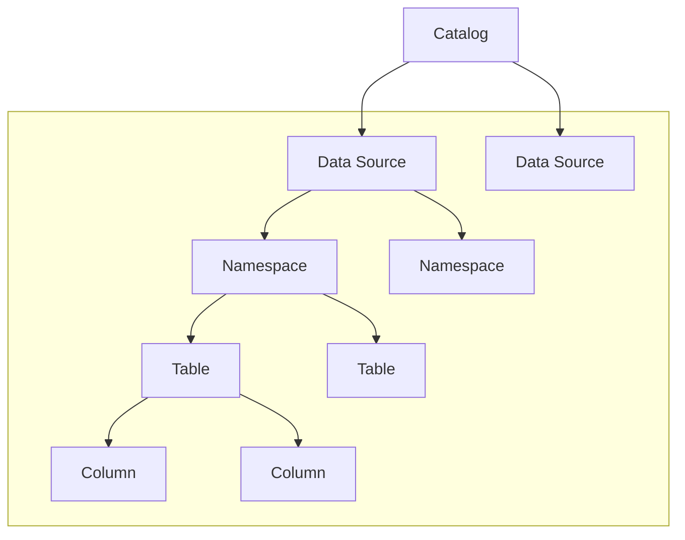

---
tags:
  - Enterprise Option
displayed_sidebar: docsJapanese
---

# ScalarDB Analytics の設計と実装

import TranslationBanner from '/src/components/_translation-ja-jp.mdx';

<TranslationBanner />

ScalarDB Analytics は ScalarDB の分析コンポーネントです。ScalarDB と同様に、PostgreSQL や MySQL などの RDBMS から Cassandra や DynamoDB などの NoSQL データベースまで、多様なデータソースを単一の論理データベースに統合します。これにより、複数のデータベースにわたってシームレスに分析クエリを実行することができます。

## 設計

ScalarDB Analytics は主にユニバーサルデータカタログとクエリエンジンの2つのコンポーネントから構成されています。

- **ユニバーサルデータカタログ**は、複数のカタログを処理する柔軟なメタデータ管理システムです。カタログはデータソースの独立した論理的なグループ化を提供し、多様なデータ環境の体系的な管理を可能にします。
- **クエリエンジン**はユニバーサルデータカタログに対してクエリを実行します。ScalarDB Analyticsは基盤となるデータソースとのインターフェースを行うための適切なデータコネクタを提供します。

ScalarDB Analyticsはデータカタログとクエリエンジンが分離されたデカップルドアーキテクチャを採用しています。この設計により、拡張可能なアーキテクチャを通じて様々な既存のクエリエンジンとの統合が可能になります。その結果、特定の要件に基づいて異なるクエリエンジンを選択し、同じデータカタログに対してクエリを実行することができます。

### ユニバーサルデータカタログ

ユニバーサルデータカタログはいくつかのレベルで設定され、以下のように構造化されています:

これらのレベルの定義は以下の通りです:

- **Catalog** (カタログ) はすべてのデータソース情報を含むフォルダです。例えば、分析データ用の `analytics_catalog` と日常業務用の `operational_catalog` という2つのカタログを持つことができます。
- **Data source** (データソース) は接続する各データソースを表します。各データソースについて、以下のような重要な情報を保存します:
  - データソースの種類 (PostgreSQL、Cassandra など)
  - 接続方法 (接続詳細とパスワード)
  - データソースがサポートする特別な機能 (トランザクションなど)
- **Namespace** (名前空間) はデータソース内の関連するテーブルをグループ化するサブフォルダのようなものです。PostgreSQL ではスキーマ、Cassandra ではキースペースと呼ばれます。フォルダ内のフォルダのように、複数レベルの名前空間を持つことができます。
- **Table** (テーブル) は実際のデータが存在する場所です。各テーブルについて、以下を追跡します:
  - どのような列があるか
  - 各列がどのタイプのデータを格納できるか
  - 列が空 (null) になれるかどうか

#### データソース統合

データソースを ScalarDB Analytics に登録する際、2種類のマッピングが行われます:

1. **カタログ構造マッピング:** データソースのカタログ情報 (名前空間、テーブル、列) が解決され、ユニバーサルデータカタログ構造にマッピングされます
2. **データ型マッピング:** 各データソースのネイティブデータ型が、[サポートされているデータ型](#サポートされているデータ型)にマッピングされます

これらのマッピングにより、異なるデータベースシステム間での互換性と一貫性が確保されます。特定のデータベースがどのようにマッピングされるかの詳細については、[データソース別のカタログ構造マッピング](./reference-data-source.mdx#データソース別のカタログ構造マッピング)を参照してください。

### クエリエンジン

クエリエンジンはユニバーサルデータカタログとともに独立したコンポーネントであり、ユニバーサルデータカタログに登録されているデータソースに対してクエリを実行し、結果をユーザーに返す責任を持ちます。ScalarDB Analytics は現在、組み込みのクエリエンジンを提供していません。代わりに、通常はクエリエンジンのプラグインとして提供される既存のクエリエンジンと統合されるように設計されています。

クエリを実行するとき、ScalarDB Analytics クエリエンジンプラグインは以下のように動作します。

1. ユニバーサルデータカタログ API を呼び出してカタログメタデータを取得します (データソースの場所、テーブルオブジェクト識別子、テーブルスキーマなど)。
2. カタログメタデータを使用してデータソースコネクタをセットアップします。
3. カタログメタデータに基づいてクエリ最適化情報をクエリエンジンに提供します。
4. データソースコネクタを使用してデータソースからデータを読み取ります。

ScalarDB Analytics はこれらのプロセスを内部的に管理します。通常のクエリ実行と同じ方法で、クエリエンジン API を使用してユニバーサルデータカタログに対してクエリを実行するだけで済みます。

ScalarDB Analytics は現在、クエリエンジンとして Apache Spark をサポートしています。ScalarDB Analytics を Spark で使用する方法の詳細については、[ScalarDB Analytics を通じた分析クエリの実行](./run-analytical-queries.mdx)を参照してください。

## 実装

ScalarDB Analytics は、上記の設計を実装するために以下のコンポーネントを提供します。

### ScalarDB Analytics サーバー

ScalarDB Analytics サーバーは、ユニバーサルデータカタログを管理するサーバーサイドコンポーネントです。データソース設定、名前空間構造、テーブルスキーマなどのカタログメタデータを保存・管理します。

サーバーは、クエリエンジンや CLI ツールがユニバーサルデータカタログと対話するための API を公開しています。サーバーのセットアップとカタログの作成方法の詳細については、[ScalarDB Analytics カタログの作成](./create-scalardb-analytics-catalog.mdx)を参照してください。

#### サポートされているデータ型

ScalarDB Analytics は様々なデータソースにわたって幅広いデータ型をサポートしています。ユニバーサルデータカタログはこれらのデータ型を共通のタイプセットにマッピングし、ソース間の互換性と一貫性を確保します。以下のリストは ScalarDB Analytics でサポートされているデータ型を示しています:

- `BYTE`
- `SMALLINT`
- `INT`
- `BIGINT`
- `FLOAT`
- `DOUBLE`
- `DECIMAL`
- `TEXT`
- `BLOB`
- `BOOLEAN`
- `DATE`
- `TIME`
- `TIMESTAMP`
- `TIMESTAMPTZ`
- `DURATION`
- `INTERVAL`

これらのデータ型はすべてのデータソースで使用され、異種データベースのクエリに統一された型システムを提供します。

### ScalarDB Analytics CLI

ScalarDB Analytics CLI は、ユニバーサルデータカタログを管理するためのコマンドラインツールです。カタログの作成、データソースの登録、登録済みデータベースの構造の確認などに使用できます。

CLI は、カタログ API を通じて ScalarDB Analytics サーバーと通信します。サーバー接続は、プロパティファイルでサーバーホストとポートを指定して設定します。CLI の設定と利用可能なコマンドの詳細については、[CLI クライアント設定](./configurations.mdx#cli-クライアント設定)と [ScalarDB Analytics CLI コマンドリファレンス](./reference-cli-command.mdx)を参照してください。

### クエリエンジン統合

ScalarDB Analytics は、ユニバーサルデータカタログに対してクエリを実行するために既存のクエリエンジンと統合します。

#### Apache Spark プラグイン

ScalarDB Analytics は現在、クエリエンジンとして Apache Spark をサポートしています。統合は ScalarDB Analytics の Apache Spark 用クエリエンジンプラグインを通じて提供されます。このプラグインは ScalarDB Analytics サーバーに接続するカスタム Spark カタログ (`ScalarDbAnalyticsCatalog`) を実装しています。このプラグインは、ユニバーサルデータカタログに登録されたデータソースを Spark テーブルとして公開し、Spark SQL を使用してクエリを実行できるようにします。

この統合により、複数の異種データソースに対して任意の Spark SQL クエリをシームレスに実行できます。ScalarDB Analytics を Spark で設定・使用する方法の詳細については、[ScalarDB Analytics を通じた分析クエリの実行](./run-analytical-queries.mdx)を参照してください。
