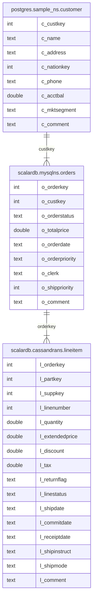

---
tags:
  - Enterprise Option
displayed_sidebar: docsJapanese
---

# ScalarDB Analytics をはじめよう

import WarningLicenseKeyContact from "/src/components/ja-jp/_warning-license-key-contact.mdx";
import TranslationBanner from "/src/components/_translation-ja-jp.mdx";

<TranslationBanner />

このクイックスタートガイドでは、ScalarDB Analytics をセットアップし、PostgreSQL、MySQL、Cassandra を含む異なるデータベース間でフェデレーテッドクエリを実行する方法を説明します。ScalarDB Analytics とその主要な利点の概要については、[ScalarDB 概要](../overview.mdx)および [ScalarDB 設計](../design.mdx)ページを参照してください。

## 何を構築するか

このチュートリアルでは、以下のようなサンプル電子商取引分析環境をセットアップします：

- 顧客データは PostgreSQL に格納
- 注文データは ScalarDB を介して MySQL で管理
- 明細項目の詳細は Cassandra に保存され、ScalarDB トランザクションを通じて更新

3つのデータベースすべてにまたがってデータを結合する分析クエリを実行し、ビジネスインサイトを得ます。ソースコードは [https://github.com/scalar-labs/scalardb-samples/tree/main/scalardb-analytics-sample](https://github.com/scalar-labs/scalardb-samples/tree/main/scalardb-analytics-sample) で入手できます。

## 前提条件

- [Docker](https://www.docker.com/get-started/) 20.10以降と [Docker Compose](https://docs.docker.com/compose/install/) V2以降

<WarningLicenseKeyContact product="ScalarDB Analytics" />

## ステップ 1: 環境をセットアップする

このセクションでは、ScalarDB Analytics 環境をセットアップする方法について説明します。

### リポジトリをクローンする

**ターミナル** を開き、ScalarDB サンプルリポジトリをクローンします：

```console
git clone https://github.com/scalar-labs/scalardb-samples
cd scalardb-samples/scalardb-analytics-sample
```

### ライセンスを設定する

ScalarDB Analytics ライセンスを追加するには、`config/scalardb-analytics-server.properties` を開きます。次に、ライセンス設定行のコメントを外して更新し、`<YOUR_LICENSE_KEY>` と `<YOUR_LICENSE_CERT_PEM>` を実際のライセンス情報に置き換えます：

```properties
# License configuration (required for production)
scalar.db.analytics.server.licensing.license_key=<YOUR_LICENSE_KEY>
scalar.db.analytics.server.licensing.license_check_cert_pem=<YOUR_LICENSE_CERT_PEM>
```

## ステップ 2: サンプルデータベースを設定する

サンプルデータベースをセットアップするには、次のコマンドを実行します:

```console
docker compose up -d --wait
```

このコマンドは、以下のサービスをローカルで起動します：

- **ScalarDB Analytics コンポーネント:**
  - **ScalarDB Analytics サーバー:** すべてのデータソースのメタデータを管理し、クエリ実行のための統一インターフェースを提供します。
- **サンプルデータベース:**
  - **PostgreSQL:** ScalarDB 管理外データベースとして使用（直接アクセス）
  - **Cassandra および MySQL:** ScalarDB 管理下データベースとして使用（ScalarDB のトランザクションレイヤー経由でアクセス）

このガイドでは、PostgreSQL は ScalarDB トランザクションによって管理されない **ScalarDB 管理外データベース** と呼ばれ、Cassandra および MySQL は ScalarDB トランザクションによって管理される **ScalarDB 管理下データベース** と呼ばれます。

サンプルデータは初回セットアップ時にすべてのデータベースに自動的にロードされます。セットアップが完了すると、次のテーブルが使用可能になります:

- PostgreSQL:
  - `sample_ns.customer`
- ScalarDB (Cassandra):
  - `cassandrans.lineitem`
- ScalarDB (MySQL):
  - `mysqlns.orders`

ScalarDB 内では、`cassandrans` と `mysqlns` がそれぞれ Cassandra と MySQL にマッピングされます。

列定義やデータ型を含むテーブルスキーマの詳細については、[スキーマの詳細](#スキーマの詳細)を参照してください。サンプルデータがこれらのテーブルに正常にロードされていることを確認してください。

## ステップ 3: ScalarDB Analytics CLI を使用してデータソースを登録する

分析クエリを実行する前に、データソースを ScalarDB Analytics サーバーに登録する必要があります。これは ScalarDB Analytics CLI を使用して行うことができます。

### カタログを作成する

まず、データソースを整理するための新しいカタログを作成します：

```console
docker compose run --rm scalardb-analytics-cli catalog create --catalog sample_catalog
```

### ScalarDB をデータソースとして登録する

ScalarDB が管理するデータベースを登録します：

```console
docker compose run --rm scalardb-analytics-cli data-source register \
  --data-source-json /config/data-sources/scalardb.json
```

これにより、ScalarDB が管理する Cassandra と MySQL の両方のテーブルが登録されます。

### PostgreSQL をデータソースとして登録する

PostgreSQL データベースを登録します：

```console
docker compose run --rm scalardb-analytics-cli data-source register \
  --data-source-json /config/data-sources/postgres.json
```

## ステップ 4: Spark SQL コンソールを起動する

Spark SQL コンソールを起動するには、次のコマンドを実行します:

```console
docker compose run --rm spark-sql
```

Spark SQL コンソールを起動すると、**spark-defaults.conf** の設定で ScalarDB Analytics カタログが初期化され、`sample_catalog` という名前の Spark カタログとして登録されます。

### 名前空間マッピング

設定されたデータソースの以下のテーブルは、Spark SQL テーブルにマッピングされ、異なるデータソース間でのシームレスなクエリが可能になります：

- PostgreSQL:
  - `sample_catalog.postgres.sample_ns.customer`
- ScalarDB (Cassandra):
  - `sample_catalog.scalardb.cassandrans.lineitem`
- ScalarDB (MySQL):
  - `sample_catalog.scalardb.mysqlns.orders`

## ステップ 5: 分析クエリを実行する

ScalarDB Analytics 環境のセットアップが完了したので、Spark SQL コンソールを使用してサンプルデータに対して分析クエリを実行できます。

### クエリ 1: 出荷パフォーマンスと返品の分析

以下の SQL クエリは、Cassandra の明細項目データを調査することで、基本的な分析機能を示します。このクエリは以下のようなビジネス上の質問に答えるのに役立ちます：

- 返品された商品対正常に出荷された商品の割合は？
- 返品の財務的影響は？
- 注文ステータスによって価格設定はどう異なるか？

このクエリは、返品ステータスとラインステータス別にグループ化された主要メトリックを計算します：

```sql
SELECT
        l_returnflag,
        l_linestatus,
        sum(l_quantity) AS sum_qty,
        sum(l_extendedprice) AS sum_base_price,
        sum(l_extendedprice * (1 - l_discount)) AS sum_disc_price,
        sum(l_extendedprice * (1 - l_discount) * (1 + l_tax)) AS sum_charge,
        avg(l_quantity) AS avg_qty,
        avg(l_extendedprice) AS avg_price,
        avg(l_discount) AS avg_disc,
        count(*) AS count_order
FROM
        sample_catalog.scalardb.cassandrans.lineitem
WHERE
        to_date(l_shipdate, 'yyyy-MM-dd') <= date '1998-12-01' - 3
GROUP BY
        l_returnflag,
        l_linestatus
ORDER BY
        l_returnflag,
        l_linestatus;
```

次の出力が表示されます:

```console
A       F       1519    2374824.6560278563      1387364.2207725341      1962763.4654265852      26.649122807017545      41663.590456629056      0.41501802923479575    57
N       F       98      146371.2295412012       85593.96776336085       121041.55837332775      32.666666666666664      48790.409847067065      0.40984706454007996    3
N       O       5374    8007373.247086477       4685647.785126835       6624210.945739046       24.427272727272726      36397.15112312035       0.4147594809559689     220
R       F       1461    2190869.9676265526      1284178.4378283697      1814151.2807494882      25.189655172413794      37773.62013149229       0.41323493790730753    58
```

### クエリ 2: 収益最適化のためのクロスデータベース分析

以下の SQL クエリは、ScalarDB Analytics の主要な機能を示します：データ移動なしで異なるデータベース間のデータを結合する機能です。具体的には、このクエリは ETL パイプラインなどによるデータ移動を必要とせずに、PostgreSQL の顧客テーブル、MySQL の注文テーブル、Cassandra の明細項目を結合します。このクエリは以下のようなビジネス上の質問に答えるのに役立ちます：

- フルフィルメントを優先するために、特定の顧客セグメントからのまだ出荷されていない高額注文は何か？

このクエリは、AUTOMOBILE セグメントの顧客の未出荷注文を収益順に見つけます：

```sql
SELECT
    l_orderkey,
    sum(l_extendedprice * (1 - l_discount)) AS revenue,
    o_orderdate,
    o_shippriority
FROM
    sample_catalog.postgres.sample_ns.customer,
    sample_catalog.scalardb.mysqlns.orders,
    sample_catalog.scalardb.cassandrans.lineitem
WHERE
    c_mktsegment = 'AUTOMOBILE'
    AND c_custkey = o_custkey
    AND l_orderkey = o_orderkey
    AND o_orderdate < '1995-03-15'
    AND l_shipdate > '1995-03-15'
GROUP BY
    l_orderkey,
    o_orderdate,
    o_shippriority
ORDER BY
    revenue DESC,
    o_orderdate,
    l_orderkey
LIMIT 10;
```

次の出力が表示されます:

```console
1071617 128186.99915996166      1995-03-10      0
1959075 33104.51278645416       1994-12-23      0
430243  19476.115819260962      1994-12-24      0
```

結果は、注文キー `1071617` の注文の出荷を優先すべきであることを示しています。

:::note

このサンプルチュートリアルでインポートされたテーブルに対して、Apache Spark および Spark SQL がサポートする任意のクエリを実行することもできます。ScalarDB Analytics は Spark SQL がサポートするすべてのクエリをサポートしているため、例に示されている選択 (フィルタリング)、結合、集計、順序付けだけでなく、ウィンドウ関数、ラテラル結合、その他のさまざまな操作も実行できます。

Spark SQL がサポートするクエリの種類を確認するには、[Spark SQL ドキュメント](https://spark.apache.org/docs/latest/sql-ref.html)を参照してください。

:::

## ステップ 6: サンプルアプリケーションを停止する

サンプルアプリケーションを停止し、関連付けられているすべてのボリュームを削除するには、次のコマンドを実行します。このアクションにより、すべてのサービスがシャットダウンされ、ボリュームに保存されているすべての永続データが削除され、アプリケーションの状態がリセットされます:

```console
docker compose down -v
```

## リファレンス

### スキーマの詳細

次のエンティティ関係図は、PostgreSQL、MySQL、Cassandra のテーブル間の関係を示しており、外部キーによって顧客、注文、明細項目がリンクされています。



- `postgres.sample_ns.customer` は PostgreSQL のテーブルであり、ScalarDB によって管理されていません。
- `scalardb.mysqlns.orders` と `scalardb.cassandrans.lineitem` は ScalarDB のテーブルであり、それぞれ MySQL と Cassandra にマッピングされています。

テーブルの簡単な説明は次のとおりです:

- **`postgres.sample_ns.customer`.** 顧客に関する情報を表すテーブル。このテーブルには、顧客キー、名前、住所、電話番号、口座残高などの属性が含まれます。
- **`scalardb.mysqlns.orders`.** 顧客が行った注文に関する情報を含むテーブル。このテーブルには、注文キー、顧客キー、注文ステータス、注文日、注文優先度などの属性が含まれます。
- **`scalardb.cassandrans.lineitem`.** 注文に関連付けられた明細項目を表すテーブル。このテーブルには、注文キー、部品キー、サプライヤーキー、数量、価格、出荷日などの属性が含まれます。
