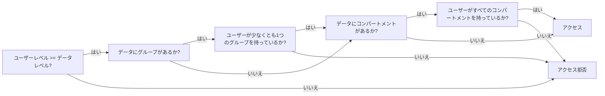
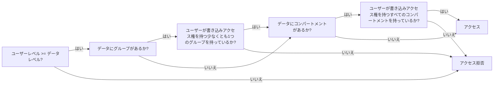

---
tags:
  - Enterprise Premium Option
  - Private Preview
displayed_sidebar: docsJapanese
---

# ユーザーアクセスをきめ細かく制御する

import WarningLicenseKeyContact from '/src/components/ja-jp/_warning-license-key-contact.mdx';
import TranslationBanner from '/src/components/_translation-ja-jp.mdx';

<TranslationBanner />

ScalarDB Cluster は、属性ベースのアクセス制御 (ABAC) と呼ばれるメカニズムを使用して、ユーザーをきめ細かく認証できます。このページでは、ScalarDB Cluster で ABAC を使用する方法について説明します。

## ABAC とは?

ABAC は ScalarDB Cluster のきめ細かいアクセス制御メカニズムであり、[単純な認証](./scalardb-auth-with-sql.mdx)によって実行されるテーブルレベルのアクセス制御だけでなく、レコードレベルのアクセス制御を可能にします。ABAC を使用すると、ユーザーは、ユーザーの属性とレコードの属性が一致する場合にのみ、特定のレコードにアクセスできます。たとえば、機密性の高いレコードへのアクセスを、必要な権限を持つユーザーのみに制限できます。このメカニズムは、複数のアプリケーションが同じテーブルを共有しているが、それぞれの権限に基づいて異なるセグメントにアクセスする必要がある場合にも役立ちます。

## ABAC を使用する理由

エンタープライズデータベースでは、多くの場合、行レベルのセキュリティまたは同様の代替手段が提供され、データベーステーブル内の行へのアクセスを制御できます。ただし、システムが複数のデータベースで構成されている場合は、各データベースを1つずつ同じ方法で設定する必要があります。異なる種類のデータベースを使用する場合は、各データベースの機能の違いを理解した上で各データベースを設定する必要があります。このような設定は負担が大きすぎ、エラーが発生しやすくなります。ABAC を使用すると、ScalarDB で複数のデータベースを管理する場合でも、1回設定するだけで済みます。

ほとんどのデータベースの行レベルのセキュリティ機能では、ストアドプロシージャなどの関数を使用してマッチングロジックを実装する必要があります。これにより、必要なロジックを実現するために大量のコードを記述することになり、負担が大きくなることがあります。対照的に、ABAC では、タグと呼ばれる属性を使用してマッチングロジックを設定できます。ABAC では、これらのタグを定義してユーザーとレコードに割り当てるだけでよいため、コーディングの必要がありません。タグは、柔軟かつ簡単な方法でマッチングロジックを指定できる複数のコンポーネントで構成されています。

## コンポーネント

ABAC には、タグやポリシーなどのいくつかのコンポーネントがあります。

### タグ

タグは、レベル、コンパートメント、グループの3つのコンポーネントで構成される単一の属性であり、ユーザーやデータに割り当てることができます。ユーザーに割り当てられたタグは `ユーザータグ` と呼ばれ、データに割り当てられたタグは `データタグ` と呼ばれます。

#### レベル

レベルコンポーネントはデータの機密性を示します。すべてのユーザータグとデータタグにはレベルが必要です。たとえば、ユーザーは `機密`、`機密性の高い`、`非常に機密性の高い` などのレベルを定義できます。

各レベルについて、スーパーユーザーは次の属性を定義します。

| 属性          | 説明                                                     |
|---------------|---------------------------------------------------------|
| 短い名前       | レベルの短い識別子。この名前は最大30文字まで含めることができます。 |
| 長い名前       | レベルの長く説明的な名前。                                  |
| レベル番号     | レベルのランクを表す数値。                                   |

:::note

スーパーユーザーは各レベル (および他のタグコンポーネント) の長い名前と短い名前の両方を定義しますが、ABAC の下で行を取得する際に表示されるのは短い名前のみです。ユーザーがタグを操作する際には、コンポーネントの短い名前のみを使用する必要があります。

:::

#### コンパートメント

コンパートメントコンポーネントはオプションであり、コンパートメントは互いに独立しています。通常、1つ以上のコンパートメントが定義され、データを異なるカテゴリに分類します。コンパートメントは、特定のデータタイプ、知識領域、地理的地域、または特別な承認が必要なプロジェクトを表すことがあります。たとえば、`HR`、`Finance`、`Accounting` などです。

各コンパートメントについて、スーパーユーザーは次の属性を定義します。

| 属性          | 説明                                                            |
|--------------|-----------------------------------------------------------------|
| 短い名前      | コンパートメントの短い識別子。この名前は最大30文字まで含めることができます。 |
| 長い名前      | コンパートメントの長く説明的な名前。                                  |

#### グループ

グループコンポーネントもオプションであり、コンパートメントと似ていますが、1つの重要な違いがあります。グループは親子関係を持つことができます。通常、1つ以上のグループが定義され、データを整理します。グループは、組織構造や地域ごとにデータをセグメント化するために最もよく使用されます。たとえば、`EU` には子グループ `France` と `Italy` があり、`North America` には子グループ `US` と `Canada` があります。

各グループについて、スーパーユーザーは次の属性を定義します。

| 属性          | 説明                                                     |
|--------------|----------------------------------------------------------|
| 短い名前      | グループの短い識別子。この名前は最大30文字まで含めることができます。 |
| 長い名前      | グループの長く説明的な名前。                                  |

#### タグ構文

タグは、レベル、コンパートメント、およびグループで構成される文字列として表されます。タグの構文は次のとおりです。

```plaintext
LEVEL:COMPARTMENT1,...,COMPARTMENTn:GROUP1,...,GROUPn
```

コロン (`:`) はコンポーネント間の区切り文字として使用されます。末尾の区切り文字は省略可能です。

たとえば、レベルが `SENSITIVE`、コンパートメントが `HR` と `FINANCIAL`、グループが `EU` と `NA` のタグは次のようになります。

```plaintext
SENSITIVE:HR,FINANCIAL:EU,NA
```

コンパートメントやグループがない場合、タグは次のようになります。

```plaintext
SENSITIVE
```

コンパートメントがあり、グループがない場合、タグは次のようになります。

```plaintext
SENSITIVE:HR,FINANCIAL
```

グループがあり、コンパートメントがない場合、タグは次のようになります。

```plaintext
SENSITIVE::EU,NA
```

### ポリシー

ABAC ポリシーは、アクセス制御の動作を定義するメタデータを格納するコンテナです。このコンテナには、ポリシー名と、保護されたテーブルに ABAC が追加する列の名前 (データタグ列) が指定されます。この列には、テーブル内の各行に割り当てられたデータタグが格納されます。

スーパーユーザーは、固有の名前を持つ複数のポリシーを作成できます。各ポリシーには1つのデータタグ列しか持つことができず、データタグ列の名前はすべてのポリシーで一意である必要があります。

データタグ列は非表示の列であり、デフォルトでは表示されません。データタグ列を操作するには、クエリに明示的に含める必要があります。

#### 名前空間ポリシーとテーブルポリシー

名前空間ポリシーは、名前空間に適用される ABAC ポリシーです。名前空間に名前空間ポリシーがある場合、その名前空間のすべてのテーブルは適用されたポリシーを使用します。同様に、テーブルポリシーはテーブルに適用される ABAC ポリシーです。

名前空間またはテーブルポリシーが作成されると、データタグ列は自動的に名前空間内のすべてのテーブルまたは指定されたテーブルに追加されます。さらに、名前空間に名前空間ポリシーが既にある場合、その名前空間に後で追加されたテーブルにもデータタグ列が自動的に追加されます。

## ユーザーおよびデータタグを使用してユーザーアクセスを制御する

ABAC は、ユーザーおよびデータのタグを定義し、それらが一致するかどうかを確認することでユーザーアクセスを制御します。

ABAC ポリシーがデータへのアクセスを制御するために使用する2つの主要なコンポーネントがあります。

- **ユーザータグ:** ユーザータグは、ユーザーの機密性レベルと、タグ付けされたデータへのアクセスを制約するコンパートメントおよびグループを定義します。
- **データタグ:** 各行に割り当てられたデータタグは、その行の機密性レベルを示し、ユーザーがその行にアクセスするために認可される必要があるコンパートメントおよびグループを含みます。

ABAC で保護されたデータにアクセスするには、ユーザーはポリシーで定義されたタグに基づいて適切な認可を持っている必要があります。

### ユーザータグ

各 ABAC ユーザーには、次のコンポーネントを含む認可が設定されています。

- 最大レベル
- 認可されたコンパートメントのセット
- 認可されたグループのセット
- 各コンパートメントおよびグループごとに、読み取り専用アクセスまたは読み取り/書き込みアクセスの指定

#### 読み取りおよび書き込みタグ

読み取りタグは、ユーザーが読み取りを許可されたレベル、コンパートメント、およびグループの特定の組み合わせであり、ユーザーがデータを読み取るときに使用されます。書き込みタグは、ユーザーが書き込みを許可されたレベル、コンパートメント、およびグループの特定の組み合わせであり、ユーザーがデータを書き込むときに使用されます。

ユーザーは、各操作の読み取りおよび書き込みタグを指定してデータへのアクセスをさらに制限できますが、デフォルトの読み取りおよび書き込みタグがデフォルトで使用されます。詳細については、[各操作のユーザータグを調整する](#各操作のユーザータグを調整する)を参照してください。

#### 行タグ

行タグは、ユーザーが書き込みを許可されたレベル、コンパートメント、およびグループの特定の組み合わせであり、新しく挿入されたデータのデータタグとして使用されます。

ユーザーは、`INSERT` および `UPSERT` 操作の行タグを指定できますが、デフォルトの行タグがデフォルトで使用されます。詳細については、[各操作のユーザータグを調整する](#各操作のユーザータグを調整する)を参照してください。

#### ユーザータグ情報

スーパーユーザーは、ユーザーに対してレベル、コンパートメント、およびグループの認可を明示的に設定します。これをユーザータグ情報と呼びます。

- レベル
  - レベル
    - ユーザーが読み取りおよび書き込み操作中にアクセスできる最大の機密性レベル。
  - デフォルトレベル
    - ユーザーのデフォルトタグで使用されるレベル。
  - 行レベル
    - ユーザーのデフォルト行タグで使用されるレベル。
- コンパートメント
  - アクセスモード: `READ_ONLY` または `READ_WRITE`
    - ユーザーがタグにコンパートメントを含むデータに書き込みを許可されているかどうかを決定します。
  - デフォルト
    - コンパートメントがユーザーのデフォルトタグに追加されるかどうかを決定します。
  - 行
    - コンパートメントがユーザーのデフォルト行タグに追加されるかどうかを決定します。
- グループ
  - アクセスモード: `READ_ONLY` または `READ_WRITE`
    - ユーザーがタグにグループを含むデータに書き込みを許可されているかどうかを決定します。
  - デフォルト
    - グループがユーザーのデフォルトタグに追加されるかどうかを決定します。
  - 行
    - グループがユーザーのデフォルト行タグに追加されるかどうかを決定します。

##### 計算されたユーザータグ

ABAC は、ユーザータグ情報に基づいていくつかのユーザータグを自動的に計算します。

| 計算されたユーザータグ     | 説明                                                                                                                     |
|----------------------------|-------------------------------------------------------------------------------------------------------------------------|
| **最大読み取りタグ**       | ユーザーのレベルと、ユーザーがアクセスできるすべての認可されたコンパートメントおよびグループの組み合わせ。                   |
| **最大書き込みタグ**       | ユーザーのレベルと、ユーザーが書き込みアクセス権を持つすべてのコンパートメントおよびグループの組み合わせ。                    |
| **デフォルト読み取りタグ** | ユーザーのデフォルトレベルと、ユーザーにデフォルトとして指定されたコンパートメントおよびグループの組み合わせ。              |
| **デフォルト書き込みタグ** | デフォルト読み取りタグのサブセットであり、ユーザーが書き込みアクセス権を持つコンパートメントおよびグループのみを含む。       |
| **デフォルト行タグ**       | ユーザーの書き込みタグのコンポーネントの組み合わせであり、デフォルトで新しく挿入されたデータのデータタグとして使用される。 |

### データタグ

データタグは各行に割り当てられ、その行の機密性レベルを示し、ユーザーがその行にアクセスするために認可される必要があるコンパートメントおよびグループを含みます。新しいデータが挿入されると、行タグがデータタグとして使用されます。既存の行のデータタグを更新することもできます。詳細については、[データタグを更新する](#データタグを更新する)を参照してください。

### マッチングアルゴリズム

このセクションでは、読み取りおよび書き込みのマッチングアルゴリズムについて説明します。

#### 読み取りのマッチングアルゴリズム

このフローチャートは、読み取りのマッチングアルゴリズムを示しています。このアルゴリズムは、`SELECT`、`UPSERT`、`UPDATE`、および `DELETE` ステートメントで使用されます。



1. ユーザーのレベルがデータのレベル以上であるかどうかを確認します。
2. はいの場合、かつデータにグループがある場合、ユーザーがデータタグに含まれるグループの少なくとも1つにアクセスできるかどうかを確認します。
3. はいの場合、かつデータにコンパートメントがある場合、ユーザーがデータタグに含まれるすべてのコンパートメントにアクセスできるかどうかを確認します。
4. すべての条件が満たされている場合、ユーザーはデータにアクセスできます。いずれかの条件が満たされない場合、ScalarDB はデータへのアクセスを拒否します。

#### 書き込みのマッチングアルゴリズム

このフローチャートは、書き込みのマッチングアルゴリズムを示しており、読み取りのアルゴリズムと似ています。違いは、書き込みのアルゴリズムは、コンパートメントとグループに書き込みアクセスがあるかどうかも確認することです。このアルゴリズムは、`UPSERT`、`UPDATE`、および `DELETE` ステートメントで使用されます。



1. ユーザーのレベルがデータのレベル以上であるかどうかを確認します。
2. はいの場合、かつデータにグループがある場合、ユーザーがデータタグに含まれるグループの少なくとも1つに対して書き込みアクセス権を持っているかどうかを確認します。
3. はいの場合、かつデータにコンパートメントがある場合、ユーザーがデータタグに含まれるすべてのコンパートメントに対して書き込みアクセス権を持っているかどうかを確認します。
4. すべての条件が満たされている場合、ユーザーはデータにアクセスできます。いずれかの条件が満たされない場合、ScalarDB はデータへのアクセスを拒否します。

#### グループの読み取り/書き込み認可の伝播

ユーザーが親グループに読み取り/書き込みアクセス権を持っている場合、自動的にその子グループにも読み取り/書き込みアクセス権を継承します。さらに、スーパーユーザーは、親グループのアクセス権に影響を与えずに、子グループに書き込みアクセス権を独立して付与できます。

#### ユーザータグとデータタグの連携方法

ユーザーは、自分のタグ認可の範囲内でのみデータにアクセスできます。

たとえば、ポリシーで次のレベル、コンパートメント、およびグループが定義されているとします。

レベル:

- `HS` (`HIGHLY_SENSITIVE`)、レベル番号は 4000
- `S` (`SENSITIVE`)、レベル番号は 3000
- `C` (`CONFIDENTIAL`)、レベル番号は 2000
- `P` (`PUBLIC`)、レベル番号は 1000

コンパートメント:

- `HR`
- `FIN`
- `LEG`

グループ:

- `EU`
- `FRA` (`EU` の子)
- `ITA` (`EU` の子)
- `NA`
- `US` (`NA` の子)

次に、以下のテーブルがあるとします。

| 行 | データタグ       |
|----|------------------|
| 1  | `S:HR:EU`        |
| 2  | `C:HR,FIN:FRA`   |
| 3  | `HS:HR,FIN:EU`   |
| 4  | `C:HR:NA`        |
| 5  | `P:LEG:EU`       |
| 6  | `P:FIN:ITA`      |
| 7  | `P:HR:US`        |

読み取りタグ `S:HR,FIN:EU` を使用してテーブルで読み取り操作を行うと、行 `1`、`2`、および `6` にアクセスできます。以下はその理由です。

- 読み取りタグに `S` レベルが含まれているため、`S`、`C`、および `P` レベルの行にアクセスできます。認可されたレベルよりも高い `HS` レベルのデータにはアクセスできません。したがって、`HS` レベルの行 `3` を読み取ることはできません。
- 読み取りタグに `HR` および `FIN` コンパートメントが含まれているため、これらのコンパートメントのいずれかまたは両方を持つ行にアクセスできます。したがって、`LEG` コンパートメントを持つ行 `5` を読み取ることはできません。
- 読み取りタグに `EU` グループが含まれているため、`EU` グループまたはその子グループ `FRA` および `ITA` に属する行にアクセスできます。したがって、`NA` および `US` グループを持つ行 `4` および `7` を読み取ることはできません。

書き込みタグ `C:HR:NA` を使用してテーブルで書き込み操作を行うと、行 `4` および `7` に書き込むことができます。以下はその理由です。

- 書き込みタグに `C` レベルが含まれているため、`C` および `P` レベルのデータに書き込むことができます。認可されたレベルよりも高い `S` および `HS` レベルのデータには書き込むことができません。したがって、`1` および `3` の行に書き込むことはできません。
- 書き込みタグに `HR` コンパートメントが含まれているため、このコンパートメントを持つデータに書き込むことができます。したがって、`FIN` および `LEG` コンパートメントを持つ行 `2`、`3`、`5`、および `6` に書き込むことはできません。
- 書き込みタグに `NA` グループが含まれているため、`NA` グループまたはその子グループ `US` に属するデータに書き込むことができます。したがって、`EU`、`FRA`、および `ITA` グループを持つ行 `1`、`2`、`3`、`5`、および `6` に書き込むことはできません。

### 各操作のユーザータグを調整する

デフォルトでは、ABAC は各操作に対してデフォルトの計算されたユーザータグを使用します。ただし、ユーザーは各操作のタグを調整してデータへのアクセスをさらに制限できます。

#### 読み取りタグを調整する

ユーザーがデータを読み取るとき、デフォルトではユーザータグ情報からのデフォルトの読み取りタグが使用されます。データの読み取りは、`SELECT`、`UPSERT`、`UPDATE`、および `DELETE` 操作を行うときに発生します。

ただし、ユーザーは操作ごとに読み取りタグを指定してデータへのアクセスをさらに制限できます。このタグのレベルは、ユーザータグ情報のレベルまで設定できます。そして、コンパートメントとグループは、ユーザータグ情報に含まれるコンパートメントとグループに設定できます。

指定された読み取りタグを使用してデータを読み取る構文は次のとおりです。

`SELECT` の場合:

```sql
SELECT * FROM table_name WHERE ... WITH ABAC_READ_TAG '<READ_TAG>' FOR POLICY '<POLICY_NAME>';
```

`UPSERT` の場合:

```sql
UPSERT INTO table_name (column1, column2, column3, ...) VALUES (value1, value2, value3, ...) WITH ABAC_READ_TAG '<READ_TAG>' FOR POLICY '<POLICY_NAME>';
```

`UPDATE` の場合:

```sql
UPDATE table_name SET column1 = value1, column2 = value2, column3 = value3, ... WHERE ... WITH ABAC_READ_TAG '<READ_TAG>' FOR POLICY '<POLICY_NAME>';
```

`DELETE` の場合:

```sql
DELETE FROM table_name WHERE ... WITH ABAC_READ_TAG '<READ_TAG>' FOR POLICY '<POLICY_NAME>';
```

#### 書き込みタグを調整する

ユーザーがデータを書き込む場合、デフォルトではユーザータグ情報からのデフォルトの書き込みタグが使用されます。これは、`UPSERT`、`UPDATE`、および `DELETE` 操作に適用され、これらには何らかの形で書き込み操作が含まれます。

ただし、ユーザーは操作ごとにタグを設定してデータへのアクセスをさらに制限することができます。このタグのレベルは、ユーザータグ情報のレベルまで設定できます。ただし、このタグのコンパートメントとグループはより制限されています。このタグには、ユーザータグ情報に含まれるコンパートメントとグループのみを含めることができ、その中でもユーザーが書き込みアクセス権を持つものだけを含めることができます。

書き込みタグを指定してデータを書き込む構文は次のとおりです。

`UPSERT` の場合:

```sql
UPSERT INTO table_name (column1, column2, column3, ...) VALUES (value1, value2, value3, ...) WITH ABAC_WRITE_TAG '<WRITE_TAG>' FOR POLICY '<POLICY_NAME>';
```

`UPDATE` の場合:

```sql
UPDATE table_name SET column1 = value1, column2 = value2, column3 = value3, ... WHERE ... WITH ABAC_WRITE_TAG '<WRITE_TAG>' FOR POLICY '<POLICY_NAME>';
```

`DELETE` の場合:

```sql
DELETE FROM table_name WHERE ... WITH ABAC_WRITE_TAG '<WRITE_TAG>' FOR POLICY '<POLICY_NAME>';
```

#### 行タグを調整する

ユーザーがデータを挿入する際にデータタグを指定しない場合、デフォルトでユーザータグ情報からのデフォルトの行タグが自動的に割り当てられます。

ただし、ユーザーは書き込まれる行のデータタグをユーザータグ情報の特定の制限内で設定できます。このタグのレベルは、ユーザータグ情報のレベルまで設定できます。ただし、この行の新しいタグのコンパートメントとグループはより制限されています。新しいタグには、ユーザータグ情報に含まれるコンパートメントとグループのみを含めることができ、その中でもユーザーが書き込みアクセス権を持つものだけを含めることができます。

データタグを指定してデータを挿入する構文は次のとおりです。

`INSERT` の場合:

```sql
INSERT INTO table_name (column1, column2, column3, ..., <DATA_TAG_COLUMN>) VALUES (value1, value2, value3, ..., '<DATA_TAG>');
```

`UPSERT` の場合:

```sql
UPSERT INTO table_name (column1, column2, column3, ..., <DATA_TAG_COLUMN>) VALUES (value1, value2, value3, ..., '<DATA_TAG>');
```

データを挿入する際に、列リストにデータタグ列を含め、値リストにデータタグ値を提供することで、データタグを指定できます。

:::note

データタグ列は本質的に非表示の列であるため、データタグを設定または調整する場合は、列リストにデータタグ列を明示的に含める必要があります。

:::

### データタグを表示する

ユーザーがデータを読み取る際に、`SELECT` ステートメントで明示的に指定することで、データタグをデータと一緒に表示できます。

```sql
SELECT column1, column2, column3, ..., <DATA_TAG_COLUMN> FROM table_name;
```

### データタグを更新する

ユーザーが既存のデータを更新する際に、データタグを指定することでデータタグを更新できます。ユーザーは、ユーザータグ情報の特定の制限内でデータタグを更新できます。このタグのレベルは、ユーザータグ情報のレベルまで設定できます。ただし、このデータタグのコンパートメントとグループはより制限されています。データタグには、ユーザータグ情報に含まれるコンパートメントとグループのみを含めることができ、その中でもユーザーが書き込みアクセス権を持つものだけを含めることができます。

データタグを更新する構文は次のとおりです。

`UPDATE` の場合:

```sql
UPDATE table_name SET column1 = value1, column2 = value2, column3 = value3, ..., <DATA_TAG_COLUMN> = '<DATA_TAG>' WHERE ...;
```

`UPSERT` の場合:

```sql
UPSERT INTO table_name (column1, column2, column3, ..., <DATA_TAG_COLUMN>) VALUES (value1, value2, value3, ..., '<DATA_TAG>');
```

### 設定

ABAC 機能を有効にするには、ScalarDB Cluster ノードの設定ファイルで `scalar.db.cluster.abac.enabled` を `true` に設定する必要があります。

| 名前                             | 説明                          | デフォルト |
|----------------------------------|-------------------------------|------------|
| `scalar.db.cluster.abac.enabled` | ABAC 機能が有効かどうか。     | `false`    |

:::warning

ABAC 機能を有効にする場合は、次のことも行う必要があります。

- 認証と認可を有効にします。詳細については、[ユーザーの認証と認可](./scalardb-auth-with-sql.mdx)を参照してください。
- システム名前空間 (デフォルトは `scalardb`) のために `scalar.db.cross_partition_scan.enabled` を `true` に設定します。これは、ABAC 機能が内部的にクロスパーティションスキャンを実行するためです。

:::

次のプロパティも設定できます。

| 名前                                                  | 説明                                                                                                                                                                                                                                                                                                                                                           | デフォルト            |
|-------------------------------------------------------|----------------------------------------------------------------------------------------------------------------------------------------------------------------------------------------------------------------------------------------------------------------------------------------------------------------------------------------------------------------|--------------------|
| `scalar.db.cluster.abac.cache_expiration_time_millis` | ABAC メタデータキャッシュのキャッシュ有効期限 (ミリ秒単位)。ABAC メタデータ (たとえば、ポリシー設定) を更新する場合、変更が適用されるまでこの有効期限が経過するのを待つ必要がある場合があります。このプロパティを低い値に設定すると、バックエンドデータベースへのアクセス回数が増加し、パフォーマンスが低下する可能性があります。 | `60000` (1分) |

### 制限事項

- 単一の CRUD 操作トランザクションマネージャーは ABAC をサポートしていません。
- データタグ列は `WHERE` 句や `ORDER BY` 句で使用できません。

## チュートリアル: ABAC の使用方法

このチュートリアルでは、ABAC 機能の使用方法を説明します。

### 前提条件

- [Eclipse Temurin](https://adoptium.net/temurin/releases/) の OpenJDK LTS バージョン (8、11、17、または 21)
- [Docker](https://www.docker.com/get-started/) 20.10 以降、および [Docker Compose](https://docs.docker.com/compose/install/) V2 以降

:::note

このチュートリアルは、Eclipse Temurin の OpenJDK でテストされています。ただし、ScalarDB 自体は、さまざまなベンダーの JDK ディストリビューションでテストされています。ScalarDB の要件の詳細については、互換性のある JDK ディストリビューションを含む[要件](../requirements.mdx)を参照してください。

:::

<WarningLicenseKeyContact product="ScalarDB Cluster" />

### 1. ScalarDB Cluster の設定ファイルを作成する

次の設定ファイルを `scalardb-cluster-node.properties` として作成し、`<YOUR_LICENSE_KEY>` および `<LICENSE_CHECK_CERT_PEM>` を ScalarDB ライセンスキーおよびライセンスチェック証明書の値に置き換えます。ライセンスキーと証明書の詳細については、[製品ライセンスキーの設定方法](../scalar-licensing/README.mdx)を参照してください。

```properties
scalar.db.storage=jdbc
scalar.db.contact_points=jdbc:postgresql://postgresql:5432/postgres
scalar.db.username=postgres
scalar.db.password=postgres
scalar.db.cluster.node.standalone_mode.enabled=true
scalar.db.cross_partition_scan.enabled=true
scalar.db.cross_partition_scan.filtering.enabled=true
scalar.db.sql.enabled=true

# Enable authentication and authorization
scalar.db.cluster.auth.enabled=true

# Enable ABAC
scalar.db.cluster.abac.enabled=true

# License key configurations
scalar.db.cluster.node.licensing.license_key=<YOUR_LICENSE_KEY>
scalar.db.cluster.node.licensing.license_check_cert_pem=<LICENSE_CHECK_CERT_PEM>
```

### 2. Docker Compose ファイルを作成する

次の設定ファイルを `docker-compose.yaml` として作成します。

```yaml
services:
  postgresql:
    container_name: "postgresql"
    image: "postgres:15"
    ports:
      - 5432:5432
    environment:
      - POSTGRES_PASSWORD=postgres
    healthcheck:
      test: ["CMD-SHELL", "pg_isready || exit 1"]
      interval: 1s
      timeout: 10s
      retries: 60
      start_period: 30s

  scalardb-cluster-standalone:
    container_name: "scalardb-cluster-node"
    image: "ghcr.io/scalar-labs/scalardb-cluster-node-with-abac-byol-premium:3.15.2"
    ports:
      - 60053:60053
      - 9080:9080
    volumes:
      - ./scalardb-cluster-node.properties:/scalardb-cluster/node/scalardb-cluster-node.properties
    depends_on:
      postgresql:
        condition: service_healthy
```

:::note

`ghcr.io/scalar-labs/scalardb-cluster-node-with-abac-byol-premium` イメージは、ABAC 機能が有効になっている ScalarDB Cluster ノードイメージであり、公開されていません。このイメージへのアクセスを取得するには、[お問い合わせ](https://www.scalar-labs.com/contact)ください。

:::

### 3. PostgreSQL と ScalarDB Cluster を起動する

次のコマンドを実行して、PostgreSQL とスタンドアローンモードの ScalarDB Cluster を起動します。

```console
docker compose up -d
```

ScalarDB Cluster が完全に起動するまでに数分かかる場合があります。

### 4. スーパーユーザーとして ScalarDB Cluster に接続する

ScalarDB Cluster に接続するには、このチュートリアルでは SQL CLI を使用します。SQL CLI は、ScalarDB Cluster に接続して SQL クエリを実行するためのツールです。SQL CLI は [ScalarDB リリースページ](https://github.com/scalar-labs/scalardb/releases)からダウンロードできます。

`scalardb-cluster-sql-cli.properties` という名前の設定ファイルを作成します。このファイルは、SQL CLI を使用して ScalarDB Cluster に接続するために使用されます。

```properties
scalar.db.sql.connection_mode=cluster
scalar.db.sql.cluster_mode.contact_points=indirect:localhost

# Enable authentication and authorization
scalar.db.cluster.auth.enabled=true
```

次に、以下のコマンドを実行して SQL CLI を起動します。

```console
java -jar scalardb-cluster-sql-cli-3.15.2-all.jar --config scalardb-cluster-sql-cli.properties
```

ユーザー名とパスワードとして、それぞれ `admin` と `admin` を入力します。

これで、ABAC 機能が有効になっている ScalarDB Cluster を使用する準備が整いました。

### 5. 名前空間とテーブルを作成する

名前空間を作成します。

```sql
CREATE NAMESPACE n;
```

次に、`n` 名前空間にテーブルを作成します。

```sql
CREATE TABLE n.t (
  id INT PRIMARY KEY,
  col INT);
```

### 6. ユーザーを作成し、テーブルへのアクセス権を付与する

ユーザーを作成します。

```sql
CREATE USER user1 WITH PASSWORD 'user1';
CREATE USER user2 WITH PASSWORD 'user2';
CREATE USER user3 WITH PASSWORD 'user3';
```

次に、ユーザーにテーブルへのアクセス権を付与します。

```sql
GRANT ALL ON n.t TO user1;
GRANT ALL ON n.t TO user2;
GRANT ALL ON n.t TO user3;
```

### 7. ポリシーを作成する

ABAC ポリシーを作成する必要があります。これは、ポリシーの動作を説明するメタデータを格納するコンテナです。

この例では、次のコマンドを実行して、データタグ列名を `data_tag` とする `p` という名前のポリシーを作成できます。

```sql
CREATE ABAC_POLICY p WITH DATA_TAG_COLUMN data_tag;
```

:::note

データタグ列を省略した場合、デフォルトの列名 `<POLICY_NAME>_data_tag` が使用されます。

:::

次のコマンドを実行して、作成されたポリシーを確認できます。

```sql
SHOW ABAC_POLICIES;
```

出力に作成されたポリシー `p` が表示されます。

### 8. ポリシーにレベルを作成する

次に、ポリシーにレベルを作成します。

この例では、次のコマンドを実行して、`HS` (`HIGHLY_SENSITIVE`) および `S` (`SENSITIVE`) の2つのレベルを作成できます。

```sql
CREATE ABAC_LEVEL HS WITH LONG_NAME HIGHLY_SENSITIVE AND LEVEL_NUMBER 20 IN POLICY p;
CREATE ABAC_LEVEL S WITH LONG_NAME SENSITIVE AND LEVEL_NUMBER 10 IN POLICY p;
```

次のコマンドを実行して、作成されたレベルを確認できます。

```sql
SHOW ABAC_LEVELS IN POLICY p;
```

出力に作成されたレベル `HS` および `S` が表示されます。

### 9. ポリシーにコンパートメントを作成する

次に、ポリシーにコンパートメントを作成します。

この例では、次のコマンドを実行して、`HR` および `LEG` の2つのコンパートメントを作成できます。

```sql
CREATE ABAC_COMPARTMENT HR WITH LONG_NAME HR IN POLICY p;
CREATE ABAC_COMPARTMENT LEG WITH LONG_NAME LEGAL IN POLICY p;
```

次のコマンドを実行して、作成されたコンパートメントを確認できます。

```sql
SHOW ABAC_COMPARTMENTS IN POLICY p;
```

出力に作成されたコンパートメント `HR` および `LEG` が表示されます。

### 10. テーブルポリシーを作成してポリシーをテーブルに適用する

次に、ポリシー `p` をテーブル `n.t` に適用するテーブルポリシーを作成できます。

この例では、次のコマンドを実行して、`tp` という名前のテーブルポリシーを作成できます。

```sql
CREATE ABAC_TABLE_POLICY tp USING POLICY p AND TABLE n.t;
```

この時点で、データタグ列 `data_tag` がテーブル `n.t` に追加されます。次のコマンドを実行して確認できます。

```sql
DESC n.t;
```

次のコマンドを実行して、作成されたテーブルポリシーを確認できます。

```sql
SHOW ABAC_TABLE_POLICIES;
```

出力に作成されたテーブルポリシー `tp` が表示されます。

### 11. ユーザーにレベルとコンパートメントを割り当てる

次に、ユーザーにレベルとコンパートメントを割り当てます。

`user1` には、次のコマンドを実行して、レベル `S` とコンパートメント `HR` を割り当てることができます。

```sql
SET ABAC_LEVEL S FOR USER user1 IN POLICY p;
ADD ABAC_COMPARTMENT HR TO USER user1 IN POLICY p;
```

`user2` には、次のコマンドを実行して、レベル `HS` とコンパートメント `HR` および `LEG` を割り当てることができます。

```sql
SET ABAC_LEVEL HS FOR USER user2 IN POLICY p;
ADD ABAC_COMPARTMENT HR TO USER user2 IN POLICY p;
ADD ABAC_COMPARTMENT LEG TO USER user2 IN POLICY p;
```

`user3` には、次のコマンドを実行して、レベル `HS` と読み取り/書き込みアクセス権を持つコンパートメント `LEG` を割り当てることができます。

```sql
SET ABAC_LEVEL HS FOR USER user3 IN POLICY p;
ADD ABAC_COMPARTMENT LEG TO USER user3 WITH READ_WRITE_ACCESS IN POLICY p;
```

次のコマンドを実行して、割り当てられたレベルとコンパートメントを確認できます。

```sql
SHOW ABAC_USER_TAG_INFO FOR USER user1 IN POLICY p;
SHOW ABAC_USER_TAG_INFO FOR USER user2 IN POLICY p;
SHOW ABAC_USER_TAG_INFO FOR USER user3 IN POLICY p;
```

出力に各ユーザーに割り当てられたレベルとコンパートメントが表示されます。

### 12. テーブルにデータを挿入する

スーパーユーザーとして次のコマンドを実行して、テーブルにデータを挿入します。

```sql
INSERT INTO n.t (id, col, data_tag) values (1, 1, 'S:HR'), (2, 2, 'HS:HR,LEG'), (3, 3, 'HS:LEG');
```

:::note

このチュートリアルでは、初期データを挿入するためにスーパーユーザーを使用しました。ただし、実稼働環境では、適切な行タグをユーザーに割り当て、データを挿入させてください。

:::

次に、以下のコマンドを実行してテーブルからデータを選択します。

```sql
SELECT id, col, data_tag FROM n.t;
```

出力にすべての挿入された行が表示されます。

### 13. `user1` としてデータを読み取る

次に、`user1` としてデータを読み取ります。

SQL CLI を終了します。次に、以下のコマンドを実行して SQL CLI を再起動します。

```console
java -jar scalardb-cluster-sql-cli-3.15.2-all.jar --config scalardb-cluster-sql-cli.properties
```

ユーザー名とパスワードとして、それぞれ `user1` と `user1` を入力します。

次に、以下のコマンドを実行してデータを読み取ります。

```sql
SELECT id, col, data_tag FROM n.t;
```

出力には `S:HR` のデータタグを持つ行のみが表示されます。これは、`user1` が `S` レベルを持っており、`HS` レベルのデータにはアクセスできないためです。

### 14. `user2` としてデータを読み取る

次に、`user2` としてデータを読み取ります。

SQL CLI を終了します。次に、以下のコマンドを実行して SQL CLI を再起動します。

```console
java -jar scalardb-cluster-sql-cli-3.15.2-all.jar --config scalardb-cluster-sql-cli.properties
```

ユーザー名とパスワードとして、それぞれ `user2` と `user2` を入力します。

次に、以下のコマンドを実行してデータを読み取ります。

```sql
SELECT id, col, data_tag FROM n.t;
```

出力にはすべての挿入された行が表示されます。これは、`user2` が `HS` レベルと `HR` および `LEG` コンパートメントを持っており、すべてのデータにアクセスできるためです。

### 15. `user3` としてデータを読み取る

次に、`user3` としてデータを読み取ります。

SQL CLI を終了します。次に、以下のコマンドを実行して SQL CLI を再起動します。

```console
java -jar scalardb-cluster-sql-cli-3.15.2-all.jar --config scalardb-cluster-sql-cli.properties
```

ユーザー名とパスワードとして、それぞれ `user3` と `user3` を入力します。

次に、以下のコマンドを実行してデータを読み取ります。

```sql
SELECT id, col, data_tag FROM n.t;
```

出力には `HS:LEG` のデータタグを持つ行のみが表示されます。これは、`user3` が `HS` レベルと `LEG` コンパートメントを持っており、`HR` コンパートメントのデータにはアクセスできないためです。

### 16. `user2` としてデータを書き込む

次に、`user2` としてデータを書き込みます。

SQL CLI を終了します。次に、以下のコマンドを実行して SQL CLI を再起動します。

```console
java -jar scalardb-cluster-sql-cli-3.15.2-all.jar --config scalardb-cluster-sql-cli.properties
```

ユーザー名とパスワードとして、それぞれ `user2` と `user2` を入力します。

次に、以下のコマンドを実行してデータを書き込みます。

```sql
UPDATE n.t SET col = 10 WHERE id = 3;
```

ただし、`user2` には `LEG` コンパートメントへの書き込みアクセス権がないため、エラーメッセージが表示されます。

### 17. `user3` としてデータを書き込む

次に、`user3` としてデータを書き込みます。

SQL CLI を終了します。次に、以下のコマンドを実行して SQL CLI を再起動します。

```console
java -jar scalardb-cluster-sql-cli-3.15.2-all.jar --config scalardb-cluster-sql-cli.properties
```

ユーザー名とパスワードとして、それぞれ `user3` と `user3` を入力します。

次に、以下のコマンドを実行してデータを書き込みます。

```sql
UPDATE n.t SET col = 10 WHERE id = 3;
```

`user3` には `LEG` コンパートメントへの書き込みアクセス権があるため、コマンドは正常に実行されます。

次に、以下のコマンドを実行してデータを読み取ります。

```sql
SELECT id, col, data_tag FROM n.t;
```

出力に更新された行が表示されます。

## 追加の詳細

ABAC 機能は現在、プライベートプレビュー中です。詳細については、[お問い合わせ](https://www.scalar-labs.com/contact)いただくか、この機能が将来のバージョンで一般公開されるまでお待ちください。
