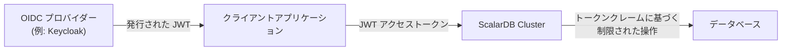

---
tags:
  - Enterprise Premium
displayed_sidebar: docsJapanese
---

# OIDC ベースの JWT アクセストークンを用いてユーザーアクセスを制御する

import TranslationBanner from '/src/components/_translation-ja-jp.mdx';
import WarningLicenseKeyContact from '../components/_warning-license-key-contact.mdx';
import JDKVersions from '../components/_prerequisites-jdk-versions.mdx';

<TranslationBanner />

ScalarDB Cluster は、OpenID Connect (OIDC) プロバイダー (Keycloak など) が発行する JWT アクセストークンに基づいてユーザーアクセスを制御できます。これはパスワードベース認証の代替手段として機能し、クライアントアプリケーションが ScalarDB パスワードを直接管理することなく認証リクエストを実行できるようにします。[属性ベースアクセス制御 (ABAC)](./authorize-with-abac.mdx) と組み合わせることで、ScalarDB Cluster は JWT アクセストークンに埋め込まれたクレームに基づいて、リクエストごとにアクセスを動的に制限できます。

## OIDC ベースアクセス制御の動作原理

以下のセクションでは、OIDC ベースアクセス制御のユースケース、認証フロー、および検証ルールについて説明します。

### ユースケース

OIDC ベースアクセス制御は、1人以上の OIDC ユーザーが単一の ScalarDB サービスユーザーにマップされるシナリオ向けに設計されています。OIDC クライアントアプリケーションは、OIDC プロバイダーを通じてユーザーを認証し、ScalarDB ユーザー名とアクセススコープを含む JWT アクセストークンを取得し、ScalarDB Cluster への各リクエストでそのトークンを送信します。



OIDC プロバイダーは JWT アクセストークンをクライアントアプリケーションに発行します。クライアントは ScalarDB Cluster への各リクエストでトークンを送信し、ScalarDB Cluster はトークンを検証し、ScalarDB ユーザーにマップし、トークンクレームに基づいてアクセスを制限します。

### 認証フロー

クライアントが JWT アクセストークンとともにリクエストを送信すると、ScalarDB Cluster は以下のステップを実行します:

1. **OIDC プロバイダー設定の取得。** ScalarDB Cluster は `{issuer_url}/.well-known/openid-configuration` から OpenID プロバイダー設定を取得し、結果をキャッシュします。
2. **JWKS の取得。** ScalarDB Cluster はプロバイダー設定から JSON Web Key Set (JWKS) URL を抽出し、キーを取得してキャッシュします。
3. **JWT の検証。** ScalarDB Cluster は [RFC 9068](https://datatracker.ietf.org/doc/html/rfc9068#name-validating-jwt-access-token) に従ってトークンの署名と標準クレームを検証します。
4. **トークンの ScalarDB ユーザーへのマッピング。** ScalarDB Cluster は設定されたクレームから ScalarDB ユーザー名を抽出し、ユーザーレコードを検索します。
5. **認証方法の検証。** ScalarDB Cluster は、ユーザーが OIDC 認証の使用を許可されており、発行者が信頼されていることを確認します。OIDC 認証は、ユーザーが `AUTH_METHOD OIDC` オプションで作成された場合に有効になります。
6. **有効時の ABAC 制限の適用。** OIDC ベース ABAC が有効な場合、JWT には ABAC クレームが含まれている必要があります。ScalarDB Cluster はセッションの ABAC ユーザータグを計算して適用します。ABAC クレームがないトークンは拒否されます。
7. **リクエストの実行。** ScalarDB Cluster は、適用可能な制限とともに、マップされた ScalarDB ユーザーとしてリクエストを実行します。

### JWT アクセストークンの検証

ScalarDB Cluster は [RFC 9068](https://datatracker.ietf.org/doc/html/rfc9068) に従って JWT アクセストークンを検証します。具体的には、以下のチェックを実行します:

- **`typ` ヘッダー:** デフォルトでは、`typ` ヘッダーは `at+jwt` または `application/at+jwt` である必要があります。`require_at_jwt_typ` を `false` に設定することで、このチェックを無効にできます。
- **署名:** トークンの署名は、OIDC プロバイダーの JWKS エンドポイントからのキーを使用して検証されます。以下のアルゴリズムのみが受け入れられます: RSASSA-PKCS-v1_5、RSASSA-PSS、ECDSA。
- **`iss` クレーム:** 発行者は `trusted_issuers` で設定された値と一致する必要があります。
- **`aud` クレーム:** オーディエンスには `audience.name` で設定された値が含まれている必要があります。
- **`exp` クレーム:** トークンは期限切れであってはいけません。設定可能なクロックスキュー許容値が適用されます。

### ユーザーマッピング

ScalarDB Cluster は、検証された JWT から `username.claim_name` で指定されたクレームの値を抽出して ScalarDB ユーザーを特定します。ScalarDB はこの値を使用して、`users` メタデータテーブル内の対応するユーザーレコードを検索します。

:::warning

ユーザー名クレームは慎重に選択してください。ScalarDB ユーザーを OIDC ユーザー間で意図せずまたは誤って共有すると、セキュリティ問題が発生する可能性があります。

:::

### 動的 ABAC 制限

OIDC ベース ABAC が有効な場合、ScalarDB Cluster は JWT から ABAC クレーム (デフォルト名: `scalardb_abac`) を読み取り、現在のリクエストに対するユーザーのアクセスを動的に制限するために使用します。ABAC クレームは、マップされた ScalarDB ユーザーの権限を制限することはできますが、拡張することはできません。

ABAC クレームが存在するが ScalarDB ユーザーの権限を超えている場合、リクエストは拒否されます。OIDC ベース ABAC が有効で、JWT から ABAC クレームが欠落している場合も、リクエストは拒否されます。

ABAC の詳細については、[ユーザーアクセスをきめ細かく制御する](./authorize-with-abac.mdx)を参照してください。クレーム構造と検証ルールの詳細については、[JWT ABAC クレームリファレンス](#jwt-abac-claim-reference)を参照してください。

## 設定

このセクションでは、OIDC ベースアクセス制御の設定について説明します。一般的な認証・認可設定については、[ユーザーの認証と認可](./scalardb-auth-with-sql.mdx)を参照してください。

### サーバー側設定

以下は、OIDC ベースアクセス制御に必要な最小限のサーバー側設定です。`scalar.db.cluster.auth.enabled` を `true` に設定する必要もあります。ABAC を使用する場合は、`scalar.db.cluster.abac.enabled` も `true` に設定する必要があります。

| プロパティ                                                | 説明                                                                                          | デフォルト値 |
|---------------------------------------------------------|------------------------------------------------------------------------------------------------------|---------------|
| `scalar.db.cluster.auth.oidc.trusted_issuers`          | 信頼される OIDC 発行者 URL。`iss` クレームがこの値と一致しないトークンは拒否されます。OIDC ベースアクセス制御を使用する場合、このプロパティを指定する必要があります。| empty |
| `scalar.db.cluster.auth.oidc.username.claim_name`      | ScalarDB ユーザー名を抽出するために使用される JWT クレーム名。OIDC ベースアクセス制御を使用する場合、このプロパティを指定する必要があります。| empty |
| `scalar.db.cluster.auth.oidc.audience.name`             | JWT `aud` クレームの期待値。                                                           | `scalardb`    |
| `scalar.db.cluster.auth.oidc.abac.enabled`              | OIDC ベース ABAC を有効にするかどうか。`true` の場合、JWT には ABAC クレームが必要です。                 | `false`       |

追加のサーバー側設定 (キャッシュ TTL、クロックスキューなど) については、ScalarDB Cluster 設定の [OIDC 設定](./scalardb-cluster-configurations.mdx#oidc-configurations)を参照してください。

### クライアント側設定

以下は、OIDC ベースアクセス制御のクライアント側設定です。`oidc_jwt` を使用する場合、`scalar.db.username` と `scalar.db.password` プロパティは必要ありません。

| プロパティ                                                      | 説明                                                                                                  | デフォルト値 |
|---------------------------------------------------------------|--------------------------------------------------------------------------------------------------------------|---------------|
| `scalar.db.cluster.client.auth.type`                          | プリミティブインターフェースの認証タイプ。OIDC の場合は `oidc_jwt` に設定します。                             | empty (`userpass` として扱われる) |
| `scalar.db.sql.cluster_mode.auth.type`                        | SQL インターフェースの認証タイプ。OIDC の場合は `oidc_jwt` に設定します。                                   | empty (`userpass` として扱われる) |

:::note

`OidcJwtAccessTokenHolder` を使用してプログラム的に JWT アクセストークンを渡すことができ、これは多くの OIDC ユーザーを処理する場合に推奨されるオプションです。あるいは、アクセストークンプロパティ (プリミティブインターフェースの場合は `scalar.db.cluster.client.auth.oidc_jwt.access_token`、SQL インターフェースの場合は `scalar.db.sql.cluster_mode.auth.oidc_jwt.access_token`) でトークンを提供することもでき、これは特に SQL CLI などのツールでテストする場合に簡単に開始できます。ただし、トークンは初期化時に設定されるため、リフレッシュはできません。

:::

追加のクライアント側設定については、ScalarDB Cluster 設定の[プリミティブインターフェース](./scalardb-cluster-configurations.mdx#configurations-for-the-primitive-interface)および [SQL インターフェース](./scalardb-cluster-configurations.mdx#configurations-for-the-sql-interface)の設定を参照してください。

## チュートリアル - OIDC と ABAC でアクセス制御

このチュートリアルでは、OIDC プロバイダーとして Keycloak を使用して、OIDC ベースアクセス制御と ABAC を設定する方法を説明します。ScalarDB Cluster の設定、ABAC ポリシーの設定、Keycloak の設定、および `curl` と Java クライアントの両方を使用した検証を行います。

### 前提条件

- 以下のいずれかの Java Development Kit (JDK):
  <JDKVersions versionNumbers="8、11、17、または 21" />
- [Docker](https://www.docker.com/get-started/) 20.10 以降と [Docker Compose](https://docs.docker.com/compose/install/) V2 以降
- JSON 処理用の [`jq`](https://jqlang.github.io/jq/download/)

:::note

このチュートリアルでは、Keycloak のホスト名として `auth.localhost` を使用します。macOS と Linux では、`*.localhost` サブドメインは [RFC 6761](https://www.rfc-editor.org/rfc/rfc6761) に従って自動的に `127.0.0.1` に解決されます。環境で名前解決が機能しない場合 (一部の Windows 設定や Firefox などの特定のブラウザ)、hosts ファイル (macOS/Linux では `/etc/hosts`、Windows では `C:\Windows\System32\drivers\etc\hosts`) に以下のエントリを追加してください:

```plaintext
127.0.0.1 auth.localhost
```

:::

<WarningLicenseKeyContact product="ScalarDB Cluster" />

### 1. ScalarDB Cluster 設定ファイルの作成

`scalardb-cluster-node.properties` という名前の設定ファイルを作成し、以下の設定を追加します。`<YOUR_LICENSE_KEY>` と `<LICENSE_CHECK_CERT_PEM>` を ScalarDB ライセンスキーとライセンスチェック証明書の値に置き換えてください。ライセンスキーと証明書の詳細については、[プロダクトライセンスキーの設定方法](../scalar-licensing/index.mdx)を参照してください。

```properties
scalar.db.storage=jdbc
scalar.db.contact_points=jdbc:postgresql://postgresql:5432/postgres
scalar.db.username=postgres
scalar.db.password=postgres
scalar.db.cluster.node.standalone_mode.enabled=true
scalar.db.sql.enabled=true

# このチュートリアルでの SELECT 文による全スキャンを実行するためにクロスパーティションスキャンを有効にします。
# これは OIDC や ABAC 自体には必要ありません。
scalar.db.cross_partition_scan.enabled=true
scalar.db.cross_partition_scan.filtering.enabled=true

# 認証と認可を有効にする
scalar.db.cluster.auth.enabled=true

# OIDC 設定
# auth.localhost はホストでは RFC 6761 により解決され、コンテナ内では Docker ネットワークエイリアスにより解決されます。
scalar.db.cluster.auth.oidc.trusted_issuers=http://auth.localhost:8080/realms/scalardb-demo
scalar.db.cluster.auth.oidc.audience.name=scalardb
scalar.db.cluster.auth.oidc.username.claim_name=scalardb_username
scalar.db.cluster.auth.oidc.jwt.access_token.require_at_jwt_typ=true

# ABAC 設定
scalar.db.cluster.abac.enabled=true
scalar.db.cluster.auth.oidc.abac.enabled=true

# ライセンスキー設定
scalar.db.cluster.node.licensing.license_key=<YOUR_LICENSE_KEY>
scalar.db.cluster.node.licensing.license_check_cert_pem=<LICENSE_CHECK_CERT_PEM>
```

### 2. Docker Compose ファイルの作成

`docker-compose.yaml` という名前の設定ファイルを作成し、以下の設定を追加します。

```yaml
services:
  postgresql:
    container_name: "postgresql"
    image: "postgres:15"
    ports:
      - 5432:5432
    environment:
      - POSTGRES_PASSWORD=postgres
    healthcheck:
      test: ["CMD-SHELL", "pg_isready || exit 1"]
      interval: 1s
      timeout: 10s
      retries: 60
      start_period: 30s

  keycloak:
    container_name: "keycloak"
    image: "quay.io/keycloak/keycloak:26.2"
    ports:
      - 8080:8080
    environment:
      - KEYCLOAK_ADMIN=admin
      - KEYCLOAK_ADMIN_PASSWORD=admin
      - KC_HOSTNAME=http://auth.localhost:8080
    command: start-dev
    networks:
      default:
        aliases:
          - auth.localhost

  scalardb-cluster-standalone:
    container_name: "scalardb-cluster-node"
    image: "ghcr.io/scalar-labs/scalardb-cluster-node-with-abac-byol-premium:3.18.0"
    ports:
      - 60053:60053
      - 9080:9080
    volumes:
      - ./scalardb-cluster-node.properties:/scalardb-cluster/node/scalardb-cluster-node.properties
    depends_on:
      postgresql:
        condition: service_healthy
```

:::note

`ghcr.io/scalar-labs/scalardb-cluster-node-with-abac-byol-premium` イメージは、ABAC 機能が有効な ScalarDB Cluster ノードイメージで、公開されていません。このイメージへのアクセスについては、[お問い合わせ](https://www.scalar-labs.com/contact)ください。

:::

### 3. サービスの開始

以下のコマンドを実行して、PostgreSQL、Keycloak、および ScalarDB Cluster をスタンドアロンモードで開始します。

```console
docker compose up -d
```

すべてのサービスが健全になるまで待ちます。以下のコマンドで確認できます:

```console
docker compose ps
```

### 4. ABAC ポリシーの設定と OIDC ユーザーの作成

ScalarDB Cluster に接続するため、このチュートリアルでは SQL CLI を使用します。SQL CLI は ScalarDB Cluster に接続して SQL クエリを実行するツールです。SQL CLI は [ScalarDB リリースページ](https://github.com/scalar-labs/scalardb/releases)からダウンロードできます。

`scalardb-cluster-sql-cli.properties` という名前の設定ファイルを作成し、以下の設定を追加します。

```properties
scalar.db.sql.connection_mode=cluster
scalar.db.sql.cluster_mode.contact_points=indirect:localhost

# 認証と認可を有効にする
scalar.db.cluster.auth.enabled=true
```

以下のコマンドを実行して SQL CLI を開始します。プロンプトが表示されたら、ユーザー名とパスワードをそれぞれ `admin` と `admin` として入力します。

```console
java -jar scalardb-cluster-sql-cli-3.18.0-all.jar --config scalardb-cluster-sql-cli.properties
```

次に、以下の SQL 文を実行して ABAC ポリシーを設定し、OIDC ユーザーを作成します。

#### レベル、コンパートメント、およびグループを持つポリシーの作成

```sql
-- ポリシーの作成
CREATE ABAC_POLICY demo_policy WITH DATA_TAG_COLUMN demo_policy_tag;

-- レベルの作成 (レベル番号が高いほど高い機密性)
CREATE ABAC_LEVEL HS WITH LONG_NAME HIGHLY_SENSITIVE AND LEVEL_NUMBER 3000 IN POLICY demo_policy;
CREATE ABAC_LEVEL S  WITH LONG_NAME SENSITIVE        AND LEVEL_NUMBER 2000 IN POLICY demo_policy;
CREATE ABAC_LEVEL C  WITH LONG_NAME CONFIDENTIAL     AND LEVEL_NUMBER 1000 IN POLICY demo_policy;

-- コンパートメントの作成
CREATE ABAC_COMPARTMENT HR  WITH LONG_NAME HUMAN_RESOURCES IN POLICY demo_policy;
CREATE ABAC_COMPARTMENT FIN WITH LONG_NAME FINANCE         IN POLICY demo_policy;

-- グループの作成 (親子階層を持つ)
CREATE ABAC_GROUP EU WITH LONG_NAME EUROPE        IN POLICY demo_policy;
CREATE ABAC_GROUP NA WITH LONG_NAME NORTH_AMERICA IN POLICY demo_policy;
CREATE ABAC_GROUP CS WITH LONG_NAME CUSTOMER_SUCCESS AND PARENT_GROUP EU IN POLICY demo_policy;
```

#### ネームスペースへのポリシーの適用

```sql
-- ネームスペースの作成とポリシーの適用
CREATE NAMESPACE IF NOT EXISTS my_namespace;
CREATE ABAC_NAMESPACE_POLICY ns_policy_demo USING POLICY demo_policy AND NAMESPACE my_namespace;

-- ポリシーの有効化
ENABLE ABAC_POLICY demo_policy;
ENABLE ABAC_NAMESPACE_POLICY ns_policy_demo;
```

#### OIDC 用の ScalarDB ユーザーの作成と ABAC ユーザータグの設定

```sql
-- OIDC 認証を有効にしたユーザーの作成
CREATE USER svc_user AUTH_METHOD OIDC;

-- ユーザーの ABAC レベルを設定: max=HS、default=S、row=C
SET ABAC_LEVEL HS AND DEFAULT_LEVEL S AND ROW_LEVEL C FOR USER svc_user IN POLICY demo_policy;

-- コンパートメントの設定
ADD ABAC_COMPARTMENT HR  TO USER svc_user WITH READ_WRITE_ACCESS AND DEFAULT AND ROW IN POLICY demo_policy;
ADD ABAC_COMPARTMENT FIN TO USER svc_user WITH READ_ONLY_ACCESS AND DEFAULT=FALSE IN POLICY demo_policy;

-- グループの設定
ADD ABAC_GROUP EU TO USER svc_user WITH READ_WRITE_ACCESS AND DEFAULT AND ROW IN POLICY demo_policy;
ADD ABAC_GROUP CS TO USER svc_user WITH READ_WRITE_ACCESS AND DEFAULT AND ROW IN POLICY demo_policy;
```

#### テーブルの作成とテストデータの挿入

```sql
-- テーブルの作成
CREATE TABLE my_namespace.employees (
  id INT PRIMARY KEY,
  name TEXT,
  department TEXT
);

-- 権限の付与
GRANT ALL ON my_namespace.employees TO svc_user;

-- 様々なデータタグを持つテストデータの挿入
INSERT INTO my_namespace.employees (id, name, department, demo_policy_tag) VALUES (1, 'Alice',   'HR',      'C:HR:EU');
INSERT INTO my_namespace.employees (id, name, department, demo_policy_tag) VALUES (2, 'Bob',     'HR',      'S:HR:CS');
INSERT INTO my_namespace.employees (id, name, department, demo_policy_tag) VALUES (3, 'Charlie', 'Finance', 'S:FIN:EU');
INSERT INTO my_namespace.employees (id, name, department, demo_policy_tag) VALUES (4, 'Diana',   'HR',      'HS:HR:EU');
INSERT INTO my_namespace.employees (id, name, department, demo_policy_tag) VALUES (5, 'Eve',     'Finance', 'C:FIN:NA');
INSERT INTO my_namespace.employees (id, name, department, demo_policy_tag) VALUES (6, 'Frank',   'HR',      'S:HR:NA');
```

:::note

このチュートリアルでは、テストデータはスーパーユーザーとして挿入されています。本番環境では、ユーザーに適切な行タグを割り当ててデータを挿入させてください。

:::

設定完了後、SQL CLI を終了します。

### 5. Keycloak の設定

必要なクレームを持つ JWT アクセストークンを発行するように Keycloak を設定します。Keycloak Admin REST API または管理コンソールのいずれかを使用できます。

#### REST API の使用

まず、以下の変数を設定します:

```console
KEYCLOAK_URL="http://auth.localhost:8080"
REALM="scalardb-demo"
CLIENT_ID="scalardb-client"
```

Keycloak が完全に開始されるまで待ち、管理者アクセストークンを取得します:

```console
ADMIN_TOKEN=$(curl -s "$KEYCLOAK_URL/realms/master/protocol/openid-connect/token" \
  -d "client_id=admin-cli" \
  -d "username=admin" \
  -d "password=admin" \
  -d "grant_type=password" | jq -r '.access_token')
```

レルムを作成します:

```console
curl -s -X POST "$KEYCLOAK_URL/admin/realms" \
  -H "Authorization: Bearer $ADMIN_TOKEN" \
  -H "Content-Type: application/json" \
  -d '{"realm": "'"$REALM"'", "enabled": true}'
```

Resource Owner Password Credentials フローが有効で `at+jwt` トークンタイプを持つパブリッククライアントを作成します:

```console
curl -s -X POST "$KEYCLOAK_URL/admin/realms/$REALM/clients" \
  -H "Authorization: Bearer $ADMIN_TOKEN" \
  -H "Content-Type: application/json" \
  -d '{
    "clientId": "'"$CLIENT_ID"'",
    "publicClient": true,
    "directAccessGrantsEnabled": true,
    "attributes": {
      "access.token.header.type.rfc9068": "true"
    }
  }'
```

クライアントの内部 UUID を取得します:

```console
CLIENT_UUID=$(curl -s "$KEYCLOAK_URL/admin/realms/$REALM/clients?clientId=$CLIENT_ID" \
  -H "Authorization: Bearer $ADMIN_TOKEN" | jq -r '.[0].id')
```

JWT `aud` クレームに `scalardb` が含まれるようにオーディエンスマッパーを追加します:

```console
curl -s -X POST "$KEYCLOAK_URL/admin/realms/$REALM/clients/$CLIENT_UUID/protocol-mappers/models" \
  -H "Authorization: Bearer $ADMIN_TOKEN" \
  -H "Content-Type: application/json" \
  -d '{
    "name": "audience-mapper",
    "protocol": "openid-connect",
    "protocolMapper": "oidc-audience-mapper",
    "config": {
      "included.custom.audience": "scalardb",
      "id.token.claim": "false",
      "access.token.claim": "true"
    }
  }'
```

ScalarDB ユーザー名を JWT に埋め込むマッパーを追加します:

```console
curl -s -X POST "$KEYCLOAK_URL/admin/realms/$REALM/clients/$CLIENT_UUID/protocol-mappers/models" \
  -H "Authorization: Bearer $ADMIN_TOKEN" \
  -H "Content-Type: application/json" \
  -d '{
    "name": "scalardb-username-claim",
    "protocol": "openid-connect",
    "protocolMapper": "oidc-hardcoded-claim-mapper",
    "config": {
      "claim.name": "scalardb_username",
      "claim.value": "svc_user",
      "jsonType.label": "String",
      "id.token.claim": "false",
      "access.token.claim": "true"
    }
  }'
```

ABAC 制限を JWT に埋め込むマッパーを追加します。この例では、レベル `S` 以下、`HR` コンパートメント、および `EU` と `CS` グループへのアクセスを制限します:

```console
curl -s -X POST "$KEYCLOAK_URL/admin/realms/$REALM/clients/$CLIENT_UUID/protocol-mappers/models" \
  -H "Authorization: Bearer $ADMIN_TOKEN" \
  -H "Content-Type: application/json" \
  -d '{
    "name": "scalardb-abac-claim",
    "protocol": "openid-connect",
    "protocolMapper": "oidc-hardcoded-claim-mapper",
    "config": {
      "claim.name": "scalardb_abac",
      "claim.value": "{\"policies\":{\"demo_policy\":{\"level\":{\"max\":\"S\"},\"compartments\":{\"read\":[\"HR\"]},\"groups\":{\"read\":[\"EU\",\"CS\"]}}}}",
      "jsonType.label": "JSON",
      "id.token.claim": "false",
      "access.token.claim": "true"
    }
  }'
```

パスワードを持つ Keycloak ユーザーを作成します:

```console
curl -s -X POST "$KEYCLOAK_URL/admin/realms/$REALM/users" \
  -H "Authorization: Bearer $ADMIN_TOKEN" \
  -H "Content-Type: application/json" \
  -d '{
    "username": "demo-user",
    "email": "demo-user@example.com",
    "emailVerified": true,
    "firstName": "Demo",
    "lastName": "User",
    "enabled": true,
    "credentials": [{"type": "password", "value": "demo-password", "temporary": false}]
  }'
```

:::note

Keycloak 26 では、デフォルトで `VERIFY_PROFILE` 必須アクションが有効になっています。ユーザープロファイルが不完全 (メール、名、姓が欠落) の場合、Resource Owner Password Credentials フローは `Account is not fully set up` エラーを返します。

:::

#### 管理コンソールの使用

Keycloak 管理コンソールを使用する場合は、`http://auth.localhost:8080` を開き、ユーザー名 `admin`、パスワード `admin` でログインします。その後、以下の手順に従ってください。

**レルムの作成:**

1. 左上のドロップダウンで **Create Realm** を選択します。
2. **Realm name** を `scalardb-demo` に設定し、**Create** をクリックします。

**クライアントの作成:**

1. **Clients** > **Create client** に移動します。
2. **General Settings** で設定:
   - **Client type:** `OpenID Connect`
   - **Client ID:** `scalardb-client`
3. **Capability config** で設定:
   - **Client authentication:** OFF (パブリッククライアント)
   - **Authentication flow > Direct access grants:** ON
4. **Save** をクリックします。
5. **Advanced** タブを開き、**Fine grain OpenID Connect configuration** で設定:
   - **Use "at+jwt" as access token header type:** ON
6. **Save** をクリックします。

**オーディエンスマッパーの追加:**

1. クライアントの **Client scopes** タブに移動し、`scalardb-client-dedicated` をクリックします。
2. **Mappers** > **Configure a new mapper** をクリックします。
3. **Audience** を選択して設定:

   | 設定 | 値 |
   |---|---|
   | **Name** | `audience-mapper` |
   | **Included Custom Audience** | `scalardb` |
   | **Add to ID token** | OFF |
   | **Add to access token** | ON |

4. **Save** をクリックします。

**ScalarDB ユーザー名マッパーの追加:**

1. 同じ **Mappers** タブで、**Add mapper** > **By configuration** をクリックします。
2. **Hardcoded claim** を選択して設定:

   | 設定 | 値 |
   |---|---|
   | **Name** | `scalardb-username-claim` |
   | **Token Claim Name** | `scalardb_username` |
   | **Claim value** | `svc_user` |
   | **Claim JSON Type** | `String` |
   | **Add to ID token** | OFF |
   | **Add to access token** | ON |

3. **Save** をクリックします。

**ABAC クレームマッパーの追加:**

1. 同じ **Mappers** タブで、**Add mapper** > **By configuration** をクリックします。
2. **Hardcoded claim** を選択して設定:

   | 設定 | 値 |
   |---|---|
   | **Name** | `scalardb-abac-claim` |
   | **Token Claim Name** | `scalardb_abac` |
   | **Claim value** | `{"policies":{"demo_policy":{"level":{"max":"S"},"compartments":{"read":["HR"]},"groups":{"read":["EU","CS"]}}}}` |
   | **Claim JSON Type** | `JSON` |
   | **Add to ID token** | OFF |
   | **Add to access token** | ON |

3. **Save** をクリックします。

**ユーザーの作成:**

1. **Users** > **Add user** に移動します。
2. 以下のフィールドを設定:
   - **Username:** `demo-user`
   - **Email:** `demo-user@example.com`
   - **Email verified:** ON
   - **First name:** `Demo`
   - **Last name:** `User`
3. **Create** をクリックします。
4. **Credentials** タブを開き、**Set password** をクリックします。
5. **Password** を `demo-password`、**Temporary** を OFF に設定し、**Save** をクリックします。

:::note

Keycloak 26 では、デフォルトで `VERIFY_PROFILE` 必須アクションが有効になっています。ユーザープロファイルが不完全 (メール、名、姓が欠落) の場合、Resource Owner Password Credentials フローは `Account is not fully set up` エラーを返します。

:::

### 6. アクセストークンの取得と JWT の検証

Keycloak からアクセストークンをリクエストします:

```console
TOKEN=$(curl -s "$KEYCLOAK_URL/realms/$REALM/protocol/openid-connect/token" \
  -d "client_id=$CLIENT_ID" \
  -d "username=demo-user" \
  -d "password=demo-password" \
  -d "grant_type=password" \
  -d "scope=openid" | jq -r '.access_token')
```

JWT ペイロードをデコードして、`scalardb_username` と `scalardb_abac` クレームが存在することを確認します:

```console
echo "$TOKEN" | cut -d. -f2 | tr -- '-_' '+/' | base64 --decode 2>/dev/null | jq '{ scalardb_username, scalardb_abac, aud, iss }'
```

:::note

JWT アクセストークンは、標準の base64 と比較して `+` を `-` に、`/` を `_` に置き換える base64url エンコーディングを使用します。`tr -- '-_' '+/'` コマンドは、デコード前にエンコーディングを変換します。出力が切り詰められて表示される場合、base64 パディングが不完全な可能性があります。その場合は、`base64 --decode` ステップの前に `==` を追加してみてください。

:::

以下のような出力が表示されるはずです:

```json
{
  "scalardb_username": "svc_user",
  "scalardb_abac": {
    "policies": {
      "demo_policy": {
        "level": { "max": "S" },
        "compartments": { "read": ["HR"] },
        "groups": { "read": ["EU", "CS"] }
      }
    }
  },
  "aud": ["scalardb"],
  "iss": "http://auth.localhost:8080/realms/scalardb-demo"
}
```

この ABAC クレームでは、`employees` テーブルをクエリする際に以下のアクセス動作が期待されます:

| 行 | 名前    | データタグ     | 表示される？ | 理由                                      |
|-----|---------|--------------|----------|---------------------------------------------|
| 1   | Alice   | `C:HR:EU`    | はい      | レベル C ≤ S、`HR` が一致、`EU` が一致    |
| 2   | Bob     | `S:HR:CS`    | はい      | レベル S ≤ S、`HR` が一致、`CS` (`EU` の子) が一致 |
| 3   | Charlie | `S:FIN:EU`   | いいえ       | `FIN` は承認されたコンパートメントにない |
| 4   | Diana   | `HS:HR:EU`   | いいえ       | レベル `HS` > S                              |
| 5   | Eve     | `C:FIN:NA`   | いいえ       | `FIN` と `NA` は承認されていない           |
| 6   | Frank   | `S:HR:NA`    | いいえ       | `NA` は承認されたグループにない        |

### 7. Java クライアントでの接続

このセクションでは、JWT アクセストークンを使用して Java Client SDK で ScalarDB Cluster に接続する方法を示します。各リクエストで JWT アクセストークンを渡すために `OidcJwtAccessTokenHolder.executeWithToken()` を使用します。

:::note

Java コードで OIDC プロバイダーから JWT アクセストークンを取得する際は、Keycloak URL に `auth.localhost` の代わりに `localhost` を使用してください。macOS/Linux でのシェルコマンドとは異なり、Java の DNS リゾルバーは RFC 6761 に従って `*.localhost` サブドメインを常に解決するとは限りません。

:::

#### ビルド設定

ScalarDB Cluster Java Client SDK をプロジェクトの依存関係に追加します。例えば、Gradle の場合:

```groovy
dependencies {
    implementation 'com.scalar-labs:scalardb-cluster-java-client-sdk:3.18.0'
    implementation 'com.scalar-labs:scalardb-sql-jdbc:3.18.0'
}
```

#### プリミティブインターフェース

`scalardb-client.properties` という名前のクライアント設定ファイルを作成し、以下の設定を追加します。

```properties
scalar.db.contact_points=indirect:localhost
scalar.db.transaction_manager=cluster
scalar.db.cluster.auth.enabled=true
scalar.db.cluster.client.auth.type=oidc_jwt
```

`OidcJwtAccessTokenHolder.executeWithToken()` を使用して JWT アクセストークンを設定し、トランザクションを実行します:

```java
import com.scalar.db.api.DistributedTransaction;
import com.scalar.db.api.DistributedTransactionManager;
import com.scalar.db.api.Result;
import com.scalar.db.api.Scan;
import com.scalar.db.cluster.client.OidcJwtAccessTokenHolder;
import com.scalar.db.service.TransactionFactory;

import java.util.List;

TransactionFactory factory = TransactionFactory.create("scalardb-client.properties");

try (DistributedTransactionManager manager = factory.getTransactionManager()) {
    // OIDC プロバイダーから JWT アクセストークンを取得します (実装は設定によって異なります)
    String jwtToken = getAccessTokenFromOidcProvider();

    List<Result> results = OidcJwtAccessTokenHolder.executeWithToken(jwtToken, () -> {
        DistributedTransaction tx = manager.begin();
        try {
            Scan scan = Scan.newBuilder()
                .namespace("my_namespace")
                .table("employees")
                .all()
                .build();
            List<Result> scanResults = tx.scan(scan);
            tx.commit();
            return scanResults;
        } catch (Exception e) {
            tx.abort();
            throw e;
        }
    });

    for (Result result : results) {
        System.out.printf("id=%d, name=%s, department=%s%n",
            result.getInt("id"), result.getText("name"), result.getText("department"));
    }
}
```

このチュートリアルからの ABAC クレームでは、Alice (行 1) と Bob (行 2) のみが返されるはずです。

#### JDBC

`scalardb-jdbc.properties` という名前のクライアント設定ファイルを作成し、以下の設定を追加します。

```properties
scalar.db.sql.connection_mode=cluster
scalar.db.sql.cluster_mode.contact_points=indirect:localhost
scalar.db.cluster.auth.enabled=true
scalar.db.sql.cluster_mode.auth.type=oidc_jwt
```

標準 JDBC で `OidcJwtAccessTokenHolder.executeWithToken()` を使用します:

```java
import com.scalar.db.cluster.client.OidcJwtAccessTokenHolder;

import java.sql.Connection;
import java.sql.DriverManager;
import java.sql.ResultSet;
import java.sql.Statement;

try (Connection connection = DriverManager.getConnection("jdbc:scalardb:scalardb-jdbc.properties")) {
    String jwtToken = getAccessTokenFromOidcProvider();

    OidcJwtAccessTokenHolder.executeWithToken(jwtToken, () -> {
        try (Statement stmt = connection.createStatement()) {
            stmt.execute("BEGIN");
            try (ResultSet rs = stmt.executeQuery("SELECT * FROM my_namespace.employees")) {
                while (rs.next()) {
                    System.out.printf("id=%d, name=%s, department=%s%n",
                        rs.getInt("id"), rs.getString("name"), rs.getString("department"));
                }
            }
            connection.commit();
        } catch (Exception e) {
            connection.rollback();
            throw e;
        }
    });
}
```

### 8. クリーンアップ

コンテナを停止して削除するには、以下のコマンドを実行します:

```console
docker compose down
```

## トラブルシューティング

詳細なエラーメッセージは ScalarDB Cluster ノードログに表示されます。リクエストが失敗した場合は、根本原因についてログを確認してください。

| エラー | 考えられる原因 | 解決策 |
|-------|---------------|------------|
| JWT 検証エラー | `trusted_issuers` 設定が Keycloak 発行者 URL と一致しない。 | Keycloak レルム設定を確認し、`{keycloak_url}/realms/{realm}/.well-known/openid-configuration` にアクセスして発行者 URL を確認してください。 |
| ユーザーが見つからない | `username.claim_name` で指定されたクレームが JWT から欠落している、または ScalarDB ユーザーが存在しない。 | JWT をデコードしてクレームを確認し、SQL CLI で `SHOW USERS` を実行してユーザーが存在することを確認してください。 |
| ABAC クレーム検証エラー | クレーム値が ScalarDB ユーザーの権限を超えている、またはクレームが内部一貫性ルールに違反している。 | [検証ルール](#validation-rules)を参照し、クレーム値がユーザーの承認範囲内にあることを確認してください。 |
| オーディエンス不一致 | `audience.name` 設定が JWT の `aud` クレームと一致しない。 | Keycloak オーディエンスマッパーと `audience.name` プロパティが同じ値を使用していることを確認してください。 |
| `typ` ヘッダーエラー | JWT `typ` ヘッダーが `at+jwt` ではない。 | Keycloak クライアントが `at+jwt` をアクセストークンヘッダータイプとして使用するように設定されていることを確認するか、開発目的で `require_at_jwt_typ` を `false` に設定してください。 |
| 認証方法エラー | ScalarDB ユーザーが OIDC の使用を許可されていない、またはユーザーがスーパーユーザーである。 | ユーザーが `AUTH_METHOD OIDC` で作成されており、スーパーユーザーではないことを確認してください。 |

## JWT ABAC クレームリファレンス

このセクションでは、動的 ABAC アクセス制御に使用される `scalardb_abac` JWT クレームの構造と検証ルールについて説明します。

### クレーム構造

クレームは、ポリシーごとの ABAC 制限を含む JSON オブジェクトです。各ポリシーは、レベル、コンパートメント、およびグループの制限を指定します:

```json
{
  "policies": {
    "<POLICY_NAME>": {
      "level": {
        "max": "<LEVEL_SHORT_NAME>",
        "default": "<LEVEL_SHORT_NAME>",
        "row": "<LEVEL_SHORT_NAME>"
      },
      "compartments": {
        "read": ["<COMPARTMENT_SHORT_NAME>", "..."],
        "write": ["<COMPARTMENT_SHORT_NAME>", "..."],
        "default_read": ["<COMPARTMENT_SHORT_NAME>", "..."],
        "default_write": ["<COMPARTMENT_SHORT_NAME>", "..."],
        "row": ["<COMPARTMENT_SHORT_NAME>", "..."]
      },
      "groups": {
        "read": ["<GROUP_SHORT_NAME>", "..."],
        "write": ["<GROUP_SHORT_NAME>", "..."],
        "default_read": ["<GROUP_SHORT_NAME>", "..."],
        "default_write": ["<GROUP_SHORT_NAME>", "..."],
        "row": ["<GROUP_SHORT_NAME>", "..."]
      }
    }
  }
}
```

### フィールドリファレンス

クレームはポリシーごとに指定されます。各ポリシーで以下のフィールドが利用可能です:

| フィールド                    | 説明                                                  | 必須 |
|--------------------------|--------------------------------------------------------------|----------|
| `level.max`              | 最大読み書きレベル。                            | はい      |
| `level.default`          | 明示的なタグが指定されていない場合に使用される操作レベル。   | いいえ       |
| `level.row`              | 新しく挿入された行に割り当てられるレベル。                   | いいえ       |
| `compartments.read`      | ユーザーが読み取れるコンパートメント。                              | いいえ       |
| `compartments.write`     | ユーザーが書き込めるコンパートメント。                             | いいえ       |
| `compartments.default_read`  | デフォルト読み取りコンパートメント。                               | いいえ       |
| `compartments.default_write` | デフォルト書き込みコンパートメント。                              | いいえ       |
| `compartments.row`       | 新しく挿入された行に割り当てられるコンパートメント。                | いいえ       |
| `groups.read`            | ユーザーが読み取れるグループ。                                    | いいえ       |
| `groups.write`           | ユーザーが書き込めるグループ。                                   | いいえ       |
| `groups.default_read`    | デフォルト読み取りグループ。                                         | いいえ       |
| `groups.default_write`   | デフォルト書き込みグループ。                                        | いいえ       |
| `groups.row`             | 新しく挿入された行に割り当てられるグループ。                      | いいえ       |

### デフォルト値ルール

オプションのフィールドが省略された場合、以下のデフォルトが適用されます:

**レベルデフォルト (カスケード):**

| フィールド     | 省略時のデフォルト       |
|-----------|---------------------------|
| `default` | `max` と同じ             |
| `row`     | `default` と同じ         |

**コンパートメントとグループのデフォルト (最小権限):**

| フィールド           | 省略時のデフォルト  |
|-----------------|-----------------------|
| `read`          | 空のリスト (アクセスなし) |
| `write`         | 空のリスト (アクセスなし) |
| `default_read`  | `read` と同じ        |
| `default_write` | `write` と同じ       |
| `row`           | `write` と同じ       |

:::warning

コンパートメントまたはグループを省略すると空のリストになり、それらのコンパートメントまたはグループでタグ付けされた行へのアクセスがないことを意味します。ユーザーがアクセスすべきコンパートメントとグループを明示的に指定する必要があります。

:::

### 検証ルール

ScalarDB Cluster は、以下のルールに違反する ABAC クレームを拒否します。

**内部一貫性 (クレーム内のフィールド間):**

- `level.default` は `level.max` 以下でなければなりません。
- `level.row` は `level.max` 以下でなければなりません。
- `compartments.write` は `compartments.read` のサブセットでなければなりません。
- `compartments.default_read` は `compartments.read` のサブセットでなければなりません。
- `compartments.default_write` は `compartments.write` のサブセットでなければなりません。
- `compartments.row` は `compartments.write` のサブセットでなければなりません。
- `groups.write` は `groups.read` のサブセットでなければなりません。
- `groups.default_read` は `groups.read` のサブセットでなければなりません。
- `groups.default_write` は `groups.write` のサブセットでなければなりません。
- `groups.row` は `groups.write` のサブセットでなければなりません。

**ScalarDB ユーザーの権限との一貫性 (クレームは制限のみ可能、拡張は不可):**

- `level.max` は ScalarDB ユーザーの最大レベル以下でなければなりません。
- `compartments.read` は ScalarDB ユーザーの読み取りコンパートメントのサブセットでなければなりません。
- `compartments.write` は ScalarDB ユーザーの書き込みコンパートメントのサブセットでなければなりません。
- `groups.read` は ScalarDB ユーザーの読み取りグループ (階層を含む) のサブセットでなければなりません。
- `groups.write` は ScalarDB ユーザーの書き込みグループ (階層を含む) のサブセットでなければなりません。

## 関連項目

- [ユーザーの認証と認可](./scalardb-auth-with-sql.mdx)
- [ユーザーアクセスをきめ細かく制御する](./authorize-with-abac.mdx)
- [ScalarDB Cluster 設定](./scalardb-cluster-configurations.mdx)
