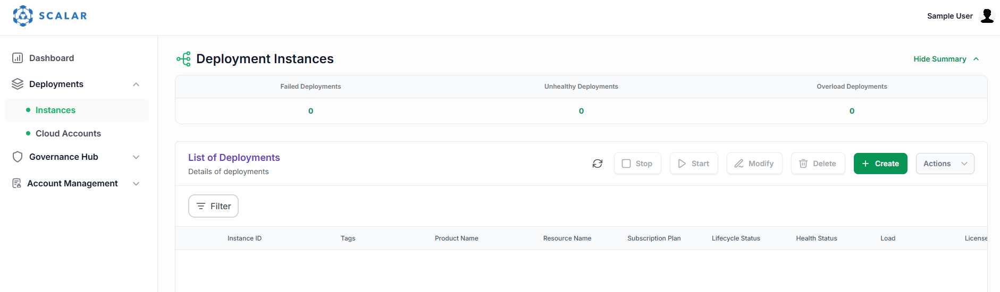
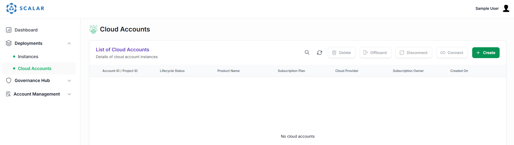
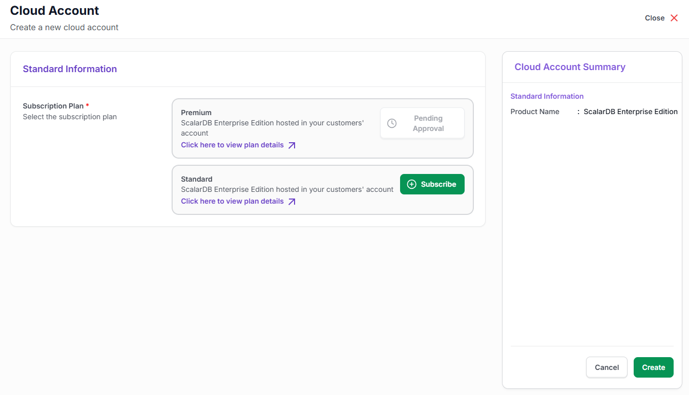
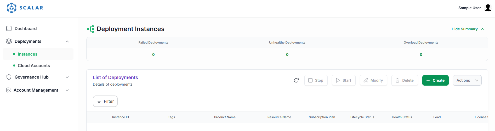

---
tags:
  - Enterprise Standard
  - Enterprise Premium
displayed_sidebar: docsJapanese
---

# Google Cloud Marketplace を通じた ScalarDB Cluster のデプロイ

import TranslationBanner from '/src/components/_translation-ja-jp.mdx';

<TranslationBanner />

この文書では、Google Cloud Marketplace を通じて Google Cloud 環境に ScalarDB Cluster をデプロイする方法について説明します。

## 前提条件

- ScalarDB Cluster をデプロイするための Google Cloud プロジェクトを作成している必要があります。
- ScalarDB Cluster で使用するバックエンドデータベースを準備している必要があります。

## ScalarDB Cluster のデプロイ

1. 各エディションの[機能](../features.mdx)に基づいて、使用したい ScalarDB Cluster のエディションを決定します。
1. [Google Cloud Marketplace の ScalarDB ページ](https://console.cloud.google.com/marketplace/product/scalarlabs-public/scalardb)にアクセスします。

1. **ScalarDB Enterprise Edition Standard** または **ScalarDB Enterprise Edition Premium** をサブスクライブします。

   

1. **New ScalarDB subscription** ページで、**Additional terms** の内容を読み、チェックボックスを選択します。次に、**Subscribe** ボタンを選択します。

   

1. **Your order request has been sent to Scalar, Inc.** ポップアップウィンドウが表示されたら、**Go to product page** ボタンを選択します。

   

   製品ページの上部に **Purchase pending provider approval** メッセージが表示されます。Scalar チームからの承認をお待ちください。

   

1. リクエストが承認されると、製品ページの上部に **Manage on provider** ボタンが表示されます。**Manage on provider** ボタンを選択します。

   

1. Google Cloud Marketplace から離れることを確認するポップアップウィンドウが表示されたら、**OK** ボタンを選択します。

   

1. Scalar ポータルのログインページが表示されたら、メールアドレスを入力して **Next** ボタンを選択します。

   

1. **Sign up with a password** ボタンを選択します。

   

1. **Get Started Today** ページで、アカウント情報を入力します。

   

1. **Verify Your Email to Activate Your Account** ページが表示されたら、メールを確認し、受信したメッセージ内のリンクを選択してアカウントを有効にします。

   

1. アカウントを確認すると、再度ログインページが表示されます。Scalar ポータルにログインしてください。

   

   ログイン後、**Deployment Instances** ページが表示されます。

   

1. サイドバーナビゲーションで **Cloud Accounts** を選択します。次に、**Cloud Accounts** 画面で **Create** ボタンを選択します。

   

1. **Cloud Accounts** ページで、**Subscribe** ボタンを選択します。

   :::important

   Google Cloud Marketplace ページで選択したものと同じエディションを選択してください。

   :::

   

1. **Subscribe** ボタンを選択すると、ボタンに **Pending Approval** というメッセージが表示されます。Scalar チームからの承認をお待ちください。

   

   リクエストが承認されると、marketplace-notifications@scalar-labs.com から **Your ScalarDB Enterprise Edition - [EDITION_NAME] subscription request approved** というタイトルのメールが届きます。また、リクエストが承認されると、Scalar ポータルの **Cloud Accounts** ページの **Subscribe** ボタンがグレーアウトされます。

   

1. **Cloud Accounts** ページで、ScalarDB Cluster のデプロイに使用したい Google Cloud プロジェクトの **Project ID** と **Project number** を入力します。**Subscription**、**Cloud Provider**、**Account Configuration Method** などの他の設定はデフォルト値を使用できます。**Project ID** と **Project number** を入力したら、**Create** ボタンを選択します。

   

1. **Account Configuration Instructions** ポップアップウィンドウが表示されたら、bash コマンドをコピーし、**Google Cloud Shell** リンクを選択して Google Cloud Shell を開きます。

   

1. Google Cloud Shell で、**Account Configuration Instructions** ポップアップウィンドウでコピーした bash コマンドを貼り付けて実行します。下記の例の出力のように **Do you want to proceed?** と尋ねられます。**yes** と入力します。

   ```console
   =============================================
         Google Cloud Setup Script
   =============================================
   This script will configure your GCP project.
   ✔ Enable required GCP APIs
   ✔ Create & configure service accounts
   ✔ Assign IAM roles
   ✔ Setup Workload Identity Pool and OIDC Provider
   -----------------------------------------------
   Do you want to proceed? (yes/no):
   ```

   bash コマンドが成功すると、次のようなメッセージが表示されます。

   ```console
   YYYY-MM-DD HH:MM:SS - [INFO] - Script completed successfully.
   ```

1. Scalar ポータルの **Cloud Accounts** ページで、ステータスが **Ready** になります。

   

1. サイドバーナビゲーションで **Instances** を選択します。次に、**Deployment Instances** 画面で **Create** ボタンを選択します。

   

1. **Create Deployment Instance** ページで、次のように設定を入力します：

   - **Subscription Plan:** サブスクライブしたエディションを選択します。
   - **Subscription:** デフォルト値を使用します。（この値を更新する必要はありません。）
   - **Cloud Provider:** デフォルト値を使用します。（この値を更新する必要はありません。）
   - **Region:** ScalarDB Cluster をデプロイしたいリージョンを選択します。
   - **Tags:** 任意のタグを設定します。
   - **Network Type:** **Public** を選択します。
   - **Cloud Provider Account Config ID:** 前の手順にて **Cloud Accounts** ページで登録したクラウドアカウントを選択します。
   - **ScalarDB Cluster Node Replica Count:** ScalarDB Cluster ノードレプリカの数を入力します。
   - **Database Properties:** ScalarDB Cluster のプロパティを入力します。詳細については、[ScalarDB Cluster Configurations](./scalardb-cluster-configurations.mdx) を参照してください。
   - **Database Properties (Sensitive Information):** `scalar.db.username` や `scalar.db.password` などの ScalarDB Cluster のプロパティを入力します。これらの値は、ScalarDB Cluster をデプロイした後、Scalar ポータルでは非表示になります。

     :::note

     このテキストボックスには、通常のデータベースプロパティと同じ形式でプロパティを入力（コピーアンドペースト）できます。例：

     ```properties
     scalar.db.username=<USERNAME>
     scalar.db.password=<PASSWORD>
     ```

     これらの値は、このテキストボックスに入力すると自動的にマスクされます。

     :::

   例：

   

1. デプロイメントの設定を入力したら、**Create** ボタンを選択します。**Launching Your Instance** ポップアップウィンドウが表示されます。

   

1. インスタンスが起動されると、デプロイされたインスタンスが **Lifecycle Status** として **Running** と表示されます。

   

   :::note

   新しいインスタンスのデプロイには時間がかかります。特に、選択したリージョンで ScalarDB Cluster インスタンスが初回デプロイされる場合、最初に GKE クラスターが作成されるため、かなりの時間がかかります。

   :::

1. ScalarDB Cluster エンドポイントと Grafana ダッシュボードにアクセスするためのエンドポイント情報を確認するには、**Instance ID** の下でインスタンスを選択し、**Connectivity** タブに移動します。

   
