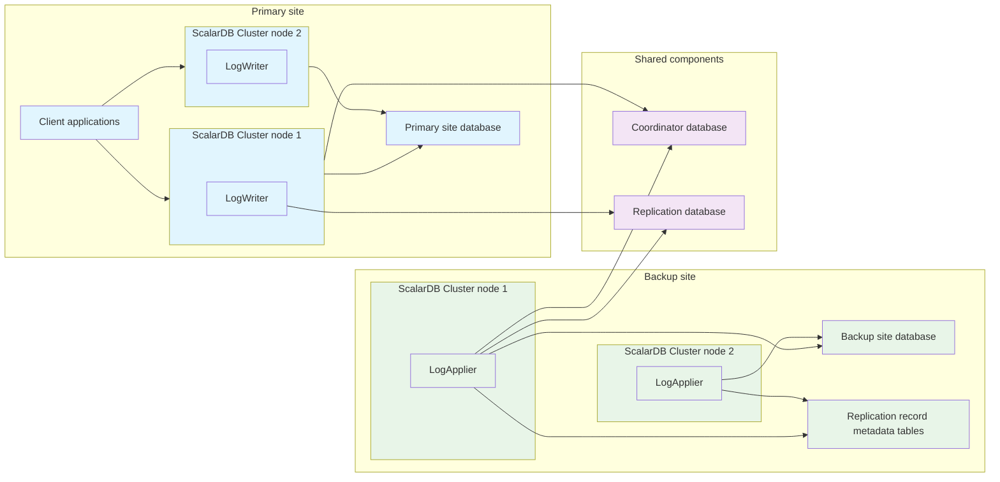

---
tags:
  - Enterprise Premium
  - Private Preview
displayed_sidebar: docsJapanese
---

# 災害復旧のためのデータレプリケーション

ScalarDB Cluster は、災害復旧のために管理下のデータをリモートサイトにレプリケートすることができます。このリモートレプリケーション機能により、プライマリサイトでの書き込み操作が、1つ以上のバックアップサイトにほぼリアルタイムで複製されます。そのため、災害やその他の重大な障害がプライマリサイトに影響を与えた場合でも、バックアップサイトへのフェイルオーバーを可能にし、ビジネスの継続性を確保します。

## ScalarDB におけるリモートレプリケーションとは？

ScalarDB のリモートレプリケーションは、同期レプリケーションと非同期レプリケーションを組み合わせたハイブリッドアプローチを使用します。これにより、プライマリサイトでのパフォーマンスへの影響を最小限に抑えながら、データ損失ゼロ (目標復旧時点 (RPO) がゼロ) を保証します。目標復旧時間 (RTO) は、コンピューティングリソースの量を制御することで柔軟に調整できます。この機能は ScalarDB Cluster の上に構築されており、クラウドやデータベースに依存しません。これにより、あるクラウドベンダーのデータベースから、別のクラウドベンダーの異なる種類のデータベースへのレプリケーションが可能になります。

## 主な利点

リモートレプリケーションは、災害復旧とビジネス継続性において以下の主要な利点を提供します:

- すべてのコミット済みトランザクションに対してデータ損失ゼロ (RPO が 0) を保証します。
- 同期処理と非同期処理の組み合わせにより、パフォーマンスへの影響を最小限に抑えます。
- プライマリサイトとは異なるリージョン、アベイラビリティゾーン、またはデータセンターにバックアップサイトをデプロイすることが可能です。
- 異なるクラウドサービスプロバイダーやデータベースタイプ間でのレプリケーションをサポートします。
- 組み込みのクラッシュ耐性と自動回復メカニズムを提供します。

## アーキテクチャ概要

以下の図は、リモートレプリケーションアーキテクチャを示しています:



リモートレプリケーションは、このセクションに記載されているコンポーネントとツールで構成されています。

### プライマリサイトコンポーネント

プライマリサイトは、プライマリサイトデータベース、クライアントアプリケーション、ScalarDB Cluster ノードの3つのコンポーネントで構成されています。それぞれ以下のように動作します:

- プライマリサイトデータベースには、ScalarDB Cluster を介してクライアントアプリケーションが使用するアプリケーションテーブルが含まれています。
- クライアントアプリケーションはデータベース操作を実行します。
- ScalarDB Cluster ノードは Coordinator データベースでトランザクション状態を管理し、LogWriter と呼ばれるモジュールを使用してトランザクション操作をキャプチャし、レプリケーションデータベースに書き込みます。

### 共有コンポーネント (プライマリサイトとバックアップサイト間)

プライマリサイトとバックアップサイトにまたがる2つのコンポーネントがあります: Coordinator データベースとレプリケーションデータベースです。これらのデータベースは単一のデータベースインスタンスでホストできます。ただし、トランザクション情報を維持するため、以下のように複数のサイトにレプリケートする必要があります:

- Coordinator データベースは、サイト間のトランザクション状態を可用性の高い方法で管理します。
- レプリケーションデータベースは、プライマリサイトからの書き込み操作を含むトランザクショングループを可用性の高い方法で保存します。

### バックアップサイトコンポーネント

バックアップサイトは、バックアップサイトデータベースと ScalarDB Cluster ノードの2つのコンポーネントで構成されています。それぞれ以下のように動作します:

- バックアップサイトデータベースには、プライマリサイトと同じアプリケーションテーブルが含まれています。また、レプリケーションメタデータと未適用の操作を追跡する内部テーブルであるレプリケーションレコードメタデータテーブルも含まれています。これらのテーブルは、アプリケーションテーブルと同じ名前空間に配置されます (デフォルトでは `__records` のサフィックス付き)。
- ScalarDB Cluster ノードは、LogApplier と呼ばれるモジュールを使用してレプリケートされたデータを適用します。具体的には、LogApplier は Coordinator データベースでトランザクション状態を確認し、レプリケーションデータベースから書き込み操作の読み取りおよび削除を実行し、レプリケーションレコードメタデータテーブルを使用して依存関係を計算し、バックアップサイトテーブルに操作を適用します。

### 管理ツール

リモートレプリケーションは、以下の管理ツールを使用します: Schema Loader と Replication CLI。それぞれ以下のように動作します:

- Schema Loader は、ScalarDB Cluster エンドポイント経由で `--replication-tables` オプションを使用して、レプリケーションデータベースにレプリケーションテーブルを作成します。
- Replication CLI は、リモートレプリケーションを介してデータをレプリケートする ScalarDB Cluster ノードを監視および管理します。

## リモートレプリケーションの仕組み

リモートレプリケーションは、同期レプリケーションと非同期レプリケーションを組み合わせたハイブリッドアプローチを採用し、プライマリサイトでのパフォーマンスへの影響を最小限に抑えながらデータ損失ゼロ (RPO = 0) を確保します。以下のように、同期フェーズと非同期フェーズの2つのフェーズで構成されています:

- 同期フェーズでは、トランザクションコミット中にプライマリサイトからレプリケーションデータベースに書き込み操作がコピーされます。
- 非同期フェーズでは、これらの操作がレプリケーションデータベースから処理され、バックアップサイトテーブルに適用されます。

レプリケーションプロセスは以下の手順に従います:

1. プライマリサイトでトランザクションがコミットされると、LogWriter がすべての書き込み操作をキャプチャし、レプリケーションデータベースに保存します。
2. バックアップサイトの LogApplier は、レプリケーションデータベースを継続的にスキャンして新しいトランザクションデータを探します。
3. LogApplier は Coordinator データベースをチェックしてトランザクションの完了を確認します。
4. LogApplier は、レプリケーションレコードメタデータテーブルを使用して、レコードレベルでのトランザクション依存関係に基づいて書き込み操作を順序付けて適用します。
5. LogApplier は処理された操作をバックアップサイトテーブルに適用し、レプリケーションレコードメタデータテーブルを最新の情報に更新します。

## 制限事項と特性

このセクションでは、リモートレプリケーションの制限事項と特性について説明します。

### プライベートプレビューの制限事項

現在のプライベートプレビューバージョンには以下の制限がありますが、パブリックプレビューまたは一般提供 (GA) 時には緩和される予定です:

- 仕様は将来のリリースで変更される可能性があります。
- 複数のバックアップサイトはサポートされていません。
- 復元されたデータでリモートレプリケーションを開始することはサポートされていません。プライマリサイトとバックアップサイトの両方が最初から開始する必要があります。
- この機能はワンフェーズコミット最適化では動作しません。レプリケーションが正しく機能するためには、この最適化を無効にする必要があります。
- ScalarDB SQL を介したレプリケーションテーブルの作成はサポートされていません。

### アーキテクチャ上の制限事項

リモートレプリケーションには以下のアーキテクチャ上の制限があり、アーキテクチャの特性上、緩和することが本質的に困難です:

- フェイルオーバーまでは、バックアップサイトでは [read-committed 分離レベル](../consensus-commit.mdx#分離レベル)での[読み取り専用トランザクション](../api-guide.mdx#読み取り専用モードでトランザクションを開始またはスタートする)のみが許可されます。
- DDL 操作はレプリケートされません。スキーマ変更はプライマリサイトとバックアップサイトの両方に手動で適用する必要があります。
- この機能が有効な場合、ツーフェーズコミットインターフェースは使用できません。
- レプリケーションデータベースの仕様や設定によっては、プライマリサイトのパフォーマンスにわずかな影響がある可能性があります。

## 障害処理

リモートレプリケーションは、さまざまな障害シナリオを適切に処理するように設計されており、可能な限りデータの一貫性とシステムの可用性を確保します。

### プライマリサイトの障害

プライマリサイトが利用不可になった場合、すべてのコミット済みトランザクションはレプリケーションデータベースまたはバックアップサイトデータベースに安全に保存され、データ損失ゼロが保証されます。LogApplier がレプリケーションデータベースからすべての保留中の書き込み操作を処理した後、バックアップサイトをアプリケーショントラフィックの処理に昇格させることができます。

### バックアップサイトの障害

バックアップサイトが障害を起こした場合、プライマリサイトはアプリケーショントラフィックに中断なく正常に動作し続けます。ただし、LogApplier が処理できないため、書き込み操作はレプリケーションデータベースに蓄積されます。バックアップサイトのダウンタイムが長期化すると、レプリケーションデータベースが容量制限に達するリスクがあるため、監視が重要です。バックアップサイトが復旧し、LogApplier が再開すると、レプリケーションは蓄積された操作に追いつきます。

### Coordinator データベースの障害

Coordinator データベース障害の影響は、その範囲によって異なります。重大ではない障害 (マルチリージョン設定での単一リージョン障害など) の場合、リモートレプリケーションは正常に動作し続けます。ただし、Coordinator データベースが完全に利用不可になった場合、プライマリサイトの ScalarDB Cluster と LogApplier の両方が影響を受けます: プライマリサイトの ScalarDB Cluster は新しいトランザクションをコミットできず、LogApplier はトランザクション状態を確認してレプリケーションを進めることができません。

### レプリケーションデータベースの障害

Coordinator データベース障害と同様に、影響は障害の範囲によって異なります。重大ではない障害 (マルチリージョン展開での単一リージョン障害など) はリモートレプリケーションの動作に影響しません。ただし、レプリケーションデータベースが完全に利用不可になった場合、プライマリサイトの ScalarDB Cluster は新しいトランザクションをコミットできず、LogApplier は書き込み操作を読み取ることができなくなり、プライマリ操作とレプリケーション処理の両方が事実上停止します。

## 設定

このセクションでは、ScalarDB Cluster のリモートレプリケーションの設定オプションについて説明します。

### ベースレプリケーション設定

これらの設定は、レプリケーションセットアップ全体に適用されます:

#### `partition_count`

- **フィールド:** `scalar.db.replication.partition_count`
- **説明:** `transaction_groups` テーブルのパーティション数。レプリケーションデータベース内のテーブルはパフォーマンスとスケーラビリティのためにパーティション化され、書き込み操作はパーティション間で均等に分散されます。このフィールドはプライマリサイトとバックアップサイト間で同一である必要があります。パーティション数を変更するには、両サイトの ScalarDB Cluster を再起動する必要があります。
- **デフォルト値:** `256`

#### `repl_db.namespace`

- **フィールド:** `scalar.db.replication.repl_db.namespace`
- **説明:** レプリケーションテーブルの名前空間名。このフィールドはプライマリサイトとバックアップサイト間で同一である必要があります。
- **デフォルト値:** `replication`

#### `record_table_suffix`

- **フィールド:** `scalar.db.replication.record_table_suffix`
- **説明:** レプリケーションレコードメタデータテーブルのサフィックス。
- **デフォルト値:** `__records`

### LogWriter 設定 (プライマリサイト)

LogWriter 設定は、トランザクションコミット中に書き込み操作がキャプチャされ、レプリケーションデータベースに保存される方法を制御します。

#### `log_writer.enabled`

- **フィールド:** `scalar.db.replication.log_writer.enabled`
- **説明:** LogWriter 機能の有効化または無効化。
- **デフォルト値:** `false`

#### `log_writer.compression_type`

- **フィールド:** `scalar.db.replication.log_writer.compression_type`
- **説明:** レプリケーションデータベースに保存される書き込み操作の圧縮タイプ。利用可能な値: `NONE`、`GZIP`。
- **デフォルト値:** `GZIP`

#### `log_writer.group_commit.retention.time_millis`

- **フィールド:** `scalar.db.replication.log_writer.group_commit.retention.time_millis`
- **説明:** レプリケーションデータベースでトランザクショングループをコミットする前の最大待機時間。
- **デフォルト値:** `100`

#### `log_writer.group_commit.retention.values`

- **フィールド:** `scalar.db.replication.log_writer.group_commit.retention.values`
- **説明:** レプリケーションデータベースで一緒にバッチ処理するトランザクションの最大数。
- **デフォルト値:** `32`

#### `log_writer.group_commit.timeout_check_interval_millis`

- **フィールド:** `scalar.db.replication.log_writer.group_commit.timeout_check_interval_millis`
- **説明:** レプリケーションデータベースのグループコミットタイムアウトをチェックする間隔。
- **デフォルト値:** `20`

#### `log_writer.group_commit.max_thread_pool_size`

- **フィールド:** `scalar.db.replication.log_writer.group_commit.max_thread_pool_size`
- **説明:** レプリケーションデータベースのグループコミット処理用の最大スレッドプールサイズ。
- **デフォルト値:** `4096`

### LogApplier 設定 (バックアップサイト)

LogApplier 設定は、レプリケーションデータが処理され、バックアップサイトテーブルに適用される方法を制御します。

#### `log_applier.enabled`

- **フィールド:** `scalar.db.replication.log_applier.enabled`
- **説明:** LogApplier 機能の有効化または無効化。
- **デフォルト値:** `false`

#### `log_applier.transaction.expiration_millis`

- **フィールド:** `scalar.db.replication.log_applier.transaction.expiration_millis`
- **説明:** クリーンアップ用のトランザクション有効期限。
- **デフォルト値:** `30000`

#### `log_applier.transaction_group_scanner.threads`

- **フィールド:** `scalar.db.replication.log_applier.transaction_group_scanner.threads`
- **説明:** レプリケーションデータベース内のトランザクショングループ用のスキャナースレッド数。
- **デフォルト値:** `16`

#### `log_applier.transaction_group_scanner.fetch_size`

- **フィールド:** `scalar.db.replication.log_applier.transaction_group_scanner.fetch_size`
- **説明:** レプリケーションデータベースから各スキャン操作で取得するトランザクショングループレコード数。
- **デフォルト値:** `32`

#### `log_applier.transaction_group_scanner.wait_millis`

- **フィールド:** `scalar.db.replication.log_applier.transaction_group_scanner.wait_millis`
- **説明:** レプリケーションデータベース内のトランザクショングループのスキャン間の待機時間 (ミリ秒)。この値を増やすとスキャン頻度が減りますが、レプリケーション遅延が増加する可能性があります。
- **デフォルト値:** `1000`

#### `log_applier.transaction_group_scanner.dedup.expiration_millis`

- **フィールド:** `scalar.db.replication.log_applier.transaction_group_scanner.dedup.expiration_millis`
- **説明:** トランザクショングループ重複除去キャッシュの有効期限。LogApplier はこのキャッシュを使用して、レプリケーションデータベースから同じトランザクショングループを再処理することを回避します。
- **デフォルト値:** `10000`

#### `log_applier.transaction_handler.threads`

- **フィールド:** `scalar.db.replication.log_applier.transaction_handler.threads`
- **説明:** LogApplier トランザクション処理用のスレッド数。この値を増やすとレプリケーションパフォーマンスが向上する可能性がありますが、リソース消費が増加します。
- **デフォルト値:** `128`

#### `log_applier.max_record_version`

- **フィールド:** `scalar.db.replication.log_applier.max_record_version`
- **説明:** 整数オーバーフローを防ぐための最大レコードバージョン (開発用)。
- **デフォルト値:** `Integer.MAX_VALUE - 1000`

#### `log_applier.write_operation.expiration_millis`

- **フィールド:** `scalar.db.replication.log_applier.write_operation.expiration_millis`
- **説明:** ガベージコレクション用の書き込み操作有効期限。
- **デフォルト値:** `86400000` (1日)

#### `log_applier.replication_status_service.threads`

- **フィールド:** `scalar.db.replication.log_applier.replication_status_service.threads`
- **説明:** レプリケーションステータスサービス用のスレッド数。
- **デフォルト値:** `16`

#### `log_applier.coordinator_state_cache.expiration_millis`

- **フィールド:** `scalar.db.replication.log_applier.coordinator_state_cache.expiration_millis`
- **説明:** Coordinator 状態キャッシュの有効期限。
- **デフォルト値:** `30000`

#### `log_applier.coordinator_state_cache.size`

- **フィールド:** `scalar.db.replication.log_applier.coordinator_state_cache.size`
- **説明:** Coordinator 状態キャッシュの最大サイズ。
- **デフォルト値:** `1000`

## 重要な設定注意事項

このセクションでは、容量計画と障害耐性、データベース選択、パフォーマンスチューニングについて説明します。

### 容量計画と障害耐性のためのパーティション数計画

パーティション数 ([`scalar.db.replication.partition_count`](#partition_count)) を計画する際は、基盤となるデータベースによってパーティションに容量制限がある可能性を考慮してください。たとえば、[Cosmos DB パーティションは最大 20 GB のデータを格納できます](https://learn.microsoft.com/en-us/azure/cosmos-db/concepts-limits)。バックアップサイトが長期間ダウンした場合、多くの書き込み操作がレプリケーションデータベースに蓄積され、パーティションの制限に達する可能性があります。プライマリサイトからの予想書き込み操作とバックアップサイトの潜在的なダウンタイム期間に基づいてパーティション数を計画してください。パーティション数を増やすことで容量リスクを軽減できる可能性がありますが、より多くの LogApplier リソースが必要になる可能性があります。

### データベース選択

Coordinator データベースとレプリケーションデータベース (共有コンポーネント) が利用不可の場合、プライマリサイトはトランザクションをコミットできず、LogApplier はレプリケーションデータを処理できません。そのため、災害耐性要件を満たす高可用性データベース ([`scalar.db.multi_storage.storages.coordinator.*`](../configurations.mdx#マルチストレージのサポート) と [`scalar.db.multi_storage.storages.replication.*`](../configurations.mdx#マルチストレージのサポート)) を選択し、データをレプリケートする場所に応じて複数の AZ またはリージョン間で同期レプリケーションを行う必要があります (たとえば、整合性レベルとして Strong を設定した Cosmos DB)。

### パフォーマンスチューニング

リモートレプリケーションを使用する場合、ワークロードの特性とインフラストラクチャセットアップに基づいてパフォーマンスを調整する必要がある場合があります。このセクションでは、レプリケーションパフォーマンスを最適化するための主要な設定パラメータについて説明します。

#### LogWriter パフォーマンスチューニング

プライマリサイトでは、ワークロードの特性に基づいてレイテンシとスループットのバランスを取るために、グループコミット設定 ([`scalar.db.replication.log_writer.group_commit.retention.time_millis`](#log_writergroup_commitretentiontime_millis) と [`scalar.db.replication.log_writer.group_commit.retention.values`](#log_writergroup_commitretentionvalues)) を調整してください。

#### LogApplier パフォーマンスチューニング

バックアップサイトでは、並列処理パフォーマンスとリソース消費のバランスを取るために、スレッド数 ([`scalar.db.replication.log_applier.transaction_group_scanner.threads`](#log_appliertransaction_group_scannerthreads) と [`scalar.db.replication.log_applier.transaction_handler.threads`](#log_appliertransaction_handlerthreads)) を調整してください。

#### 高レイテンシデータベース環境

マルチリージョンデータベースは、より高いレイテンシを持つ可能性があります。高レイテンシの Coordinator データベースでスループットを向上させるために、[グループコミット設定](../api-guide.mdx#coordinator-テーブルのグループコミット)の使用を検討してください。Coordinator グループコミット機能は複数のトランザクションを一緒にバッチ処理し、ネットワークレイテンシが全体のスループットに与える影響を減らします。レプリケーションデータベースのチューニングについては、上記の [LogWriter パフォーマンスチューニング](#logwriter-パフォーマンスチューニング)セクションを参照してください。

## チュートリアル

このセクションでは、ScalarDB Cluster のリモートレプリケーションのセットアップ手順を説明します。

:::tip

ScalarDB Cluster を初めて使用する場合は、まず以下のトピックに精通することをお勧めします:

- [ScalarDB Cluster をはじめよう](getting-started-with-scalardb-cluster.mdx)
- [ScalarDB Cluster をローカルにデプロイする方法](setup-scalardb-cluster-on-kubernetes-by-using-helm-chart.mdx)
- [ScalarDB Cluster の設定](scalardb-cluster-configurations.mdx)
- [ScalarDB Cluster を介してトランザクションを実行する](run-transactions-through-scalardb-cluster.mdx)

:::

### 前提条件

リモートレプリケーションをセットアップする前に、環境に以下がセットアップされていることを確認してください:

- Kubernetes 環境 (例: Minikube)
- Kubernetes パッケージ管理用の `helm` コマンド
- Kubernetes クラスター管理用の `kubectl` コマンド

### デプロイメントトポロジ

このガイドでは、2サイト構成のセットアップを紹介します (単一の Kubernetes クラスター内にデプロイすることも可能です):

- プライマリサイトはアプリケーションが実行される場所です。
- バックアップサイトは災害復旧のためにレプリケートされたデータが保存される場所です。

:::note Kubernetes コンテキスト

プライマリサイトとバックアップサイトが異なる Kubernetes クラスターにデプロイされている場合は、サイト間で kubectl コンテキストを切り替える必要があります。`kubectl config get-contexts` で利用可能なコンテキストを一覧表示し、`kubectl config use-context <CONTEXT_NAME>` でコンテキストを切り替えてください。

:::

### ステップ 1: 必要なデータベースのセットアップ

リモートレプリケーションデプロイメントに必要なプライマリサイト、バックアップサイト、Coordinator、および Replication データベースを作成します。

#### プライマリサイトとバックアップサイトデータベース

[ScalarDB がサポートするデータベース](../requirements.mdx#データベース)を使用してプライマリサイトとバックアップサイトのデータベースをセットアップしてください。

#### Coordinator および Replication データベース (共有コンポーネント)

災害耐性要件に基づいて ScalarDB がサポートするデータベースを使用してこれらのデータベースをセットアップしてください。必要に応じて高可用性データベースを使用してください。

##### データベースセットアップ例

このチュートリアルでは、PostgreSQL や MySQL などの ScalarDB がサポートするデータベースを使用できます。本番環境でのデプロイメントでは、高可用性データベース (例: マルチリージョン設定の Cosmos DB) の使用を検討してください。

### ステップ 2: プライマリサイトの設定

このステップでは、ScalarDB Cluster 設定を更新し、プライマリサイトクラスターをデプロイし、プライマリサイトテーブルを作成します。

#### 2.1 プライマリサイト ScalarDB Cluster 設定の更新

マルチストレージセットアップを使用するプライマリサイト ScalarDB Cluster にリモートレプリケーション設定を追加します。以下は設定例です:

```properties
# Multi-storage configuration
scalar.db.storage=multi-storage
scalar.db.multi_storage.storages=default,coord,repl
scalar.db.multi_storage.default_storage=default
scalar.db.multi_storage.namespace_mapping=coordinator:coord,replication:repl

# Primary site database
scalar.db.multi_storage.storages.default.storage=jdbc
scalar.db.multi_storage.storages.default.contact_points=jdbc:postgresql://primary-db:5432/
scalar.db.multi_storage.storages.default.username=postgres
scalar.db.multi_storage.storages.default.password=postgres

# Coordinator database (shared component)
scalar.db.multi_storage.storages.coord.storage=jdbc
scalar.db.multi_storage.storages.coord.contact_points=jdbc:postgresql://coordinator-db:5432/
scalar.db.multi_storage.storages.coord.username=postgres
scalar.db.multi_storage.storages.coord.password=postgres

# Replication database (shared component)
scalar.db.multi_storage.storages.repl.storage=jdbc
scalar.db.multi_storage.storages.repl.contact_points=jdbc:postgresql://replication-db:5432/
scalar.db.multi_storage.storages.repl.username=postgres
scalar.db.multi_storage.storages.repl.password=postgres

# Enable LogWriter
scalar.db.replication.log_writer.enabled=true

# Enable SQL interface (if you want to test with SQL CLI)
scalar.db.sql.enabled=true
```

#### 2.2 プライマリサイトクラスターのデプロイ

リモートレプリケーション設定でプライマリサイト ScalarDB Cluster をデプロイします:

```bash
helm install <HELM_RELEASE_NAME> scalar-labs/scalardb-cluster \
  -f <VALUES_FILE> \
  -n <NAMESPACE>
```

以下を置き換えてください:

- `<HELM_RELEASE_NAME>`: プライマリサイト Helm リリースの名前。
- `<VALUES_FILE>`: プライマリサイト設定を含む Helm values ファイル。
- `<NAMESPACE>`: Kubernetes 名前空間。

プライマリサイトデプロイメントを確認します:

```bash
# Check primary site logs
kubectl logs <PRIMARY_POD_NAME> -n <NAMESPACE>
```

`<PRIMARY_POD_NAME>` を実際の Pod 名に置き換えてください。エラーがない場合、LogWriter が適切に初期化されたことを示すメッセージが表示されます:

```console
2025-07-03 08:56:10,162 [INFO  com.scalar.db.cluster.replication.logwriter.LogWriterSnapshotHook] LogWriter is initialized
```


#### 2.3 プライマリサイトテーブルの作成

プライマリサイト用の Schema Loader を実行する Kubernetes Job を作成します:

```yaml
# schema-loader-primary.yaml
apiVersion: v1
kind: ConfigMap
metadata:
  name: schema-config-primary
data:
  application-schema.json: |
    {
      "test_namespace.test_table": {
        "transaction": true,
        "partition-key": [
          "id"
        ],
        "columns": {
          "id": "INT",
          "name": "TEXT",
          "value": "INT"
        }
      }
    }
---
apiVersion: v1
kind: ConfigMap
metadata:
  name: schema-loader-config-primary
data:
  primary-schema-loader.properties: |
    scalar.db.transaction_manager=cluster
    scalar.db.contact_points=<PRIMARY_CLUSTER_CONTACT_POINTS>
---
apiVersion: batch/v1
kind: Job
metadata:
  name: schema-loader-primary
spec:
  template:
    spec:
      restartPolicy: Never
      containers:
      - name: schema-loader
        image: ghcr.io/scalar-labs/scalardb-cluster-schema-loader:<VERSION>
        args:
          - "--config"
          - "/config/primary-schema-loader.properties"
          - "--schema-file"
          - "/schema/application-schema.json"
          - "--coordinator"
        volumeMounts:
        - name: config
          mountPath: /config
        - name: schema
          mountPath: /schema
      volumes:
      - name: config
        configMap:
          name: schema-loader-config-primary
      - name: schema
        configMap:
          name: schema-config-primary
```

`<PRIMARY_CLUSTER_CONTACT_POINTS>` をプライマリサイトクラスター接続ポイント ([ScalarDB Cluster クライアント設定](scalardb-cluster-configurations.mdx#クライアント設定)と同じ形式の設定) に、`<VERSION>` を使用している ScalarDB Cluster のバージョンに置き換えてください。

Schema Loader ジョブを適用して実行します:

```bash
# Apply the job
kubectl apply -f schema-loader-primary.yaml -n <NAMESPACE>

# Check job status
kubectl get jobs -n <NAMESPACE>

# Check logs if needed
kubectl logs job/schema-loader-primary -n <NAMESPACE>

# Clean up after successful completion
kubectl delete -f schema-loader-primary.yaml -n <NAMESPACE>
```

### ステップ 3: バックアップサイトの設定

このステップでは、テーブルスキーマ移行用の ScalarDB Cluster 設定を更新し、バックアップサイトクラスターをデプロイし、バックアップサイトテーブルを作成します。

#### 3.1 テーブルスキーマ移行用のバックアップサイト ScalarDB Cluster 設定の更新

マルチストレージセットアップを使用するバックアップサイト ScalarDB Cluster にリモートレプリケーション設定を追加します。初期デプロイメントでは、レプリケーション管理機能のみを有効にし、Schema Loader がレプリケーションテーブルを作成する前に存在しないレプリケーションテーブルをスキャンしようとすることを防ぐために LogApplier を無効にします。以下は設定例です:

```properties
# Multi-storage configuration
scalar.db.storage=multi-storage
scalar.db.multi_storage.storages=default,coord,repl
scalar.db.multi_storage.default_storage=default
scalar.db.multi_storage.namespace_mapping=coordinator:coord,replication:repl

# Backup site database
scalar.db.multi_storage.storages.default.storage=jdbc
scalar.db.multi_storage.storages.default.contact_points=jdbc:postgresql://backup-db:5432/
scalar.db.multi_storage.storages.default.username=postgres
scalar.db.multi_storage.storages.default.password=postgres

# Coordinator database (shared component - same configuration as primary site)
scalar.db.multi_storage.storages.coord.storage=jdbc
scalar.db.multi_storage.storages.coord.contact_points=jdbc:postgresql://coordinator-db:5432/
scalar.db.multi_storage.storages.coord.username=postgres
scalar.db.multi_storage.storages.coord.password=postgres

# Replication database (shared component - same configuration as primary site)
scalar.db.multi_storage.storages.repl.storage=jdbc
scalar.db.multi_storage.storages.repl.contact_points=jdbc:postgresql://replication-db:5432/
scalar.db.multi_storage.storages.repl.username=postgres
scalar.db.multi_storage.storages.repl.password=postgres

# Enable replication admin (required for Schema Loader to create replication tables)
scalar.db.replication.admin.enabled=true

# Enable SQL interface (if you want to test with SQL CLI)
scalar.db.sql.enabled=true
```

#### 3.2 バックアップサイトクラスターのデプロイ

リモートレプリケーション設定でバックアップサイト ScalarDB Cluster をデプロイします:

```bash
helm install <HELM_RELEASE_NAME> scalar-labs/scalardb-cluster \
  -f <VALUES_FILE> \
  -n <NAMESPACE>
```

以下を置き換えてください:

- `<HELM_RELEASE_NAME>`: バックアップサイト Helm リリースの名前。
- `<VALUES_FILE>`: バックアップサイト設定を含む Helm values ファイル。
- `<NAMESPACE>`: Kubernetes 名前空間。

#### 3.3 バックアップサイトテーブルの作成

バックアップサイト用の Schema Loader を実行する Kubernetes Job を作成します:

```yaml
# schema-loader-backup.yaml
apiVersion: v1
kind: ConfigMap
metadata:
  name: schema-config-backup
data:
  application-schema.json: |
    {
      "test_namespace.test_table": {
        "transaction": true,
        "partition-key": [
          "id"
        ],
        "columns": {
          "id": "INT",
          "name": "TEXT",
          "value": "INT"
        }
      }
    }
---
apiVersion: v1
kind: ConfigMap
metadata:
  name: schema-loader-config-backup
data:
  backup-schema-loader.properties: |
    scalar.db.transaction_manager=cluster
    scalar.db.contact_points=<BACKUP_CLUSTER_CONTACT_POINTS>
---
apiVersion: batch/v1
kind: Job
metadata:
  name: schema-loader-backup
spec:
  template:
    spec:
      restartPolicy: Never
      containers:
      - name: schema-loader
        image: ghcr.io/scalar-labs/scalardb-cluster-schema-loader:<VERSION>
        args:
          - "--config"
          - "/config/backup-schema-loader.properties"
          - "--schema-file"
          - "/schema/application-schema.json"
          - "--replication-tables"
        volumeMounts:
        - name: config
          mountPath: /config
        - name: schema
          mountPath: /schema
      volumes:
      - name: config
        configMap:
          name: schema-loader-config-backup
      - name: schema
        configMap:
          name: schema-config-backup
```

`<BACKUP_CLUSTER_CONTACT_POINTS>` をバックアップサイトクラスター接続ポイント ([ScalarDB Cluster クライアント設定](scalardb-cluster-configurations.mdx#クライアント設定)と同じ形式の設定) に、`<VERSION>` を使用している ScalarDB Cluster のバージョンに置き換えてください。

Schema Loader ジョブを適用して実行します:

```bash
# Apply the job
kubectl apply -f schema-loader-backup.yaml -n <NAMESPACE>

# Check job status
kubectl get jobs -n <NAMESPACE>

# Check logs if needed
kubectl logs job/schema-loader-backup -n <NAMESPACE>

# Clean up after successful completion
kubectl delete -f schema-loader-backup.yaml -n <NAMESPACE>
```

`--replication-tables` オプションは、アプリケーションテーブルとレプリケーションテーブルを含む、必要なすべてのテーブルを1回の操作で作成します。アプリケーションテーブルに対応するレプリケーションレコードメタデータテーブルは、`scalar.db.replication.admin.enabled` または `scalar.db.replication.log_applier.enabled` が `true` に設定されているときに自動的に作成されます。

#### 3.4 LogApplier デプロイメント用のバックアップサイト ScalarDB Cluster 設定の更新

Schema Loader ジョブが正常に完了した後、LogApplier を有効にし、レプリケーション管理を無効にするようにバックアップサイト ScalarDB Cluster 設定を更新します。これは実際のレプリケーション処理をアクティベートする2番目のデプロイメントフェーズです:

```properties
# Multi-storage configuration
scalar.db.storage=multi-storage
scalar.db.multi_storage.storages=default,coord,repl
scalar.db.multi_storage.default_storage=default
scalar.db.multi_storage.namespace_mapping=coordinator:coord,replication:repl

# Backup site database
scalar.db.multi_storage.storages.default.storage=jdbc
scalar.db.multi_storage.storages.default.contact_points=jdbc:postgresql://backup-db:5432/
scalar.db.multi_storage.storages.default.username=postgres
scalar.db.multi_storage.storages.default.password=postgres

# Coordinator database (shared component - same configuration as primary site)
scalar.db.multi_storage.storages.coord.storage=jdbc
scalar.db.multi_storage.storages.coord.contact_points=jdbc:postgresql://coordinator-db:5432/
scalar.db.multi_storage.storages.coord.username=postgres
scalar.db.multi_storage.storages.coord.password=postgres

# Replication database (shared component - same configuration as primary site)
scalar.db.multi_storage.storages.repl.storage=jdbc
scalar.db.multi_storage.storages.repl.contact_points=jdbc:postgresql://replication-db:5432/
scalar.db.multi_storage.storages.repl.username=postgres
scalar.db.multi_storage.storages.repl.password=postgres

# Enable LogApplier (now that replication tables exist)
scalar.db.replication.log_applier.enabled=true

# Enable SQL interface (if you want to test with SQL CLI)
scalar.db.sql.enabled=true
```

更新された設定でバックアップサイトクラスターをアップグレードします:

```bash
helm upgrade <HELM_RELEASE_NAME> scalar-labs/scalardb-cluster \
  -f <UPDATED_VALUES_FILE> \
  -n <NAMESPACE>
```

以下を置き換えてください:

- `<HELM_RELEASE_NAME>`: バックアップサイト Helm リリース名。
- `<UPDATED_VALUES_FILE>`: LogApplier が有効化された更新済み Helm values ファイル。
- `<NAMESPACE>`: Kubernetes 名前空間。

LogApplier を含むバックアップサイトデプロイメントを確認します:

```bash
# Check backup site logs
kubectl logs <BACKUP_POD_NAME> -n <NAMESPACE>
```

`<BACKUP_POD_NAME>` を実際の Pod 名に置き換えてください。エラーがないことを確認してください。LogApplier が適切に初期化されていることを示すメッセージが表示されるはずです:

```console
2025-07-03 03:28:27,725 [INFO  com.scalar.db.cluster.replication.logapplier.LogApplier] Starting LogApplier processing. Partition range: Range{startInclusive=0, endExclusive=256}
```

### ステップ 4: レプリケーションのテスト

#### 4.1 プライマリサイト用の SQL CLI をセットアップしてレプリケーションをテスト

サイト間のレプリケーションをテストするには、ScalarDB SQL CLI を使用します。プライマリサイト用の SQL CLI を実行する Kubernetes Pod を作成します:

```yaml
# sql-cli-primary.yaml
apiVersion: v1
kind: ConfigMap
metadata:
  name: sql-cli-config-primary
data:
  primary-sql-cli.properties: |
    scalar.db.sql.connection_mode=cluster
    scalar.db.sql.cluster_mode.contact_points=<PRIMARY_CLUSTER_CONTACT_POINTS>
---
apiVersion: v1
kind: Pod
metadata:
  name: sql-cli-primary
spec:
  restartPolicy: Never
  containers:
  - name: sql-cli
    image: ghcr.io/scalar-labs/scalardb-cluster-sql-cli:<VERSION>
    args:
      - "--config"
      - "/config/primary-sql-cli.properties"
    stdin: true
    tty: true
    volumeMounts:
    - name: config
      mountPath: /config
  volumes:
  - name: config
    configMap:
      name: sql-cli-config-primary
```

`<PRIMARY_CLUSTER_CONTACT_POINTS>` をプライマリサイトクラスター接続ポイントに、`<VERSION>` を使用している ScalarDB Cluster のバージョンに置き換えてください。

以下のコマンドを実行して SQL CLI 用 Pod を作成し、接続します:

```bash
# Create the SQL CLI Pod
kubectl apply -f sql-cli-primary.yaml -n <NAMESPACE>

# Attach to the running SQL CLI
kubectl attach -it sql-cli-primary -n <NAMESPACE>
```

##### データレプリケーションのテスト

以下のコマンドを実行してプライマリサイトにテストデータを挿入します:

```sql
INSERT INTO test_namespace.test_table (id, name, value) VALUES (1, 'test_record', 100);
SELECT * FROM test_namespace.test_table WHERE id = 1;
```

`Ctrl + P`、続いて `Ctrl + Q` を押してセッションからデタッチします。次に、バックアップサイト用に同様の Pod を作成します:

```yaml
# sql-cli-backup.yaml
apiVersion: v1
kind: ConfigMap
metadata:
  name: sql-cli-config-backup
data:
  backup-sql-cli.properties: |
    scalar.db.sql.connection_mode=cluster
    scalar.db.sql.cluster_mode.contact_points=<BACKUP_CLUSTER_CONTACT_POINTS>
---
apiVersion: v1
kind: Pod
metadata:
  name: sql-cli-backup
spec:
  restartPolicy: Never
  containers:
  - name: sql-cli
    image: ghcr.io/scalar-labs/scalardb-cluster-sql-cli:<VERSION>
    args:
      - "--config"
      - "/config/backup-sql-cli.properties"
    stdin: true
    tty: true
    volumeMounts:
    - name: config
      mountPath: /config
  volumes:
  - name: config
    configMap:
      name: sql-cli-config-backup
```

`<BACKUP_CLUSTER_CONTACT_POINTS>` をバックアップサイトクラスター接続ポイントに、`<VERSION>` を使用している ScalarDB Cluster のバージョンに置き換えてください。

以下のコマンドを実行して SQL CLI 用 Pod を作成し、接続します:

```bash
# Create the SQL CLI Pod
kubectl apply -f sql-cli-backup.yaml -n <NAMESPACE>

# Attach to the running SQL CLI
kubectl attach -it sql-cli-backup -n <NAMESPACE>
```

以下のコマンドを実行してレコードがレプリケートされていることを確認します:

```sql
SELECT * FROM test_namespace.test_table WHERE id = 1;
```

両方のサイトで同じデータが表示され、レプリケーションが正しく動作していることを確認できます。プライマリサイトに追加レコードを挿入し、バックアップサイトにも表示されることを確認できます。セッションからデタッチするには、`Ctrl + P`、続いて `Ctrl + Q` を押してください。

完了後、SQL CLI Pod をクリーンアップします:

```bash
kubectl delete -f sql-cli-primary.yaml -n <NAMESPACE>
kubectl delete -f sql-cli-backup.yaml -n <NAMESPACE>
```

### ステップ 5: レプリケーション状態の監視

このステップでは、Replication CLI と Prometheus メトリクスを使用してレプリケーション状態を監視します。

#### Replication CLI

Replication CLI は LogApplier の状態を取得できます。これには、レプリケーションデータベース内の残りの未適用の書き込み操作を含むパーティション数が含まれます。この情報は重要です。なぜなら、パーティション数がゼロの場合、すべての書き込み操作が正常にレプリケートされ、バックアップサイトデータベースに適用されたことを意味するからです。この場合、同期されたバックアップサイトデータベースを新しいプライマリサイトデータベースとして使用できます。

バックアップサイト用に Replication CLI を実行する Kubernetes Pod を作成します:

```yaml
# repl-cli-backup.yaml
apiVersion: v1
kind: Pod
metadata:
  name: repl-cli-backup
spec:
  restartPolicy: Never
  containers:
  - name: repl-cli-backup
    image: ghcr.io/scalar-labs/scalardb-cluster-replication-cli:<VERSION>
    args:
      - "--contact-points"
      - "<BACKUP_CLUSTER_CONTACT_POINTS>"
      - "status"
```

`<BACKUP_CLUSTER_CONTACT_POINTS>` をバックアップサイトクラスター接続ポイント ([ScalarDB Cluster のクライアント設定](scalardb-cluster-configurations.mdx#クライアント設定)と同じ形式)に、`<VERSION>` を使用している ScalarDB Cluster のバージョンに置き換えてください。

正確な同期ポイントを取得するために、プライマリサイトデータベースに新しい書き込みが行われていないことを確認してください。その後、Replication CLI を適用して実行し、出力を確認します:

```bash
# Pod を適用
kubectl apply -f repl-cli-backup.yaml -n <NAMESPACE>

# 状態を確認
kubectl get pod repl-cli-backup -n <NAMESPACE>

# Pod からの出力を確認
kubectl logs repl-cli-backup -n <NAMESPACE>
```

正常に処理された場合、レプリケーションデータベース内において未適用の書き込み操作が残っているパーティション数が JSON 形式で出力されます:

```json
{"remainingTransactionGroupPartitions":0}
```

`remainingTransactionGroupPartitions` が0より大きい場合、未適用の書き込み操作がまだ残っていることを示しており、バックアップサイトデータベースを新しいプライマリデータベースとして使用する前に、この値が0になるまで待つ必要があります。

完了後、Replication CLI Pod をクリーンアップします:

```bash
kubectl delete -f repl-cli-backup.yaml -n <NAMESPACE>
```

#### Prometheus メトリクス

メトリクスを使用して LogApplier を監視できます。ScalarDB Cluster は LogApplier メトリクスを含む多くの Prometheus 形式のメトリクスを公開しており、この形式をサポートする任意のツールで監視できます。例えば、[Prometheus Operator (kube-prometheus-stack)](helm-charts/getting-started-monitoring.mdx) を使用するという選択肢があります。

LogApplier は多くのメトリクスを提供しますが、レプリケーション全体の健全性を監視するために最も重要なメトリクスは以下の通りです:

- **scalardb_cluster_stats_transaction_group_repo_oldest_record_age_millis:** LogApplier によってスキャンされたレプリケーションデータベース内の最古のトランザクションデータの経過時間(ミリ秒)。このメトリクスが継続的に増加している場合、以下のいずれかの問題を示しており、即座に調査が必要です:
  - LogApplier が保存された書き込み操作の処理に失敗している (例: バックアップサイトデータベースがダウンしている)。
  - LogApplier がプライマリサイトのスループットに追いつけない。

## 追加詳細

リモートレプリケーションは現在プライベートプレビューです。この機能とドキュメントは変更される可能性があります。詳細については、[お問い合わせ](https://www.scalar-labs.com/contact)いただくか、この機能がパブリックプレビューまたは GA になるまでお待ちください。
