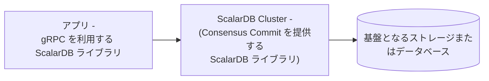

---
tags:
  - Enterprise Standard
  - Enterprise Premium
displayed_sidebar: docsJapanese
---

# ScalarDB Cluster の設定

import TranslationBanner from '/src/components/_translation-ja-jp.mdx';
import Tabs from '@theme/Tabs';
import TabItem from '@theme/TabItem';

<TranslationBanner />

このドキュメントでは、ScalarDB Cluster の設定について説明します。ScalarDB Cluster は複数のクラスターノードで構成されており、各クラスターノードを設定する必要があります。設定はプロパティファイルで指定する必要があります。

## クラスター設定

このセクションでは、ScalarDB Cluster の設定について説明します。

### 一般的な設定

ScalarDB Cluster では、次の一般的な設定が利用可能です。

#### トランザクション管理設定

##### `transaction_manager`

- **フィールド:** `scalar.db.transaction_manager`
- **説明:** ScalarDB のトランザクションマネージャー。[Consensus Commit](../consensus-commit.mdx) を使用するには `consensus-commit` を指定し、[非トランザクションストレージ操作を実行する](./run-non-transactional-storage-operations-through-scalardb-cluster.mdx) には `single-crud-operation` を指定します。`single-crud-operation` を使用する場合、`scalar.db.consensus_commit` プレフィックスの下の設定は無視されることに注意してください。
- **デフォルト値:** `consensus-commit`

##### `isolation_level`

- **フィールド:** `scalar.db.consensus_commit.isolation_level`
- **説明:** Consensus Commit に使用される分離レベル。`SNAPSHOT`、`SERIALIZABLE` または `READ_COMMITTED` のいずれかを指定できます。
- **デフォルト値:** `SNAPSHOT`

##### `coordinator.namespace`

- **フィールド:** `scalar.db.consensus_commit.coordinator.namespace`
- **説明:** Consensus Commit に使用される Coordinator テーブルの名前空間名。
- **デフォルト値:** `coordinator`

#### ノード設定

##### `cluster.membership.type`

- **フィールド:** `scalar.db.cluster.membership.type`
- **説明:** メンバーシップの種類。現在、`KUBERNETES` のみ指定できます。
- **デフォルト値:** `KUBERNETES`

##### `cluster.membership.kubernetes.endpoint.namespace_name`

- **フィールド:** `scalar.db.cluster.membership.kubernetes.endpoint.namespace_name`
- **説明:** この設定は、`KUBERNETES` メンバーシップタイプ用です。[endpoint resource](https://kubernetes.io/docs/concepts/services-networking/service/#endpoints) の名前空間名。
- **デフォルト値:** `default`

##### `cluster.membership.kubernetes.endpoint.name`

- **フィールド:** `scalar.db.cluster.membership.kubernetes.endpoint.name`
- **説明:** この設定は、`KUBERNETES` メンバーシップタイプ用です。メンバーシップ情報を取得するための [endpoint resource](https://kubernetes.io/docs/concepts/services-networking/service/#endpoints) の名前。
- **デフォルト値:** empty

##### `cluster.node.decommissioning_duration_secs`

- **フィールド:** `scalar.db.cluster.node.decommissioning_duration_secs`
- **説明:** ScalarDB Cluster ノード終了時に実際に廃止されるまでの期間（秒単位）。
- **デフォルト値:** `30`

##### `cluster.node.grpc.max_inbound_message_size`

- **フィールド:** `scalar.db.cluster.node.grpc.max_inbound_message_size`
- **説明:** 受信可能な最大メッセージサイズ。
- **デフォルト値:** gRPCのデフォルト値

##### `cluster.node.grpc.max_inbound_metadata_size`

- **フィールド:** `scalar.db.cluster.node.grpc.max_inbound_metadata_size`
- **説明:** 受信できるメタデータの最大サイズ。
- **デフォルト値:** gRPCのデフォルト値

##### `cluster.node.port`

- **フィールド:** `scalar.db.cluster.node.port`
- **説明:** ScalarDB Cluster ノードのポート番号。
- **デフォルト値:** `60053`

##### `cluster.node.prometheus_exporter_port`

- **フィールド:** `scalar.db.cluster.node.prometheus_exporter_port`
- **説明:** Prometheus エクスポーターのポート番号。
- **デフォルト値:** `9080`

##### `cluster.grpc.deadline_duration_millis`

- **フィールド:** `scalar.db.cluster.grpc.deadline_duration_millis`
- **説明:** gRPC の期限期間（ミリ秒単位）。
- **デフォルト値:** `60000` (60秒)

##### `cluster.node.standalone_mode.enabled`

- **フィールド:** `scalar.db.cluster.node.standalone_mode.enabled`
- **説明:** スタンドアロンモードが有効かどうか。スタンドアロンモードが有効になっている場合、メンバーシップ設定 (`scalar.db.cluster.membership.*`) は無視されることに注意してください。
- **デフォルト値:** `false`

##### `transaction.enabled`

- **フィールド:** `scalar.db.transaction.enabled`
- **説明:** トランザクション機能が有効かどうか。たとえば、埋め込み機能のみを使用する場合は、このプロパティを `false` に設定できます。
- **デフォルト値:** `true`

##### `cluster.node.scanner_management.expiration_time_millis`

- **フィールド:** `scalar.db.cluster.node.scanner_management.expiration_time_millis`
- **説明:** ScalarDB Cluster ノードは進行中のスキャナーを管理しています。このプロセスは、リソースリークを防ぐために、長時間アイドル状態のスキャナーを期限切れにします。この設定では、このスキャナー管理機能の有効期限をミリ秒単位で指定します。
- **デフォルト値:** `60000` (60秒)

### パフォーマンス関連の設定

Consensus Commit トランザクションマネージャーでは、次のパフォーマンス関連の設定が利用できます。

##### `parallel_executor_count`

- **フィールド:** `scalar.db.consensus_commit.parallel_executor_count`
- **説明:** 並列実行のためのエグゼキュータ (スレッド) の数。この数値は、ScalarDB Cluster ノード内または ScalarDB Core プロセス内のトランザクション全体のスレッド数の合計を示します。
- **デフォルト値:** `128`

##### `parallel_preparation.enabled`

- **フィールド:** `scalar.db.consensus_commit.parallel_preparation.enabled`
- **説明:** 準備フェーズが並行して実行されるかどうか。
- **デフォルト値:** `true`

##### `parallel_validation.enabled`

- **フィールド:** `scalar.db.consensus_commit.parallel_validation.enabled`
- **説明:** 検証フェーズ (`EXTRA_READ` 内) が並列で実行されるかどうか。
- **デフォルト値:** `scalar.db.consensus_commit.parallel_commit.enabled` の値

##### `parallel_commit.enabled`

- **フィールド:** `scalar.db.consensus_commit.parallel_commit.enabled`
- **説明:** コミットフェーズが並列で実行されるかどうか。
- **デフォルト値:** `true`

##### `parallel_rollback.enabled`

- **フィールド:** `scalar.db.consensus_commit.parallel_rollback.enabled`
- **説明:** ロールバックフェーズが並列で実行されるかどうか。
- **デフォルト値:** `scalar.db.consensus_commit.parallel_commit.enabled` の値

##### `async_commit.enabled`

- **フィールド:** `scalar.db.consensus_commit.async_commit.enabled`
- **説明:** コミットフェーズが非同期で実行されるかどうか。
- **デフォルト値:** `false`

##### `async_rollback.enabled`

- **フィールド:** `scalar.db.consensus_commit.async_rollback.enabled`
- **説明:** ロールバックフェーズが非同期に実行されるかどうか。
- **デフォルト値:** `scalar.db.consensus_commit.async_commit.enabled` の値

##### `parallel_implicit_pre_read.enabled`

- **フィールド:** `scalar.db.consensus_commit.parallel_implicit_pre_read.enabled`
- **説明:** 暗黙的な事前読み取りが並列で実行されるかどうか。
- **デフォルト値:** `true`

##### `one_phase_commit.enabled`

- **フィールド:** `scalar.db.consensus_commit.one_phase_commit.enabled`
- **説明:** 1フェーズコミット最適化が有効かどうか。
- **デフォルト値:** `false`

##### `coordinator.write_omission_on_read_only.enabled`

- **フィールド:** `scalar.db.consensus_commit.coordinator.write_omission_on_read_only.enabled`
- **説明:** 読み取り専用トランザクションに対して Coordinator テーブルへの書き込み省略最適化を有効にするかどうか。この最適化は、データを変更しない読み取り専用トランザクションに有効であり、Coordinator テーブルへの不要な書き込みを回避します。
- **デフォルト値:** `true`

##### `coordinator.group_commit.enabled`

- **フィールド:** `scalar.db.consensus_commit.coordinator.group_commit.enabled`
- **説明:** トランザクション状態のコミットがバッチモードで実行されるかどうか。この機能は、2フェーズコミットインターフェイスでは使用できません。
- **デフォルト値:** `false`

##### `coordinator.group_commit.slot_capacity`

- **フィールド:** `scalar.db.consensus_commit.coordinator.group_commit.slot_capacity`
- **説明:** グループコミット機能のグループ内のスロットの最大数。値が大きいとグループコミットの効率は向上しますが、待ち時間が増加し、トランザクションの競合が発生する可能性も高くなります。[^1]
- **デフォルト値:** `20`

##### `coordinator.group_commit.group_size_fix_timeout_millis`

- **フィールド:** `scalar.db.consensus_commit.coordinator.group_commit.group_size_fix_timeout_millis`
- **説明:** グループ内のスロットのサイズを固定するためのタイムアウト。値が大きいとグループコミットの効率が向上しますが、待ち時間が増加し、トランザクションの競合が発生する可能性も高くなります。[^1]
- **デフォルト値:** `40`

##### `coordinator.group_commit.delayed_slot_move_timeout_millis`

- **フィールド:** `scalar.db.consensus_commit.coordinator.group_commit.delayed_slot_move_timeout_millis`
- **説明:** 遅延スロットをグループから別の分離グループに移動して、元のグループが遅延トランザクションの影響を受けないようにするためのタイムアウト。値が大きいとグループコミットの効率が向上しますが、待ち時間が増加し、トランザクションの競合が発生する可能性も高くなります。[^1]
- **デフォルト値:** `1200`

##### `coordinator.group_commit.old_group_abort_timeout_millis`

- **フィールド:** `scalar.db.consensus_commit.coordinator.group_commit.old_group_abort_timeout_millis`
- **説明:** 進行中の古いグループをアボートするためのタイムアウト。値が小さいと、積極的なアボートによってリソースの消費量が減りますが、長時間実行されるトランザクションで不要なアボートが発生する可能性も高くなります。
- **デフォルト値:** `60000`

##### `coordinator.group_commit.timeout_check_interval_millis`

- **フィールド:** `scalar.db.consensus_commit.coordinator.group_commit.timeout_check_interval_millis`
- **説明:** グループコミット関連のタイムアウトをチェックする間隔。
- **デフォルト値:** `20`

##### `coordinator.group_commit.metrics_monitor_log_enabled`

- **フィールド:** `scalar.db.consensus_commit.coordinator.group_commit.metrics_monitor_log_enabled`
- **説明:** グループコミットのメトリックが定期的にログに記録されるかどうか。
- **デフォルト値:** `false`

### ストレージ関連の設定

ScalarDB には、複数のストレージ実装をサポートするストレージ（データベース）抽象化レイヤーがあります。`scalar.db.storage` プロパティを使用してストレージ実装を指定できます。

:::note

複数のストレージの使用の詳細については、[マルチストレージ設定](#マルチストレージ設定)を参照してください。

:::

データベースを選択して、各ストレージで使用可能な設定を確認します。

<Tabs groupId="databases" queryString>
  <TabItem value="JDBC_databases" label="JDBC databases" default>
    JDBC データベースでは次の設定を使用できます。

    ##### `storage`

    - **フィールド:** `scalar.db.storage`
    - **説明:** `jdbc` を指定する必要があります。
    - **デフォルト値:** -

    ##### `contact_points`

    - **フィールド:** `scalar.db.contact_points`
    - **説明:** JDBC 接続 URL。
    - **デフォルト値:** 

    ##### `username`

    - **フィールド:** `scalar.db.username`
    - **説明:** データベースにアクセスするためのユーザー名。
    - **デフォルト値:** 

    ##### `password`

    - **フィールド:** `scalar.db.password`
    - **説明:** データベースにアクセスするためのパスワード。
    - **デフォルト値:** 

    ##### `jdbc.connection_pool.min_idle`

    - **フィールド:** `scalar.db.jdbc.connection_pool.min_idle`
    - **説明:** コネクションプール内のアイドルコネクションの最小数。
    - **デフォルト値:** `20`

    ##### `jdbc.connection_pool.max_idle`

    - **フィールド:** `scalar.db.jdbc.connection_pool.max_idle`
    - **説明:** コネクションプール内でアイドル状態のままにできるコネクションの最大数。
    - **デフォルト値:** `50`

    ##### `jdbc.connection_pool.max_total`

    - **フィールド:** `scalar.db.jdbc.connection_pool.max_total`
    - **説明:** コネクションプールで同時にアクティブにできるアイドルコネクションと利用中コネクションの最大合計数。制限がない場合は負の値を使用します。
    - **デフォルト値:** `200`

    ##### `jdbc.prepared_statements_pool.enabled`

    - **フィールド:** `scalar.db.jdbc.prepared_statements_pool.enabled`
    - **説明:** このプロパティを `true` に設定すると、準備されたステートメントのプールが有効になります。
    - **デフォルト値:** `false`

    ##### `jdbc.prepared_statements_pool.max_open`

    - **フィールド:** `scalar.db.jdbc.prepared_statements_pool.max_open`
    - **説明:** ステートメントプールから同時に割り当てることができるオープンステートメントの最大数。制限がない場合は負の値を使用します。
    - **デフォルト値:** `-1`

    ##### `jdbc.isolation_level`

    - **フィールド:** `scalar.db.jdbc.isolation_level`
    - **説明:** JDBC の分離レベル。`READ_COMMITTED`、`REPEATABLE_READ`、または `SERIALIZABLE` を指定できます。
    - **デフォルト値:** 基盤データベース固有

    ##### `jdbc.table_metadata.connection_pool.min_idle`

    - **フィールド:** `scalar.db.jdbc.table_metadata.connection_pool.min_idle`
    - **説明:** テーブルメタデータのコネクションプール内のアイドルコネクションの最小数。
    - **デフォルト値:** `5`

    ##### `jdbc.table_metadata.connection_pool.max_idle`

    - **フィールド:** `scalar.db.jdbc.table_metadata.connection_pool.max_idle`
    - **説明:** テーブルメタデータのコネクションプール内でアイドル状態のままにできるコネクションの最大数。
    - **デフォルト値:** `10`

    ##### `jdbc.table_metadata.connection_pool.max_total`

    - **フィールド:** `scalar.db.jdbc.table_metadata.connection_pool.max_total`
    - **説明:** テーブルメタデータのコネクションプールで同時にアクティブにできるアイドルコネクションと利用中コネクションの最大合計数。制限がない場合は負の値を使用します。
    - **デフォルト値:** `25`

    ##### `jdbc.admin.connection_pool.min_idle`

    - **フィールド:** `scalar.db.jdbc.admin.connection_pool.min_idle`
    - **説明:** 管理者のコネクションプール内のアイドルコネクションの最小数。
    - **デフォルト値:** `5`

    ##### `jdbc.admin.connection_pool.max_idle`

    - **フィールド:** `scalar.db.jdbc.admin.connection_pool.max_idle`
    - **説明:** 管理者のコネクションプール内でアイドル状態のままにできるコネクションの最大数。
    - **デフォルト値:** `10`

    ##### `jdbc.admin.connection_pool.max_total`

    - **フィールド:** `scalar.db.jdbc.admin.connection_pool.max_total`
    - **説明:** 管理者のコネクションプールで同時にアクティブにできるアイドルコネクションと利用中コネクションの最大合計数。制限がない場合は負の値を使用します。
    - **デフォルト値:** `25`

    ##### `jdbc.db2.variable_key_column_size`

    - **フィールド:** `scalar.db.jdbc.db2.variable_key_column_size`
    - **説明:** IBM Db2 で主キーまたはセカンダリキーとして使用される場合の TEXT 列と BLOB 列の列サイズ。最小 64 バイト。
    - **デフォルト値:** `128`

    ##### `jdbc.db2.time_column.default_date_component`

    - **フィールド:** `scalar.db.jdbc.db2.time_column.default_date_component`
    - **説明:** IBM Db2 で `TIME` データを格納するために使用される日付コンポーネントの値。ScalarDB の `TIME` 型データを格納するために IBM Db2 の TIMESTAMP 型が使用されるため (小数秒の精度を提供するため)、ScalarDB は比較と並べ替えを容易にするために、同じ日付コンポーネント値を持つ `TIME` データを保存します。
    - **デフォルト値:** `1970-01-01`

:::note

SQLite3 を JDBC データベースとして使用している場合は、`scalar.db.contact_points` を次のように設定する必要があります。

```properties
scalar.db.contact_points=jdbc:sqlite:<SQLITE_DB_FILE_PATH>?busy_timeout=10000
```

他の JDBC データベースとは異なり、[SQLite3 doesn't fully support concurrent access](https://www.sqlite.org/lang_transaction.html)。[`SQLITE_BUSY`](https://www.sqlite.org/rescode.html#busy) によって内部的に頻繁に発生するエラーを回避するには、[`busy_timeout`](https://www.sqlite.org/c3ref/busy_timeout.html) パラメータを設定することをお勧めします。

:::
</TabItem>
<TabItem value="DynamoDB" label="DynamoDB">
DynamoDB では次の設定が利用可能です。

    ##### `storage`

    - **フィールド:** `scalar.db.storage`
    - **説明:** `dynamo` を指定する必要があります。
    - **デフォルト値:** -

    ##### `contact_points`

    - **フィールド:** `scalar.db.contact_points`
    - **説明:** ScalarDB が通信する AWS リージョン (例: `us-east-1`)。
    - **デフォルト値:** 

    ##### `username`

    - **フィールド:** `scalar.db.username`
    - **説明:** AWS とやり取りするユーザーを識別するために使用される AWS アクセスキー。
    - **デフォルト値:** 

    ##### `password`

    - **フィールド:** `scalar.db.password`
    - **説明:** AWS と対話するユーザーを認証するために使用される AWS シークレットアクセスキー。
    - **デフォルト値:** 

    ##### `dynamo.endpoint_override`

    - **フィールド:** `scalar.db.dynamo.endpoint_override`
    - **説明:** ScalarDB が通信する Amazon DynamoDB エンドポイント。これは主に、AWS サービスではなくローカルインスタンスでのテストに使用されます。
    - **デフォルト値:** 

    ##### `dynamo.namespace.prefix`

    - **フィールド:** `scalar.db.dynamo.namespace.prefix`
    - **説明:** ユーザー名前空間とメタデータ名前空間名のプレフィックス。AWS では単一の AWS リージョン内で一意のテーブル名を持つ必要があるため、単一の AWS リージョン内で複数の ScalarDB 環境 (開発、本番など) を使用する場合に便利です。
    - **デフォルト値:** 
  </TabItem>
  <TabItem value="Cosmos_DB_for_NoSQL" label="Cosmos DB for NoSQL">
    CosmosDB for NoSQL では次の設定が利用可能です。

    ##### `storage`

    - **フィールド:** `scalar.db.storage`
    - **説明:** `cosmos` を指定する必要があります。
    - **デフォルト値:** -

    ##### `contact_points`

    - **フィールド:** `scalar.db.contact_points`
    - **説明:** ScalarDB が通信する NoSQL エンドポイント用の Azure Cosmos DB。
    - **デフォルト値:** 

    ##### `password`

    - **フィールド:** `scalar.db.password`
    - **説明:** Azure Cosmos DB for NoSQL にアクセスするための認証を実行するために使用されるマスターキーまたは読み取り専用キーのいずれか。
    - **デフォルト値:** 

    ##### `cosmos.consistency_level`

    - **フィールド:** `scalar.db.cosmos.consistency_level`
    - **説明:** Cosmos DB 操作に使用される一貫性レベル。`STRONG` または `BOUNDED_STALENESS` を指定できます。
    - **デフォルト値:** `STRONG`
  </TabItem>
  <TabItem value="Cassandra" label="Cassandra">
    Cassandra では次の設定が利用可能です。

    ##### `storage`

    - **フィールド:** `scalar.db.storage`
    - **説明:** `cassandra` を指定する必要があります。
    - **デフォルト値:** -

    ##### `contact_points`

    - **フィールド:** `scalar.db.contact_points`
    - **説明:** カンマで区切られた連絡先。
    - **デフォルト値:** 

    ##### `contact_port`

    - **フィールド:** `scalar.db.contact_port`
    - **説明:** すべての連絡先ポイントのポート番号。
    - **デフォルト値:** 

    ##### `username`

    - **フィールド:** `scalar.db.username`
    - **説明:** データベースにアクセスするためのユーザー名。
    - **デフォルト値:** 

    ##### `password`

    - **フィールド:** `scalar.db.password`
    - **説明:** データベースにアクセスするためのパスワード。
    - **デフォルト値:** 
  </TabItem>
</Tabs>

#### マルチストレージ設定

ScalarDB は複数のストレージ実装の同時使用をサポートしています。複数のストレージの使用の詳細については、[マルチストレージトランザクション](../multi-storage-transactions.mdx)を参照してください。

##### `storage`

- **フィールド:** `scalar.db.storage`
- **説明:** `multi-storage` を指定する必要があります。

##### `multi_storage.storages`

- **フィールド:** `scalar.db.multi_storage.storages`
- **説明:** カンマ区切りのストレージ名（例: `cassandra,mysql`）。これらのストレージ名は、名前空間をストレージにマップするために `scalar.db.multi_storage.namespace_mapping` プロパティで使用されます。
- **デフォルト値:** empty

##### `multi_storage.default_storage`

- **フィールド:** `scalar.db.multi_storage.default_storage`
- **説明:** デフォルトのストレージ名。このストレージは、`scalar.db.multi_storage.namespace_mapping` プロパティでマッピングが定義されていない名前空間に使用されます。
- **デフォルト値:** empty

##### `multi_storage.namespace_mapping`

- **フィールド:** `scalar.db.multi_storage.namespace_mapping`
- **説明:** 名前空間からストレージへのマッピング（例: `user:my_cassandra,coordinator:my_mysql`）。
- **デフォルト値:** empty

:::tip

ストレージ名（`<STORAGE_NAME_FOR_NAMESPACE>`）は、定義する必要がある任意の値です。マルチストレージ設定全体で一貫している限り、好きな名前を使用できます。

:::

##### `multi_storage.storages.<STORAGE_NAME_FOR_NAMESPACE>.<PROPERTY_NAME>`

特定のストレージを設定するには、`scalar.db.multi_storage.storages.<STORAGE_NAME_FOR_NAMESPACE>.<PROPERTY_NAME>` を使用します。ここで、`<STORAGE_NAME_FOR_NAMESPACE>` は `scalar.db.multi_storage.storages` プロパティで指定されたストレージ名の1つであり、`<PROPERTY_NAME>` は特定のストレージのプロパティ名です。

例えば、[名前空間マッピング](#multi_storagenamespace_mapping)を `scalar.db.multi_storage.namespace_mapping=user:my_cassandra,coordinator:my_mysql` として定義した場合、`my_cassandra` と `my_mysql` がそれぞれ `user` と `coordinator` 名前空間のストレージ名になります:

- `scalar.db.multi_storage.storages.my_cassandra.contact_points` を使用して Cassandra のコンタクトポイントを指定できます。
- `scalar.db.multi_storage.storages.my_mysql.jdbc.connection_pool.max_idle` を使用して MySQL のコネクションプール設定の最大アイドル時間を指定できます。

各ストレージで使用可能なプロパティの詳細については、[ストレージ関連の設定](#ストレージ関連の設定)を参照してください。

##### パーティション間スキャン設定

以下で説明するようにパーティション間スキャンオプションを有効にすると、`Scan` 操作でパーティション全体のすべてのレコードを取得できます。さらに、`cross_partition_scan.filtering` と `cross_partition_scan.ordering` をそれぞれ有効にすることで、パーティション間 `Scan` 操作で任意の条件と順序を指定できます。現在、順序付けオプション付きのパーティション間スキャンは、JDBC データベースでのみ使用できます。フィルタリングと順序付けを有効にするには、`scalar.db.cross_partition_scan.enabled` を `true` に設定する必要があります。

パーティション間スキャンの使用方法の詳細については、[スキャン操作](../api-guide.mdx#スキャン操作)を参照してください。

:::warning

非 JDBC データベースの場合、トランザクションはより低い分離レベル (つまり、`SNAPSHOT`) で実行される可能性があるため、`SERIALIAZABLE` 分離レベルでパーティション間スキャンを有効にすることはお勧めしません。非 JDBC データベースを使用する場合は、トランザクションの一貫性が重要でない場合にのみ、自己責任でパーティション間スキャンを使用してください。

:::

##### `cross_partition_scan.enabled`

- **フィールド:** `scalar.db.cross_partition_scan.enabled`
- **説明:** パーティション間スキャンを有効にします。
- **デフォルト値:** `false`

##### `cross_partition_scan.filtering.enabled`

- **フィールド:** `scalar.db.cross_partition_scan.filtering.enabled`
- **説明:** パーティション間スキャンでフィルタリングを有効にします。
- **デフォルト値:** `false`

##### `cross_partition_scan.ordering.enabled`

- **フィールド:** `scalar.db.cross_partition_scan.ordering.enabled`
- **説明:** パーティション間スキャンで順序付けを有効にします。
- **デフォルト値:** `false`

##### スキャンフェッチサイズ

ストレージのスキャン操作でフェッチサイズを次のプロパティで設定できます。

##### `scan_fetch_size`

- **フィールド:** `scalar.db.scan_fetch_size`
- **説明:** ストレージのスキャン操作時に一度に取得するレコード数を指定します。値を大きくすると、大きな結果セットの場合にストレージへのアクセスの往復回数が減りパフォーマンスが向上しますが、メモリ使用量も増加します。値を小さくするとメモリ使用量は減りますが、レイテンシが増加する場合があります。
- **デフォルト値:** `10`

## ScalarDB Cluster GraphQL の設定

ScalarDB Cluster GraphQL の設定は次のとおりです。

##### `graphql.enabled`

- **フィールド:** `scalar.db.graphql.enabled`
- **説明:** ScalarDB Cluster GraphQL が有効かどうか。
- **デフォルト値:** `false`

##### `graphql.port`

- **フィールド:** `scalar.db.graphql.port`
- **説明:** GraphQL サーバーのポート番号。
- **デフォルト値:** `8080`

##### `graphql.path`

- **フィールド:** `scalar.db.graphql.path`
- **説明:** GraphQL エンドポイントの URL のパスコンポーネント。
- **デフォルト値:** `/graphql`

##### `graphql.namespaces`

- **フィールド:** `scalar.db.graphql.namespaces`
- **説明:** GraphQL サーバーがスキーマを生成するテーブルの名前空間のコンマ区切りリスト。指定しない場合、GraphQL サーバーは、すべての ScalarDB 管理名前空間内のすべてのテーブルのスキーマを生成します。
- **デフォルト値:** 

##### `graphql.graphiql`

- **フィールド:** `scalar.db.graphql.graphiql`
- **説明:** GraphQL サーバーが [GraphiQL](https://github.com/graphql/graphiql) IDE を提供するかどうか。
- **デフォルト値:** `true`

##### `graphql.schema_checking_interval_millis`

- **フィールド:** `scalar.db.graphql.schema_checking_interval_millis`
- **説明:** ScalarDB スキーマに変更が検出された場合に GraphQL サーバーが GraphQL スキーマを再構築する間隔 (ミリ秒単位)。
- **デフォルト値:** `30000` (30秒)

#### サーバーの実行中に ScalarDB スキーマを作成または変更する

GraphQL スキーマはサーバーの起動時に静的に構築されるため、ScalarDB スキーマが変更された場合 (たとえば、テーブルが追加、変更、または削除された場合)、対応する GraphQL スキーマは再構築されない限り変更を反映しません。これに対処するために、GraphQL サーバーは、定期的なチェックとオンデマンドチェックの2つのメカニズムを提供します。

##### 定期的なチェックを実行する

サーバーは、ScalarDB スキーマに変更が発生したかどうかを定期的にチェックし、必要に応じて対応する GraphQL スキーマを再構築します。デフォルトでは、チェックは30秒ごとに行われますが、間隔は `scalar.db.graphql.schema_checking_interval_millis` プロパティを使用して設定できます。

定期的なチェックを実行する必要がない場合は、プロパティ値を `-1` に設定して無効にすることができます。

##### オンデマンドチェックを実行する

また、HTTP API の `/update-graphql-schema` エンドポイントに POST リクエストを実行して、サーバーに ScalarDB スキーマの変更をチェックし、必要に応じて対応する GraphQL スキーマを再構築するように要求することもできます。

たとえば、HTTP API が `localhost:8080` で実行されていて、`scalar.db.graphql.path` プロパティが `/graphql` に設定されている場合、次のコマンドを実行してこのエンドポイントを呼び出すことができます。

```console
curl -X POST http://localhost:8080/graphql/update-graphql-schema
```

### SQL 関連の設定

ScalarDB Cluster SQL の設定は次のとおりです。

##### `sql.enabled`

- **フィールド:** `scalar.db.sql.enabled`
- **説明:** ScalarDB Cluster SQL が有効かどうか。
- **デフォルト値:** `false`

##### `sql.statement_cache.enabled`

- **フィールド:** `scalar.db.sql.statement_cache.enabled`
- **説明:** ステートメントキャッシュを有効にします。
- **デフォルト値:** `false`

##### `sql.statement_cache.size`

- **フィールド:** `scalar.db.sql.statement_cache.size`
- **説明:** キャッシュされたステートメントの最大数。
- **デフォルト値:** `100`

##### `sql.default_transaction_mode`

- **フィールド:** `scalar.db.sql.default_transaction_mode`
- **説明:** デフォルトのトランザクションモード。`TRANSACTION` または `TWO_PHASE_COMMIT_TRANSACTION` を設定できます。
- **デフォルト値:** `TRANSACTION`

##### `sql.default_namespace_name`

- **フィールド:** `scalar.db.sql.default_namespace_name`
- **説明:** デフォルトの名前空間名。SQL ステートメントで名前空間名を指定しない場合は、この値が使用されます。
- **デフォルト値:** 

### ABAC 設定

属性ベースアクセス制御 (ABAC) の設定は次のとおりです。

:::warning

単一 CRUD 操作トランザクションマネージャーは ABAC をサポートしていません。

:::

##### `abac.enabled`

- **フィールド:** `scalar.db.cluster.abac.enabled`
- **説明:** ABAC 機能が有効になっているかどうか。
- **デフォルト値:** `false`

:::warning

ABAC機能を有効にする場合は、以下を行う必要があります:

- 認証と認可を有効にします。詳細については、[ユーザーの認証と認可](./scalardb-auth-with-sql.mdx)を参照してください。
- システム名前空間（デフォルトでは `scalardb`）に対して [`scalar.db.cross_partition_scan.enabled`](#パーティション間スキャン設定) を `true` に設定します。これは、ABAC 機能が内部的にクロスパーティションスキャンを実行するためです。

:::

##### `abac.cache_expiration_time_millis`

- **フィールド:** `scalar.db.cluster.abac.cache_expiration_time_millis`
- **説明:** ABAC メタデータキャッシュのキャッシュ有効期限時間 (ミリ秒)。ABAC メタデータ (ポリシー設定など) を更新した場合、変更が適用されるまで、この有効期限時間に達するまで待つ必要がある場合があります。このプロパティを低い数値に設定すると、バックエンドデータベースへのアクセス数が増加し、パフォーマンスが低下する可能性があります。
- **デフォルト値:** `60000` (1分)

### 認証と認可の設定

以下は、ScalarDB Cluster の認証と認可の設定です。

#### `auth.enabled`

- **フィールド:** `scalar.db.cluster.auth.enabled`
- **説明:** 認証と認可が有効になっているかどうか。
- **デフォルト値:** `false`

:::warning

認証と認可を有効にする場合、システム名前空間（デフォルトでは `scalardb`）に対して [`scalar.db.cross_partition_scan.enabled`](#パーティション間スキャン設定) を `true` に設定する必要もあります。これは、ABAC 機能が内部的にクロスパーティションスキャンを実行するためです。

:::

#### `auth.cache_expiration_time_millis`

- **フィールド:** `scalar.db.cluster.auth.cache_expiration_time_millis`
- **説明:** 認証と認可情報のキャッシュ有効期限時間（ミリ秒単位）。
- **デフォルト値:** `60000` (1分)

#### `auth.auth_token_expiration_time_minutes`

- **フィールド:** `scalar.db.cluster.auth.auth_token_expiration_time_minutes`
- **説明:** 認証と認可トークンの有効期限時間（分単位）。
- **デフォルト値:** `1440` (1日)

#### `auth.auth_token_gc_thread_interval_minutes`

- **フィールド:** `scalar.db.cluster.auth.auth_token_gc_thread_interval_minutes`
- **説明:** 認証と認可トークンのガベージコレクション (GC) スレッド間隔 (分単位)。
- **デフォルト値:** `360` (6時間)

#### `auth.pepper`

- **フィールド:** `scalar.db.cluster.auth.pepper`
- **説明:** ハッシュ化前にパスワードに追加される秘密の値。指定されない場合、パスワードはペッパーなしでハッシュ化されます。
- **デフォルト値:** empty

## その他の ScalarDB Cluster 設定

ScalarDB Cluster で使用できる追加の設定は次のとおりです。

##### `metadata.cache_expiration_time_secs`

- **フィールド:** `scalar.db.metadata.cache_expiration_time_secs`
- **説明:** ScalarDB には、データベースへのリクエスト数を減らすためのメタデータキャッシュがあります。この設定では、キャッシュの有効期限を秒単位で指定します。`-1`を指定した場合は、キャッシュは期限切れになりません。
- **デフォルト値:** `60`

##### `active_transaction_management.expiration_time_millis`

- **フィールド:** `scalar.db.active_transaction_management.expiration_time_millis`
- **説明:** ScalarDB は進行中のトランザクションを管理しており、トランザクション ID を使用して再開できます。このプロセスは、リソースリークを防ぐために、長時間アイドル状態のトランザクションを期限切れにします。この設定は、このトランザクション管理機能の有効期限をミリ秒単位で指定します。
- **デフォルト値:** `60000` (60秒)

##### `consensus_commit.include_metadata.enabled`

- **フィールド:** `scalar.db.consensus_commit.include_metadata.enabled`
- **説明:** Consensus Commit を使用している場合に、`true` に設定すると、`Get` および `Scan` 操作の結果にトランザクションメタデータが含まれます。特定のテーブルのトランザクションメタデータ列の詳細を表示するには、`DistributedTransactionAdmin.getTableMetadata()` メソッドを使用します。このメソッドは、トランザクションメタデータ列が追加されたテーブルメタデータを返します。この設定を使用すると、トランザクション関連の問題を調査するのに役立ちます。
- **デフォルト値:** `false`

##### `default_namespace_name`

- **フィールド:** `scalar.db.default_namespace_name`
- **説明:** 指定された名前空間名は、名前空間を指定していない操作によって使用されます。
- **デフォルト値:** 

## クライアント設定

このセクションでは、ScalarDB Cluster クライアントの一般的な設定について説明します。

### プリミティブインターフェイスの設定

次の表は、ScalarDB Cluster クライアントの一般的な設定を示しています。

##### `transaction_manager`

- **フィールド:** `scalar.db.transaction_manager`
- **説明:** `cluster` を指定する必要があります。
- **デフォルト値:** -

##### `contact_points`

- **フィールド:** `scalar.db.contact_points`
- **説明:** クラスターの接続先。`indirect` クライアントモードを使用する場合は、`indirect:<LOAD_BALANCER_IP_ADDRESS>` 形式を使用して、クラスターノードの前にあるロードバランサーの IP アドレスを指定します。`direct-kubernetes` クライアントモードを使用する場合は、`direct-kubernetes:<NAMESPACE_NAME>/<ENDPOINT_NAME>` または `direct-kubernetes:<ENDPOINT_NAME>` 形式を使用して、メンバーシップ情報を取得するための名前空間名 (オプション) と [endpoint resource](https://kubernetes.io/docs/concepts/services-networking/service/#endpoints) の名前を指定します。名前空間名を指定しない場合、クライアントは `default` 名前空間を使用します。
- **デフォルト値:** 

##### `contact_port`

- **フィールド:** `scalar.db.contact_port`
- **説明:** 接続先のポート番号。
- **デフォルト値:** `60053`

##### `cluster.grpc.deadline_duration_millis`

- **フィールド:** `scalar.db.cluster.grpc.deadline_duration_millis`
- **説明:** gRPC の期限期間 (ミリ秒単位)。
- **デフォルト値:** `60000` (60秒)

##### `cluster.grpc.max_inbound_message_size`

- **フィールド:** `scalar.db.cluster.grpc.max_inbound_message_size`
- **説明:** 単一の gRPC フレームに許可される最大メッセージサイズ。
- **デフォルト値:** gRPC のデフォルト値

##### `cluster.grpc.max_inbound_metadata_size`

- **フィールド:** `scalar.db.cluster.grpc.max_inbound_metadata_size`
- **説明:** 受信できるメタデータの最大サイズ。
- **デフォルト値:** gRPC のデフォルト値

##### `cluster.client.scan_fetch_size`

- **フィールド:** `scalar.db.cluster.client.scan_fetch_size`
- **説明:** クラスターからデータを取得するために `Scanner` で使用されるフェッチサイズ。これは、`Scanner` がクラスターから一度に取得するレコード数です。値を大きくすると、クラスターへの往復回数が減ってパフォーマンスが向上しますが、メモリ使用量も増加する可能性があります。
- **デフォルト値:** `10`

たとえば、`indirect` クライアントモードを使用し、ロードバランサーの IP アドレスが `192.168.10.1` の場合、次のようにクライアントを設定できます。

```properties
scalar.db.transaction_manager=cluster
scalar.db.contact_points=indirect:192.168.10.1
```

または、`direct-kubernetes` クライアントモードを使用し、エンドポイントの名前空間が `ns`、エンドポイント名が `scalardb-cluster` の場合、次のようにクライアントを設定できます。

```properties
scalar.db.transaction_manager=cluster
scalar.db.contact_points=direct-kubernetes:ns/scalardb-cluster
```

### SQL インターフェイスの設定

次の表は、ScalarDB Cluster SQL クライアントの設定を示しています。

##### `sql.cluster_mode.contact_points`

- **フィールド:** `scalar.db.sql.cluster_mode.contact_points`
- **説明:** クラスターの接続先。`indirect` クライアントモードを使用する場合は、`indirect:<LOAD_BALANCER_IP_ADDRESS>` 形式を使用して、クラスターノードの前にあるロードバランサーの IP アドレスを指定します。`direct-kubernetes` クライアントモードを使用する場合は、`direct-kubernetes:<NAMESPACE_NAME>/<ENDPOINT_NAME>` または `direct-kubernetes:<ENDPOINT_NAME>` 形式を使用して、メンバーシップ情報を取得するための名前空間名 (オプション) と [endpoint resource](https://kubernetes.io/docs/concepts/services-networking/service/#endpoints) の名前を指定します。名前空間名を指定しない場合、クライアントは `default` 名前空間を使用します。
- **デフォルト値:** 

##### `sql.cluster_mode.contact_port`

- **フィールド:** `scalar.db.sql.cluster_mode.contact_port`
- **説明:** 接続先のポート番号。
- **デフォルト値:** `60053`

##### `sql.default_transaction_mode`

- **フィールド:** `scalar.db.sql.default_transaction_mode`
- **説明:** デフォルトのトランザクションモード。`TRANSACTION` または `TWO_PHASE_COMMIT_TRANSACTION` を設定できます。
- **デフォルト値:** `TRANSACTION`

##### `sql.default_namespace_name`

- **フィールド:** `scalar.db.sql.default_namespace_name`
- **説明:** デフォルトの名前空間名。SQL ステートメントで名前空間名を指定しない場合は、この値が使用されます。
- **デフォルト値:** 

##### `cluster.grpc.deadline_duration_millis`

- **フィールド:** `scalar.db.cluster.grpc.deadline_duration_millis`
- **説明:** gRPC の期限期間 (ミリ秒単位)。
- **デフォルト値:** `60000` (60秒)

##### `cluster.grpc.max_inbound_message_size`

- **フィールド:** `scalar.db.cluster.grpc.max_inbound_message_size`
- **説明:** 単一の gRPC フレームに許可される最大メッセージサイズ。
- **デフォルト値:** gRPC のデフォルト値

##### `cluster.grpc.max_inbound_metadata_size`

- **フィールド:** `scalar.db.cluster.grpc.max_inbound_metadata_size`
- **説明:** 受信できるメタデータの最大サイズ。
- **デフォルト値:** gRPC のデフォルト値

たとえば、`indirect` クライアントモードを使用し、ロードバランサーの IP アドレスが `192.168.10.1` の場合、次のようにクライアントを設定できます。

```properties
scalar.db.sql.connection_mode=cluster
scalar.db.sql.cluster_mode.contact_points=indirect:192.168.10.1
```

または、`direct-kubernetes` クライアントモードを使用し、エンドポイントの名前空間が `ns`、エンドポイント名が `scalardb-cluster` の場合、次のようにクライアントを設定できます。

```properties
scalar.db.sql.connection_mode=cluster
scalar.db.sql.cluster_mode.contact_points=direct-kubernetes:ns/scalardb-cluster
```

ScalarDB JDBC の設定方法の詳細については、[JDBC 接続 URL](../scalardb-sql/jdbc-guide.mdx#jdbc-接続-url) を参照してください。

Spring Data JDBC for ScalarDB の設定方法の詳細については、[設定](../scalardb-sql/spring-data-guide.mdx#設定)を参照してください。

#### 認証と認可の設定

以下は、ScalarDB Cluster クライアントの認証と認可の設定です。

##### `auth.enabled`

- **フィールド:** `scalar.db.cluster.auth.enabled`
- **説明:** 認証と認可が有効になっているかどうか。
- **デフォルト値:** `false`

:::warning

認証と認可を有効にする場合、システム名前空間（デフォルトでは `scalardb`）に対して [`scalar.db.cross_partition_scan.enabled`](#パーティション間スキャン設定) を `true` に設定する必要もあります。これは、ABAC 機能が内部的にクロスパーティションスキャンを実行するためです。

:::

##### `auth.username`

- **フィールド:** `scalar.db.sql.cluster_mode.username`
- **説明:** クライアントのユーザー名。
- **デフォルト値:** empty

##### `auth.password`

- **フィールド:** `scalar.db.sql.cluster_mode.password`
- **説明:** クライアントのパスワード。
- **デフォルト値:** empty

## 設定例 - アプリ、ScalarDB Cluster、データベース



この設定例では、アプリ (gRPC を利用する ScalarDB ライブラリ) が ScalarDB Cluster を通じて基盤となるストレージまたはデータベース (この場合は Cassandra) に接続しています。ScalarDB Cluster は、ScalarDB Enterprise エディションでのみ利用可能なコンポーネントです。

:::note

この設定は、ScalarDB Cluster が [Scalar Admin](https://github.com/scalar-labs/scalar-admin) インターフェースを実装しているため、本番環境での使用に適しています。このインターフェースにより、ScalarDB Cluster を一時停止することで、ScalarDB のトランザクション的に一貫性のあるバックアップを作成できます。

:::

アプリを ScalarDB Cluster を通じて基盤となるデータベースに接続する設定例を以下に示します。

```properties
# トランザクションマネージャーの実装。
scalar.db.transaction_manager=cluster

# クラスターの接続先。
scalar.db.contact_points=indirect:<SCALARDB_CLUSTER_CONTACT_POINT>
```

クライアント設定の詳細については、[ScalarDB Cluster クライアント設定](#クライアント設定) を参照してください。

[^1]: アプリケーションのアクセスパターンを考慮し、アプリケーションで使用するストレージと同じストレージを使用して、いくつかのバリエーション（例：デフォルト値の75%と125%）でパフォーマンスをベンチマークし、最適な設定を決定することをお勧めします。適切な設定は、これらの要素に強く依存して決まります。また、最適な組み合わせを決定するために、これらのパラメータの組み合わせをベンチマークすることも重要です（例：最初に `slot_capacity:20` と `group_size_fix_timeout_millis:40`、次に `slot_capacity:30` と `group_size_fix_timeout_millis:40`、3番目に `slot_capacity:20` と `group_size_fix_timeout_millis:80`）。
