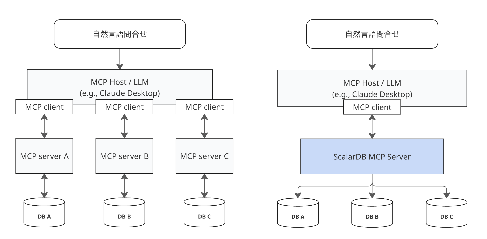

---
tags:
  - Community
  - Enterprise Standard
  - Enterprise Premium
displayed_sidebar: docsJapanese
---

# ScalarDB MCP Server をはじめよう

import TranslationBanner from '/src/components/_translation-ja-jp.mdx';

<TranslationBanner />

import Tabs from '@theme/Tabs';
import TabItem from '@theme/TabItem';

ScalarDB MCP Server は、LLM が ScalarDB を通じてデータにアクセス・管理できるようにする [Model Context Protocol (MCP) ](https://modelcontextprotocol.io/) の実装です。LLM を活用することで、自然言語を使用して、複数のサイロ化しているデータベースを跨いで検索と更新を行うことができます。

ScalarDB MCP Server は、単一データベースと複数ストレージ構成の両方で動作します。各データベースに個別の MCP サーバーが必要な従来のアプローチとは異なり、ScalarDB MCP Server は [ScalarDB のマルチストレージ機能](../multi-storage-transactions.mdx)を活用して、単一の MCP サーバーを通じて複数・異種のデータベース (PostgreSQL、MySQL、Cosmos DB、DynamoDB など) への統一アクセスを提供します。自然言語でクエリを送信するだけで、サーバーがデータベース全体で適切な操作を自動的に実行し、意思決定プロセスの改善と迅速化を実現します。

## アーキテクチャと主要機能

以下の図は、ScalarDB MCP Server が従来のアプローチとどのように異なるかを示しています。各データベースに個別の MCP サーバーが必要ではなく、ScalarDB MCP Server に一度接続するだけで、ScalarDB を通じてすべてのデータベースにアクセスできます。



ScalarDB MCP Server の中核では、以下の機能を提供します。

### ScalarDB 接続

MCP サーバーは設定に応じて ScalarDB Core ライブラリを用いる、もしくは、ScalarDB Cluster にクライアントライブラリを用いて接続します。つまり、ScalarDB とのやりとりにそれらのライブラリの使い方を知る必要はありません。

### トランザクション操作

ScalarDB MCP Server は ACID 準拠のトランザクションをサポートし、LLM が複数の操作を安全に実行できるようにします。LLM が操作をグループ化する必要があると判断した場合、MCP サーバーは操作がすべて成功するかすべて失敗するかを保証し、データベース全体でデータの整合性を維持します。

### 操作モード

ScalarDB MCP Server は、ScalarDB の構成に合わせた2つの操作モード (SQL モードと CRUD モード) をサポートします。

#### SQL モード

SQL モードは、データベース操作用の SQL インターフェースを提供します。自然言語でリクエストを行うと、LLM が ScalarDB でサポートされている SQL 操作を通じて SQL コマンドを自動的に生成および実行し、標準の SQL 構文 (`BEGIN`、`COMMIT`、`ROLLBACK`) を使用してトランザクションを処理します。LLM がすべての操作を実行するのに1つのツールのみを使用する必要があるため、このモードはより効率的である可能性があります。SQL モードは、ScalarDB Cluster でのみ利用可能です。

#### CRUD モード

CRUD モードは、操作をプログラム的に制御したい場合に使用します。ScalarDB Core には SQL インターフェースが含まれていないため、このモードでは代わりに ScalarDB のネイティブ SDK 操作を使用します。LLM は、スキーマ管理、CRUD 操作、明示的なトランザクション制御の個別ツールを使用して、自然言語リクエストを適切な SDK 呼び出しに変換します。LLM が操作を完了するために複数のツールを使用する必要があるため、このモードは効率が劣る可能性があります。

### デプロイメントの制限

:::note

ScalarDB MCP Server は現在、ローカルデプロイメント専用の STDIO モードで実行されます。Server-Sent Events (SSE) によるリモートサーバーデプロイメントはまだサポートされていませんが、将来のリリースで計画されています。

**これが意味すること:**

- ✅ MCP サーバーは AI クライアント (Claude Desktop、Visual Studio Code など) と一緒にローカルで実行されます。
- ✅ 開発、テスト、シングルユーザーシナリオに最適です。
- ❌ マルチユーザーアクセス用にリモートサーバーに MCP サーバーをデプロイできません。
- ❌ ウェブベースまたはクラウドデプロイメントオプションはまだありません。

:::

## ワークフローの例

以下は、自然言語を通じて ScalarDB MCP Server と対話する方法の例です:

**データクエリ (SQL モード):**

```markdown
ユーザー: "customer テーブルからすべてのユーザーを表示して"
🤖 LLM が自動的に使用: scalardb_execute_sql ツール
生成された SQL: SELECT * FROM customer
結果: 列と値を含む顧客データが表示されます
```

**データクエリ (CRUD モード):**

```markdown
ユーザー: "customer テーブルからすべてのユーザーを表示して"
🤖 LLM が自動的に使用: scalardb_scan ツール
結果: 列と値を含む顧客データが表示されます
```

**データベース構造の作成 (CRUD モード):**

```markdown
ユーザー: "id、name、price 列を持つ products という新しいテーブルを作成して"
🤖 LLM が自動的に使用: scalardb_create_table ツール
結果: ✅ テーブル 'products' が正常に作成されました
```

**クロスデータベース操作 (マルチストレージ):**

```markdown
ユーザー: "ユーザー ID 123 のユーザープロファイルと注文履歴を取得して"
🤖 LLM が自動的に使用: scalardb_get ツール (複数のデータベースにまたがってクエリ)
結果: 結合されたユーザープロファイル (PostgreSQL から) と注文履歴 (DynamoDB から)
```

LLM はリクエストに基づいて適切なツールを自動的に選択します。特定のツールが存在することや使用方法を知る必要はありません。

## チュートリアル

以下の設定サンプルは、[マルチストレージトランザクションサンプル](../scalardb-samples/multi-storage-transaction-sample/README.mdx)と同じ Cassandra と MySQL のマルチストレージ設定を使用します。そのハンズオンチュートリアルに従ってデータベースを設定し、このチュートリアルで MCP サーバーをテストするために同じ設定を使用できます。

設定は、特定の MCP クライアントとデータベース環境によって異なる場合があります。MCP サーバーへの接続を追加する方法の詳細なセットアップ手順については、MCP クライアントのドキュメントを参照してください。

### セットアップ

ScalarDB MCP Server をセットアップするには、以下の手順に従ってください。

#### 前提条件

以下が整っていることを確認してください:

- (JAR 配布用) Java Runtime Environment:
  - Oracle JDK: 17 または 21
  - OpenJDK (Eclipse Temurin、Amazon Corretto、または Microsoft Build of OpenJDK): 17 または 21
- (Docker 配布用) Docker 20.10 以降
- (このチュートリアルの例用) Cassandra と MySQL データベースが稼働していること
- (SQL モード用) ScalarDB Cluster も稼働していること
- MCP 対応クライアント (Claude Desktop、Cline 付き Visual Studio Code など)

#### ステップ 1: MCP クライアントタイプの選択

MCP クライアントに合った設定方法を選択してください。Claude Code CLI またはコマンドライン MCP サーバー管理をサポートする類似ツールを使用している場合は、**CLI ツール** を選択してください。Claude Desktop または手動 JSON 設定ファイルが必要な他のクライアントを使用している場合は、**手動設定ファイル** を選択してください。

<Tabs groupId="client-type" queryString>
  <TabItem value="cli-tools" label="CLI ツール (Claude Code など)" default>
    コマンドライン サーバー管理機能を持つ MCP クライアント (例: Claude Code CLI) 用。

    #### ステップ 2: 配布方法の選択

    <Tabs groupId="distribution" queryString>
      <TabItem value="docker" label="Docker (推奨)" default>
        Docker イメージは [ScalarDB MCP Server コンテナレジストリ](https://github.com/scalar-labs/scalardb-mcp-server/pkgs/container/scalardb-mcp-server)から入手できます。

        以下のコマンドを実行して、コンテナレジストリから Docker イメージをプルできます。 `<VERSION>` を使用したいバージョンに置き換えてください。

        ```bash
        docker pull ghcr.io/scalar-labs/scalardb-mcp-server:<VERSION>
        ```

        #### ステップ 3: ScalarDB デプロイメントタイプの選択

        <Tabs groupId="scalardb-mode" queryString>
          <TabItem value="cluster" label="ScalarDB Cluster" default>
            以下のコマンドを実行して MCP サーバーを追加:

            ```bash
            claude mcp add scalardb -- docker run --rm -i \
              --name scalardb-mcp-server \
              ghcr.io/scalar-labs/scalardb-mcp-server:<VERSION> \
              --scalar.mcp.db.server.tool.mode=SQL \
              --scalar.db.transaction_manager=cluster \
              --scalar.db.contact_points=indirect:host.docker.internal \
              --scalar.db.contact_port=60053
            ```

            この設定は SQL モードを使用し、より効率的な単一ツールアプローチを提供するため、ScalarDB Cluster に推奨されます。

:::note

**ScalarDB Cluster 設定**

上記の設定は、MCP サーバーがクライアントとして ScalarDB Cluster に接続する方法を示しています。ScalarDB Cluster 自体は別途設定する必要があります。

例えば、マルチストレージサポート付きの ScalarDB Cluster 設定には以下が含まれます:

```properties
scalar.db.transaction_manager=consensus-commit
scalar.db.storage=multi-storage
scalar.db.multi_storage.storages=cassandra,mysql
scalar.db.multi_storage.storages.cassandra.storage=cassandra
scalar.db.multi_storage.storages.cassandra.contact_points=localhost
scalar.db.multi_storage.storages.cassandra.username=cassandra
scalar.db.multi_storage.storages.cassandra.password=cassandra
scalar.db.multi_storage.storages.mysql.storage=jdbc
scalar.db.multi_storage.storages.mysql.contact_points=jdbc:mysql://localhost:3306/
scalar.db.multi_storage.storages.mysql.username=root
scalar.db.multi_storage.storages.mysql.password=mysql
scalar.db.multi_storage.namespace_mapping=customer:mysql,order:cassandra,coordinator:cassandra
scalar.db.multi_storage.default_storage=cassandra

scalar.db.sql.enabled=true

# ライセンスキー設定
scalar.db.cluster.node.licensing.license_key=
scalar.db.cluster.node.licensing.license_check_cert_pem=
```

完全な ScalarDB Cluster デプロイメントと設定手順については、[ScalarDB Cluster 設定](../scalardb-cluster/scalardb-cluster-configurations.mdx)を参照してください。マルチストレージでのハンズオンセットアップガイドについては、[マルチストレージトランザクションサンプル](../scalardb-samples/multi-storage-transaction-sample/README.mdx)を参照してください。

:::

:::important

Docker オプション:

- `--rm`: MCP クライアントが切断された後にコンテナを自動的に削除するために必要
- `--name`: 浮遊コンテナインスタンスの蓄積を防ぐために必要

:::
          </TabItem>
          <TabItem value="core" label="ScalarDB Core">
            以下のコマンドを実行して MCP サーバーを追加:

            ```bash
            claude mcp add scalardb -- docker run --rm -i \
              --name scalardb-mcp-server \
              ghcr.io/scalar-labs/scalardb-mcp-server:<VERSION> \
              --scalar.mcp.db.server.tool.mode=CRUD \
              --scalar.db.transaction_manager=consensus-commit \
              --scalar.db.storage=multi-storage \
              --scalar.db.multi_storage.storages=cassandra,mysql \
              --scalar.db.multi_storage.storages.cassandra.storage=cassandra \
              --scalar.db.multi_storage.storages.cassandra.contact_points=host.docker.internal \
              --scalar.db.multi_storage.storages.cassandra.username=cassandra \
              --scalar.db.multi_storage.storages.cassandra.password=cassandra \
              --scalar.db.multi_storage.storages.mysql.storage=jdbc \
              --scalar.db.multi_storage.storages.mysql.contact_points=jdbc:mysql://host.docker.internal:3306/ \
              --scalar.db.multi_storage.storages.mysql.username=root \
              --scalar.db.multi_storage.storages.mysql.password=mysql \
              --scalar.db.multi_storage.namespace_mapping=customer:mysql,order:cassandra,coordinator:cassandra \
              --scalar.db.multi_storage.default_storage=cassandra
            ```

            この設定は CRUD モードを使用し、SQL インターフェースが含まれていないため、ScalarDB Core に必要です。

:::note

上記の例では、マルチストレージ設定を示しています。その他の ScalarDB Core 設定オプションについては、[ScalarDB 設定](../configurations.mdx)を参照してください。

:::

:::important

Docker オプション:

- `--rm`: MCP クライアントが切断された後にコンテナを自動的に削除するために必要
- `--name`: 浮遊コンテナインスタンスの蓄積を防ぐために必要

:::
          </TabItem>
        </Tabs>
      </TabItem>
      <TabItem value="jar" label="JAR">
        [ScalarDB MCP Server リリースページ](https://github.com/scalar-labs/scalardb-mcp-server/releases/latest) から最新の JAR ファイルをダウンロードしてください。

        #### ステップ 3: ScalarDB デプロイメントタイプの選択

        <Tabs groupId="scalardb-mode" queryString>
          <TabItem value="cluster" label="ScalarDB Cluster" default>
            以下のコマンドを実行して MCP サーバーを追加:

            ```bash
            claude mcp add scalardb \
              -- java -jar /path/to/scalardb-mcp-server-<VERSION>.jar \
              --scalar.mcp.db.server.tool.mode=SQL \
              --scalar.db.transaction_manager=cluster \
              --scalar.db.contact_points=indirect:localhost \
              --scalar.db.contact_port=60053
            ```

            この設定は SQL モードを使用し、より効率的な単一ツールアプローチを提供するため、ScalarDB Cluster に推奨されます。

:::note

**ScalarDB Cluster 設定**

上記の設定は、MCP サーバーがクライアントとして ScalarDB Cluster に接続する方法を示しています。ScalarDB Cluster 自体は別途設定する必要があります。

例えば、マルチストレージサポート付きの ScalarDB Cluster 設定には以下が含まれます:

```properties
scalar.db.transaction_manager=consensus-commit
scalar.db.storage=multi-storage
scalar.db.multi_storage.storages=cassandra,mysql
scalar.db.multi_storage.storages.cassandra.storage=cassandra
scalar.db.multi_storage.storages.cassandra.contact_points=localhost
scalar.db.multi_storage.storages.cassandra.username=cassandra
scalar.db.multi_storage.storages.cassandra.password=cassandra
scalar.db.multi_storage.storages.mysql.storage=jdbc
scalar.db.multi_storage.storages.mysql.contact_points=jdbc:mysql://localhost:3306/
scalar.db.multi_storage.storages.mysql.username=root
scalar.db.multi_storage.storages.mysql.password=mysql
scalar.db.multi_storage.namespace_mapping=customer:mysql,order:cassandra,coordinator:cassandra
scalar.db.multi_storage.default_storage=cassandra

scalar.db.sql.enabled=true

# ライセンスキー設定
scalar.db.cluster.node.licensing.license_key=
scalar.db.cluster.node.licensing.license_check_cert_pem=
```

完全な ScalarDB Cluster デプロイメントと設定手順については、[ScalarDB Cluster 設定](../scalardb-cluster/scalardb-cluster-configurations.mdx)を参照してください。マルチストレージでのハンズオンセットアップガイドについては、[マルチストレージトランザクションサンプル](../scalardb-samples/multi-storage-transaction-sample/README.mdx)を参照してください。

:::
          </TabItem>
          <TabItem value="core" label="ScalarDB Core">
            以下のコマンドを実行して MCP サーバーを追加:

            ```bash
            claude mcp add scalardb \
              -- java -jar /path/to/scalardb-mcp-server-<VERSION>.jar \
              --scalar.mcp.db.server.tool.mode=CRUD \
              --scalar.db.transaction_manager=consensus-commit \
              --scalar.db.storage=multi-storage \
              --scalar.db.multi_storage.storages=cassandra,mysql \
              --scalar.db.multi_storage.storages.cassandra.storage=cassandra \
              --scalar.db.multi_storage.storages.cassandra.contact_points=localhost \
              --scalar.db.multi_storage.storages.cassandra.username=cassandra \
              --scalar.db.multi_storage.storages.cassandra.password=cassandra \
              --scalar.db.multi_storage.storages.mysql.storage=jdbc \
              --scalar.db.multi_storage.storages.mysql.contact_points=jdbc:mysql://localhost:3306/ \
              --scalar.db.multi_storage.storages.mysql.username=root \
              --scalar.db.multi_storage.storages.mysql.password=mysql \
              --scalar.db.multi_storage.namespace_mapping=customer:mysql,order:cassandra,coordinator:cassandra \
              --scalar.db.multi_storage.default_storage=cassandra
            ```

            この設定は CRUD モードを使用し、SQL インターフェースが含まれていないため、ScalarDB Core に必要です。

:::note

上記の例では、マルチストレージ設定を示しています。その他の ScalarDB Core 設定オプションについては、[ScalarDB 設定](../configurations.mdx)を参照してください。

:::
          </TabItem>
        </Tabs>
      </TabItem>
    </Tabs>
  </TabItem>
  <TabItem value="manual-config" label="手動設定ファイル (Claude Desktop など)">
    以下の例では Claude Desktop の設定形式を使用していますが、ほとんどの MCP クライアントは同じ JSON 構造を使用します。正確な設定ファイルの場所については、特定のクライアントのドキュメントを参照してください。

    #### ステップ 2: 配布方法の選択

    <Tabs groupId="distribution" queryString>
      <TabItem value="docker" label="Docker (推奨)" default>
        Docker イメージは [ScalarDB MCP Server コンテナレジストリ](https://github.com/scalar-labs/scalardb-mcp-server/pkgs/container/scalardb-mcp-server)から入手できます。

        以下のコマンドを実行して、コンテナレジストリから Docker イメージをプルできます。 `<VERSION>` を使用したいバージョンに置き換えてください。

        ```bash
        docker pull ghcr.io/scalar-labs/scalardb-mcp-server:<VERSION>
        ```

        #### ステップ 3: ScalarDB デプロイメントタイプの選択

        <Tabs groupId="scalardb-mode" queryString>
          <TabItem value="cluster" label="ScalarDB Cluster" default>
            MCP クライアント設定ファイルに以下を追加:

            ```json
            {
              "mcpServers": {
                "scalardb": {
                  "command": "docker",
                  "args": [
                    "run",
                    "-i",
                    "--rm",
                    "--name", "scalardb-mcp-server",
                    "ghcr.io/scalar-labs/scalardb-mcp-server:<VERSION>",
                    "--scalar.db.transaction_manager=cluster",
                    "--scalar.db.contact_points=indirect:host.docker.internal",
                    "--scalar.db.contact_port=60053",
                    "--scalar.mcp.db.server.tool.mode=SQL"
                  ]
                }
              }
            }
            ```

            この設定は SQL モードを使用し、より効率的な単一ツールアプローチを提供するため、ScalarDB Cluster に推奨されます。

:::note

**ScalarDB Cluster 設定**

上記の設定は、MCP サーバーがクライアントとして ScalarDB Cluster に接続する方法を示しています。ScalarDB Cluster 自体は別途設定する必要があります。

例えば、マルチストレージサポート付きの ScalarDB Cluster 設定には以下が含まれます:

```properties
scalar.db.transaction_manager=consensus-commit
scalar.db.storage=multi-storage
scalar.db.multi_storage.storages=cassandra,mysql
scalar.db.multi_storage.storages.cassandra.storage=cassandra
scalar.db.multi_storage.storages.cassandra.contact_points=localhost
scalar.db.multi_storage.storages.cassandra.username=cassandra
scalar.db.multi_storage.storages.cassandra.password=cassandra
scalar.db.multi_storage.storages.mysql.storage=jdbc
scalar.db.multi_storage.storages.mysql.contact_points=jdbc:mysql://localhost:3306/
scalar.db.multi_storage.storages.mysql.username=root
scalar.db.multi_storage.storages.mysql.password=mysql
scalar.db.multi_storage.namespace_mapping=customer:mysql,order:cassandra,coordinator:cassandra
scalar.db.multi_storage.default_storage=cassandra

scalar.db.sql.enabled=true

# ライセンスキー設定
scalar.db.cluster.node.licensing.license_key=
scalar.db.cluster.node.licensing.license_check_cert_pem=
```

完全な ScalarDB Cluster デプロイメントと設定手順については、[ScalarDB Cluster 設定](../scalardb-cluster/scalardb-cluster-configurations.mdx)を参照してください。マルチストレージでのハンズオンセットアップガイドについては、[マルチストレージトランザクションサンプル](../scalardb-samples/multi-storage-transaction-sample/README.mdx)を参照してください。

:::

:::important

**Docker オプション**

- `--rm`: MCP クライアントが切断された後にコンテナを自動的に削除するために必要
- `--name`: 浮遊コンテナインスタンスの蓄積を防ぐために必要

:::
          </TabItem>
          <TabItem value="core" label="ScalarDB Core">
            MCP クライアント設定ファイルに以下を追加:

            ```json
            {
              "mcpServers": {
                "scalardb": {
                  "command": "docker",
                  "args": [
                    "run",
                    "-i",
                    "--rm",
                    "--name", "scalardb-mcp-server",
                    "ghcr.io/scalar-labs/scalardb-mcp-server:<VERSION>",
                    "--scalar.mcp.db.server.tool.mode=CRUD",
                    "--scalar.db.transaction_manager=consensus-commit",
                    "--scalar.db.storage=multi-storage",
                    "--scalar.db.multi_storage.storages=cassandra,mysql",
                    "--scalar.db.multi_storage.storages.cassandra.storage=cassandra",
                    "--scalar.db.multi_storage.storages.cassandra.contact_points=host.docker.internal",
                    "--scalar.db.multi_storage.storages.cassandra.username=cassandra",
                    "--scalar.db.multi_storage.storages.cassandra.password=cassandra",
                    "--scalar.db.multi_storage.storages.mysql.storage=jdbc",
                    "--scalar.db.multi_storage.storages.mysql.contact_points=jdbc:mysql://host.docker.internal:3306/",
                    "--scalar.db.multi_storage.storages.mysql.username=root",
                    "--scalar.db.multi_storage.storages.mysql.password=mysql",
                    "--scalar.db.multi_storage.namespace_mapping=customer:mysql,order:cassandra,coordinator:cassandra",
                    "--scalar.db.multi_storage.default_storage=cassandra"
                  ]
                }
              }
            }
            ```

            この設定は CRUD モードを使用し、SQL インターフェースが含まれていないため、ScalarDB Core に必要です。

:::note

上記の例では、マルチストレージ設定を示しています。その他の ScalarDB Core 設定オプションについては、[ScalarDB 設定](../configurations.mdx)を参照してください。

:::

:::important

**Docker オプション**

- `--rm`: MCP クライアントが切断された後にコンテナを自動的に削除するために必要
- `--name`: 浮遊コンテナインスタンスの蓄積を防ぐために必要

:::
          </TabItem>
        </Tabs>
      </TabItem>
      <TabItem value="jar" label="JAR">
        [ScalarDB MCP Server リリースページ](https://github.com/scalar-labs/scalardb-mcp-server/releases/latest) から最新の JAR ファイルをダウンロードしてください。

        #### ステップ 3: ScalarDB デプロイメントタイプの選択

        <Tabs groupId="scalardb-mode" queryString>
          <TabItem value="cluster" label="ScalarDB Cluster" default>
            MCP クライアント設定ファイルに以下を追加:

            ```json
            {
              "mcpServers": {
                "scalardb": {
                  "command": "java",
                  "args": [
                    "-jar",
                    "/path/to/scalardb-mcp-server-<VERSION>.jar",
                    "--scalar.mcp.db.server.tool.mode=SQL",
                    "--scalar.db.transaction_manager=cluster",
                    "--scalar.db.contact_points=indirect:localhost",
                    "--scalar.db.contact_port=60053"
                  ],
                }
              }
            }
            ```

            この設定は SQL モードを使用し、より効率的な単一ツールアプローチを提供するため、ScalarDB Cluster に推奨されます。

:::note

**ScalarDB Cluster 設定**

上記の設定は、MCP サーバーがクライアントとして ScalarDB Cluster に接続する方法を示しています。ScalarDB Cluster 自体は別途設定する必要があります。

例えば、マルチストレージサポート付きの ScalarDB Cluster 設定には以下が含まれます:

```properties
scalar.db.transaction_manager=consensus-commit
scalar.db.storage=multi-storage
scalar.db.multi_storage.storages=cassandra,mysql
scalar.db.multi_storage.storages.cassandra.storage=cassandra
scalar.db.multi_storage.storages.cassandra.contact_points=localhost
scalar.db.multi_storage.storages.cassandra.username=cassandra
scalar.db.multi_storage.storages.cassandra.password=cassandra
scalar.db.multi_storage.storages.mysql.storage=jdbc
scalar.db.multi_storage.storages.mysql.contact_points=jdbc:mysql://localhost:3306/
scalar.db.multi_storage.storages.mysql.username=root
scalar.db.multi_storage.storages.mysql.password=mysql
scalar.db.multi_storage.namespace_mapping=customer:mysql,order:cassandra,coordinator:cassandra
scalar.db.multi_storage.default_storage=cassandra

scalar.db.sql.enabled=true

# ライセンスキー設定
scalar.db.cluster.node.licensing.license_key=
scalar.db.cluster.node.licensing.license_check_cert_pem=
```

完全な ScalarDB Cluster デプロイメントと設定手順については、[ScalarDB Cluster 設定](../scalardb-cluster/scalardb-cluster-configurations.mdx)を参照してください。マルチストレージでのハンズオンセットアップガイドについては、[マルチストレージトランザクションサンプル](../scalardb-samples/multi-storage-transaction-sample/README.mdx)を参照してください。

:::
          </TabItem>
          <TabItem value="core" label="ScalarDB Core">
            MCP クライアント設定ファイルに以下を追加:

            ```json
            {
              "mcpServers": {
                "scalardb": {
                  "command": "java",
                  "args": [
                    "-jar",
                    "/path/to/scalardb-mcp-server-<VERSION>.jar",
                    "--scalar.mcp.db.server.tool.mode=CRUD",
                    "--scalar.db.transaction_manager=consensus-commit",
                    "--scalar.db.storage=multi-storage",
                    "--scalar.db.multi_storage.storages=cassandra,mysql",
                    "--scalar.db.multi_storage.storages.cassandra.storage=cassandra",
                    "--scalar.db.multi_storage.storages.cassandra.contact_points=localhost",
                    "--scalar.db.multi_storage.storages.cassandra.username=cassandra",
                    "--scalar.db.multi_storage.storages.cassandra.password=cassandra",
                    "--scalar.db.multi_storage.storages.mysql.storage=jdbc",
                    "--scalar.db.multi_storage.storages.mysql.contact_points=jdbc:mysql://localhost:3306/",
                    "--scalar.db.multi_storage.storages.mysql.username=root",
                    "--scalar.db.multi_storage.storages.mysql.password=mysql",
                    "--scalar.db.multi_storage.namespace_mapping=customer:mysql,order:cassandra,coordinator:cassandra",
                    "--scalar.db.multi_storage.default_storage=cassandra"
                  ]
                }
              }
            }
            ```

            この設定は CRUD モードを使用し、SQL インターフェースが含まれていないため、ScalarDB Core に必要です。

:::note

上記の例では、マルチストレージ設定を示しています。その他の ScalarDB Core 設定オプションについては、[ScalarDB 設定](../configurations.mdx)を参照してください。

:::
          </TabItem>
        </Tabs>
      </TabItem>
    </Tabs>
  </TabItem>
</Tabs>

### ScalarDB MCP Server 設定

サーバー起動時に小文字のドット記法でコマンドライン引数を提供することで、MCP サーバーを設定します。

#### ScalarDB MCP Server 固有の設定

これらのプロパティは、ScalarDB MCP Server の動作を制御します:

##### `scalar.mcp.db.server.tool.mode`

- **プロパティ:** `scalar.mcp.db.server.tool.mode`
- **説明:** ツール可用性モード。
- **デフォルト値:** `CRUD`
- **オプション:** `SQL`、`CRUD`

##### `scalar.mcp.db.server.connection.health_check_interval_seconds`

- **プロパティ:** `scalar.mcp.db.server.connection.health_check_interval_seconds`
- **説明:** ヘルスチェック間隔 (秒)。
- **デフォルト値:** `30`
- **オプション:** 任意の正の整数値

##### `scalar.mcp.db.server.logging.file.name`

- **プロパティ:** `scalar.mcp.db.server.logging.file.name`
- **説明:** ログファイルパスを指定してファイルロギングを有効にする。
- **デフォルト値:** ファイルロギングなし
- **例:** `scalardb-mcp-server.log`

##### `scalar.mcp.db.server.logging.level`

- **プロパティ:** `scalar.mcp.db.server.logging.level`
- **説明:** MCP サーバーのロガーレベルを設定する。
- **デフォルト値:** `INFO`
- **オプション:** `TRACE`、`DEBUG`、`INFO`、`WARN`、`ERROR`

#### ScalarDB 接続設定

MCP サーバーは、ScalarDB デプロイメント (ScalarDB Cluster または ScalarDB Core) に接続するために ScalarDB クライアント設定プロパティを使用します。これらのプロパティは、小文字のドット記法でコマンドライン引数として渡されます。両方の接続タイプの完全な設定例については、上記のセットアップ例を参照してください。

## 使用可能なツール

ScalarDB MCP Server は、専門的な MCP ツールを通じて包括的なデータベース操作を提供します。LLM は、自然言語リクエストに基づいて適切なツールを自動的に選択して使用します。

すべての使用可能な操作、パラメータ、例を含む完全なツールドキュメントについては、[ScalarDB MCP Server ツールリファレンス](./tools-reference.mdx)を参照してください。

## ScalarDB バージョン互換性

| ScalarDB MCP Server | ScalarDB Core | ScalarDB Cluster | Java バージョン | 備考 |
|-------------------|-------------------|------------------|--------------|--------|
| 0.9.x | 3.16+ | 3.16+ | 17+ | 初回リリース |
