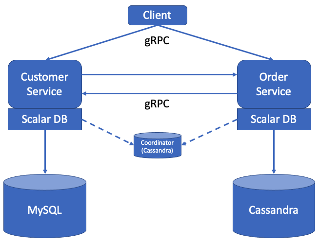
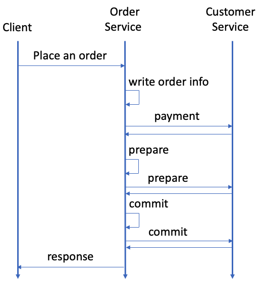

---
tags:
  - Community
  - Enterprise Standard
  - Enterprise Premium
displayed_sidebar: docsJapanese
---

# マイクロサービストランザクションをサポートするサンプルアプリケーションを作成する

import TranslationBanner from '/src/components/_translation-ja-jp.mdx';

<TranslationBanner />

このチュートリアルでは、ScalarDB でマイクロサービストランザクションをサポートするサンプルアプリケーションを作成する方法について説明します。

## 概要

このチュートリアルでは、ScalarDB の [2 フェーズコミットインターフェースを使用したトランザクション](../../two-phase-commit-transactions.mdx)を通じてアイテムを注文し、信用枠で支払いを行うことができるサンプル電子商取引アプリケーションを作成するプロセスを示します。

サンプルアプリケーションには、[database-per-service pattern](https://microservices.io/patterns/data/database-per-service.html) に基づく *Customer Service* と *Order Service* という 2 つのマイクロサービスがあります。

- **Customer Service** は、信用枠情報、信用限度額、信用合計などの顧客情報を管理します。
- **Order Service** は、注文の確定や注文履歴の取得などの注文操作を担当します。

各サービスには gRPC エンドポイントがあります。クライアントはエンドポイントを呼び出し、サービスも各エンドポイントを呼び出します。

サンプルアプリケーションで使用するデータベースは Cassandra と MySQL です。 Customer Service と Order Service は、それぞれ ScalarDB を介して Cassandra と MySQL を使用します。



図に示されているように、両方のサービスは、Consensus Commit プロトコルに使用される小さな Coordinator データベースにアクセスします。データベースはサービスに依存せず、Consensus Commit のトランザクションメタデータを高可用性の方法で管理するために存在します。

サンプルアプリケーションでは、セットアップと説明を簡単にするために、Coordinator データベースを Order Service の同じ Cassandra インスタンスに共存させています。または、Coordinator データベースを別のデータベースとして管理することもできます。

:::note

サンプルアプリケーションは ScalarDB の使用方法を示すことに重点を置いているため、アプリケーション固有のエラー処理、認証処理、および同様の機能はサンプルアプリケーションに含まれていません。ScalarDB での例外処理の詳細については、[例外の処理方法](../../api-guide.mdx#例外の処理方法)を参照してください。

さらに、サンプルアプリケーションの目的上、各サービスには 1 つのコンテナがあるため、サービス間のリクエストルーティングは不要です。ただし、実稼働環境では、スケーラビリティと可用性のために各サービスに複数のサーバーまたはホストがあるため、2 フェーズコミットインターフェイスを使用したトランザクションでは、サービス間のリクエストルーティングを検討する必要があります。要求ルーティングの詳細については、[2 フェーズコミットインターフェイスを使用したトランザクションでのリクエストルーティング](../../two-phase-commit-transactions.mdx#2-フェーズコミットインターフェイスを使用したトランザクションでのリクエストルーティング) を参照してください。

:::

### サービスエンドポイント

サービスで定義されているエンドポイントは次のとおりです。

- Customer Service
  - `getCustomerInfo`
  - `payment`
  - `prepare`
  - `validate`
  - `commit`
  - `rollback`
  - `repayment`

- Order Service
  - `placeOrder`
  - `getOrder`
  - `getOrders`

### このサンプルアプリケーションで実行できること

サンプルアプリケーションは、次の種類のトランザクションをサポートしています。

- Customer Service の `getCustomerInfo` エンドポイントを介して顧客情報を取得します。
- Order Service の `placeOrder` エンドポイントと、Customer Service の `payment`、`prepare`、`validate`、`commit`、`rollback` エンドポイントを介して、信用枠を使用して注文を行います。
  - 注文のコストが顧客の信用限度額を下回っているかどうかを確認します。
  - チェックに合格した場合、注文履歴を記録し、顧客が支払った金額を更新します。
- Order Service の `getOrder` エンドポイントと、Customer Service の `getCustomerInfo`、`prepare`、`validate`、`commit`、`rollback` エンドポイントを介して、注文 ID で注文情報を取得します。
- Order Service の `getOrders` エンドポイントと、Customer Service の `getCustomerInfo`、`prepare`、`validate`、`commit`、`rollback` エンドポイントを介して、顧客 ID で注文情報を取得します。
- Customer Service の `repayment` エンドポイントを介して支払いを行います。
  - 顧客が支払った金額を減らします。

:::note

`getCustomerInfo` エンドポイントは、コーディネーターからトランザクション ID を受信するときに、参加者サービスエンドポイントとして機能します。

:::

## このサンプルアプリケーションの前提条件

- [Eclipse Temurin](https://adoptium.net/temurin/releases/) の OpenJDK LTS バージョン (8、11、17、または 21)
- [Docker](https://www.docker.com/get-started/) 20.10 以降 ([Docker Compose](https://docs.docker.com/compose/install/) V2 以降)

:::note

このサンプルアプリケーションは、Eclipse Temurin の OpenJDK でテストされています。ただし、ScalarDB 自体は、さまざまなベンダーの JDK ディストリビューションでテストされています。互換性のある JDK ディストリビューションを含む ScalarDB の要件の詳細については、[要件](../../requirements.mdx)を参照してください。

:::

## ScalarDB のセットアップ

次のセクションでは、ScalarDB でマイクロサービストランザクションをサポートするサンプルアプリケーションをセットアップする方法について説明します。

### ScalarDB サンプルリポジトリをクローンする

**ターミナル** を開き、次のコマンドを実行して ScalarDB サンプルリポジトリをクローンします。

```console
git clone https://github.com/scalar-labs/scalardb-samples
```

次に、次のコマンドを実行して、サンプルアプリケーションが含まれているディレクトリに移動します。

```console
cd scalardb-samples/microservice-transaction-sample
```

### CassandraとMySQLを起動する

Cassandra と MySQL は、それぞれ [`database-cassandra.properties`](https://github.com/scalar-labs/scalardb-samples/blob/main/microservice-transaction-sample/database-cassandra.properties) と [`database-mysql.properties`](https://github.com/scalar-labs/scalardb-samples/blob/main/microservice-transaction-sample/database-mysql.properties) に示されているように、サンプルアプリケーション用にすでに設定されています。ScalarDB でのマルチストレージトランザクション機能の設定の詳細については、[マルチストレージトランザクションをサポートするように ScalarDB を設定する方法](../../multi-storage-transactions.mdx#マルチストレージトランザクションをサポートするように-scalardb-を設定する方法)を参照してください。

サンプルアプリケーションの Docker コンテナに含まれている Cassandra と MySQL を起動するには、次のコマンドを実行します。

```console
docker-compose up -d mysql cassandra
```

:::note

開発環境によっては、Docker コンテナの起動に 1 分以上かかる場合があります。

:::

### スキーマをロードします

サンプルアプリケーションのデータベーススキーマ (データを整理する方法) は、Customer Service の場合は [`customer-service-schema.json`](https://github.com/scalar-labs/scalardb-samples/blob/main/microservice-transaction-sample/customer-service-schema.json)、Order Service の場合は [`order-service-schema.json`](https://github.com/scalar-labs/scalardb-samples/blob/main/microservice-transaction-sample/order-service-schema.json) で既に定義されています。

スキーマを適用するには、[ScalarDB リリース](https://github.com/scalar-labs/scalardb/releases)ページに移動し、使用する ScalarDB のバージョンに一致する ScalarDB スキーマローダーを `scalardb-samples/microservice-transaction-sample` フォルダーにダウンロードします。

#### MySQL

[`customer-service-schema.json`](https://github.com/scalar-labs/scalardb-samples/blob/main/microservice-transaction-sample/customer-service-schema.json) のスキーマを MySQL にロードするには、次のコマンドを実行します。`<VERSION>` は、ダウンロードした ScalarDB Schema Loader のバージョンに置き換えます。

```console
java -jar scalardb-schema-loader-<VERSION>.jar --config database-mysql.properties --schema-file customer-service-schema.json
```

#### Cassandra

[`order-service-schema.json`](https://github.com/scalar-labs/scalardb-samples/blob/main/microservice-transaction-sample/order-service-schema.json) のスキーマを Cassandra にロードするには、次のコマンドを実行します。`<VERSION>` は、ダウンロードした ScalarDB Schema Loader のバージョンに置き換えます。

```console
java -jar scalardb-schema-loader-<VERSION>.jar --config database-cassandra.properties --schema-file order-service-schema.json --coordinator
```

#### Schema details

[`customer-service-schema.json`](https://github.com/scalar-labs/scalardb-samples/blob/main/microservice-transaction-sample/customer-service-schema.json) に示されているように、Customer Service のすべてのテーブルは `customer_service` 名前空間に作成されます。

- `customer_service.customers`: 顧客の情報を管理するテーブル
  - `credit_limit`: 貸し手が各顧客に信用枠の使用を許可する最大金額
  - `credit_total`: 各顧客が信用枠を使用してすでに使用した金額

[`order-service-schema.json`](https://github.com/scalar-labs/scalardb-samples/blob/main/microservice-transaction-sample/order-service-schema.json) に示されているように、Order Service のすべてのテーブルは `order_service` 名前空間に作成されます。

- `order_service.orders`: 注文情報を管理するテーブル
- `order_service.statements`: 注文明細情報を管理するテーブル
- `order_service.items`: 注文する商品の情報を管理するテーブル

スキーマのエンティティリレーションシップダイアグラムは次のとおりです。


### マイクロサービスを起動して初期データをロードします

マイクロサービスを起動する前に、次のコマンドを実行してサンプルアプリケーションの Docker イメージをビルドします。

```console
./gradlew docker
```

次に、次のコマンドを実行してマイクロサービスを起動します。

```console
docker-compose up -d customer-service order-service
```

マイクロサービスを起動し、初期データが読み込まれた後、次のレコードが `customer_service.customers` テーブルに保存されるはずです。

| customer_id | name          | credit_limit | credit_total |
|-------------|---------------|--------------|--------------|
| 1           | Yamada Taro   | 10000        | 0            |
| 2           | Yamada Hanako | 10000        | 0            |
| 3           | Suzuki Ichiro | 10000        | 0            |

そして、次のレコードが `order_service.items` テーブルに保存される必要があります。

| item_id | name   | price |
|---------|--------|-------|
| 1       | Apple  | 1000  |
| 2       | Orange | 2000  |
| 3       | Grape  | 2500  |
| 4       | Mango  | 5000  |
| 5       | Melon  | 3000  |

## サンプルアプリケーションでトランザクションを実行し、データを取得する

次のセクションでは、サンプル電子商取引アプリケーションでトランザクションを実行し、データを取得する方法について説明します。

### 顧客情報を取得する

次のコマンドを実行して、ID が `1` である顧客に関する情報を取得することから始めます。

```console
./gradlew :client:run --args="GetCustomerInfo 1"
```

次の出力が表示されます。

```console
...
{"id": 1,"name": "Yamada Taro","credit_limit": 10000}
...
```

この時点では、`credit_total` は表示されません。つまり、`credit_total` の現在の値は `0` です。

### 注文する

次に、次のコマンドを実行して、顧客 ID `1` にリンゴ 3 個とオレンジ 2 個を注文してもらいます。

:::note

このコマンドの注文形式は `./gradlew run --args="PlaceOrder <CUSTOMER_ID> <ITEM_ID>:<COUNT>,<ITEM_ID>:<COUNT>,..."` です。

:::

```console
./gradlew :client:run --args="PlaceOrder 1 1:3,2:2"
```

以下のように、`order_id` の UUID が異なる、注文が成功したことを示す出力が表示されます。

```console
...
{"order_id": "4ccdb21c-ac03-4b48-bcb7-cad57eac1e79"}
...
```

### 注文の詳細を確認する

次のコマンドを実行して注文の詳細を確認します。`<ORDER_ID_UUID>` は、前のコマンドを実行した後に表示される `order_id` の UUID に置き換えます。

```console
./gradlew :client:run --args="GetOrder <ORDER_ID_UUID>"
```

`order_id` と `timestamp` の UUID が異なる、以下のような出力が表示されます。

```console
...
{"order": {"order_id": "4ccdb21c-ac03-4b48-bcb7-cad57eac1e79","timestamp": 1631605253126,"customer_id": 1,"customer_name": "Yamada Taro","statement": [{"item_id": 1,"item_name": "Apple","price": 1000,"count": 3,"total": 3000},{"item_id": 2,"item_name": "Orange","price": 2000,"count": 2,"total": 4000}],"total": 7000}}
...
```

### 別の注文をする

次のコマンドを実行して、顧客 ID `1` の `credit_total` の残額を使用してメロン 1 個を注文します。

```console
./gradlew :client:run --args="PlaceOrder 1 5:1"
```

以下のように、`order_id` の UUID が異なる、注文が成功したことを示す出力が表示されます。

```console
...
{"order_id": "0b10db66-faa6-4323-8a7a-474e8534a7ee"}
...
```

### 注文履歴を確認する

次のコマンドを実行して、顧客 ID `1` のすべての注文履歴を取得します。

```console
./gradlew :client:run --args="GetOrders 1"
```

`order_id` と `timestamp` の UUID が異なる以下のような出力が表示されます。これは、顧客 ID `1` のすべての注文履歴をタイムスタンプの降順で表示します。

```console
...
{"order": [{"order_id": "0b10db66-faa6-4323-8a7a-474e8534a7ee","timestamp": 1631605501485,"customer_id": 1,"customer_name": "Yamada Taro","statement": [{"item_id": 5,"item_name": "Melon","price": 3000,"count": 1,"total": 3000}],"total": 3000},{"order_id": "4ccdb21c-ac03-4b48-bcb7-cad57eac1e79","timestamp": 1631605253126,"customer_id": 1,"customer_name": "Yamada Taro","statement": [{"item_id": 1,"item_name": "Apple","price": 1000,"count": 3,"total": 3000},{"item_id": 2,"item_name": "Orange","price": 2000,"count": 2,"total": 4000}],"total": 7000}]}
...
```

### クレジット合計の確認

次のコマンドを実行して、顧客 ID `1` のクレジット合計を取得します。

```console
./gradlew :client:run --args="GetCustomerInfo 1"
```

次の出力が表示されます。これは、顧客 ID `1` が `credit_total` の `credit_limit` に達しており、これ以上注文できないことを示しています。

```console
...
{"id": 1,"name": "Yamada Taro","credit_limit": 10000,"credit_total": 10000}
...
```

次のコマンドを実行して、ブドウ 1 個とマンゴー 1 個を注文してみます。

```console
./gradlew :client:run --args="PlaceOrder 1 3:1,4:1"
```

次の出力が表示されます。これは、`credit_total` 金額が `credit_limit` 金額を超えたために注文が失敗したことを示しています。

```console
...
io.grpc.StatusRuntimeException: FAILED_PRECONDITION: Credit limit exceeded
        at io.grpc.stub.ClientCalls.toStatusRuntimeException(ClientCalls.java:271)
        at io.grpc.stub.ClientCalls.getUnchecked(ClientCalls.java:252)
        at io.grpc.stub.ClientCalls.blockingUnaryCall(ClientCalls.java:165)
        at sample.rpc.OrderServiceGrpc$OrderServiceBlockingStub.placeOrder(OrderServiceGrpc.java:296)
        at sample.client.command.PlaceOrderCommand.call(PlaceOrderCommand.java:38)
        at sample.client.command.PlaceOrderCommand.call(PlaceOrderCommand.java:12)
        at picocli.CommandLine.executeUserObject(CommandLine.java:2041)
        at picocli.CommandLine.access$1500(CommandLine.java:148)
        at picocli.CommandLine$RunLast.executeUserObjectOfLastSubcommandWithSameParent(CommandLine.java:2461)
        at picocli.CommandLine$RunLast.handle(CommandLine.java:2453)
        at picocli.CommandLine$RunLast.handle(CommandLine.java:2415)
        at picocli.CommandLine$AbstractParseResultHandler.execute(CommandLine.java:2273)
        at picocli.CommandLine$RunLast.execute(CommandLine.java:2417)
        at picocli.CommandLine.execute(CommandLine.java:2170)
        at sample.client.Client.main(Client.java:39)
...
```

### 支払いを行う

注文を続行するには、顧客 ID `1` が支払いを行って `credit_total` の金額を減らす必要があります。

次のコマンドを実行して支払いを行います。

```console
./gradlew :client:run --args="Repayment 1 8000"
```

次に、次のコマンドを実行して、顧客 ID `1` の `credit_total` 金額を確認します。

```console
./gradlew :client:run --args="GetCustomerInfo 1"
```

次の出力が表示されます。これは、顧客 ID `1` に支払いが適用され、`credit_total` の金額が減ったことを示しています。

```console
...
{"id": 1,"name": "Yamada Taro","credit_limit": 10000,"credit_total": 2000}
...
```

顧客 ID `1` が支払いを済ませたので、次のコマンドを実行してブドウ 1 個とメロン 1 個を注文します。

```console
./gradlew :client:run --args="PlaceOrder 1 3:1,4:1"
```

以下のように、`order_id` の UUID が異なる、注文が成功したことを示す出力が表示されます。

```console
...
{"order_id": "dd53dd9d-aaf4-41db-84b2-56951fed6425"}
...
```

## サンプルアプリケーションを停止する

サンプルアプリケーションを停止するには、Cassandra、MySQL、およびマイクロサービスを実行している Docker コンテナを停止する必要があります。Docker コンテナを停止するには、次のコマンドを実行します。

```console
docker-compose down
```

## リファレンス - マイクロサービストランザクションの実現方法

注文、単一注文の取得、注文履歴の取得のトランザクションは、マイクロサービストランザクションを実現します。このセクションでは、注文を例に、Customer Service と Order Service にまたがるトランザクションの実装方法に焦点を当てます。

次のシーケンス図は、注文を行うトランザクションを示しています。



### 1. 2 フェーズコミットインターフェースを使用したトランザクションが開始されます

クライアントが Order Service に注文リクエストを送信すると、`OrderService.placeOrder()` が呼び出され、マイクロサービストランザクションが開始されます。

最初に、Order Service は次のように `start()` を使用して 2 フェーズコミットインターフェースを使用したトランザクションを開始します。参考として、[`OrderService.java`](https://github.com/scalar-labs/scalardb-samples/blob/main/microservice-transaction-sample/order-service/src/main/java/sample/order/OrderService.java) を参照してください。

```java
transaction = twoPhaseCommitTransactionManager.start();
```

### 2. CRUD 操作が実行されます

2 フェーズコミットインターフェースを使用したトランザクションが開始されると、CRUD 操作が実行されます。Order Service は、次のように、注文情報を `order_service.orders` テーブルに、詳細情報を `order_service.statements` テーブルに格納します。参考として、[`OrderService.java`](https://github.com/scalar-labs/scalardb-samples/blob/main/microservice-transaction-sample/order-service/src/main/java/sample/order/OrderService.java) を参照してください。

```java
// Put the order info into the `orders` table.
Order.put(transaction, orderId, request.getCustomerId(), System.currentTimeMillis());

int amount = 0;
for (ItemOrder itemOrder : request.getItemOrderList()) {
  // Put the order statement into the `statements` table.
  Statement.put(transaction, orderId, itemOrder.getItemId(), itemOrder.getCount());

  // Retrieve the item info from the `items` table.
  Optional<Item> item = Item.get(transaction, itemOrder.getItemId());
  if (!item.isPresent()) {
    responseObserver.onError(
        Status.NOT_FOUND.withDescription("Item not found").asRuntimeException());
    return;
  }

  // Calculate the total amount.
  amount += item.get().price * itemOrder.getCount();
}
```

次に、Order Service は、トランザクション ID とともに Customer Service の `payment` gRPC エンドポイントを呼び出します。参考として、[`OrderService.java`](https://github.com/scalar-labs/scalardb-samples/blob/main/microservice-transaction-sample/order-service/src/main/java/sample/order/OrderService.java) を参照してください。

```java
customerServiceStub.payment(
  PaymentRequest.newBuilder()
    .setTransactionId(transactionId)
    .setCustomerId(customerId)
    .setAmount(amount)
    .build());
```

Customer Service の `payment` エンドポイントは、まず次のように `join()` を使用してトランザクションを結合します。参考として、[`CustomerService.java`](https://github.com/scalar-labs/scalardb-samples/blob/main/microservice-transaction-sample/customer-service/src/main/java/sample/customer/CustomerService.java) を参照してください。

```java
private <T> void execOperationsAsParticipant(String funcName, String transactionId,
  TransactionFunction<TransactionCrudOperable, T> operations,
  StreamObserver<T> responseObserver) {
  try {
    // Join the transaction
    TwoPhaseCommitTransaction transaction = twoPhaseCommitTransactionManager.join(transactionId);

    // Execute operations
    T response = operations.apply(transaction);
```

次に、エンドポイントは顧客情報を取得し、支払い後に顧客のクレジット合計がクレジット限度額を超えているかどうかを確認します。クレジット合計がクレジット限度額を超えていない場合、エンドポイントは顧客のクレジット合計を更新します。参考として、[`CustomerService.java`](https://github.com/scalar-labs/scalardb-samples/blob/main/microservice-transaction-sample/customer-service/src/main/java/sample/customer/CustomerService.java) を参照してください。

```java
execOperationsAsParticipant("Payment", request.getTransactionId(),
  transaction -> {
    // Retrieve the customer info for the customer ID
    Optional<Customer> result = Customer.get(transaction, request.getCustomerId());
    if (!result.isPresent()) {
      throw Status.NOT_FOUND.withDescription("Customer not found").asRuntimeException();
    }

    int updatedCreditTotal = result.get().creditTotal + request.getAmount();

    // Check if the credit total exceeds the credit limit after payment
    if (updatedCreditTotal > result.get().creditLimit) {
      throw Status.FAILED_PRECONDITION
        .withDescription("Credit limit exceeded")
        .asRuntimeException();
    }

    // Update `credit_total` for the customer
    Customer.updateCreditTotal(transaction, request.getCustomerId(), updatedCreditTotal);

    return Empty.getDefaultInstance();
  }, responseObserver
);
```

### 3. 2 フェーズコミットプロトコルを使用してトランザクションがコミットされます

Order Service は、支払いが成功したという更新を受信すると、トランザクションをコミットしようとします。

トランザクションをコミットするために、Order Service はトランザクションの準備から始めます。Order Service は、トランザクションオブジェクトから `prepare()` を呼び出し、Customer Service の `prepare` gRPC エンドポイントを呼び出します。参考として、[`OrderService.java`](https://github.com/scalar-labs/scalardb-samples/blob/main/microservice-transaction-sample/order-service/src/main/java/sample/order/OrderService.java) を参照してください。

```java
transaction.prepare();
callPrepareEndpoint(transaction.getId());
```

このエンドポイントでは、Customer Service がトランザクションを再開し、トランザクションオブジェクトから `prepare()` も呼び出します。参考として、[`CustomerService.java`](https://github.com/scalar-labs/scalardb-samples/blob/main/microservice-transaction-sample/customer-service/src/main/java/sample/customer/CustomerService.java) を参照してください。

```java
// Resume the transaction.
transaction = twoPhaseCommitTransactionManager.resume(request.getTransactionId());

// Prepare the transaction.
transaction.prepare();
```

同様に、Order Service と Customer Service は、トランザクションオブジェクトから `validate()` を呼び出します。参考として、[`OrderService.java`](https://github.com/scalar-labs/scalardb-samples/blob/main/microservice-transaction-sample/order-service/src/main/java/sample/order/OrderService.java) と [`CustomerService.java`](https://github.com/scalar-labs/scalardb-samples/blob/main/microservice-transaction-sample/customer-service/src/main/java/sample/customer/CustomerService.java) を参照してください。`validate()` の詳細については、[トランザクションの検証](../../two-phase-commit-transactions.mdx#トランザクションの検証)を参照してください。

Order Service と Customer Service の両方でトランザクションの準備と検証が成功したら、トランザクションをコミットできます。この場合、Order Service はトランザクションオブジェクトから `commit()` を呼び出し、次に Customer Service の `commit` gRPC エンドポイントを呼び出します。参考として、[`OrderService.java`](https://github.com/scalar-labs/scalardb-samples/blob/main/microservice-transaction-sample/order-service/src/main/java/sample/order/OrderService.java) を参照してください。

```java
transaction.commit();
callCommitEndpoint(transaction.getId());
```

このエンドポイントでは、Customer Service がトランザクションを再開し、トランザクションオブジェクトから `commit()` も呼び出します。参考として、[`CustomerService.java`](https://github.com/scalar-labs/scalardb-samples/blob/main/microservice-transaction-sample/customer-service/src/main/java/sample/customer/CustomerService.java) を参照してください。

```java
// Resume the transaction.
transaction = twoPhaseCommitTransactionManager.resume(request.getTransactionId());

// Commit the transaction.
transaction.commit();
```

### エラー処理

トランザクションの実行中にエラーが発生した場合は、トランザクションをロールバックする必要があります。この場合、Order Service はトランザクションオブジェクトから `rollback()` を呼び出し、次に Customer Service の `rollback` gRPC エンドポイントを呼び出します。参考として、[`OrderService.java`](https://github.com/scalar-labs/scalardb-samples/blob/main/microservice-transaction-sample/order-service/src/main/java/sample/order/OrderService.java) を参照してください。

```java
transaction.rollback();
callRollbackEndpoint(transaction.getId());
```

このエンドポイントでは、Customer Service がトランザクションを再開し、トランザクションオブジェクトから `rollback()` も呼び出します。参考として、[`CustomerService.java`](https://github.com/scalar-labs/scalardb-samples/blob/main/microservice-transaction-sample/customer-service/src/main/java/sample/customer/CustomerService.java) を参照してください。

```java
// Resume the transaction.
TwoPhaseCommitTransaction transaction =
    twoPhaseCommitTransactionManager.resume(request.getTransactionId());

// Roll back the transaction.
transaction.rollback();
```

ScalarDB で例外を処理する方法の詳細については、[例外の処理方法](../../api-guide.mdx#例外の処理方法)を参照してください。
