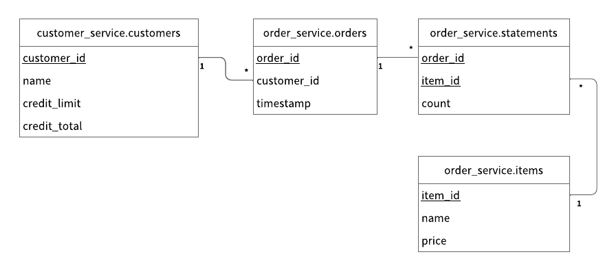

---
tags:
  - Enterprise Premium
displayed_sidebar: docsJapanese
---

# ScalarDB JDBC を使用して共有 ScalarDB Cluster 環境でマイクロサービストランザクションをサポートするアプリケーションを作成する

import TranslationBanner from '/src/components/_translation-ja-jp.mdx';
import JDKVersions from '/src/components/ja-jp/_prerequisites-jdk-versions.mdx';

<TranslationBanner />

このチュートリアルでは、マイクロサービストランザクションをサポートし、ScalarDB JDBC を使用して ScalarDB Cluster の共有クラスタパターンに従うサンプル電子商取引アプリケーションの作成方法について説明します。

共有クラスタパターンの詳細については、[マイクロサービスにおける ScalarDB Cluster のデプロイパターン](../../scalardb-cluster/deployment-patterns-for-microservices.mdx#共有クラスターパターン)を参照してください。

## サンプルマイクロサービスアプリケーションの概要

サンプル電子商取引アプリケーションでは、ユーザーがクレジットラインを使用してアイテムを注文し、支払いを行う方法を示します。

サンプルアプリケーションには、[database-per-service パターン](https://microservices.io/patterns/data/database-per-service.html)に基づく *Customer Service* と *Order Service* という2つのマイクロサービスがあります。

- **Customer Service** は、クレジットライン情報、クレジット制限、クレジット合計を含む顧客情報を管理します。
- **Order Service** は、注文の配置や注文履歴の取得などの注文操作を担当します。

各サービスには gRPC エンドポイントがあります。クライアントはエンドポイントを呼び出し、サービスも各エンドポイントを呼び出します。

サンプルアプリケーションで使用するデータベースは Cassandra と MySQL です。Customer Service と Order Service は、ScalarDB Cluster を通じてそれぞれ Cassandra と MySQL を使用します。


図に示すように、ScalarDB Cluster には、Consensus Commit プロトコルに使用される小さなコーディネータデータベースがあります。データベースはサービスに依存せず、可用性の高い方法で Consensus Commit のトランザクションメタデータを管理するために存在します。

サンプルアプリケーションでは、セットアップと説明を簡単にするために、コーディネータデータベースを Order Service の同じ Cassandra インスタンスに共同配置します。また、コーディネータデータベースを別のデータベースとして管理することもできます。

:::note

サンプルアプリケーションの焦点は ScalarDB Cluster の使用を実演することであるため、アプリケーション固有のエラー処理、認証処理、および同様の機能はサンプルアプリケーションには含まれていません。

:::

### サービスエンドポイント

サービスで定義されているエンドポイントは次のとおりです。

- Customer Service
    - `getCustomerInfo`
    - `payment`
    - `repayment`

- Order Service
    - `placeOrder`
    - `getOrder`
    - `getOrders`

### このサンプルアプリケーションでできること

サンプルアプリケーションは、次のタイプのトランザクションをサポートします。

- Customer Service の `getCustomerInfo` エンドポイントを通じて顧客情報を取得します。
- Order Service の `placeOrder` エンドポイントと Customer Service の `payment` エンドポイントを使用してクレジットラインを使用して注文します。
    - 注文のコストが顧客のクレジット制限を下回っているかどうかを確認します。
    - チェックに合格した場合、注文履歴を記録し、顧客が使用した金額を更新します。
- Order Service の `getOrder` エンドポイントと Customer Service の `getCustomerInfo` エンドポイントを通じて注文 ID で注文情報を取得します。
- Order Service の `getOrders` エンドポイントと Customer Service の `getCustomerInfo` エンドポイントを通じて顧客 ID で注文情報を取得します。
- Customer Service の `repayment` エンドポイントを通じて支払いを行います。
    - 顧客が使用した金額を減らします。

:::note

`getCustomerInfo` エンドポイントは、コーディネータからトランザクション ID を受信するときにパーティシパントサービスエンドポイントとして機能します。

:::

## 前提条件

- 以下のいずれかの Java Development Kit (JDK):
  <JDKVersions versionNumbers="8、11、17、または 21" />
- [Docker](https://www.docker.com/get-started/) 20.10 以降と [Docker Compose](https://docs.docker.com/compose/install/) V2 以降

:::note

上記の LTS バージョンの使用をお勧めしますが、他の非 LTS バージョンでも機能する可能性があります。

また、他の JDK も ScalarDB で動作するはずですが、テストしていません。

:::

また、ScalarDB Cluster のライセンスキー (試用版ライセンスまたは商用ライセンス) が必要です。ライセンスキーをお持ちでない場合は、[お問い合わせ](https://www.scalar-labs.com/contact)ください。

## ScalarDB Cluster のセットアップ

次のセクションでは、ScalarDB Cluster でマイクロサービストランザクションをサポートするサンプルアプリケーションをセットアップする方法について説明します。

### ScalarDB サンプルリポジトリのクローン

**ターミナル**を開いて、次のコマンドを実行して ScalarDB サンプルリポジトリをクローンします。

```console
git clone https://github.com/scalar-labs/scalardb-samples
```

次に、以下のコマンドを実行して、サンプルアプリケーションを含むディレクトリに移動します。

```console
cd scalardb-samples/microservice-transaction-sample-with-shared-cluster-with-jdbc/
```

### ライセンスキーの設定

ScalarDB Cluster デプロイメント用のライセンスキー (試用版ライセンスまたは商用ライセンス) を設定ファイル [`scalardb-cluster-node.properties`](https://github.com/scalar-labs/scalardb-samples/tree/main/microservice-transaction-sample-with-shared-cluster-with-jdbc/scalardb-cluster-node.properties) に設定します。詳細については、[ライセンスキーの設定方法](../../scalar-licensing/index.mdx)を参照してください。

### Cassandra、MySQL、および ScalarDB Cluster の起動

ScalarDB Cluster の設定ファイルは [`scalardb-cluster-node.properties`](https://github.com/scalar-labs/scalardb-samples/tree/main/microservice-transaction-sample-with-shared-cluster-with-jdbc/scalardb-cluster-node.properties) です。

設定に示されているように、Cassandra と MySQL はすでにマルチストレージ設定で設定されています。ScalarDB でマルチストレージトランザクション機能を設定する詳細については、[マルチストレージトランザクションをサポートするように ScalarDB を設定する方法](../../multi-storage-transactions.mdx#マルチストレージトランザクションをサポートするように-scalardb-を設定する方法)を参照してください。

このサンプルアプリケーションを迅速にセットアップするために、ScalarDB Cluster をスタンドアロンモードで実行します。スタンドアロンモードでの ScalarDB Cluster の実行の詳細については、[ScalarDB Cluster スタンドアロンモード](../../scalardb-cluster/standalone-mode.mdx)を参照してください。

また、各マイクロサービスのアクセス制御を実装するために、ScalarDB Auth が有効になっています。ScalarDB Auth の詳細については、[ユーザーの認証と認可](../../scalardb-cluster/scalardb-auth-with-sql.mdx) を参照してください。

:::note

このサンプルアプリケーションを迅速にセットアップするために、ワイヤ暗号化は有効になっていません。ただし、本番環境では、クライアントと ScalarDB Cluster ノード間、および ScalarDB Cluster ノード間の通信を保護するためにワイヤ暗号化を有効にすることをお勧めします。ワイヤ暗号化の詳細については、[ワイヤ通信の暗号化](../../scalardb-cluster/encrypt-wire-communications.mdx)を参照してください。

:::

サンプルアプリケーション用の Docker コンテナに含まれている Cassandra、MySQL、および ScalarDB Cluster を開始するには、次のコマンドを実行します。

```console
docker compose up -d mysql cassandra scalardb-cluster-node
```

:::note

開発環境によっては、Docker コンテナの起動に1分以上かかる場合があります。

:::

### スキーマの読み込み

サンプルアプリケーションのデータベーススキーマ (データがどのように整理されるかの方法) は、すでに [`schema.sql`](https://github.com/scalar-labs/scalardb-samples/tree/main/microservice-transaction-sample-with-shared-cluster-with-jdbc/schema.sql) で定義されています。

スキーマを適用するには、ScalarDB の[リリース](https://github.com/scalar-labs/scalardb/releases)に移動し、使用する ScalarDB Cluster のバージョンの SQL CLI ツール (`scalardb-cluster-sql-cli-<VERSION>-all.jar`) をダウンロードします。

次に、ダウンロードした SQL CLI ツールのバージョンと `<VERSION>` を置き換えて、次のコマンドを実行します。

```console
java -jar scalardb-cluster-sql-cli-<VERSION>-all.jar --config scalardb-cluster-sql-cli.properties --file schema.sql
```

#### スキーマの詳細

サンプルアプリケーションの [`schema.sql`](https://github.com/scalar-labs/scalardb-samples/tree/main/microservice-transaction-sample-with-shared-cluster-with-jdbc/schema.sql) に示されているように、Customer Service のすべてのテーブルは `customer_service` 名前空間に作成されます。

- `customer_service.customers`: 顧客情報を管理するテーブル
  - `credit_limit`: 貸し手がクレジットラインを使用するときに各顧客が使用できる最大金額
  - `credit_total`: 各顧客がクレジットラインを使用してすでに使用した金額

また、Order Service のすべてのテーブルは `order_service` 名前空間に作成されます。

- `order_service.orders`: 注文情報を管理するテーブル
- `order_service.statements`: 注文明細書情報を管理するテーブル
- `order_service.items`: 注文するアイテムの情報を管理するテーブル

スキーマのエンティティ関係図は次のとおりです。



### サービスのユーザーを作成し、権限を付与する

各マイクロサービスのアクセス制御を実装するには、サービスのユーザーを作成し、権限を付与する必要があります。

ダウンロードした SQL CLI ツールのバージョンと `<VERSION>` を置き換えて、次のコマンドを実行します。

```console
java -jar scalardb-cluster-sql-cli-<VERSION>-all.jar --config scalardb-cluster-sql-cli.properties --file user-privileges.sql
```

[`user-privileges.sql`](https://github.com/scalar-labs/scalardb-samples/tree/main/microservice-transaction-sample-with-shared-cluster-with-jdbc/user-privileges.sql) に示されているように、Customer Service と Order Service のユーザーを作成し、権限を付与します。

## マイクロサービスの開始

Customer Service と Order Service の設定ファイルは、それぞれ [`customer-service.properties`](https://github.com/scalar-labs/scalardb-samples/tree/main/microservice-transaction-sample-with-shared-cluster-with-jdbc/customer-service/customer-service.properties) と [`order-service.properties`](https://github.com/scalar-labs/scalardb-samples/tree/main/microservice-transaction-sample-with-shared-cluster-with-jdbc/order-service/order-service.properties) です。

マイクロサービスを開始する前に、次のコマンドを実行してサンプルアプリケーションの Docker イメージをビルドします。

```console
./gradlew docker
```

次に、以下のコマンドを実行してマイクロサービスを開始します。

```console
docker compose up -d customer-service order-service
```

マイクロサービスを開始し、初期データが読み込まれた後、次のレコードが `customer_service.customers` テーブルに保存されているはずです。

| customer_id | name          | credit_limit | credit_total |
|-------------|---------------|--------------|--------------|
| 1           | Yamada Taro   | 10000        | 0            |
| 2           | Yamada Hanako | 10000        | 0            |
| 3           | Suzuki Ichiro | 10000        | 0            |

また、次のレコードが `order_service.items` テーブルに保存されているはずです。

| item_id | name   | price |
|---------|--------|-------|
| 1       | Apple  | 1000  |
| 2       | Orange | 2000  |
| 3       | Grape  | 2500  |
| 4       | Mango  | 5000  |
| 5       | Melon  | 3000  |

## サンプルアプリケーションでのトランザクションの実行とデータの取得

次のセクションでは、サンプル電子商取引アプリケーションでトランザクションを実行し、データを取得する方法について説明します。

### 顧客情報の取得

まず、次のコマンドを実行して、ID が `1` の顧客に関する情報を取得します。

```console
./gradlew :client:run --args="GetCustomerInfo 1" -q
```

次の出力が表示されます。

```console
{
  "id": 1,
  "name": "Yamada Taro",
  "creditLimit": 10000
}
```

この時点では、`credit_total` は表示されません。これは、`credit_total` の現在の値が `0` であることを意味します。

### 注文の配置

次に、以下のコマンドを実行して、顧客 ID `1` にリンゴ3個とオレンジ2個の注文をします。

:::note

このコマンドの注文形式は `./gradlew run --args="PlaceOrder <CUSTOMER_ID> <ITEM_ID>:<COUNT>,<ITEM_ID>:<COUNT>,..."` です。

:::

```console
./gradlew :client:run --args="PlaceOrder 1 1:3,2:2" -q
```

注文が成功したことを確認する `order_id` の UUID が異なる、以下のような出力が表示されます。

```console
{
  "orderId": "2dab1af1-a008-45b2-92e3-f30ff2a4ae3e"
}
```

### 注文詳細の確認

前のコマンドを実行した後に表示された `order_id` の UUID と `<ORDER_ID_UUID>` を置き換えて、次のコマンドを実行して注文の詳細を確認します。

```console
./gradlew :client:run --args="GetOrder <ORDER_ID_UUID>" -q
```

`order_id` と `timestamp` の UUID が異なる、以下のような出力が表示されます。

```console
{
  "order": {
    "orderId": "2dab1af1-a008-45b2-92e3-f30ff2a4ae3e",
    "timestamp": "1708566933602",
    "customerId": 1,
    "customerName": "Yamada Taro",
    "statement": [{
      "itemId": 1,
      "itemName": "Apple",
      "price": 1000,
      "count": 3,
      "total": 3000
    }, {
      "itemId": 2,
      "itemName": "Orange",
      "price": 2000,
      "count": 2,
      "total": 4000
    }],
    "total": 7000
  }
}
```

### 別の注文の配置

次のコマンドを実行して、顧客 ID `1` の `credit_total` の残り金額を使用してメロン1個の注文をします。

```console
./gradlew :client:run --args="PlaceOrder 1 5:1" -q
```

注文が成功したことを確認する `order_id` の UUID が異なる、以下のような出力が表示されます。

```console
{
  "orderId": "abc6ed14-ac3d-4d4c-9a83-7fa0e70c1d4e"
}
```

### 注文履歴の確認

次のコマンドを実行して、顧客 ID `1` のすべての注文の履歴を取得します。

```console
./gradlew :client:run --args="GetOrders 1" -q
```

タイムスタンプの降順で顧客 ID `1` のすべての注文の履歴を示す、`order_id` と `timestamp` の UUID が異なる以下のような出力が表示されます。

```console
{
  "order": [{
    "orderId": "2dab1af1-a008-45b2-92e3-f30ff2a4ae3e",
    "timestamp": "1708566933602",
    "customerId": 1,
    "customerName": "Yamada Taro",
    "statement": [{
      "itemId": 1,
      "itemName": "Apple",
      "price": 1000,
      "count": 3,
      "total": 3000
    }, {
      "itemId": 2,
      "itemName": "Orange",
      "price": 2000,
      "count": 2,
      "total": 4000
    }],
    "total": 7000
  }, {
    "orderId": "abc6ed14-ac3d-4d4c-9a83-7fa0e70c1d4e",
    "timestamp": "1708566978052",
    "customerId": 1,
    "customerName": "Yamada Taro",
    "statement": [{
      "itemId": 5,
      "itemName": "Melon",
      "price": 3000,
      "count": 1,
      "total": 3000
    }],
    "total": 3000
  }]
}
```

### クレジット合計の確認

次のコマンドを実行して、顧客 ID `1` のクレジット合計を取得します。

```console
./gradlew :client:run --args="GetCustomerInfo 1" -q
```

顧客 ID `1` が `credit_total` で `credit_limit` に達し、これ以上注文できないことを示す次の出力が表示されます。

```console
{
  "id": 1,
  "name": "Yamada Taro",
  "creditLimit": 10000,
  "creditTotal": 10000
}
```

次のコマンドを実行して、ぶどう1個とマンゴー1個の注文を試してください。

```console
./gradlew :client:run --args="PlaceOrder 1 3:1,4:1" -q
```

`credit_total` 金額が `credit_limit` 金額を超えるため注文が失敗したことを示す次の出力が表示されます。

```console
io.grpc.StatusRuntimeException: FAILED_PRECONDITION: Credit limit exceeded
        at io.grpc.stub.ClientCalls.toStatusRuntimeException(ClientCalls.java:268)
        at io.grpc.stub.ClientCalls.getUnchecked(ClientCalls.java:249)
        at io.grpc.stub.ClientCalls.blockingUnaryCall(ClientCalls.java:167)
        at sample.rpc.OrderServiceGrpc$OrderServiceBlockingStub.placeOrder(OrderServiceGrpc.java:288)
        at sample.client.command.PlaceOrderCommand.call(PlaceOrderCommand.java:38)
        at sample.client.command.PlaceOrderCommand.call(PlaceOrderCommand.java:12)
        at picocli.CommandLine.executeUserObject(CommandLine.java:2041)
        at picocli.CommandLine.access$1500(CommandLine.java:148)
        at picocli.CommandLine$RunLast.executeUserObjectOfLastSubcommandWithSameParent(CommandLine.java:2461)
        at picocli.CommandLine$RunLast.handle(CommandLine.java:2453)
        at picocli.CommandLine$RunLast.handle(CommandLine.java:2415)
        at picocli.CommandLine$AbstractParseResultHandler.execute(CommandLine.java:2273)
        at picocli.CommandLine$RunLast.execute(CommandLine.java:2417)
        at picocli.CommandLine.execute(CommandLine.java:2170)
        at sample.client.Client.main(Client.java:39)
```

### 支払いの実行

注文を続けるには、顧客 ID `1` が支払いを行って `credit_total` 金額を減らす必要があります。

次のコマンドを実行して支払いを行います。

```console
./gradlew :client:run --args="Repayment 1 8000" -q
```

次に、以下のコマンドを実行して顧客 ID `1` の `credit_total` 金額を確認します。

```console
./gradlew :client:run --args="GetCustomerInfo 1" -q
```

顧客 ID `1` に支払いが適用され、`credit_total` 金額が減ったことを示す次の出力が表示されます。

```console
{
  "id": 1,
  "name": "Yamada Taro",
  "creditLimit": 10000,
  "creditTotal": 2000
}
```

顧客 ID `1` が支払いを行ったので、次のコマンドを実行してぶどう1個とマンゴー1個の注文をします。

```console
./gradlew :client:run --args="PlaceOrder 1 3:1,4:1" -q
```

注文が成功したことを確認する `order_id` の UUID が異なる、以下のような出力が表示されます。

```console
{
  "orderId": "e29a5fd2-58f6-4bc5-9fef-8852461232e8"
}
```

## サンプルアプリケーションの停止

サンプルアプリケーションを停止するには、Cassandra、MySQL、ScalarDB Cluster 、およびマイクロサービスを実行している Docker コンテナを停止する必要があります。Docker コンテナを停止するには、次のコマンドを実行します。

```console
docker compose down
```
