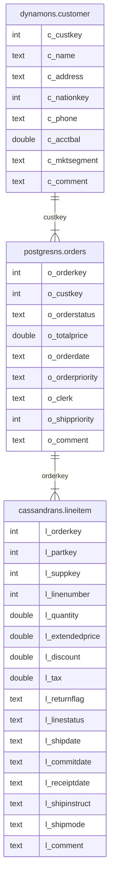

---
tags:
  - Enterprise Option
  - Private Preview
---

# ScalarDB Analytics with Spark を使用してサンプルデータに対して分析クエリを実行する

import WarningLicenseKeyContact from '/src/components/ja-jp/_warning-license-key-contact.mdx';
import TranslationBanner from '/src/components/_translation-ja-jp.mdx';

<TranslationBanner />

このチュートリアルでは、ScalarDB Analytics with Spark を使用してサンプルデータに対して分析クエリを実行する方法について説明します。ソースコードは https://github.com/scalar-labs/scalardb-samples/scalardb-analytics-spark-sample で入手できます。

## このサンプルアプリケーションでできること

このサンプルチュートリアルでは、ScalarDB Analytics with Spark を使用して Spark シェルでインタラクティブ分析を実行する方法を説明します。特に、次の 2 種類のクエリを実行する方法を学習します。

- データを読み取り、要約を計算します。
- 複数のストレージにまたがるテーブルを結合します。

## 前提条件

- [Docker](https://www.docker.com/get-started/) 20.10 以降と [Docker Compose](https://docs.docker.com/compose/install/) V2 以降

<WarningLicenseKeyContact product="ScalarDB Analytics with Spark" />

## ScalarDB Analytics with Spark を設定する

### ScalarDB サンプルリポジトリをクローンする

**ターミナル** を開き、次のコマンドを実行して ScalarDB サンプルリポジトリをクローンします。

```console
git clone https://github.com/scalar-labs/scalardb-samples
```

次に、次のコマンドを実行して、サンプルアプリケーションが含まれているディレクトリに移動します。

```console
cd scalardb-samples/scalardb-analytics-spark-sample
```

### ライセンス証明書をサンプルディレクトリに追加する

次のコマンドを実行して、ライセンス証明書 (`cert.pem`) をサンプルディレクトリにコピーします。`<PATH_TO_YOUR_LICENSE>` はライセンスへのパスに置き換えてください。

```console
cp /<PATH_TO_YOUR_LICENSE>/cert.pem cert.pem
```

### ScalarDB でサンプルの基礎データベースを設定する

ScalarDB のサンプルの基礎データベースを設定するには、次のコマンドを実行します。

```console
docker compose up -d --wait
```

このコマンドは、PostgreSQL、Cassandra、DynamoDB の 3 つのサービスをローカルで起動します。

次に、次のコマンドを実行して、これらのサービスにサンプルデータベースを設定します。

```console
docker compose run --rm sample-data-loader
```

このコマンドは、それぞれローカルの PostgreSQL、Cassandra、DyanmoDB サービスにマップされる `postgresns`、`cassandrans`、`dynamons` 名前空間を作成し、`postgresns.orders`、`cassandrans.lineitem`、`dynamons.customer` テーブルを作成し、サンプルデータをそれらのテーブルにロードします。テーブルスキーマの詳細については、[スキーマの詳細](#schema-details) を参照してください。

### Spark シェルで ScalarDB Analytics with Spark を設定する

Spark シェルを起動するには、次のコマンドを実行します。

```console
docker compose run --rm spark-shell
```

`docker-compose.yml` でわかるように、このコマンドは `--packages com.scalar-labs:scalardb-analytics-spark-<SPARK_VERSION>_<SCALA_VERSION>:<SCALARDB_ANALYTICS_WITH_SPARK_VERSION>` オプションを指定して `spark-shell` コマンドを実行します。このオプションを使用すると、`spark-shell` は Maven Central Repository から ScalarDB Analytics with Spark を自動的にダウンロードし、それを `spark-shell` のクラスパスに追加します。

Spark シェルコンソールで、次のコマンドを実行して ScalarDB Analytics with Spark を設定できます。

```console
scala> import com.scalar.db.analytics.spark.implicits._
scala> spark.setupScalarDbAnalytics(
           | configPath = "/etc/scalardb.properties",
           | namespaces = Set("postgresns", "cassandrans", "dynamons"),
           | license = License.certPath("""{"your":"license", "key":"in", "json":"format"}""", "/etc/cert.pem")
           | )
```

:::warning

ライセンスは JSON 文字列で参照されるため、[ライセンス証明書をサンプルディレクトリに追加する](#ライセンス証明書をサンプルディレクトリに追加する)の説明に従って、ライセンス証明書をサンプルディレクトリにコピーしておく必要があることに注意してください。

:::

これで、Spark 側に、ScalarDB のテーブルと同等の `postgresns.orders`、`cassandrans.lineitem`、`dynamons.customer` のテーブルが作成されます。例:

```console
scala> sql("DESCRIBE postgresns.orders").show()
+---------------+---------+-------+
|       col_name|data_type|comment|
+---------------+---------+-------+
|     o_orderkey|      int|   NULL|
|      o_custkey|      int|   NULL|
|  o_orderstatus|   string|   NULL|
|   o_totalprice|   double|   NULL|
|    o_orderdate|   string|   NULL|
|o_orderpriority|   string|   NULL|
|        o_clerk|   string|   NULL|
| o_shippriority|      int|   NULL|
|      o_comment|   string|   NULL|
+---------------+---------+-------+
```

## 分析クエリを実行する

次のセクションでは、データの読み取り、サマリーの計算、複数のストレージにまたがるテーブルの結合方法について説明します。

### データの読み取りとサマリーの計算

Cassandra に保存されている実際のデータを使用して `cassandrans.lineitem` からデータを読み取り、データを集計して順序付けられた明細項目の複数のサマリーを計算するクエリを実行できます。

クエリを実行するには、Spark シェルコンソールで次のコマンドを実行します。

```scala
scala> sql("""
     SELECT
             l_returnflag,
             l_linestatus,
             sum(l_quantity) AS sum_qty,
             sum(l_extendedprice) AS sum_base_price,
             sum(l_extendedprice * (1 - l_discount)) AS sum_disc_price,
             sum(l_extendedprice * (1 - l_discount) * (1 + l_tax)) AS sum_charge,
             avg(l_quantity) AS avg_qty,
             avg(l_extendedprice) AS avg_price,
             avg(l_discount) AS avg_disc,
             count(*) AS count_order
     FROM
             cassandrans.lineitem
     WHERE
             to_date(l_shipdate, 'yyyy-MM-dd') <= date '1998-12-01' - 3
     GROUP BY
             l_returnflag,
             l_linestatus
     ORDER BY
             l_returnflag,
             l_linestatus;
     """).show()
```

次の出力が表示されます。

```console
+------------+------------+-------+------------------+------------------+------------------+------------------+------------------+-------------------+-----------+
|l_returnflag|l_linestatus|sum_qty|    sum_base_price|    sum_disc_price|        sum_charge|           avg_qty|         avg_price|           avg_disc|count_order|
+------------+------------+-------+------------------+------------------+------------------+------------------+------------------+-------------------+-----------+
|           A|           F|   1519|2374824.6560278563|1387364.2207725341|1962763.4654265852|26.649122807017545|41663.590456629056|0.41501802923479575|         57|
|           N|           F|     98| 146371.2295412012| 85593.96776336085|121041.55837332775|32.666666666666664|48790.409847067065|0.40984706454007996|          3|
|           N|           O|   5374| 8007373.247086477| 4685647.785126835| 6624210.945739046|24.427272727272726| 36397.15112312035| 0.4147594809559689|        220|
|           R|           F|   1461|2190869.9676265526|1284178.4378283697|1814151.2807494882|25.189655172413794| 37773.62013149229|0.41323493790730753|         58|
+------------+------------+-------+------------------+------------------+------------------+------------------+------------------+-------------------+-----------+
```

### 複数のデータベースにまたがるテーブルを結合する

クエリを実行して、3 つのバックエンドデータベースに接続されているテーブルを結合し、特定の日付に最も高い収益を持つ未出荷の注文を計算することもできます。

クエリを実行するには、Spark シェルコンソールで次のコマンドを実行します。

```scala
scala> sql("""
     SELECT
       l_orderkey,
       sum(l_extendedprice * (1 - l_discount)) AS revenue,
       o_orderdate,
       o_shippriority
     FROM
       dynamons.customer,
       postgresns.orders,
       cassandrans.lineitem
     WHERE
       c_mktsegment = 'AUTOMOBILE'
       AND c_custkey = o_custkey
       AND l_orderkey = o_orderkey
       AND o_orderdate < '1995-03-15'
       AND l_shipdate > '1995-03-15'
     GROUP BY
       l_orderkey,
       o_orderdate,
       o_shippriority
     ORDER BY
       revenue DESC,
       o_orderdate,
       l_orderkey
     LIMIT 10;
     """).show()
```

次の出力が表示されます。

```console
+----------+------------------+-----------+--------------+
|l_orderkey|           revenue|o_orderdate|o_shippriority|
+----------+------------------+-----------+--------------+
|   1071617|128186.99915996166| 1995-03-10|             0|
|   1959075| 33104.51278645416| 1994-12-23|             0|
|    430243|19476.115819260962| 1994-12-24|             0|
+----------+------------------+-----------+--------------+
```

:::note

このサンプルチュートリアルでインポートされたテーブルに対して、Apache Spark および Spark SQL がサポートする任意のクエリを実行することもできます。ScalarDB Analytics with Spark は、Spark SQL がサポートするすべてのクエリをサポートしているため、例に示されている結合、集計、フィルタリング、順序付けだけでなく、ウィンドウ関数、ラテラル結合、さまざまな分析操作も使用できます。

Spark SQL がサポートするクエリの種類を確認するには、[Spark SQL ドキュメント](https://spark.apache.org/docs/latest/sql-ref.html)を参照してください。

:::

## サンプルアプリケーションを停止します

サンプルアプリケーションを停止するには、次のコマンドを実行して Docker コンテナを停止します。

```console
docker compose down
```

## リファレンス - スキーマの詳細

このサンプルチュートリアルでは、ScalarDB の基盤となるデータベースに次のスキーマを持つテーブルがあります。



参考までに、この図には次の内容が示されています。

- `dynamons`、`postgresns`、`cassandrans`。それぞれ DynamoDB、PostgreSQL、Cassandra のバックエンドストレージにマップされる名前空間。
- `dynamons.customer`。顧客に関する情報を表すテーブル。このテーブルには、顧客キー、名前、住所、電話番号、口座残高などの属性が含まれます。
- `postgresns.orders`。顧客が行った注文に関する情報を含むテーブル。このテーブルには、注文キー、顧客キー、注文ステータス、注文日、注文優先度などの属性が含まれます。
- `cassandrans.lineitem`。注文に関連付けられた明細項目を表すテーブル。このテーブルには、注文キー、部品キー、サプライヤーキー、数量、価格、出荷日などの属性が含まれます。
