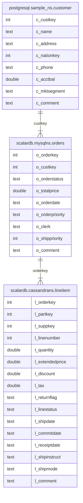

---
tags:
  - Enterprise Option
  - Public Preview
---

# ScalarDB Analytics をはじめよう

import WarningLicenseKeyContact from '/src/components/ja-jp/_warning-license-key-contact.mdx';
import TranslationBanner from '/src/components/_translation-ja-jp.mdx';

<TranslationBanner />

このチュートリアルでは、ScalarDB Analytics を使用してサンプルデータに対して分析クエリを実行する方法について説明します。ソースコードは [https://github.com/scalar-labs/scalardb-samples/tree/main/scalardb-analytics-spark-sample](https://github.com/scalar-labs/scalardb-samples/tree/main/scalardb-analytics-spark-sample) で入手できます。

現在のバージョンの ScalarDB Analytics は、実行エンジンとして Apache Spark を活用しています。Spark カスタムカタログを使用して、ScalarDB 管理下データソースと ScalarDB 管理外データソースの統合ビューを提供します。ScalarDB Analytics を使用すると、これらのデータソースのテーブルをネイティブ Spark テーブルとして扱うことができ、任意の Spark SQL クエリをシームレスに実行できます。たとえば、Cassandra に格納されているテーブルを PostgreSQL のテーブルと結合して、複数のデータソースにまたがる分析を簡単に実行できます。

## サンプルアプリケーションの概要

このサンプルチュートリアルでは、Sparkの設定によってScalarDB Analyticsを有効にし、ScalarDB Analytics から提供されるテーブルに対して `spark-sql` を用いたインタラクティブな分析を実行する方法をしめします。

## このサンプルアプリケーションの前提条件

- [Docker](https://www.docker.com/get-started/) 20.10 以降と [Docker Compose](https://docs.docker.com/compose/install/) V2 以降

<WarningLicenseKeyContact product="ScalarDB Analytics" />

## ステップ 1: ScalarDB Analytics をセットアップする

### ScalarDB サンプルリポジトリをクローンする

**ターミナル** を開き、次のコマンドを実行して ScalarDB サンプルリポジトリをクローンします:

```console
git clone https://github.com/scalar-labs/scalardb-samples
```

次に、次のコマンドを実行してサンプルアプリケーションを含むディレクトリに移動します:

```console
cd scalardb-samples/scalardb-analytics-spark-sample
```

### ライセンス情報を設定する

ScalarDB Analytics では、Spark 設定で有効なライセンス情報を指定する必要があります。ライセンスの詳細は、**spark-defaults.conf** ファイルで指定できます。

Spark インストールの **conf** ディレクトリにある **spark-defaults.conf** ファイルを開きます。次に、`<REPLACE_THIS_WITH_YOUR_LICENSE>` をライセンスキーに置き換え、`<REPLACE_THIS_WITH_YOUR_LICENSE_CERTIFICATE_PEM_CONTENTS>` をライセンス証明書の PEM エンコードされた内容に置き換えます。

```console
spark.sql.catalog.test_catalog.license.key <REPLACE_THIS_WITH_YOUR_LICENSE>
spark.sql.catalog.test_catalog.license.cert_pem <REPLACE_THIS_WITH_YOUR_LICENSE_CERTIFICATE_PEM_CONTENTS>
```

ScalarDB Analytics を設定するために **spark-defaults.conf** で必要な項目の詳細については、[ScalarDB Analytics の設定](#scalardb-analytics-の設定)を参照してください。

## ステップ 2: サンプルデータベースをセットアップする

サンプルデータベースをセットアップするには、次のコマンドを実行します:

```console
docker compose up -d --wait
```

このコマンドは、PostgreSQL、Cassandra、MySQL の 3 つのサービスをローカルで起動します。

- **PostgreSQL:** 単独で使用されます (ScalarDB 管理外)。

- **Cassandra および MySQL:** ScalarDB のバックエンドデータベースとして使用されます (ScalarDB 管理下)。

このガイドでは、PostgreSQL は ScalarDB トランザクションによって管理されない **ScalarDB 管理外データベース** と呼ばれ、Cassandra および DynamoDB は ScalarDB トランザクションによって管理される **ScalarDB 管理下データベース** と呼ばれます。

ScalarDB 管理外データベースについては、Docker コンテナが初期化されるとサンプルデータが自動的に読み込まれるため、追加の手順は必要ありません。 ScalarDB 管理下データベースについては、コンテナを起動した後、次のコマンドを実行してサンプルデータをロードします:

```console
docker compose run --rm sample-data-loader
```

セットアップが完了すると、次のテーブルが使用可能になります:

- PostgreSQL:
  - `sample_ns.customer`
- ScalarDB (Cassandra):
  - `cassandrans.lineitem`
- ScalarDB (MySQL):
  - `mysqlns.order`

ScalarDB 内では、`cassandrans` と `mysqlns` がそれぞれ Cassandra と MySQL にマッピングされます。

列定義やデータ型を含むテーブルスキーマの詳細については、[スキーマの詳細](#スキーマの詳細)を参照してください。サンプルデータがこれらのテーブルに正常にロードされていることを確認してください。

## ステップ 3: Spark SQL コンソールを起動する

Spark SQL コンソールを起動するには、次のコマンドを実行します:

```console
docker compose run --rm spark-sql
```

Spark SQL コンソールを起動すると、**spark-defaults.conf** の設定で ScalarDB Analytics カタログが初期化され、`test_catalog` という名前の Spark カタログとして登録されます。

### 名前空間マッピング

データソース内の各テーブルは、以下のようにSpark SQLのテーブルにマッピングされます。

- PostgreSQL:
  - `test_catalog.postgresql.sample_ns.customer`
- ScalarDB (Cassandra ):
  - `test_catalog.scalardb.cassandrans.lineitem`
- ScalarDB (MySQL):
  - `test_catalog.scalardb.mysqlns.orders`

各データソースのテーブル名をSpark SQLのテーブル名にマッピングする規則の詳細は、[名前空間マッピングの詳細](#名前空間マッピングの詳細)を参照してください。

さらに、ScalarDB Analytics は ScalarDB テーブルに対して、一般的なユースケースを簡単にするために、WAL 解釈ビューを提供します。このサンプルアプリケーションでは、次の WAL 解釈ビューが利用できます:

- ScalarDB (Cassandra ):
  - `test_catalog.view.scalardb.cassandrans.lineitem`
- ScalarDB (MySQL):
  - `test_catalog.view.scalardb.mysqlns.orders`

ほとんどの場合、WAL 解釈ビューは生のテーブルよりも便利です。このチュートリアルでは、ScalarDB のテーブルについては WAL 解釈ビューを使用します。WAL 解釈ビューの詳細な情報 (使用例や利点など) については、[ScalarDB テーブル用の WAL 解釈ビュー](#scalardb-テーブル用の-wal-解釈ビュー)を参照してください。

## ステップ 4: 分析クエリを実行する

これですべての設定が完了し、Spark SQL コンソールを使用してサンプルデータに対して分析クエリを実行できます。

### データの読み取りとサマリーの計算

次のクエリを実行して、Cassandra の `test_catalog.scalardb.cassandrans.lineitem` からデータを取得し、返品フラグとラインステータス別にグループ化されたラインアイテムの合計数量、平均価格、合計収益などの集計メトリックを計算できます。

```sql
SELECT
        l_returnflag,
        l_linestatus,
        sum(l_quantity) AS sum_qty,
        sum(l_extendedprice) AS sum_base_price,
        sum(l_extendedprice * (1 - l_discount)) AS sum_disc_price,
        sum(l_extendedprice * (1 - l_discount) * (1 + l_tax)) AS sum_charge,
        avg(l_quantity) AS avg_qty,
        avg(l_extendedprice) AS avg_price,
        avg(l_discount) AS avg_disc,
        count(*) AS count_order
FROM
        test_catalog.view.scalardb.cassandrans.lineitem
WHERE
        to_date(l_shipdate, 'yyyy-MM-dd') <= date '1998-12-01' - 3
GROUP BY
        l_returnflag,
        l_linestatus
ORDER BY
        l_returnflag,
        l_linestatus;
```

次の出力が表示されます:

```console
A F 1519 2374824.6560278563 1387364.2207725341 1962763.4654265852 26.649122807017545 41663.590456629056 0.41501802923479575 57
N F 98 146371.2295412012 85593.96776336085 121041.55837332775 32.666666666666664 48790.409847067065 0.40984706454007996 3
N O 5374 8007373.247086477 4685647.785126835 6624210.945739046 24.427272727272726 36397.15112312035 0.4147594809559689 220
RF 1461 2190869.9676265526 1284178.4378283697 1814151.2807494882 25.189655172413794 37773.62013149229 0.41323493790730753 58
```

### 複数のデータソースにまたがるテーブルを結合

次のクエリを実行して、ScalarDB 管理下テーブルと ScalarDB 管理外テーブルの両方を含む複数のデータソースのテーブルを結合することもできます。このクエリは、PostgreSQL、MySQL、Cassandra の顧客、注文、明細データを結合し、特定の日付の収益が最も高い未出荷の注文を特定します。

```sql
SELECT
    l_orderkey,
    sum(l_extendedprice * (1 - l_discount)) AS revenue,
    o_orderdate,
    o_shippriority
FROM
    test_catalog.postgresql.sample_ns.customer,
    test_catalog.scalardb.mysqlns.orders,
    test_catalog.scalardb.cassandrans.lineitem
WHERE
    c_mktsegment = 'AUTOMOBILE'
    AND c_custkey = o_custkey
    AND l_orderkey = o_orderkey
    AND o_orderdate < '1995-03-15'
    AND l_shipdate > '1995-03-15'
GROUP BY
    l_orderkey,
    o_orderdate,
    o_shippriority
ORDER BY
    revenue DESC,
    o_orderdate,
    l_orderkey
LIMIT 10;
```

次の出力が表示されます:

```console
1071617 128186.99915996166 1995-03-10 0
1959075 33104.51278645416 1994-12-23 0
430243 19476.115819260962 1994-12-24 0
```

:::note

このサンプルチュートリアルでインポートされたテーブルに対して、Apache Spark および Spark SQL がサポートする任意のクエリを実行することもできます。ScalarDB Analytics は Spark SQL がサポートするすべてのクエリをサポートしているため、例に示されている選択 (フィルタリング)、結合、集計、順序付けだけでなく、ウィンドウ関数、ラテラル結合、その他のさまざまな操作も実行できます。

Spark SQL がサポートするクエリの種類を確認するには、[Spark SQL ドキュメント](https://spark.apache.org/docs/latest/sql-ref.html)を参照してください。

:::

## ステップ 5: サンプルアプリケーションを停止する

サンプルアプリケーションを停止し、関連付けられているすべてのボリュームを削除するには、次のコマンドを実行します。このアクションにより、すべてのサービスがシャットダウンされ、ボリュームに保存されているすべての永続データが削除され、アプリケーションの状態がリセットされます:

```console
docker compose down -v
```

## リファレンス

このセクションには、設定やスキーマの詳細など、ScalarDB Analytics に関連するその他の詳細が含まれています。

### ScalarDB Analytics の設定

ScalarDB Analytics の設定は、`spark-defaults.conf` ファイルなどの Spark の設定によって行います。このセクションでは、このサンプルアプリケーションでの ScalarDB Analytics の設定について簡単に説明します。

#### 一般的な設定

以下は、ScalarDB Analytics の一般的な設定です:

```console
spark.sql.catalog.test_catalog com.scalar.db.analytics.spark.ScalarDbAnalyticsCatalog
spark.sql.extensions com.scalar.db.analytics.spark.extension.ScalarDbAnalyticsExtensions
```

最初の行は、Spark カタログプラグインの実装クラスを指定します。Spark SQL で ScalarDB Analytics カタログを有効にするには、常にこれを `com.scalar.db.analytics.spark.ScalarDbAnalyticsCatalog` に設定する必要があります。

:::note

カタログ名として任意の文字列を設定できます。この例では `test_catalog` です。設定されたカタログ名は、Spark SQL クエリのテーブル識別子の一部として使用されます。

:::

2 行目は、Spark SQL 拡張実装クラスを指定します。これは、前述の `spark.sql.catalog.test_catalog` 設定とともに、常に `com.scalar.db.analytics.spark.extension.ScalarDbAnalyticsExtensions` に設定する必要があります。

#### ライセンス情報

以下は、ScalarDB Analytics のライセンス設定です:

```apacheconf
spark.sql.catalog.test_catalog.license.key <REPLACE_THIS_WITH_YOUR_LICENSE>
spark.sql.catalog.test_catalog.license.cert_pem <REPLACE_THIS_WITH_YOUR_LICENSE_CERTIFICATE_PEM_CONTENTS>
```

これらの行は、ScalarDB Analytics のライセンス情報を提供します。上で説明したように、Spark SQL コンソールを起動する前に、プレースホルダーをライセンス情報に置き換える必要があります。

#### ScalarDB 管理データベースのデータソース設定

以下は、ScalarDB Analytics の ScalarDB 管理データベースのデータソース設定です。

```apacheconf
spark.sql.catalog.test_catalog.data_source.scalardb.type scalardb
spark.sql.catalog.test_catalog.data_source.scalardb.config_path /etc/scalardb.properties
```

最初の行は、データソースの種類を指定します。ScalarDB 管理下データベースをデータソースとして設定するには、常にこれを `scalardb` に設定する必要があります。2 行目は、ScalarDB データソースの設定ファイルへのパスを指定します。以上が ScalarDB データソースに必要な設定です。

:::note

データソース名として任意の文字列を設定できます。この例では `scalardb` です。設定されたデータソース名は、Spark SQL クエリのテーブル識別子の一部として使用されます。

:::

#### ScalarDB 管理外データベースのデータソース設定

ScalarDB Analytics の ScalarDB 管理外データベースのデータソース設定は次のとおりです:

```apacheconf
spark.sql.catalog.test_catalog.data_source.postgresql.type postgresql
spark.sql.catalog.test_catalog.data_source.postgresql.host postgres
spark.sql.catalog.test_catalog.data_source.postgresql.port 5432
spark.sql.catalog.test_catalog.data_source.postgresql.username postgres
spark.sql.catalog.test_catalog.data_source.postgresql.password postgres
spark.sql.catalog.test_catalog.data_source.postgresql.database sampledb
```

これらの行は、PostgreSQL を ScalarDB 管理外データベースのデータソースとして設定します。最初の行はデータソースの種類を指定し、残りの行はデータソース固有の設定、この例では PostgreSQL データソースの接続情報を指定します。データソース固有の設定は、データソースの種類によって異なります。

:::note

ScalarDB データソースと同様に、データソース名として任意の文字列 (この例では `postgresql`) を設定できます。

:::

### スキーマの詳細

次のエンティティ関係図は、PostgreSQL、MySQL、Cassandra のテーブル間の関係を示しており、外部キーによって顧客、注文、明細項目がリンクされています。



- `postgresql.sample_ns.customer` は PostgreSQL のテーブルであり、ScalarDB によって管理されていません。
- `scalardb.mysqlns.orders` と `scalardb.cassandrans.lineitem` は ScalarDB のテーブルであり、それぞれ MySQL と Cassandra にマッピングされています。

テーブルの簡単な説明は次のとおりです:

- **`postgresql.sample_ns.customer`.** 顧客に関する情報を表すテーブル。このテーブルには、顧客キー、名前、住所、電話番号、口座残高などの属性が含まれます。
- **`scalardb.mysqlns.orders`.** 顧客が行った注文に関する情報を含むテーブル。このテーブルには、注文キー、顧客キー、注文ステータス、注文日、注文優先度などの属性が含まれます。
- **`scalardb.cassandrans.lineitem`.** 注文に関連付けられた明細項目を表すテーブル。このテーブルには、注文キー、部品キー、サプライヤーキー、数量、価格、出荷日などの属性が含まれます。

### 名前空間マッピングの詳細

設定された各データソースのテーブルは、次のフォーマットで Spark SQL 識別子にマッピングされます:

```console
<CATALOG_NAME>.<DATA_SOURCE_NAME>.<NAMESPACE_NAME>.<TABLE_NAME>`.
```

テーブル識別子の各部分について、以下に説明します。

- **`<CATALOG_NAME>`.** spark-defaults.conf で設定されたカタログ名。これは、Spark SQL で ScalarDB Analytics カタログを識別します。
- **`<DATA_SOURCE_NAME>`.** spark-defaults.conf で設定されたデータソース名。postgresql や scalardb など、特定の種類のデータソースを表します。
- **`<NAMESPACE_NAME>`.** データソース内の名前空間名。例:
  - PostgreSQL や MySQL などの RDBMS では、これはスキーマに対応します。
  - Cassandra などの NoSQL データベースでは、これはキースペースを参照する場合があります。
- **`<TABLE_NAME>`.** 名前空間内のテーブルの名前。

この例では、次のテーブルが利用可能です:

- PostgreSQL:
  - test_catalog.postgresql.sample_ns.customer
- ScalarDB (Cassandra):
  - test_catalog.scalardb.cassandrans.lineitem
- ScalarDB (MySQL):
  - test_catalog.scalardb.mysqlns.orders

このマッピングにより、Spark SQL を使用して、さまざまなデータソースのテーブルにシームレスにアクセスしてクエリを実行できます。

### ScalarDB テーブル用の WAL 解釈ビュー

トランザクション処理を有効にした ScalarDB のテーブルには、データベースに格納されている生のテーブルにトランザクションメタデータ列が含まれます。ScalarDB Analytics はデータベース内の生のテーブルを直接 Spark SQL テーブルにマッピングするため、Spark SQL からこれらのテーブルを参照するとトランザクションメタデータ列が含まれます。次のコマンドを実行すると、トランザクションメタデータ列が含まれていることが確認できます:

```sql
DESCRIBE test_catalog.scalardb.mysqlns.orders;
```

次の出力が表示されます:

```console
o_orderkey int
o_custkey int
o_orderstatus string
o_totalprice double
o_orderdate string
o_orderpriority string
o_clerk string
o_shippriority int
o_comment string
tx_id string
tx_state int
tx_version int
tx_prepared_at bigint
tx_committed_at bigint
before_tx_id string
before_tx_state int
before_tx_version int
before_tx_prepared_at bigint
before_tx_committed_at bigint
before_o_orderstatus string
before_o_clerk string
before_o_orderdate string
before_o_shippriority int
before_o_custkey int
before_o_totalprice double
before_o_comment string
before_o_orderpriority string
```

多くの場合、トランザクションメタデータ列は必要ありません。トランザクションメタデータ列を除く処理を簡単にするために、ScalarDB Analytics は WAL 解釈ビューを提供します。WAL 解釈ビューはトランザクションメタデータ列を非表示にし、ユーザー定義の列のみを公開して、クエリを簡素化します。たとえば、読み取り専用分析を実行する場合や、分析にトランザクションメタデータが必要ない場合は、WAL 解釈ビューを使用します。さらに、WAL 解釈ビューは、トランザクションメタデータ列を内部的に解釈することで、読み取りコミット一貫性を保証します。

#### Spark SQL での WAL 解釈ビューの命名規則

WAL 解釈ビューには、テーブル識別子のデータソース部分の前に `view.` というプレフィックスが付きます。たとえば、ScalarDB テーブルでは次の WAL 解釈ビューが使用できます:

- ScalarDB (Cassandra):
  - test_catalog.view.scalardb.cassandrans.lineitem
- ScalarDB (MySQL):
  - test_catalog.view.scalardb.mysqlns.orders

たとえば、Cassandra でサポートされる ScalarDB テーブルの WAL 解釈ビューを表示するには、次のコマンドを実行します:

```sql
DESCRIBE test_catalog.view.scalardb.cassandrans.lineitem;
```

次の出力が表示されます:

```console
l_orderkey int
l_linenumber int
l_comment string
l_commitdate string
l_discount double
l_extendedprice double
l_linestatus string
l_partkey int
l_quantity int
l_receiptdate string
l_returnflag string
l_shipdate string
l_shipinstruct string
l_shipmode string
l_suppkey int
l_tax double
```
