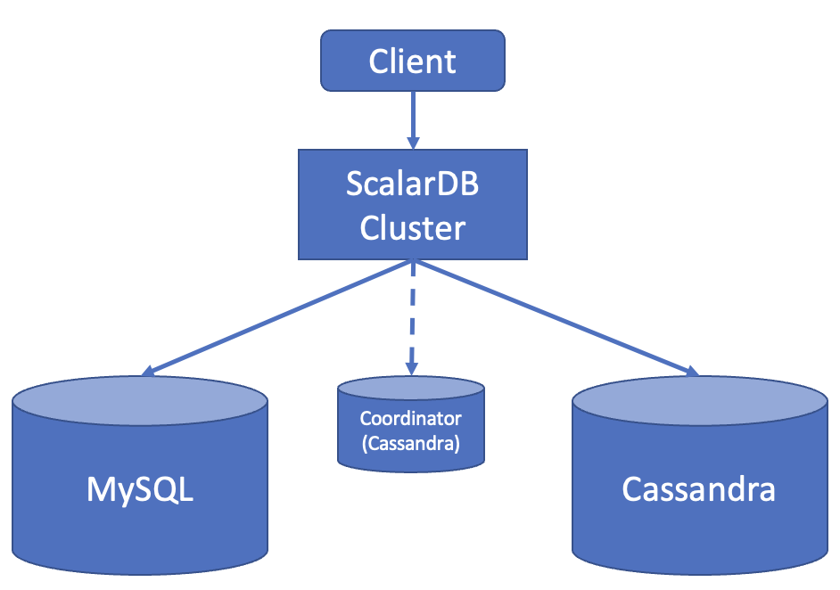

---
tags:
  - Enterprise Premium
displayed_sidebar: docsJapanese
---

# マルチストレージトランザクションを備えた Spring Data JDBC for ScalarDB のサンプルアプリケーション

import WarningLicenseKeyContact from '/src/components/ja-jp/_warning-license-key-contact.mdx';
import TranslationBanner from '/src/components/_translation-ja-jp.mdx';

<TranslationBanner />

このチュートリアルでは、マルチストレージトランザクションを備えた Spring Data JDBC for ScalarDB を使用してサンプル Spring Boot アプリケーションを作成する方法について説明します。

## このサンプルアプリケーションの前提条件

- [Eclipse Temurin](https://adoptium.net/temurin/releases/) の OpenJDK LTS バージョン (8、11、17、または 21)
- [Docker](https://www.docker.com/get-started/) 20.10以降 ([Docker Compose](https://docs.docker.com/compose/install/) V2以降)

:::note

このサンプルアプリケーションは、Eclipse Temurin の OpenJDK でテストされています。ただし、ScalarDB 自体は、さまざまなベンダーの JDK ディストリビューションでテストされています。互換性のある JDK ディストリビューションを含む ScalarDB の要件の詳細については、[要件](../../requirements.mdx)を参照してください。

:::

<WarningLicenseKeyContact product="ScalarDB Cluster" />

## サンプルアプリケーション

### 概要

このチュートリアルでは、ScalarDB の [マルチストレージトランザクション](../../multi-storage-transactions.mdx)機能を使用して、アイテムを注文し、信用枠で支払いを行うことができるサンプル電子商取引アプリケーションを作成するプロセスについて説明します。

:::note

このチュートリアルでは、マルチストレージトランザクションで Spring Data JDBC for ScalarDB を使用する方法を説明することに重点を置いているため、サンプルアプリケーションではアプリケーション固有のエラー処理、認証処理などは省略されています。

詳細については、[Spring Data JDBC for ScalarDB ガイド](../../scalardb-sql/spring-data-guide.mdx)を参照してください。

:::



アプリケーションは、ScalarDB Cluster を介してデータベースにアクセスします。

### スキーマ

[スキーマ](https://github.com/scalar-labs/scalardb-samples/blob/main/spring-data-multi-storage-transaction-sample/schema.sql)は次のとおりです。

```sql
CREATE COORDINATOR TABLES IF NOT EXIST;

CREATE NAMESPACE IF NOT EXISTS customer;

CREATE TABLE IF NOT EXISTS customer.customers (
  customer_id INT PRIMARY KEY,
  name TEXT,
  credit_limit INT,
  credit_total INT
);

CREATE NAMESPACE IF NOT EXISTS "order";

CREATE TABLE IF NOT EXISTS "order".orders (
  customer_id INT,
  timestamp BIGINT,
  order_id TEXT,
  PRIMARY KEY (customer_id, timestamp)
);

CREATE INDEX IF NOT EXISTS ON "order".orders (order_id);

CREATE TABLE IF NOT EXISTS "order".statements (
  order_id TEXT,
  item_id INT,
  count INT,
  PRIMARY KEY (order_id, item_id)
);

CREATE TABLE IF NOT EXISTS "order".items (
  item_id INT PRIMARY KEY,
  name TEXT,
  price INT
);
```

すべてのテーブルは、`customer` および `order` 名前空間に作成されます。

- `customer.customers`: 顧客の情報を管理するテーブル
  - `credit_limit`: 貸し手が各顧客にクレジットカードの使用を許可する最大金額
  - `credit_total`: 各顧客がクレジットカードを使用してすでに使用した金額
- `order.orders`: 注文情報を管理するテーブル
- `order.statements`: 注文明細情報を管理するテーブル
- `order.items`: 注文するアイテムの情報を管理するテーブル

スキーマのエンティティ関係図は次のとおりです。


### トランザクション

このサンプルアプリケーションでは、次の5つのトランザクションが実装されています:

1. 顧客情報の取得
2. クレジットカードによる注文 (注文のコストがクレジット限度額を下回っているかどうかを確認し、注文履歴を記録して、チェックに合格した場合は `credit_total` を更新します)
3. 注文 ID による注文情報の取得
4. 顧客 ID による注文情報の取得
5. 返済 (`credit_total` の金額を減らします)

## ScalarDB Cluster の設定

[ScalarDB Cluster の設定](https://github.com/scalar-labs/scalardb-samples/blob/main/spring-data-multi-storage-transaction-sample/scalardb-cluster-node.properties)は次のとおりです:

```properties
scalar.db.storage=multi-storage
scalar.db.multi_storage.storages=cassandra,mysql
scalar.db.multi_storage.storages.cassandra.storage=cassandra
scalar.db.multi_storage.storages.cassandra.contact_points=cassandra-1
scalar.db.multi_storage.storages.cassandra.username=cassandra
scalar.db.multi_storage.storages.cassandra.password=cassandra
scalar.db.multi_storage.storages.mysql.storage=jdbc
scalar.db.multi_storage.storages.mysql.contact_points=jdbc:mysql://mysql-1:3306/
scalar.db.multi_storage.storages.mysql.username=root
scalar.db.multi_storage.storages.mysql.password=mysql
scalar.db.multi_storage.namespace_mapping=customer:mysql,order:cassandra,coordinator:cassandra
scalar.db.multi_storage.default_storage=cassandra

scalar.db.cluster.node.standalone_mode.enabled=true
scalar.db.sql.enabled=true

# License key configurations
scalar.db.cluster.node.licensing.license_key=
scalar.db.cluster.node.licensing.license_check_cert_pem=
```

- `scalar.db.storage`: ScalarDB でマルチストレージトランザクションを使用するには、`multi-storage` を指定する必要があります。
- `scalar.db.multi_storage.storages`: ここでストレージ名を定義する必要があります。
- `scalar.db.multi_storage.storages.cassandra.*`: これらの設定は、`scalar.db.multi_storage.storages` で定義されているストレージ名の1つである `cassandra` ストレージ用です。ここで、`cassandra` ストレージのすべての `scalar.db.*` プロパティを設定できます。
- `scalar.db.multi_storage.storages.mysql.*`: これらの設定は、`scalar.db.multi_storage.storages` で定義されているストレージ名の1つである `mysql` ストレージ用です。ここで、`mysql` ストレージのすべての `scalar.db.*` プロパティを設定できます。
- `scalar.db.multi_storage.namespace_mapping`: この設定は、名前空間をストレージにマップします。このサンプルアプリケーションでは、`customer` 名前空間テーブルの操作は `mysql` ストレージにマップされ、`order` 名前空間テーブルの操作は `cassandra` ストレージにマップされます。また、Consensus Commit トランザクションで使用される `coordinator` 名前空間にマップされるストレージを定義することもできます。
- `scalar.db.multi_storage.default_storage`: この設定は、マップされていない名前空間テーブルの操作に使用されるデフォルトのストレージを設定します。

詳細については、[マルチストレージトランザクション](../../multi-storage-transactions.mdx)を参照してください。

このサンプルアプリケーションでは、ScalarDB Cluster はスタンドアロンモード (`scalar.db.cluster.node.standalone_mode.enabled=true`) で実行されています。

また、設定ファイルで ScalarDB Cluster のライセンスキー (試用ライセンスまたは商用ライセンス) を設定する必要があります。 詳細については、[製品ライセンスキーの設定方法](../../scalar-licensing/README.mdx)を参照してください。

## クライアント設定

[クライアント設定](https://github.com/scalar-labs/scalardb-samples/blob/main/spring-data-multi-storage-transaction-sample/scalardb-sql.properties)は次のとおりです。

```properties
scalar.db.sql.connection_mode=cluster
scalar.db.sql.cluster_mode.contact_points=indirect:localhost
```

## セットアップ

### ScalarDB サンプルリポジトリのクローンを作成する

ターミナルを開き、次のコマンドを実行して ScalarDB サンプルリポジトリのクローンを作成します。

```console
git clone https://github.com/scalar-labs/scalardb-samples
```

次に、次のコマンドを実行して、このサンプルがあるディレクトリに移動します。

```console
cd scalardb-samples/spring-data-multi-storage-transaction-sample
```

### ライセンスキーを設定する

設定ファイル [`scalardb-cluster-node.properties`](https://github.com/scalar-labs/scalardb-samples/blob/main/spring-data-multi-storage-transaction-sample/scalardb-cluster-node.properties) で ScalarDB Cluster のライセンスキー (試用ライセンスまたは商用ライセンス) を設定します。詳細については、[製品ライセンスキーの設定方法](../../scalar-licensing/README.mdx)を参照してください。

### Cassandra、MySQL、および ScalarDB Cluster を起動する

Cassandra、MySQL、および ScalarDB Cluster を起動するには、次の `docker-compose` コマンドを実行する必要があります。

```console
docker-compose up -d
```

コンテナの起動には1分以上かかる場合があることに注意してください。

### スキーマをロード

次に、次のコマンドでスキーマを適用する必要があります。SQL CLI ツール `scalardb-cluster-sql-cli-<VERSION>-all.jar` をダウンロードするには、ScalarDB の [リリース](https://github.com/scalar-labs/scalardb/releases)を参照して、使用するバージョンをダウンロードしてください。

```console
java -jar scalardb-cluster-sql-cli-<VERSION>-all.jar --config scalardb-sql.properties --file schema.sql
```

### 初期データをロードする

コンテナが起動したら、次のコマンドを実行して初期データをロードする必要があります。

```console
./gradlew run --args="LoadInitialData"
```

初期データがロードされた後、次のレコードがテーブルに保存されます:

- `customer.customers` テーブルの場合:

| customer_id | name          | credit_limit | credit_total |
|-------------|---------------|--------------|--------------|
| 1           | Yamada Taro   | 10000        | 0            |
| 2           | Yamada Hanako | 10000        | 0            |
| 3           | Suzuki Ichiro | 10000        | 0            |

- `order.items` テーブルの場合:

| item_id | name   | price |
|---------|--------|-------|
| 1       | Apple  | 1000  |
| 2       | Orange | 2000  |
| 3       | Grape  | 2500  |
| 4       | Mango  | 5000  |
| 5       | Melon  | 3000  |

## サンプルアプリケーションを実行する

まず、ID が `1` である顧客に関する情報を取得します。

```console
./gradlew run --args="GetCustomerInfo 1"
...
{"customer_id":1,"name":"Yamada Taro","credit_limit":10000,"credit_total":0}
...
```

次に、顧客 ID `1` を使用して、リンゴ3個とオレンジ2個を注文します。注文形式は `<Item ID>:<Count>,<Item ID>:<Count>,...` であることに注意してください。

```console
./gradlew run --args="PlaceOrder 1 1:3,2:2"
...
{"order_id":"5d49eb62-fcb9-4dd2-9ae5-e714d989937f","customer_id":1,"timestamp":1677564659810}
...
```

このコマンドを実行すると、注文 ID が表示されます。

注文 ID を使用して注文の詳細を確認してみましょう。

```console
./gradlew run --args="GetOrder 5d49eb62-fcb9-4dd2-9ae5-e714d989937f"
...
{"order_id":"5d49eb62-fcb9-4dd2-9ae5-e714d989937f","timestamp":1677564659810,"customer_id":1,"customer_name":"Yamada Taro","statements":[{"item_id":1,"item_name":"Apple","price":1000,"count":3,"total":3000},{"item_id":2,"item_name":"Orange","price":2000,"count":2,"total":4000}],"total":7000}
...
```

次に、別の注文を出して、顧客 ID `1` の注文履歴を取得しましょう。

```console
./gradlew run --args="PlaceOrder 1 5:1"
...
{"order_id":"ccd97d75-ee57-4393-a0bb-5230c4a8c68a","customer_id":1,"timestamp":1677564776069}
...
./gradlew run --args="GetOrders 1"
...
[{"order_id":"ccd97d75-ee57-4393-a0bb-5230c4a8c68a","timestamp":1677564776069,"customer_id":1,"customer_name":"Yamada Taro","statements":[{"item_id":5,"item_name":"Melon","price":3000,"count":1,"total":3000}],"total":3000},{"order_id":"5d49eb62-fcb9-4dd2-9ae5-e714d989937f","timestamp":1677564659810,"customer_id":1,"customer_name":"Yamada Taro","statements":[{"item_id":1,"item_name":"Apple","price":1000,"count":3,"total":3000},{"item_id":2,"item_name":"Orange","price":2000,"count":2,"total":4000}],"total":7000}]
...
```

この注文履歴は、タイムスタンプの降順で表示されます。

顧客の現在の `credit_total` は `10000` です。顧客は、情報を取得したときに表示された `credit_limit` に達したため、これ以上注文することはできません。

```console
./gradlew run --args="GetCustomerInfo 1"
...
{"customer_id":1,"name":"Yamada Taro","credit_limit":10000,"credit_total":10000}
...
./gradlew run --args="PlaceOrder 1 3:1,4:1"
...
java.lang.RuntimeException: Credit limit exceeded. limit:10000, total:17500
        at sample.SampleService.placeOrder(SampleService.java:102)
        at sample.SampleService$$FastClassBySpringCGLIB$$1123c447.invoke(<generated>)
        at org.springframework.cglib.proxy.MethodProxy.invoke(MethodProxy.java:218)
        at org.springframework.aop.framework.CglibAopProxy$CglibMethodInvocation.invokeJoinpoint(CglibAopProxy.java:793)
        at org.springframework.aop.framework.ReflectiveMethodInvocation.proceed(ReflectiveMethodInvocation.java:163)
        at org.springframework.aop.framework.CglibAopProxy$CglibMethodInvocation.proceed(CglibAopProxy.java:763)
        at org.springframework.transaction.interceptor.TransactionInterceptor$1.proceedWithInvocation(TransactionInterceptor.java:123)
        at org.springframework.transaction.interceptor.TransactionAspectSupport.invokeWithinTransaction(TransactionAspectSupport.java:388)
        at org.springframework.transaction.interceptor.TransactionInterceptor.invoke(TransactionInterceptor.java:119)
        at org.springframework.aop.framework.ReflectiveMethodInvocation.proceed(ReflectiveMethodInvocation.java:186)
        at org.springframework.aop.framework.CglibAopProxy$CglibMethodInvocation.proceed(CglibAopProxy.java:763)
        at org.springframework.aop.framework.CglibAopProxy$DynamicAdvisedInterceptor.intercept(CglibAopProxy.java:708)
        at sample.SampleService$$EnhancerBySpringCGLIB$$1cb0cc8c.placeOrder(<generated>)
        at sample.command.PlaceOrderCommand.call(PlaceOrderCommand.java:37)
        at sample.command.PlaceOrderCommand.call(PlaceOrderCommand.java:13)
        at picocli.CommandLine.executeUserObject(CommandLine.java:2041)
        at picocli.CommandLine.access$1500(CommandLine.java:148)
        at picocli.CommandLine$RunLast.executeUserObjectOfLastSubcommandWithSameParent(CommandLine.java:2461)
        at picocli.CommandLine$RunLast.handle(CommandLine.java:2453)
        at picocli.CommandLine$RunLast.handle(CommandLine.java:2415)
        at picocli.CommandLine$AbstractParseResultHandler.execute(CommandLine.java:2273)
        at picocli.CommandLine$RunLast.execute(CommandLine.java:2417)
        at picocli.CommandLine.execute(CommandLine.java:2170)
        at sample.SampleApp.run(SampleApp.java:26)
        at org.springframework.boot.SpringApplication.callRunner(SpringApplication.java:768)
        at org.springframework.boot.SpringApplication.callRunners(SpringApplication.java:752)
        at org.springframework.boot.SpringApplication.run(SpringApplication.java:314)
        at org.springframework.boot.SpringApplication.run(SpringApplication.java:1303)
        at org.springframework.boot.SpringApplication.run(SpringApplication.java:1292)
        at sample.SampleApp.main(SampleApp.java:35)
...
```

支払いが完了すると、顧客は再度注文できるようになります。

```console
./gradlew run --args="Repayment 1 8000"
...
./gradlew run --args="GetCustomerInfo 1"
...
{"customer_id":1,"name":"Yamada Taro","credit_limit":10000,"credit_total":2000}
...
./gradlew run --args="PlaceOrder 1 3:1,4:1"
...
{"order_id":"3ac4a1bf-a724-4f26-b948-9f03281a971e","customer_id":1,"timestamp":1677565028204}
...
```

## クリーンアップ

Cassandra、MySQL、および ScalarDB Cluster を停止するには、次のコマンドを実行します。

```console
docker-compose down
```
