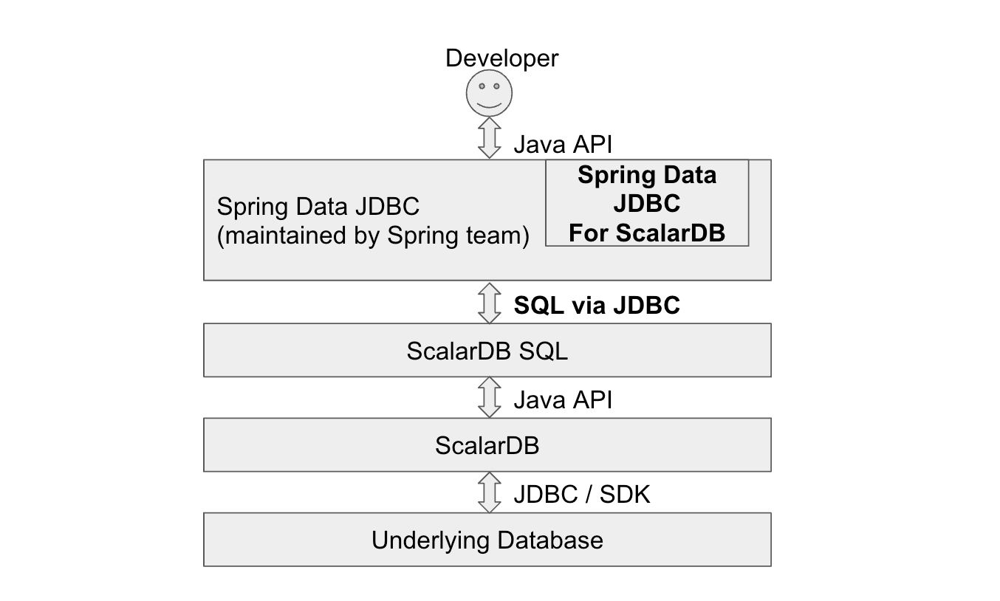

---
tags:
  - Enterprise Premium
displayed_sidebar: docsJapanese
---

# Spring Data JDBC for ScalarDB ガイド

ScalarDB API を直接使用するのは、大量のコードを記述し、トランザクションの API (例: `rollback()` および `commit()`) をいつどのように呼び出すかを考慮する必要があるため、難しい場合があります。ほとんどの ScalarDB ユーザーは Java でアプリケーションを開発すると想定されるため、Java で開発するための最も人気のあるアプリケーションフレームワークの1つである Spring Framework を利用できます。Spring Data JDBC for ScalarDB を使用すると、使い慣れたフレームワークを使用して開発を効率化できます。



Spring Data JDBC for ScalarDB の使用方法は、基本的に [Spring Data JDBC - リファレンスドキュメント](https://docs.spring.io/spring-data/jdbc/docs/3.0.x/reference/html/)に従います。

このガイドでは、Spring Data JDBC for ScalarDB を使用するためのいくつかの重要なトピックとその制限について説明します。

## Spring Data JDBC for ScalarDB をプロジェクトに追加します

Gradle を使用して Spring Data JDBC for ScalarDB への依存関係を追加するには、以下を使用します。`<VERSION>` は、使用している Spring Data JDBC for ScalarDB と関連ライブラリのバージョンにそれぞれ置き換えます。

```gradle
dependencies {
    implementation 'com.scalar-labs:scalardb-sql-spring-data:<VERSION>'
    implementation 'com.scalar-labs:scalardb-cluster-java-client-sdk:<VERSION>'
}
```

Maven を使用して依存関係を追加するには、以下を使用します。`...` を、使用している Spring Data JDBC for ScalarDB のバージョンに置き換えます。

```xml
<dependencies>
    <dependency>
        <groupId>com.scalar-labs</groupId>
        <artifactId>scalardb-sql-spring-data</artifactId>
        <version>...</version>
    </dependency>
    <dependency>
        <groupId>com.scalar-labs</groupId>
        <artifactId>scalardb-cluster-java-client-sdk</artifactId>
        <version>...</version>
    </dependency>
</dependencies>
```

## 設定

Spring Data JDBC for ScalarDB は、Spring アプリケーションの一部として使用されることになっています。少なくとも次のプロパティが必要です。

### spring.datasource.driver-class-name

これは、固定値 `com.scalar.db.sql.jdbc.SqlJdbcDriver` に設定する必要があります。

```console
spring.datasource.driver-class-name=com.scalar.db.sql.jdbc.SqlJdbcDriver
```

### spring.datasource.url

この値は、ScalarDB JDBC 接続 URL 設定に従います。詳細については、[ScalarDB JDBC ガイド](jdbc-guide.mdx)および [ScalarDB Cluster SQL クライアント設定](../scalardb-cluster/developer-guide-for-scalardb-cluster-with-java-api.mdx#scalardb-cluster-sql-クライアント設定)を参照してください。

```console
spring.datasource.url=jdbc:scalardb:\
?scalar.db.sql.connection_mode=direct\
&scalar.db.contact_points=jdbc:mysql://localhost:3306/my_app_ns\
&scalar.db.username=root\
&scalar.db.password=mysql\
&scalar.db.storage=jdbc\
&scalar.db.consensus_commit.isolation_level=SERIALIZABLE
```

## アノテーション

Spring Data JDBC for ScalarDB を使用するには、次のように JVM アプリケーションに `@EnableScalarDbRepositories` アノテーションが必要です。

```java
@SpringBootApplication
@EnableScalarDbRepositories
public class MyApplication {
  //  These repositories are described in the next section in details
  @Autowired private GroupRepository groupRepository;
  @Autowired private UserRepository userRepository;
```

## 永続エンティティモデル

Spring Data JDBC for ScalarDB のユーザーは、ScalarDB テーブルへのオブジェクトマッピング用のクラスを作成する必要があります。これらのクラスの作成方法は [永続エンティティ](https://docs.spring.io/spring-data/jdbc/docs/3.0.x/reference/html/#jdbc.entity-persistence)に記載されています。このセクションでは、統合に関するいくつかの制限について説明します。

これらはモデルクラスの例です。

### domain/model/User

```java
// This model class corresponds to the following table schema:
//
//   create table my_app_ns.user (id bigint, group_id bigint, name text, primary key (id));
//
//   -- UserRepository can use `name` column as a condition in SELECT statement
//   -- as the column is a ScalarDB secondary index.
//   create index on my_app_ns.user (name);

// Set `schema` parameter in @Table annotation if you don't use `scalar.db.sql.default_namespace_name` property.
//
// Spring Data automatically decides the target table name based on a model class name.
// You can also specify a table name by setting `value` parameter.
//
// @Table(schema = "my_app_ns", value = "user")
@Table
public class User {
  @Id
  public final Long id;

  public final Long groupId;

  // Spring Data automatically decides the target column name based on an instance variable name.
  // You can also specify a column name by setting `value` parameter in @Column annotation.
  // @Column("name")
  public final String name;

  public User(Long id, Long groupId, String name) {
    this.id = id;
    this.groupId = groupId;
    this.name = name;
  }
}
```

### domain/model/Group

```java
// This model class corresponds to the following table schema:
//
//   create table my_app_ns.group (account_id int, group_type int, balance int, primary key (account_id, group_type));

@Table
public class Group {
  // This column `account_id` is a part of PRIMARY KEY in ScalarDB SQL
  //
  // Spring Data JDBC always requires a single @Id annotation while it doesn't allow multiple @Id annotations.
  // The corresponding ScalarDB SQL table `group` has a primary key consisting of multiple columns.
  // So, Spring Data @Id annotation can't be used in this case, but @Id annotation must be put on any instance variable
  // (@Id annotation can be put on `balance` as well.)
  @Id
  public final Integer accountId;

  // This column `group_type` is also a part of PRIMARY KEY in ScalarDB SQL
  public final Integer groupType;

  public final Integer balance;

  public Group(Integer accountId, Integer groupType, Integer balance) {
    this.accountId = accountId;
    this.groupType = groupType;
    this.balance = balance;
  }
}
```

[このサンプル実装](https://github.com/scalar-labs/scalardb-samples/tree/main/spring-data-sample/src/main/java/sample/domain/model)もリファレンスとして使用できます。

### domain/repository/UserRepository

```java
@Transactional
@Repository
public interface UserRepository extends ScalarDbRepository<User, Long> {

  // `insert()` and `update()` are automatically enabled with `ScalarDbRepository` (or `ScalarDbTwoPcRepository`).

  // Many APIs of `CrudRepository` and `PagingAndSortingRepository` are automatically enabled.
  // https://docs.spring.io/spring-data/commons/docs/3.0.x/api/org/springframework/data/repository/CrudRepository.html
  // https://docs.spring.io/spring-data/commons/docs/3.0.x/api/org/springframework/data/repository/PagingAndSortingRepository.html

  // Also, you can prepare complicated APIs with the combination of the method naming conventions.
  // https://docs.spring.io/spring-data/jdbc/docs/3.0.x/reference/html/#repositories.definition-tuning

  // These APIs use the ScalarDB secondary index
  List<User> findByName(String name);
  List<User> findTop2ByName(String name);
  // Current ScalarDB SQL doesn't support range scan or order using secondary indexes
  // List<User> findByNameBetween(String name);
  // List<User> findByGroupIdOrderByName(long groupId);

  default void reverseName(long id) {
    Optional<User> model = findById(id);
    if (model.isPresent()) {
      User existing = model.get();
      User updated =
          new User(
              existing.id,
              existing.groupId,
              existing.name.reverse());
      update(updated);
    }
  }

  default void deleteAfterSelect(long id) {
    Optional<User> existing = findById(id);
    existing.ifPresent(this::delete);
  }
}
```

### domain/repository/GroupRepository

```java
@Transactional
@Repository
public interface GroupRepository extends ScalarDbRepository<Group, Long> {

  // @Id annotation is put only on Group.accountId, but ScalarDB SQL expects the combination of
  // `account_id` and `group_type` columns as the table uses them as a primary key. So `findById()` can't be used.
  Optional<Group> findFirstByAccountIdAndGroupType(int accountId, int groupType);

  List<Group> findByAccountIdAndGroupTypeBetweenOrderByGroupTypeDesc(
      int accountId, int groupTypeFrom, int groupTypeTo);

  List<Group> findTop2ByAccountIdAndGroupTypeBetween(
      int accountId, int groupTypeFrom, int groupTypeTo);

  // `update()` method also depends on @Id annotation as well as `findById()`,
  // so users need to write ScalarDB SQL in @Query annotation.
  @Modifying
  @Query(
      "UPDATE \"my_app_ns\".\"group\" SET \"balance\" = :balance \n"
          + " WHERE \"my_app_ns\".\"group\".\"account_id\" = :accountId \n"
          + " AND \"my_app_ns\".\"group\".\"group_type\" = :groupType \n")
  int updateWithAttributes(
      @Param("accountId") int accountId,
      @Param("groupType") int groupType,
      @Param("balance") int balance);

  default void incrementBalance(int accountId, int groupType, int value) {
    Optional<Group> model = findFirstByAccountIdAndGroupType(accountId, groupType);
    model.ifPresent(
        found ->
            updateWithAttributes(
                found.accountId, found.groupType, found.balance + value));
  }

  default void transfer(
      int accountIdFrom, int groupTypeFrom, int accountIdTo, int groupTypeTo, int value) {
    incrementBalance(accountIdFrom, groupTypeFrom, -value);
    incrementBalance(accountIdTo, groupTypeTo, value);
  }

  // This method name and signature results in issuing an unexpected SELECT statement and
  // results in query failure. It looks a bug of Spring Data...
  //
  // void deleteByAccountIdAndGroupType(int accountId, int groupType);

  @Modifying
  @Query(
      "DELETE FROM \"my_app_ns\".\"group\" \n"
          + " WHERE \"my_app_ns\".\"group\".\"account_id\" = :accountId \n"
          + " AND \"my_app_ns\".\"group\".\"group_type\" = :groupType \n")
  int deleteByAccountIdAndGroupType(
      @Param("accountId") int accountId, @Param("groupType") int groupType);

  default void deleteByAccountIdAndGroupTypeAfterSelect(int accountId, int groupType) {
    Optional<Group> entity = findFirstByAccountIdAndGroupType(accountId, groupType);
    entity.ifPresent(found -> deleteByAccountIdAndGroupType(accountId, groupType));
  }
}
```

[このサンプル実装](https://github.com/scalar-labs/scalardb-samples/tree/main/spring-data-sample/src/main/java/sample/domain/repository)もリファレンスとして使用できます。

## エラー処理

Spring Data JDBC for ScalarDB では、次の例外がスローされる可能性があります。

- com.scalar.db.sql.springdata.exception.ScalarDbTransientException
  - これは、一時的なエラーが原因でトランザクションが失敗したときにスローされます。
  - トランザクションを再試行する必要があります。
  - これは `org.springframework.dao.TransientDataAccessException` のサブクラスであり、Spring Data からスローされる他の種類の一時的なエラーを処理するには、スーパークラスをキャッチする方が安全です。
- com.scalar.db.sql.springdata.exception.ScalarDbNonTransientException
  - これは、非一時的エラーが原因でトランザクションが失敗した場合にスローされます。
  - トランザクションは再試行しないでください。
  - これは `org.springframework.dao.NonTransientDataAccessException` のサブクラスであり、Spring Data からスローされる他のタイプの非一時的エラーを処理するには、スーパークラスをキャッチする方が安全です。
- com.scalar.db.sql.springdata.exception.ScalarDbUnknownTransactionStateException
  - これは `ScalarDbNonTransientException` のサブクラスであり、トランザクションも再試行しないでください。
  - これは、トランザクションのコミットが失敗し、最終状態が不明な場合にスローされます。
  - トランザクションが実際にコミットされるかどうかは、アプリケーション側で決定する必要があります (例: ターゲットレコードが期待どおりに更新されているかどうかを確認します)。

これらの例外にはトランザクション ID が含まれており、トラブルシューティングに役立ちます。

## 制限事項

### 複数列の PRIMARY KEY

上記の例からわかるように、Spring Data JDBC の `@Id` アノテーションは複数の列をサポートしていません。そのため、テーブルに複数の列で構成される主キーがある場合、ユーザーは次の API を使用できず、`@Query` アノテーションで Scalar SQL DB クエリを記述する必要がある場合があります。

- `findById()`
- `existsById()`
- `update(T entity)`
- `delete(T entity)`
- `deleteById(ID id)`
- `deleteAllById(Iterable<? extends ID> ids)`

### 2 つのエンティティ間の1対多の関係

Spring Data JDBC は1対多の関係をサポートしています。ただし、親の属性のみが変更された場合でも、関連付けられているすべての子レコードが暗黙的に削除され、再作成されます。この動作により、パフォーマンスが低下します。さらに、Spring Data JDBC for ScalarDB の1対多の関係の特定のユースケースは、ScalarDB SQL のいくつかの制限との組み合わせにより失敗します。これらの懸念と制限を考慮すると、Spring Data JDBC for ScalarDB の機能を使用することは推奨されません。

たとえば、Bank レコードに多数の Account レコードが含まれていると仮定すると、次の実装は `BankRepository#update()` を呼び出すと失敗します。

```java
@Autowired BankRepository bankRepository;

...

bankRepository.insert(new Bank(42, "My bank", ImmutableSet.of(
    new Account(1, "Alice"),
    new Account(2, "Bob"),
    new Account(3, "Carol")
)));

Bank bank = bankRepository.findById(42).get();
System.out.printf("Bank: " + bank);

// Fails here as `DELETE FROM "account" WHERE "account"."bank_id" = ?` is implicitly issued by Spring Data JDBC
// while ScalarDB SQL doesn't support DELETE with a secondary index
// (Spring Data JDBC's custom query might avoid these limitations)
bankRepository.update(new Bank(bank.bankId, bank.name + " 2", bank.accounts));
```

## 高度な機能

### マルチストレージトランザクション

ScalarDB は [マルチストレージトランザクション](../multi-storage-transactions.mdx)をサポートしており、ユーザーは Spring Data JDBC for ScalarDB を介してこの機能を使用できます。この機能を使用するには、次の設定が必要です。

#### spring.datasource.url

以下は、それぞれ MySQL と PostgreSQL でデータを管理する2つの名前空間「north」と「south」があると仮定したサンプルのデータソース URL です。

```
spring.datasource.url=jdbc:scalardb:\
?scalar.db.sql.connection_mode=direct\
&scalar.db.storage=multi-storage\
&scalar.db.multi_storage.storages=mysql,postgresql\
&scalar.db.multi_storage.namespace_mapping=north:mysql,south:postgresql\
&scalar.db.multi_storage.default_storage=postgresql\
&scalar.db.multi_storage.storages.mysql.storage=jdbc\
&...
```

#### モデルクラスの @Table アノテーション

- `schema` パラメータ: マルチストレージマッピングキー名 (`scalar.db.multi_storage.namespace_mapping`)
- `value` パラメータ: 実際のテーブル名

```java
  @Table(schema = "north", value = "account")
  public class NorthAccount {
```

### 再試行

#### Spring Retry を使用した再試行

Spring Data JDBC for ScalarDB は、同時トランザクションが競合すると例外をスローする可能性があります。ユーザーは、操作を再試行してこれらの例外に対処する必要があります。[Spring Retry](https://github.com/spring-projects/spring-retry) は再試行のための機能を提供します。また、Spring Data JDBC for ScalarDB でも、Spring Retry を使用すると再試行処理がシンプルかつ簡単になります。このセクションでは、Spring Retry の使用方法を紹介します。

##### 依存関係

次の依存関係をプロジェクトに追加する必要があります。

```gradle
dependencies {
    implementation "org.springframework.boot:spring-boot-starter:${springBootVersion}"
    implementation "org.springframework.boot:spring-boot-starter-aop:${springBootVersion}"
    implementation "org.springframework.retry:spring-retry:${springRetryVersion}"
}
```

##### 注釈

JVM アプリケーションに `@EnableRetry` 注釈を追加する必要があります。

```java
@SpringBootApplication
@EnableScalarDbRepositories
@EnableRetry
public class MyApp {
```

`@Retryable` アノテーションにより、Spring Data リポジトリクラスまたはメソッドは失敗した操作を自動的に再試行します。Spring Data JDBC for ScalarDB は一時的なエラー例外をスローする可能性があるため、アノテーションでターゲットクラスとして `org.springframework.dao.TransientDataAccessException` を指定することを強くお勧めします。また、バックオフと最大試行回数は、次のようにアノテーションで設定できます。

```java
  @Transactional
  @Retryable(
      include = TransientDataAccessException.class,
      maxAttempts = 4,
      backoff = @Backoff(delay = 500, maxDelay = 2000, multiplier = 2))
  default void insertWithRetry(Player player) {
    insert(player);
  }
```

`@Recover` アノテーションを使用すると、再試行回数を超えた失敗は指定されたメソッドによって自動的に回復されます。

```java
  @Transactional
  @Retryable(include = TransientDataAccessException.class,
          recover = "recoverInsert")
  default void insertWithRetryAndRecover(Player player) {
    insert(player);
  }

  @Transactional
  @Recover
  default void recoverInsert(Throwable throwable, Player player) throws Throwable {
    Optional<Player> existing = findById(player.id);
    if (!existing.isPresent()) {
      throw throwable;
    }
    logger.info(
        "Found an existing record {}. Updating it with a new record {}", existing.get(), player);

    update(player);
  }
```

#### 他の再試行ライブラリを使用して再試行

トランザクションを再試行するための他のオプションとして、Spring Retry の RetryTemplate や Resilience4j などがあります。お好みの再試行ライブラリを自由に選択して使用してください。

### 2 フェーズコミットトランザクション

ScalarDB は [2 フェーズコミットトランザクション](../two-phase-commit-transactions.mdx)をサポートしており、ユーザーは Spring Data JDBC for ScalarDB を介してこの機能を使用できます。次の設定が必要です。

#### spring.datasource.url

- `scalar.db.sql.default_transaction_mode` プロパティ: `two_phase_commit_transaction`

```console
spring.datasource.url=jdbc:scalardb:\
?scalar.db.sql.connection_mode=direct\
&scalar.db.contact_points=jdbc:mysql://localhost:3306/my_app_ns\
&...\
&scalar.db.sql.default_transaction_mode=two_phase_commit_transaction
```

#### Spring Data トランザクションマネージャーの設定

Spring Data JDBC for ScalarDB は、2PC トランザクションを実現するためのカスタム Spring Data トランザクションマネージャーを提供します。カスタムトランザクションマネージャーを有効にするには、次のいずれかのアノテーションを設定する必要があります。

- すべての `@Transactional` の `transactionManager` パラメーターを `scalarDbSuspendableTransactionManager` に設定します
- `@EnableScalarDbRepositories` の `transactionManagerRef` パラメーターを `scalarDbSuspendableTransactionManager` に設定します

#### リポジトリクラス

##### API

Spring Data JDBC for ScalarDB は、2PC トランザクション用の2種類の API をサポートしています。1つはプリミティブ API で、もう1つは高レベル API です。

##### プリミティブ 2PC API

`ScalarDbTwoPcRepository` は `ScalarDbRepository` の拡張であり、ScalarDB の同じ名前のメソッドに対応する次の API があり、ユーザーはこれらを使用して 2PC トランザクション用のカスタムリポジトリメソッドを構築できます。

- begin()
- 自動生成されたトランザクション ID を返します
- prepare()
- validate()
- suspend()
- commit()
- join(`transactionId`)
- resume(`transactionId`)

Spring Data リポジトリメソッドから例外がスローされると、実行中のすべての操作がロールバックされます。

詳細については、[2 フェーズコミットトランザクションの実行方法](../two-phase-commit-transactions.mdx#2-フェーズコミットトランザクションの実行方法)を参照してください。

```java
@Transactional(transactionManager = "scalarDbSuspendableTransactionManager")
@Repository
public interface TwoPcPlayerRepository extends ScalarDbTwoPcRepository<Player, String> {

  Logger logger = LoggerFactory.getLogger(TwoPcPlayerRepository.class);

  // Either of twoPcJoinAndInsert() or twoPcBeginAndInsert() can be used to start a transaction
  default void twoPcJoinAndInsert(String txId, Player player) throws SQLException {
    join(txId);
    insert(player);
    suspend();
  }

  default String twoPcBeginAndInsert(String id, Player player) throws SQLException {
    String txId = begin();
    insert(player);
    suspend();
    return txId;
  }

  default void twoPcPrepare(String txId) throws SQLException {
    resume(txId);
    prepare();
    suspend();
  }

  default void twoPcValidate(String txId) throws SQLException {
    resume(txId);
    validate();
    suspend();
  }

  default void twoPcCommit(String txId) throws SQLException {
    resume(txId);
    commit();
  }
```

###### 高レベル 2PC API

上記のプリミティブ API は強力で、柔軟かつきめ細かな方法で 2PC トランザクション操作を明示的に制御できます。一方、ユーザーは API を使用する際に、どの API を適切な順序で呼び出すかを考慮する必要があります。特に、ローカル状態やリモートサービス呼び出しのコーディネーター側の操作は複雑になりやすいです。

`ScalarDbTwoPcRepository` は、一般的なユースケースをカバーするために、高レベル API と呼ばれるユーザーフレンドリな API もいくつか提供しています。これらの API を使用すると、マイクロサービスアプリケーションをより簡単かつ安全に開発できます。

マイクロサービスでのコーディネーターサービスの開発のために、`ScalarDbTwoPcRepository` は、2PC 関連の操作を次の順序で暗黙的に実行する `executeTwoPcTransaction` API を提供しています。この API を使用すると、トランザクション操作をどのように、いつ実行するかを考える必要がありません。

- グローバルトランザクション ID を使用してローカルトランザクションを開始します
- 実行フェーズ: ローカルおよびリモートの CRUD 操作 (*)
- 準備フェーズ: ローカルおよびリモートの準備操作 (**) を並列で実行します
- 検証フェーズ: ローカルおよびリモートの検証操作 (**) を並列で実行します
- これは、`scalar.db.consensus_commit.isolation_level` が `SERIALIZABLE` で、`scalar.db.consensus_commit.serializable_strategy` が `EXTRA_READ` である場合にのみ必要です
- コミットフェーズ: ローカルコミット操作が最初に実行されます。ローカルコミット操作が成功した後、リモートコミット操作が並列で実行されます (**)
- (リモートコミット操作以外の操作が失敗した場合) ロールバックフェーズ: ローカルおよびリモートのロールバック操作が並列で実行されます (**)

(* このローカルおよびリモート操作コールバックの実装は、ユーザーによって挿入されます)\
(** このリモート操作コールバックの実装は、ユーザーによって挿入されます)

ローカルおよびリモート参加者のロールバック操作は、いずれかの操作から例外がスローされたときに実行されます。

`executeTwoPcTransaction()` のエラー処理については、

- API から次の例外がスローされる可能性があります
- `ScalarDbTransientException`
- この例外がスローされた場合、ユーザーは 2PC トランザクション操作を最初から再試行する必要があります
- `ScalarDbNonTransientException`
- `ScalarDbUnknownTransactionStateException`
- 2PC トランザクションが実際にコミットされるかどうかは、アプリケーション側で決定する必要があります
- 例外には 2PC グローバルトランザクション ID が含まれます。トラブルシューティングに役立つはずです

実行フェーズ操作 (ローカルおよびリモート参加者) の実装と、ユーザーによって渡される準備/検証/コミット/ロールバックフェーズのリモート操作については、失敗したときにこれらのコールバックでいずれかの例外をスローする必要があります:

- ネットワーク切断やデータベーストランザクションの競合などの一時的な問題が発生した場合は `ScalarDbTransientException`
- 認証エラーや権限エラーなどの非一時的な問題が発生した場合は `ScalarDbNonTransientException`
- 原因として `UnknownTransactionStatusException` を含む例外が発生した場合は `ScalarDbUnknownTransactionStateException`
- コールバックからスローされるその他の例外は `ScalarDbTransientException` として扱われます

マイクロサービスでの参加者サービスの開発のために、`ScalarDbTwoPcRepository` は次の API を提供します。この API を使用すると、トランザクションに参加、再開、一時停止する方法とタイミングを詳細に考える必要がありません。

- `joinTransactionOnParticipant`
  - トランザクションに参加し、CRUD 操作を実行し、参加者サービスでトランザクションを一時停止します。この API を最初に呼び出し、次に `prepareTransactionOnParticipant` とそれに続く API を呼び出す必要があります。
- `resumeTransactionOnParticipant`
  - トランザクションを再開し、CRUD 操作を実行して、参加者サービスでトランザクションを一時停止します。この API は、必要に応じて、`joinTransactionOnParticipant` の後、`prepareTransactionOnParticipant` の前に呼び出すことができます。
- `prepareTransactionOnParticipant`
  - トランザクションを準備し、参加者サービスでトランザクションを一時停止します。この API は `joinTransactionOnParticipant` の後に呼び出され、その後 `validateTransactionOnParticipant` とそれに続く API が呼び出されるはずです。
- `validateTransactionOnParticipant`
  - トランザクションを検証し、参加者サービスでトランザクションを一時停止します。この API は `prepareTransactionOnParticipant` の後に呼び出され、その後 `commitTransactionOnParticipant` または `rollbackTransactionOnParticipant` が呼び出される必要があります。
  - これは、`scalar.db.consensus_commit.isolation_level` が `SERIALIZABLE` で、`scalar.db.consensus_commit.serializable_strategy` が `EXTRA_READ` の場合にのみ必要です。
- `commitTransactionOnParticipant`
  - 参加者サービスでトランザクションをコミットします。この API は、トランザクションマネージャーの設定に応じて、`prepareTransactionOnParticipant` または `validateTransactionOnParticipant` の後に呼び出す必要があります。
- `rollbackTransactionOnParticipant`
  - 参加者サービスでトランザクションをロールバックします。この API は、トランザクションマネージャーの設定に応じて、`prepareTransactionOnParticipant` または `validateTransactionOnParticipant` の後に呼び出す必要があります。

Spring Data JDBC for ScalarDB の高レベル 2PC API を使用すると、次のように複雑なトランザクション操作を API 内に隠すことで、ビジネス ロジックに集中できます。

**コーディネーターサービス**

```java
  @Autowired private AccountRepository accountRepository;
  private final StockService stockService = ...;
  private final NotificationService notificationService = ...;
  private final List<RemotePrepareCommitPhaseOperations> remotePrepareCommitOpsList =
    Arrays.asList(
        RemotePrepareCommitPhaseOperations.createSerializable(
          stockService::prepareTransaction,
          stockService::validateTransaction,
          stockService::commitTransaction,
          stockService::rollbackTransaction),
        RemotePrepareCommitPhaseOperations.createSerializable(
          notificationService::prepareTxn,
          notificationService::validateTxn,
          notificationService::commitTxn,
          notificationService::rollbackTxn));
```

```java
  private Result<Pair<Integer, String>> executeTwoPcTransactionUsingHighLevelApi(
      Account account, String itemName, int itemPrice, String notificationEventName) {
    return accountRepository.executeTwoPcTransaction(
        // CRUD operations for local and remote participants in execution phase.
        txId -> {
          // [local] Read the account's balance
          Optional<Account> stored = accountRepository.findById(account.id);
          if (!stored.isPresent()) {
            // Cancel the transaction if the account doesn't exist.
            // No need to retry.
            throw new ScalarDbNonTransientException(
                "The local state doesn't meet the condition. Aborting this transaction");
          }
          // [remote] Start a transaction with the transaction ID,
          //               read the item information and decrement the count
          Optional<Integer> price = stockService.purchaseItem(txId, account.id, itemName);
          // [remote] Start a transaction with the transaction ID,
          //               read the notification and remove it
          Optional<String> notification =
              notificationService.getNotification(txId, account.id, notificationEventName);
          if (price.isPresent() && notification.isPresent()) {
            int currentBalance = stored.get().balance - price.get();
            if (currentBalance < 0) {
              // Cancel the transaction if the global state doesn't meet the condition.
              // No need to retry.
              throw new ScalarDbNonTransientException(
                  "The state of local and remote participants doesn't meet the condition. Aborting this transaction");
            }
            // [local] Decrease the account's balance for the item
            accountRepository.update(new Account(account.id, currentBalance));
            return Pair.of(currentBalance, notification.get());
          }
          // Cancel the transaction if the global state doesn't meet the condition.
          // No need to retry.
          throw new ScalarDbNonTransientException(
              "The remote state doesn't meet the condition. Aborting this transaction");
        },
        // Remote operations for Prepare/Validate/Commit/Rollback
        remotePrepareCommitOpsList);
  }
```

```java
    RetryTemplate retryTemplate =
        new RetryTemplateBuilder()
            .retryOn(TransientDataAccessException.class)
            .exponentialBackoff(500, 2.0, 8000)
            .maxAttempts(8)
            .withListener(
              new RetryListenerSupport() {
                @Override
                public <T, E extends Throwable> void onError(RetryContext context, RetryCallback<T, E> callback, Throwable throwable) {
                  if (throwable instanceof ScalarDbUnknownTransactionStateException) {
                    // Report an exception occurred that requires special treatments
                    reportToDevelopers(
                      String.format("Failed to process a 2PC transaction (%s). The final transaction status is unknown. Please check current application status",
                        ((ScalarDbUnknownTransactionStateException) throwable).getTransactionId()), throwable);
                  }
                }})
            .build();

    Result<Pair<Integer, String>> result =
        retryTemplate.execute(context ->
            executeTwoPcTransactionUsingHighLevelApi(account, itemName, itemPrice, notificationEventName));
```

[このサンプル実装](https://github.com/scalar-labs/scalardb-samples/blob/main/spring-data-microservice-transaction-sample/order-service/src/main/java/sample/order/OrderService.java)もリファレンスとして使用できます。

**参加者サービス**

```java
@RestController
public class StockController {
  @Autowired private StockRepository stockRepository;

  @PostMapping("/purchaseItem")
  public Optional<Integer> purchaseItem(
                               @RequestParam("transactionId") String transactionId,
                               @RequestParam("accountId") int accountId,
                               @RequestParam("itemName") String itemName) {
    return stockRepository.joinTransactionOnParticipant(txId, () -> {
        Optional<Item> item = stockRepository.findById(itemName);

        ...

        return Optional.of(item.price);
    });
  }

  @PostMapping("/prepareTransaction")
  public void prepareTransaction(@RequestParam("transactionId") String transactionId) {
    return stockRepository.prepareTransactionOnParticipant(txId);
  }

  @PostMapping("/validateTransaction")
  public void validateTransaction(@RequestParam("transactionId") String transactionId) {
    return stockRepository.validateTransactionOnParticipant(txId);
  }

  @PostMapping("/commitTransaction")
  public void commitTransaction(@RequestParam("transactionId") String transactionId) {
    return stockRepository.commitTransactionOnParticipant(txId);
  }

  @PostMapping("/rollbackTransaction")
  public void rollbackTransaction(@RequestParam("transactionId") String transactionId) {
    return stockRepository.rollbackTransactionOnParticipant(txId);
  }
}
```

[このサンプル実装](https://github.com/scalar-labs/scalardb-samples/blob/main/spring-data-microservice-transaction-sample/customer-service/src/main/java/sample/customer/CustomerService.java)は REST API ではなく gRPC を使用していますが、リファレンスとしても使用できます。

#### JVM アプリケーションで 2PC と通常のトランザクションモードの両方を使用する方法

ほとんどの場合、アプリケーションでは 2PC と通常のトランザクションモードのいずれか1つだけを使用することになっています。ただし、両方のトランザクションモードを使用するユースケースもあります。たとえば、2PC の参加者として使用されるサービスに、2PC プロトコルを使用せずに他のサービスまたはクライアントから直接呼び出される API がいくつかあるとします。この場合、開発者は 2PC で使用されない API に対して通常のトランザクションモードを使用するだけで済みます。

このユースケースを実現するには、2PC と通常のトランザクションモードの異なる `scalar.db.sql.default_transaction_mode` パラメータを、`spring.datasource.url` プロパティを介して Spring Data JDBC フレームワークに渡す必要があります。ただし、Spring Data JDBC では、複数のデータソース設定を使用する簡単な方法は提供されていません。ただし、いくつかのカスタム設定クラスを使用すると、ユーザーは複数のデータソース設定を使用する JVM アプリケーションで 2PC と通常のトランザクションモードの両方を使用できます。

#### 制限事項

##### `@Transactional` メソッドは `commit()` を暗黙的に呼び出しません

ScalarDB を使用したマイクロサービスアプリケーションでは、コミットはコーディネーターサービスによって明示的に呼び出される必要があり、`@Transactional` メソッドを終了するときに Spring Data トランザクションフレームワークによってローカルにトリガーされることはありません。`@Transactional(transactionManager = "scalarDbSuspendableTransactionManager")` アノテーションは、このようなローカルコミットを防止します。

この拡張された動作は、`@Transactional` メソッドがトランザクションを暗黙的にコミットすることを期待している開発者を混乱させる可能性があります。

たとえば、サービスクラスのメソッドで `@Transactional` アノテーションを使用すると仮定すると、次のコードは **通常の** トランザクションモードで機能します。

```java
@Service
public class SampleService {

  ...

  // For the normal transaction mode
  @Transactional
  // For the 2PC transaction mode
  // @Transactional(transactionManager = "scalarDbSuspendableTransactionManager")
  public void repayment(int customerId, int amount) {
    Customer customer = customerRepository.getById(customerId);

    int updatedCreditTotal = customer.creditTotal - amount;

    // Check if over repayment or not
    if (updatedCreditTotal < 0) {
      throw new RuntimeException(
          String.format(
              "Over repayment. creditTotal:%d, payment:%d", customer.creditTotal, amount));
    }

    // Reduce credit_total for the customer
    customerRepository.update(customer.withCreditTotal(updatedCreditTotal));
  }
}
```

ただし、このコードは、`transactionManager = "scalarDbSuspendableTransactionManager"` であっても 2PC トランザクションモードでは機能しません。代わりに、次のように `ScalarDbTwoPcRepository.executeOneshotOperations()` を使用します。

```java
@Service
public class SampleService {

  ...

  public void repayment(int customerId, int amount) {
    customerRepository.executeOneshotOperations(() -> {
      Customer customer = customerRepository.getById(customerId);

      int updatedCreditTotal = customer.creditTotal - amount;

      // Check if over repayment or not
      if (updatedCreditTotal < 0) {
        throw new RuntimeException(
            String.format(
                "Over repayment. creditTotal:%d, payment:%d", customer.creditTotal, amount));
      }

      // Reduce credit_total for the customer
      customerRepository.update(customer.withCreditTotal(updatedCreditTotal));

      return null;
    });
  }
}
```

## トラブルシューティング

このセクションでは、Spring Data JDBC の使用時に発生する可能性のあるエラーのトラブルシューティング方法について説明します。

### `A constructor parameter name must not be null to be used with Spring Data JDBC` ランタイムエラー

Spring Boot 3 の使用時に、`A constructor parameter name must not be null to be used with Spring Data JDBC` というランタイムエラーが発生する場合があります。この問題を回避するには、次のように `javac` に `-parameters` オプションを渡します。

```gradle
  compileJava {
    options.compilerArgs << '-parameters'
  }
```

## サンプルアプリケーション

Spring Data JDBC for ScalarDB を使用する次のサンプルアプリケーションを確認できます。これは参照用であり、必ずしも本番環境のコード標準を満たしているわけではありません。

- [Spring Data JDBC for ScalarDB を使用した ScalarDB Cluster SQL の開始](../scalardb-cluster/getting-started-with-scalardb-cluster-sql-spring-data-jdbc.mdx)
- [マルチストレージトランザクションを使用した Spring Data JDBC for ScalarDB のサンプルアプリケーション](../scalardb-samples/spring-data-multi-storage-transaction-sample/README.mdx)
- [マイクロサービストランザクションを使用した Spring Data JDBC for ScalarDB のサンプルアプリケーション](../scalardb-samples/spring-data-microservice-transaction-sample/README.mdx)

## 仕組み

Spring Data JDBC for ScalarDB を使用するために、統合では次の機能が実装されています。

- JDBC 接続 URL の `jdbc:scalardb` プロトコルを ScalarDB SQL の Spring Data JDBC 方言クラスにマップします。
  - この機能は ScalarDbDialect と ScalarDbDialectProvider によって処理されます。
- ScalarDB SQL でサポートされていない Spring Data Repository クラス (CrudRepository および PagingAndSortingRepository) の一部 API をユーザーが使用できないようにします。
  - この機能は、リポジトリクラスで使用される少し下位層の Spring Data JDBC コンポーネントであるScalarDbJdbcAggregateTemplateによって処理されます。
- Spring Data Repository クラスが暗黙的にカスタム JdbcAggregateTemplate (ScalarDbJdbcAggregateTemplate) を使用するようにします。
  - この機能は ScalarDbJdbcRepositoryFactory と ScalarDbJdbcRepositoryFactoryBean によって処理されます。
- ScalarDB SQL ではサポートされていない、基盤となるデータベースの自動増分 ID 機能に依存するバンドルされた `save()` の代わりに、明示的な `insert()` および `update()` API を Spring Data Repository クラスに追加します。
  - この機能は ScalarDbRepository (または ScalarDbTwoPcRepository) と ScalarDbRepositoryImpl によって処理されます。
- 上記のすべての機能を Spring フレームワークの方法で有効にします。
  - この設定は以下によって処理されます:
    - `com.scalar.db.sql.springdata` 内のいくつかの Java クラス
    - `@EnableScalarDbRepositories` アノテーション
    - `resources/META-INF/spring/org.springframework.boot.autoconfigure.AutoConfiguration.imports`
    - `resources/META-INF/spring.factories`

## 参考文献

- [Spring Data JDBC - Reference Documentation](https://docs.spring.io/spring-data/jdbc/docs/3.0.x/reference/html/)
- [ScalarDB JDBC ガイド](jdbc-guide.mdx)
- [Javadoc for Spring Data JDBC for ScalarDB](https://javadoc.io/doc/com.scalar-labs/scalardb-sql-spring-data/3.14.0/index.html)
