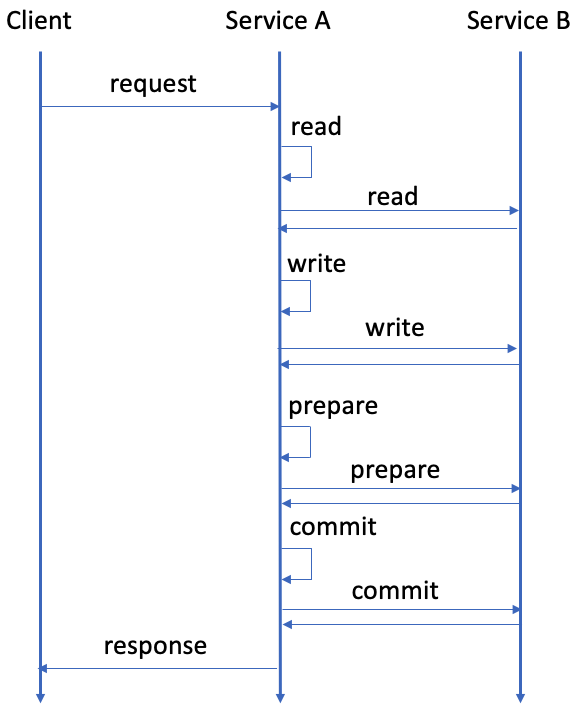
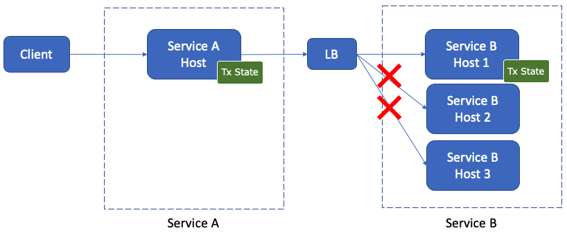

---
tags:
  - Community
  - Enterprise Standard
  - Enterprise Premium
displayed_sidebar: docsJapanese
---

# 2 フェーズコミットインターフェースを使用したトランザクション

import TranslationBanner from '/src/components/_translation-ja-jp.mdx';

<TranslationBanner />

ScalarDB は、2 フェーズコミットインターフェースを使用したトランザクションの実行をサポートしています。2 フェーズコミットインターフェースを使用すると、マイクロサービスアーキテクチャのように、複数のプロセスまたはアプリケーションにまたがるトランザクションを実行できます。

このページでは、2 フェーズコミットインターフェースを使用したトランザクションが ScalarDB でどのように機能するか、および ScalarDB でそれらを設定して実行する方法について説明します。

## ScalarDB での 2 フェーズコミットインターフェースを使用したトランザクションの動作

ScalarDB は通常、1 フェーズコミットインターフェースを使用して単一のトランザクションマネージャーインスタンスでトランザクションを実行します。1 フェーズコミットインターフェースを使用したトランザクションでは、トランザクションを開始し、CRUD 操作を実行し、同じトランザクションマネージャーインスタンスでトランザクションをコミットします。

ScalarDB では、複数のトランザクションマネージャーインスタンスにまたがる 2 フェーズコミットインターフェースを使用してトランザクションを実行できます。トランザクションマネージャーインスタンスは、同じプロセスまたはアプリケーションに存在しても、異なるプロセスまたはアプリケーションに存在してもかまいません。たとえば、複数のマイクロサービスにトランザクションマネージャーインスタンスがある場合は、複数のマイクロサービスにまたがるトランザクションを実行できます。

2 フェーズコミットインターフェースを使用したトランザクションでは、Coordinator と参加者という 2 つのロールが 1 つのトランザクションを共同で実行します。

Coordinator プロセスと参加者プロセスはすべて、異なるトランザクションマネージャーインスタンスを持っています。Coordinator プロセスが最初にトランザクションを開始または開始し、参加者プロセスがトランザクションに参加します。 CRUD 操作を実行した後、Coordinator プロセスと参加プロセスは 2 フェーズインターフェイスを使用してトランザクションをコミットします。

## 2 フェーズコミットインターフェースを使用してトランザクションを実行する方法

2 フェーズコミットインターフェイスを使用してトランザクションを実行するには、トランザクションマネージャーインスタンスを取得する必要があります。その後、Coordinator プロセスはトランザクションを開始または起動でき、参加者はトランザクションを処理できます。

### `TwoPhaseCommitTransactionManager` インスタンスを取得する

2 フェーズコミットインターフェースを使用してトランザクションを実行するには、まず `TwoPhaseCommitTransactionManager` インスタンスを取得する必要があります。

`TwoPhaseCommitTransactionManager` インスタンスを取得するには、次のように `TransactionFactory` を使用できます。

```java
TransactionFactory factory = TransactionFactory.create("<CONFIGURATION_FILE_PATH>");
TwoPhaseCommitTransactionManager transactionManager = factory.getTwoPhaseCommitTransactionManager();
```

### トランザクションを開始する (Coordinator 用)

トランザクションを開始するプロセスまたはアプリケーションが Coordinator として機能するには、次の `begin` メソッドを使用する必要があります。

```java
// Begin a transaction.
TwoPhaseCommitTransaction tx = transactionManager.begin();
```

または、トランザクションを開始するプロセスまたはアプリケーションが Coordinator として機能するようにするには、次の `start` メソッドを使用する必要があります。

```java
// Start a transaction.
TwoPhaseCommitTransaction tx = transactionManager.start();
```

あるいは、次のようにトランザクション ID を指定して、トランザクションに `begin` メソッドを使用することもできます。

```java
// Begin a transaction by specifying a transaction ID.
TwoPhaseCommitTransaction tx = transactionManager.begin("<TRANSACTION_ID>");
```

または、次のようにトランザクション ID を指定して、トランザクションに `start` メソッドを使用することもできます。

```java
// Start a transaction by specifying a transaction ID.
TwoPhaseCommitTransaction tx = transactionManager.start("<TRANSACTION_ID>");
```

### トランザクションに参加する (参加者向け)

参加者は、次のように、Coordinator が開始または開始したトランザクションに関連付けられたトランザクション ID を指定して、トランザクションに参加できます。

```java
TwoPhaseCommitTransaction tx = transactionManager.join("<TRANSACTION_ID>");
```

:::note

`getId()` を使用してトランザクション ID を取得するには、次のように指定します。

```java
tx.getId();
```

:::

### トランザクションの CRUD 操作

`TwoPhaseCommitTransacton` の CRUD 操作は、`DistributedTransaction` の操作と同じです。詳細については、[CRUD 操作](api-guide.mdx#crud-operations) を参照してください。

以下は、2 フェーズコミットインターフェイスを使用したトランザクションの CRUD 操作のサンプルコードです。

```java
TwoPhaseCommitTransaction tx = ...

// Retrieve the current balances by ID.
Get fromGet =
    Get.newBuilder()
        .namespace(NAMESPACE)
        .table(TABLE)
        .partitionKey(new Key(ID, fromId))
        .build();

Get toGet =
    Get.newBuilder()
        .namespace(NAMESPACE)
        .table(TABLE)
        .partitionKey(new Key(ID, toId))
        .build();

Optional<Result> fromResult = tx.get(fromGet);
Optional<Result> toResult = tx.get(toGet);

// Calculate the balances (assuming that both accounts exist).
int newFromBalance = fromResult.get().getInt(BALANCE) - amount;
int newToBalance = toResult.get().getInt(BALANCE) + amount;

// Update the balances.
Put fromPut =
    Put.newBuilder()
        .namespace(NAMESPACE)
        .table(TABLE)
        .partitionKey(new Key(ID, fromId))
        .intValue(BALANCE, newFromBalance)
        .build();

Put toPut =
    Put.newBuilder()
        .namespace(NAMESPACE)
        .table(TABLE)
        .partitionKey(new Key(ID, toId))
        .intValue(BALANCE, newToBalance)
        .build();

tx.put(fromPut);
tx.put(toPut);
```

### トランザクションを準備、コミット、またはロールバックする

CRUD 操作が完了したら、トランザクションをコミットする必要があります。標準の 2 フェーズコミットプロトコルと同様に、準備とコミットの 2 つのフェーズがあります。

すべての Coordinator プロセスと参加者プロセスでは、次のようにトランザクションを準備してからコミットする必要があります。

```java
TwoPhaseCommitTransaction tx = ...

try {
  // Execute CRUD operations in the Coordinator and participant processes.
  ...

  // Prepare phase: Prepare the transaction in all the Coordinator and participant processes.
  tx.prepare();
  ...

  // Commit phase: Commit the transaction in all the Coordinator and participant processes.
  tx.commit();
  ...
} catch (TransactionException e) {
  // If an error happens, you will need to roll back the transaction in all the Coordinator and participant processes.
  tx.rollback();
  ...
}
```

`prepare()` の場合、Coordinator または参加者プロセスのいずれかがトランザクションの準備に失敗した場合、すべての Coordinator および参加者プロセスで `rollback()` (または `abort()`) を呼び出す必要があります。

`commit()` の場合、Coordinator または参加者プロセスのいずれかがトランザクションを正常にコミットした場合、トランザクションはコミットされたと見なすことができます。トランザクションがコミットされたら、他の Coordinator および参加者プロセスで発生したエラーは無視できます。すべての Coordinator および参加者プロセスがトランザクションのコミットに失敗した場合、すべての Coordinator および参加者プロセスで `rollback()` (または `abort()`) を呼び出す必要があります。

パフォーマンスを向上させるには、Coordinator および参加者プロセスでそれぞれ `prepare()`、`commit()`、および `rollback()` を並行して呼び出すことができます。

#### トランザクションを検証する

同時実行制御プロトコルに応じて、以下に示すように、`prepare()` の後、`commit()` の前に、すべての Coordinator および参加者プロセスで `validate()` を呼び出す必要があります。

```java
// Prepare phase 1: Prepare the transaction in all the Coordinator and participant processes.
tx.prepare();
...

// Prepare phase 2: Validate the transaction in all the Coordinator and participant processes.
tx.validate();
...

// Commit phase: Commit the transaction in all the Coordinator and participant processes.
tx.commit();
...
```

`prepare()` と同様に、Coordinator または参加者プロセスのいずれかがトランザクションの検証に失敗した場合は、すべての Coordinator および参加者プロセスで `rollback()` (または `abort()`) を呼び出す必要があります。さらに、パフォーマンスを向上させるために、Coordinator および参加者プロセスで `validate()` を並行して呼び出すこともできます。

:::note

`scalar.db.consensus_commit.serializable_strategy` の値として `EXTRA_READ` を設定し、`scalar.db.consensus_commit.isolation_level` の値として `SERIALIZABLE` を設定して [Consensus Commit](configurations.mdx#consensus-commit-を使用してトランザクションを実行する) トランザクションマネージャーを使用する場合は、`validate()` を呼び出す必要があります。ただし、Consensus Commit を使用していない場合は、`validate()` を指定しても効果はありません。

:::

### 複数のトランザクションマネージャーインスタンスを使用してトランザクションを実行する

上記の API を使用すると、次のように複数のトランザクションマネージャーインスタンスを使用してトランザクションを実行できます。

```java
TransactionFactory factory1 =
    TransactionFactory.create("<PATH_TO_CONFIGURATION_FILE_FOR_TRANSACTION_MANAGER_1>");
TwoPhaseCommitTransactionManager transactionManager1 =
    factory1.getTwoPhaseCommitTransactionManager();

TransactionFactory factory2 =
    TransactionFactory.create("<PATH_TO_CONFIGURATION_FILE_FOR_TRANSACTION_MANAGER_2>");
TwoPhaseCommitTransactionManager transactionManager2 =
    factory2.getTwoPhaseCommitTransactionManager();

TwoPhaseCommitTransaction transaction1 = null;
TwoPhaseCommitTransaction transaction2 = null;
try {
  // Begin a transaction.
  transaction1 = transactionManager1.begin();

  // Join the transaction begun by `transactionManager1` by getting the transaction ID.
  transaction2 = transactionManager2.join(transaction1.getId());

  // Execute CRUD operations in the transaction.
  Optional<Result> result = transaction1.get(...);
  List<Result> results = transaction2.scan(...);
  transaction1.put(...);
  transaction2.delete(...);

  // Prepare the transaction.
  transaction1.prepare();
  transaction2.prepare();

  // Validate the transaction.
  transaction1.validate();
  transaction2.validate();

  // Commit the transaction. If any of the transactions successfully commit, 
  // you can regard the transaction as committed.
  AtomicReference<TransactionException> exception = new AtomicReference<>();
  boolean anyMatch =
      Stream.of(transaction1, transaction2)
          .anyMatch(
              t -> {
                try {
                  t.commit();
                  return true;
                } catch (TransactionException e) {
                  exception.set(e);
                  return false;
                }
              });

  // If all the transactions fail to commit, throw the exception and roll back the transaction.
  if (!anyMatch) {
    throw exception.get();
  }
} catch (TransactionException e) {
  // Roll back the transaction.
  if (transaction1 != null) {
    try {
      transaction1.rollback();
    } catch (RollbackException e1) {
      // Handle the exception.
    }
  }
  if (transaction2 != null) {
    try {
    transaction2.rollback();
    } catch (RollbackException e1) {
      // Handle the exception.
    }
  }
}
```

簡潔にするために、上記のサンプルコードでは、API がスローする可能性のある例外は処理していません。例外の処理の詳細については、[例外の処理方法](#how-to-handle-exceptions) を参照してください。

前述のように、`commit()` の場合、Coordinator または参加者プロセスのいずれかがトランザクションのコミットに成功した場合、トランザクションはコミットされたと見なすことができます。また、パフォーマンスを向上させるために、`prepare()`、`validate()`、および `commit()` をそれぞれ並列で実行することもできます。

### トランザクションを再開または再結合する

2 フェーズコミットインターフェースでトランザクションを使用するプロセスまたはアプリケーションでは、通常、複数の要求と応答の交換が行われるため、さまざまなエンドポイントまたは API 間でトランザクションを実行する必要がある場合があります。このようなシナリオでは、`resume()` または `join()` を使用して、以前に参加したトランザクションのトランザクションオブジェクト (`TwoPhaseCommitTransaction` のインスタンス) を取得できます。

以下は、`resume()` と `join()` がどのように動作するかを示しています。

```java
// Join (or begin) the transaction.
TwoPhaseCommitTransaction tx = transactionManager.join("<TRANSACTION_ID>");

...

// Resume the transaction by using the transaction ID.
TwoPhaseCommitTransaction tx1 = transactionManager.resume("<TRANSACTION_ID>");

// Or you can re-join the transaction by using the transaction ID.
TwoPhaseCommitTransaction tx2 = transactionManager.join("<TRANSACTION_ID>");
```

:::note

`getId()` を使用してトランザクション ID を取得するには、次のように指定します。

```java
tx.getId();
```

また、`join()` を使用してトランザクションに再参加する場合、以前にトランザクションに参加したことがない場合は、新しいトランザクションオブジェクトが返されます。一方、`resume()` を使用してトランザクションを再開する場合、以前にトランザクションに参加したことがない場合は、`TransactionNotFoundException` がスローされます。

:::

以下は、複数のエンドポイントを持つ 2 つのサービスの例です。

```java
interface ServiceA {
  void facadeEndpoint() throws Exception;
}

interface ServiceB {
  void endpoint1(String txId) throws Exception;

  void endpoint2(String txId) throws Exception;

  void prepare(String txId) throws Exception;

  void commit(String txId) throws Exception;

  void rollback(String txId) throws Exception;
}
```

以下は、2 つのサービス (`ServiceA` と `ServiceB`) にまたがるトランザクションを開始する `ServiceA.facadeEndpoint()` を呼び出すクライアントの例です。

```java
public class ServiceAImpl implements ServiceA {

  private TwoPhaseCommitTransactionManager transactionManager = ...;
  private ServiceB serviceB = ...;

  ...

  @Override
  public void facadeEndpoint() throws Exception {
    TwoPhaseCommitTransaction tx = transactionManager.begin();

    try {
      ...

      // Call `ServiceB` `endpoint1`.
      serviceB.endpoint1(tx.getId());

      ...

      // Call `ServiceB` `endpoint2`.
      serviceB.endpoint2(tx.getId());

      ...

      // Prepare.
      tx.prepare();
      serviceB.prepare(tx.getId());

      // Commit.
      tx.commit();
      serviceB.commit(tx.getId());
    } catch (Exception e) {
      // Roll back.
      tx.rollback();
      serviceB.rollback(tx.getId());
    }
  }
}
```

上記のように、`ServiceA` のファサードエンドポイントは、`ServiceB` の複数のエンドポイント (`endpoint1()`、`endpoint2()`、`prepare()`、`commit()`、および `rollback()`) を呼び出します。また、2 フェーズコミットインターフェースを持つトランザクションでは、エンドポイント間で同じトランザクションオブジェクトを使用する必要があります。

この状況では、トランザクションを再開できます。`ServiceB` の実装は次のとおりです。

```java
public class ServiceBImpl implements ServiceB {

  private TwoPhaseCommitTransactionManager transactionManager = ...;

  ...

  @Override
  public void endpoint1(String txId) throws Exception {
    // Join the transaction.
    TwoPhaseCommitTransaction tx = transactionManager.join(txId);

    ...
  }

  @Override
  public void endpoint2(String txId) throws Exception {
    // Resume the transaction that you joined in `endpoint1()`.
    TwoPhaseCommitTransaction tx = transactionManager.resume(txId);

    // Or re-join the transaction that you joined in `endpoint1()`.
    // TwoPhaseCommitTransaction tx = transactionManager.join(txId);

    ...
  }

  @Override
  public void prepare(String txId) throws Exception {
    // Resume the transaction.
    TwoPhaseCommitTransaction tx = transactionManager.resume(txId);

    // Or re-join the transaction.
    // TwoPhaseCommitTransaction tx = transactionManager.join(txId);

    ...

    // Prepare.
    tx.prepare();
  }

  @Override
  public void commit(String txId) throws Exception {
    // Resume the transaction.
    TwoPhaseCommitTransaction tx = transactionManager.resume(txId);

    // Or re-join the transaction.
    // TwoPhaseCommitTransaction tx = transactionManager.join(txId);

    ...

    // Commit.
    tx.commit();
  }

  @Override
  public void rollback(String txId) throws Exception {
    // Resume the transaction.
    TwoPhaseCommitTransaction tx = transactionManager.resume(txId);

    // Or re-join the transaction.
    // TwoPhaseCommitTransaction tx = transactionManager.join(txId);

    ...

    // Roll back.
    tx.rollback();
  }
}
```

上記のように、トランザクションを再開または再結合することで、`ServiceB` 内の複数のエンドポイント間で同じトランザクションオブジェクトを共有できます。

## 例外の処理方法

複数のトランザクションマネージャーインスタンスを使用してトランザクションを実行する場合は、例外を適切に処理する必要もあります。

:::warning

例外を適切に処理しないと、異常やデータの不整合が発生する可能性があります。

:::

たとえば、[複数のトランザクションマネージャーインスタンスを使用してトランザクションを実行する](#複数のトランザクションマネージャーインスタンスを使用してトランザクションを実行する)のサンプルコードでは、説明を簡単にするために、1 つのプロセスで複数のトランザクションマネージャー (`transactionManager1` と `transactionManager2`) が使用されています。ただし、このサンプルコードには例外を処理する方法が含まれていません。

次のサンプルコードは、2 フェーズコミットインターフェイスを使用してトランザクションで例外を処理する方法を示しています。

```java
public class Sample {
  public static void main(String[] args) throws Exception {
    TransactionFactory factory1 =
        TransactionFactory.create("<PATH_TO_CONFIGURATION_FILE_FOR_TRANSACTION_MANAGER_1>");
    TwoPhaseCommitTransactionManager transactionManager1 =
        factory1.getTwoPhaseCommitTransactionManager();

    TransactionFactory factory2 =
        TransactionFactory.create("<PATH_TO_CONFIGURATION_FILE_FOR_TRANSACTION_MANAGER_2>");
    TwoPhaseCommitTransactionManager transactionManager2 =
        factory2.getTwoPhaseCommitTransactionManager();

    int retryCount = 0;
    TransactionException lastException = null;

    while (true) {
      if (retryCount++ > 0) {
        // Retry the transaction three times maximum in this sample code.
        if (retryCount >= 3) {
          // Throw the last exception if the number of retries exceeds the maximum.
          throw lastException;
        }

        // Sleep 100 milliseconds before retrying the transaction in this sample code.
        TimeUnit.MILLISECONDS.sleep(100);
      }

      TwoPhaseCommitTransaction transaction1 = null;
      TwoPhaseCommitTransaction transaction2 = null;
      try {
        // Begin a transaction.
        transaction1 = transactionManager1.begin();

        // Join the transaction that `transactionManager1` begun by using the transaction ID.
        transaction2 = transactionManager2.join(transaction1.getId());

        // Execute CRUD operations in the transaction.
        Optional<Result> result = transaction1.get(...);
        List<Result> results = transaction2.scan(...);
        transaction1.put(...);
        transaction2.delete(...);

        // Prepare the transaction.
        prepare(transaction1, transaction2);

        // Validate the transaction.
        validate(transaction1, transaction2);

        // Commit the transaction.
        commit(transaction1, transaction2);
      } catch (UnsatisfiedConditionException e) {
        // You need to handle `UnsatisfiedConditionException` only if a mutation operation specifies
        // a condition. This exception indicates the condition for the mutation operation is not met.

        rollback(transaction1, transaction2);

        // You can handle the exception here, according to your application requirements.

        return;
      } catch (UnknownTransactionStatusException e) {
        // If you catch `UnknownTransactionStatusException` when committing the transaction, 
        // it indicates that the status of the transaction, whether it was successful or not, is unknown.
        // In such a case, you need to check if the transaction is committed successfully or not and 
        // retry the transaction if it failed. How to identify a transaction status is delegated to users.
        return;
      } catch (TransactionException e) {
        // For other exceptions, you can try retrying the transaction.

        // For `CrudConflictException`, `PreparationConflictException`, `ValidationConflictException`, 
        // `CommitConflictException`, and `TransactionNotFoundException`, you can basically retry the 
        // transaction. However, for the other exceptions, the transaction will still fail if the cause of 
        // the exception is non-transient. In such a case, you will exhaust the number of retries and 
        // throw the last exception.

        rollback(transaction1, transaction2);

        lastException = e;
      }
    }
  }

  private static void prepare(TwoPhaseCommitTransaction... transactions)
      throws TransactionException {
    // You can execute `prepare()` in parallel.
    List<TransactionException> exceptions =
        Stream.of(transactions)
            .parallel()
            .map(
                t -> {
                  try {
                    t.prepare();
                    return null;
                  } catch (TransactionException e) {
                    return e;
                  }
                })
            .filter(Objects::nonNull)
            .collect(Collectors.toList());

    // If any of the transactions failed to prepare, throw the exception.
    if (!exceptions.isEmpty()) {
      throw exceptions.get(0);
    }
  }

  private static void validate(TwoPhaseCommitTransaction... transactions)
      throws TransactionException {
    // You can execute `validate()` in parallel.
    List<TransactionException> exceptions =
        Stream.of(transactions)
            .parallel()
            .map(
                t -> {
                  try {
                    t.validate();
                    return null;
                  } catch (TransactionException e) {
                    return e;
                  }
                })
            .filter(Objects::nonNull)
            .collect(Collectors.toList());

    // If any of the transactions failed to validate, throw the exception.
    if (!exceptions.isEmpty()) {
      throw exceptions.get(0);
    }
  }

  private static void commit(TwoPhaseCommitTransaction... transactions)
      throws TransactionException {
    // You can execute `commit()` in parallel.
    List<TransactionException> exceptions =
        Stream.of(transactions)
            .parallel()
            .map(
                t -> {
                  try {
                    t.commit();
                    return null;
                  } catch (TransactionException e) {
                    return e;
                  }
                })
            .filter(Objects::nonNull)
            .collect(Collectors.toList());

    // If any of the transactions successfully committed, you can regard the transaction as committed.
    if (exceptions.size() < transactions.length) {
      if (!exceptions.isEmpty()) {
        // You can log the exceptions here if you want.
      }

      return; // Commit was successful.
    }

    //
    // If all the transactions failed to commit:
    //

    // If any of the transactions failed to commit due to `UnknownTransactionStatusException`, throw
    // it because you should not retry the transaction in such a case.
    Optional<TransactionException> unknownTransactionStatusException =
        exceptions.stream().filter(e -> e instanceof UnknownTransactionStatusException).findFirst();
    if (unknownTransactionStatusException.isPresent()) {
      throw unknownTransactionStatusException.get();
    }

    // Otherwise, throw the first exception.
    throw exceptions.get(0);
  }

  private static void rollback(TwoPhaseCommitTransaction... transactions) {
    Stream.of(transactions)
        .parallel()
        .filter(Objects::nonNull)
        .forEach(
            t -> {
              try {
                t.rollback();
              } catch (RollbackException e) {
                // Rolling back the transaction failed. The transaction should eventually recover,
                // so you don't need to do anything further. You can simply log the occurrence here.
              }
            });
  }
}
```

### `TransactionException` および `TransactionNotFoundException`

`begin()` API は `TransactionException` または `TransactionNotFoundException` をスローする可能性があります:

- `TransactionException` をキャッチした場合、この例外は、一時的または非一時的障害が原因でトランザクションを開始できなかったことを示します。トランザクションを再試行することはできますが、非一時的障害が原因でトランザクションを開始できない可能性があります。
- `TransactionNotFoundException` をキャッチした場合、この例外は、一時的障害が原因でトランザクションを開始できなかったことを示します。この場合、トランザクションを再試行できます。

`join()` API も `TransactionNotFoundException` をスローする可能性があります。この例外は、`begin()` API の例外を処理するのと同じ方法で処理できます。

### `CrudException` および `CrudConflictException`

CRUD 操作の API (`get()`、`scan()`、`put()`、`delete()`、および `mutate()`) は、`CrudException` または `CrudConflictException` をスローする可能性があります:

- `CrudException` をキャッチした場合、この例外は、トランザクション CRUD 操作が一時的または非一時的障害のために失敗したことを示します。トランザクションを最初から再試行することはできますが、原因が非一時的である場合はトランザクションは失敗します。
- `CrudConflictException` をキャッチした場合、この例外は、トランザクション CRUD 操作が一時的な障害 (競合エラーなど) のために失敗したことを示します。この場合、トランザクションを最初から再試行できます。

### `UnsatisfiedConditionException`

ミューテーション操作の API (`put()`、`delete()`、および `mutate()`) も `UnsatisfiedConditionException` をスローする可能性があります。

`UnsatisfiedConditionException` をキャッチした場合、この例外はミューテーション操作の条件が満たされていないことを示します。この例外は、アプリケーションの要件に応じて処理できます。

### `PreparationException` および `PreparationConflictException`

`prepare()` API は、`PreparationException` または `PreparationConflictException` をスローする可能性があります:

- `PreparationException` をキャッチした場合、この例外は、一時的または非一時的障害が原因でトランザクションの準備が失敗したことを示します。トランザクションを最初から再試行することはできますが、原因が非一時的である場合はトランザクションは失敗します。
- `PreparationConflictException` をキャッチした場合、この例外は、一時的な障害 (競合エラーなど) が原因でトランザクションの準備が失敗したことを示します。この場合、トランザクションを最初から再試行できます。

### `ValidationException` および `ValidationConflictException`

`validate()` API は `ValidationException` または `ValidationConflictException` をスローする可能性があります:

- `ValidationException` をキャッチした場合、この例外は、一時的または非一時的障害が原因でトランザクションの検証が失敗したことを示します。トランザクションを最初から再試行することはできますが、原因が非一時的である場合はトランザクションは失敗します。
- `ValidationConflictException` をキャッチした場合、この例外は、一時的な障害 (競合エラーなど) が原因でトランザクションの検証が失敗したことを示します。この場合、トランザクションを最初から再試行できます。

### `CommitException`、`CommitConflictException`、および `UnknownTransactionStatusException`

`commit()` API は、`CommitException`、`CommitConflictException`、または `UnknownTransactionStatusException` をスローする可能性があります:

- `CommitException` をキャッチした場合、この例外は、一時的または非一時的障害が原因でトランザクションのコミットが失敗したことを示します。トランザクションを最初から再試行することはできますが、原因が非一時的である場合はトランザクションは失敗します。
- `CommitConflictException` をキャッチした場合、この例外は、一時的な障害 (競合エラーなど) が原因でトランザクションのコミットが失敗したことを示します。この場合、トランザクションを最初から再試行できます。
- `UnknownTransactionStatusException` をキャッチした場合、この例外は、トランザクションのステータス (成功したかどうか) が不明であることを示します。この場合、トランザクションが正常にコミットされたかどうかを確認し、失敗した場合はトランザクションを再試行する必要があります。

トランザクションステータスを識別する方法は、ユーザーに委任されています。トランザクションステータステーブルを作成し、他のアプリケーションデータを使用してトランザクション的に更新して、ステータステーブルからトランザクションのステータスを取得できるようにすることができます。

### 一部の例外に関する注意

サンプルコードには示されていませんが、`resume()` API は `TransactionNotFoundException` をスローする可能性もあります。この例外は、指定された ID に関連付けられたトランザクションが見つからなかったか、トランザクションの有効期限が切れた可能性があることを示します。いずれの場合も、この例外の原因は基本的に一時的なものであるため、トランザクションを最初から再試行できます。

サンプルコードでは、`UnknownTransactionStatusException` の場合、トランザクションは再試行されません。これは、アプリケーションがトランザクションが成功したかどうかをチェックして、重複操作の可能性を回避する必要があるためです。また、`UnsatisfiedConditionException` の場合、この例外の処理方法はアプリケーションの要件によって異なるため、トランザクションは再試行されません。その他の例外の場合、例外の原因が一時的または非一時的であるため、トランザクションは再試行されます。例外の原因が一時的である場合、再試行するとトランザクションが成功する可能性があります。ただし、例外の原因が非一時的である場合、再試行してもトランザクションは失敗します。このような場合、再試行回数が上限に達します。

:::note

トランザクション ID を指定してトランザクションを開始する場合、トランザクションを再試行するときには別の ID を使用する必要があります。

また、サンプルコードでは、トランザクションは最大 3 回再試行され、再試行前に 100 ミリ秒間スリープします。ただし、アプリケーション要件に応じて、指数バックオフなどの再試行ポリシーを選択できます。

:::

## 2 フェーズコミットインターフェースを使用したトランザクションでのリクエストルーティング

2 フェーズコミットインターフェースを使用したトランザクションを使用するサービスは通常、次の図に示すように、複数のリクエストと応答を交換することによってトランザクションを実行します。



さらに、各サービスには通常、スケーラビリティと可用性のために複数のサーバー (またはホスト) があり、サーバー側 (プロキシ) またはクライアント側の負荷分散を使用してサーバーに要求を分散します。このような場合、2 フェーズコミットインターフェイスを使用したトランザクションのトランザクション処理はステートフルであるため、次の図に示すように、トランザクション内の要求は同じサーバーにルーティングする必要があり、負荷を分散するために異なるトランザクションを分散する必要があります。



サービス間のプロトコルに応じて、2 フェーズコミットインターフェースを使用してトランザクションの負荷分散を実現する方法はいくつかあります。この方法には、gRPC、HTTP/1.1、および [ScalarDB Cluster](scalardb-cluster/index.mdx) の使用が含まれます。これは、ScalarDB Enterprise エディションでのみ使用可能なコンポーネントです。

### gRPC

クライアント側のロードバランサーを使用すると、同じ gRPC 接続を使用してトランザクションでリクエストを送信できるため、リクエストが同じサーバーに送信されることが保証されます。

サーバー側 (プロキシ) ロードバランサーを使用する場合、L3/L4 (トランスポートレベル) ロードバランサーと L7 (アプリケーションレベル) ロードバランサーではソリューションが異なります。

- L3/L4 ロードバランサーを使用する場合、クライアント側ロードバランサーを使用する場合と同様に、同じ gRPC 接続を使用してトランザクションでリクエストを送信できます。この場合、同じ gRPC 接続のリクエストは常に同じサーバーに送信されます。
- L7 ロードバランサーを使用する場合、同じ gRPC 接続のリクエストが必ずしも同じサーバーに送信されるわけではないため、Cookie または同様の方法を使用してリクエストを正しいサーバーにルーティングする必要があります。
  - たとえば、[Envoy](https://www.envoyproxy.io/) を使用する場合、gRPC のセッションアフィニティ (スティッキーセッション) を使用できます。あるいは、L7 ロードバランサが同じストリーム内のリクエストを同じサーバーに分散するため、[bidirectional streaming RPC in gRPC](https://grpc.io/docs/what-is-grpc/core-concepts/#bidirectional-streaming-rpc) を使用することもできます。

gRPC でのロードバランシングの詳細については、[gRPC Load Balancing](https://grpc.io/blog/grpc-load-balancing/) を参照してください。

### HTTP/1.1

通常、HTTP/1.1 ではサーバー側 (プロキシ) ロードバランサを使用します。

- L3/L4 ロードバランサを使用する場合、同じ HTTP 接続を使用してトランザクションでリクエストを送信できるため、リクエストが同じサーバーに送信されることが保証されます。
- L7 ロードバランサを使用する場合、同じ HTTP 接続内のリクエストが必ずしも同じサーバーに送信されるわけではないため、Cookie または同様の方法を使用してリクエストを正しいサーバーにルーティングする必要があります。その場合は、セッションアフィニティ (スティッキーセッション) を使用できます。

### ScalarDB Cluster

ScalarDB Cluster は、リクエストをクラスター内の適切なクラスターノードに転送できるルーティングメカニズムを提供することで、リクエストルーティングに対応します。ScalarDB Cluster の詳細については、[ScalarDB Cluster](scalardb-cluster/index.mdx) を参照してください。

## ハンズオンチュートリアル

2 フェーズコミットインターフェースを使用したトランザクションのユースケースの 1 つに、マイクロサービストランザクションがあります。ハンズオンチュートリアルについては、[マイクロサービストランザクションをサポートするサンプルアプリケーションを作成する](scalardb-samples/microservice-transaction-sample/README.mdx)を参照してください。
