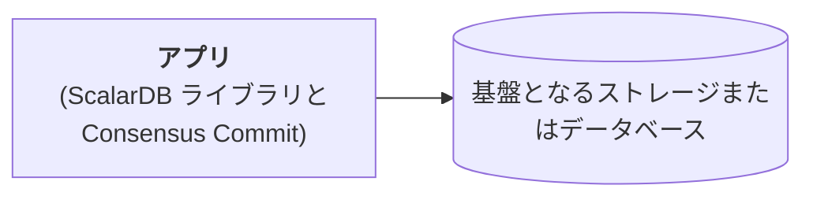
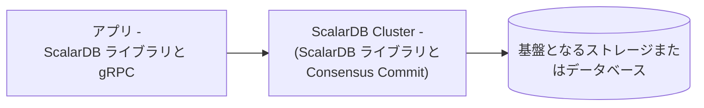

---
tags:
  - Community
  - Enterprise Standard
  - Enterprise Premium
displayed_sidebar: docsJapanese
---

# ScalarDB の設定

import Tabs from '@theme/Tabs';
import TabItem from '@theme/TabItem';
import TranslationBanner from '/src/components/_translation-ja-jp.mdx';

<TranslationBanner />

このページでは、ScalarDB で使用可能な設定について説明します。

## ScalarDB クライアントの設定

このセクションでは、ScalarDB クライアントの設定について説明します。ScalarDB は、Consensus Commit を使用してトランザクションを実行する方法、非トランザクションストレージ操作を実行する方法、および ScalarDB Cluster を介してトランザクションを実行する方法を提供します。

### Consensus Commit を使用してトランザクションを実行する

ScalarDB は、Consensus Commit と呼ばれる独自のトランザクションプロトコルを提供します。これは、ScalarDB のデフォルトのトランザクションマネージャータイプです。Consensus Commit トランザクションマネージャーを使用するには、ScalarDB プロパティファイルに次の内容を追加します。

```properties
scalar.db.transaction_manager=consensus-commit
```

:::note

`scalar.db.transaction_manager` プロパティを指定しない場合は、`consensus-commit` がデフォルト値になります。

:::

#### 基本設定

Consensus Commit トランザクションマネージャーでは、次の基本設定が利用可能です。

| 名前                                                   | 説明                                                                                                                                                                                                                                                                                                                                            | デフォルト     |
|-------------------------------------------------------|------------------------------------------------------------------------------------------------------------------------------------------------------------------------------------------------------------------------------------------------------------------------------------------------------------------------------------------------|---------------|
| `scalar.db.transaction_manager`                       | `consensus-commit` を指定する必要があります。                                                                                                                                                                                                                                                                                                       | -             |
| `scalar.db.consensus_commit.isolation_level`          | Consensus Commit に使用される分離レベル。`SNAPSHOT` または `SERIALIZABLE` のいずれかを指定できます。                                                                                                                                                                                                                                                     | `SNAPSHOT`    |
| `scalar.db.consensus_commit.serializable_strategy`    | Consensus Commit に使用されるシリアル化可能な戦略。`EXTRA_READ` または `EXTRA_WRITE` のいずれかを指定できます。`scalar.db.consensus_commit.isolation_level` プロパティで `SNAPSHOT` が指定されている場合、この設定は無視されます。                                                                                                                                   | `EXTRA_READ`  |
| `scalar.db.consensus_commit.coordinator.namespace`    | Coordinator テーブルの名前空間名。                                                                                                                                                                                                                                                                                                                 | `coordinator` |
| `scalar.db.consensus_commit.include_metadata.enabled` | `true` に設定すると、`Get` および `Scan` 操作の結果にトランザクションメタデータが含まれます。特定のテーブルのトランザクションメタデータ列の詳細を表示するには、`DistributedTransactionAdmin.getTableMetadata()` メソッドを使用します。このメソッドは、トランザクションメタデータ列が追加されたテーブルメタデータを返します。この設定を使用すると、トランザクション関連の問題を調査するのに役立ちます。 | `false`       |

#### パフォーマンス関連の設定

Consensus Commit トランザクションマネージャーでは、次のパフォーマンス関連の設定が利用できます。

| 名前                                                                                    | 説明                                                                                                                                                                                                                    | デフォルト                                                 |
|----------------------------------------------------------------------------------------|-------------------------------------------------------------------------------------------------------------------------------------------------------------------------------------------------------------------------|----------------------------------------------------------|
| `scalar.db.consensus_commit.parallel_executor_count`                                   | 並列実行のためのエグゼキュータ（スレッド）の数。                                                                                                                                                                                | `128`                                                    |
| `scalar.db.consensus_commit.parallel_preparation.enabled`                              | 準備フェーズが並行して実行されるかどうか。                                                                                                                                                                                     | `true`                                                   |
| `scalar.db.consensus_commit.parallel_validation.enabled`                               | 検証フェーズ (`EXTRA_READ` 内) が並列で実行されるかどうか。                                                                                                                                                                    | `scalar.db.consensus_commit.parallel_commit.enabled` の値 |
| `scalar.db.consensus_commit.parallel_commit.enabled`                                   | コミットフェーズが並列で実行されるかどうか。                                                                                                                                                                                    | `true`                                                   |
| `scalar.db.consensus_commit.parallel_rollback.enabled`                                 | ロールバックフェーズが並列で実行されるかどうか。                                                                                                                                                                                | `scalar.db.consensus_commit.parallel_commit.enabled` の値 |
| `scalar.db.consensus_commit.async_commit.enabled`                                      | コミットフェーズが非同期で実行されるかどうか。                                                                                                                                                                                  | `false`                                                  |
| `scalar.db.consensus_commit.async_rollback.enabled`                                    | ロールバックフェーズが非同期に実行されるかどうか。                                                                                                                                                                               | `scalar.db.consensus_commit.async_commit.enabled` の値   |
| `scalar.db.consensus_commit.parallel_implicit_pre_read.enabled`                        | 暗黙的な事前読み取りが並列で実行されるかどうか。                                                                                                                                                                                | `true`                                                   |
| `scalar.db.consensus_commit.coordinator.group_commit.enabled`                          | トランザクション状態のコミットがバッチモードで実行されるかどうか。この機能は、2フェーズコミットインターフェイスでは使用できません。                                                                                                          | `false`                                                  |
| `scalar.db.consensus_commit.coordinator.group_commit.slot_capacity`                    | グループコミット機能のグループ内のスロットの最大数。値が大きいとグループコミットの効率は向上しますが、待ち時間が増加し、トランザクションの競合が発生する可能性も高くなります。[^1]                                                                    | `20`                                                     |
| `scalar.db.consensus_commit.coordinator.group_commit.group_size_fix_timeout_millis`    | グループ内のスロットのサイズを固定するためのタイムアウト。値が大きいとグループコミットの効率が向上しますが、待ち時間が増加し、トランザクションの競合が発生する可能性も高くなります。[^1]                                                               | `40`                                                     |
| `scalar.db.consensus_commit.coordinator.group_commit.delayed_slot_move_timeout_millis` | 遅延スロットをグループから別の分離グループに移動して、元のグループが遅延トランザクションの影響を受けないようにするためのタイムアウト。値が大きいとグループコミットの効率が向上しますが、待ち時間が増加し、トランザクションの競合が発生する可能性も高くなります。[^1] | `1200`                                                   |
| `scalar.db.consensus_commit.coordinator.group_commit.old_group_abort_timeout_millis`   | 進行中の古いグループをアボートするためのタイムアウト。値が小さいと、積極的なアボートによってリソースの消費量が減りますが、長時間実行されるトランザクションで不要なアボートが発生する可能性も高くなります。                                                           | `60000`                                                  |
| `scalar.db.consensus_commit.coordinator.group_commit.timeout_check_interval_millis`    | グループコミット関連のタイムアウトをチェックする間隔。                                                                                                                                                                           | `20`                                                     |
| `scalar.db.consensus_commit.coordinator.group_commit.metrics_monitor_log_enabled`      | グループコミットのメトリックが定期的にログに記録されるかどうか。                                                                                                                                                                   | `false`                                                  |

#### 基盤となるストレージまたはデータベースの設定

Consensus Commit にはストレージ抽象化レイヤーがあり、複数の基盤となるストレージをサポートしています。`scalar.db.storage` プロパティを使用してストレージ実装を指定できます。

データベースを選択して、各ストレージで使用可能な設定を確認します。

<Tabs groupId="databases" queryString>
  <TabItem value="JDBC_databases" label="JDBC データベース" default>
    JDBC データベースでは次の設定を使用できます。

    | 名前                                                       | 説明                                                                                                         | デフォルト        |
    |-----------------------------------------------------------|-------------------------------------------------------------------------------------------------------------|------------------|
    | `scalar.db.storage`                                       | `jdbc` を指定する必要があります。                                                                                | -                |
    | `scalar.db.contact_points`                                | JDBC 接続 URL。                                                                                              |                  |
    | `scalar.db.username`                                      | データベースにアクセスするためのユーザー名。                                                                        |                  |
    | `scalar.db.password`                                      | データベースにアクセスするためのパスワード。                                                                        |                  |
    | `scalar.db.jdbc.connection_pool.min_idle`                 | 接続プール内のアイドル接続の最小数。                                                                               | `20`             |
    | `scalar.db.jdbc.connection_pool.max_idle`                 | 接続プール内でアイドル状態のままにできる接続の最大数。                                                                | `50`             |
    | `scalar.db.jdbc.connection_pool.max_total`                | 接続プールで同時にアクティブにできるアイドル接続と借用接続の最大合計数。制限がない場合は負の値を使用します。                   | `100`            |
    | `scalar.db.jdbc.prepared_statements_pool.enabled`         | このプロパティを `true` に設定すると、準備済みステートメントプーリングが有効になります。                                  | `false`          |
    | `scalar.db.jdbc.prepared_statements_pool.max_open`        | ステートメントプールから同時に割り当てることができるオープンステートメントの最大数。制限がない場合は負の値を使用します。         | `-1`             |
    | `scalar.db.jdbc.isolation_level`                          | JDBC の分離レベル。`READ_UNCOMMITTED`、`READ_COMMITTED`、`REPEATABLE_READ`、または `SERIALIZABLE` を指定できます。 | 基盤データベース固有 |
    | `scalar.db.jdbc.table_metadata.connection_pool.min_idle`  | テーブルメタデータの接続プール内のアイドル接続の最小数。                                                              | `5`              |
    | `scalar.db.jdbc.table_metadata.connection_pool.max_idle`  | テーブルメタデータの接続プール内でアイドル状態のままにできる接続の最大数。                                               | `10`             |
    | `scalar.db.jdbc.table_metadata.connection_pool.max_total` | テーブルメタデータの接続プールで同時にアクティブにできるアイドル接続と借用接続の最大合計数。制限がない場合は負の値を使用します。   | `25`             |
    | `scalar.db.jdbc.admin.connection_pool.min_idle`           | 管理者の接続プール内のアイドル接続の最小数。                                                                        | `5`              |
    | `scalar.db.jdbc.admin.connection_pool.max_idle`           | 管理者の接続プール内でアイドル状態のままにできる接続の最大数。                                                         | `10`             |
    | `scalar.db.jdbc.admin.connection_pool.max_total`          | 管理者の接続プールで同時にアクティブにできるアイドル接続と借用接続の最大合計数。制限がない場合は負の値を使用します。            | `25`             |

:::note

#### SQLite3

SQLite3 を JDBC データベースとして使用している場合は、`scalar.db.contact_points` を次のように設定する必要があります。

```properties
scalar.db.contact_points=jdbc:sqlite:<SQLITE_DB_FILE_PATH>?busy_timeout=10000
```

他の JDBC データベースとは異なり、[SQLite3 doesn't fully support concurrent access](https://www.sqlite.org/lang_transaction.html)。[`SQLITE_BUSY`](https://www.sqlite.org/rescode.html#busy) によって内部的に頻繁に発生するエラーを回避するには、[`busy_timeout`](https://www.sqlite.org/c3ref/busy_timeout.html) パラメータを設定することをお勧めします。

#### YugabyteDB

YugabyteDB を JDBC データベースとして使用している場合は、次のように `scalar.db.contact_points` で複数のエンドポイントを指定できます。

```properties
scalar.db.contact_points=jdbc:yugabytedb://127.0.0.1:5433\\,127.0.0.2:5433\\,127.0.0.3:5433/?load-balance=true
```

複数のエンドポイントはエスケープされたコンマで区切る必要があります。

YugabyteDB のスマートドライバーと負荷分散の詳細については、[YugabyteDB smart drivers for YSQL](https://docs.yugabyte.com/preview/drivers-orms/smart-drivers/) を参照してください。

:::

  </TabItem>
  <TabItem value="DynamoDB" label="DynamoDB">
    DynamoDB では次の設定が利用可能です。

    | 名前                                  | 説明                                                                                                                                                                                     | デフォルト |
    |--------------------------------------|-----------------------------------------------------------------------------------------------------------------------------------------------------------------------------------------|----------|
    | `scalar.db.storage`                  | `dynamo` を指定する必要があります。                                                                                                                                                          | -        |
    | `scalar.db.contact_points`           | ScalarDB が通信する AWS リージョン (例: `us-east-1`)。                                                                                                                                      |          |
    | `scalar.db.username`                 | AWS とやり取りするユーザーを識別するために使用される AWS アクセスキー。                                                                                                                            |          |
    | `scalar.db.password`                 | AWS と対話するユーザーを認証するために使用される AWS シークレットアクセスキー。                                                                                                                      |          |
    | `scalar.db.dynamo.endpoint_override` | ScalarDB が通信する Amazon DynamoDB エンドポイント。これは主に、AWS サービスではなくローカルインスタンスでのテストに使用されます。                                                                        |          |
    | `scalar.db.dynamo.namespace.prefix`  | ユーザー名前空間とメタデータ名前空間名のプレフィックス。AWS では単一の AWS リージョン内で一意のテーブル名を持つ必要があるため、単一の AWS リージョン内で複数の ScalarDB 環境 (開発、本番など) を使用する場合に便利です。 |          |
  </TabItem>
  <TabItem value="Cosmos_DB_for_NoSQL" label="Cosmos DB for NoSQL">
    Cosmos DB for NoSQL では次の設定が利用可能です。

    | 名前                                  | 説明                                                                                                       | デフォルト  |
    |--------------------------------------|------------------------------------------------------------------------------------------------------------|-----------|
    | `scalar.db.storage`                  | `cosmos` を指定する必要があります。                                                                             | -        |
    | `scalar.db.contact_points`           | ScalarDB が通信する NoSQL エンドポイント用の Azure Cosmos DB。                                                  |           |
    | `scalar.db.password`                 | Azure Cosmos DB for NoSQL にアクセスするための認証を実行するために使用されるマスターキーまたは読み取り専用キーのいずれか。 |           |
    | `scalar.db.cosmos.consistency_level` | Cosmos DB 操作に使用される一貫性レベル。`STRONG` または `BOUNDED_STALENESS` を指定できます。                        | `STRONG`  |
  </TabItem>
  <TabItem value="Cassandra" label="Cassandra">
    Cassandra では次の設定が利用可能です。

    | 名前                        | 説明                                 | デフォルト |
    |----------------------------|--------------------------------------|----------|
    | `scalar.db.storage`        | `cassandra` を指定する必要があります。   | -        |
    | `scalar.db.contact_points` | カンマで区切られた連絡先。               |          |
    | `scalar.db.contact_port`   | すべての連絡先ポイントのポート番号。       |          |
    | `scalar.db.username`       | データベースにアクセスするためのユーザー名。 |          |
    | `scalar.db.password`       | データベースにアクセスするためのパスワード。 |          |
  </TabItem>
</Tabs>

##### マルチストレージのサポート

ScalarDB は、複数のストレージ実装の同時使用をサポートしています。`scalar.db.storage` プロパティの値として `multi-storage` を指定することで、複数のストレージを使用できます。

複数のストレージの使用の詳細については、[マルチストレージトランザクション](multi-storage-transactions.mdx)を参照してください。

##### クロスパーティションスキャン設定

以下で説明するようにクロスパーティションスキャンオプションを有効にすると、`Scan` 操作でパーティション全体のすべてのレコードを取得できます。さらに、`cross_partition_scan.filtering` と `cross_partition_scan.ordering` をそれぞれ有効にすることで、クロスパーティション `Scan` 操作で任意の条件と順序を指定できます。現在、順序付けオプション付きのクロスパーティションスキャンは、JDBC データベースでのみ使用できます。フィルタリングと順序付けを有効にするには、`scalar.db.cross_partition_scan.enabled` を `true` に設定する必要があります。

クロスパーティションスキャンの使用方法の詳細については、[`Scan` 操作](./api-guide.mdx#scan-操作)を参照してください。

:::warning

非 JDBC データベースの場合、`SERIALIZABLE` 分離レベルでクロスパーティションスキャンを有効にした場合でも、トランザクションは読み取りコミットスナップショット分離 (`SNAPSHOT`) で実行される可能性があります。これは、より低い分離レベルです。非 JDBC データベースを使用する場合は、トランザクションの一貫性が重要でない場合にのみ、クロスパーティションスキャンを使用してください。

:::

| 名前                                               | 説明                                               | デフォルト |
|----------------------------------------------------|---------------------------------------------------|----------|
| `scalar.db.cross_partition_scan.enabled`           | パーティション間スキャンを有効にします。                 | `false`  |
| `scalar.db.cross_partition_scan.filtering.enabled` | クロスパーティションスキャンでフィルタリングを有効にします。 | `false`  |
| `scalar.db.cross_partition_scan.ordering.enabled`  | パーティション間スキャンでの順序付けを有効にします。       | `false`  |

### 非トランザクションストレージ操作を実行する

非トランザクションストレージ操作を実行するには、`scalar.db.transaction_manager` プロパティを `single-crud-operation` に設定する必要があります。

```properties
scalar.db.transaction_manager=single-crud-operation
```

また、[基盤となるストレージまたはデータベースの設定](#基盤となるストレージまたはデータベースの設定)の説明に従って、基盤となるストレージまたはデータベースを設定する必要があります。

### ScalarDB Cluster を介してトランザクションを実行する

[ScalarDB Cluster](scalardb-cluster/index.mdx) は、ScalarDB に gRPC インターフェースを提供するコンポーネントです。

クライアント設定の詳細については、[ScalarDB Cluster クライアント設定](scalardb-cluster/developer-guide-for-scalardb-cluster-with-java-api.mdx#クライアント設定)を参照してください。

## その他の ScalarDB 設定

ScalarDB で使用できる追加の設定は次のとおりです。

| 名前                                                              | 説明                                                                                                                                                                      | デフォルト         |
|------------------------------------------------------------------|---------------------------------------------------------------------------------------------------------------------------------------------------------------------------|------------------|
| `scalar.db.metadata.cache_expiration_time_secs`                  | ScalarDB には、データベースへのリクエスト数を減らすためのメタデータキャッシュがあります。この設定では、キャッシュの有効期限を秒単位で指定します。`-1`を指定した場合は、キャッシュは期限切れになりません。 | `60`              |
| `scalar.db.active_transaction_management.expiration_time_millis` | ScalarDB は進行中のトランザクションを維持し、トランザクション ID を使用して再開できます。この設定は、このトランザクション管理機能の有効期限をミリ秒単位で指定します。                               | `-1` (有効期限なし) |
| `scalar.db.default_namespace_name`                               | 指定された名前空間名は、名前空間を指定していない操作によって使用されます。                                                                                                             |                  |
| `scalar.db.system_namespace_name`                                | 指定された名前空間名は ScalarDB によって内部的に使用されます。                                                                                                                     | `scalardb`       |

## プレースホルダーの使用

値にプレースホルダーを使用できます。プレースホルダーは環境変数 (`${env:<ENVIRONMENT_VARIABLE_NAME>}`) またはシステムプロパティ (`${sys:<SYSTEM_PROPERTY_NAME>}`) に置き換えられます。また、`${sys:<SYSTEM_PROPERTY_NAME>:-<DEFAULT_VALUE>}` のようにプレースホルダーにデフォルト値を指定することもできます。

以下は、プレースホルダーを使用する設定の例です。

```properties
scalar.db.username=${env:<SCALAR_DB_USERNAME>:-admin}
scalar.db.password=${env:<SCALAR_DB_PASSWORD>}
```

この設定例では、ScalarDB は環境変数からユーザー名とパスワードを読み取ります。環境変数 `SCALAR_DB_USERNAME` が存在しない場合、ScalarDB はデフォルト値 `admin` を使用します。

## 設定例

このセクションでは、いくつかの設定例を示します。

### 設定例 #1 - アプリとデータベース



この例の設定では、アプリ (Consensus Commit を備えた ScalarDB ライブラリ) が、基盤となるストレージまたはデータベース (この場合は Cassandra) に直接接続します。

:::warning

この設定は開発目的のみに存在し、実稼働環境には適していません。これは、ScalarDB のトランザクション的に一貫性のあるバックアップを取得するために、アプリが [Scalar Admin](https://github.com/scalar-labs/scalar-admin) インターフェースを実装する必要があり、追加の設定が必要になるためです。

:::

以下は、ScalarDB を介してアプリを基盤となるデータベースに接続するための設定の例です。

```properties
# Transaction manager implementation.
scalar.db.transaction_manager=consensus-commit

# Storage implementation.
scalar.db.storage=cassandra

# Comma-separated contact points.
scalar.db.contact_points=<CASSANDRA_HOST>

# Credential information to access the database.
scalar.db.username=<USERNAME>
scalar.db.password=<PASSWORD>
```

### 設定例 #2 - アプリ、ScalarDB Cluster、データベース



この例の設定では、アプリ (gRPC を使用した ScalarDB ライブラリ) は、ScalarDB Enterprise エディションでのみ使用可能なコンポーネントである ScalarDB Cluster を介して、基盤となるストレージまたはデータベース (この場合は Cassandra) に接続します。

:::note

ScalarDB Cluster は [Scalar Admin](https://github.com/scalar-labs/scalar-admin) インターフェイスを実装しており、これにより ScalarDB Cluster を一時停止することで ScalarDB のトランザクション的に一貫性のあるバックアップを取得できるため、この設定は実稼働環境での使用に適しています。

:::

以下は、ScalarDB Cluster を介してアプリを基盤となるデータベースに接続するための設定の例です。

```properties
# Transaction manager implementation.
scalar.db.transaction_manager=cluster

# Contact point of the cluster.
scalar.db.contact_points=indirect:<SCALARDB_CLUSTER_CONTACT_POINT>
```

クライアント設定の詳細については、[ScalarDB Cluster クライアント設定](scalardb-cluster/developer-guide-for-scalardb-cluster-with-java-api.mdx#クライアント設定) を参照してください。

[^1]: アプリケーションのアクセスパターンを考慮し、アプリケーションが使用する同じ基盤ストレージで、いくつかのバリエーション (たとえば、デフォルト値の 75% と 125%) でパフォーマンスをベンチマークして、最適な設定を決定することは価値があります。最適な設定は実際にはこれらの要因によって決まるためです。また、これらのパラメーターの組み合わせ (たとえば、1番目に `slot_capacity:20` と `group_size_fix_timeout_millis:40`、2番目に `slot_capacity:30` と `group_size_fix_timeout_millis:40`、3番目に `slot_capacity:20` と `group_size_fix_timeout_millis:80`) をベンチマークして、最適な組み合わせを決定することも重要です。
