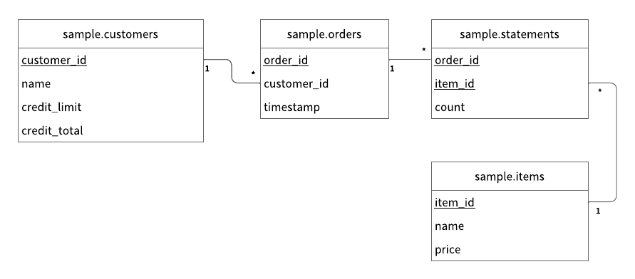

---
tags:
  - Community
  - Enterprise Standard
  - Enterprise Premium
displayed_sidebar: docsJapanese
---

# ScalarDB をはじめよう

import Tabs from '@theme/Tabs';
import TabItem from '@theme/TabItem';
import TranslationBanner from '/src/components/_translation-ja-jp.mdx';

<TranslationBanner />

この入門チュートリアルでは、ScalarDB でデータベースを設定する方法について説明し、ScalarDB を使用してクレジットカードでアイテムを注文して支払うことができるサンプルの電子商取引アプリケーションを作成するプロセスを示します。サンプルの電子商取引アプリケーションでは、ユーザーがクレジットラインを使用してアイテムを注文して支払う方法を示します。

:::warning

サンプルアプリケーションは ScalarDB の使用方法を示すことに重点を置いているため、アプリケーション固有のエラー処理、認証処理、および同様の機能はサンプルアプリケーションに含まれていません。ScalarDB での例外処理の詳細については、[例外の処理方法](api-guide.mdx#how-to-handle-exceptions)を参照してください。

:::

## このサンプルアプリケーションの前提条件

ScalarDB は Java で記述されているため、環境に次のいずれかの Java Development Kit (JDK) がインストールされている必要があります。

- [Eclipse Temurin](https://adoptium.net/temurin/releases/) の OpenJDK LTS バージョン (8、11、17、または 21)
- [Docker](https://www.docker.com/get-started/) 20.10 以降と [Docker Compose](https://docs.docker.com/compose/install/) V2 以降

:::note

このサンプルアプリケーションは、Eclipse Temurin の OpenJDK でテストされています。ただし、ScalarDB 自体は、さまざまなベンダーの JDK ディストリビューションでテストされています。互換性のある JDK ディストリビューションを含む ScalarDB の要件の詳細については、[要件](./requirements.mdx)を参照してください。

:::

## ScalarDB サンプルリポジトリのクローンを作成する

**Terminal** を開き、次のコマンドを実行して ScalarDB サンプルリポジトリのクローンを作成します。

```console
git clone https://github.com/scalar-labs/scalardb-samples
```

次に、次のコマンドを実行して、サンプルアプリケーションが含まれているディレクトリに移動します。

```console
cd scalardb-samples/scalardb-sample
```

## データベースをセットアップする

データベースを選択し、指示に従って ScalarDB 用に設定します。

ScalarDB がサポートするデータベースの一覧については、[データベース](requirements.mdx#データベース)を参照してください。

<Tabs groupId="databases" queryString>
  <TabItem value="MySQL" label="MySQL" default>
    <h3>MySQLをローカルで実行する</h3>

    `scalardb-samples/scalardb-sample` ディレクトリの `docker-compose.yml` ファイルを使用して、Docker Compose で MySQL を実行できます。

    MySQL を起動するには、次のコマンドを実行します。

    ```console
    docker compose up -d mysql
    ```

    <h3>ScalarDB を設定する</h3>

    `scalardb-samples/scalardb-sample` ディレクトリの **database.properties** ファイルには、ScalarDB のデータベース設定が含まれています。**database.properties** ファイル内の MySQL のプロパティのコメントを解除して、設定が次のようになるようにしてください。

    ```properties
    # For MySQL
    scalar.db.storage=jdbc
    scalar.db.contact_points=jdbc:mysql://localhost:3306/
    scalar.db.username=root
    scalar.db.password=mysql
    ```
  </TabItem>
  <TabItem value="PostgreSQL" label="PostgreSQL">
    <h3>PostgreSQL をローカルで実行する</h3>

    `scalardb-samples/scalardb-sample` ディレクトリの `docker-compose.yml` ファイルを使用して、Docker Compose で PostgreSQL を実行できます。

    PostgreSQL を起動するには、次のコマンドを実行します。

    ```console
    docker compose up -d postgres
    ```

    <h3>ScalarDB を設定する</h3>

    `scalardb-samples/scalardb-sample` ディレクトリの **database.properties** ファイルには、ScalarDB のデータベース設定が含まれています。**database.properties** ファイル内の PostgreSQL のプロパティのコメントを解除して、設定が次のようになるようにしてください。

    ```properties
    # For PostgreSQL
    scalar.db.storage=jdbc
    scalar.db.contact_points=jdbc:postgresql://localhost:5432/
    scalar.db.username=postgres
    scalar.db.password=postgres
    ```
  </TabItem>
  <TabItem value="Oracle Database" label="Oracle Database">
    <h3>Oracle Database をローカルで実行する</h3>

    `scalardb-samples/scalardb-sample` ディレクトリの `docker-compose.yml` ファイルを使用して、Docker Compose で Oracle Database を実行できます。

    Oracle Database を起動するには、次のコマンドを実行します。

    ```console
    docker compose up -d oracle
    ```

    <h3>ScalarDB を設定する</h3>

    `scalardb-samples/scalardb-sample` ディレクトリの **database.properties** ファイルには、ScalarDB のデータベース設定が含まれています。**database.properties** ファイル内の Oracle データベースのプロパティのコメントを解除して、設定が次のようになるようにしてください。

    ```properties
    # For Oracle
    scalar.db.storage=jdbc
    scalar.db.contact_points=jdbc:oracle:thin:@//localhost:1521/FREEPDB1
    scalar.db.username=SYSTEM
    scalar.db.password=Oracle
    ```
  </TabItem>
  <TabItem value="SQL Server" label="SQL Server">
    <h3>SQL Server をローカルで実行する</h3>

    `scalardb-samples/scalardb-sample` ディレクトリの `docker-compose.yml` ファイルを使用して、Docker Compose で SQL Server を実行できます。

    SQL Server を起動するには、次のコマンドを実行します。

    ```console
    docker compose up -d sqlserver
    ```

    <h3>ScalarDB を設定する</h3>

    `scalardb-samples/scalardb-sample` ディレクトリの **database.properties** ファイルには、ScalarDB のデータベース設定が含まれています。**database.properties** ファイル内の SQL Server のプロパティのコメントを解除して、設定が次のようになるようにしてください。

    ```properties
    # For SQL Server
    scalar.db.storage=jdbc
    scalar.db.contact_points=jdbc:sqlserver://localhost:1433;encrypt=true;trustServerCertificate=true
    scalar.db.username=sa
    scalar.db.password=SqlServer22
    ```
  </TabItem>
  <TabItem value="DynamoDB" label="DynamoDB">
    <h3>Amazon DynamoDB をローカルで実行する</h3>

    `scalardb-samples/scalardb-sample` ディレクトリの `docker-compose.yml` ファイルを使用して、Docker Compose で Amazon DynamoDB Local を実行できます。

    Amazon DynamoDB Local を起動するには、次のコマンドを実行します。

    ```console
    docker compose up -d dynamodb
    ```

    <h3>ScalarDB を設定する</h3>

    `scalardb-samples/scalardb-sample` ディレクトリの **database.properties** ファイルには、ScalarDB のデータベース設定が含まれています。**database.properties** ファイル内の Amazon DynamoDB Local のプロパティのコメントを解除して、設定が次のようになるようにしてください。

    ```properties
    # For DynamoDB Local
    scalar.db.storage=dynamo
    scalar.db.contact_points=sample
    scalar.db.username=sample
    scalar.db.password=sample
    scalar.db.dynamo.endpoint_override=http://localhost:8000
    ```
  </TabItem>
  <TabItem value="Cosmos_DB_for_NoSQL" label="Cosmos DB for NoSQL">
    Azure Cosmos DB for NoSQL を使用するには、Azure アカウントが必要です。Azure アカウントをお持ちでない場合は、[Azure Cosmos DB アカウントを作成する](https://learn.microsoft.com/ja-jp/azure/cosmos-db/nosql/quickstart-portal#create-account)にアクセスしてください。

    <h3>Cosmos DB for NoSQL を設定する</h3>

    [既定の整合性レベルを構成する](https://learn.microsoft.com/ja-jp/azure/cosmos-db/nosql/how-to-manage-consistency#configure-the-default-consistency-level)の公式ドキュメントに従って、**既定の整合性レベル**を**強力**に設定します。

    <h3>ScalarDB を設定する</h3>

    以下の手順では、ローカル環境に JDK が適切にインストールおよび設定されており、Azure で Cosmos DB for NoSQL アカウントが適切に設定されていることを前提としています。

    `scalardb-samples/scalardb-sample` ディレクトリの **database.properties** ファイルには、ScalarDB のデータベース設定が含まれています。`scalar.db.contact_points` と `scalar.db.password` の値は、説明に従って必ず変更してください。

    ```properties
    # For Cosmos DB
    scalar.db.storage=cosmos
    scalar.db.contact_points=<COSMOS_DB_FOR_NOSQL_URI>
    scalar.db.password=<COSMOS_DB_FOR_NOSQL_KEY>
    ```

:::note

Azure Cosmos DB アカウントのプライマリーキーまたはセカンダリキーを `scalar.db.password` の値として使用できます。

:::
  </TabItem>
  <TabItem value="Cassandra" label="Cassandra">
    <h3>Cassandra をローカルで実行する</h3>

    `scalardb-samples/scalardb-sample` ディレクトリの `docker-compose.yml` ファイルを使用して、Docker Compose で Apache Cassandra を実行できます。

    Apache Cassandra を起動するには、次のコマンドを実行します。
    ```console
    docker compose up -d cassandra
    ```

    <h3>ScalarDB を設定する</h3>

    `scalardb-samples/scalardb-sample` ディレクトリの **database.properties** ファイルには、ScalarDB のデータベース設定が含まれています。**database.properties** ファイル内の Cassandra のプロパティのコメントを解除して、設定が次のようになるようにしてください。

    ```properties
    # For Cassandra
    scalar.db.storage=cassandra
    scalar.db.contact_points=localhost
    scalar.db.username=cassandra
    scalar.db.password=cassandra
    ```
  </TabItem>
</Tabs>

## データベーススキーマをロードする

アプリケーションでデータベーススキーマ (データを整理する方法) を定義する必要があります。サポートされているデータ型の詳細については、[ScalarDB と他のデータベース間のデータ型マッピング](schema-loader.mdx#scalardb-と他のデータベース間のデータ型マッピング)を参照してください。

このチュートリアルでは、**schema.json** というファイルが `scalardb-samples/scalardb-sample` ディレクトリに既に存在します。スキーマを適用するには、[`scalardb` Releases](https://github.com/scalar-labs/scalardb/releases) ページに移動し、使用している ScalarDB のバージョンに一致する ScalarDB Schema Loader を `scalardb-samples/scalardb-sample` ディレクトリにダウンロードします。

次に、データベースに基づいて、`<VERSION>` をダウンロードした ScalarDB Schema Loader のバージョンに置き換えて、次のコマンドを実行します。

<Tabs groupId="databases" queryString>
  <TabItem value="MySQL" label="MySQL" default>
    ```console
    java -jar scalardb-schema-loader-<VERSION>.jar --config database.properties --schema-file schema.json --coordinator
    ```

:::note

`transaction` が `true` に設定されたテーブルがスキーマ内に存在するため、`--coordinator` オプションが指定されています。スキーマの設定とロードの詳細については、[ScalarDB Schema Loader](schema-loader.mdx) を参照してください。

:::
  </TabItem>
  <TabItem value="PostgreSQL" label="PostgreSQL">
    ```console
    java -jar scalardb-schema-loader-<VERSION>.jar --config database.properties --schema-file schema.json --coordinator
    ```

:::note

`transaction` が `true` に設定されたテーブルがスキーマ内に存在するため、`--coordinator` オプションが指定されています。スキーマの設定とロードの詳細については、[ScalarDB Schema Loader](schema-loader.mdx) を参照してください。

:::
  </TabItem>
  <TabItem value="Oracle Database" label="Oracle Database">
    ```console
    java -jar scalardb-schema-loader-<VERSION>.jar --config database.properties --schema-file schema.json --coordinator
    ```

:::note

`transaction` が `true` に設定されたテーブルがスキーマ内に存在するため、`--coordinator` オプションが指定されています。スキーマの設定とロードの詳細については、[ScalarDB Schema Loader](schema-loader.mdx) を参照してください。

:::
  </TabItem>
  <TabItem value="SQL Server" label="SQL Server">
    ```console
    java -jar scalardb-schema-loader-<VERSION>.jar --config database.properties --schema-file schema.json --coordinator
    ```

:::note

`transaction` が `true` に設定されたテーブルがスキーマ内に存在するため、`--coordinator` オプションが指定されています。スキーマの設定とロードの詳細については、[ScalarDB Schema Loader](schema-loader.mdx) を参照してください。

:::
  </TabItem>
  <TabItem value="DynamoDB" label="DynamoDB">
    ```console
    java -jar scalardb-schema-loader-<VERSION>.jar --config database.properties --schema-file schema.json --coordinator --no-backup --no-scaling
    ```

:::note

`transaction` が `true` に設定されたテーブルがスキーマ内に存在するため、`--coordinator` オプションが指定されています。スキーマの設定とロードの詳細については、[ScalarDB Schema Loader](schema-loader.mdx) を参照してください。

また、Amazon DynamoDB Local は継続的なバックアップと自動スケーリングをサポートしていないため、`--no-backup` および `--no-scaling` オプションが指定されています。

:::
  </TabItem>
  <TabItem value="Cosmos_DB_for_NoSQL" label="Cosmos DB for NoSQL">
    ```console
    java -jar scalardb-schema-loader-<VERSION>.jar --config database.properties --schema-file schema.json --coordinator
    ```

:::note

`transaction` が `true` に設定されたテーブルがスキーマ内に存在するため、`--coordinator` オプションが指定されています。スキーマの設定とロードの詳細については、[ScalarDB Schema Loader](schema-loader.mdx) を参照してください。

:::
  </TabItem>
  <TabItem value="Cassandra" label="Cassandra">
    ```console
    java -jar scalardb-schema-loader-<VERSION>.jar --config database.properties --schema-file schema.json --coordinator --replication-factor=1
    ```

:::note

`transaction` が `true` に設定されたテーブルがスキーマ内に存在するため、`--coordinator` オプションが指定されています。スキーマの設定とロードの詳細については、[ScalarDB Schema Loader](schema-loader.mdx) を参照してください。

また、`--replication-factor=1` オプションは Cassandra を使用する場合にのみ有効です。デフォルトのレプリケーション係数は `3` ですが、このチュートリアルではセットアップを容易にするために `1` が使用されているため、3 つのノードではなく 1 つのノードを持つクラスターを準備するだけで済みます。ただし、レプリケーション係数 `1` は本番環境には適していないことに注意してください。

:::
  </TabItem>
</Tabs>

### スキーマの詳細

サンプルアプリケーションの [`schema.json`](https://github.com/scalar-labs/scalardb-samples/tree/main/scalardb-sample/schema.json) に示されているように、すべてのテーブルは `sample` 名前空間に作成されます。

- `sample.customers`: 顧客情報を管理するテーブル
  - `credit_limit`: 貸し手が顧客に信用枠から支出を許可する最大金額
  - `credit_total`: 顧客が信用枠から支出した金額
- `sample.orders`: 注文情報を管理するテーブル
- `sample.statements`: 注文明細情報を管理するテーブル
- `sample.items`: 注文するアイテムの情報を管理するテーブル

スキーマのエンティティ関係図は次のとおりです。



### 初期データをロードする

サンプルアプリケーションを実行する前に、次のコマンドを実行して初期データをロードする必要があります。

```console
./gradlew run --args="LoadInitialData"
```

初期データがロードされた後、次のレコードがテーブルに保存される必要があります。

**`sample.customers` テーブル**

| customer_id | name          | credit_limit | credit_total |
|-------------|---------------|--------------|--------------|
| 1           | Yamada Taro   | 10000        | 0            |
| 2           | Yamada Hanako | 10000        | 0            |
| 3           | Suzuki Ichiro | 10000        | 0            |

**`sample.items` テーブル**

| item_id | name   | price |
|---------|--------|-------|
| 1       | Apple  | 1000  |
| 2       | Orange | 2000  |
| 3       | Grape  | 2500  |
| 4       | Mango  | 5000  |
| 5       | Melon  | 3000  |

## サンプルアプリケーションでトランザクションを実行し、データを取得する

次のセクションでは、サンプル電子商取引アプリケーションでトランザクションを実行し、データを取得する方法について説明します。

### 顧客情報を取得する

まず、次のコマンドを実行して、ID が `1` である顧客に関する情報を取得します。

```console
./gradlew run --args="GetCustomerInfo 1"
```

次の出力が表示されます。

```console
...
{"id": 1, "name": "Yamada Taro", "credit_limit": 10000, "credit_total": 0}
...
```

### 注文する

次に、次のコマンドを実行して、顧客 ID `1` にリンゴ 3 個とオレンジ 2 個を注文してもらいます。

:::note

このコマンドの注文形式は `./gradlew run --args="PlaceOrder <CUSTOMER_ID> <ITEM_ID>:<COUNT>,<ITEM_ID>:<COUNT>,..."` です。

:::

```console
./gradlew run --args="PlaceOrder 1 1:3,2:2"
```

以下のように、`order_id` の UUID が異なる、注文が成功したことを示す類似の出力が表示されます。

```console
...
{"order_id": "dea4964a-ff50-4ecf-9201-027981a1566e"}
...
```

### 注文の詳細を確認する

次のコマンドを実行して注文の詳細を確認します。`<ORDER_ID_UUID>` は、前のコマンドを実行した後に表示される `order_id` の UUID に置き換えます。

```console
./gradlew run --args="GetOrder <ORDER_ID_UUID>"
```

`order_id` と `timestamp` の UUID が異なる、以下のような出力が表示されます。

```console
...
{"order": {"order_id": "dea4964a-ff50-4ecf-9201-027981a1566e","timestamp": 1650948340914,"customer_id": 1,"customer_name": "Yamada Taro","statement": [{"item_id": 1,"item_name": "Apple","price": 1000,"count": 3,"total": 3000},{"item_id": 2,"item_name": "Orange","price": 2000,"count": 2,"total": 4000}],"total": 7000}}
...
```

### 別の注文をする

次のコマンドを実行して、顧客 ID `1` の `credit_total` の残額を使用してメロン 1 個を注文します。

```console
./gradlew run --args="PlaceOrder 1 5:1"
```

以下のように、`order_id` の UUID が異なる、注文が成功したことを示す類似の出力が表示されます。

```console
...
{"order_id": "bcc34150-91fa-4bea-83db-d2dbe6f0f30d"}
...
```

### 注文履歴を確認する

次のコマンドを実行して、顧客 ID `1` のすべての注文履歴を取得します。

```console
./gradlew run --args="GetOrders 1"
```

`order_id` と `timestamp` の UUID が異なる以下のような出力が表示されます。これは、顧客 ID `1` のすべての注文履歴をタイムスタンプの降順で表示します。

```console
...
{"order": [{"order_id": "dea4964a-ff50-4ecf-9201-027981a1566e","timestamp": 1650948340914,"customer_id": 1,"customer_name": "Yamada Taro","statement": [{"item_id": 1,"item_name": "Apple","price": 1000,"count": 3,"total": 3000},{"item_id": 2,"item_name": "Orange","price": 2000,"count": 2,"total": 4000}],"total": 7000},{"order_id": "bcc34150-91fa-4bea-83db-d2dbe6f0f30d","timestamp": 1650948412766,"customer_id": 1,"customer_name": "Yamada Taro","statement": [{"item_id": 5,"item_name": "Melon","price": 3000,"count": 1,"total": 3000}],"total": 3000}]}
...
```

### クレジット合計を確認する

次のコマンドを実行して、顧客 ID `1` のクレジット合計を取得します。

```console
./gradlew run --args="GetCustomerInfo 1"
```

次の出力が表示されます。これは、顧客 ID `1` が `credit_total` の `credit_limit` に達しており、これ以上注文できないことを示しています。

```console
...
{"id": 1, "name": "Yamada Taro", "credit_limit": 10000, "credit_total": 10000}
...
```

次のコマンドを実行して、ブドウ 1 個とマンゴー 1 個を注文してみます。

```console
./gradlew run --args="PlaceOrder 1 3:1,4:1"
```

次の出力が表示されます。これは、`credit_total` 金額が `credit_limit` 金額を超えたために注文が失敗したことを示しています。

```console
...
java.lang.RuntimeException: Credit limit exceeded
        at sample.Sample.placeOrder(Sample.java:205)
        at sample.command.PlaceOrderCommand.call(PlaceOrderCommand.java:33)
        at sample.command.PlaceOrderCommand.call(PlaceOrderCommand.java:8)
        at picocli.CommandLine.executeUserObject(CommandLine.java:1783)
        at picocli.CommandLine.access$900(CommandLine.java:145)
        at picocli.CommandLine$RunLast.handle(CommandLine.java:2141)
        at picocli.CommandLine$RunLast.handle(CommandLine.java:2108)
        at picocli.CommandLine$AbstractParseResultHandler.execute(CommandLine.java:1975)
        at picocli.CommandLine.execute(CommandLine.java:1904)
        at sample.command.SampleCommand.main(SampleCommand.java:35)
...
```

### 支払いを行う

注文を続行するには、顧客 ID `1` が支払いを行って `credit_total` の金額を減らす必要があります。

次のコマンドを実行して支払いを行います。

```console
./gradlew run --args="Repayment 1 8000"
```

次に、次のコマンドを実行して、顧客 ID `1` の `credit_total` 金額を確認します。

```console
./gradlew run --args="GetCustomerInfo 1"
```

次の出力が表示されます。これは、顧客 ID `1` に支払いが適用され、`credit_total` の金額が減ったことを示しています。

```console
...
{"id": 1, "name": "Yamada Taro", "credit_limit": 10000, "credit_total": 2000}
...
```

顧客 ID `1` が支払いを済ませたので、次のコマンドを実行してブドウ 1 個とメロン 1 個を注文します。

```console
./gradlew run --args="PlaceOrder 1 3:1,4:1"
```

以下のように、`order_id` の UUID が異なる、注文が成功したことを示す類似の出力が表示されます。

```console
...
{"order_id": "8911cab3-1c2b-4322-9386-adb1c024e078"}
...
```

## データベースを停止する

データベースを停止するには、次のコマンドを実行して Docker コンテナを停止します。

```console
docker compose down
```

## 参照

このチュートリアルで使用される電子商取引アプリケーションのソースコードを確認するには、[`Sample.java`](https://github.com/scalar-labs/scalardb-samples/blob/main/scalardb-sample/src/main/java/sample/Sample.java) を参照してください。
