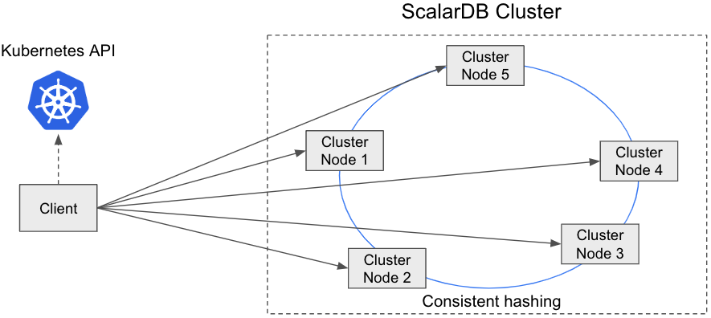

---
tags:
  - Enterprise Standard
  - Enterprise Premium
---

# Java API を使用した ScalarDB Cluster の開発者ガイド

import TranslationBanner from '/src/components/_translation-ja-jp.mdx';

<TranslationBanner />

ScalarDB Cluster は、アプリケーションを開発するための Java API を提供します。このドキュメントでは、Java API の使用方法を説明します。

## ビルドに ScalarDB Cluster Java Client SDK を追加する

ScalarDB Cluster Java Client SDK は、[Maven Central Repository](https://mvnrepository.com/artifact/com.scalar-labs/scalardb-cluster-java-client-sdk) で入手できます。

Gradle を使用して ScalarDB Cluster Java Client SDK への依存関係を追加するには、以下を使用します。

```gradle
dependencies {
    implementation 'com.scalar-labs:scalardb-cluster-java-client-sdk:3.13.1'
}
```

Maven を使用して依存関係を追加するには、以下を使用します。

```xml
<dependency>
  <groupId>com.scalar-labs</groupId>
  <artifactId>scalardb-cluster-java-client-sdk</artifactId>
  <version>3.13.1</version>
</dependency>
```

## クライアントモード

ScalarDB Cluster Java Client SDK は、`indirect` と `direct-kubernetes` の 2 つのクライアントモードをサポートしています。以下では、クライアントモードについて説明します。

### `indirect` クライアントモード

このモードでは、単にリクエストを任意のクラスターノードに送信します (通常は Envoy などのロードバランサー経由)。リクエストを受信したクラスターノードは、トランザクション状態を持つ適切なクラスターノードにリクエストをルーティングします。


このモードの利点は、クライアントを軽量に保てることです。
欠点は、正しいクラスターノードに到達するために追加のホップが必要になり、パフォーマンスに影響する可能性があることです。

アプリケーションが別の Kubernetes クラスターで実行されていて、アプリケーションが Kubernetes API と各クラスターノードにアクセスできない場合でも、この接続モードを使用できます。
アプリケーションが ScalarDB Cluster ノードと同じ Kubernetes クラスターで実行されている場合は、`direct-kubernetes` クライアントモードを使用できます。

### `direct-kubernetes` クライアントモード

このモードでは、クライアントはメンバーシップロジック (Kubernetes API を使用) と分散ロジック (コンシステントハッシュアルゴリズム) を使用して、トランザクション状態を持つ適切なクラスターノードを見つけます。次に、クライアントはクラスターノードに直接リクエストを送信します。



このモードの利点は、適切なクラスターノードに到達するためのホップ数を減らすことができるため、パフォーマンスが向上することです。このモードの欠点は、クライアントにメンバーシップロジックとリクエストルーティングロジックが必要なため、クライアントをファットにする必要があることです。

この接続モードは Kubernetes API と各クラスターノードにアクセスする必要があるため、アプリケーションが ScalarDB Cluster ノードと同じ Kubernetes クラスターで実行されている場合にのみ、この接続モードを使用できます。アプリケーションが別の Kubernetes クラスターで実行されている場合は、`indirect` クライアントモードを使用します。

`direct-kubernetes` クライアントモードで Kubernetes にアプリケーションをデプロイする方法の詳細については、[`direct-kubernetes` モードを使用してクライアントアプリケーションを Kubernetes にデプロイする](../helm-charts/how-to-deploy-scalardb-cluster.mdx#direct-kubernetes-モードを使用してクライアント-アプリケーションを-kubernetes-にデプロイします) を参照してください。

## ScalarDB Cluster Java API

ScalarDB Cluster Java Client SDK は、アプリケーションが ScalarDB Cluster にアクセスするための Java API を提供します。次の図は、ScalarDB Cluster Java API のアーキテクチャを示しています。

```
  +-----------------------+
  | ユーザー/アプリケーション |
  +-----------------------+
           ↓ Java API
    +--------------+
    | ScalarDB API |
    +--------------+
           ↓ gRPC
  +------------------+
  | ScalarDB Cluster |
  +------------------+
           ↓ DB ベンダー固有のプロトコル
         +----+
         | DB |
         +----+
```

ScalarDB Cluster Java API の使用は、クライアント構成と Schema Loader が異なることを除いて、ScalarDB Java API の使用とほぼ同じです。詳細については、[ScalarDB Java API ガイド](../api-guide.mdx) を参照してください。

次のセクションでは、ScalarDB Cluster Java API とクラスター用 Schema Loader のクライアント構成について説明します。

### クライアント構成

次の表は、ScalarDB Cluster Java API のクライアント構成を示しています。

| 名前                                                | 説明                                                                                                                                                                                                                                                                                                                                                                                                                                                                                                                                                                              | デフォルト         |
|----------------------------------------------------|-----------------------------------------------------------------------------------------------------------------------------------------------------------------------------------------------------------------------------------------------------------------------------------------------------------------------------------------------------------------------------------------------------------------------------------------------------------------------------------------------------------------------------------------------------------------------------------|------------------|
| `scalar.db.transaction_manager`                    | `cluster` を指定する必要があります。                                                                                                                                                                                                                                                                                                                                                                                                                                                                                                                                                  | -                |
| `scalar.db.contact_points`                         | クラスターの連絡先。`indirect` クライアントモードを使用する場合は、`indirect:<the load balancer IP address>` の形式を使用して、クラスターノードの前にあるロードバランサーの IP アドレスを指定します。`direct-kubernetes` クライアントモードを使用する場合は、`direct-kubernetes:<namespace name>/<endpoint name>` または単に `direct-kubernetes:<endpoint name>` の形式を使用して、名前空間名 (オプション) と [エンドポイントリソース](https://kubernetes.io/docs/concepts/services-networking/service/#endpoints) の名前を指定して、メンバーシップ情報を取得します。名前空間名を指定しない場合、クライアントは `default` 名前空間を使用します。 |                  |
| `scalar.db.contact_port`                           | 連絡先のポート番号。                                                                                                                                                                                                                                                                                                                                                                                                                                                                                                                                                                 | `60053`          |
| `scalar.db.cluster.grpc.deadline_duration_millis`  | gRPC の期限期間（ミリ秒単位）。                                                                                                                                                                                                                                                                                                                                                                                                                                                                                                                                                        | `60000` (60 秒)  |
| `scalar.db.cluster.grpc.max_inbound_message_size`  | 単一の gRPC フレームに許可される最大メッセージサイズ。                                                                                                                                                                                                                                                                                                                                                                                                                                                                                                                                    | gRPCのデフォルト値 |
| `scalar.db.cluster.grpc.max_inbound_metadata_size` | 受信できるメタデータの最大サイズ。                                                                                                                                                                                                                                                                                                                                                                                                                                                                                                                                                      | gRPCのデフォルト値 |

たとえば、`indirect` クライアントモードを使用し、ロードバランサーの IP アドレスが `192.168.10.1` の場合、クライアントを次のように構成できます。

```properties
scalar.db.transaction_manager=cluster
scalar.db.contact_points=indirect:192.168.10.1
```

または、エンドポイントの名前空間を `ns`、エンドポイント名を `scalardb-cluster` として `direct-kubernetes` クライアントモードを使用する場合は、次のようにクライアントを構成できます。

```properties
scalar.db.transaction_manager=cluster
scalar.db.contact_points=direct-kubernetes:ns/scalardb-cluster
```

### クラスター用 Schema Loader

ScalarDB Cluster 経由でスキーマをロードするには、専用の ScalarDB Cluster 用 Schema Loader (クラスター用 Schema Loader) を使用する必要があります。クラスター用Schema Loader の使用方法は、JAR ファイルの名前が異なることを除いて、[ScalarDB Schema Loader](../schema-loader.mdx) の使用方法と基本的に同じです。クラスター用 Schema Loader は、[ScalarDB リリース](https://github.com/scalar-labs/scalardb/releases/tag/v3.13.1) からダウンロードできます。JAR ファイルをダウンロードしたら、次のコマンドでクラスター用 Schema Loader を実行できます。

```console
java -jar scalardb-cluster-schema-loader-3.13.1-all.jar --config <PATH_TO_CONFIG_FILE> -f <PATH_TO_SCHEMA_FILE> --coordinator
```

## ScalarDB Cluster SQL

ScalarDB Cluster SQL には、次のように Java の ScalarDB 用 JDBC および Spring Data JDBC を介してアクセスできます。

```
  +----------------------------------------------+
  |            ユーザー/アプリケーション             |
  +----------------------------------------------+
         ↓                    ↓ Java API
Java API ↓     +-------------------------------+
 (JDBC)  ↓     | Spring Data JDBC for ScalarDB |
         ↓     +-------------------------------+
+----------------------------------------------+
|         ScalarDB JDBC (ScalarDB SQL)         |
+----------------------------------------------+
                    ↓ gRPC
         +----------------------+
         | ScalarDB Cluster SQL |
         +----------------------+
                    ↓ DB ベンダー固有のプロトコル
                  +----+
                  | DB |
                  +----+
```

このセクションでは、JDBC 経由で ScalarDB Cluster SQL を使用する方法と、Spring Data JDBC for ScalarDB を使用する方法について説明します。

### JDBC 経由の ScalarDB Cluster SQL

JDBC 経由での ScalarDB Cluster SQL の使用は、プロジェクトに JDBC ドライバーを追加する方法を除いて、[ScalarDB JDBC](../scalardb-sql/jdbc-guide.mdx) を使用する場合とほぼ同じです。

[ビルドに ScalarDB Cluster Java Client SDK を追加する](#add-scalardb-cluster-java-client-sdk-to-your-build) で説明されているように ScalarDB Cluster Java Client SDK を追加することに加えて、プロジェクトに次の依存関係を追加する必要があります。

Gradle を使用して ScalarDB Cluster JDBC ドライバーへの依存関係を追加するには、以下を使用します。

```gradle
dependencies {
    implementation 'com.scalar-labs:scalardb-sql-jdbc:3.13.1'
    implementation 'com.scalar-labs:scalardb-cluster-java-client-sdk:3.13.1'
}
```

Maven を使用して依存関係を追加するには、以下を使用します。

```xml
<dependencies>
    <dependency>
        <groupId>com.scalar-labs</groupId>
        <artifactId>scalardb-sql-jdbc</artifactId>
        <version>3.13.1</version>
    </dependency>
    <dependency>
        <groupId>com.scalar-labs</groupId>
        <artifactId>scalardb-cluster-java-client-sdk</artifactId>
        <version>3.13.1</version>
    </dependency>
</dependencies>
```

それ以外は、JDBC 経由で ScalarDB Cluster SQL を使用することは、ScalarDB JDBC を使用することと同じです。ScalarDB JDBC の詳細については、[ScalarDB JDBC ガイド](../scalardb-sql/jdbc-guide.mdx) を参照してください。

### Spring Data JDBC for ScalarDB 経由の ScalarDB Cluster SQL

JDBC 経由の ScalarDB Cluster SQL と同様に、Spring Data JDBC for ScalarDB 経由の ScalarDB Cluster SQL を使用することは、プロジェクトへの追加方法を除いて、[Spring Data JDBC for ScalarDB](../scalardb-sql/spring-data-guide.mdx) を使用することとほぼ同じです。

[ScalarDB Cluster Java Client SDK をビルドに追加する](#add-scalardb-cluster-java-client-sdk-to-your-build) で説明されているように ScalarDB Cluster Java Client SDK を追加することに加えて、プロジェクトに次の依存関係を追加する必要があります:

Gradle を使用して依存関係を追加するには、以下を使用します:

```gradle
dependencies {
    implementation 'com.scalar-labs:scalardb-sql-spring-data:3.13.1'
    implementation 'com.scalar-labs:scalardb-cluster-java-client-sdk:3.13.1'
}
```

Maven を使用して依存関係を追加するには、以下を使用します。

```xml
<dependencies>
    <dependency>
        <groupId>com.scalar-labs</groupId>
        <artifactId>scalardb-sql-spring-data</artifactId>
        <version>3.13.1</version>
    </dependency>
    <dependency>
        <groupId>com.scalar-labs</groupId>
        <artifactId>scalardb-cluster-java-client-sdk</artifactId>
        <version>3.13.1</version>
    </dependency>
</dependencies>
```

それ以外では、Spring Data JDBC for ScalarDB 経由で ScalarDB Cluster SQL を使用することは、Spring Data JDBC for ScalarDB を使用することと同じです。Spring Data JDBC for ScalarDB の詳細については、[Spring Data JDBC for ScalarDB ガイド](../scalardb-sql/spring-data-guide.mdx) を参照してください。

### ScalarDB Cluster SQL クライアント構成

次の表は、ScalarDB Cluster SQL の構成を示しています。

| 名前                                                | 説明                                                                                                                                                                                                                                                                                                                                                                                                                                                                                                                                                                              | デフォルト         |
|----------------------------------------------------|-----------------------------------------------------------------------------------------------------------------------------------------------------------------------------------------------------------------------------------------------------------------------------------------------------------------------------------------------------------------------------------------------------------------------------------------------------------------------------------------------------------------------------------------------------------------------------------|------------------|
| `scalar.db.sql.connection_mode`                    | `cluster` を指定する必要があります。                                                                                                                                                                                                                                                                                                                                                                                                                                                                                                                                                  | -                |
| `scalar.db.sql.cluster_mode.contact_points`        | クラスターの連絡先。`indirect` クライアントモードを使用する場合は、`indirect:<the load balancer IP address>` の形式を使用して、クラスターノードの前にあるロードバランサーの IP アドレスを指定します。`direct-kubernetes` クライアントモードを使用する場合は、`direct-kubernetes:<namespace name>/<endpoint name>` または単に `direct-kubernetes:<endpoint name>` の形式を使用して、名前空間名 (オプション) と [エンドポイントリソース](https://kubernetes.io/docs/concepts/services-networking/service/#endpoints) の名前を指定して、メンバーシップ情報を取得します。名前空間名を指定しない場合、クライアントは `default` 名前空間を使用します。 |                  |
| `scalar.db.sql.cluster_mode.contact_port`          | 連絡先のポート番号。                                                                                                                                                                                                                                                                                                                                                                                                                                                                                                                                                                 | `60053`          |
| `scalar.db.sql.default_transaction_mode`           | デフォルトのトランザクションモード。`TRANSACTION` または `TWO_PHASE_COMMIT_TRANSACTION` を設定できます。                                                                                                                                                                                                                                                                                                                                                                                                                                                                                    | `TRANSACTION`    |
| `scalar.db.sql.default_namespace_name`             | デフォルトの名前空間名。SQL ステートメントで名前空間名を指定しない場合は、この値が使用されます。                                                                                                                                                                                                                                                                                                                                                                                                                                                                                                  |                 |
| `scalar.db.cluster.grpc.deadline_duration_millis`  | gRPC の期限期間（ミリ秒単位）。                                                                                                                                                                                                                                                                                                                                                                                                                                                                                                                                                        | `60000` (60 秒)  |
| `scalar.db.cluster.grpc.max_inbound_message_size`  | 単一の gRPC フレームに許可される最大メッセージサイズ。                                                                                                                                                                                                                                                                                                                                                                                                                                                                                                                                    | gRPCのデフォルト値 |
| `scalar.db.cluster.grpc.max_inbound_metadata_size` | 受信できるメタデータの最大サイズ。                                                                                                                                                                                                                                                                                                                                                                                                                                                                                                                                                      | gRPCのデフォルト値 |

たとえば、`indirect` クライアントモードを使用し、ロードバランサーの IP アドレスが `192.168.10.1` の場合、クライアントを次のように構成できます。

```properties
scalar.db.sql.connection_mode=cluster
scalar.db.sql.cluster_mode.contact_points=indirect:192.168.10.1
```

または、エンドポイントの名前空間を `ns`、エンドポイント名を `scalardb-cluster` として `direct-kubernetes` クライアントモードを使用する場合は、次のようにクライアントを構成できます。

```properties
scalar.db.sql.connection_mode=cluster
scalar.db.sql.cluster_mode.contact_points=direct-kubernetes:ns/scalardb-cluster
```

ScalarDB JDBC の構成方法の詳細については、[JDBC 接続 URL](../scalardb-sql/jdbc-guide.mdx#jdbc-接続-url) を参照してください。

Spring Data JDBC for ScalarDB の構成方法の詳細については、[構成](../scalardb-sql/spring-data-guide.mdx#構成) を参照してください。

### SQL CLI

他の SQL データベースと同様に、ScalarDB SQL にも、コマンドラインシェルで対話的に SQL ステートメントを発行できる CLI ツールが用意されています。

Cluster 用の SQL CLI は、[ScalarDB リリース](https://github.com/scalar-labs/scalardb/releases/tag/v3.13.1) からダウンロードできます。JAR ファイルをダウンロードしたら、次のコマンドで SQL CLI を実行できます。

```console
java -jar scalardb-cluster-sql-cli-3.13.1-all.jar --config <PATH_TO_CONFIG_FILE>
```

#### 使用方法

CLI の使用方法は、次のように `-h` オプションを使用して確認できます。

```console
java -jar scalardb-cluster-sql-cli-3.13.1-all.jar -h
Usage: scalardb-sql-cli [-hs] -c=PROPERTIES_FILE [-e=COMMAND] [-f=FILE]
                        [-l=LOG_FILE] [-o=<outputFormat>] [-p=PASSWORD]
                        [-u=USERNAME]
Starts ScalarDB SQL CLI.
  -c, --config=PROPERTIES_FILE
                            A configuration file in properties format.
  -e, --execute=COMMAND     A command to execute.
  -f, --file=FILE           A script file to execute.
  -h, --help                Display this help message.
  -l, --log=LOG_FILE        A file to write output.
  -o, --output-format=<outputFormat>
                            Format mode for result display. You can specify
                              table/vertical/csv/tsv/xmlattrs/xmlelements/json/a
                              nsiconsole.
  -p, --password=PASSWORD   A password to connect.
  -s, --silent              Reduce the amount of informational messages
                              displayed.
  -u, --username=USERNAME   A username to connect.
```

## 参考資料

Java 以外のプログラミング言語で ScalarDB Cluster を使用する場合は、ScalarDB Cluster gRPC API を使用できます。
ScalarDB Cluster gRPC API の詳細については、以下を参照してください。

* [ScalarDB Cluster gRPC API ガイド](scalardb-cluster-grpc-api-guide.mdx)
* [ScalarDB Cluster SQL gRPC API ガイド](scalardb-cluster-sql-grpc-api-guide.mdx)

Javadocs も利用可能です:

* [ScalarDB Cluster Java Client SDK](https://javadoc.io/doc/com.scalar-labs/scalardb-cluster-java-client-sdk/3.13.1/index.html)
* [ScalarDB Cluster Common](https://javadoc.io/doc/com.scalar-labs/scalardb-cluster-common/3.13.1/index.html)
* [ScalarDB Cluster RPC](https://javadoc.io/doc/com.scalar-labs/scalardb-cluster-rpc/3.13.1/index.html)
