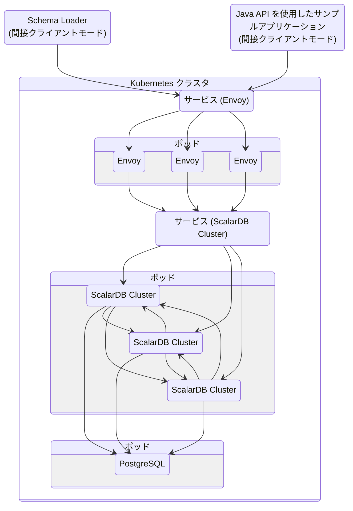

---
tags:
  - Enterprise Standard
  - Enterprise Premium
displayed_sidebar: docsJapanese
---

# ScalarDB Cluster をはじめよう

import TranslationBanner from '/src/components/_translation-ja-jp.mdx';

<TranslationBanner />

このチュートリアルでは、Java API を通じて [ScalarDB Cluster](./index.mdx) を使用するサンプルアプリケーションを作成する方法について説明します。

## 概要

このチュートリアルでは、ScalarDB を使用して商品を注文し、信用枠で支払いを行うことができるサンプルの電子商取引アプリケーションを作成するプロセスについて説明します。

:::note

サンプルアプリケーションの焦点は ScalarDB の使用方法を示すことにあるため、アプリケーション固有のエラー処理、認証処理、および同様の機能はサンプルアプリケーションには含まれていません。ScalarDB での例外処理の詳細については、[例外の処理](../api-guide.mdx#例外の処理)を参照してください。

:::

次の図は、サンプルアプリケーションのシステムアーキテクチャを示しています。



### このサンプルアプリケーションで実行できること

サンプルアプリケーションは、次の種類のトランザクションをサポートしています:

- 顧客情報を取得します。
- 信用枠を使用して注文を行います。
  - 注文のコストが顧客の信用限度額を下回っているかどうかを確認します。
  - チェックが成功した場合は、注文履歴を記録し、顧客が支払った金額を更新します。
- 注文 ID で注文情報を取得します。
- 顧客 ID で注文情報を取得します。
- 支払いを行います。
  - 顧客が支払った金額を減らします。

## このサンプルアプリケーションの前提条件

- [Eclipse Temurin](https://adoptium.net/temurin/releases/) の OpenJDK LTS バージョン (8、11、17、または 21)
- Kubernetes クラスターで実行されている ScalarDB Cluster
  - [ScalarDB Cluster をローカルにデプロイする方法](setup-scalardb-cluster-on-kubernetes-by-using-helm-chart.mdx) の手順に従ってデプロイした Kubernetes クラスターで ScalarDB Cluster が実行されていることを前提としています。

:::note

このサンプルアプリケーションは、Eclipse Temurin の OpenJDK でテストされています。ただし、ScalarDB 自体は、さまざまなベンダーの JDK ディストリビューションでテストされています。互換性のある JDK ディストリビューションを含む ScalarDB の要件の詳細については、[要件](../requirements.mdx)を参照してください。

:::

## ScalarDB Cluster のセットアップ

次のセクションでは、サンプルの電子商取引アプリケーションをセットアップする方法について説明します。

### ScalarDB サンプルリポジトリのクローンを作成する

**ターミナル** を開き、次のコマンドを実行して ScalarDB サンプルリポジトリのクローンを作成します。

```console
git clone https://github.com/scalar-labs/scalardb-samples
```

次に、次のコマンドを実行して、サンプルアプリケーションが含まれているディレクトリに移動します。

```console
cd scalardb-samples/scalardb-sample
```

### `build.gradle` を変更する

ScalarDB Cluster を使用するには、任意のテキストエディターで `build.gradle` を開きます。次に、`dependencies` セクションから `com.scalar-labs:scalardb` の既存の依存関係を削除し、`dependencies` セクションに次の依存関係を追加します。

```gradle
dependencies {
    ...

    implementation 'com.scalar-labs:scalardb-cluster-java-client-sdk:3.13.2'
}
```

### `database.properties` を変更する

ScalarDB Cluster に接続するには、`database.properties` も変更する必要があります。ただし、その前に、Envoy サービスリソース (`scalardb-cluster-envoy`) の `EXTERNAL-IP` アドレスを取得する必要があります。サービスリソースを取得するには、次のコマンドを実行します。

```console
kubectl get svc scalardb-cluster-envoy
```

`CLUSTER-IP`、`PORT(S)`、`AGE` の値がそれぞれ異なる、以下のような出力が表示されます。

```console
NAME                     TYPE           CLUSTER-IP      EXTERNAL-IP   PORT(S)           AGE
scalardb-cluster-envoy   LoadBalancer   10.105.121.51   localhost     60053:30641/TCP   16h
```

この場合、`EXTERNAL-IP` アドレスは `localhost` です。

`database.properties` では、`scalar.db.transaction_manager` プロパティに `cluster` を指定し、`scalar.db.contact_points` が Envoy サービスリソースに接続するためのクライアントモードとして `indirect` を使用する必要があります。

次のコマンドを実行して `database.properties` を開きます。

```console
vim database.properties
```

次に、`database.properties` を次のように変更します。

```properties
scalar.db.transaction_manager=cluster
scalar.db.contact_points=indirect:localhost
```

:::note

クライアントモードの詳細については、[Java API を使用した ScalarDB Cluster の開発者ガイド](developer-guide-for-scalardb-cluster-with-java-api.mdx).

:::

### スキーマをロードする

サンプルアプリケーションのデータベーススキーマ (データを整理する方法) は、[`schema.json`](https://github.com/scalar-labs/scalardb-samples/tree/main/scalardb-sample/schema.json) ですでに定義されています。

スキーマを適用するには、[ScalarDB リリース](https://github.com/scalar-labs/scalardb/releases/tag/v3.13.2)に移動し、ScalarDB Cluster Schema Loader を `scalardb-samples/scalardb-sample` フォルダーにダウンロードします。

次に、次のコマンドを実行します。

```console
java -jar scalardb-cluster-schema-loader-3.13.2-all.jar --config database.properties -f schema.json --coordinator
```

#### スキーマの詳細

サンプルアプリケーションの [`schema.json`](https://github.com/scalar-labs/scalardb-samples/tree/main/scalardb-sample/schema.json) に示されているように、すべてのテーブルは `sample` 名前空間に作成されます。

- `sample.customers`: 顧客情報を管理するテーブル
  - `credit_limit`: 貸し手が顧客に信用枠から支出を許可する最大金額
  - `credit_total`: 顧客が信用枠から支出した金額
- `sample.orders`: 注文情報を管理するテーブル
- `sample.statements`: 注文明細情報を管理するテーブル
- `sample.items`: 注文するアイテムの情報を管理するテーブル

スキーマのエンティティ関係図は次のとおりです。


### 初期データをロードする

サンプルアプリケーションを実行する前に、次のコマンドを実行して初期データをロードする必要があります。

```console
./gradlew run --args="LoadInitialData"
```

初期データがロードされたら、次のレコードがテーブルに保存されます。

**`sample.customers` テーブル**

| customer_id | name          | credit_limit | credit_total |
|-------------|---------------|--------------|--------------|
| 1           | Yamada Taro   | 10000        | 0            |
| 2           | Yamada Hanako | 10000        | 0            |
| 3           | Suzuki Ichiro | 10000        | 0            |

**`sample.items` テーブル**

| item_id | name   | price |
|---------|--------|-------|
| 1       | Apple  | 1000  |
| 2       | Orange | 2000  |
| 3       | Grape  | 2500  |
| 4       | Mango  | 5000  |
| 5       | Melon  | 3000  |

## サンプルアプリケーションでトランザクションを実行し、データを取得する

次のセクションでは、サンプル電子商取引アプリケーションでトランザクションを実行し、データを取得する方法について説明します。

### 顧客情報を取得する

次のコマンドを実行して、ID が `1` である顧客に関する情報を取得することから始めます。

```console
./gradlew run --args="GetCustomerInfo 1"
```

次の出力が表示されます。

```console
...
{"id": 1, "name": "Yamada Taro", "credit_limit": 10000, "credit_total": 0}
...
```

### 注文する

次に、次のコマンドを実行して、顧客 ID `1` にリンゴ3個とオレンジ2個を注文してもらいます。

:::note

このコマンドの注文形式は `./gradlew run --args="PlaceOrder <CUSTOMER_ID> <ITEM_ID>:<COUNT>,<ITEM_ID>:<COUNT>,..."` です。

:::

```console
./gradlew run --args="PlaceOrder 1 1:3,2:2"
```

以下のように、`order_id` の UUID が異なる、注文が成功したことを示す類似の出力が表示されます。

```console
...
{"order_id": "dea4964a-ff50-4ecf-9201-027981a1566e"}
...
```

### 注文の詳細を確認する

次のコマンドを実行して注文の詳細を確認します。`<ORDER_ID_UUID>` は、前のコマンドを実行した後に表示される `order_id` の UUID に置き換えます。

```console
./gradlew run --args="GetOrder <ORDER_ID_UUID>"
```

`order_id` と `timestamp` の UUID が異なる、以下のような出力が表示されます。

```console
...
{"order": {"order_id": "dea4964a-ff50-4ecf-9201-027981a1566e","timestamp": 1650948340914,"customer_id": 1,"customer_name": "Yamada Taro","statement": [{"item_id": 1,"item_name": "Apple","price": 1000,"count": 3,"total": 3000},{"item_id": 2,"item_name": "Orange","price": 2000,"count": 2,"total": 4000}],"total": 7000}}
...
```

### 別の注文をする

次のコマンドを実行して、顧客 ID `1` の `credit_total` の残額を使用してメロン1個を注文します。

```console
./gradlew run --args="PlaceOrder 1 5:1"
```

以下のように、`order_id` の UUID が異なる、注文が成功したことを示す類似の出力が表示されます。

```console
...
{"order_id": "bcc34150-91fa-4bea-83db-d2dbe6f0f30d"}
...
```

### 注文履歴を確認する

次のコマンドを実行して、顧客 ID `1` のすべての注文履歴を取得します。

```console
./gradlew run --args="GetOrders 1"
```

`order_id` と `timestamp` の UUID が異なる以下のような出力が表示されます。これは、顧客 ID `1` のすべての注文履歴をタイムスタンプの降順で表示します。

```console
...
{"order": [{"order_id": "dea4964a-ff50-4ecf-9201-027981a1566e","timestamp": 1650948340914,"customer_id": 1,"customer_name": "Yamada Taro","statement": [{"item_id": 1,"item_name": "Apple","price": 1000,"count": 3,"total": 3000},{"item_id": 2,"item_name": "Orange","price": 2000,"count": 2,"total": 4000}],"total": 7000},{"order_id": "bcc34150-91fa-4bea-83db-d2dbe6f0f30d","timestamp": 1650948412766,"customer_id": 1,"customer_name": "Yamada Taro","statement": [{"item_id": 5,"item_name": "Melon","price": 3000,"count": 1,"total": 3000}],"total": 3000}]}
...
```

### クレジット合計の確認

次のコマンドを実行して、顧客 ID `1` のクレジット合計を取得します。

```console
./gradlew run --args="GetCustomerInfo 1"
```

次の出力が表示されます。これは、顧客 ID `1` が `credit_total` の `credit_limit` に達しており、これ以上注文できないことを示しています。

```console
...
{"id": 1, "name": "Yamada Taro", "credit_limit": 10000, "credit_total": 10000}
...
```

次のコマンドを実行して、ブドウ1個とマンゴー1個を注文してみます。

```console
./gradlew run --args="PlaceOrder 1 3:1,4:1"
```

次の出力が表示されます。これは、`credit_total` 金額が `credit_limit` 金額を超えたために注文が失敗したことを示しています。

```console
...
java.lang.RuntimeException: Credit limit exceeded
        at sample.Sample.placeOrder(Sample.java:205)
        at sample.command.PlaceOrderCommand.call(PlaceOrderCommand.java:33)
        at sample.command.PlaceOrderCommand.call(PlaceOrderCommand.java:8)
        at picocli.CommandLine.executeUserObject(CommandLine.java:1783)
        at picocli.CommandLine.access$900(CommandLine.java:145)
        at picocli.CommandLine$RunLast.handle(CommandLine.java:2141)
        at picocli.CommandLine$RunLast.handle(CommandLine.java:2108)
        at picocli.CommandLine$AbstractParseResultHandler.execute(CommandLine.java:1975)
        at picocli.CommandLine.execute(CommandLine.java:1904)
        at sample.command.SampleCommand.main(SampleCommand.java:35)
...
```

### 支払いを行う

注文を続行するには、顧客 ID `1` が支払いを行って `credit_total` の金額を減らす必要があります。

次のコマンドを実行して支払いを行います。

```console
./gradlew run --args="Repayment 1 8000"
```

次に、次のコマンドを実行して、顧客 ID `1` の `credit_total` 金額を確認します。

```console
./gradlew run --args="GetCustomerInfo 1"
```

次の出力が表示されます。これは、顧客 ID `1` に支払いが適用され、`credit_total` の金額が減ったことを示しています。

```console
...
{"id": 1, "name": "Yamada Taro", "credit_limit": 10000, "credit_total": 2000}
...
```

顧客 ID `1` が支払いを済ませたので、次のコマンドを実行してブドウ1個とメロン1個を注文します。

```console
./gradlew run --args="PlaceOrder 1 3:1,4:1"
```

以下のように、`order_id` の UUID が異なる、注文が成功したことを示す類似の出力が表示されます。

```console
...
{"order_id": "8911cab3-1c2b-4322-9386-adb1c024e078"}
...
```

## 参照

その他の ScalarDB Cluster チュートリアルについては、以下を参照してください。

- [ScalarDB Cluster GraphQL をはじめよう](getting-started-with-scalardb-cluster-graphql.mdx)
- [JDBC 経由の ScalarDB Cluster SQL をはじめよう](getting-started-with-scalardb-cluster-sql-jdbc.mdx)
- [Spring Data JDBC for ScalarDB を使用した ScalarDB Cluster SQL をはじめよう](getting-started-with-scalardb-cluster-sql-spring-data-jdbc.mdx)
- [ScalarDB Cluster での Go をはじめよう](getting-started-with-using-go-for-scalardb-cluster.mdx)
- [ScalarDB Cluster での Python をはじめよう](getting-started-with-using-python-for-scalardb-cluster.mdx)

Java API で ScalarDB Cluster を使用するアプリケーションの開発の詳細については、以下を参照してください。

- [Java API を使用した ScalarDB Cluster の開発者ガイド](developer-guide-for-scalardb-cluster-with-java-api.mdx)

ScalarDB Cluster gRPC API の詳細については、以下を参照してください。

- [ScalarDB Cluster gRPC API ガイド](scalardb-cluster-grpc-api-guide.mdx)
- [ScalarDB Cluster SQL gRPC API ガイド](scalardb-cluster-sql-grpc-api-guide.mdx)
