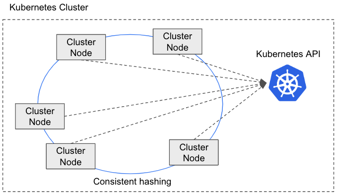

---
tags:
  - Enterprise Standard
  - Enterprise Premium
---

# ScalarDB Cluster

import TranslationBanner from '/src/components/_translation-ja-jp.mdx';

<TranslationBanner />

ScalarDB Cluster は、[ScalarDB](../overview.mdx) のクラスタリングソリューションであり、一連のクラスターノードで構成され、各ノードは ScalarDB 機能を提供します。各クラスターノードには、トランザクション要求をクラスター内の適切なクラスターノードに転送するルーティングメカニズムがあります。

## ScalarDB Cluster を使用する理由

マイクロサービストランザクションなど、複数のクライアント要求にまたがるトランザクションを実行する場合、トランザクション処理のステートフルな性質のため、トランザクションのすべての要求は同じサーバーで処理する必要があります。ただし、分散環境では、スケーラビリティと可用性のためにサービスは通常複数のサーバー (またはホスト) で実行されるため、同じサーバーに要求をルーティングするのは簡単ではありません。このシナリオでは、トランザクション内のすべての要求を同じサーバーにルーティングする必要があり、負荷分散を確実にするために異なるトランザクションを分散する必要があります。

この課題に対処するには、セッションアフィニティ (スティッキーセッションとも呼ばれます) などのルーティングメカニズムを構成する必要があります。この戦略により、トランザクション内のリクエストが一貫して同じサーバーにルーティングされるようになります。または、gRPC を使用して双方向ストリーミング RPC を活用することもできます。ただし、これらの構成を実装するには通常、かなりの時間と労力が必要であることに注意してください。さらに、使用しているロードバランサー製品によっては、特定の構成調整が必要になる場合があります。

このトピックの詳細については、[2 フェーズコミットインターフェイスを使用したトランザクションでのリクエストルーティング](../two-phase-commit-transactions.mdx#2-フェーズコミットインターフェイスを使用したトランザクションでのリクエストルーティング) を参照してください。

ScalarDB Cluster は、リクエストをクラスター内の適切なクラスターノードに転送できるルーティングメカニズムを提供することで、この問題に対処します。したがって、クラスターノードがリクエストを受信すると、ノードはそのリクエストをクラスター内の正しいクラスターノードにルーティングできます。

## アーキテクチャ

ScalarDB Cluster は、それぞれ ScalarDB 機能を備えた一連のクラスターノードで構成されています。このソリューションを使用することで、各クラスターノードは独立してトランザクションを実行できます。

ScalarDB Cluster の注目すべき機能は、ルーティングメカニズムを使用してトランザクション要求を分散することです。クラスターノードが要求を受信すると、ノードは要求を処理するのに適切なクラスターノードであるかどうかを判断します。適切なノードでない場合、ノードは要求をクラスター内の適切なクラスターノードにルーティングします。適切なクラスターノードを判断するために、ScalarDB Cluster はコンシステントハッシュアルゴリズムを使用します。

メンバーシップ管理は、ScalarDB Cluster で重要な役割を果たします。クラスターノードがクラスターに参加または離脱すると、クラスターの構成が自動的に調整され、この変更が反映されます。ScalarDB Cluster は現在、Kubernetes API を使用してメンバーシップ情報を取得します。

:::note

現在、ScalarDB Cluster は Kubernetes 上での実行のみをサポートしています。

:::

## はじめに

チュートリアルを開始する前に、ScalarDB Cluster をセットアップする必要があります。ScalarDB Cluster をセットアップするには、[ScalarDB Cluster をローカルにデプロイする方法](setup-scalardb-cluster-on-kubernetes-by-using-helm-chart.mdx) を参照してください。

ScalarDB Cluster の使用開始に関するチュートリアルについては、以下を参照してください。

* [ScalarDB Cluster をはじめよう](getting-started-with-scalardb-cluster.mdx)
* [ScalarDB Cluster GraphQL をはじめよう](getting-started-with-scalardb-cluster-graphql.mdx)
* [JDBC 経由の ScalarDB Cluster SQL をはじめよう](getting-started-with-scalardb-cluster-sql-jdbc.mdx)
* [Spring Data JDBC for ScalarDB を使用した ScalarDB Cluster SQL をはじめよう](getting-started-with-scalardb-cluster-sql-spring-data-jdbc.mdx)

## 参考資料

ScalarDB Cluster Helm Chart の詳細については、以下を参照してください。

* [ScalarDB Cluster Helm Chart](https://github.com/scalar-labs/helm-charts/tree/main/charts/scalardb-cluster)
* [Scalar Helm Chart を使用して Scalar 製品をデプロイする](../helm-charts/how-to-deploy-scalar-products.mdx)
* [ScalarDB Cluster のデプロイする方法](../helm-charts/how-to-deploy-scalardb-cluster.mdx)

For details about the configurations for ScalarDB Cluster, refer to the following:

* [ScalarDB Cluster の構成](scalardb-cluster-configurations.mdx)

Java API で ScalarDB Cluster を使用するアプリケーションの開発の詳細については、以下を参照してください。

* [Java API を使用した ScalarDB Cluster の開発者ガイド](developer-guide-for-scalardb-cluster-with-java-api.mdx)

ScalarDB Cluster gRPC API の詳細については、以下を参照してください。

* [ScalarDB Cluster gRPC API ガイド](scalardb-cluster-grpc-api-guide.mdx)
* [ScalarDB Cluster SQL gRPC API ガイド](scalardb-cluster-sql-grpc-api-guide.mdx)
