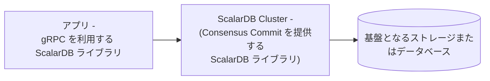

---
tags:
  - Enterprise Standard
  - Enterprise Premium
displayed_sidebar: docsJapanese
---

# ScalarDB Cluster の設定

import TranslationBanner from '/src/components/_translation-ja-jp.mdx';
import Tabs from '@theme/Tabs';
import TabItem from '@theme/TabItem';

<TranslationBanner />

このドキュメントでは、ScalarDB Cluster の設定について説明します。ScalarDB Cluster は複数のクラスターノードで構成されており、各クラスターノードを設定する必要があります。設定はプロパティファイルで指定する必要があります。

## クラスター設定

このセクションでは、ScalarDB Cluster の設定について説明します。

### 一般的な設定

ScalarDB Cluster では、次の一般的な設定が利用可能です。

#### トランザクション管理設定

| 名前                                                   | 説明                                                                                                                                                                                                                                                                                                                                                                                                                                                                                                                                                                              | デフォルト           |
|-------------------------------------------------------|-----------------------------------------------------------------------------------------------------------------------------------------------------------------------------------------------------------------------------------------------------------------------------------------------------------------------------------------------------------------------------------------------------------------------------------------------------------------------------------------------------------------------------------------------------------------------------------|---------------------|
| `scalar.db.transaction_manager`                       | ScalarDB のトランザクションマネージャー。[Consensus Commit](../consensus-commit.mdx) を使用するには `consensus-commit` を指定し、[非トランザクションストレージ操作を実行する](./run-non-transactional-storage-operations-through-scalardb-cluster.mdx) には `single-crud-operation` を指定します。`single-crud-operation` を使用する場合、`scalar.db.consensus_commit` プレフィックスの下の設定は無視されることに注意してください。 | `consensus-commit`  |
| `scalar.db.consensus_commit.isolation_level`          | Consensus Commit に使用される分離レベル。`SNAPSHOT`、`SERIALIZABLE` または `READ_COMMITTED` のいずれかを指定できます。                                                                                                                                                                                                                                                                                                                                                                                                                                                                                     | `SNAPSHOT`          |
| `scalar.db.consensus_commit.coordinator.namespace`    | Consensus Commit に使用される Coordinator テーブルの名前空間名。                                                                                                                                                                                                                                                                                                                                                                                                                                                                                                                                                        | `coordinator`       |

#### ノード設定

| 名前                                                                | 説明                                                                                                                                                                                                                                              | デフォルト        |
|--------------------------------------------------------------------|---------------------------------------------------------------------------------------------------------------------------------------------------------------------------------------------------------------------------------------------------|-----------------|
| `scalar.db.cluster.membership.type`                                | メンバーシップの種類。現在、`KUBERNETES` のみ指定できます。                                                                                                                                                                                               | `KUBERNETES`    |
| `scalar.db.cluster.membership.kubernetes.endpoint.namespace_name`  | この設定は、`KUBERNETES` メンバーシップタイプ用です。[endpoint resource](https://kubernetes.io/docs/concepts/services-networking/service/#endpoints) の名前空間名。                                                                                        | `default`       |
| `scalar.db.cluster.membership.kubernetes.endpoint.name`            | この設定は、`KUBERNETES` メンバーシップタイプ用です。メンバーシップ情報を取得するための [endpoint resource](https://kubernetes.io/docs/concepts/services-networking/service/#endpoints) の名前。                                                                |                 |
| `scalar.db.cluster.node.decommissioning_duration_secs`             | 廃止期間（秒単位）。                                                                                                                                                                                                                                  | `30`            |
| `scalar.db.cluster.node.grpc.max_inbound_message_size`             | 受信可能な最大メッセージサイズ。                                                                                                                                                                                                                       | gRPCのデフォルト値 |
| `scalar.db.cluster.node.grpc.max_inbound_metadata_size`            | 受信できるメタデータの最大サイズ。                                                                                                                                                                                                                     | gRPCのデフォルト値 |
| `scalar.db.cluster.node.port`                                      | ScalarDB Cluster ノードのポート番号。                                                                                                                                                                                                                | `60053`         |
| `scalar.db.cluster.node.prometheus_exporter_port`                  | Prometheus エクスポーターのポート番号。                                                                                                                                                                                                                | `9080`           |
| `scalar.db.cluster.grpc.deadline_duration_millis`                  | gRPC の期限期間（ミリ秒単位）。                                                                                                                                                                                                                        | `60000` (60秒)   |
| `scalar.db.cluster.node.standalone_mode.enabled`                   | スタンドアロンモードが有効かどうか。スタンドアロンモードが有効になっている場合、メンバーシップ設定 (`scalar.db.cluster.membership.*`) は無視されることに注意してください。                                                                                               | `false`          |
| `scalar.db.metadata.cache_expiration_time_secs`                    | ScalarDB には、データベースへのリクエスト数を減らすためのメタデータキャッシュがあります。この設定では、キャッシュの有効期限を秒単位で指定します。`-1`を指定した場合は、キャッシュは期限切れになりません。                                                                          | `60`             |
| `scalar.db.active_transaction_management.expiration_time_millis`   | ScalarDB Cluster ノードは進行中のトランザクションを管理しており、トランザクション IDを使用して再開できます。このプロセスでは、リソースリークを防ぐために長時間アイドル状態のトランザクションを期限切れにします。この設定では、このトランザクション管理機能の有効期限 (ミリ秒単位) を指定します。 | `60000` (60秒)   |

## トランザクションマネージャーの設定

このセクションでは、トランザクションマネージャーの設定について説明します。ScalarDB は、コンセンサスコミットを使用してトランザクションを実行する方法と、非トランザクションストレージ操作を実行する方法を提供します。

### コンセンサスコミットを使用してトランザクションを実行する

ScalarDB は、コンセンサスコミットと呼ばれる独自のトランザクションプロトコルを提供します。これは、ScalarDB のデフォルトのトランザクションマネージャータイプです。コンセンサスコミットトランザクションマネージャーを使用するには、ScalarDB プロパティファイルに次の内容を追加します。

```properties
scalar.db.transaction_manager=consensus-commit
```

:::note

`scalar.db.transaction_manager` プロパティを指定しない場合は、`consensus-commit` がデフォルト値になります。

:::

#### 基本設定

コンセンサスコミットトランザクションマネージャーでは、次の基本設定が利用可能です。

| 名前                                                              | 説明                                                                                                                                                                                                    | デフォルト                |
|-------------------------------------------------------|--------------------------------------------------------------------------------------------------------------------------------------------------------------------------------------------------------------------------------------------------------------------------------------------------------------------------------------------------------------------------------------------------------------|---------------|
| `scalar.db.transaction_manager`                       | `consensus-commit` を指定する必要があります。                                                                                                                                                                                                                                                                                                                                                                      | -             |
| `scalar.db.consensus_commit.isolation_level`          | Consensus Commit で使用される分離レベル。`SNAPSHOT`、`SERIALIZABLE`、または `READ_COMMITTED` のいずれかを指定できます。                                                                                                                                                                                                                                                                                                             | `SNAPSHOT`    |
| `scalar.db.consensus_commit.coordinator.namespace`    | Coordinator テーブルの名前空間名。                                                                                                                                                                                                                                                                                                                                                                        | `coordinator` |
| `scalar.db.consensus_commit.include_metadata.enabled` | `true` に設定すると、`Get` および `Scan` 操作の結果にトランザクションメタデータが含まれます。特定のテーブルのトランザクションメタデータ列の詳細を表示するには、`DistributedTransactionAdmin.getTableMetadata()` メソッドを使用します。このメソッドは、トランザクションメタデータ列が追加されたテーブルメタデータを返します。この設定を使用すると、トランザクション関連の問題を調査するのに役立ちます。 | `false`       |

#### パフォーマンス関連の設定

コンセンサスコミットトランザクションマネージャーでは、次のパフォーマンス関連の設定が利用できます。

| 名前                                                              | 説明                                                                                                                                                                                                    | デフォルト                |
|----------------------------------------------------------------------------------------|-------------------------------------------------------------------------------------------------------------------------------------------------------------------------------------------------------------------------------------------------------------------------------------------|-------------------------------------------------------------------|
| `scalar.db.consensus_commit.parallel_executor_count`                                   | 並列実行のためのエグゼキュータ (スレッド) の数。この数値は、ScalarDB Cluster ノード内または ScalarDB プロセス内のトランザクション全体のスレッド数の合計を示します。                                                                                                                                               | `128`                                                             |
| `scalar.db.consensus_commit.parallel_preparation.enabled`                              | 準備フェーズが並行して実行されるかどうか。                                                                                                                                                                                                                             | `true`                                                            |
| `scalar.db.consensus_commit.parallel_validation.enabled`                               | 検証フェーズ (`EXTRA_READ` 内) が並列で実行されるかどうか。                                                                                                                                                                                                            | `scalar.db.consensus_commit.parallel_commit.enabled` の値 |
| `scalar.db.consensus_commit.parallel_commit.enabled`                                   | コミットフェーズが並列で実行されるかどうか。                                                                                                                                                                                                                                  | `true`                                                            |
| `scalar.db.consensus_commit.parallel_rollback.enabled`                                 | ロールバックフェーズが並列で実行されるかどうか。                                                                                                                                                                                                                                | `scalar.db.consensus_commit.parallel_commit.enabled` の値 |
| `scalar.db.consensus_commit.async_commit.enabled`                                      | コミットフェーズが非同期で実行されるかどうか。                                                                                                                                                                                                                               | `false`                                                           |
| `scalar.db.consensus_commit.async_rollback.enabled`                                    | ロールバックフェーズが非同期に実行されるかどうか。                                                                                                                                                                                                                             | `scalar.db.consensus_commit.async_commit.enabled` の値    |
| `scalar.db.consensus_commit.parallel_implicit_pre_read.enabled`                        | 暗黙的な事前読み取りが並列で実行されるかどうか。                                                                                                                                                                                                                                 | `true`                                                            |
| `scalar.db.consensus_commit.coordinator.group_commit.enabled`                          | トランザクション状態のコミットがバッチモードで実行されるかどうか。この機能は、2フェーズコミットインターフェイスでは使用できません。                                                                                                                                                  | `false`                                                           |
| `scalar.db.consensus_commit.coordinator.group_commit.slot_capacity`                    | グループコミット機能のグループ内のスロットの最大数。値が大きいとグループコミットの効率は向上しますが、待ち時間が増加し、トランザクションの競合が発生する可能性も高くなります。[^1]                                                                                    | `20`                                                              |
| `scalar.db.consensus_commit.coordinator.group_commit.group_size_fix_timeout_millis`    | グループ内のスロットのサイズを固定するためのタイムアウト。値が大きいとグループコミットの効率が向上しますが、待ち時間が増加し、トランザクションの競合が発生する可能性も高くなります。[^1]                                                                                                        | `40`                                                              |
| `scalar.db.consensus_commit.coordinator.group_commit.delayed_slot_move_timeout_millis` | 遅延スロットをグループから別の分離グループに移動して、元のグループが遅延トランザクションの影響を受けないようにするためのタイムアウト。値が大きいとグループコミットの効率が向上しますが、待ち時間が増加し、トランザクションの競合が発生する可能性も高くなります。[^1] | `1200`                                                            |
| `scalar.db.consensus_commit.coordinator.group_commit.old_group_abort_timeout_millis`   | 進行中の古いグループをアボートするためのタイムアウト。値が小さいと、積極的なアボートによってリソースの消費量が減りますが、長時間実行されるトランザクションで不要なアボートが発生する可能性も高くなります。                                                                                    | `60000`                                                           |
| `scalar.db.consensus_commit.coordinator.group_commit.timeout_check_interval_millis`    | グループコミット関連のタイムアウトをチェックする間隔。                                                                                                                                                                                                                                  | `20`                                                              |
| `scalar.db.consensus_commit.coordinator.group_commit.metrics_monitor_log_enabled`      | グループコミットのメトリックが定期的にログに記録されるかどうか。                                                                                                                                                                                                                   | `false`                                                           |

### ストレージ関連の設定

ScalarDB には、複数のストレージ実装をサポートするストレージ（データベース）抽象化レイヤーがあります。`scalar.db.storage` プロパティを使用してストレージ実装を指定できます。

データベースを選択して、各ストレージで使用可能な設定を確認します。

<Tabs groupId="databases" queryString>
  <TabItem value="JDBC_databases" label="JDBC databases" default>
    JDBC データベースでは次の設定を使用できます。

    | 名前                                                      | 説明                                                                                                                                                                  | デフォルト                      |
    |-----------------------------------------------------------|------------------------------------------------------------------------------------------------------------------------------------------------------------------------------|------------------------------|
    | `scalar.db.storage`                                       | `jdbc` を指定する必要があります。                                                                                                                                                    | -                            |
    | `scalar.db.contact_points`                                | JDBC 接続 URL。                                                                                                                                                         |                              |
    | `scalar.db.username`                                      | データベースにアクセスするためのユーザー名。                                                                                                                                             |                              |
    | `scalar.db.password`                                      | データベースにアクセスするためのパスワード。                                                                                                                                             |                              |
    | `scalar.db.jdbc.connection_pool.min_idle`                 | 接続プール内のアイドル接続の最小数。                                                                                                                   | `20`                         |
    | `scalar.db.jdbc.connection_pool.max_idle`                 | 接続プール内でアイドル状態のままにできる接続の最大数。                                                                                                   | `50`                         |
    | `scalar.db.jdbc.connection_pool.max_total`                | 接続プールで同時にアクティブにできるアイドル接続と借用接続の最大合計数。制限がない場合は負の値を使用します。                        | `100`                        |
    | `scalar.db.jdbc.prepared_statements_pool.enabled`         | このプロパティを `true` に設定すると、準備されたステートメントのプールが有効になります。                                                                                                          | `false`                      |
    | `scalar.db.jdbc.prepared_statements_pool.max_open`        | ステートメントプールから同時に割り当てることができるオープンステートメントの最大数。制限がない場合は負の値を使用します。                                         | `-1`                         |
    | `scalar.db.jdbc.isolation_level`                          | JDBC の分離レベル。`READ_UNCOMMITTED`、`READ_COMMITTED`、`REPEATABLE_READ`、または `SERIALIZABLE` を指定できます。                                                       | 基盤データベース固有 |
    | `scalar.db.jdbc.table_metadata.connection_pool.min_idle`  | テーブルメタデータの接続プール内のアイドル接続の最小数。                                                                                            | `5`                          |
    | `scalar.db.jdbc.table_metadata.connection_pool.max_idle`  | テーブルメタデータの接続プール内でアイドル状態のままにできる接続の最大数。                                                                            | `10`                         |
    | `scalar.db.jdbc.table_metadata.connection_pool.max_total` | テーブルメタデータの接続プールで同時にアクティブにできるアイドル接続と借用接続の最大合計数。制限がない場合は負の値を使用します。 | `25`                         |
    | `scalar.db.jdbc.admin.connection_pool.min_idle`           | 管理者の接続プール内のアイドル接続の最小数。                                                                                                         | `5`                          |
    | `scalar.db.jdbc.admin.connection_pool.max_idle`           | 管理者の接続プール内でアイドル状態のままにできる接続の最大数。                                                                                         | `10`                         |
    | `scalar.db.jdbc.admin.connection_pool.max_total`          | 管理者の接続プールで同時にアクティブにできるアイドル接続と借用接続の最大合計数。制限がない場合は負の値を使用します。              | `25`                         |

:::note

SQLite3 を JDBC データベースとして使用している場合は、`scalar.db.contact_points` を次のように設定する必要があります。

```properties
scalar.db.contact_points=jdbc:sqlite:<SQLITE_DB_FILE_PATH>?busy_timeout=10000
```

他の JDBC データベースとは異なり、[SQLite3 doesn't fully support concurrent access](https://www.sqlite.org/lang_transaction.html)。[`SQLITE_BUSY`](https://www.sqlite.org/rescode.html#busy) によって内部的に頻繁に発生するエラーを回避するには、[`busy_timeout`](https://www.sqlite.org/c3ref/busy_timeout.html) パラメータを設定することをお勧めします。

:::
</TabItem>
<TabItem value="DynamoDB" label="DynamoDB">
DynamoDB では次の設定が利用可能です。

    | 名前                                  | 説明                                                                                                                                                                                                                                                 | デフォルト    |
    |---------------------------------------|-------------------------------------------------------------------------------------------------------------------------------------------------------------------------------------------------------------------------------------------------------------|------------|
    | `scalar.db.storage`                   | `dynamo` を指定する必要があります。                                                                                                                                                                                                                                 | -          |
    | `scalar.db.contact_points`            | ScalarDB が通信する AWS リージョン (例: `us-east-1`)。                                                                                                                                                                                      |            |
    | `scalar.db.username`                  | AWS とやり取りするユーザーを識別するために使用される AWS アクセスキー。                                                                                                                                                                                              |            |
    | `scalar.db.password`                  | AWS と対話するユーザーを認証するために使用される AWS シークレットアクセスキー。                                                                                                                                                                                   |            |
    | `scalar.db.dynamo.endpoint_override`  | ScalarDB が通信する Amazon DynamoDB エンドポイント。これは主に、AWS サービスではなくローカルインスタンスでのテストに使用されます。                                                                                                        |            |
    | `scalar.db.dynamo.namespace.prefix`   | ユーザー名前空間とメタデータ名前空間名のプレフィックス。AWS では単一の AWS リージョン内で一意のテーブル名を持つ必要があるため、単一の AWS リージョン内で複数の ScalarDB 環境 (開発、本番など) を使用する場合に便利です。 |            |
  </TabItem>
  <TabItem value="Cosmos_DB_for_NoSQL" label="Cosmos DB for NoSQL">
    CosmosDB for NoSQL では次の設定が利用可能です。

    | 名前                                 | 説明                                                                                              | デフォルト  |
    |--------------------------------------|----------------------------------------------------------------------------------------------------------|----------|
    | `scalar.db.storage`                  | `cosmos` を指定する必要があります。                                                                              | -        |
    | `scalar.db.contact_points`           | ScalarDB が通信する NoSQL エンドポイント用の Azure Cosmos DB。                               |          |
    | `scalar.db.password`                 | Azure Cosmos DB for NoSQL にアクセスするための認証を実行するために使用されるマスターキーまたは読み取り専用キーのいずれか。 |          |
    | `scalar.db.cosmos.consistency_level` | Cosmos DB 操作に使用される一貫性レベル。`STRONG` または `BOUNDED_STALENESS` を指定できます。       | `STRONG` |
  </TabItem>
  <TabItem value="Cassandra" label="Cassandra">
    Cassandra では次の設定が利用可能です。

    | 名前                                    | 説明                                                           | デフォルト    |
    |-----------------------------------------|-----------------------------------------------------------------------|------------|
    | `scalar.db.storage`                     | `cassandra` を指定する必要があります。                                        | -          |
    | `scalar.db.contact_points`              | カンマで区切られた連絡先。                                       |            |
    | `scalar.db.contact_port`                | すべての連絡先ポイントのポート番号。                               |            |
    | `scalar.db.username`                    | データベースにアクセスするためのユーザー名。                                      |            |
    | `scalar.db.password`                    | データベースにアクセスするためのパスワード。                                      |            |
  </TabItem>
</Tabs>

#### マルチストレージのサポート

ScalarDB は、複数のストレージ実装を同時に使用することをサポートしています。`scalar.db.storage` プロパティの値として `multi-storage` を指定すると、複数のストレージを使用できます。

複数のストレージの使用の詳細については、[マルチストレージトランザクション](../multi-storage-transactions.mdx)を参照してください。

##### パーティション間スキャン設定

以下で説明するようにパーティション間スキャンオプションを有効にすると、`Scan` 操作でパーティション全体のすべてのレコードを取得できます。さらに、`cross_partition_scan.filtering` と `cross_partition_scan.ordering` をそれぞれ有効にすることで、パーティション間 `Scan` 操作で任意の条件と順序を指定できます。現在、順序付けオプション付きのパーティション間スキャンは、JDBC データベースでのみ使用できます。フィルタリングと順序付けを有効にするには、`scalar.db.cross_partition_scan.enabled` を `true` に設定する必要があります。

パーティション間スキャンの使用方法の詳細については、[スキャン操作](../api-guide.mdx#スキャン操作)を参照してください。

:::warning

非 JDBC データベースの場合、トランザクションはより低い分離レベル (つまり、`SNAPSHOT`) で実行される可能性があるため、`SERIALIAZABLE` 分離レベルでパーティション間スキャンを有効にすることはお勧めしません。非 JDBC データベースを使用する場合は、トランザクションの一貫性が重要でない場合にのみ、自己責任でパーティション間スキャンを使用してください。

:::

| 名前                                               | 説明                                   | デフォルト |
|----------------------------------------------------|-----------------------------------------------|---------|
| `scalar.db.cross_partition_scan.enabled`           | パーティション間スキャンを有効にします。                  | `false` |
| `scalar.db.cross_partition_scan.filtering.enabled` | パーティション間スキャンでフィルタリングを有効にします。     | `false` |
| `scalar.db.cross_partition_scan.ordering.enabled`  | パーティション間スキャンで順序付けを有効にします。      | `false` |

## ScalarDB Cluster GraphQL の設定

ScalarDB Cluster GraphQL の設定は次のとおりです。

| 名前                                                | 説明                                                                                                                                                                                              | デフォルト              |
|-----------------------------------------------------|----------------------------------------------------------------------------------------------------------------------------------------------------------------------------------------------------------|----------------------|
| `scalar.db.graphql.enabled`                         | ScalarDB Cluster GraphQL が有効かどうか。                                                                                                                                                             | `false`              |
| `scalar.db.graphql.port`                            | GraphQL サーバーのポート番号。                                                                                                                                                                       | `8080`               |
| `scalar.db.graphql.path`                            | GraphQL エンドポイントの URL のパスコンポーネント。                                                                                                                                                       | `/graphql`           |
| `scalar.db.graphql.namespaces`                      | GraphQL サーバーがスキーマを生成するテーブルの名前空間のコンマ区切りリスト。指定しない場合、GraphQL サーバーは、すべての ScalarDB 管理名前空間内のすべてのテーブルのスキーマを生成します。 |                      |
| `scalar.db.graphql.graphiql`                        | GraphQL サーバーが [GraphiQL](https://github.com/graphql/graphiql) IDE を提供するかどうか。                                                                                                                   | `true`               |
| `scalar.db.graphql.schema_checking_interval_millis` | ScalarDB スキーマに変更が検出された場合に GraphQL サーバーが GraphQL スキーマを再構築する間隔 (ミリ秒単位)。                                                                       | `30000` (30秒) |

#### サーバーの実行中に ScalarDB スキーマを作成または変更する

GraphQL スキーマはサーバーの起動時に静的に構築されるため、ScalarDB スキーマが変更された場合 (たとえば、テーブルが追加、変更、または削除された場合)、対応する GraphQL スキーマは再構築されない限り変更を反映しません。これに対処するために、GraphQL サーバーは、定期的なチェックとオンデマンドチェックの2つのメカニズムを提供します。

##### 定期的なチェックを実行する

サーバーは、ScalarDB スキーマに変更が発生したかどうかを定期的にチェックし、必要に応じて対応する GraphQL スキーマを再構築します。デフォルトでは、チェックは30秒ごとに行われますが、間隔は `scalar.db.graphql.schema_checking_interval_millis` プロパティを使用して設定できます。

定期的なチェックを実行する必要がない場合は、プロパティ値を `-1` に設定して無効にすることができます。

##### オンデマンドチェックを実行する

また、HTTP API の `/update-graphql-schema` エンドポイントに POST リクエストを実行して、サーバーに ScalarDB スキーマの変更をチェックし、必要に応じて対応する GraphQL スキーマを再構築するように要求することもできます。

たとえば、HTTP API が `localhost:8080` で実行されていて、`scalar.db.graphql.path` プロパティが `/graphql` に設定されている場合、次のコマンドを実行してこのエンドポイントを呼び出すことができます。

```console
curl -X POST http://localhost:8080/graphql/update-graphql-schema
```

### SQL 関連の設定

ScalarDB Cluster SQL の設定は次のとおりです。

| 名前                                     | 説明                                                                                              | デフォルト       |
|------------------------------------------|----------------------------------------------------------------------------------------------------------|---------------|
| `scalar.db.sql.enabled`                  | ScalarDB Cluster SQL が有効かどうか。                                                                 | `false`       |
| `scalar.db.sql.statement_cache.enabled`  | ステートメントキャッシュを有効にします。                                                                              | `false`       |
| `scalar.db.sql.statement_cache.size`     | キャッシュされたステートメントの最大数。                                                                     | `100`         |
| `scalar.db.sql.default_transaction_mode` | デフォルトのトランザクションモード。`TRANSACTION` または `TWO_PHASE_COMMIT_TRANSACTION` を設定できます。                    | `TRANSACTION` |
| `scalar.db.sql.default_namespace_name`   | デフォルトの名前空間名。SQL ステートメントで名前空間名を指定しない場合は、この値が使用されます。 |               |

## その他の ScalarDB Cluster 設定

ScalarDB Cluster で使用できる追加の設定は次のとおりです。

| 名前                                                              | 説明                                                                                                                                                                                                                                                                                                                                           | デフォルト         |
|------------------------------------------------------------------|------------------------------------------------------------------------------------------------------------------------------------------------------------------------------------------------------------------------------------------------------------------------------------------------------------------------------------------------|------------------|
| `scalar.db.metadata.cache_expiration_time_secs`                  | ScalarDB には、データベースへのリクエスト数を減らすためのメタデータキャッシュがあります。この設定では、キャッシュの有効期限を秒単位で指定します。`-1`を指定した場合は、キャッシュは期限切れになりません。                                                                                                                                                                      | `60`              |
| `scalar.db.active_transaction_management.expiration_time_millis` | ScalarDB は進行中のトランザクションを管理しており、トランザクション ID を使用して再開できます。このプロセスは、リソースリークを防ぐために、長時間アイドル状態のトランザクションを期限切れにします。この設定は、このトランザクション管理機能の有効期限をミリ秒単位で指定します。                                                                                                                                                                                                    | `60000` (60秒) |
| `scalar.db.consensus_commit.include_metadata.enabled`            | Consensus Commit を使用している場合に、`true` に設定すると、`Get` および `Scan` 操作の結果にトランザクションメタデータが含まれます。特定のテーブルのトランザクションメタデータ列の詳細を表示するには、`DistributedTransactionAdmin.getTableMetadata()` メソッドを使用します。このメソッドは、トランザクションメタデータ列が追加されたテーブルメタデータを返します。この設定を使用すると、トランザクション関連の問題を調査するのに役立ちます。 | `false`          |
| `scalar.db.default_namespace_name`                               | 指定された名前空間名は、名前空間を指定していない操作によって使用されます。                                                                                                                                                                                                                                                                                  |                  |

## クライアント設定

このセクションでは、ScalarDB Cluster クライアントの一般的な設定について説明します。

### プリミティブインターフェイスの設定

次の表は、ScalarDB Cluster クライアントの一般的な設定を示しています。

| 名前                                               | 説明                                                                                                                                                                                                                                                                                                                                                                                                                                                                                                                                                                                                                                                            | デフォルト                |
|----------------------------------------------------|------------------------------------------------------------------------------------------------------------------------------------------------------------------------------------------------------------------------------------------------------------------------------------------------------------------------------------------------------------------------------------------------------------------------------------------------------------------------------------------------------------------------------------------------------------------------------------------------------------------------------------------------------------------------|------------------------|
| `scalar.db.transaction_manager`                    | `cluster` を指定する必要があります。                                                                                                                                                                                                                                                                                                                                                                                                                                                                                                                                                                                                                                         | -                      |
| `scalar.db.contact_points`                         | クラスターの接続先。`indirect` クライアントモードを使用する場合は、`indirect:<LOAD_BALANCER_IP_ADDRESS>` 形式を使用して、クラスターノードの前にあるロードバランサーの IP アドレスを指定します。`direct-kubernetes` クライアントモードを使用する場合は、`direct-kubernetes:<NAMESPACE_NAME>/<ENDPOINT_NAME>` または `direct-kubernetes:<ENDPOINT_NAME>` 形式を使用して、メンバーシップ情報を取得するための名前空間名 (オプション) と [endpoint resource](https://kubernetes.io/docs/concepts/services-networking/service/#endpoints) の名前を指定します。名前空間名を指定しない場合、クライアントは `default` 名前空間を使用します。 |                        |  
| `scalar.db.contact_port`                           | 接続先のポート番号。                                                                                                                                                                                                                                                                                                                                                                                                                                                                                                                                                                                                                                                     | `60053`                |
| `scalar.db.cluster.grpc.deadline_duration_millis`  | gRPC の期限期間 (ミリ秒単位)。                                                                                                                                                                                                                                                                                                                                                                                                                                                                                                                                                                                                                                                  | `60000` (60秒)   |
| `scalar.db.cluster.grpc.max_inbound_message_size`  | 単一の gRPC フレームに許可される最大メッセージサイズ。                                                                                                                                                                                                                                                                                                                                                                                                                                                                                                                                                                                                                                  | gRPC のデフォルト値 |
| `scalar.db.cluster.grpc.max_inbound_metadata_size` | 受信できるメタデータの最大サイズ。                                                                                                                                                                                                                                                                                                                                                                                                                                                                                                                                                                                                                                       | gRPC のデフォルト値 |

たとえば、`indirect` クライアントモードを使用し、ロードバランサーの IP アドレスが `192.168.10.1` の場合、次のようにクライアントを設定できます。

```properties
scalar.db.transaction_manager=cluster
scalar.db.contact_points=indirect:192.168.10.1
```

または、`direct-kubernetes` クライアントモードを使用し、エンドポイントの名前空間が `ns`、エンドポイント名が `scalardb-cluster` の場合、次のようにクライアントを設定できます。

```properties
scalar.db.transaction_manager=cluster
scalar.db.contact_points=direct-kubernetes:ns/scalardb-cluster
```

### SQL インターフェイスの設定

次の表は、ScalarDB Cluster SQL クライアントの設定を示しています。

| 名前                                               | 説明                                                                                                                                                                                                                                                                                                                                                                                                                                                                                                                                                                                                                                                            | デフォルト                |
|----------------------------------------------------|------------------------------------------------------------------------------------------------------------------------------------------------------------------------------------------------------------------------------------------------------------------------------------------------------------------------------------------------------------------------------------------------------------------------------------------------------------------------------------------------------------------------------------------------------------------------------------------------------------------------------------------------------------------------|------------------------|
| `scalar.db.sql.cluster_mode.contact_points`        | クラスターの接続先。`indirect` クライアントモードを使用する場合は、`indirect:<LOAD_BALANCER_IP_ADDRESS>` 形式を使用して、クラスターノードの前にあるロードバランサーの IP アドレスを指定します。`direct-kubernetes` クライアントモードを使用する場合は、`direct-kubernetes:<NAMESPACE_NAME>/<ENDPOINT_NAME>` または `direct-kubernetes:<ENDPOINT_NAME>` 形式を使用して、メンバーシップ情報を取得するための名前空間名 (オプション) と [endpoint resource](https://kubernetes.io/docs/concepts/services-networking/service/#endpoints) の名前を指定します。名前空間名を指定しない場合、クライアントは `default` 名前空間を使用します。 |                        |
| `scalar.db.sql.cluster_mode.contact_port`          | 接続先のポート番号。                                                                                                                                                                                                                                                                                                                                                                                                                                                                                                                                                                                                                                                     | `60053`                |
| `scalar.db.sql.default_transaction_mode`           | デフォルトのトランザクションモード。`TRANSACTION` または `TWO_PHASE_COMMIT_TRANSACTION` を設定できます。                                                                                                                                                                                                                                                                                                                                                                                                                                                                                                                                                                                  | `TRANSACTION`          |
| `scalar.db.sql.default_namespace_name`             | デフォルトの名前空間名。SQL ステートメントで名前空間名を指定しない場合は、この値が使用されます。                                                                                                                                                                                                                                                                                                                                                                                                                                                                                                                                                                               |                        |
| `scalar.db.cluster.grpc.deadline_duration_millis`  | gRPC の期限期間 (ミリ秒単位)。                                                                                                                                                                                                                                                                                                                                                                                                                                                                                                                                                                                                                                                  | `60000` (60秒)   |
| `scalar.db.cluster.grpc.max_inbound_message_size`  | 単一の gRPC フレームに許可される最大メッセージサイズ。                                                                                                                                                                                                                                                                                                                                                                                                                                                                                                                                                                                                                                  | gRPC のデフォルト値 |
| `scalar.db.cluster.grpc.max_inbound_metadata_size` | 受信できるメタデータの最大サイズ。                                                                                                                                                                                                                                                                                                                                                                                                                                                                                                                                                                                                                                       | gRPC のデフォルト値 |

たとえば、`indirect` クライアントモードを使用し、ロードバランサーの IP アドレスが `192.168.10.1` の場合、次のようにクライアントを設定できます。

```properties
scalar.db.sql.connection_mode=cluster
scalar.db.sql.cluster_mode.contact_points=indirect:192.168.10.1
```

または、`direct-kubernetes` クライアントモードを使用し、エンドポイントの名前空間が `ns`、エンドポイント名が `scalardb-cluster` の場合、次のようにクライアントを設定できます。

```properties
scalar.db.sql.connection_mode=cluster
scalar.db.sql.cluster_mode.contact_points=direct-kubernetes:ns/scalardb-cluster
```

ScalarDB JDBC の設定方法の詳細については、[JDBC 接続 URL](../scalardb-sql/jdbc-guide.mdx#jdbc-接続-url) を参照してください。

Spring Data JDBC for ScalarDB の設定方法の詳細については、[設定](../scalardb-sql/spring-data-guide.mdx#設定)を参照してください。

## 設定例 - アプリ、ScalarDB Cluster、データベース



この設定例では、アプリ (gRPC を利用する ScalarDB ライブラリ) が ScalarDB Cluster を通じて基盤となるストレージまたはデータベース (この場合は Cassandra) に接続しています。ScalarDB Cluster は、ScalarDB Enterprise エディションでのみ利用可能なコンポーネントです。

:::note

この設定は、ScalarDB Cluster が [Scalar Admin](https://github.com/scalar-labs/scalar-admin) インターフェースを実装しているため、本番環境での使用に適しています。このインターフェースにより、ScalarDB Cluster を一時停止することで、ScalarDB のトランザクション的に一貫性のあるバックアップを作成できます。

:::

アプリを ScalarDB Cluster を通じて基盤となるデータベースに接続する設定例を以下に示します。

```properties
# トランザクションマネージャーの実装。
scalar.db.transaction_manager=cluster

# クラスターの接続先。
scalar.db.contact_points=indirect:<SCALARDB_CLUSTER_CONTACT_POINT>
```

クライアント設定の詳細については、[ScalarDB Cluster クライアント設定](#クライアント設定) を参照してください。

[^1]: アプリケーションのアクセスパターンを考慮し、アプリケーションで使用するストレージと同じストレージを使用して、いくつかのバリエーション（例：デフォルト値の75%と125%）でパフォーマンスをベンチマークし、最適な設定を決定することをお勧めします。適切な設定は、これらの要素に強く依存して決まります。また、最適な組み合わせを決定するために、これらのパラメータの組み合わせをベンチマークすることも重要です（例：最初に `slot_capacity:20` と `group_size_fix_timeout_millis:40`、次に `slot_capacity:30` と `group_size_fix_timeout_millis:40`、3番目に `slot_capacity:20` と `group_size_fix_timeout_millis:80`）。
