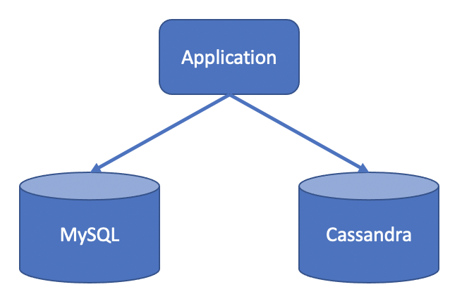
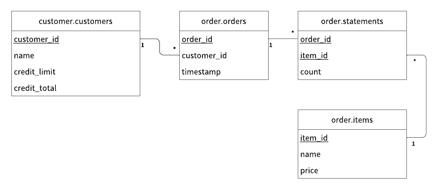

---
tags:
  - Community
  - Enterprise Standard
  - Enterprise Premium
---

# マルチストレージトランザクションをサポートするサンプルアプリケーションを作成する

import TranslationBanner from '/src/components/_translation-ja-jp.mdx';

<TranslationBanner />

このチュートリアルでは、ScalarDB のマルチストレージトランザクション機能をサポートするサンプルアプリケーションを作成する方法について説明します。

## 概要

このチュートリアルでは、ScalarDB の[マルチストレージトランザクション](../../multi-storage-transactions.mdx)機能を使用して、アイテムを注文し、信用枠で支払うことができるサンプル電子商取引アプリケーションを作成するプロセスを示します。

このチュートリアルでは、Cassandra と MySQL の両方を使用するアプリケーションを構築します。ScalarDB のマルチストレージトランザクション機能を使用すると、Cassandra と MySQL の両方にまたがるトランザクションを実行できます。



:::note

サンプルアプリケーションは ScalarDB の使用方法を示すことに重点を置いているため、アプリケーション固有のエラー処理、認証処理、および同様の機能はサンプルアプリケーションに含まれていません。ScalarDB での例外処理の詳細については、[例外の処理方法](../../api-guide.mdx#例外の処理方法)を参照してください。

:::

### このサンプルアプリケーションで実行できること

サンプルアプリケーションは、次の種類のトランザクションをサポートしています:

- 顧客情報を取得します。
- 信用枠を使用して注文を行います。
  - 注文のコストが顧客の信用限度額を下回っているかどうかを確認します。
  - チェックが成功した場合は、注文履歴を記録し、顧客が支払った金額を更新します。
- 注文 ID で注文情報を取得します。
- 顧客 ID で注文情報を取得します。
- 支払いを行います。
  - 顧客が支払った金額を減らします。

## このサンプルアプリケーションの前提条件

- [Eclipse Temurin](https://adoptium.net/temurin/releases/) の OpenJDK LTS バージョン (8、11、17、または 21)
- [Docker](https://www.docker.com/get-started/) 20.10 以降 ([Docker Compose](https://docs.docker.com/compose/install/) V2 以降)

:::note

このサンプルアプリケーションは、Eclipse Temurin の OpenJDK でテストされています。ただし、ScalarDB 自体は、さまざまなベンダーの JDK ディストリビューションでテストされています。互換性のある JDK ディストリビューションを含む ScalarDB の要件の詳細については、[要件](../../requirements.mdx)を参照してください。

:::

## ScalarDB のセットアップ

次のセクションでは、ScalarDB のマルチストレージトランザクション機能をサポートするサンプルアプリケーションをセットアップする方法について説明します。

### ScalarDB サンプルリポジトリをクローンする

**ターミナル** を開き、次のコマンドを実行して ScalarDB サンプルリポジトリをクローンします。

```console
git clone https://github.com/scalar-labs/scalardb-samples
```

次に、次のコマンドを実行して、サンプルアプリケーションが含まれているディレクトリに移動します。

```console
cd scalardb-samples/multi-storage-transaction-sample
```

### Cassandra と MySQL を起動します

[`database.properties`](https://github.com/scalar-labs/scalardb-samples/tree/master/multi-storage-transaction-sample/database.properties) に示されているように、Cassandra と MySQL はサンプルアプリケーション用にすでに設定されています。ScalarDB のマルチストレージトランザクション機能の設定の詳細については、[マルチストレージトランザクションをサポートするように ScalarDB を設定する方法](../../multi-storage-transactions.mdx#マルチストレージトランザクションをサポートするように-scalardb-を設定する方法)を参照してください。

サンプルアプリケーションの Docker コンテナに含まれている Cassandra と MySQL を起動するには、Docker が実行されていることを確認してから、次のコマンドを実行します。

```console
docker-compose up -d
```

:::note

開発環境によっては、Docker コンテナの起動に 1 分以上かかる場合があります。

:::

### スキーマをロードする

サンプルアプリケーションのデータベーススキーマ (データを整理する方法) は、すでに [`schema.json`](https://github.com/scalar-labs/scalardb-samples/tree/master/multi-storage-transaction-sample/schema.json) で定義されています。

スキーマを適用するには、[ScalarDB リリース](https://github.com/scalar-labs/scalardb/releases)ページに移動し、使用する ScalarDB のバージョンに一致する ScalarDB Schema Loader を `scalardb-samples/multi-storage-transaction-sample` フォルダーにダウンロードします。

次に、次のコマンドを実行します。`<VERSION>` は、ダウンロードした ScalarDB Schema Loader のバージョンに置き換えます。

```console
java -jar scalardb-schema-loader-<VERSION>.jar --config database.properties --schema-file schema.json --coordinator
```

#### スキーマの詳細

サンプルアプリケーションの [`schema.json`](https://github.com/scalar-labs/scalardb-samples/tree/master/multi-storage-transaction-sample/schema.json) に示されているように、すべてのテーブルは `customer` および `order` 名前空間に作成されます。

- `customer.customers`: 顧客の情報を管理するテーブル
  - `credit_limit`: 貸し手が各顧客に信用枠の使用を許可する最大金額
  - `credit_total`: 各顧客が信用枠を使用してすでに使用した金額
- `order.orders`: 注文情報を管理するテーブル
- `order.statements`: 注文明細情報を管理するテーブル
- `order.items`: 注文するアイテムの情報を管理するテーブル

スキーマのエンティティリレーションシップダイアグラムは次のとおりです。



### 初期データをロードする

Docker コンテナが起動したら、次のコマンドを実行して初期データをロードします。

```console
./gradlew run --args="LoadInitialData"
```

初期データがロードされた後、次のレコードがテーブルに保存される必要があります。

**`customer.customers` テーブル**

| customer_id | name          | credit_limit | credit_total |
|-------------|---------------|--------------|--------------|
| 1           | Yamada Taro   | 10000        | 0            |
| 2           | Yamada Hanako | 10000        | 0            |
| 3           | Suzuki Ichiro | 10000        | 0            |

**`order.items` テーブル**

| item_id | name   | price |
|---------|--------|-------|
| 1       | Apple  | 1000  |
| 2       | Orange | 2000  |
| 3       | Grape  | 2500  |
| 4       | Mango  | 5000  |
| 5       | Melon  | 3000  |

## サンプルアプリケーションでトランザクションを実行し、データを取得する

次のセクションでは、サンプル電子商取引アプリケーションでトランザクションを実行し、データを取得する方法について説明します。

### 顧客情報を取得する

次のコマンドを実行して、ID が `1` である顧客に関する情報を取得することから始めます。

```console
./gradlew run --args="GetCustomerInfo 1"
```

次の出力が表示されます。

```console
...
{"id": 1, "name": "Yamada Taro", "credit_limit": 10000, "credit_total": 0}
...
```

### 注文する

次に、次のコマンドを実行して、顧客 ID `1` にリンゴ 3 個とオレンジ 2 個を注文してもらいます。

:::note

このコマンドの注文形式は `./gradlew run --args="PlaceOrder <CUSTOMER_ID> <ITEM_ID>:<COUNT>,<ITEM_ID>:<COUNT>,..."` です。

:::

```console
./gradlew run --args="PlaceOrder 1 1:3,2:2"
```

以下のように、`order_id` の UUID が異なる、注文が成功したことを示す出力が表示されます。

```console
...
{"order_id": "dea4964a-ff50-4ecf-9201-027981a1566e"}
...
```

### 注文の詳細を確認する

次のコマンドを実行して注文の詳細を確認します。`<ORDER_ID_UUID>` は、前のコマンドを実行した後に表示される `order_id` の UUID に置き換えます。

```console
./gradlew run --args="GetOrder <ORDER_ID_UUID>"
```

`order_id` と `timestamp` の UUID が異なる、以下のような出力が表示されます。

```console
...
{"order": {"order_id": "dea4964a-ff50-4ecf-9201-027981a1566e","timestamp": 1650948340914,"customer_id": 1,"customer_name": "Yamada Taro","statement": [{"item_id": 1,"item_name": "Apple","price": 1000,"count": 3,"total": 3000},{"item_id": 2,"item_name": "Orange","price": 2000,"count": 2,"total": 4000}],"total": 7000}}
...
```

### 別の注文をする

次のコマンドを実行して、顧客 ID `1` の `credit_total` の残額を使用してメロン 1 個を注文します。

```console
./gradlew run --args="PlaceOrder 1 5:1"
```

以下のように、`order_id` の UUID が異なる、注文が成功したことを示す出力が表示されます。

```console
...
{"order_id": "bcc34150-91fa-4bea-83db-d2dbe6f0f30d"}
...
```

### 注文履歴を確認する

次のコマンドを実行して、顧客 ID `1` のすべての注文履歴を取得します。

```console
./gradlew run --args="GetOrders 1"
```

`order_id` と `timestamp` の UUID が異なる以下のような出力が表示されます。これは、顧客 ID `1` のすべての注文履歴をタイムスタンプの降順で表示します。

```console
...
{"order": [{"order_id": "dea4964a-ff50-4ecf-9201-027981a1566e","timestamp": 1650948340914,"customer_id": 1,"customer_name": "Yamada Taro","statement": [{"item_id": 1,"item_name": "Apple","price": 1000,"count": 3,"total": 3000},{"item_id": 2,"item_name": "Orange","price": 2000,"count": 2,"total": 4000}],"total": 7000},{"order_id": "bcc34150-91fa-4bea-83db-d2dbe6f0f30d","timestamp": 1650948412766,"customer_id": 1,"customer_name": "Yamada Taro","statement": [{"item_id": 5,"item_name": "Melon","price": 3000,"count": 1,"total": 3000}],"total": 3000}]}
...
```

### クレジット合計の確認

次のコマンドを実行して、顧客 ID `1` のクレジット合計を取得します。

```console
./gradlew run --args="GetCustomerInfo 1"
```

次の出力が表示されます。これは、顧客 ID `1` が `credit_total` の `credit_limit` に達しており、これ以上注文できないことを示しています。

```console
...
{"id": 1, "name": "Yamada Taro", "credit_limit": 10000, "credit_total": 10000}
...
```

次のコマンドを実行して、ブドウ 1 個とマンゴー 1 個を注文してみます。

```console
./gradlew run --args="PlaceOrder 1 3:1,4:1"
```

次の出力が表示されます。これは、`credit_total` 金額が `credit_limit` 金額を超えたために注文が失敗したことを示しています。

```console
...
java.lang.RuntimeException: Credit limit exceeded
        at sample.Sample.placeOrder(Sample.java:205)
        at sample.command.PlaceOrderCommand.call(PlaceOrderCommand.java:33)
        at sample.command.PlaceOrderCommand.call(PlaceOrderCommand.java:8)
        at picocli.CommandLine.executeUserObject(CommandLine.java:1783)
        at picocli.CommandLine.access$900(CommandLine.java:145)
        at picocli.CommandLine$RunLast.handle(CommandLine.java:2141)
        at picocli.CommandLine$RunLast.handle(CommandLine.java:2108)
        at picocli.CommandLine$AbstractParseResultHandler.execute(CommandLine.java:1975)
        at picocli.CommandLine.execute(CommandLine.java:1904)
        at sample.command.SampleCommand.main(SampleCommand.java:35)
...
```

### 支払いを行う

注文を続行するには、顧客 ID `1` が支払いを行って `credit_total` の金額を減らす必要があります。

次のコマンドを実行して支払いを行います。

```console
./gradlew run --args="Repayment 1 8000"
```

次に、次のコマンドを実行して、顧客 ID `1` の `credit_total` 金額を確認します。

```console
./gradlew run --args="GetCustomerInfo 1"
```

次の出力が表示されます。これは、顧客 ID `1` に支払いが適用され、`credit_total` の金額が減ったことを示しています。

```console
...
{"id": 1, "name": "Yamada Taro", "credit_limit": 10000, "credit_total": 2000}
...
```

顧客 ID `1` が支払いを済ませたので、次のコマンドを実行してブドウ 1 個とメロン 1 個を注文します。

```console
./gradlew run --args="PlaceOrder 1 3:1,4:1"
```

以下のように、`order_id` の UUID が異なる、注文が成功したことを示す出力が表示されます。

```console
...
{"order_id": "8911cab3-1c2b-4322-9386-adb1c024e078"}
...
```

## サンプルアプリケーションを停止します

サンプルアプリケーションを停止するには、次のコマンドを実行して Docker コンテナを停止します。

```console
docker-compose down
```
