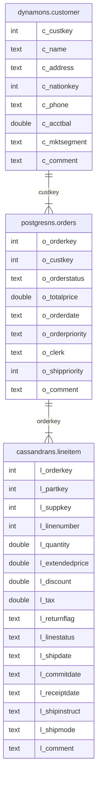

---
tags:
  - Community
---

# ScalarDB Analytics with PostgreSQL を使用してサンプルデータに対して分析クエリを実行する

import TranslationBanner from '/src/components/_translation-ja-jp.mdx';

<TranslationBanner />

このチュートリアルでは、ScalarDB Analytics with PostgreSQL を使用してサンプルデータに対して分析クエリを実行する方法について説明します。

## 概要

このサンプルチュートリアルでは、単一テーブルクエリと複数テーブルクエリの 2 種類のクエリを実行する方法を示します。

### このサンプルチュートリアルで実行できること

このサンプルチュートリアルでは、次の種類のクエリを実行する方法を示します。

- データを読み取り、要約を計算します。
- 複数のストレージにまたがるテーブルを結合します。

:::note

このサンプルチュートリアルでインポートされたテーブルに対して、PostgreSQL がサポートする任意のクエリを実行できます。ScalarDB Analytics with PostgreSQL は PostgreSQL がサポートするすべてのクエリをサポートしているため、例に示されている結合、集計、フィルタリング、順序付けだけでなく、ウィンドウ関数、ラテラル結合、さまざまな分析操作も使用できます。

PostgreSQL がサポートするクエリの種類を確認するには、[PostgreSQL ドキュメント](https://www.postgresql.org/docs/current/index.html)を参照してください。

:::

## 前提条件

- [Docker](https://www.docker.com/get-started/) 20.10 以降、および [Docker Compose](https://docs.docker.com/compose/install/) V2 以降
- [psql](https://www.postgresql.org/docs/current/app-psql.html)

## ScalarDB Analytics with PostgreSQL を設定する

まず、ScalarDB Analytics with PostgreSQL を使用して分析クエリを実行するためにデータベースを設定する必要があります。まだデータベースを設定していない場合は、[ScalarDB Analytics with PostgreSQL の使用開始](../../scalardb-analytics-postgresql/getting-started.mdx)の手順に従ってください。

### ScalarDB のスキーマの詳細

このサンプルチュートリアルでは、ScalarDB データベースに次のスキーマを持つテーブルがあります。



参考までに、この図には次の内容が示されています。

- `dynamons`、`postgresns`、`cassandrans`。それぞれ DynamoDB、PostgreSQL、Cassandra のバックエンドストレージにマップされる名前空間。
- `dynamons.customer`。顧客に関する情報を表すテーブル。このテーブルには、顧客キー、名前、住所、電話番号、口座残高などの属性が含まれます。
- `postgresns.orders`。顧客が行った注文に関する情報を含むテーブル。このテーブルには、注文キー、顧客キー、注文ステータス、注文日、注文優先度などの属性が含まれます。
- `cassandrans.lineitem`。注文に関連付けられた明細項目を表すテーブル。このテーブルには、注文キー、部品キー、サプライヤーキー、数量、価格、出荷日などの属性が含まれます。

### PostgreSQL のスキーマの詳細

ScalarDB の設定時にスキーマインポーターを実行すると、ScalarDB データベースのテーブルスキーマを PostgreSQL データベースにインポートできます。より正確には、ScalarDB データベースの各 `namespace_name.table_name` テーブルに対して、PostgreSQL データベースに `namespace_name._table_name` の外部テーブルと `namespace_name.table_name` のビューが作成されます。

作成された外部テーブルには、ScalarDB テーブルと同じ列と、ScalarDB が内部で管理するトランザクションメタデータ列が含まれます。作成されたビューは、外部テーブルからトランザクションメタデータ列を除外するように定義されているため、作成されたビューには ScalarDB テーブルと同じ列のみが含まれます。

ScalarDB テーブルのスキーマは `schema.json` にあります。たとえば、`dynamons.customer` テーブルは次のように定義されています。

```json
  "dynamons.customer": {
    "transaction": true,
    "partition-key": [
      "c_custkey"
    ],
    "columns": {
      "c_custkey": "INT",
      "c_name": "TEXT",
      "c_address": "TEXT",
      "c_nationkey": "INT",
      "c_phone": "TEXT",
      "c_acctbal": "DOUBLE",
      "c_mktsegment": "TEXT",
      "c_comment": "TEXT"
    }
  },
```

PostgreSQL データベース内の `dynamons._customer` の外部テーブルを表示するには、次のコマンドを実行し、プロンプトが表示されたら PostgreSQL ユーザーパスワードを入力します。

```console
psql -U postgres -h localhost test -c '\d dynamons._customer';
```

パスワードを入力すると、次の出力が表示されます。これには、`dynamons.customer` テーブルと同じ `c_` 列が表示されます。

```console
                            Foreign table "dynamons._customer"
         Column         |       Type       | Collation | Nullable | Default | FDW options
------------------------+------------------+-----------+----------+---------+-------------
 c_custkey              | integer          |           |          |         |
 c_name                 | text             |           |          |         |
 c_address              | text             |           |          |         |
 c_nationkey            | integer          |           |          |         |
 c_phone                | text             |           |          |         |
 c_acctbal              | double precision |           |          |         |
 c_mktsegment           | text             |           |          |         |
 c_comment              | text             |           |          |         |
 tx_id                  | text             |           |          |         |
 tx_version             | integer          |           |          |         |
 tx_state               | integer          |           |          |         |
 tx_prepared_at         | bigint           |           |          |         |
 tx_committed_at        | bigint           |           |          |         |
 before_tx_id           | text             |           |          |         |
 before_tx_version      | integer          |           |          |         |
 before_tx_state        | integer          |           |          |         |
 before_tx_prepared_at  | bigint           |           |          |         |
 before_tx_committed_at | bigint           |           |          |         |
 before_c_name          | text             |           |          |         |
 before_c_address       | text             |           |          |         |
 before_c_nationkey     | integer          |           |          |         |
 before_c_phone         | text             |           |          |         |
 before_c_acctbal       | double precision |           |          |         |
 before_c_mktsegment    | text             |           |          |         |
 before_c_comment       | text             |           |          |         |
Server: multi_storage_dynamodb
FDW options: (namespace 'dynamons', table_name 'customer')
```

外部テーブルを見るとわかるように、テーブルにはトランザクションメタデータ列も含まれています。これらの列は、Read Committed 分離レベルを確保するために必要です。

`dynamons.customer` のビューを表示するには、次のコマンドを実行し、プロンプトが表示されたら PostgreSQL ユーザーパスワードを入力します。

```console
psql -U postgres -h localhost test -c '\d dynamons.customer';
```

パスワードを入力すると、次の出力が表示されます。

```console
                     View "dynamons.customer"
    Column    |       Type       | Collation | Nullable | Default
--------------+------------------+-----------+----------+---------
 c_custkey    | integer          |           |          |
 c_name       | text             |           |          |
 c_address    | text             |           |          |
 c_nationkey  | integer          |           |          |
 c_phone      | text             |           |          |
 c_acctbal    | double precision |           |          |
 c_mktsegment | text             |           |          |
 c_comment    | text             |           |          |
```

このビューの列定義は、ScalarDB データベースの元のテーブルと同じです。このビューは、トランザクションメタデータ列を解釈して、Read Committed 分離レベルで有効なデータのみを公開するために、上で説明した外部テーブルに基づいて作成されます。

:::note

通常、外部テーブルに直接アクセスする必要はありません。代わりに、ビューを ScalarDB データベース内のテーブルと同等にすることができます。

:::

ScalarDB と PostgreSQL 間の型マッピングの詳細については、[ScalarDB と他のデータベース間のデータ型マッピング](../../schema-loader.mdx#scalardb-と他のデータベース間のデータ型マッピング) を参照してください。

## 分析クエリを実行する

次のセクションでは、データの読み取り、サマリーの計算、複数のストレージにまたがるテーブルの結合方法について説明します。

### データの読み取りとサマリーの計算

Cassandra バックエンドに保存されている実際のデータを使用して `cassandrans.lineitem` からデータを読み取り、データを集計して順序付けられた明細項目の複数のサマリーを計算するクエリを実行できます。

クエリを実行するには、次のコマンドを実行して psql ターミナルにログインします。

```console
psql -U postgres -h localhost test
```

パスワードを入力した後、psql ターミナルに次のクエリを入力します。

```console
SELECT
        l_returnflag,
        l_linestatus,
        sum(l_quantity) AS sum_qty,
        sum(l_extendedprice) AS sum_base_price,
        sum(l_extendedprice * (1 - l_discount)) AS sum_disc_price,
        sum(l_extendedprice * (1 - l_discount) * (1 + l_tax)) AS sum_charge,
        avg(l_quantity) AS avg_qty,
        avg(l_extendedprice) AS avg_price,
        avg(l_discount) AS avg_disc,
        count(*) AS count_order
FROM
        cassandrans.lineitem
WHERE
        to_date(l_shipdate, 'YYYY-MM-DD') <= date '1998-12-01' - 3
GROUP BY
        l_returnflag,
        l_linestatus
ORDER BY
        l_returnflag,
        l_linestatus;
```

次の出力が表示されます。

```console
 l_returnflag | l_linestatus | sum_qty |   sum_base_price   |   sum_disc_price   |     sum_charge     |       avg_qty       |     avg_price      |      avg_disc       | count_order
--------------+--------------+---------+--------------------+--------------------+--------------------+---------------------+--------------------+---------------------+-------------
 A            | F            |    1519 | 2374824.6560430005 | 1387363.5818635763 | 1962762.9341866106 | 26.6491228070175439 | 41663.590456894744 |  0.4150182982456142 |          57
 N            | F            |      98 | 146371.22954200002 |  85593.92837883368 | 121041.52567369482 | 32.6666666666666667 | 48790.409847333336 |  0.4098473333333333 |           3
 N            | O            |    5374 |  8007373.247144971 |  4685645.630765834 |  6624209.157932242 | 24.4272727272727273 |  36397.15112338623 |   0.414759749999999 |         220
 R            | F            |    1461 |  2190869.967642001 | 1284177.8484816086 | 1814150.7929095028 | 25.1896551724137931 |  37773.62013175864 | 0.41323520689655185 |          58
(4 rows)
```

### 複数のストレージにまたがるテーブルを結合する

クエリを実行して、3 つのバックエンドストレージに接続されているテーブルを結合し、特定の日付に最も高い収益を持つ未出荷の注文を計算することもできます。

クエリを実行するには、次のコマンドを実行して psql ターミナルにログインします。

```console
psql -U postgres -h localhost test
```

パスワードを入力した後、psql ターミナルに次のクエリを入力します。

```console
SELECT
  l_orderkey,
  sum(l_extendedprice * (1 - l_discount)) AS revenue,
  o_orderdate,
  o_shippriority
FROM
  dynamons.customer,
  postgresns.orders,
  cassandrans.lineitem
WHERE
  c_mktsegment = 'AUTOMOBILE'
  AND c_custkey = o_custkey
  AND l_orderkey = o_orderkey
  AND o_orderdate < '1995-03-15'
  AND l_shipdate > '1995-03-15'
GROUP BY
  l_orderkey,
  o_orderdate,
  o_shippriority
ORDER BY
  revenue DESC,
  o_orderdate,
  l_orderkey
LIMIT 10;
```

次の出力が表示されます。

```console
 l_orderkey |      revenue       | o_orderdate | o_shippriority
------------+--------------------+-------------+----------------
    1071617 | 128186.94002748765 | 1995-03-10  |              0
    1959075 |  33104.49713665398 | 1994-12-23  |              0
     430243 | 19476.107574179696 | 1994-12-24  |              0
(3 rows)
```

## ScalarDB Analytics with PostgreSQL とデータベースを停止する

ScalarDB Analytics with PostgreSQL とデータベースを停止するには、次のコマンドを実行して Docker コンテナを停止します。

```console
docker-compose down
```
