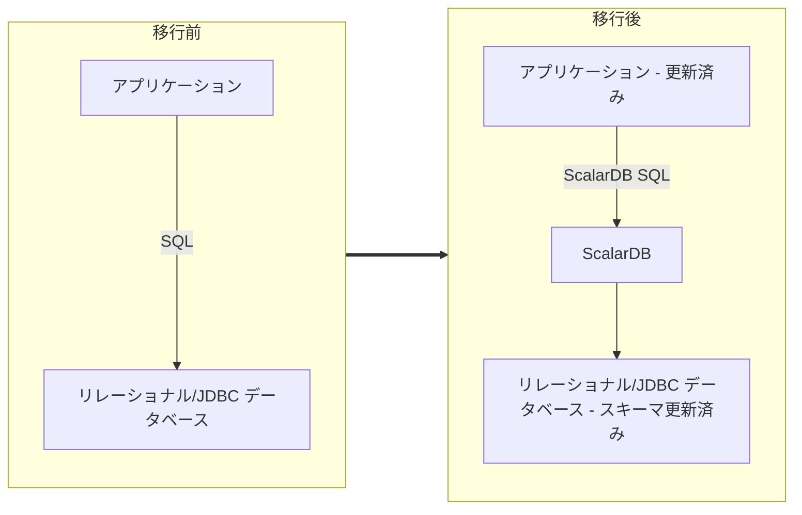

---
tags:
  - Enterprise Premium
---

# アプリケーションとデータベースを ScalarDB ベースの環境に移行する方法

このガイドでは、既存のアプリケーションとリレーショナルデータベースをそれぞれ ScalarDB ベースのアプリケーションと ScalarDB 管理データベースに移行する方法について説明します。

## 対象読者

このガイドの対象読者は、アプリケーション開発者とデータベース管理者です。このガイドの目的は、既存のアプリケーションとデータベースを移行する方法と、移行する条件を理解することです。

## 学習内容

- 移行の要件
- アプリケーションを移行する手順
- 移行のためにアプリケーションに加える変更

## アプリケーションを移行する手順

1. チェックリストの項目を確認します。
  - [移行チェックリスト](#移行チェックリスト)を参照して、データベースが移行可能であることを確認します。
2. アプリケーションを移行します (必要な場合)。
  - ScalarDB は、専用の SQL 文法を使用して選択、投影、結合操作を提供します。そのため、アプリケーション内の一部の SQL ステートメントは、文法レベルや集計処理などのロジックレベルなど、ScalarDB SQL 用に変更する必要がある場合があります。
  - 詳細については、[アプリケーションの移行方法](#アプリケーションの移行方法)を参照してください。
3. データベースをバックアップします。
  - データベースのインポートに使用する ScalarDB Schema Loader は、ScalarDB にインポートするときにデータベースのメタデータのみを変更しますが、予期しない事故を避けるためにバックアップする必要があります。
  - データベースの管理ガイドに従ってください。
4. ScalarDB 環境を設定します。
  - ScalarDB がターゲットデータベースにアクセスできるように設定ファイルを準備します。
  - ScalarDB 設定の詳細については、[ScalarDB 設定](../configurations.mdx)を参照してください。
5. データベースを ScalarDB にインポートします。
  - ターゲットスキーマとテーブルを定義するインポートスキーマファイルを準備します。スキーマとテーブルは、それぞれ ScalarDB 名前空間とテーブルにマップされます。一部のデータベースシステムでは、「スキーマ」は「データベース」の同義語であることに注意してください。
  - インポートオプション、作成した ScalarDB 設定ファイル、および準備したスキーマファイルを使用して、ScalarDB Schema Loader を実行します。
  - Schema Loader の使用方法の詳細については、[既存のテーブルをインポートするための Schema Loader の実行](../schema-loader-import.mdx#既存のテーブルをインポートするための-schema-loader-の実行)を参照してください。
6. アプリケーションを切り替えて動作を確認します。
  - これで、アプリケーションを ScalarDB ベースのアプリケーションに切り替えることができます。

## 移行チェックリスト

移行を開始する前に、次の質問を確認してください。これらの質問の答えが 1 つでも「いいえ」の場合は、移行を進める前にそれらの質問に対処する必要があります。

- ターゲットデータベースとバージョンは、[サポートされているリレーショナルデータベース (ScalarDB では JDBC データベースと呼ばれます) とバージョン](../scalardb-supported-databases.mdx#jdbc-データベース)の 1 つですか?
- ターゲットデータベースを管理できる完全な権限を持つアカウントがありますか? 詳細については、[一般的な要件](../database-configurations.mdx#一般的な要件)を参照してください。
- すべてのターゲットテーブルに主キーがありますか?
- 各列のデータ型は ScalarDB でサポートされていますか?サポートされているデータ型と、それらが ScalarDB データ型にマッピングされる方法については、[JDBC データベースから ScalarDB へのデータ型マッピング](../schema-loader-import.mdx#jdbc-データベースからscalardbへのデータ型マッピング)を参照してください。
- アプリケーション内のクエリの機能と文法は、[ScalarDB SQL 文法](./grammar.mdx)に準拠していますか? または、準拠していないクエリについては、ScalarDB 用に書き直すことができますか? 書き直しの例については、[アプリケーションの移行方法](#アプリケーションの移行方法)を参照してください。
- アプリケーションとデータベースをそれぞれ ScalarDB アプリケーションと ScalarDB 管理データベースに移行した後、データベースに直接アクセスすることはやめられますか? つまり、常に ScalarDB を介してデータベースにアクセスしても問題ありませんか?

## アプリケーションの移行方法

アプリケーション環境によっては、次の 3 つの側面でアプリケーションを移行する必要がある場合があります。

- 接続設定を変更します。
- ScalarDB SQL 文法に基づいて SQL ステートメントを変更します。
- SQL 変更の回避策がない場合は、アプリケーションロジックを変更します。

### 接続設定を変更します

アプリケーションが Java ベースである場合は、移行時に ScalarDB JDBC ドライバーを使用できます。ScalarDB JDBC ドライバーの依存関係を追加して接続 URL を書き換える方法の詳細については、[ScalarDB JDBC ガイド](./jdbc-guide.mdx)を参照してください。

アプリケーションが Java ベースでない場合は、ScalarDB に接続して gRPC 経由で SQL を発行できます。詳細については、[ScalarDB Cluster SQL gRPC API ガイド](../scalardb-cluster/scalardb-cluster-sql-grpc-api-guide.mdx)を参照してください。

### SQL 文の変更

SQL 文法の違いにより、アプリケーション内の SQL 文を変更する必要がある場合があります。一般的な例は次のとおりです。詳細については、[ScalarDB SQL 文法](./grammar.mdx)を参照してください。

- `JOIN` クエリ
  - ScalarDB は、結合するテーブルと `FROM` 句の条件を記述するスタイルの `JOIN` クエリのみをサポートします。
  - `JOIN` 条件とフィルタリングにもいくつかの制限があります。
  - 上記に基づいてクエリを書き直す必要がある場合があります。SQL クエリが ScalarDB 仕様に準拠していない場合は、アプリケーションレベルの変更を選択できます。
- `WHERE` 句
  - ScalarDB では、述語は `AND` 述語リストの OR 形式 (論理和標準形または DNF と呼ばれる) または `OR` 述語リストの AND 形式 (論理積標準形または CNF と呼ばれる) である必要があります。したがって、`WHERE` 句を変更する必要があるかもしれませんが、述語の任意の形式を DNF または CNF のいずれかに変更できることに注意してください。
  - 同様に、`IN` 句を使用する場合は、それらを DNF または CNF のいずれかに変更する必要があります。サブクエリを含む `IN` 句については、[アプリケーションロジックの変更](#アプリケーションロジックの変更)を参照してください。
  - ScalarDB は、`LIKE` 演算子と PostgreSQL および MySQL のエスケープシーケンスに類似した仕様を採用しています。データベースが PostgreSQL でも MySQL でもない場合は、`LIKE` 演算子を使用して述語を変更する必要がある場合があります。

### アプリケーションロジックの変更

ScalarDB SQL には、集計クエリやサブクエリなどの一部の機能が用意されていませんが、これらのクエリはアプリケーションレベルの実装に変更できます。一般的な変更手法は次のとおりです。

- 集計クエリ
  - `GROUP BY` 句のない `count()` や `sum()` などの単純な集計クエリの場合は、対象レコードに対して `SELECT` を使用し、その結果を使用してレコード数をカウントしたり合計を計算したりすることができます。
  - `GROUP BY` 集計クエリの場合は、まず `GROUP BY` 句を外し、すべての対象レコードに対して `SELECT` を使用します。次に、結果レコードをマルチマップデータ構造に配置し、`GROUP BY` 句で指定された列に基づいて分類します。この列はマルチマップのキーとして使用する必要があります。最後に、マルチマップ内の各キーのレコードを集計します。マルチマップには、[Guava](https://github.com/google/guava) などのライブラリを使用できます。
- サブクエリ
  - `IN` 句のサブクエリの場合、まずサブクエリで指定されたレコードに対して `SELECT` を使用し、次に結果値を `WHERE` 句の `OR` 述語として追加します。
  - その他のサブクエリの場合、基本的に、各クエリのレコードに対して `SELECT` を使用し、次にアプリケーションで結果レコードを結合またはフィルター処理する必要があります。
- 単一の更新クエリを使用した読み取り、変更、書き込み
  - `UPDATE` クエリには、多くの場合、増分または減分などの式が含まれます (例: `UPDATE table SET a = a + 1 WHERE ...`)。ScalarDB では、ターゲットレコードに対して `SELECT` を使用し、次に `UPDATE table SET a = 5 WHERE ...` のように、増分値を単一のトランザクションで定数として設定する必要があります。

## 制限事項

データ型の違いにより、ScalarDB では、ScalarDB データ型で許容されるサイズであっても、基になるデータベースの列の最大サイズを超えるデータを書き込むとエラーが発生します。逆に、いくつかの型では、基になるデータベースのデータが ScalarDB の最大サイズを超える場合があります。詳細については、[JDBC データベースから ScalarDB へのデータ型マッピング](../schema-loader-import.mdx#jdbc-データベースからscalardbへのデータ型マッピング)を参照してください。

## 参考文献

- [サポートされているデータベース](../scalardb-supported-databases.mdx)
- [ScalarDB SQL API ガイド](./sql-api-guide.mdx)
- [ScalarDB JDBC ガイド](./jdbc-guide.mdx)
- [ScalarDB SQL 文法](./grammar.mdx)
- [ScalarDB Schema Loader を使用して既存のテーブルを ScalarDB にインポートする](../schema-loader-import.mdx)
