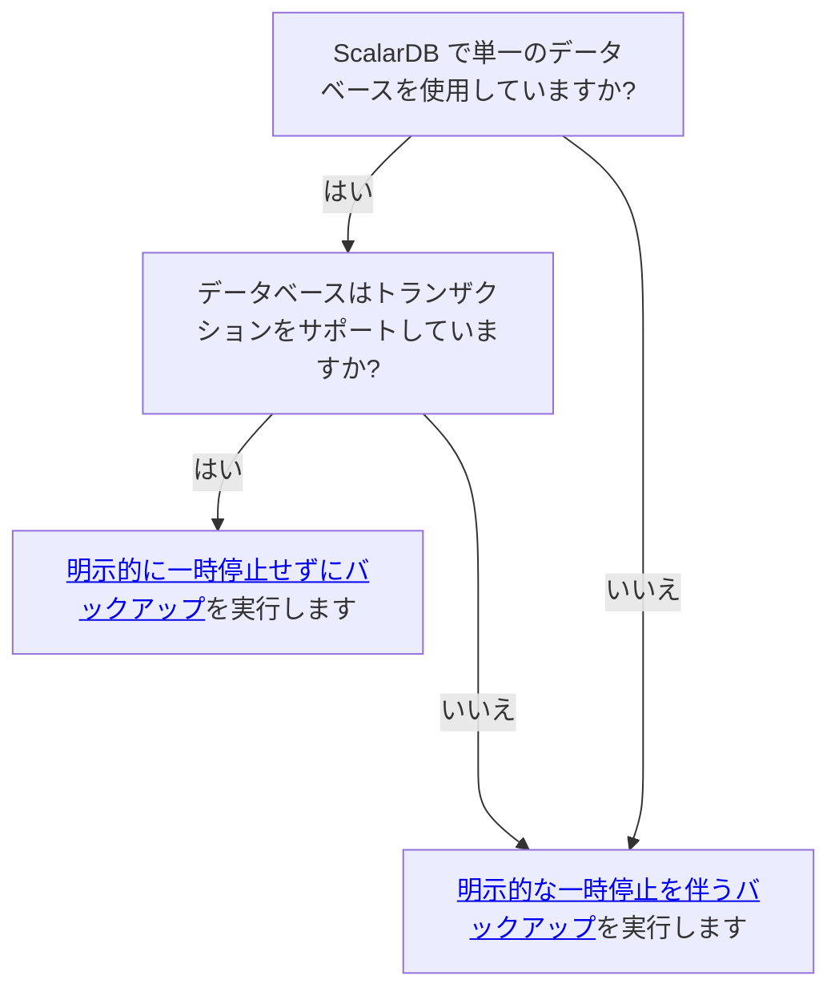

---
tags:
  - Community
  - Enterprise Standard
  - Enterprise Premium
displayed_sidebar: docsJapanese
---

# ScalarDB で使用されるデータベースのバックアップと復元方法

import Tabs from '@theme/Tabs';
import TabItem from '@theme/TabItem';
import TranslationBanner from '/src/components/_translation-ja-jp.mdx';

<TranslationBanner />

ScalarDB は非トランザクションデータベースまたはトランザクションデータベース上で非侵入的にトランザクション機能を提供するため、トランザクション的に一貫性のある方法でデータベースをバックアップおよび復元するには特別な注意が必要です。

このガイドでは、ScalarDB がサポートするデータベースをバックアップおよび復元する方法について説明します。

## バックアップを作成する

バックアップの作成方法は、使用しているデータベースと、複数のデータベースを使用しているかどうかによって異なります。次の決定ツリーは、どのアプローチを取るべきかを示しています。

### 明示的に一時停止せずにバックアップする

トランザクションをサポートする単一のデータベースで ScalarDB を使用している場合は、ScalarDB がトランザクションを受け入れ続けている間でも、データベースのバックアップを作成できます。

:::warning

バックアップを作成する前に、データベースのトランザクション的に一貫性のあるバックアップを作成する最も安全な方法を検討し、バックアッププロセスに関連するリスクを理解する必要があります。

:::

ScalarDB でバックアップを作成するための要件の1つは、ScalarDB が管理するすべてのテーブル (Coordinator テーブルを含む) のバックアップがトランザクション的に一貫しているか、トランザクション的に一貫した状態に自動的に回復可能である必要があることです。つまり、すべてのテーブルを1回のトランザクションでダンプして、一貫性のあるバックアップを作成する必要があります。

トランザクション的に一貫性のあるバックアップを作成する方法は、使用しているデータベースの種類によって異なります。データベースを選択して、ScalarDB のトランザクション的に一貫性のあるバックアップを作成する方法を確認してください。

:::note

以下にリストされているデータベース別のバックアップ方法は、ScalarDB がサポートするデータベースの一部の例にすぎません。

:::

<Tabs groupId="databases" queryString>
  <TabItem value="Amazon_RDS_or_Azure_Database_for_MySQL_or_PostgreSQL" label="Amazon RDS または Azure Database for MySQL または PostgreSQL" default>
    自動バックアップ機能を使用すると、バックアップ保持期間内の任意の時点に復元できます。
  </TabItem>
  <TabItem value="MySQL" label="MySQL">
    `--single-transaction` オプションを指定した `mysqldump` コマンドを使用します。
  </TabItem>
  <TabItem value="PostgreSQL" label="PostgreSQL">
    `pg_dump` コマンドを使用します。
  </TabItem>
  <TabItem value="SQLite" label="SQLite">
    [Special commands to sqlite3 (dot-commands)](https://www.sqlite.org/cli.html#special_commands_to_sqlite3_dot_commands_) で指定されているように、`.backup` コマンドを `.timeout` コマンドとともに使用します。

    例については、[BASH: SQLite3 .backup command](https://stackoverflow.com/questions/23164445/bash-sqlite3-backup-command) を参照してください。
  </TabItem>
  <TabItem value="YugabyteDB_Managed" label="YugabyteDB Managed">
    クラスターはバックアップポリシーに基づいて自動的にバックアップされ、これらのバックアップは特定の期間保持されます。オンデマンドバックアップを実行することもできます。バックアップの実行の詳細については、[YugabyteDB Managed: Back up and restore clusters](https://docs.yugabyte.com/preview/yugabyte-cloud/cloud-clusters/backup-clusters/)を参照してください。
  </TabItem>
</Tabs>

### 明示的に一時停止してバックアップする

トランザクション的に一貫性のあるバックアップを作成する別の方法は、ScalarDB インスタンスのクラスターに未処理のトランザクションがないときにバックアップを作成することです。バックアップの作成は、次の条件によって異なります。

- 基盤となるデータベースにポイントインタイムスナップショットまたはバックアップ機能がある場合は、未処理のトランザクションが存在しない期間にバックアップを作成できます。
- 基盤となるデータベースにポイントインタイムリストアまたはリカバリ (PITR) 機能がある場合は、一時停止期間内の未処理のトランザクションが存在しない時間 (できれば中間時間) にリストアポイントを設定できます。

:::note

PITR 機能を使用する場合は、NTP などのクロック同期を使用して、クライアントとサーバー間のクロックのずれを最小限に抑える必要があります。そうしないと、一時停止期間として取得される時間が、一時停止が実際に行われた時間と大きく異なる可能性があり、バックアップが進行中のトランザクションが存在する時点に復元される可能性があります。

また、クロック同期ではノード間のクロックを完全に同期できないため、十分な時間 (たとえば、5秒) 一時停止し、一時停止期間の中間時間を復元ポイントとして使用する必要があります。

:::

ScalarDB が未処理のリクエストを排出し、新しいリクエストの受け入れを停止して一時停止期間を作成できるようにするには、ScalarDB を使用するアプリケーションで [Scalar Admin](https://github.com/scalar-labs/scalar-admin) インターフェースを適切に実装するか、Scalar Admin インターフェースを実装する [ScalarDB Cluster](scalardb-cluster/index.mdx) を使用する必要があります。

[Scalar Admin クライアントツール](https://github.com/scalar-labs/scalar-admin/tree/main/java#scalar-admin-client-tool)を使用すると、進行中のトランザクションを失うことなく、Scalar Admin インターフェースを実装するノード、サーバー、またはアプリケーションを一時停止できます。

トランザクション的に一貫性のあるバックアップを作成する方法は、使用しているデータベースの種類によって異なります。データベースを選択して、ScalarDB のトランザクション的に一貫性のあるバックアップを作成する方法を確認します。

:::note

以下にリストされているデータベース別のバックアップ方法は、ScalarDB がサポートするデータベースの一部の例にすぎません。

:::

<Tabs groupId="databases" queryString>
  <TabItem value="DynamoDB" label="DynamoDB">
    DynamoDB テーブルに対して PITR 機能を有効にする必要があります。[ScalarDB Schema Loader](schema-loader.mdx) を使用してスキーマを作成する場合、ツールはデフォルトでテーブルの PITR 機能を有効にします。

    トランザクション的に一貫性のある復元ポイントを指定するには、[明示的な一時停止によるバックアップ](#明示的に一時停止してバックアップする)の説明に従って、ScalarDB を DynamoDB とともに使用しているアプリケーションを一時停止します。
  </TabItem>
  <TabItem value="Cosmos_DB_for_NoSQL" label="Cosmos DB for NoSQL">
    PITR 機能が有効になっている継続的バックアップポリシーを使用して、Cosmos DB for NoSQL アカウントを作成する必要があります。この機能を有効にすると、バックアップが継続的に作成されます。

    トランザクション的に一貫性のある復元ポイントを指定するには、[明示的に一時停止してバックアップする](#明示的に一時停止してバックアップする)の説明に従って、ScalarDB を Cosmos DB for NoSQL とともに使用しているアプリケーションを一時停止します。
  </TabItem>
  <TabItem value="Cassandra" label="Cassandra" default>
    Cassandra にはレプリケーション機能が組み込まれているため、必ずしもトランザクション的に一貫性のあるバックアップを作成する必要はありません。たとえば、レプリケーション係数が `3` に設定されていて、Cassandra クラスター内のノードの1つのデータのみが失われた場合、通常のトランザクション的に一貫性のないバックアップ (スナップショット) と修復機能を使用してノードを回復できるため、トランザクション的に一貫性のあるバックアップ (スナップショット) は必要ありません。

    ただし、クラスターノードのクォーラムでデータが失われた場合は、クラスターを特定のトランザクション的に一貫性のあるポイントに復元するために、トランザクション的に一貫性のあるバックアップ (スナップショット) が必要になります。

    トランザクション的に一貫性のあるクラスター全体のバックアップ (スナップショット) を作成するには、ScalarDB または [ScalarDB Cluster](scalardb-cluster/index.mdx) を使用しているアプリケーションを一時停止し、[明示的な一時停止によるバックアップ](#明示的に一時停止してバックアップする)の説明に従ってノードのバックアップ (スナップショット) を作成するか、Cassandra クラスターを停止してノード内のすべてのデータのコピーを作成し、クラスターを起動します。
  </TabItem>
  <TabItem value="YugabyteDB_Managed" label="YugabyteDB Managed">
    一時停止期間中にオンデマンドバックアップまたはスケジュールされたバックアップを実行できます。バックアップの実行の詳細については、[YugabyteDB Managed: Back up and restore clusters](https://docs.yugabyte.com/preview/yugabyte-cloud/cloud-clusters/backup-clusters/) を参照してください。
  </TabItem>
</Tabs>

## バックアップを復元する

トランザクション的に一貫性のあるバックアップを復元する方法は、使用しているデータベースの種類によって異なります。データベースを選択して、ScalarDB のトランザクション的に一貫性のあるバックアップを作成する方法を確認してください。

:::note

以下にリストされているデータベース別の復元方法は、ScalarDB がサポートするデータベースの一部の例にすぎません。

:::

<Tabs groupId="databases" queryString>
  <TabItem value="Amazon_RDS_or_Azure_Database_for_MySQL_or_PostgreSQL" label="Amazon RDS または Azure Database for MySQL または PostgreSQL" default>
    自動バックアップ機能を使用すると、バックアップ保持期間内の任意の時点に復元できます。
  </TabItem>
  <TabItem value="Cassandra" label="Cassandra">
    まず、Cassandra クラスターのすべてのノードを停止します。次に、`data`、`commitlog`、`hints` ディレクトリをクリーンアップし、各ノードにバックアップ (スナップショット) を配置します。

    各ノードにバックアップ (スナップショット) を配置したら、Cassandra クラスターのすべてのノードを起動します。
  </TabItem>
  <TabItem value="Cosmos_DB_for_NoSQL" label="Cosmos DB for NoSQL">
    [Azure portal を使用してアカウントを復元する](https://docs.microsoft.com/ja-jp/azure/cosmos-db/restore-account-continuous-backup#restore-account-portal)については、Azure の公式ドキュメントに従ってください。バックアップを復元した後、復元されたデータベースの [既定の整合性レベルを構成する](https://learn.microsoft.com/ja-jp/azure/cosmos-db/nosql/how-to-manage-consistency#configure-the-default-consistency-level)を `STRONG` に設定します。さらに、前述のように、一時停止期間の中間時点を復元ポイントとして使用する必要があります。

    ScalarDB は、ScalarDB Schema Loader を使用してスキーマを作成するときにインストールされるストアドプロシージャを使用して、Cosmos DB アダプターを実装します。ただし、Cosmos DB の PITR 機能では、ストアドプロシージャは復元されません。このため、復元後にすべてのテーブルに必要なストアドプロシージャを再インストールする必要があります。これは、ScalarDB Schema Loader を `--repair-all` オプションとともに使用することで実行できます。詳細については、[名前空間とテーブルを修復する](schema-loader.mdx#名前空間とテーブルを修復する)を参照してください。
  </TabItem>
  <TabItem value="DynamoDB" label="DynamoDB">
    [DynamoDB テーブルを特定の時点に復元](https://docs.aws.amazon.com/ja_jp/amazondynamodb/latest/developerguide/PointInTimeRecovery.Tutorial.html)については、公式の AWS ドキュメントに従ってください。ただし、テーブルはエイリアスを使用してのみ復元できることに注意してください。このため、エイリアスを使用してテーブルを復元し、元のテーブルを削除して、エイリアスを元の名前に変更し、同じ名前のテーブルを復元する必要があります。

    この手順を実行するには、次の手順を実行します。

    1. バックアップを作成します。
      1. 一時停止期間の中間時点を復元ポイントとして選択します。
      2. テーブル A の PITR を使用してテーブル B に復元します。
      3. 復元されたテーブル B のバックアップを作成します (バックアップの名前がバックアップ B であると仮定します)。
      4. テーブル B を削除します。
    2. バックアップを復元します。
      1. テーブル A を削除します。
      2. バックアップ B を使用して A という名前のテーブルを作成します。

:::note

* テーブルは一度に1つしか復元できないため、上記の手順はテーブルごとに実行する必要があります。
* 復元されたテーブルでは、PITR や自動スケーリングポリシーなどの設定がデフォルト値にリセットされるため、必要な設定を手動で行う必要があります。詳細については、公式 AWS ドキュメントの [DynamoDB を使用した DynamoDB テーブルのバックアップと復元の仕組み](https://docs.aws.amazon.com/ja_jp/amazondynamodb/latest/developerguide/CreateBackup.html#CreateBackup_HowItWorks-restore)を参照してください。

:::
  </TabItem>
  <TabItem value="MySQL" label="MySQL">
    `mysqldump` を使用してバックアップファイルを作成した場合は、[Reloading SQL-Format Backups](https://dev.mysql.com/doc/mysql-backup-excerpt/8.0/en/reloading-sql-format-dumps.html) で指定されているように、`mysql` コマンドを使用してバックアップを復元します。
  </TabItem>
  <TabItem value="PostgreSQL" label="PostgreSQL">
    `pg_dump` を使用してバックアップファイルを作成した場合は、[Restoring the Dump](https://www.postgresql.org/docs/current/backup-dump.html#BACKUP-DUMP-RESTORE) で指定されているように、`psql` コマンドを使用してバックアップを復元します。
  </TabItem>
  <TabItem value="SQLite" label="SQLite">
    [Special commands to sqlite3 (dot-commands)](https://www.sqlite.org/cli.html#special_commands_to_sqlite3_dot_commands_) で指定されているように、`.restore` コマンドを使用します。
  </TabItem>
  <TabItem value="YugabyteDB_Managed" label="YugabyteDB Managed">
    バックアップ保持期間内であれば、スケジュールされたバックアップまたはオンデマンドバックアップから復元できます。バックアップの実行の詳細については、[YugabyteDB Managed: Back up and restore clusters](https://docs.yugabyte.com/preview/yugabyte-cloud/cloud-clusters/backup-clusters/) を参照してください。
  </TabItem>
</Tabs>
