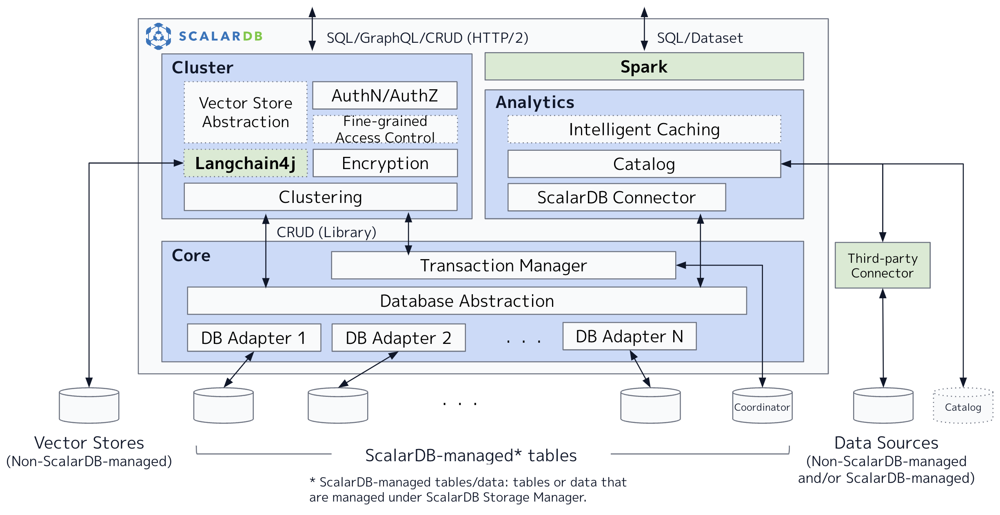

---
tags:
  - Community
  - Enterprise Standard
  - Enterprise Premium
displayed_sidebar: docsJapanese
---

# ScalarDB デザイン

import TranslationBanner from '/src/components/_translation-ja-jp.mdx';

<TranslationBanner />

このドキュメントでは、ScalarDB の設計と実装について簡単に説明します。ScalarDB の概要とその使用例については、[ScalarDB の概要](./overview.mdx) を参照してください。

## 全体的なアーキテクチャ

ScalarDB は、アプリケーションとデータベースの間に配置されるハイブリッドトランザクション/分析処理 (HTAP) ミドルウェアです。次の図に示すように、ScalarDB は、コア、クラスター、分析の 3つのコンポーネントで構成されています。ScalarDB は基本的に階層型アーキテクチャを採用しているため、クラスターコンポーネントと分析コンポーネントは、コアコンポーネントを使用して基盤となるデータベースとやり取りしますが、正確さを犠牲にすることなくパフォーマンスを最適化するためにコアコンポーネントをバイパスすることもあります。同様に、各コンポーネントも複数のレイヤーで構成されています。

## コンポーネント

次のサブセクションでは、各コンポーネントについて1つずつ説明します。

### コア

Apache 2 ライセンスの下でオープンソースソフトウェアとして提供される ScalarDB Core は、ScalarDB の不可欠な部分です。Core は、基礎となるデータベースを抽象化する抽象化レイヤーと、各データベースの抽象化を実装するアダプター (またはシム) を備えたデータベースマネージャーを提供します。さらに、データベース抽象化の上にトランザクションマネージャーを提供し、Scalar の新しい分散トランザクションプロトコルである [Consensus Commit](./consensus-commit.mdx) に基づいて、データベースに依存しないトランザクション管理を実現します。Core は、シンプルな CRUD インターフェースを提供するライブラリとして提供されます。

### クラスター

商用ライセンスでライセンスされている ScalarDB Cluster は、Core コンポーネントがクラスター化されたサーバーとして機能するためのクラスタリングソリューションを提供するコンポーネントです。Cluster は主に、多数の小規模なトランザクションおよび非トランザクションの読み取りと書き込みがある OLTP ワークロード向けに設計されています。さらに、認証、承認、保存時の暗号化、きめ細かなアクセス制御 (まだ開発中) などのエンタープライズ機能もいくつか提供しています。Cluster は Core コンポーネントと同じ CRUD インターフェースを提供するだけでなく、SQL および GraphQL インターフェースも提供しています。Cluster は Kubernetes Pod 内のコンテナーとして提供されるため、コンテナーを増やすことでパフォーマンスと可用性を高めることができます。

### 分析

商用ライセンスでライセンスされている ScalarDB Analytics は、Core コンポーネントによって管理されるデータ、または ScalarDB を使用しないアプリケーションによって管理されるデータに対してスケーラブルな分析処理を提供するコンポーネントです。Analytics は主に、少数の大規模な分析読み取りクエリがある OLAP ワークロード向けに設計されています。さらに、Spark を通じて SQL および DataSet API も提供されます。Analytics コンポーネントは Apache Spark エンジンにインストールできる Java パッケージとして提供されるため、Spark ワーカーノードを増やすことでパフォーマンスを向上させることができます。

## メタデータテーブル

ScalarDB は機能を提供するために基盤となるデータベース内でさまざまな種類のメタデータを管理しています。次の表は、各コンポーネントによって管理されるメタデータをまとめたものです。

| コンポーネント | メタデータテーブル                                                                                        | 用途                                                                    | 格納場所                                                    |
| ----------- | ------------------------------------------------------------------------------------------------------ | ----------------------------------------------------------------------- | --------------------------------------------------------- |
| Core        | `scalardb.metadata`                                                                                    | データベーススキーマ情報用                                                   | ScalarDB の下にあるすべてのデータベース内                       |
| Core        | `coordinator.state`                                                                                    | トランザクションステータス用                                                 | コーディネーターテーブルを格納するために指定された1つのデータベース内 |
| Core        | アプリケーション管理テーブル                                                                                | ログ先行書き込み (WAL) 情報用                                               | Consensus Commit によってアクセスされるすべてのテーブル内        |
| Cluster     | `scalardb.users`, `scalardb.namespace_privileges`, `scalardb.table_privileges`, `scalardb.auth_tokens` | [認証と承認](./scalardb-cluster/scalardb-auth-with-sql.mdx)用             | scalardb のシステム名前空間を格納するために指定された1つのデータベース内     |
| Cluster     | `scalardb.encrypted_columns`                                                                           | [保存時の暗号化](./scalardb-cluster/encrypt-data-at-rest.mdx)用            | scalardb のシステム名前空間を格納するために指定された1つのデータベース内     |
| Cluster     | `scalardb.abac_*`                                                                                      | [属性ベースのアクセス制御](./scalardb-cluster/authorize-with-abac.mdx)用     | scalardb のシステム名前空間を格納するために指定された1つのデータベース内     |
| Analytics   | カタログサーバーによって管理されるすべてのテーブル                                                              | [データカタログ](./scalardb-analytics/design.mdx#universal-data-catalog)用 | カタログサーバーデータベース内                                 |

:::note

ScalarDB を通じてアクセスされるデータベースのバックアップを取得する必要がある場合は、ScalarDB によって管理されるメタデータのバックアップも取得する必要があります。詳細については、[ScalarDB で使用されるデータベースのバックアップと復元方法](./backup-restore.mdx)を参照してください。

:::

## 制限事項

ScalarDB はアプリケーションとデータベースの間で動作するため、いくつかの制限があります。このセクションでは、ScalarDB の制限事項をまとめています。

### アプリケーションは ScalarDB をバイパスしてトランザクションや分析クエリを実行することはできません

ScalarDB Core は、データベースの外部で動作し、データベースに依存しないトランザクション機能を提供します。したがって、アプリケーションはトランザクションを実行するために ScalarDB とやり取りする必要があります。そうでなければ、ScalarDB はスナップショットやシリアライザブル分離などのトランザクションの正確性を保証できません。詳細については、[Consensus Commit](./consensus-commit.mdx) を参照してください。

同様に、ScalarDB Analytics は、データベースの外部で動作し、スケーラブルな分析クエリ処理機能を提供します。したがって、アプリケーションは分析クエリを実行するために ScalarDB Analytics とやり取りする必要があります。そうでなければ、ScalarDB は読み取りコミットされた分離などの正確性を保証できません。詳細については、[ScalarDB Analytics の設計](./scalardb-analytics/design.mdx)を参照してください。

### アプリケーションは基盤となるデータベースのすべての機能を使用できません

ScalarDB は基盤となるデータベースの抽象化レイヤーとして機能するため、アプリケーションはこれらのデータベースのすべての機能やデータ型を使用することはできません。例えば、ScalarDB は Oracle PL/SQL のようなデータベース固有の機能をサポートしていません。

ScalarDB は、ほとんどのサポートされているデータベースで一般的に見られる機能を提供するように強化されています。機能の一覧については、[ScalarDB の機能](./features.mdx)を参照してください。今後のリリースで予定されている機能については、[ロードマップ](./roadmap.mdx)を参照してください。

## 詳細

ScalarDB の設計と実装の詳細については、次のドキュメントを参照してください。

- **Speaker Deck プレゼンテーション:** [ScalarDB: Universal Transaction Manager](https://speakerdeck.com/scalar/scalar-db-universal-transaction-manager)
- **Speaker Deck プレゼンテーション:** [ScalarDB を用いたマイクロサービスにおけるデータ管理](https://speakerdeck.com/scalar/scalardbwoyong-itamaikurosabisuniokerudetaguan-li-database-engineering-meetup-number-2)

さらに、VLDB 2023 カンファレンスでは以下の資料が発表されました。

- **Speaker Deck プレゼンテーション:** [ScalarDB: Universal Transaction Manager for Polystores](https://speakerdeck.com/scalar/scalardb-universal-transaction-manager-for-polystores-vldb23)
- **詳細な論文:** [ScalarDB: Universal Transaction Manager for Polystores](https://www.vldb.org/pvldb/vol16/p3768-yamada.pdf)
